> **NuMicro® Family**
>
> **Arm® Cortex®-M23-based Microcontroller**

**M2003 Series**

**Technical Reference Manual**

*The information described in this document is the exclusive
intellectual property of  
Nuvoton Technology Corporation and shall not be reproduced without
permission from Nuvoton.*

*Nuvoton is providing this document only for reference purposes of
NuMicro® microcontroller and microprocessor based system
design. Nuvoton assumes no responsibility for errors or omissions.*

*All data and specifications are subject to change without notice.*

For additional information or questions, please contact: Nuvoton
Technology Corporation.

[<u>www.nuvoton.com</u>](http://www.nuvoton.com)

**TABLE OF CONTENTS**

[1 GENERAL DESCRIPTION [14](#general-description)](#general-description)

[2 FEATURES [15](#features)](#features)

[2.1 M2003 Series Features
[15](#m2003-series-features)](#m2003-series-features)

[3 PARTS INFORMATION [20](#parts-information)](#parts-information)

[3.1 M2003 Series Package Type
[20](#m2003-series-package-type)](#m2003-series-package-type)

[3.2 M2003 Series Naming Rule
[21](#m2003-series-naming-rule)](#m2003-series-naming-rule)

[3.3 M2003 Series Selection Guide
[22](#m2003-series-selection-guide)](#m2003-series-selection-guide)

[4 PIN CONFIGURATION [23](#pin-configuration)](#pin-configuration)

[4.1 M2003 Pin Configuration
[23](#m2003-pin-configuration)](#m2003-pin-configuration)

[4.1.1 M2003 Series Pin Diagram
[23](#m2003-series-pin-diagram)](#m2003-series-pin-diagram)

[4.1.2 M2003 Series Multi-function Pin Diagram
[24](#m2003-series-multi-function-pin-diagram)](#m2003-series-multi-function-pin-diagram)

[4.2 M2003 Series Pin Mapping
[27](#m2003-series-pin-mapping)](#m2003-series-pin-mapping)

[4.3 Pin Functional Description
[28](#pin-functional-description)](#pin-functional-description)

[5 BLOCK DIAGRAM [30](#block-diagram)](#block-diagram)

[5.1 M2003 Series Block Diagram
[30](#m2003-series-block-diagram)](#m2003-series-block-diagram)

[6 FUNCTIONAL DESCRIPTION
[31](#functional-description)](#functional-description)

[6.1 Arm® Cortex®-M23 Core
[31](#arm-cortex-m23-core)](#arm-cortex-m23-core)

[6.2 System Manager [33](#system-manager)](#system-manager)

[6.2.1 Overview [33](#overview)](#overview)

[6.2.2 Reset [33](#reset)](#reset)

[6.2.3 Power Modes and Wake-up Sources
[39](#power-modes-and-wake-up-sources)](#power-modes-and-wake-up-sources)

[6.2.4 System Memory Map [42](#system-memory-map)](#system-memory-map)

[6.2.5 SRAM Memory Organization
[42](#sram-memory-organization)](#sram-memory-organization)

[6.2.6 Register Lock Control
[45](#register-lock-control)](#register-lock-control)

[6.2.7 Register Map [47](#register-map)](#register-map)

[6.2.8 Register Description
[48](#register-description)](#register-description)

[6.2.9 System Timer (SysTick)
[71](#system-timer-systick)](#system-timer-systick)

[6.2.10 Nested Vectored Interrupt Controller (NVIC)
[76](#nested-vectored-interrupt-controller-nvic)](#nested-vectored-interrupt-controller-nvic)

[6.2.11 System Control Register Map
[101](#system-control-register-map)](#system-control-register-map)

[6.3 Clock Controller [111](#clock-controller)](#clock-controller)

[6.3.1 Overview [111](#overview-1)](#overview-1)

[6.3.2 Clock Generator [114](#clock-generator)](#clock-generator)

[6.3.3 System Clock and SysTick Clock
[114](#system-clock-and-systick-clock)](#system-clock-and-systick-clock)

[6.3.4 Peripherals Clock [115](#peripherals-clock)](#peripherals-clock)

[6.3.5 Power-down Mode Clock
[115](#power-down-mode-clock)](#power-down-mode-clock)

[6.3.6 Clock Output [116](#clock-output)](#clock-output)

[6.3.7 Register Map [117](#register-map-1)](#register-map-1)

[6.3.8 Register Description
[118](#register-description-1)](#register-description-1)

[6.4 Flash Memory Controller (FMC)
[143](#flash-memory-controller-fmc)](#flash-memory-controller-fmc)

[6.4.1 Overview [143](#overview-2)](#overview-2)

[6.4.2 Features [143](#features-1)](#features-1)

[6.4.3 Block Diagram
[143](#supports-32-kbytes-application-rom-apromsupports-4-kbytes-loader-rom-ldromsupports-1-kbytes-security-protection-rom-sprom-to-conceal-user-programsupports-16-bytes-user-configuration-block-to-control-system-initiationsupports-512-bytes-page-erase-for-all-embedded-flashsupports-32-bit-flash-programming-function-supports-fast-flash-programming-verification-functionsupports-crc32-checksum-calculation-functionsupports-flash-all-one-verification-functionsupports-in-system-programming-isp-in-application-programming-iap-to-update-embedded-flash-memoryblock-diagram)](#supports-32-kbytes-application-rom-apromsupports-4-kbytes-loader-rom-ldromsupports-1-kbytes-security-protection-rom-sprom-to-conceal-user-programsupports-16-bytes-user-configuration-block-to-control-system-initiationsupports-512-bytes-page-erase-for-all-embedded-flashsupports-32-bit-flash-programming-function-supports-fast-flash-programming-verification-functionsupports-crc32-checksum-calculation-functionsupports-flash-all-one-verification-functionsupports-in-system-programming-isp-in-application-programming-iap-to-update-embedded-flash-memoryblock-diagram)

[6.4.4 Functional Description
[145](#functional-description-1)](#functional-description-1)

[6.4.5 Register Map [163](#register-map-2)](#register-map-2)

[6.4.6 Register Description
[164](#register-description-2)](#register-description-2)

[6.5 General Purpose I/O (GPIO)
[173](#general-purpose-io-gpio)](#general-purpose-io-gpio)

[6.5.1 Overview [173](#overview-3)](#overview-3)

[6.5.2 Features [173](#features-2)](#features-2)

[6.5.3 Block Diagram [174](#block-diagram-1)](#block-diagram-1)

[6.5.4 Basic Configuration
[174](#basic-configuration)](#basic-configuration)

[6.5.5 Functional Description
[175](#functional-descriptioninput-mode)](#functional-descriptioninput-mode)

[6.5.6 Register Map [179](#register-map-3)](#register-map-3)

[6.5.7 Register Description
[181](#register-description-3)](#register-description-3)

[6.6 Timer Controller (TMR)
[196](#timer-controller-tmr)](#timer-controller-tmr)

[6.6.1 Overview [196](#overview-4)](#overview-4)

[6.6.2 Features [196](#features-3)](#features-3)

[6.6.3 Block Diagram [197](#block-diagram-2)](#block-diagram-2)

[6.6.4 Basic Configuration
[199](#basic-configuration-1)](#basic-configuration-1)

[6.6.5 Functional Description
[199](#functional-description-2)](#functional-description-2)

[6.6.6 Register Map [206](#register-map-4)](#register-map-4)

[6.6.7 Register Description
[208](#register-description-4)](#register-description-4)

[6.7 PWM Generator and Capture Timer (PWM)
[222](#pwm-generator-and-capture-timer-pwm)](#pwm-generator-and-capture-timer-pwm)

[6.7.1 Overview [222](#_Toc172017434)](#_Toc172017434)

[6.7.2 Features [222](#_Toc172017435)](#_Toc172017435)

[6.7.3 Block Diagram [223](#_Toc172017436)](#_Toc172017436)

[6.7.4 Basic Configuration [226](#_Toc172017437)](#_Toc172017437)

[6.7.5 Functional Description [226](#_Toc172017438)](#_Toc172017438)

[6.7.6 Register Map [247](#_Toc172017439)](#_Toc172017439)

[6.7.7 Register Description
[250](#register-descriptionpwm-control-register-0-pwm_ctl0)](#register-descriptionpwm-control-register-0-pwm_ctl0)

[6.8 Watchdog Timer (WDT)
[297](#watchdog-timer-wdt)](#watchdog-timer-wdt)

[6.8.1 Overview [297](#_Toc172017442)](#_Toc172017442)

[6.8.2 Features [297](#_Toc172017443)](#_Toc172017443)

[6.8.3 Block Diagram [297](#_Toc172017444)](#_Toc172017444)

[6.8.4 Basic Configuration [297](#_Toc172017445)](#_Toc172017445)

[6.8.5 Functional Description [298](#_Toc172017446)](#_Toc172017446)

[6.8.6 Register Map [301](#_Toc172017447)](#_Toc172017447)

[6.8.7 Register Description
[302](#register-descriptionwdt-control-register-wdt_ctl)](#register-descriptionwdt-control-register-wdt_ctl)

[6.9 Window Watchdog Timer (WWDT)
[306](#window-watchdog-timer-wwdt)](#window-watchdog-timer-wwdt)

[6.9.1 Overview [306](#_Toc172017450)](#_Toc172017450)

[6.9.2 Features [306](#_Toc172017451)](#_Toc172017451)

[6.9.3 Block Diagram [306](#_Toc172017452)](#_Toc172017452)

[6.9.4 Basic Configuration [306](#_Toc172017453)](#_Toc172017453)

[6.9.5 Functional Description [307](#_Toc172017454)](#_Toc172017454)

[6.9.6 Register Map [311](#_Toc172017455)](#_Toc172017455)

[6.9.7 Register Description
[312](#register-descriptionwwdt-reload-counter-register-wwdt_rldcnt)](#register-descriptionwwdt-reload-counter-register-wwdt_rldcnt)

[6.10 Enhanced Input Capture Timer (ECAP)
[317](#enhanced-input-capture-timer-ecap)](#enhanced-input-capture-timer-ecap)

[6.10.1 Overview [317](#overview-5)](#overview-5)

[6.10.2 Features [317](#features-4)](#features-4)

[6.10.3 Block Diagram [317](#block-diagram-3)](#block-diagram-3)

[6.10.4 Basic Configuration
[317](#basic-configuration-2)](#basic-configuration-2)

[6.10.5 Functional Description
[318](#functional-description-3)](#functional-description-3)

[6.10.6 Register Map [324](#register-map-5)](#register-map-5)

[6.10.7 Register Description
[325](#register-description-5)](#register-description-5)

[6.11 UART Interface Controller (UART)
[338](#uart-interface-controller-uart)](#uart-interface-controller-uart)

[6.11.1 Overview [338](#_Toc172017466)](#_Toc172017466)

[6.11.2 Features [338](#_Toc172017467)](#_Toc172017467)

[6.11.3 Block Diagram [339](#_Toc172017468)](#_Toc172017468)

[6.11.4 Basic Configuration [342](#_Toc172017469)](#_Toc172017469)

[6.11.5 Functional Description [343](#_Toc172017470)](#_Toc172017470)

[6.11.6 Register Map [358](#_Toc172017471)](#_Toc172017471)

[6.11.7 Register Description
[359](#register-descriptionuart-receivetransmit-buffer-register-uart_dat)](#register-descriptionuart-receivetransmit-buffer-register-uart_dat)

[6.12 I2C Serial Interface Controller (I2C)
[385](#i2c-serial-interface-controller-i2c)](#i2c-serial-interface-controller-i2c)

[6.12.1 Overview [385](#overview-6)](#overview-6)

[6.12.2 Features [385](#features-5)](#features-5)

[6.12.3 Block Diagram [386](#block-diagram-4)](#block-diagram-4)

[6.12.4 Basic Configuration
[386](#basic-configuration-3)](#basic-configuration-3)

[6.12.5 Functional Description
[386](#functional-description-4)](#functional-description-4)

[6.12.6 Register Map [404](#register-map-6)](#register-map-6)

[6.12.7 Register Description
[405](#register-description-6)](#register-description-6)

[6.13 USCI - Universal Serial Control Interface Controller (USCI)
[419](#usci---universal-serial-control-interface-controller-usci)](#usci---universal-serial-control-interface-controller-usci)

[6.13.1 Overview [419](#_Toc172017482)](#_Toc172017482)

[6.13.2 Features [419](#_Toc172017483)](#_Toc172017483)

[6.13.3 Block Diagram [419](#_Toc172017484)](#_Toc172017484)

[6.13.4 Functional Description [419](#_Toc172017485)](#_Toc172017485)

[6.14 USCI – UART Mode [430](#usci-uart-mode)](#usci-uart-mode)

[6.14.1 Overview [430](#overview-7)](#overview-7)

[6.14.2 Features [430](#features-6)](#features-6)

[6.14.3 Block Diagram
[430](#supports-one-transmit-buffer-and-two-receive-buffer-for-data-payloadsupports-hardware-auto-flow-control-functionsupports-programmable-baud-rate-generatorsupport-9-bit-data-transfer-support-9-bit-rs-485baud-rate-detection-possible-by-built-in-capture-event-of-baud-rate-generatorsupports-wake-up-function-data-and-ncts-wakeup-onlyblock-diagram)](#supports-one-transmit-buffer-and-two-receive-buffer-for-data-payloadsupports-hardware-auto-flow-control-functionsupports-programmable-baud-rate-generatorsupport-9-bit-data-transfer-support-9-bit-rs-485baud-rate-detection-possible-by-built-in-capture-event-of-baud-rate-generatorsupports-wake-up-function-data-and-ncts-wakeup-onlyblock-diagram)

[6.14.4 Basic Configuration
[430](#basic-configuration-4)](#basic-configuration-4)

[6.14.5 Functional Description
[431](#clock-source-configurationenable-usci0-clock-usci0cken-on-clk_apbclk18-register.reset-usci0-usci0rst-on-sys_iprst28-register.enable-usci0_uart-function-uuart_ctl20-register-uuart_ctl203b010.functional-description)](#clock-source-configurationenable-usci0-clock-usci0cken-on-clk_apbclk18-register.reset-usci0-usci0rst-on-sys_iprst28-register.enable-usci0_uart-function-uuart_ctl20-register-uuart_ctl203b010.functional-description)

[6.14.6 Register Map [439](#register-map-7)](#register-map-7)

[6.14.7 Register Description
[440](#register-description-7)](#register-description-7)

[6.15 USCI - SPI Mode [461](#usci---spi-mode)](#usci---spi-mode)

[6.15.1 Overview [461](#_Toc172017495)](#_Toc172017495)

[6.15.2 Features [461](#_Toc172017496)](#_Toc172017496)

[6.15.3 Block Diagram [462](#_Toc172017497)](#_Toc172017497)

[6.15.4 Basic Configuration [462](#_Toc172017498)](#_Toc172017498)

[6.15.5 Functional Description [462](#_Toc172017499)](#_Toc172017499)

[6.15.6 Register Map [475](#_Toc172017500)](#_Toc172017500)

[6.15.7 Register Description
[476](#register-descriptionusci-control-register-uspi_ctl)](#register-descriptionusci-control-register-uspi_ctl)

[6.16 USCI - I2C Mode
[497](#usci---i2c-mode)](#usci---i2c-mode)

[6.16.1 Overview [497](#_Toc172017503)](#_Toc172017503)

[6.16.2 Features [497](#_Toc172017504)](#_Toc172017504)

[6.16.3 Block Diagram [498](#_Toc172017505)](#_Toc172017505)

[6.16.4 Basic Configuration [498](#_Toc172017506)](#_Toc172017506)

[6.16.5 Functional Description [498](#_Toc172017507)](#_Toc172017507)

[6.16.6 Register Map [517](#_Toc172017508)](#_Toc172017508)

[6.16.7 Register Description
[518](#register-descriptionusci-control-register-ui2c_ctl)](#register-descriptionusci-control-register-ui2c_ctl)

[6.17 Analog-to-Digital Converter (ADC)
[537](#analog-to-digital-converter-adc)](#analog-to-digital-converter-adc)

[6.17.1 Overview [537](#overview-8)](#overview-8)

[6.17.2 Features [537](#features-7)](#features-7)

[6.17.3 Block Diagram [537](#block-diagram-5)](#block-diagram-5)

[6.17.4 Basic Configuration
[538](#basic-configuration-5)](#basic-configuration-5)

[6.17.5 Functional Description
[538](#functional-description-5)](#functional-description-5)

[6.17.6 Register Map [546](#register-map-8)](#register-map-8)

[6.17.7 Register Description
[547](#register-description-8)](#register-description-8)

[6.18 Peripherals Interconnection
[560](#peripherals-interconnection)](#peripherals-interconnection)

[6.18.1 Overview [560](#overview-9)](#overview-9)

[6.18.2 Peripherals Interconnect Matrix Table
[560](#peripherals-interconnect-matrix-table)](#peripherals-interconnect-matrix-table)

[6.18.3 Functional Description
[560](#functional-description-6)](#functional-description-6)

[7 APPLICATION CIRCUIT
[562](#application-circuit)](#application-circuit)

[7.1 Power Supply Scheme [562](#_Toc172017523)](#_Toc172017523)

[7.2 Peripheral Application Scheme
[563](#_Toc172017524)](#_Toc172017524)

[8 ELECTRICAL CHARACTERISTIC
[564](#electrical-characteristic)](#electrical-characteristic)

[9 PACKAGE DIMENSIONS [565](#package-dimensions)](#package-dimensions)

[9.1 TSSOP 20 (4.4 x 6.5 mm)
[565](#tssop-20-4.4-x-6.5-mm)](#tssop-20-4.4-x-6.5-mm)

[9.2 20-pin QFN (3.0 x 3.0 mm)
[566](#pin-qfn-3.0-x-3.0-mm)](#pin-qfn-3.0-x-3.0-mm)

[10 ABBREVIATIONS [567](#abbreviations)](#abbreviations)

[10.1 Abbreviations [567](#abbreviations-1)](#abbreviations-1)

[11 REVISION HISTORY [569](#revision-history)](#revision-history)

> **List of Figures**
>
> [Figure 4.1‑1 M2003 Series TSSOP20-pin Diagram
> [24](#_Toc9861705)](#_Toc9861705)
>
> [Figure 4.1‑2 M2003 Series QFN20-pin Diagram
> [24](#_Toc9861707)](#_Toc9861707)
>
> [Figure 4.1‑3 TSSOP20-Pin Diagram
> [25](#_Toc154500482)](#_Toc154500482)
>
> [Figure 4.1‑4 QFN20-Pin Multi-function Pin Diagram
> [26](#_Toc9861713)](#_Toc9861713)
>
> [Figure 5.1‑1 M2003 Series Block Diagram
> [31](#_Toc173751170)](#_Toc173751170)
>
> [Figure 6.1‑1 Cortex®-M23 Block Diagram
> [32](#_Ref493538026)](#_Ref493538026)
>
> [Figure 6.2‑1 System Reset Sources
> [35](#_Toc459362145)](#_Toc459362145)
>
> [Figure 6.2‑2 nRESET Reset Waveform
> [37](#_Ref465345616)](#_Ref465345616)
>
> [Figure 6.2‑3 nRESET Reset Mode Enable Control Waveform
> [37](#_Ref40882177)](#_Ref40882177)
>
> [Figure 6.2‑4 Power-on Reset (POR) Waveform
> [38](#_Ref465345868)](#_Ref465345868)
>
> [Figure 6.2‑5 Low Voltage Reset (LVR) Waveform
> [38](#_Ref465346112)](#_Ref465346112)
>
> [Figure 6.2‑6 Brown-out Detector (BOD) Waveform
> [39](#_Ref465353816)](#_Ref465353816)
>
> [Figure 6.2‑7 Power Mode State Machine
> [41](#_Toc459362151)](#_Toc459362151)
>
> [Figure 6.2‑8 SRAM Block Diagram [44](#_Toc173751179)](#_Toc173751179)
>
> [Figure 6.2‑9 SRAM Memory Organization
> [45](#_Toc173751180)](#_Toc173751180)
>
> [Figure 6.3‑1 Clock Generator Global View Diagram (1/3)
> [113](#_Toc173751181)](#_Toc173751181)
>
> [Figure 6.3‑2 Clock Generator Global View Diagram (2/3)
> [114](#_Toc173751182)](#_Toc173751182)
>
> [Figure 6.3‑3 Clock Generator Block Diagram
> [115](#_Toc173751183)](#_Toc173751183)
>
> [Figure 6.3‑4 System Clock Block Diagram
> [116](#_Toc173751184)](#_Toc173751184)
>
> [Figure 6.3‑5 SysTick Clock Control Block Diagram
> [116](#_Toc173751185)](#_Toc173751185)
>
> [Figure 6.3‑6 Clock Output Block Diagram
> [117](#_Toc173751186)](#_Toc173751186)
>
> [Figure 6.4‑1 Flash Memory Controller Block Diagram
> [145](#_Toc173751187)](#_Toc173751187)
>
> [Figure 6.4‑2 APROM Examples (32 Kbytes)
> [146](#_Toc173751188)](#_Toc173751188)
>
> [Figure 6.4‑3 32 Kbytes Flash SPROM Security Mode
> [152](#_Toc173751189)](#_Toc173751189)
>
> [Figure 6.4‑4 Flash Memory Map [153](#_Toc173751190)](#_Toc173751190)
>
> [Figure 6.4‑5 System Memory Map with IAP Mode
> [154](#_Toc173751191)](#_Toc173751191)
>
> [Figure 6.4‑6 LDROM with IAP Mode
> [155](#_Toc173751192)](#_Toc173751192)
>
> [Figure 6.4‑7 APROM with IAP Mode
> [155](#_Toc173751193)](#_Toc173751193)
>
> [Figure 6.4‑8 ISP Procedure Example
> [157](#_Toc173751194)](#_Toc173751194)
>
> [Figure 6.4‑9 ISP 32-bit Programming Procedure
> [159](#_Toc173751195)](#_Toc173751195)
>
> [Figure 6.4‑10 Fast Flash Programming Verification Flow
> [160](#_Toc173751196)](#_Toc173751196)
>
> [Figure 6.4‑11 Verification Flow
> [160](#_Toc173751197)](#_Toc173751197)
>
> [Figure 6.4‑12 Flash CRC32 Checksum Calculation
> [161](#_Toc173751198)](#_Toc173751198)
>
> [Figure 6.5‑1 GPIO Controller Block Diagram
> [175](#_Toc173751199)](#_Toc173751199)
>
> [Figure 6.6‑1 Timer Controller Block Diagram
> [198](#_Toc488049084)](#_Toc488049084)
>
> [Figure 6.6‑2 Clock Source of Timer Controller
> [199](#_Ref138768415)](#_Ref138768415)
>
> [Figure 6.6‑3 Continuous Counting Mode
> [202](#_Toc173751202)](#_Toc173751202)
>
> [Figure 6.6‑4 External Capture Mode
> [203](#_Toc173751203)](#_Toc173751203)
>
> [Figure 6.6‑5 External Capture Trigger Length
> [204](#_Toc173751204)](#_Toc173751204)
>
> [Figure 6.6‑6 Reset Counter Mode
> [204](#_Toc488049090)](#_Toc488049090)
>
> [Figure 6.6‑7 Internal Timer Trigger
> [205](#_Toc488049091)](#_Toc488049091)
>
> [Figure 6.6‑8 Inter-Timer Trigger Capture Timing
> [206](#_Toc173751207)](#_Toc173751207)
>
> [Figure 6.7‑1 PWM Generator Overview Block Diagram
> [224](#_Toc173751208)](#_Toc173751208)
>
> [Figure 6.7‑2 PWM System Clock Source Control
> [225](#_Toc173751209)](#_Toc173751209)
>
> [Figure 6.7‑3 PWM Clock Source Control
> [225](#_Toc173751210)](#_Toc173751210)
>
> [Figure 6.7‑4 PWM Independent Mode Architecture Diagram
> [226](#_Toc173751211)](#_Toc173751211)
>
> [Figure 6.7‑5 PWM Complementary Mode Architecture Diagram
> [227](#_Toc173751212)](#_Toc173751212)
>
> [Figure 6.7‑6 PWM0_CH0 Prescaler Waveform in Up Counter Type
> [228](#_Toc173751213)](#_Toc173751213)
>
> [Figure 6.7‑7 PWM Counter Waveform when Setting clear counter
> [228](#_Toc173751214)](#_Toc173751214)
>
> [Figure 6.7‑8 PWM Up Counter Type
> [229](#_Toc173751215)](#_Toc173751215)
>
> [Figure 6.7‑9 PWM Down Counter Type
> [229](#_Toc173751216)](#_Toc173751216)
>
> [Figure 6.7‑10 PWM Up-Down Counter Type
> [230](#_Toc173751217)](#_Toc173751217)
>
> [Figure 6.7‑11 PWM Compared point Events in Up-Down Counter Type
> [231](#_Toc173751218)](#_Toc173751218)
>
> [Figure 6.7‑12 PWM Double Buffering Illustration
> [232](#_Toc173751219)](#_Toc173751219)
>
> [Figure 6.7‑13 Period Loading in Up-Count Mode
> [232](#_Toc173751220)](#_Toc173751220)
>
> [Figure 6.7‑14 Immediately Loading in Up-Count Mode
> [233](#_Toc173751221)](#_Toc173751221)
>
> [Figure 6.7‑15 Center Loading in Up-Down-Count Mode
> [234](#_Toc173751222)](#_Toc173751222)
>
> [Figure 6.7‑16 PWM Pulse Generation
> [235](#_Toc173751223)](#_Toc173751223)
>
> [Figure 6.7‑17 PWM 0% to 100% Pulse Generation
> [235](#_Toc173751224)](#_Toc173751224)
>
> [Figure 6.7‑18 PWM Independent Mode Waveform
> [236](#_Toc173751225)](#_Toc173751225)
>
> [Figure 6.7‑19 PWM Complementary Mode Waveform
> [237](#_Toc173751226)](#_Toc173751226)
>
> [Figure 6.7‑20 PWM_CH0 Output Control in Independent Mode
> [237](#_Toc173751227)](#_Toc173751227)
>
> [Figure 6.7‑21 PWM_CH0 and PWM_CH1 Output Control in Complementary
> Mode [238](#_Toc173751228)](#_Toc173751228)
>
> [Figure 6.7‑22 Dead-Time Insertion
> [238](#_Toc173751229)](#_Toc173751229)
>
> [Figure 6.7‑23 Illustration of Mask Control Waveform
> [239](#_Toc173751230)](#_Toc173751230)
>
> [Figure 6.7‑24 Brake Noise Filter Block Diagram
> [239](#_Toc173751231)](#_Toc173751231)
>
> [Figure 6.7‑25 Brake Block Diagram for PWM_CH0 and PWM_CH1 Pair
> [240](#_Toc173751232)](#_Toc173751232)
>
> [Figure 6.7‑26 Edge Detector Waveform for PWM_CH0 and PWM_CH1 Pair
> [241](#_Toc173751233)](#_Toc173751233)
>
> [Figure 6.7‑27 Level Detector Waveform for PWM_CH0 and PWM_CH1 Pair
> [241](#_Toc173751234)](#_Toc173751234)
>
> [Figure 6.7‑28 Brake Source Block Diagram
> [242](#_Toc173751235)](#_Toc173751235)
>
> [Figure 6.7‑29 Brake System Fail Block Diagram
> [242](#_Toc173751236)](#_Toc173751236)
>
> [Figure 6.7‑30 Initial State and Polarity Control with Rising Edge
> Dead-Time Insertion [243](#_Toc173751237)](#_Toc173751237)
>
> [Figure 6.7‑31 PWM_CH0 and PWM_CH1 Pair Interrupt Architecture Diagram
> [244](#_Toc173751238)](#_Toc173751238)
>
> [Figure 6.7‑32 PWM_CH0 and PWM_CH1 Pair Trigger ADC Block Diagram
> [245](#_Toc173751239)](#_Toc173751239)
>
> [Figure 6.7‑33 PWM Trigger ADC in Up-Down Counter Type Timing Waveform
> [245](#_Toc173751240)](#_Toc173751240)
>
> [Figure 6.7‑34 PWM_CH0 Capture Block Diagram
> [246](#_Toc173751241)](#_Toc173751241)
>
> [Figure 6.7‑35 Capture Operation Waveform
> [247](#_Toc173751242)](#_Toc173751242)
>
> [Figure 6.8‑1 Watchdog Timer Block Diagram
> [298](#_Toc173751243)](#_Toc173751243)
>
> [Figure 6.8‑2 Watchdog Timer Clock Control
> [299](#_Toc173751244)](#_Toc173751244)
>
> [Figure 6.8‑3 Watchdog Timer Time-out Interval and Reset Period Timing
> [300](#_Toc173751245)](#_Toc173751245)
>
> [Figure 6.9‑1 WWDT Block Diagram
> [307](#_Toc173751246)](#_Toc173751246)
>
> [Figure 6.9‑2 WWDT Clock Control
> [307](#_Toc173751247)](#_Toc173751247)
>
> [Figure 6.9‑3 WWDT Reset and Reload Behavior
> [309](#_Toc173751248)](#_Toc173751248)
>
> [Figure 6.9‑4 WWDT Reload Counter When CNTDAT \> CMPDAT
> [309](#_Toc173751249)](#_Toc173751249)
>
> [Figure 6.9‑5 WWDT Reload Counter When WWDT_CNT \< WINCMP
> [310](#_Toc173751250)](#_Toc173751250)
>
> [Figure 6.9‑6 WWDT Interrupt and Reset Signals
> [310](#_Toc173751251)](#_Toc173751251)
>
> [Figure 6.10‑1 Input Capture Timer/Counter Architecture
> [318](#_Toc173751252)](#_Toc173751252)
>
> [Figure 6.10‑2 Input Capture Timer/Counter Clock Source Control
> [319](#_Toc173751253)](#_Toc173751253)
>
> [Figure 6.10‑3 Noise Filter Sampling Clock Selection
> [320](#_Toc173751254)](#_Toc173751254)
>
> [Figure 6.10‑4 Input Capture Timer/Counter Function Block
> [321](#_Toc173751255)](#_Toc173751255)
>
> [Figure 6.10‑5 Timing of Detecting Falling Edge at IC0 in Window Mode
> [323](#_Toc173751256)](#_Toc173751256)
>
> [Figure 6.10‑6 Input Capture Timer/Counter Interrupt Architecture
> Diagram [324](#_Toc173751257)](#_Toc173751257)
>
> [Figure 6.11‑1 UART Clock Control Diagram
> [341](#_Toc173751258)](#_Toc173751258)
>
> [Figure 6.11‑2 UART Block Diagram
> [342](#_Toc173751259)](#_Toc173751259)
>
> [Figure 6.11‑3 Auto-Baud Rate Measurement
> [347](#_Toc173751260)](#_Toc173751260)
>
> [Figure 6.11‑4 Transmit Delay Time Operation
> [347](#_Toc173751261)](#_Toc173751261)
>
> [Figure 6.11‑5 UART nCTS Wake-up Case1
> [348](#_Toc173751262)](#_Toc173751262)
>
> [Figure 6.11‑6 UART nCTS Wake-up Case2
> [348](#_Toc173751263)](#_Toc173751263)
>
> [Figure 6.11‑7 UART Data Wake-up
> [349](#_Toc173751264)](#_Toc173751264)
>
> [Figure 6.11‑8 Auto-Flow Control Block Diagram
> [352](#_Toc173751265)](#_Toc173751265)
>
> [Figure 6.11‑9 UART nCTS Auto-Flow Control Enabled
> [352](#_Toc173751266)](#_Toc173751266)
>
> [Figure 6.11‑10 UART nRTS Auto-Flow Control Enabled
> [353](#_Toc173751267)](#_Toc173751267)
>
> [Figure 6.11‑11 UART nRTS Auto-Flow with Software Control
> [353](#_Toc173751268)](#_Toc173751268)
>
> [Figure 6.11‑12 IrDA Control Block Diagram
> [354](#_Toc173751269)](#_Toc173751269)
>
> [Figure 6.11‑13 IrDA TX/RX Timing Diagram
> [355](#_Toc173751270)](#_Toc173751270)
>
> [Figure 6.11‑14 RS-485 nRTS Driving Level in Auto Direction Mode
> [356](#_Toc173751271)](#_Toc173751271)
>
> [Figure 6.11‑15 RS-485 nRTS Driving Level with Software Control
> [357](#_Toc173751272)](#_Toc173751272)
>
> [Figure 6.11‑16 Structure of RS-485 Frame
> [357](#_Toc173751273)](#_Toc173751273)
>
> [Figure 6.12‑1 I2C Controller Block Diagram
> [387](#_Toc173751274)](#_Toc173751274)
>
> [Figure 6.12‑2 I2C Bus Timing
> [387](#_Toc173751275)](#_Toc173751275)
>
> [Figure 6.12‑3 I2C Protocol
> [388](#_Toc173751276)](#_Toc173751276)
>
> [Figure 6.12‑4 START and STOP Conditions
> [389](#_Toc173751277)](#_Toc173751277)
>
> [Figure 6.12‑5 Bit Transfer on the I2C Bus
> [389](#_Toc173751278)](#_Toc173751278)
>
> [Figure 6.12‑6 Acknowledge on the I2C Bus
> [390](#_Toc173751279)](#_Toc173751279)
>
> [Figure 6.12‑7 Master Transmits Data to Slave by 7-bit
> [390](#_Toc173751280)](#_Toc173751280)
>
> [Figure 6.12‑8 Master Reads Data from Slave by 7-bit
> [390](#_Toc173751281)](#_Toc173751281)
>
> [Figure 6.12‑9 Control I2C Bus according to the Current
> I2C Status [391](#_Toc173751282)](#_Toc173751282)
>
> [Figure 6.12‑10 Master Transmitter Mode Control Flow
> [392](#_Toc173751283)](#_Toc173751283)
>
> [Figure 6.12‑11 Master Receiver Mode Control Flow
> [393](#_Toc173751284)](#_Toc173751284)
>
> [Figure 6.12‑12 Slave Mode Control Flow
> [394](#_Toc173751285)](#_Toc173751285)
>
> [Figure 6.12‑13 GC Mode [395](#_Toc173751286)](#_Toc173751286)
>
> [Figure 6.12‑14 Arbitration Lost
> [396](#_Toc173751287)](#_Toc173751287)
>
> [Figure 6.12‑15 Two-level BUFFER Mode Slave Read Control
> [397](#_Toc173751288)](#_Toc173751288)
>
> [Figure 6.12‑16 Two-level BUFFER Mode Slave Write Control
> [398](#_Toc173751289)](#_Toc173751289)
>
> [Figure 6.12‑17 Two-level BUFFER Mode Slave Read Limitation
> [399](#_Toc173751290)](#_Toc173751290)
>
> [Figure 6.12‑18 Setup Time Wrong Adjustment
> [400](#_Toc173751291)](#_Toc173751291)
>
> [Figure 6.12‑19 Hold Time Wrong Adjustment
> [400](#_Toc173751292)](#_Toc173751292)
>
> [Figure 6.12‑20 I2C Data Shifting Direction
> [401](#_Toc173751293)](#_Toc173751293)
>
> [Figure 6.12‑21 I2C Time-out Count Block Diagram
> [403](#_Toc173751294)](#_Toc173751294)
>
> [Figure 6.12‑22 I2C Wake-Up Related Signals Waveform
> [404](#_Toc173751295)](#_Toc173751295)
>
> [Figure 6.13‑1 USCI Block Diagram
> [420](#_Toc173751296)](#_Toc173751296)
>
> [Figure 6.13‑2 Input Conditioning for USCIx_DAT\[1:0\] and
> USCIx_CTL\[1:0\] [421](#_Toc173751297)](#_Toc173751297)
>
> [Figure 6.13‑3 Input Conditioning for USCIx_CLK
> [422](#_Toc173751298)](#_Toc173751298)
>
> [Figure 6.13‑4 Block Diagram of Data Buffering
> [423](#_Toc173751299)](#_Toc173751299)
>
> [Figure 6.13‑5 Data Access Structure
> [424](#_Toc173751300)](#_Toc173751300)
>
> [Figure 6.13‑6 Transmit Data Path
> [424](#_Toc173751301)](#_Toc173751301)
>
> [Figure 6.13‑7 Receive Data Path
> [425](#_Toc173751302)](#_Toc173751302)
>
> [Figure 6.13‑8 Protocol-Relative Clock Generator
> [426](#_Toc173751303)](#_Toc173751303)
>
> [Figure 6.13‑9 Basic Clock Divider Counter
> [427](#_Toc173751304)](#_Toc173751304)
>
> [Figure 6.13‑10 Block of Timing Measurement Counter
> [427](#_Toc173751305)](#_Toc173751305)
>
> [Figure 6.13‑11 Sample Time Counter
> [428](#_Toc173751306)](#_Toc173751306)
>
> [Figure 6.13‑12 Event and Interrupt Structure
> [429](#_Toc173751307)](#_Toc173751307)
>
> [Figure 6.14‑1 USCI-UART Mode Block Diagram
> [431](#_Toc173751308)](#_Toc173751308)
>
> [Figure 6.14‑2 UART Signal Connection for Full-Duplex Communication
> [432](#_Toc173751309)](#_Toc173751309)
>
> [Figure 6.14‑3 UART Standard Frame Format
> [433](#_Toc173751310)](#_Toc173751310)
>
> [Figure 6.14‑4 UART Bit Timing (data sample time)
> [435](#_Toc173751311)](#_Toc173751311)
>
> [Figure 6.14‑5 UART Auto Baud Rate Control
> [436](#_Toc173751312)](#_Toc173751312)
>
> [Figure 6.14‑6 Incoming Data Wake-Up
> [437](#_Toc173751313)](#_Toc173751313)
>
> [Figure 6.14‑7 nCTS Wake-Up Case 1
> [438](#_Toc173751314)](#_Toc173751314)
>
> [Figure 6.14‑8 nCTS Wake-Up Case 2
> [438](#_Toc173751315)](#_Toc173751315)
>
> [Figure 6.15‑1 SPI Master Mode Application Block Diagram
> [462](#_Toc173751316)](#_Toc173751316)
>
> [Figure 6.15‑2 SPI Slave Mode Application Block Diagram
> [462](#_Toc173751317)](#_Toc173751317)
>
> [Figure 6.15‑3 USCI SPI Mode Block Diagram
> [463](#_Toc173751318)](#_Toc173751318)
>
> [Figure 6.15‑4 4-Wire Full-Duplex SPI Communication Signals (Master
> Mode) [464](#_Toc173751319)](#_Toc173751319)
>
> [Figure 6.15‑5 4-Wire Full-Duplex SPI Communication Signals (Slave
> Mode) [464](#_Toc173751320)](#_Toc173751320)
>
> [Figure 6.15‑6 SPI Communication with Different SPI Clock
> Configuration (SCLKMODE=0x0) [465](#_Toc173751321)](#_Toc173751321)
>
> [Figure 6.15‑7 SPI Communication with Different SPI Clock
> Configuration (SCLKMODE=0x1) [466](#_Toc173751322)](#_Toc173751322)
>
> [Figure 6.15‑8 SPI Communication with Different SPI Clock
> Configuration (SCLKMODE=0x2) [466](#_Toc173751323)](#_Toc173751323)
>
> [Figure 6.15‑9 SPI Communication with Different SPI Clock
> Configuration (SCLKMODE=0x3) [467](#_Toc173751324)](#_Toc173751324)
>
> [Figure 6.15‑1016-bit Data Length in One Word Transaction with MSB
> First Format [468](#_Toc173751325)](#_Toc173751325)
>
> [Figure 6.15‑11 Word Suspend Interval between Two Transaction Words
> [468](#_Toc173751326)](#_Toc173751326)
>
> [Figure 6.15‑12 Auto Slave Select (SUSPITV ≧ 0x3)
> [469](#_Toc173751327)](#_Toc173751327)
>
> [Figure 6.15‑13 Auto Slave Select (SUSPITV \< 0x3)
> [469](#_Toc173751328)](#_Toc173751328)
>
> [Figure 6.15‑14 One Output Data Channel Half-duplex (SPI Master Mode)
> [470](#_Toc173751329)](#_Toc173751329)
>
> [Figure 6.15‑15 One Input Data Channel Half-duplex (SPI Master Mode)
> [470](#_Toc173751330)](#_Toc173751330)
>
> [Figure 6.15‑16 SPI Timing in Master Mode
> [472](#_Toc173751331)](#_Toc173751331)
>
> [Figure 6.15‑17 SPI Timing in Master Mode (Alternate Phase of Serial
> Bus Clock) [473](#_Toc173751332)](#_Toc173751332)
>
> [Figure 6.15‑18 SPI Timing in Slave Mode
> [473](#_Toc173751333)](#_Toc173751333)
>
> [Figure 6.15‑19 SPI Timing in Slave Mode (Alternate Phase of Serial
> Bus Clock) [474](#_Toc173751334)](#_Toc173751334)
>
> [Figure 6.16‑1 I2C Bus Timing
> [498](#_Toc173751335)](#_Toc173751335)
>
> [Figure 6.16‑2 USCI I²C Mode Block Diagram
> [499](#_Toc173751336)](#_Toc173751336)
>
> [Figure 6.16‑3 I2C Protocol
> [500](#_Toc173751337)](#_Toc173751337)
>
> [Figure 6.16‑4 START and STOP Conditions
> [500](#_Toc173751338)](#_Toc173751338)
>
> [Figure 6.16‑5 Bit Transfer on the I2C Bus
> [501](#_Toc173751339)](#_Toc173751339)
>
> [Figure 6.16‑6 Acknowledge on the I2C Bus
> [502](#_Toc173751340)](#_Toc173751340)
>
> [Figure 6.16‑7 Arbitration Lost [503](#_Toc173751341)](#_Toc173751341)
>
> [Figure 6.16‑8 Control I2C Bus according to Current
> I2C Status [505](#_Toc173751342)](#_Toc173751342)
>
> [Figure 6.16‑9 Master Transmits Data to Slave with a 7-bit Address
> [506](#_Toc173751343)](#_Toc173751343)
>
> [Figure 6.16‑10 Master Reads Data from Slave with a 7-bit Address
> [506](#_Toc173751344)](#_Toc173751344)
>
> [Figure 6.16‑11 Master Transmits Data to Slave by 10-bit Address
> [506](#_Toc173751345)](#_Toc173751345)
>
> [Figure 6.16‑12 Master Reads Data from Slave by 10-bit Address
> [506](#_Toc173751346)](#_Toc173751346)
>
> [Figure 6.16‑13 Master Transmitter Mode Control Flow with 7-bit
> Address [507](#_Toc173751347)](#_Toc173751347)
>
> [Figure 6.16‑14 Master Receiver Mode Control Flow with 7-bit Address
> [508](#_Toc173751348)](#_Toc173751348)
>
> [Figure 6.16‑15 Master Transmitter Mode Control Flow with 10-bit
> Address [509](#_Toc173751349)](#_Toc173751349)
>
> [Figure 6.16‑16 Master Recevier Mode Control Flow with 10-bit Address
> [510](#_Toc173751350)](#_Toc173751350)
>
> [Figure 6.16‑17 Save Mode Control Flow with 7-bit Address
> [511](#_Toc173751351)](#_Toc173751351)
>
> [Figure 6.16‑18 Save Mode Control Flow with 10-bit Address
> [512](#_Toc173751352)](#_Toc173751352)
>
> [Figure 6.16‑19 GC Mode with 7-bit Address
> [513](#_Toc173751353)](#_Toc173751353)
>
> [Figure 6.16‑20 Setup Time Wrong Adjustment
> [515](#_Toc173751354)](#_Toc173751354)
>
> [Figure 6.16‑21 Hold Time Wrong Adjustment
> [515](#_Toc173751355)](#_Toc173751355)
>
> [Figure 6.16‑22 I2C Time-out Count Block Diagram
> [516](#_Toc173751356)](#_Toc173751356)
>
> [Figure 6.16‑23 EEPROM Random Read
> [517](#_Toc173751357)](#_Toc173751357)
>
> [Figure 6.16‑24 Protocol of EEPROM Random Read
> [517](#_Toc173751358)](#_Toc173751358)
>
> [Figure 6.17‑1 ADC Controller Block Diagram
> [539](#_Toc173751359)](#_Toc173751359)
>
> [Figure 6.17‑2 ADC Peripheral Clock Control
> [540](#_Toc173751360)](#_Toc173751360)
>
> [Figure 6.17‑3 Single Mode Conversion Timing Diagram
> [541](#_Toc173751361)](#_Toc173751361)
>
> [Figure 6.17‑4 Burst Mode Conversion Timing Diagram
> [542](#_Toc173751362)](#_Toc173751362)
>
> [Figure 6.17‑5 Single-Cycle Scan Mode on Enabled Channels Timing
> Diagram [543](#_Toc173751363)](#_Toc173751363)
>
> [Figure 6.17‑6 Continuous Scan Mode on Enabled Channels Timing Diagram
> [544](#_Toc173751364)](#_Toc173751364)
>
> [Figure 6.17‑7 A/D Conversion Result Monitor Logic Diagram
> [546](#_Toc173751365)](#_Toc173751365)
>
> [Figure 6.17‑8 A/D Controller Interrupt
> [546](#_Toc173751366)](#_Toc173751366)
>
> [Figure 6.17‑9 Conversion Result Mapping Diagram of ADC Single-end
> Input [549](#_Toc173751367)](#_Toc173751367)
>
> [Figure 7.1‑1 NuMicro® M2003 Power Supply Circuit
> [563](#_Toc173751368)](#_Toc173751368)
>
> [Figure 7.2‑1 NuMicro® M2003 Peripheral Interface Circuit
> [564](#_Toc173751369)](#_Toc173751369)
>
> [Figure 9.1‑1 TSSOP-20 Package Dimension
> [566](#_Toc173751370)](#_Toc173751370)
>
> [Figure 9.2‑1 QFN-20 Package Dimension
> [567](#_Toc173751371)](#_Toc173751371)

**  
**

**List of Tables**

> Table 2.1‑1 NuMicro M2003 Series Key Features Support Table
> [15](#_Toc172017738)
>
> [Table 4.1‑1 M2003XC1AE Pin Multi-function Pin Table
> [27](#_Toc154500708)](#_Toc154500708)
>
> [Table 6.2‑1 Reset Value of Registers
> [36](#_Ref465343285)](#_Ref465343285)
>
> [Table 6.2‑2 Power Mode Table [40](#_Ref465433191)](#_Ref465433191)
>
> [Table 6.2‑3 Power Mode Entry Setting Table
> [40](#_Ref465759762)](#_Ref465759762)
>
> [Table 6.2‑4 Power Mode Difference Table
> [40](#_Ref465760158)](#_Ref465760158)
>
> [Table 6.2‑5 Clocks in Power Modes
> [41](#_Toc172017744)](#_Toc172017744)
>
> [Table 6.2‑6 Condition of Entering Power-down Mode Again
> [43](#_Toc172017745)](#_Toc172017745)
>
> [Table 6.2‑7 Address Space Assignments for On-Chip Controllers
> [43](#_Toc172017746)](#_Toc172017746)
>
> [Table 6.2‑8 Protected Register List
> [47](#_Toc172017747)](#_Toc172017747)
>
> [Table 6.2‑9 Exception Model [78](#_Toc172017748)](#_Toc172017748)
>
> [Table 6.2‑10 Interrupt Number Table
> [80](#_Toc172017749)](#_Toc172017749)
>
> [Table 6.2‑11 Priority Grouping [94](#_Toc172017750)](#_Toc172017750)
>
> [Table 6.3-1 Each Clock Source Enable Bit and Corresponding Stable
> Flag Table [115](#_Toc172017751)](#_Toc172017751)
>
> [Table 6.4‑1 Address Range [146](#_Toc172017752)](#_Toc172017752)
>
> [Table 6.4‑2 ISP Command List [157](#_Toc172017753)](#_Toc172017753)
>
> [Table 6.4‑3 FMC Control Registers for Flash Programming
> [158](#_Toc172017754)](#_Toc172017754)
>
> [Table 6.4‑4 Lock Effect Table with Four Protections for CPU
> [163](#_Toc172017755)](#_Toc172017755)
>
> [Table 6.4‑5 Lock Effect Table with Four Protections for ICE/
> ICP/Writer [163](#_Toc172017756)](#_Toc172017756)
>
> [Table 6.7‑1 PWM Clock Source Control Registers Setting Table
> [225](#_Toc172017757)](#_Toc172017757)
>
> [Table 6.7‑2 PWM Pulse Generation Event Priority for Up-Counter
> [235](#_Toc172017758)](#_Toc172017758)
>
> [Table 6.7‑3 PWM Pulse Generation Event Priority for Down-Counter
> [236](#_Toc172017759)](#_Toc172017759)
>
> [Table 6.7‑4 PWM Pulse Generation Event Priority for Up-Down-Counter
> [236](#_Toc172017760)](#_Toc172017760)
>
> [Table 6.8‑1 Watchdog Timer Time-out Interval Period Selection
> [300](#_Toc172017761)](#_Toc172017761)
>
> [Table 6.9‑1 WWDT Prescaler Value Selection
> [308](#_Toc172017762)](#_Toc172017762)
>
> [Table 6.9‑2 CMPDAT Setting Limitation
> [311](#_Toc172017763)](#_Toc172017763)
>
> [Table 6.10‑1 Typical Case of Noise Filter Settings
> [319](#_Toc172017764)](#_Toc172017764)
>
> [Table 6.11‑1 UART Features [340](#_Toc172017765)](#_Toc172017765)
>
> [Table 6.11‑2 UART Interrupt [343](#_Toc172017766)](#_Toc172017766)
>
> [Table 6.11‑3 UART Interface Controller Pin
> [344](#_Toc172017767)](#_Toc172017767)
>
> [Table 6.11‑4 UART controller Baud Rate Equation Table
> [344](#_Toc172017768)](#_Toc172017768)
>
> [Table 6.11‑5 UART controller Baud Rate Parameter Setting Example
> Table [344](#_Toc172017769)](#_Toc172017769)
>
> [Table 6.11‑6 UART controller Baud Rate Register Setting Example Table
> [345](#_Toc172017770)](#_Toc172017770)
>
> [Table 6.11‑7 Baud Rate Compensation Example Table 1
> [346](#_Toc172017771)](#_Toc172017771)
>
> [Table 6.11‑8 Baud Rate Compensation Example Table 2
> [346](#_Toc172017772)](#_Toc172017772)
>
> [Table 6.11‑9 UART controller Interrupt Source and Flag List
> [350](#_Toc172017773)](#_Toc172017773)
>
> [Table 6.11‑10 UART Line Control of Word and Stop Length Setting
> [351](#_Toc172017774)](#_Toc172017774)
>
> [Table 6.11‑11 UART Line Control of Parity Bit Setting
> [351](#_Toc172017775)](#_Toc172017775)
>
> [Table 6.13‑1 Input Signals for Different Protocols
> [421](#_Toc172017776)](#_Toc172017776)
>
> [Table 6.13‑2 Output Signals for Different Protocols
> [422](#_Toc172017777)](#_Toc172017777)
>
> [Table 6.13‑3 Data Transfer Events and Interrupt Handling
> [429](#_Toc172017778)](#_Toc172017778)
>
> [Table 6.13‑4 Protocol-specific Events and Interrupt Handling
> [429](#_Toc172017779)](#_Toc172017779)
>
> [Table 6.14‑1 Input Signals for UART Protocol
> [432](#_Toc172017780)](#_Toc172017780)
>
> [Table 6.14‑2 Output Signals for Different Protocol
> [433](#_Toc172017781)](#_Toc172017781)
>
> [Table 6.14‑3 Baud Rate Relationship
> [436](#_Toc172017782)](#_Toc172017782)
>
> [Table 6.15‑1 Serial Bus Clock Configuration
> [465](#_Toc172017783)](#_Toc172017783)
>
> [Table 6.16‑1 Relationship between I2C Baud Rate and PCLK
> [514](#_Toc172017784)](#_Toc172017784)
>
> [Table 6.18‑1 Peripherals Interconnect Matrix Table
> [561](#_Toc172017785)](#_Toc172017785)
>
> [Table 10.1‑1 List of Abbreviations
> [569](#_Toc172017786)](#_Toc172017786)

# GENERAL DESCRIPTION 

The NuMicro M2003 series 32-bit microcontroller is based on Arm
Cortex-M23 core with 32-bit hardware multiplier/divider. It runs up to
24 MHz and features 32 Kbytes Flash, 4 Kbytes SRAM, 2.4V to 5.5V
operating voltage, and -40°C to 105°C operating temperature.

The M2003 series provides plenty of peripherals including 4 sets of
32-bit Timers, Watchdog Timers, 3- channel enhanced input capture, up to
2 sets of UART, 1 set of I2C and 1 set of Universal Serial
Control Interface (USCI) that can be set as UART/SPI/I2C
flexibly. Furthermore, all these communication interfaces have the
individual FIFO to ensure the integrity of high-speed communication
data. The M2003 series also provides rich analog peripherals including 8
single-end analog input channels of 500 kSPS 12-bit ADC and 6 channels
of 16-bit PWM. The peripherals integrated into the M2003 series offer
enhanced functionality compared to the NuMicro 1T 8051 series products.

**Pin Compatible with N76E003 Series, N76S003 Series, MS51 Series and
MG51 Series**

The M2003 series with multiple function pins is fully compatible and
seamlessly aligned with the Nuvoton N76E003 series, N76S003 series, MS51
series, and MG51 series. This includes compatibility with specific part
numbers such as N76E003AT20, N76E003AQ20, N76E003BQ20, N76S003AT20,
N76S003AQ20, MS51FB9AE, MS51XB9AE, MS51XB9BE, MG51FB9AE, MG51FC9AE,
MG51XB9AE, and MG51XC9AE. Supported small form factor packages including
TSSOP 20-pin and QFN 20-pin with pin-compatible for different part
numbers make the system design and parts change easily.

For the development system, Nuvoton provides the NuMaker evaluation
board and Nuvoton Nu-Link debugger. The 3rd Party IDE such as
Keil MDK, IAR EWARM, and NuEclipse IDE with GNU GCC compilers are also
supported.

USCI\*: supports UART, SPI or I2C

+1\*: The additional 1 set is generated by USCI.

| **Product Line** | **UART** | **I2C** | **SPI** | **USCI\*** | **Timer** | **PWM** | **ADC** |
|:--:|:--:|:--:|:--:|:--:|:--:|:--:|:--:|
| M2003 | 2+1\* | 1+1\* | +1\* | 1 | 4 | 6 | 8 |

Table 2.1‑1 NuMicro M2003
Series Key Features Support Table

# FEATURES 

## M2003 Series Features

<table>
<colgroup>
<col style="width: 29%" />
<col style="width: 70%" />
</colgroup>
<thead>
<tr>
<th colspan="2" style="text-align: left;"><em><strong>Core And
System</strong></em></th>
</tr>
</thead>
<tbody>
<tr>
<td style="text-align: left;">Arm® Cortex®-M23 without TrustZone®</td>
<td><ul>
<li>
Arm® Cortex®-M23 processor, running up to
24 MHz when VDD = 2.4V ~ 5.5V
</li>
<li>
Built-in PMSAv8 Memory Protection Unit (MPU)
</li>
<li>
Built-in Nested Vectored Interrupt Controller (NVIC)
</li>
<li>
32-bit Single-cycle hardware multiplier and 32-bit 17-cycle
hardware divider
</li>
<li>
24-bit system tick timer
</li>
<li>
Supports Programmble and maskable interrupt
</li>
<li>
Supports Low Power Sleep mode by WFI and WFE
instructions
</li>
<li>
Supports single cycle I/O access
</li>
</ul></td>
</tr>
<tr>
<td style="text-align: center;"><strong>Brown-out Detector
(BOD)</strong></td>
<td><ul>
<li>
Eight-level BOD with brown-out interrupt and reset option
(4.4V/3.7V2.7V/2.2V)
</li>
</ul></td>
</tr>
<tr>
<td style="text-align: center;"><strong>Low Voltage Reset
(LVR)</strong></td>
<td><ul>
<li>
LVR with 2.0V threshold voltage level
</li>
</ul></td>
</tr>
<tr>
<td style="text-align: center;"><strong>Power Manager</strong></td>
<td><ul>
<li>
Supports Power-down mode
</li>
</ul></td>
</tr>
<tr>
<td style="text-align: center;"><strong>Security</strong></td>
<td><ul>
<li>
128-bit Unique ID (UID)
</li>
<li>
128-bit Unique Customer ID (UCID)
</li>
</ul></td>
</tr>
<tr>
<td colspan="2"
style="text-align: left;"><em><strong>Memories</strong></em></td>
</tr>
<tr>
<td style="text-align: center;"><strong>Flash</strong></td>
<td><ul>
<li>
32 KB application ROM (APROM)
</li>
<li>
4 KB on-chip Flash for user-defined loader (LDROM)
</li>
<li>
All on-chip Flash support 512 B page erase
</li>
<li>
Fast Flash programming verification with CRC
</li>
<li>
On-chip Flash programming with In-Chip Programming (ICP),
In-System Programming (ISP) and In-Application Programming (IAP)
capabilities
</li>
<li>
2-wired ICP Flash updating through SWD interface
</li>
<li>
32-bit Flash programming function
</li>
</ul></td>
</tr>
<tr>
<td style="text-align: center;"><strong>SRAM</strong></td>
<td><ul>
<li>
4 KB on-chip SRAM
</li>
<li>
Supports byte-, half-word- and word-access
</li>
</ul></td>
</tr>
<tr>
<td colspan="2"
style="text-align: left;"><em><strong>Clocks</strong></em></td>
</tr>
<tr>
<td style="text-align: center;"><strong>Internal Clock
Source</strong></td>
<td><ul>
<li>
24 MHz High-speed Internal RC oscillator (HIRC) for system
operation
</li>
<li>
10 kHz Low-speed Internal RC oscillator (LIRC) for watchdog timer
and wakeup operation
</li>
</ul></td>
</tr>
<tr>
<td colspan="2"
style="text-align: left;"><em><strong>Timers</strong></em></td>
</tr>
<tr>
<td style="text-align: center;"><strong>32-bit Timer</strong></td>
<td><ul>
<li>
Four sets of 32-bit timers with 24-bit up counter and one 8-bit
pre-scale counter from independent clock source
</li>
<li>
One-shot, Periodic, Toggle-output and Continuous Counting
operation modes
</li>
<li>
Supports event counting function to count the event from external
pins
</li>
<li>
Supports external capture pin for interval measurement and
resetting 24-bit up counter
</li>
<li>
Supports continue capture fucntion in TIMER0/TIMER2
</li>
<li>
Supports chip wake-up function, if a timer interrupt signal is
generated
</li>
</ul></td>
</tr>
<tr>
<td style="text-align: center;"><strong>ECAP</strong></td>
<td><ul>
<li>
3 input channels
</li>
<li>
24-bit Input Capture up-counting timer/counter
</li>
<li>
With noise filter in front end of input ports
</li>
<li>
Edge detector with three options:

<ul>
<li>
Rising edge detection
</li>
<li>
Falling edge detection
</li>
<li>
Both edge detection
</li>
</ul></li>
<li>
Captured events reset and/or reload capture counter
</li>
<li>
Supports compare-match function
</li>
</ul></td>
</tr>
<tr>
<td style="text-align: center;"><strong>PWM</strong></td>
<td><ul>
<li>
Supports maximum clock frequency up to 24 MHz
</li>
<li>
One PWM module providing 6 output channels
</li>
<li>
Supports independent mode for PWM output/Capture input
channel
</li>
<li>
Supports complementary mode for 3 complementary paired PWM output
channel

<ul>
<li>
Dead-time insertion with 12-bit resolution
</li>
<li>
Two compared values during one period
</li>
</ul></li>
<li>
Supports 12-bit prescaler from 1 to 4096
</li>
<li>
Supports 16-bit resolution PWM counter

<ul>
<li>
Up, down or up/down counter operation type
</li>
</ul></li>
<li>
Supports mask function and tri-state enable for each PWM
pin
</li>
<li>
Supports brake function

<ul>
<li>
Brake source from pin and system safety events (clock failed,
Brown-out detection and CPU lockup)
</li>
<li>
Noise filter for brake source from pin
</li>
<li>
Edge detect brake source to control brake state until brake
interrupt cleared
</li>
<li>
Level detect brake source to auto recover function after brake
condition removed
</li>
</ul></li>
<li>
Supports interrupt on the following events:

<ul>
<li>
PWM counter match 0, period value or compared value
</li>
<li>
Brake condition happened
</li>
</ul></li>
<li>
Supports trigger ADC on the following events:

<ul>
<li>
PWM counter match 0, period value or compared value
</li>
</ul></li>
<li>
Capture Function Features

<ul>
<li>
Up to 6 capture input channels with 16-bit resolution
</li>
<li>
Supports rising or falling capture condition
</li>
<li>
Supports input rising/falling capture interrupt
</li>
<li>
Supports rising/falling capture with counter reload
option
</li>
</ul></li>
</ul></td>
</tr>
<tr>
<td style="text-align: center;"><strong>Watchdog</strong></td>
<td><ul>
<li>
18-bit free running up counter for WDT time-out interval
</li>
<li>
Supports multiple clock sources from LIRC (default selection),
and HCLK/2048 with 8 selectable time-out period
</li>
<li>
Able to wake up system from Power-down or Idle mode
</li>
<li>
Time-out event to trigger interrupt or reset system
</li>
<li>
Supports four WDT reset delay periods, including 1026, 130, 18 or
3 WDT_CLK reset delay period
</li>
<li>
Configured to force WDT enabled on chip power-on or
reset
</li>
</ul></td>
</tr>
<tr>
<td style="text-align: center;"><strong>Window Watchdog</strong></td>
<td><ul>
<li>
Clock sourced from HCLK/2048 or LIRC; the window set by 6-bit
counter with 11-bit prescale
</li>
<li>
Suspended in Idle/Power-down mode
</li>
</ul></td>
</tr>
<tr>
<td colspan="2" style="text-align: left;"><em><strong>Analog</strong>
<strong>Interfaces</strong></em></td>
</tr>
<tr>
<td style="text-align: left;"><strong>Analog-to-Digital Converter
(ADC)</strong></td>
<td><ul>
<li>
12-bit, 8-ch 500 KSPS SAR ADC with up to 8 single-end analog
input channels
</li>
<li>
One internal channel for band-gap VBG input
</li>
<li>
Conversion can be triggered by software, external pin, Timer 0~3
overflow pulse and PWM.
</li>
<li>
Configurable ADC sampling time.
</li>
</ul></td>
</tr>
<tr>
<td colspan="2" style="text-align: left;"><em><strong>Communication
Interfaces</strong></em></td>
</tr>
<tr>
<td style="text-align: center;"><strong>UART</strong></td>
<td><ul>
<li>
Auto-Baud Rate measurement and baud rate compensation
function
</li>
<li>
16-byte FIFOs with programmable level trigger
</li>
<li>
Auto flow control ( nCTS and nRTS)
</li>
<li>
Supports IrDA (SIR) function
</li>
<li>
Supports RS-485 9-bit mode and direction control
</li>
<li>
Supports nCTS, incoming data, Received Data FIFO reached
threshold and RS-485 Address Match (AAD mode) wake-up function in idle
mode
</li>
<li>
Supports hardware or software enables to program nRTS pin to
control RS-485 transmission direction
</li>
<li>
8-bit receiver FIFO time-out detection function
</li>
<li>
Supports break error, frame error, parity error and
receive/transmit FIFO overflow detection function
</li>
<li>
Supports Single-wire function mode.
</li>
<li>
Supports TX and RX swap function mode
</li>
</ul></td>
</tr>
<tr>
<td style="text-align: center;"><strong>I2C</strong></td>
<td><ul>
<li>
One set of I2C device with Master/Slave mode
</li>
<li>
Supports Standard mode (100 kbps), Fast mode (400 kbps), and Fast
mode plus (1 Mbps)
</li>
<li>
Programmable clocks allowing for versatile rate control
</li>
<li>
Supports multiple address recognition (four slave address with
mask option)
</li>
<li>
Supports multi-address power-down wake-up function
</li>
<li>
Supports pin swap function
</li>
<li>
Supports setup/hold time programmable
</li>
<li>
Supports two level buffer mode
</li>
</ul></td>
</tr>
<tr>
<td style="text-align: center;"><strong>Universal Serial Control
Interface (USCI)</strong></td>
<td><ul>
<li>
Supports single byte TX and RX buffer mode
</li>
</ul>

UART

<ul>
<li>
Supports one transmit buffer and two receive buffers for data
payload
</li>
<li>
Supports hardware auto flow control function and programmable
flow control trigger level
</li>
<li>
9-bit Data Transfer
</li>
<li>
Baud rate detection by built-in capture event of baud rate
generator.
</li>
<li>
Supports wake-up function
</li>
</ul>

SPI

<ul>
<li>
Supports Master or Slave mode operation
</li>
<li>
Supports one transmit buffer and two receive buffer for data
payload
</li>
<li>
Configurable bit length of a transfer word from 4 to
16-bit
</li>
<li>
Supports MSB first or LSB first transfer sequence
</li>
<li>
Supports Word Suspend function
</li>
<li>
Supports 3-wire, no slave select signal, bi-direction
interface
</li>
<li>
Supports wake-up function: input slave select transition
</li>
<li>
Supports one data channel half-duplex transfer
</li>
</ul>

I2C

<ul>
<li>
Supports master and slave device capability
</li>
<li>
Supports one transmit buffer and two receive buffer for
data
</li>
</ul></td>
</tr>
<tr>
<td style="text-align: center;"><strong>GPIO</strong></td>
<td><ul>
<li>
Supports four I/O modes: Quasi bi-direction, Push-Pull output,
Open-Drain output and Input only with high impendence mode
</li>
<li>
Selectable TTL/Schmitt trigger input
</li>
<li>
Configured as interrupt source with edge/level trigger
setting
</li>
<li>
Supports independent pull-up/pull-down control
</li>
<li>
Supports high driver and high sink current I/O
</li>
<li>
Supports software selectable slew rate control
</li>
<li>
Configurable I/O mode of all pins after reset default to
Quasi-bidirection mode or input mode
</li>
</ul></td>
</tr>
</tbody>
</table>

# PARTS INFORMATION

## M2003 Series Package Type

Package is Halogen-free, RoHS-compliant and TSCA-compliant.

| **TSSOP20** | **QFN20**  |
|:-----------:|:----------:|
| M2003FC1AE  | M2003XC1AE |

## M2003 Series Naming Rule 

<table>
<colgroup>
<col style="width: 13%" />
<col style="width: 14%" />
<col style="width: 14%" />
<col style="width: 13%" />
<col style="width: 13%" />
<col style="width: 11%" />
<col style="width: 18%" />
</colgroup>
<thead>
<tr>
<th style="text-align: center;"><strong>M2</strong></th>
<th style="text-align: center;"><strong>003</strong></th>
<th style="text-align: center;"><strong>F</strong></th>
<th style="text-align: center;"><strong>C</strong></th>
<th style="text-align: center;"><strong>1</strong></th>
<th style="text-align: center;"><strong>A</strong></th>
<th style="text-align: center;"><strong>E</strong></th>
</tr>
</thead>
<tbody>
<tr>
<td style="text-align: center;"><strong>Core</strong></td>
<td style="text-align: center;"><strong>Line</strong></td>
<td style="text-align: center;"><strong>Package</strong></td>
<td style="text-align: center;"><strong>Flash</strong></td>
<td style="text-align: center;"><strong>SRAM</strong></td>
<td style="text-align: center;"><strong>Reserve</strong></td>
<td style="text-align: center;"><strong>Temperature</strong></td>
</tr>
<tr>
<td style="text-align: center;">Cortex-M23</td>
<td style="text-align: left;"></td>
<td style="text-align: center;">
F: TSSOP20

(4.4x6.5x0.9 mm)

X: QFN20

(3x3x0.8 mm)
</td>
<td style="text-align: center;">C: 32 KB</td>
<td style="text-align: center;">1: 4 KB</td>
<td style="text-align: center;"></td>
<td style="text-align: center;">E: -40℃ ~ 105℃</td>
</tr>
</tbody>
</table>

## M2003 Series Selection Guide

<table style="width:100%;">
<colgroup>
<col style="width: 30%" />
<col style="width: 13%" />
<col style="width: 28%" />
<col style="width: 27%" />
</colgroup>
<thead>
<tr>
<th colspan="2" rowspan="2" style="text-align: center;"><strong>Part
Number</strong></th>
<th colspan="2" style="text-align: center;"><strong>M2003</strong></th>
</tr>
<tr>
<th style="text-align: center;"><strong>FC1AE</strong></th>
<th style="text-align: center;"><strong>XC1AE</strong></th>
</tr>
</thead>
<tbody>
<tr>
<td colspan="2" style="text-align: right;"><strong>System Frequency
(MHz)</strong></td>
<td style="text-align: center;">24</td>
<td style="text-align: center;">24</td>
</tr>
<tr>
<td colspan="2" style="text-align: right;"><strong>Flash
(KB)</strong></td>
<td style="text-align: center;">32</td>
<td style="text-align: center;">32</td>
</tr>
<tr>
<td colspan="2" style="text-align: right;"><strong>SRAM
(KB)</strong></td>
<td style="text-align: center;">4</td>
<td style="text-align: center;">4</td>
</tr>
<tr>
<td colspan="2" style="text-align: right;"><strong>LDROM
(KB)</strong></td>
<td style="text-align: center;">4</td>
<td style="text-align: center;">4</td>
</tr>
<tr>
<td colspan="2" style="text-align: right;"><strong>SPROM
(KB)</strong></td>
<td style="text-align: center;">1</td>
<td style="text-align: center;">1</td>
</tr>
<tr>
<td colspan="2" style="text-align: right;"><strong>PMDA</strong></td>
<td style="text-align: center;">-</td>
<td style="text-align: center;">-</td>
</tr>
<tr>
<td colspan="2" style="text-align: right;"><strong>I/O</strong></td>
<td style="text-align: center;">18</td>
<td style="text-align: center;">18</td>
</tr>
<tr>
<td colspan="2" style="text-align: right;"><strong>RTC</strong></td>
<td style="text-align: center;">-</td>
<td style="text-align: center;">-</td>
</tr>
<tr>
<td colspan="2" style="text-align: right;"><strong>32-bit
Timer</strong></td>
<td style="text-align: center;">4</td>
<td style="text-align: center;">4</td>
</tr>
<tr>
<td colspan="2" style="text-align: right;"><strong>16-bit
PWM</strong></td>
<td style="text-align: center;">6</td>
<td style="text-align: center;">6</td>
</tr>
<tr>
<td colspan="2" style="text-align: right;"><strong>16-bit
BPWM</strong></td>
<td style="text-align: center;">-</td>
<td style="text-align: center;">-</td>
</tr>
<tr>
<td rowspan="4"
style="text-align: center;"><strong>Connectivity</strong></td>
<td style="text-align: right;"><strong>UART</strong></td>
<td style="text-align: center;">2+1*</td>
<td style="text-align: center;">2+1*</td>
</tr>
<tr>
<td style="text-align: right;"><strong>SPI</strong></td>
<td style="text-align: center;">+1*</td>
<td style="text-align: center;">+1*</td>
</tr>
<tr>
<td style="text-align: right;"><strong>I2C</strong></td>
<td style="text-align: center;">1+1*</td>
<td style="text-align: center;">1+1*</td>
</tr>
<tr>
<td style="text-align: right;"><strong>USCI*</strong></td>
<td style="text-align: center;">1</td>
<td style="text-align: center;">1</td>
</tr>
<tr>
<td colspan="2" style="text-align: right;"><strong>12-bit
ADC</strong></td>
<td style="text-align: center;">8 ch</td>
<td style="text-align: center;">8 ch</td>
</tr>
<tr>
<td colspan="2" style="text-align: right;"><strong>Temperature
Sensor</strong></td>
<td style="text-align: center;">-</td>
<td style="text-align: center;">-</td>
</tr>
<tr>
<td colspan="2" style="text-align: right;"><strong>Analog
Comparator</strong></td>
<td style="text-align: center;">-</td>
<td style="text-align: center;">-</td>
</tr>
<tr>
<td colspan="2" style="text-align: right;"><strong>Internal
Vref</strong></td>
<td style="text-align: center;">-</td>
<td style="text-align: center;">-</td>
</tr>
<tr>
<td colspan="2" style="text-align: right;"><strong>Package</strong></td>
<td style="text-align: center;">TSSOP20</td>
<td style="text-align: center;">QFN20</td>
</tr>
<tr>
<td colspan="4" style="text-align: right;">
<strong>Note</strong>:
USCI*: supports UART, SPI or I2C

+1*: The additional 1 set is generated by USCI.
</td>
</tr>
</tbody>
</table>

# PIN CONFIGURATION

Users can find pin configuration information in the M2003 Multi-function
Pin diagram sections or by using [NuTool -
PinConfigure.](https://www.nuvoton.com/resource-download.jsp?tp_GUID=SW1320200319135912)
The NuTool - PinConfigure contains all NuMicro® Family chip
series with all part number, and helps users configure GPIO
multi-function correctly and handily.

## M2003 Pin Configuration

### M2003 Series Pin Diagram

#### M2003 Series TSSOP20-Pin Diagram

Corresponding Part Number: M2003FC1AE

|  |
|-------------------------------|

Figure 4.1‑1 M2003 Series
TSSOP20-pin Diagram

#### M2003 Series QFN20-Pin Diagram

Corresponding Part Number: M2003XC1AE

|  |
|-------------------------------|

Figure 4.1‑2 M2003 Series
QFN20-pin Diagram

### M2003 Series Multi-function Pin Diagram

#### M2003 Series TSSOP20-Pin Multi-function Pin Diagram

Corresponding Part Number: M2003FC1AE

|  |
|-------------------------------|

Figure 4.1‑3 TSSOP20-Pin
Diagram

| **Pin** | **Type** | **M2003FC1AE Pin Function** |
|----|----|:---|
| 1 | I/O | PB.1 / ADC0_CH1 / PWM0_CH2 / PWM0_CH4 / PWM0_BRAKE0 / TM0 / TM0_EXT/ECAP0_IC0 |
| 2 | I/O | PB.2 / ADC0_CH2 / UART0_TXD / UART1_RXD / PWM0_CH3 / TM3 / INT3/ECAP0_IC1 |
| 3 | I/O | PB.3 / ADC0_CH3 / UART0_RXD / UART1_TXD / PWM0_CH2 / PWM0_BRAKE0 / TM2 / INT2/ECAP0_IC2 |
| 4 | I | PE.15 / nRESET |
| 5 | I/O | PB.4 / ADC0_CH4 / I2C0_SDA / PWM0_CH1 / TM1 / INT1 |
| 6 | I/O | PB.5 / ADC0_CH5 / I2C0_SCL / PWM0_CH0 / TM0 / INT0 |
| 7 | P | VSS |
| 8 | I/O | PF.0 / UART1_TXD / UART0_TXD / I2C0_SDA / ICE_DAT |
| 9 | P | VDD |
| 10 | I/O | PC.14 / PWM0_CH5 / USCI0_CTL0 / TM1 / TM3_EXT |
| 11 | I/O | PB.15 / ADC0_CH15 / I2C0_SDA / USCI0_CTL1 / UART0_nCTS / PWM0_CH1 / TM0_EXT / PWM0_BRAKE1 / UART0_TXD |
| 12 | I/O | PB.14 / ADC0_ST / I2C0_SCL / USCI0_DAT1 / UART0_nRTS / TM1_EXT / CLKO / PWM0_BRAKE1/ UART0_RXD |
| 13 | I/O | PB.13 / USCI0_DAT0 / UART0_TXD / PWM0_CH0 / TM2_EXT/ UART0_nCTS |
| 14 | I/O | PB.12 / ADC0_CH12 / USCI0_CLK / UART0_RXD / PWM0_CH1 / TM3_EXT / CLKO |
| 15 | I/O | PB.7 / UART1_TXD / TM2_EXT / PWM0_BRAKE0 / PWM0_CH4 / INT5 / PWM0_CH2/USCI0_CLK |
| 16 | I/O | PB.8 / UART0_RXD / UART1_nRTS / TM3_EXT / PWM0_CH3 / TM1/USCI0_DAT0/I2C0_SDA |
| 17 | I/O | PB.9 / UART0_TXD / UART1_nCTS / TM1_EXT / PWM0_CH4/USCI0_DAT1/I2C0_SCL |
| 18 | I/O | PF.1 / UART1_RXD / UART0_RXD / I2C0_SCL / ICE_CLK |
| 19 | I/O | PB.11 / ADC0_CH11 / UART0_nCTS / TM2_EXT / PWM0_CH5/USCI0_CTL0 |
| 20 | I/O | PB.0 / ADC0_CH0 / ADC0_ST / PWM0_CH3 / SPI1_I2SMCLK / PWM0_CH5 / PWM0_BRAKE1 / TM3_EXT |

#### M2003 Series QFN20-Pin Multi-function Pin Diagram

Corresponding Part Number: M2003XC1AE

|  |
|-------------------------------|

Figure 4.1‑4 QFN20-Pin
Multi-function Pin Diagram

| **Pin** | **Type** | **M2003FC1AE Pin Function** |
|----|----|:---|
| 1 | I/O | PB.3 / ADC0_CH3 / UART0_RXD / UART1_TXD / PWM0_CH2 / PWM0_BRAKE0 / TM2 / INT2/ECAP0_IC2 |
| 2 | I/O | PB.5 / ADC0_CH5 / I2C0_SCL / PWM0_CH0 / TM0 / INT0 |
| 3 | P | VSS |
| 4 | I/O | PF.0 / UART1_TXD / UART0_TXD / I2C0_SDA / ICE_DAT |
| 5 | P | VDD |
| 6 | I/O | PC.14 / PWM0_CH5 / USCI0_CTL0 / TM1 / TM3_EXT |
| 7 | I/O | PB.7 / UART1_TXD / TM2_EXT / PWM0_BRAKE0 / PWM0_CH4 / INT5 / PWM0_CH2/USCI0_CLK |
| 8 | I/O | PB.12 / ADC0_CH12 / USCI0_CLK / UART0_RXD / PWM0_CH1 / TM3_EXT / CLKO |
| 9 | I/O | PB.13 / USCI0_DAT0 / UART0_TXD / PWM0_CH0 / TM2_EXT/ UART0_nCTS |
| 10 | I/O | PB.15 / ADC0_CH15 / I2C0_SDA / USCI0_CTL1 / UART0_nCTS / PWM0_CH1 / TM0_EXT / PWM0_BRAKE1 / UART0_TXD |
| 11 | I/O | PB.14 / ADC0_ST / I2C0_SCL / USCI0_DAT1 / UART0_nRTS / TM1_EXT / CLKO / PWM0_BRAKE1/ UART0_RXD |
| 12 | I/O | PB.8 / UART0_RXD / UART1_nRTS / TM3_EXT / PWM0_CH3 / TM1/USCI0_DAT0/I2C0_SDA |
| 13 | I/O | PB.9 / UART0_TXD / UART1_nCTS / TM1_EXT / PWM0_CH4/USCI0_DAT1/I2C0_SCL |
| 14 | I/O | PF.1 / UART1_RXD / UART0_RXD / I2C0_SCL / ICE_CLK |
| 15 | I/O | PB.11 / ADC0_CH11 / UART0_nCTS / TM2_EXT / PWM0_CH5/USCI0_CTL0 |
| 16 | I/O | PB.0 / ADC0_CH0 / ADC0_ST / PWM0_CH3 / SPI1_I2SMCLK / PWM0_CH5 / PWM0_BRAKE1 / TM3_EXT |
| 17 | I/O | PB.4 / ADC0_CH4 / I2C0_SDA / PWM0_CH1 / TM1 / INT1 |
| 18 | I | PE.15 / nRESET |
| 19 | I/O | PB.2 / ADC0_CH2 / UART0_TXD / UART1_RXD / PWM0_CH3 / TM3 / INT3/ECAP0_IC1 |
| 20 | I/O | PB.1 / ADC0_CH1 / PWM0_CH2 / PWM0_CH4 / PWM0_BRAKE0 / TM0 / TM0_EXT/ECAP0_IC0 |

Table 4.1‑1 M2003XC1AE
Pin Multi-function Pin Table

## M2003 Series Pin Mapping

Different part number with same package might has different function.
Please refer to the M2003 Series Selection Guide, Pin Configuration
section or [NuTool -
PinConfig](https://www.nuvoton.com/tool-and-software/software-development-tool/nutool/).

Corresponding Part Number: M2003FC1AE, M2003XC1AE.

|              | **M2003 Series** |            |
|:------------:|:----------------:|:----------:|
| **Pin Name** |   **TSSOP 20**   | **QFN 20** |
|     PB.1     |        1         |     20     |
|     PB.2     |        2         |     19     |
|     PB.3     |        3         |     1      |
|    PE.15     |        4         |     18     |
|     PB.4     |        5         |     17     |
|     PB.5     |        6         |     2      |
|     VSS      |        7         |     3      |
|     PF.0     |        8         |     4      |
|     VDD      |        9         |     5      |
|    PC.14     |        10        |     6      |
|    PB.15     |        11        |     10     |
|    PB.14     |        12        |     11     |
|    PB.13     |        13        |     9      |
|    PB.12     |        14        |     8      |
|     PB.7     |        15        |     7      |
|     PB.8     |        16        |     12     |
|     PB.9     |        17        |     13     |
|     PF.1     |        18        |     14     |
|    PB.11     |        19        |     15     |
|     PB.0     |        20        |     16     |

## Pin Functional Description

<table>
<colgroup>
<col style="width: 12%" />
<col style="width: 18%" />
<col style="width: 9%" />
<col style="width: 59%" />
</colgroup>
<thead>
<tr>
<th><strong>Group</strong></th>
<th><strong>Pin Name</strong></th>
<th style="text-align: center;"><strong>Type</strong></th>
<th><strong>Description</strong></th>
</tr>
</thead>
<tbody>
<tr>
<td rowspan="9">ADC0</td>
<td>ADC0_CH0</td>
<td style="text-align: center;">A</td>
<td>ADC0 channel 0 analog input.</td>
</tr>
<tr>
<td>ADC0_CH1</td>
<td style="text-align: center;">A</td>
<td>ADC0 channel 1 analog input.</td>
</tr>
<tr>
<td>ADC0_CH2</td>
<td style="text-align: center;">A</td>
<td>ADC0 channel 2 analog input.</td>
</tr>
<tr>
<td>ADC0_CH3</td>
<td style="text-align: center;">A</td>
<td>ADC0 channel 3 analog input.</td>
</tr>
<tr>
<td>ADC0_CH4</td>
<td style="text-align: center;">A</td>
<td>ADC0 channel 4 analog input.</td>
</tr>
<tr>
<td>ADC0_CH5</td>
<td style="text-align: center;">A</td>
<td>ADC0 channel 5 analog input.</td>
</tr>
<tr>
<td>ADC0_CH11</td>
<td style="text-align: center;">A</td>
<td>ADC0 channel 11 analog input.</td>
</tr>
<tr>
<td>ADC0_CH12</td>
<td style="text-align: center;">A</td>
<td>ADC0 channel 12 analog input.</td>
</tr>
<tr>
<td>ADC0_ST</td>
<td style="text-align: center;">I</td>
<td>ADC0 external trigger input pin.</td>
</tr>
<tr>
<td>CLKO</td>
<td>CLKO</td>
<td style="text-align: center;">O</td>
<td>Clock Out</td>
</tr>
<tr>
<td rowspan="3">ECAP0</td>
<td>ECAP0_IC0</td>
<td style="text-align: center;">I</td>
<td>ECAP0 capture input 0 pin</td>
</tr>
<tr>
<td>ECAP0_IC1</td>
<td style="text-align: center;">I</td>
<td>ECAP0 capture input 1 pin</td>
</tr>
<tr>
<td>ECAP0_IC2</td>
<td style="text-align: center;">I</td>
<td>ECAP0 capture input 2 pin</td>
</tr>
<tr>
<td rowspan="2">I2C0</td>
<td>I2C0_SCL</td>
<td style="text-align: center;">I/O</td>
<td>I2C0 clock pin.</td>
</tr>
<tr>
<td>I2C0_SDA</td>
<td style="text-align: center;">I/O</td>
<td>I2C0 data input/output pin.</td>
</tr>
<tr>
<td rowspan="2">ICE</td>
<td>ICE_CLK</td>
<td style="text-align: center;">I</td>
<td>
Serial wired debugger clock pin.

Note: It is recommended to use 100 kΩ pull-up resistor on ICE_CLK
pin.
</td>
</tr>
<tr>
<td>ICE_DAT</td>
<td style="text-align: center;">I/O</td>
<td>
Serial wired debugger data pin.

Note: It is recommended to use 100 kΩ pull-up resistor on ICE_DAT
pin.
</td>
</tr>
<tr>
<td>INT0</td>
<td>INT0</td>
<td style="text-align: center;">I</td>
<td>External interrupt 0 input pin.</td>
</tr>
<tr>
<td>INT1</td>
<td>INT1</td>
<td style="text-align: center;">I</td>
<td>External interrupt 1 input pin.</td>
</tr>
<tr>
<td>INT2</td>
<td>INT2</td>
<td style="text-align: center;">I</td>
<td>External interrupt 2 input pin.</td>
</tr>
<tr>
<td>INT3</td>
<td>INT3</td>
<td style="text-align: center;">I</td>
<td>External interrupt 3 input pin.</td>
</tr>
<tr>
<td rowspan="8">PWM0</td>
<td>PWM0_BRAKE0</td>
<td style="text-align: center;">I</td>
<td>PWM0 Brake 0 input pin.</td>
</tr>
<tr>
<td>PWM0_BRAKE1</td>
<td style="text-align: center;">I</td>
<td>PWM0 Brake 1 input pin.</td>
</tr>
<tr>
<td>PWM0_CH0</td>
<td style="text-align: center;">I/O</td>
<td>PWM0 channel 0 output/capture input.</td>
</tr>
<tr>
<td>PWM0_CH1</td>
<td style="text-align: center;">I/O</td>
<td>PWM0 channel 1 output/capture input.</td>
</tr>
<tr>
<td>PWM0_CH2</td>
<td style="text-align: center;">I/O</td>
<td>PWM0 channel 2 output/capture input.</td>
</tr>
<tr>
<td>PWM0_CH3</td>
<td style="text-align: center;">I/O</td>
<td>PWM0 channel 3 output/capture input.</td>
</tr>
<tr>
<td>PWM0_CH4</td>
<td style="text-align: center;">I/O</td>
<td>PWM0 channel 4 output/capture input.</td>
</tr>
<tr>
<td>PWM0_CH5</td>
<td style="text-align: center;">I/O</td>
<td>PWM0 channel 5 output/capture input.</td>
</tr>
<tr>
<td rowspan="2">TM0</td>
<td>TM0</td>
<td style="text-align: center;">I/O</td>
<td>Timer0 event counter input/toggle output pin.</td>
</tr>
<tr>
<td>TM0_EXT</td>
<td style="text-align: center;">I/O</td>
<td>Timer0 external capture input/toggle output pin.</td>
</tr>
<tr>
<td rowspan="2">TM1</td>
<td>TM1</td>
<td style="text-align: center;">I/O</td>
<td>Timer1 event counter input/toggle output pin.</td>
</tr>
<tr>
<td>TM1_EXT</td>
<td style="text-align: center;">I/O</td>
<td>Timer1 external capture input/toggle output pin.</td>
</tr>
<tr>
<td rowspan="2">TM2</td>
<td>TM2</td>
<td style="text-align: center;">I/O</td>
<td>Timer2 event counter input/toggle output pin.</td>
</tr>
<tr>
<td>TM2_EXT</td>
<td style="text-align: center;">I/O</td>
<td>Timer2 external capture input/toggle output pin.</td>
</tr>
<tr>
<td rowspan="2">TM3</td>
<td>TM3</td>
<td style="text-align: center;">I/O</td>
<td>Timer3 event counter input/toggle output pin.</td>
</tr>
<tr>
<td>TM3_EXT</td>
<td style="text-align: center;">I/O</td>
<td>Timer3 external capture input/toggle output pin.</td>
</tr>
<tr>
<td rowspan="4">UART0</td>
<td>UART0_RXD</td>
<td style="text-align: center;">I</td>
<td>UART0 data receiver input pin.</td>
</tr>
<tr>
<td>UART0_TXD</td>
<td style="text-align: center;">O</td>
<td>UART0 data transmitter output pin.</td>
</tr>
<tr>
<td>UART0_nCTS</td>
<td style="text-align: center;">I</td>
<td>UART0 clear to Send input pin.</td>
</tr>
<tr>
<td>UART0_nRTS</td>
<td style="text-align: center;">O</td>
<td>UART0 request to Send output pin.</td>
</tr>
<tr>
<td rowspan="4">UART1</td>
<td>UART1_RXD</td>
<td style="text-align: center;">I</td>
<td>UART1 data receiver input pin.</td>
</tr>
<tr>
<td>UART1_TXD</td>
<td style="text-align: center;">O</td>
<td>UART1 data transmitter output pin.</td>
</tr>
<tr>
<td>UART1_nCTS</td>
<td style="text-align: center;">I</td>
<td>UART1 clear to Send input pin.</td>
</tr>
<tr>
<td>UART1_nRTS</td>
<td style="text-align: center;">O</td>
<td>UART1 request to Send output pin.</td>
</tr>
<tr>
<td rowspan="5">USCI0</td>
<td>USCI0_CLK</td>
<td style="text-align: center;">I/O</td>
<td>USCI0 clock pin.</td>
</tr>
<tr>
<td>USCI0_CTL0</td>
<td style="text-align: center;">I/O</td>
<td>USCI0 control 0 pin.</td>
</tr>
<tr>
<td>USCI0_CTL1</td>
<td style="text-align: center;">I/O</td>
<td>USCI0 control 1 pin.</td>
</tr>
<tr>
<td>USCI0_DAT0</td>
<td style="text-align: center;">I/O</td>
<td>USCI0 data 0 pin.</td>
</tr>
<tr>
<td>USCI0_DAT1</td>
<td style="text-align: center;">I/O</td>
<td>USCI0 data 1 pin.</td>
</tr>
<tr>
<td rowspan="3">Power</td>
<td></td>
<td style="text-align: center;"></td>
<td></td>
</tr>
<tr>
<td>VDD</td>
<td style="text-align: center;">P</td>
<td>Power supply for I/O ports and LDO source for digital circuit.</td>
</tr>
<tr>
<td>VSS</td>
<td style="text-align: center;">P</td>
<td>Ground pin for digital circuit.</td>
</tr>
</tbody>
</table>

# BLOCK DIAGRAM

## M2003 Series Block Diagram

|   |
|---------------------------------------------|

Figure 5.1‑1 M2003 Series
Block Diagram

# FUNCTIONAL DESCRIPTION

## Arm® Cortex®-M23 Core

The NuMicro® M2003 series is embedded with the
Cortex®-M23 processor. The Cortex®-M23 processor
is a low gate count, two-stage, and highly energy efficient 32-bit RISC
processor, a debug access port supporting serial wire debug and
single-cycle I/O ports. It has an NVIC component and MPU for
memory-protection functionality. The processor also supports Security
Extension. Figure 6.1‑1 shows the functional controller of the
processor.

|  |
|-------------------------------|

Figure 6.1‑1
Cortex®-M23 Block Diagram

1.  Cortex®-M23 processor features:

- Arm®v8-M Baseline architecture.

- Arm®v8-M Baseline Thumb®-2 instruction set that combines
  high code density with 32-bit performance.

- Support for single-cycle I/O access.

- Power control optimization of system components.

- Integrated sleep modes for low power consumption.

- Optimized code fetching for reduced Flash and ROM power consumption.

- A 32-bit Single cycle Hardware multiplier.

- A 32-bit Hardware divider.

- Deterministic, high-performance interrupt handling for time-critical
  applications.

- Deterministic instruction cycle timing.

- Support for system level debug authentication.

- Support for Arm® Debug Interface Architecture ADIv5.1
  Serial Wire Debug (SWD).

- ETM for instruction trace.

- Separated privileged and unprivileged modes.

- Security Extension supporting a Secure and a Non-secure state.

- Protected Memory System Architecture (PMSAv8) Memory Protection Units
  (MPUs) for both Secure and Non-secure states.

- Security Attribution Unit (SAU).

- SysTick timers for both Secure and Non-secure states.

- A Nested Vectored Interrupt Controller (NVIC) closely integrated with
  the processor with up to 240 interrupts.

## System Manager

### Overview

System management includes the following sections:

- System Reset

- System Power Distribution

- SRAM Memory Organization

- System Timer (SysTick)

- Nested Vectored Interrupt Controller (NVIC)

- System Control register

### Reset

The system reset can be issued by one of the events listed below. These
reset event flags can be read from SYS_RSTSTS register to determine the
reset source. Hardware reset source are from peripheral signals.
Software reset can trigger reset through setting control registers.

- Hardware Reset Sources

  - Power-on Reset (POR)

  - Low level on the nRESET pin

  - Watchdog Time-out Reset and Window Watchdog Reset (WDT/WWDT Reset)

  - Low Voltage Reset (LVR)

  - Brown-out Detector Reset (BOD Reset)

  - CPU Lockup Reset

- Software Reset Sources

  - CHIP Reset will reset whole chip by writing 1 to CHIPRST
    (SYS_IPRST0\[0\])

  - System Reset to reboot but keeping the booting setting from APROM or
    LDROM by writing 1 to SYSRESETREQ (AIRCR\[2\])

  - CPU Reset for Cortex®-M23 core only by writing 1 to
    CPURST (SYS_IPRST0\[1\])

|  |
|-------------------------------|

Figure 6.2‑1 System Reset
Sources

There are a total of 9 reset sources in the NuMicro® family.
In general, CPU reset is used to reset Cortex®-M23 only; the
other reset sources will reset Cortex®-M23 and all
peripherals. However, there are small differences between each reset
source and they are listed in Table 6.2‑1.

<table>
<caption>
Table 6.2‑1
Reset Value of Registers
</caption>
<colgroup>
<col style="width: 17%" />
<col style="width: 9%" />
<col style="width: 9%" />
<col style="width: 9%" />
<col style="width: 9%" />
<col style="width: 9%" />
<col style="width: 9%" />
<col style="width: 9%" />
<col style="width: 9%" />
<col style="width: 7%" />
</colgroup>
<thead>
<tr>
<th>
<strong>Reset Sources</strong>

<strong>Register</strong>
</th>
<th style="text-align: center;"><strong>POR</strong></th>
<th style="text-align: center;"><strong>NRESET</strong></th>
<th style="text-align: center;"><strong>WDT</strong></th>
<th style="text-align: center;"><strong>LVR</strong></th>
<th style="text-align: center;"><strong>BOD</strong></th>
<th style="text-align: center;"><strong>Lockup</strong></th>
<th style="text-align: center;"><strong>CHIP</strong></th>
<th style="text-align: center;"><strong>SYSTEM</strong></th>
<th style="text-align: center;"><strong>CPU</strong></th>
</tr>
</thead>
<tbody>
<tr>
<td>SYS_RSTSTS</td>
<td>Bit 0 = 1</td>
<td>Bit 1 = 1</td>
<td>Bit 2 = 1</td>
<td>Bit 3 = 1</td>
<td>Bit 4 = 1</td>
<td>Bit 8 = 1</td>
<td>Bit 0 = 1</td>
<td>Bit 5 = 1</td>
<td>Bit 7 = 1</td>
</tr>
<tr>
<td>
CHIPRST

(SYS_IPRST0[0])
</td>
<td>0x0</td>
<td>-</td>
<td>-</td>
<td>-</td>
<td>-</td>
<td>-</td>
<td>-</td>
<td>-</td>
<td>-</td>
</tr>
<tr>
<td>
HCLKSEL

(CLK_CLKSEL0[2:0])
</td>
<td>
0x5

HIRC
</td>
<td>
0x5

HIRC
</td>
<td>
0x5

HIRC
</td>
<td>
0x5

HIRC
</td>
<td>
0x5

HIRC
</td>
<td>
0x5

HIRC
</td>
<td>
0x5

HIRC
</td>
<td>
0x5

HIRC
</td>
<td>-</td>
</tr>
<tr>
<td>
HCLKDIV

(CLK_CLKDIV0[3:0])
</td>
<td>0x0</td>
<td>0x0</td>
<td>0x0</td>
<td>0x0</td>
<td>0x0</td>
<td>0x3</td>
<td>0x0</td>
<td>0x3</td>
<td>-</td>
</tr>
<tr>
<td>
BODEN

(SYS_BODCTL[0])
</td>
<td rowspan="3">Reload from CONFIG0</td>
<td rowspan="3">Reload from CONFIG0</td>
<td rowspan="3">Reload from CONFIG0</td>
<td rowspan="3">Reload from CONFIG0</td>
<td rowspan="3">-</td>
<td rowspan="3">Reload from CONFIG0</td>
<td rowspan="3">Reload from CONFIG0</td>
<td rowspan="3">Reload from CONFIG0</td>
<td rowspan="3">-</td>
</tr>
<tr>
<td>
BODVL

(SYS_BODCTL[18:16])
</td>
</tr>
<tr>
<td>
BODRSTEN

(SYS_BODCTL[3])
</td>
</tr>
<tr>
<td>SYS_SRAMPC0</td>
<td>0x0</td>
<td>-</td>
<td>-</td>
<td>-</td>
<td>-</td>
<td>-</td>
<td>-</td>
<td>-</td>
<td>-</td>
</tr>
<tr>
<td>
WDTCKEN

(CLK_APBCLK0[0])
</td>
<td>0x1</td>
<td>-</td>
<td>0x1</td>
<td>-</td>
<td>-</td>
<td>-</td>
<td>0x1</td>
<td>-</td>
<td>-</td>
</tr>
<tr>
<td>
WDTSEL

(CLK_CLKSEL1[1:0])
</td>
<td>0x3</td>
<td>0x3</td>
<td>-</td>
<td>-</td>
<td>-</td>
<td>-</td>
<td>-</td>
<td>-</td>
<td>-</td>
</tr>
<tr>
<td>
HIRCSTB

(CLK_STATUS[4])
</td>
<td>0x0</td>
<td>0x0</td>
<td>0x0</td>
<td>0x0</td>
<td>0x0</td>
<td>0x0</td>
<td>0x0</td>
<td>0x0</td>
<td>-</td>
</tr>
<tr>
<td>
PDMSEL

(CLK_PMUCTL [2:0])
</td>
<td>0x0</td>
<td>-</td>
<td>-</td>
<td>-</td>
<td>-</td>
<td>-</td>
<td>-</td>
<td>-</td>
<td>-</td>
</tr>
<tr>
<td>
RSTEN

(WDT_CTL[1])
</td>
<td rowspan="2">Reload from CONFIG0</td>
<td rowspan="2">Reload from CONFIG0</td>
<td rowspan="2">Reload from CONFIG0</td>
<td rowspan="2">Reload from CONFIG0</td>
<td rowspan="2">Reload from CONFIG0</td>
<td rowspan="2">-</td>
<td rowspan="2">Reload from CONFIG0</td>
<td rowspan="2">-</td>
<td rowspan="2">-</td>
</tr>
<tr>
<td>
WDTEN

(WDT_CTL[7])
</td>
</tr>
<tr>
<td>
WDT_CTL

except bit 1 and bit 7.
</td>
<td>0x0800</td>
<td>0x0800</td>
<td>0x0800</td>
<td>0x0800</td>
<td>0x0800</td>
<td>-</td>
<td>0x0800</td>
<td>-</td>
<td>-</td>
</tr>
<tr>
<td>WDT_ALTCTL</td>
<td>0x0000</td>
<td>0x0000</td>
<td>0x0000</td>
<td>0x0000</td>
<td>0x0000</td>
<td>-</td>
<td>0x0000</td>
<td>-</td>
<td>-</td>
</tr>
<tr>
<td>WWDT_RLDCNT</td>
<td>0x0000</td>
<td>0x0000</td>
<td>0x0000</td>
<td>0x0000</td>
<td>0x0000</td>
<td>-</td>
<td>0x0000</td>
<td>-</td>
<td>-</td>
</tr>
<tr>
<td>WWDT_CTL</td>
<td>0x3F0800</td>
<td>0x3F0800</td>
<td>0x3F0800</td>
<td>0x3F0800</td>
<td>0x3F0800</td>
<td>-</td>
<td>0x3F0800</td>
<td>-</td>
<td>-</td>
</tr>
<tr>
<td>WWDT_STATUS</td>
<td>0x0000</td>
<td>0x0000</td>
<td>0x0000</td>
<td>0x0000</td>
<td>0x0000</td>
<td>-</td>
<td>0x0000</td>
<td>-</td>
<td>-</td>
</tr>
<tr>
<td>WWDT_CNT</td>
<td>0x3F</td>
<td>0x3F</td>
<td>0x3F</td>
<td>0x3F</td>
<td>0x3F</td>
<td>-</td>
<td>0x3F</td>
<td>-</td>
<td>-</td>
</tr>
<tr>
<td>
BS

(FMC_ISPCTL[1])
</td>
<td>Reload from CONFIG0</td>
<td>Reload from CONFIG0</td>
<td>Reload from CONFIG0</td>
<td>Reload from CONFIG0</td>
<td>Reload from CONFIG0</td>
<td>-</td>
<td>Reload from CONFIG0</td>
<td>-</td>
<td>-</td>
</tr>
<tr>
<td>
CBS

(FMC_ISPSTS[2])
</td>
<td>Reload from CONFIG0</td>
<td>Reload from CONFIG0</td>
<td>Reload from CONFIG0</td>
<td>Reload from CONFIG0</td>
<td>Reload from CONFIG0</td>
<td>-</td>
<td>Reload from CONFIG0</td>
<td>-</td>
<td>-</td>
</tr>
<tr>
<td>Other Peripheral Registers</td>
<td colspan="8">Reset Value</td>
<td>-</td>
</tr>
<tr>
<td colspan="10"><strong>Note:</strong> ‘-‘ means that the value of
register keeps original setting.</td>
</tr>
</tbody>
</table>

Table 6.2‑1 Reset Value
of Registers

#### nRESET Reset

The nRESET reset means to generate a reset signal by pulling low nRESET
pin, which is an asynchronous reset input pin and can be used to reset
system at any time. When the nRESET voltage is lower than 0.2
VDD and the state keeps longer than 32 us (glitch filter),
chip will be reset. The nRESET reset will control the chip in reset
state until the nRESET voltage rises above 0.7 VDD and the
state keeps longer than 32 us (glitch filter). The
PINRF(SYS_RSTSTS\[1\]) will be set to 1 if the previous reset source is
nRESET reset. Figure 6.2‑2 shows the nRESET reset waveform.

|  |
|-------------------------------|

Figure 6.2‑2 nRESET Reset
Waveform

The special mode can enable nRESET pin function when system select other
function for GPE.15, user can input special control signal for PE.15
make system force enable nRESET pin.

Figure 6.2‑3 shows the method of entry special mode.

|  |
|--------------------------------|

Figure 6.2‑3 nRESET Reset
Mode Enable Control Waveform

####  Power-on Reset (POR)

The Power-on reset (POR) is used to generate a stable system reset
signal and forces the system to be reset when power-on to avoid
unexpected behavior of MCU. When applying the power to MCU, the POR
module will detect the rising voltage of LDO and generate reset signal
to system until the voltage is ready for MCU operation. At POR reset,
the PORF(SYS_RSTSTS\[0\]) will be set to 1 to indicate there is a POR
reset event. The PORF(SYS_RSTSTS\[0\]) bit can be cleared by writing 1
to it. Figure 6.2‑4 shows the power-on reset waveform.

|  |
|--------------------------------|

Figure 6.2‑4 Power-on
Reset (POR) Waveform

####  Low Voltage Reset (LVR)

If the Low Voltage Reset function is enabled by setting the Low Voltage
Reset Enable Bit LVREN (SYS_BODCTL\[7\]) to 1, the LVR function will be
active. Then LVR function will detect AVDD during system
operation. When the AVDD voltage is lower than
VLVR and the state keeps longer than De-glitch time set by
LVRDGSEL (SYS_BODCTL\[14:12\]), chip will be reset. The LVR reset will
control the chip in reset state until the VDD voltage rises
above VLVR and the state keeps longer than De-glitch time set
by LVRDGSEL (SYS_BODCTL\[14:12\]). The default setting of Low Voltage
Reset is enabled without De-glitch function. Figure 6.2‑5 shows the Low
Voltage Reset waveform.

|  |
|--------------------------------|

Figure 6.2‑5 Low Voltage
Reset (LVR) Waveform

####  Brown-out Detector Reset (BOD Reset)

If the Brown-out Detector (BOD) function is enabled by setting the
Brown-out Detector Enable Bit BODEN (SYS_BODCTL\[0\]), the BOD function
will be active. Brown-out Detector function will detect AVDD
during system operation. When the AVDD voltage is lower than
VBOD that is decided by BODEN and BODVL (SYS_BODCTL\[18:16\])
and the state keeps longer than De-glitch time set by BODDGSEL
(SYS_BODCTL\[10:8\]), chip will be reset. The BOD reset will control the
chip in reset state until the VDD voltage rises above
VBOD and the state keeps longer than De-glitch time set by
BODDGSEL. The default value of BODEN, BODVL and BODRSTEN
(SYS_BODCTL\[3\]) is set by Flash controller user configuration register
CBODEN (CONFIG0 \[19\]), CBOV (CONFIG0 \[23:21\]) and
CBORST(CONFIG0\[20\]) respectively. User can determine the initial BOD
setting by setting the CONFIG0 register. Figure 6.2‑6 shows the
Brown-out Detector waveform.

|  |
|--------------------------------|

Figure 6.2‑6 Brown-out
Detector (BOD) Waveform

####  Watchdog Timer Reset (WDT)

In most industrial applications, system reliability is very important.
To automatically recover the MCU from failure status is one way to
improve system reliability. The watchdog timer(WDT) is widely used to
check if the system works fine. If the MCU is crashed or out of control,
it may cause the watchdog time-out. User may decide to enable system
reset during watchdog time-out to recover the system and take action for
the system crash/out-of-control after reset.

Software can check if the reset is caused by watchdog time-out to
indicate the previous reset is a watchdog reset and handle the failure
of MCU after watchdog time-out reset by checking WDTRF(SYS_RSTSTS\[2\]).

#### CPU Lockup Reset

CPU enters lockup status after CPU produces hard fault at hard fault
handler and chip gives immediate indication of seriously errant kernel
software. This is the result of the CPU being locked because of an
unrecoverable exception following the activation of the processor’s
built in system state protection hardware. When chip enters debug mode,
the CPU lockup reset will be ignored.

#### CPU Reset, CHIP Reset and System Reset

The CPU Reset means only Cortex®-M23 core is reset and all
other peripherals remain the same status after CPU reset. User can set
the CPURST(SYS_IPRST0\[1\]) to 1 to assert the CPU Reset signal.

The CHIP Reset is same with Power-on Reset. The CPU and all peripherals
are reset and BS(FMC_ISPCTL\[1\]) bit is automatically reloaded from
CONFIG0 setting. User can set the CHIPRST(SYS_IPRST0\[1\]) to 1 to
assert the CHIP Reset signal.

The System Reset is similar with CHIP Reset. The difference is that
BS(FMC_ISPCTL\[1\]) will not be reloaded from CONFIG0 setting and keep
its original software setting for booting from APROM or LDROM. User can
set the SYSRESETREQ(AIRCR\[2\]) to 1 to assert the System Reset.

### Power Modes and Wake-up Sources

The power manager unit support several operating modes for saving power.
Table 6.2‑2 lists all power modes.

<table>
<caption>
Table 6.2‑2
Power Mode Table
</caption>
<colgroup>
<col style="width: 25%" />
<col style="width: 26%" />
<col style="width: 9%" />
<col style="width: 39%" />
</colgroup>
<thead>
<tr>
<th style="text-align: center;"><strong>Mode</strong></th>
<th style="text-align: center;"><strong>CPU Operating Maximum Speed
(MHz)</strong></th>
<th style="text-align: center;">
<strong>LDO_CAP</strong>

<strong>(V)</strong>
</th>
<th><strong>Clock Disable</strong></th>
</tr>
</thead>
<tbody>
<tr>
<td style="text-align: center;">Normal mode</td>
<td style="text-align: center;">24 MHz</td>
<td style="text-align: center;">1.5</td>
<td>
All clocks are disabled by control register.

CLK_AHBCLK, CLK_APBCLK0 and CLK_APBCLK1.
</td>
</tr>
<tr>
<td style="text-align: center;">Idle mode</td>
<td style="text-align: center;">CPU enter Sleep mode</td>
<td style="text-align: center;">keep</td>
<td>Only CPU clock is disabled.</td>
</tr>
<tr>
<td style="text-align: center;">Power-down mode (PD)</td>
<td style="text-align: center;">CPU enters Deep Sleep mode</td>
<td style="text-align: center;">keep</td>
<td>Most clocks are disabled except LIRC and only WDT/Timer/UART
peripheral clocks still enable if their clock sources are selected as
LIRC.</td>
</tr>
</tbody>
</table>

Table 6.2‑2 Power Mode
Table

Each power mode has different entry setting and leaving condition. Table
6.2‑3 shows the entry setting for each power mode. When chip power-on,
chip is running in normal mode. User can enter each mode by setting
SLEEPDEEP (SCR\[2\]), PDEN (CLK_PWRCT\[7\]) and PDMSEL
(CLK_PMUCTL\[2:0\]) and execute WFI instruction.

<table style="width:100%;">
<caption>
Table 6.2‑3
Power Mode Entry Setting Table
</caption>
<colgroup>
<col style="width: 28%" />
<col style="width: 12%" />
<col style="width: 16%" />
<col style="width: 18%" />
<col style="width: 22%" />
</colgroup>
<thead>
<tr>
<th>
<strong>Register/Instruction</strong>

<strong>Mode</strong>
</th>
<th style="text-align: center;">
<strong>SLEEPDEEP</strong>

<strong>(SCR[2])</strong>
</th>
<th style="text-align: center;">
<strong>PDEN</strong>

<strong>(CLK_PWRCTL[7])</strong>
</th>
<th style="text-align: center;">
<strong>PDMSEL</strong>

<strong>(CLK_PMUCTL[2:0])</strong>
</th>
<th style="text-align: center;"><strong>CPU Run WFI
Instruction</strong></th>
</tr>
</thead>
<tbody>
<tr>
<td>Normal mode</td>
<td style="text-align: center;">0</td>
<td style="text-align: center;">0</td>
<td style="text-align: center;">0</td>
<td style="text-align: center;">NO</td>
</tr>
<tr>
<td>Idle mode</td>
<td style="text-align: center;">0</td>
<td style="text-align: center;">0</td>
<td style="text-align: center;">0</td>
<td style="text-align: center;">YES</td>
</tr>
<tr>
<td>Power-down mode</td>
<td style="text-align: center;">1</td>
<td style="text-align: center;">1</td>
<td style="text-align: center;">0</td>
<td style="text-align: center;">YES</td>
</tr>
</tbody>
</table>

Table 6.2‑3 Power Mode
Entry Setting Table

There are several wake-up sources in Idle mode and Power-down mode.
Table 6.2‑4 lists the available clocks for each power mode.

| **Power Mode** | **Normal Mode** | **Idle Mode** | **Power-Down Mode** |
|:---|:---|:---|:---|
| Definition | CPU is in active state | CPU is in sleep state | CPU is in sleep state and all clocks stop except LIRC. |
| Entry Condition | Chip is in normal mode after system reset released | CPU executes WFI instruction. | CPU sets sleep mode enable and power down enable and executes WFI instruction. |
| Wake-up Sources | N/A | All interrupts | EINT, GPIO, UART, BOD, WDT, Timer, I²C and USCI. |
| Available Clocks | All | All except CPU clock | LIRC |
| After Wake-up | N/A | CPU back to normal mode | CPU back to normal mode |

Table 6.2‑4 Power Mode
Difference Table

|  |
|----|

Figure 6.2‑7 Power Mode
State Machine

<table>
<caption>
Table 6.2‑5
Clocks in Power Modes
</caption>
<colgroup>
<col style="width: 31%" />
<col style="width: 17%" />
<col style="width: 21%" />
<col style="width: 29%" />
</colgroup>
<thead>
<tr>
<th style="text-align: center;"></th>
<th style="text-align: center;"><strong>Normal Mode</strong></th>
<th style="text-align: center;"><strong>Idle Mode</strong></th>
<th style="text-align: center;">
<strong>Power-Down Mode</strong>

<strong>(PD)</strong>
</th>
</tr>
<tr>
<th style="text-align: center;">HIRC</th>
<th style="text-align: center;">ON</th>
<th style="text-align: center;">ON</th>
<th style="text-align: center;">Halt</th>
</tr>
<tr>
<th style="text-align: center;">LIRC</th>
<th style="text-align: center;">ON</th>
<th style="text-align: center;">ON</th>
<th style="text-align: center;">ON/OFF1</th>
</tr>
<tr>
<th style="text-align: center;">CPU</th>
<th style="text-align: center;">ON</th>
<th style="text-align: center;">Halt</th>
<th style="text-align: center;">Halt</th>
</tr>
<tr>
<th style="text-align: center;">HCLK/PCLK</th>
<th style="text-align: center;">ON</th>
<th style="text-align: center;">ON</th>
<th style="text-align: center;">Halt</th>
</tr>
<tr>
<th style="text-align: center;">FLASH</th>
<th style="text-align: center;">ON</th>
<th style="text-align: center;">ON</th>
<th style="text-align: center;">Halt</th>
</tr>
<tr>
<th style="text-align: center;">TIMER</th>
<th style="text-align: center;">ON</th>
<th style="text-align: center;">ON</th>
<th style="text-align: center;">ON/OFF2</th>
</tr>
<tr>
<th style="text-align: center;">WDT</th>
<th style="text-align: center;">ON</th>
<th style="text-align: center;">ON</th>
<th style="text-align: center;">ON/OFF3</th>
</tr>
<tr>
<th style="text-align: center;">Others</th>
<th style="text-align: center;">ON</th>
<th style="text-align: center;">ON</th>
<th style="text-align: center;">Halt</th>
</tr>
<tr>
<th colspan="4">
Note:

1. LIRC ON or OFF depends on software setting in normal mode.

2. If TIMER clock source is selected as LIRC and LIRC is on.

3. If WDT clock source is selected as LIRC and LIRC is on.
</th>
</tr>
</thead>
<tbody>
</tbody>
</table>

Table 6.2‑5 Clocks in
Power Modes

Wake-up sources in Power-down mode:

EINT, GPIO, UART, BOD, WDT, Timer, I²C and USCI.

After chip enters power down, the following wake-up sources can wake
chip up to normal mode. Table 6.2‑6 lists the condition about how to
enter Power-down mode again for each peripheral.

\*User needs to wait this condition before setting PDEN(CLK_PWRCTL\[7\])
and execute WFI to enter Power-down mode.

<table style="width:100%;">
<caption>
Table 6.2‑6
Condition of Entering Power-down Mode Again
</caption>
<colgroup>
<col style="width: 10%" />
<col style="width: 33%" />
<col style="width: 17%" />
<col style="width: 37%" />
</colgroup>
<thead>
<tr>
<th rowspan="2"
style="text-align: center;">
<strong>Wake-Up</strong>

<strong>Source</strong>
</th>
<th rowspan="2" style="text-align: center;"><strong>Wake-Up
Condition</strong></th>
<th style="text-align: center;"><strong>Power-down mode</strong></th>
<th><strong>System Can Enter Power-Down Mode Again
Condition*</strong></th>
</tr>
<tr>
<th style="text-align: center;">PD</th>
<th></th>
</tr>
</thead>
<tbody>
<tr>
<td rowspan="2" style="text-align: center;">BOD</td>
<td style="text-align: center;">Brown-out Detector Reset /
Interrupt</td>
<td style="text-align: center;">V</td>
<td>After software writes 1 to clear BODIF (SYS_BODCTL[4]).</td>
</tr>
<tr>
<td style="text-align: center;">Brown-out Detector Reset</td>
<td style="text-align: center;">-</td>
<td>After software writes 1 to clear BODWK (CLK_PMUSTS[13]) when SPD
mode is entered.</td>
</tr>
<tr>
<td rowspan="2" style="text-align: center;">LVR</td>
<td rowspan="2" style="text-align: center;">LVR Reset</td>
<td style="text-align: center;">V</td>
<td>After software writes 1 to clear LVRF (SYS_RSTSTS[3])</td>
</tr>
<tr>
<td style="text-align: center;">-</td>
<td>After software writes 1 to clear LVRWK (CLK_PMUSTS[12]) when SPD
mode is entered.</td>
</tr>
<tr>
<td style="text-align: center;">POR</td>
<td style="text-align: center;">POR Reset</td>
<td style="text-align: center;">V</td>
<td>After software writes 1 to clear PORF (SYS_RSTSTS[0]).</td>
</tr>
<tr>
<td style="text-align: center;">EINT</td>
<td style="text-align: center;">External Interrupt</td>
<td style="text-align: center;">V</td>
<td>After software write 1 to clear the Px_INTSRC[n] bit.</td>
</tr>
<tr>
<td style="text-align: center;">GPIO</td>
<td style="text-align: center;">GPIO Interrupt</td>
<td style="text-align: center;">V</td>
<td>After software write 1 to clear the Px_INTSRC[n] bit.</td>
</tr>
<tr>
<td style="text-align: center;">TIMER</td>
<td style="text-align: center;">Timer Interrupt</td>
<td style="text-align: center;">V</td>
<td>After software writes 1 to clear TWKF (TIMERx_INTSTS[1]) and TIF
(TIMERx_INTSTS[0]).</td>
</tr>
<tr>
<td style="text-align: center;">Wakeup timer</td>
<td style="text-align: center;">Wakeup by wake-up timer time-out</td>
<td style="text-align: center;">-</td>
<td>After software writes 1 to clear TMRWK (CLK_PMUSTS[1]) when SPD or
DPD mode is entered.</td>
</tr>
<tr>
<td style="text-align: center;">WDT</td>
<td style="text-align: center;">WDT Interrupt</td>
<td style="text-align: center;">V</td>
<td>After software writes 1 to clear WKF (WDT_CTL[5]) (Write
Protect).</td>
</tr>
<tr>
<td rowspan="5" style="text-align: center;">UART</td>
<td style="text-align: center;">nCTS wake-up</td>
<td style="text-align: center;">V</td>
<td>After software writes 1 to clear CTSWKF (UARTx_WKSTS[0]).</td>
</tr>
<tr>
<td style="text-align: center;">RX Data wake-up</td>
<td style="text-align: center;">V</td>
<td>After software writes 1 to clear DATWKF (UARTx_WKSTS[1]).</td>
</tr>
<tr>
<td style="text-align: center;">Received FIFO Threshold Wake-up</td>
<td style="text-align: center;">V</td>
<td>After software writes 1 to clear RFRTWKF (UARTx_WKSTS[2]).</td>
</tr>
<tr>
<td style="text-align: center;">RS-485 AAD Mode Wake-up</td>
<td style="text-align: center;">V</td>
<td>After software writes 1 to clear RS485WKF (UARTx_WKSTS[3]).</td>
</tr>
<tr>
<td style="text-align: center;">Received FIFO Threshold Time-out
Wake-up</td>
<td style="text-align: center;">V</td>
<td>After software writes 1 to clear TOUTWKF (UARTx_WKSTS[4]).</td>
</tr>
<tr>
<td rowspan="2" style="text-align: center;">USCI UART</td>
<td style="text-align: center;">CTS Toggle</td>
<td style="text-align: center;">V</td>
<td>After software writes 1 to clear WKF (UUART_WKSTS[0]).</td>
</tr>
<tr>
<td style="text-align: center;">Data Toggle</td>
<td style="text-align: center;">V</td>
<td>After software writes 1 to clear WKF (UUART_WKSTS[0]).</td>
</tr>
<tr>
<td rowspan="2" style="text-align: center;">USCI I2C</td>
<td style="text-align: center;">Data toggle</td>
<td style="text-align: center;">V</td>
<td>After software writes 1 to clear WKF (UI2C_WKSTS[0]).</td>
</tr>
<tr>
<td style="text-align: center;">Address match</td>
<td style="text-align: center;">V</td>
<td>After software writes 1 to clear WKAKDONE (UI2C_PROTSTS[16], then
writes 1 to clear WKF (UI2C_WKSTS[0]).</td>
</tr>
<tr>
<td style="text-align: center;">USCI SPI</td>
<td style="text-align: center;">SS Toggle</td>
<td style="text-align: center;">V</td>
<td>After software writes 1 to clear WKF (USPI_WKSTS[0]).</td>
</tr>
<tr>
<td style="text-align: center;">I2C</td>
<td style="text-align: center;">Address match wake-up</td>
<td style="text-align: center;">V</td>
<td>After software writes 1 to clear WKAKDONE (I2C_WKSTS[1]). Then
software writes 1 to clear WKIF(I2C_WKSTS[0]).</td>
</tr>
</tbody>
</table>

Table 6.2‑6 Condition of
Entering Power-down Mode Again

### System Memory Map

This chip provides 4G-byte addressing space. The memory locations
assigned to each on-chip controllers are shown in Table 6.2‑7. The
detailed register definition, memory space, and programming will be
described in the following sections for each on-chip peripheral. Only
little-endian data format is supported.

|  |  |  |
|----|----|----|
| **Address Space** | **Token** | **Controllers** |
| Flash and SRAM Memory Space |  |  |
| 0x0000_0000 – 0x0000_7FFF | FLASH_BA | FLASH Memory Space (32 KB) |
| 0x2000_0000 – 0x2000_0FFF | SRAM0_BA | SRAM Memory Space (4 KB) |
| Secure Peripheral Controllers Space (0x4000_0000 – 0x400F_FFFF) |  |  |
| 0x4000_0000 – 0x4000_01FF | SYS_BA | System Control Registers |
| 0x4000_0200 – 0x4000_02FF | CLK_BA | Clock Control Registers |
| 0x4000_0300 – 0x4000_03FF | NMI_BA | NMI Control Registers |
| 0x4000_4000 – 0x4000_4FFF | GPIO_BA | GPIO Control Registers |
| 0x4000_C000 – 0x4000_CFFF | FMC_BA | Flash Memory Control Registers |
| Secure APB Controllers Space (0x4004_0000 ~ 0x400F_FFFF) |  |  |
| 0x4004_0000 – 0x4004_0FFF | WDT_BA | Watchdog Timer Control Registers |
| 0x4004_3000 – 0x4004_3FFF | ADC_BA | Analog-Digital-Converter (ADC) Control Registers |
| 0x4005_0000 – 0x4005_0FFF | TMR01_BA | Timer0/Timer1 Control Registers |
| 0x4005_1000 – 0x4005_1FFF | TMR23_BA | Timer2/Timer3 Control Registers |
| 0x4005_8000 – 0x4005_8FFF | PWM0_BA | PWM0 Control Registers |
| 0x4007_0000 – 0x4007_0FFF | UART0_BA | UART0 Control Registers |
| 0x4007_1000 – 0x4007_1FFF | UART1_BA | UART1 Control Registers |
| 0x4008_0000 – 0x4008_0FFF | I2C0_BA | I2C0 Control Registers |
| 0x400B_4000 – 0x400B_4FFF | ECAP0_BA | ECAP0 Control Registers |
| 0x400D_0000 – 0x400D_0FFF | USCI0_BA | USCI0 Control Registers |

Table 6.2‑7 Address Space
Assignments for On-Chip Controllers

### SRAM Memory Organization

This chip supports embedded SRAM with a total of 4 Kbytes size.

- 
- 
- 

| Supports total 4 Kbytes SRAMSupports byte / half word / word writeSupports oversize response error |
|----|

Figure 6.2‑8 SRAM Block
Diagram

Figure 6.2‑9 shows the SRAM organization. The bank0 is addressed to 4
Kbytes. The bank0 address space is from 0x2000_0000 to 0x2000_0FFF. The
address between 0x2000_1000 to 0x2FFF_FFFF is illegal memory space and
chip will enter hard fault if CPU accesses these illegal memory
addresses.

|  |
|--------------------------------|

Figure 6.2‑9 SRAM Memory
Organization

1.  

###  Register Lock Control

Some of the system control registers need to be protected to avoid
inadvertent write and disturb the chip operation. These write-protected
system control registers, as listed in Table 6.2‑8 , have
write-protection after the power-on reset till user disables register
protection.

Before writing to these protected registers, user has to unlock the
write-protected mechanism by writing a register protection disable
sequence to the REGLCTL register. The register protection disable
sequence is writing the data “59h”, “16h” “88h” sequentially. Any
different data value, different sequence or any other write to other
address during these three data writing will abort the whole sequence.

Once a register protection disable sequence is writing to the REGLCTL
register successfully, These write-protected registers will be unlocked
and able to accept write access. It’s recommended to locked these
registers by writing any value to REGLCTL register.

| SYS_IPRST0    | Address 0x4000_0008 |
|---------------|---------------------|
| SYS_BODCTL    | address 0x4000_0018 |
| SYS_PORCTL0   | address 0x4000_0024 |
| SYS_PORCTL1   | address 0x4000_01EC |
| CLK_PWRCTL    | address 0x4000_0200 |
| CLK_APBCLK0   | address 0x4000_0208 |
| CLK_APBCLK1   | address 0x4000_020C |
| CLK_CLKSEL0   | address 0x4000_0210 |
| CLK_CLKSEL1   | address 0x4000_0214 |
| CLK_CLKSEL2   | address 0x4000_0218 |
| CLK_PMUCTL    | address 0x4000_0290 |
| NMIEN         | address 0x4000_0300 |
| AHBMCTL       | address 0x4000_0400 |
| FMC_ISPCTL    | address 0x4000_C000 |
| FMC_ISPTRG    | address 0x4000_C010 |
| FMC_ISPSTS    | address 0x4000_C040 |
| FMC_CYCCTL    | address 0x4000_C04C |
| WDT_CTL       | address 0x4004_0000 |
| WDT_ALTCTL    | address 0x4004_0004 |
| TIMER0_CTL    | address 0x4005_0000 |
| TIMER1_CTL    | address 0x4005_0100 |
| TIMER2_CTL    | address 0x4005_1000 |
| TIMER3_CTL    | address 0x4005_1100 |
| PWM_CTL0      | address 0x4005_8000 |
| PWM_CTL1      | address 0x4005_8000 |
| PWM_DTCTL0_1  | address 0x4005_8070 |
| PWM_DTCTL2_3  | address 0x4005_8074 |
| PWM_DTCTL4_5  | address 0x4005_8078 |
| PWM_BRKCTL0_1 | address 0x4005_80C8 |
| PWM_BRKCTL2_3 | address 0x4005_80CC |
| PWM_BRKCTL4_5 | address 0x4005_80D0 |
| PWM_SWBRK     | address 0x4005_80DC |
| PWM_INTEN1    | address 0x4005_80E4 |
| PWM_INTSTS1   | address 0x4005_80EC |

Table 6.2‑8 Protected
Register List

### Register Map

**R**: read only, **W**: write only, **R/W**: both read and write

<table>
<colgroup>
<col style="width: 17%" />
<col style="width: 15%" />
<col style="width: 4%" />
<col style="width: 47%" />
<col style="width: 14%" />
</colgroup>
<tbody>
<tr>
<td><strong>Register</strong></td>
<td><strong>Offset</strong></td>
<td><strong>R/W</strong></td>
<td><strong>Description</strong></td>
<td><strong>Reset Value</strong></td>
</tr>
<tr>
<td colspan="5">
<strong>SYS Base Address:</strong>

<strong>SYS_BA = 0x4000_0000</strong>
</td>
</tr>
<tr>
<td><strong>SYS_PDID</strong></td>
<td>SYS_BA+0x00</td>
<td>R</td>
<td>Part Device Identification Number Register</td>
<td>0x0020_0300 [1]</td>
</tr>
<tr>
<td><strong>SYS_RSTSTS</strong></td>
<td>SYS_BA+0x04</td>
<td>R/W</td>
<td>System Reset Status Register</td>
<td>0x0000_0001</td>
</tr>
<tr>
<td><strong>SYS_IPRST0</strong></td>
<td>SYS_BA+0x08</td>
<td>R/W</td>
<td>Peripheral Reset Control Register 0</td>
<td>0x0000_0000</td>
</tr>
<tr>
<td><strong>SYS_IPRST1</strong></td>
<td>SYS_BA+0x0C</td>
<td>R/W</td>
<td>Peripheral Reset Control Register 1</td>
<td>0x0000_0000</td>
</tr>
<tr>
<td><strong>SYS_IPRST2</strong></td>
<td>SYS_BA+0x10</td>
<td>R/W</td>
<td>Peripheral Reset Control Register 2</td>
<td>0x0000_0000</td>
</tr>
<tr>
<td><strong>SYS_BODCTL</strong></td>
<td>SYS_BA+0x18</td>
<td>R/W</td>
<td>Brown-out Detector Control Register</td>
<td>0x000X_038X</td>
</tr>
<tr>
<td><strong>SYS_PORCTL0</strong></td>
<td>SYS_BA+0x24</td>
<td>R/W</td>
<td>Power-on Reset Controller Register 0</td>
<td>0x0000_00XX</td>
</tr>
<tr>
<td><strong>SYS_GPB_MFPL</strong></td>
<td>SYS_BA+0x38</td>
<td>R/W</td>
<td>GPIOB Low Byte Multiple Function Control Register</td>
<td>0x0000_0000</td>
</tr>
<tr>
<td><strong>SYS_GPB_MFPH</strong></td>
<td>SYS_BA+0x3C</td>
<td>R/W</td>
<td>GPIOB High Byte Multiple Function Control Register</td>
<td>0x0000_0000</td>
</tr>
<tr>
<td><strong>SYS_GPC_MFPH</strong></td>
<td>SYS_BA+0x44</td>
<td>R/W</td>
<td>GPIOC High Byte Multiple Function Control Register</td>
<td>0x0000_0000</td>
</tr>
<tr>
<td><strong>SYS_GPE_MFPH</strong></td>
<td>SYS_BA+0x54</td>
<td>R/W</td>
<td>GPIOE High Byte Multiple Function Control Register</td>
<td>0x0000_0000</td>
</tr>
<tr>
<td><strong>SYS_GPF_MFPL</strong></td>
<td>SYS_BA+0x58</td>
<td>R/W</td>
<td>GPIOF Low Byte Multiple Function Control Register</td>
<td>0x0000_00EE</td>
</tr>
<tr>
<td><strong>SYS_GPB_MFOS</strong></td>
<td>SYS_BA+0x84</td>
<td>R/W</td>
<td>GPIOB Multiple Function Output Select Register</td>
<td>0x0000_0000</td>
</tr>
<tr>
<td><strong>SYS_GPC_MFOS</strong></td>
<td>SYS_BA+0x88</td>
<td>R/W</td>
<td>GPIOC Multiple Function Output Select Register</td>
<td>0x0000_0000</td>
</tr>
<tr>
<td><strong>SYS_GPF_MFOS</strong></td>
<td>SYS_BA+0x94</td>
<td>R/W</td>
<td>GPIOF Multiple Function Output Select Register</td>
<td>0x0000_0000</td>
</tr>
<tr>
<td><strong>SYS_REGLCTL</strong></td>
<td>SYS_BA+0x100</td>
<td>R/W</td>
<td>Register Lock Control Register</td>
<td>0x0000_0000</td>
</tr>
<tr>
<td><strong>SYS_CPUCFG</strong></td>
<td>SYS_BA+0x1D8</td>
<td>R/W</td>
<td>CPU General Configuration Register</td>
<td>0x0000_0000</td>
</tr>
<tr>
<td><strong>SYS_PORCTL1</strong></td>
<td>SYS_BA+0x1EC</td>
<td>R/W</td>
<td>Power-on Reset Controller Register 1</td>
<td>0x0000_00XX</td>
</tr>
</tbody>
</table>

### Register Description

##### Part Device Identification Number Register (SYS_PDID) 

|  |  |  |  |  |
|:---|:---|:---|:---|:---|
| **Register** | **Offset** | **R/W** | **Description** | **Reset Value** |
| **SYS_PDID** | SYS_BA+0x00 | R | Part Device Identification Number Register | 0x0020_0300 \[1\] |

\[1\] Every part number has a unique default reset value.

|          |        |        |        |        |        |        |        |
|:--------:|:------:|:------:|:------:|:------:|:------:|:------:|:------:|
|  **31**  | **30** | **29** | **28** | **27** | **26** | **25** | **24** |
| **PDID** |        |        |        |        |        |        |        |
|  **23**  | **22** | **21** | **20** | **19** | **18** | **17** | **16** |
| **PDID** |        |        |        |        |        |        |        |
|  **15**  | **14** | **13** | **12** | **11** | **10** | **9**  | **8**  |
| **PDID** |        |        |        |        |        |        |        |
|  **7**   | **6**  | **5**  | **4**  | **3**  | **2**  | **1**  | **0**  |
| **PDID** |        |        |        |        |        |        |        |

<table>
<colgroup>
<col style="width: 5%" />
<col style="width: 5%" />
<col style="width: 89%" />
</colgroup>
<tbody>
<tr>
<td style="text-align: left;"><strong>Bits</strong></td>
<td colspan="2"
style="text-align: left;"><strong>Description</strong></td>
</tr>
<tr>
<td style="text-align: left;">[31:0]</td>
<td style="text-align: left;"><strong>PDID</strong></td>
<td style="text-align: left;">
<strong>Part Device Identification
Number (Read Only)</strong>

This register reflects device part number code. Software can read
this register to identify which device is used.
</td>
</tr>
</tbody>
</table>

##### System Reset Status Register (SYS_RSTSTS) 

This register provides specific information for software to identify
this chip’s reset source from last operation.

|  |  |  |  |  |
|:---|:---|:---|:---|:---|
| **Register** | **Offset** | **R/W** | **Description** | **Reset Value** |
| **SYS_RSTSTS** | SYS_BA+0x04 | R/W | System Reset Status Register | 0x0000_0001 |

|  |  |  |  |  |  |  |  |
|:--:|:--:|:--:|:--:|:--:|:--:|:--:|:--:|
| **31** | **30** | **29** | **28** | **27** | **26** | **25** | **24** |
| **Reserved** |  |  |  |  |  |  |  |
| **23** | **22** | **21** | **20** | **19** | **18** | **17** | **16** |
| **Reserved** |  |  |  |  |  |  |  |
| **15** | **14** | **13** | **12** | **11** | **10** | **9** | **8** |
| **Reserved** |  |  |  |  |  |  | **CPULKRF** |
| **7** | **6** | **5** | **4** | **3** | **2** | **1** | **0** |
| **CPURF** | **Reserved** | **SYSRF** | **BODRF** | **LVRF** | **WDTRF** | **PINRF** | **PORF** |

<table>
<colgroup>
<col style="width: 5%" />
<col style="width: 9%" />
<col style="width: 85%" />
</colgroup>
<thead>
<tr>
<th style="text-align: left;"><strong>Bits</strong></th>
<th colspan="2"
style="text-align: left;"><strong>Description</strong></th>
</tr>
</thead>
<tbody>
<tr>
<td style="text-align: left;">[31:9]</td>
<td><strong>Reserved</strong></td>
<td>Reserved.</td>
</tr>
<tr>
<td style="text-align: left;">[8]</td>
<td style="text-align: left;"><strong>CPULKRF</strong></td>
<td>
<strong>CPU Lockup Reset Flag</strong>

The CPU Lockup reset flag is set by hardware if
Cortex®-M23 lockup happened.

0 = No reset from CPU lockup happened.

1 = The Cortex®-M23 lockup happened and chip is reset.

<strong>Note 1:</strong> Write 1 to clear this bit to 0.

<strong>Note 2:</strong> When CPU lockup happened under ICE is
connected, this flag will set to 1 but chip will not reset.
</td>
</tr>
<tr>
<td style="text-align: left;">[7]</td>
<td style="text-align: left;"><strong>CPURF</strong></td>
<td>
<strong>CPU Reset Flag</strong>

The CPU reset flag is set by hardware if software writes CPURST
(SYS_IPRST0[1]) 1 to reset the Cortex®-M23 core and Flash
Memory Controller (FMC).

0 = No reset from CPU.

1 = The Cortex®-M23 core and FMC are reset by software
setting CPURST to 1.

<strong>Note:</strong> Write 1 to clear this bit to 0.
</td>
</tr>
<tr>
<td style="text-align: left;">[6]</td>
<td style="text-align: left;"><strong>Reserved</strong></td>
<td>Reserved.</td>
</tr>
<tr>
<td style="text-align: left;">[5]</td>
<td style="text-align: left;"><strong>SYSRF</strong></td>
<td>
<strong>System Reset Flag</strong>

The system reset flag is set by the “Reset Signal” from the
Cortex®-M23 core to indicate the previous reset source.

0 = No reset from the Cortex®-M23.

1 = The Cortex®-M23 had issued the reset signal to reset
the system by writing 1 to the bit SYSRESETREQ(AIRCR[2], Application
Interrupt and Reset Control Register, address = 0xE000ED0C) in system
control registers of Cortex®-M23 core.

<strong>Note:</strong> Write 1 to clear this bit to 0.
</td>
</tr>
<tr>
<td style="text-align: left;">[4]</td>
<td style="text-align: left;"><strong>BODRF</strong></td>
<td>
<strong>BOD Reset Flag</strong>

The BOD reset flag is set by the “Reset Signal” from the Brown-out
Detector to indicate the previous reset source, and BOD reset flag is
not set in SPD mode when BOD reset occur.

0 = No reset from BOD.

1 = The BOD had issued the reset signal to reset the system.

<strong>Note:</strong> Write 1 to clear this bit to 0.
</td>
</tr>
<tr>
<td style="text-align: left;">[3]</td>
<td style="text-align: left;"><strong>LVRF</strong></td>
<td>
<strong>LVR Reset Flag</strong>

The LVR reset flag is set by the “Reset Signal” from the Low Voltage
Reset Controller to indicate the previous reset source, and LVR reset
flag is not set in SPD mode when LVR reset occur.

0 = No reset from LVR.

1 = The LVR controller had issued the reset signal to reset the
system.

<strong>Note:</strong> Write 1 to clear this bit to 0.
</td>
</tr>
<tr>
<td style="text-align: left;">[2]</td>
<td style="text-align: left;"><strong>WDTRF</strong></td>
<td>
<strong>WDT Reset Flag</strong>

The WDT reset flag is set by the “Reset Signal” from the Watchdog
Timer or Window Watchdog Timer to indicate the previous reset
source.

0 = No reset from watchdog timer or window watchdog timer.

1 = The watchdog timer or window watchdog timer had issued the reset
signal to reset the system.

<strong>Note 1:</strong> Write 1 to clear this bit to 0.

<strong>Note 2:</strong> Watchdog Timer register RSTF(WDT_CTL[2]) bit
is set if the system has been reset by WDT time-out reset. Window
Watchdog Timer register WWDTRF(WWDT_STATUS[1]) bit is set if the system
has been reset by WWDT time-out reset.
</td>
</tr>
<tr>
<td style="text-align: left;">[1]</td>
<td style="text-align: left;"><strong>PINRF</strong></td>
<td>
<strong>nRESET Pin Reset Flag</strong>

The nRESET pin reset flag is set by the “Reset Signal” from the
nRESET Pin to indicate the previous reset source.

0 = No reset from nRESET pin.

1 = Pin nRESET had issued the reset signal to reset the system.

<strong>Note:</strong> Write 1 to clear this bit to 0.
</td>
</tr>
<tr>
<td style="text-align: left;">[0]</td>
<td style="text-align: left;"><strong>PORF</strong></td>
<td>
<strong>POR Reset Flag</strong>

The POR reset flag is set by the “Reset Signal” from the Power-on
Reset (POR) Controller or bit CHIPRST (SYS_IPRST0[0]) to indicate the
previous reset source.

0 = No reset from POR or CHIPRST.

1 = Power-on Reset (POR) or CHIPRST had issued the reset signal to
reset the system.

<strong>Note:</strong> Write 1 to clear this bit to 0.
</td>
</tr>
</tbody>
</table>

##### Peripheral Reset Control Register 0 (SYS_IPRST0) 

|  |  |  |  |  |
|:---|:---|:---|:---|:---|
| **Register** | **Offset** | **R/W** | **Description** | **Reset Value** |
| **SYS_IPRST0** | SYS_BA+0x08 | R/W | Peripheral Reset Control Register 0 | 0x0000_0000 |

|  |  |  |  |  |  |  |  |
|:--:|:--:|:--:|:--:|:--:|:--:|:--:|:--:|
| **31** | **30** | **29** | **28** | **27** | **26** | **25** | **24** |
| **Reserved** |  |  |  |  |  |  |  |
| **23** | **22** | **21** | **20** | **19** | **18** | **17** | **16** |
| **Reserved** |  |  |  |  |  |  |  |
| **15** | **14** | **13** | **12** | **11** | **10** | **9** | **8** |
| **Reserved** |  |  |  |  |  |  |  |
| **7** | **6** | **5** | **4** | **3** | **2** | **1** | **0** |
| **Reserved** | **Reserved** |  |  |  | **Reserved** | **CPURST** | **CHIPRST** |

<table>
<colgroup>
<col style="width: 5%" />
<col style="width: 8%" />
<col style="width: 86%" />
</colgroup>
<tbody>
<tr>
<td style="text-align: left;"><strong>Bits</strong></td>
<td colspan="2"
style="text-align: left;"><strong>Description</strong></td>
</tr>
<tr>
<td style="text-align: left;">[31:8]</td>
<td style="text-align: left;"><strong>Reserved</strong></td>
<td style="text-align: left;">Reserved.</td>
</tr>
<tr>
<td style="text-align: left;">[7]</td>
<td style="text-align: left;"><strong>Reserved</strong></td>
<td style="text-align: left;">Reserved.</td>
</tr>
<tr>
<td style="text-align: left;">[6:3]</td>
<td style="text-align: left;"><strong>Reserved</strong></td>
<td style="text-align: left;">Reserved.</td>
</tr>
<tr>
<td style="text-align: left;">[2]</td>
<td style="text-align: left;"><strong>Reserved</strong></td>
<td style="text-align: left;">Reserved.</td>
</tr>
<tr>
<td style="text-align: left;">[1]</td>
<td style="text-align: left;"><strong>CPURST</strong></td>
<td style="text-align: left;">
<strong>Processor Core One-shot Reset
(Write Protect)</strong>

Setting this bit will only reset the processor core and Flash Memory
Controller(FMC), and this bit will automatically return to 0 after the 2
clock cycles.

0 = Processor core normal operation.

1 = Processor core one-shot reset.

<strong>Note:</strong> This bit is write protected. Refer to the
SYS_REGLCTL register.
</td>
</tr>
<tr>
<td style="text-align: left;">[0]</td>
<td style="text-align: left;"><strong>CHIPRST</strong></td>
<td style="text-align: left;">
<strong>Chip One-shot Reset (Write
Protect)</strong>

Setting this bit will reset the whole chip, including Processor core
and all peripherals, and this bit will automatically return to 0 after
the 2 clock cycles.

The CHIPRST is same as the POR reset, all the chip controllers is
reset and the chip setting from Flash are also reload.

About the difference between CHIPRST and SYSRESETREQ(AIRCR[2]),
please refer to section 6.2.2

0 = Chip normal operation.

1 = Chip one-shot reset.

<strong>Note:</strong> This bit is write protected. Refer to the
SYS_REGLCTL register.
</td>
</tr>
</tbody>
</table>

##### Peripheral Reset Control Register 1 (SYS_IPRST1) 

Setting these bits 1 will generate asynchronous reset signals to the
corresponding module controller. Users need to set these bits to 0 to
release corresponding module controller from reset state.

|  |  |  |  |  |
|:---|:---|:---|:---|:---|
| **Register** | **Offset** | **R/W** | **Description** | **Reset Value** |
| **SYS_IPRST1** | SYS_BA+0x0C | R/W | Peripheral Reset Control Register 1 | 0x0000_0000 |

|  |  |  |  |  |  |  |  |
|:--:|:--:|:--:|:--:|:--:|:--:|:--:|:--:|
| **31** | **30** | **29** | **28** | **27** | **26** | **25** | **24** |
| **Reserved** |  |  | **ADCRST** | **Reserved** |  |  | **Reserved** |
| **23** | **22** | **21** | **20** | **19** | **18** | **17** | **16** |
| **Reserved** |  |  |  |  |  | **UART1RST** | **UART0RST** |
| **15** | **14** | **13** | **12** | **11** | **10** | **9** | **8** |
| **Reserved** | **Reserved** | **Reserved** | **Reserved** |  |  | **Reserved** | **I2C0RST** |
| **7** | **6** | **5** | **4** | **3** | **2** | **1** | **0** |
| **Reserved** | **Reserved** | **TMR3RST** | **TMR2RST** | **TMR1RST** | **TMR0RST** | **GPIORST** | **Reserved** |

<table>
<colgroup>
<col style="width: 12%" />
<col style="width: 21%" />
<col style="width: 66%" />
</colgroup>
<tbody>
<tr>
<td style="text-align: left;"><strong>Bits</strong></td>
<td colspan="2"
style="text-align: left;"><strong>Description</strong></td>
</tr>
<tr>
<td style="text-align: left;">[31:29]</td>
<td style="text-align: left;"><strong>Reserved</strong></td>
<td style="text-align: left;">Reserved.</td>
</tr>
<tr>
<td style="text-align: left;">[28]</td>
<td style="text-align: left;"><strong>ADCRST</strong></td>
<td style="text-align: left;">
<strong>ADC Controller
Reset</strong>

0 = ADC controller normal operation.

1 = ADC controller reset.
</td>
</tr>
<tr>
<td style="text-align: left;">[27:25]</td>
<td style="text-align: left;"><strong>Reserved</strong></td>
<td style="text-align: left;">Reserved.</td>
</tr>
<tr>
<td style="text-align: left;">[24]</td>
<td style="text-align: left;"><strong>Reserved</strong></td>
<td style="text-align: left;">Reserved.</td>
</tr>
<tr>
<td style="text-align: left;">[23:18]</td>
<td style="text-align: left;"><strong>Reserved</strong></td>
<td style="text-align: left;">Reserved.</td>
</tr>
<tr>
<td style="text-align: left;">[17]</td>
<td style="text-align: left;"><strong>UART1RST</strong></td>
<td style="text-align: left;">
<strong>UART1 Controller
Reset</strong>

0 = UART1 controller normal operation.

1 = UART1 controller reset.
</td>
</tr>
<tr>
<td style="text-align: left;">[16]</td>
<td style="text-align: left;"><strong>UART0RST</strong></td>
<td style="text-align: left;">
<strong>UART0 Controller
Reset</strong>

0 = UART0 controller normal operation.

1 = UART0 controller reset.
</td>
</tr>
<tr>
<td style="text-align: left;">[15]</td>
<td style="text-align: left;"><strong>Reserved</strong></td>
<td style="text-align: left;">Reserved.</td>
</tr>
<tr>
<td style="text-align: left;">[14]</td>
<td style="text-align: left;"><strong>Reserved</strong></td>
<td style="text-align: left;">Reserved.</td>
</tr>
<tr>
<td style="text-align: left;">[13]</td>
<td style="text-align: left;"><strong>Reserved</strong></td>
<td style="text-align: left;">Reserved.</td>
</tr>
<tr>
<td style="text-align: left;">[12:10]</td>
<td style="text-align: left;"><strong>Reserved</strong></td>
<td style="text-align: left;">Reserved.</td>
</tr>
<tr>
<td style="text-align: left;">[9]</td>
<td style="text-align: left;"><strong>Reserved</strong></td>
<td style="text-align: left;">Reserved.</td>
</tr>
<tr>
<td style="text-align: left;">[8]</td>
<td style="text-align: left;"><strong>I2C0RST</strong></td>
<td style="text-align: left;">
<strong>I2C0 Controller
Reset</strong>

0 = I2C0 controller normal operation.

1 = I2C0 controller reset.
</td>
</tr>
<tr>
<td style="text-align: left;">[7]</td>
<td style="text-align: left;"><strong>Reserved</strong></td>
<td style="text-align: left;">Reserved.</td>
</tr>
<tr>
<td style="text-align: left;">[6]</td>
<td style="text-align: left;"><strong>Reserved</strong></td>
<td style="text-align: left;">Reserved.</td>
</tr>
<tr>
<td style="text-align: left;">[5]</td>
<td style="text-align: left;"><strong>TMR3RST</strong></td>
<td style="text-align: left;">
<strong>Timer3 Controller
Reset</strong>

0 = Timer3 controller normal operation.

1 = Timer3 controller reset.
</td>
</tr>
<tr>
<td style="text-align: left;">[4]</td>
<td style="text-align: left;"><strong>TMR2RST</strong></td>
<td style="text-align: left;">
<strong>Timer2 Controller
Reset</strong>

0 = Timer2 controller normal operation.

1 = Timer2 controller reset.
</td>
</tr>
<tr>
<td style="text-align: left;">[3]</td>
<td style="text-align: left;"><strong>TMR1RST</strong></td>
<td style="text-align: left;">
<strong>Timer1 Controller
Reset</strong>

0 = Timer1 controller normal operation.

1 = Timer1 controller reset.
</td>
</tr>
<tr>
<td style="text-align: left;">[2]</td>
<td style="text-align: left;"><strong>TMR0RST</strong></td>
<td style="text-align: left;">
<strong>Timer0 Controller
Reset</strong>

0 = Timer0 controller normal operation.

1 = Timer0 controller reset.
</td>
</tr>
<tr>
<td style="text-align: left;">[1]</td>
<td style="text-align: left;"><strong>GPIORST</strong></td>
<td style="text-align: left;">
<strong>GPIO Controller
Reset</strong>

0 = GPIO controller normal operation.

1 = GPIO controller reset.
</td>
</tr>
<tr>
<td style="text-align: left;">[0]</td>
<td style="text-align: left;"><strong>Reserved</strong></td>
<td style="text-align: left;">Reserved.</td>
</tr>
</tbody>
</table>

##### Peripheral Reset Control Register 2 (SYS_IPRST2) 

Setting these bits to 1 will generate asynchronous reset signals to the
corresponding module controller. Users need to set these bits to 0 to
release corresponding module controller from reset state.

|  |  |  |  |  |
|:---|:---|:---|:---|:---|
| **Register** | **Offset** | **R/W** | **Description** | **Reset Value** |
| **SYS_IPRST2** | SYS_BA+0x10 | R/W | Peripheral Reset Control Register 2 | 0x0000_0000 |

|              |        |        |        |        |              |              |              |
|:------------:|:------:|:------:|:------:|:------:|:------------:|:------------:|:------------:|
|    **31**    | **30** | **29** | **28** | **27** |    **26**    |    **25**    |    **24**    |
| **Reserved** |        |        |        |        | **ECAP0RST** | **Reserved** |              |
|    **23**    | **22** | **21** | **20** | **19** |    **18**    |    **17**    |    **16**    |
| **Reserved** |        |        |        |        |              |              | **PWM0RST**  |
|    **15**    | **14** | **13** | **12** | **11** |    **10**    |    **9**     |    **8**     |
| **Reserved** |        |        |        |        |              |              | **USCI0RST** |
|    **7**     | **6**  | **5**  | **4**  | **3**  |    **2**     |    **1**     |    **0**     |
| **Reserved** |        |        |        |        |              |              |              |

<table>
<colgroup>
<col style="width: 12%" />
<col style="width: 21%" />
<col style="width: 66%" />
</colgroup>
<tbody>
<tr>
<td style="text-align: left;"><strong>Bits</strong></td>
<td colspan="2"
style="text-align: left;"><strong>Description</strong></td>
</tr>
<tr>
<td style="text-align: left;">[31:27]</td>
<td style="text-align: left;"><strong>Reserved</strong></td>
<td style="text-align: left;">Reserved.</td>
</tr>
<tr>
<td style="text-align: left;">[26]</td>
<td style="text-align: left;"><strong>ECAP0RST</strong></td>
<td style="text-align: left;">
<strong>ECAP0 Controller
Reset</strong>

0 = ECAP0 controller normal operation.

1 = ECAP0 controller reset.
</td>
</tr>
<tr>
<td style="text-align: left;">[25:17]</td>
<td style="text-align: left;"><strong>Reserved</strong></td>
<td style="text-align: left;">Reserved.</td>
</tr>
<tr>
<td style="text-align: left;">[16]</td>
<td style="text-align: left;"><strong>PWM0RST</strong></td>
<td style="text-align: left;">
<strong>PWM0 Controller
Reset</strong>

0 = PWM0 controller normal operation.

1 = PWM0 controller reset.
</td>
</tr>
<tr>
<td style="text-align: left;">[15:9]</td>
<td style="text-align: left;"><strong>Reserved</strong></td>
<td style="text-align: left;">Reserved.</td>
</tr>
<tr>
<td style="text-align: left;">[8]</td>
<td style="text-align: left;"><strong>USCI0RST</strong></td>
<td style="text-align: left;">
<strong>USCI0 Controller
Reset</strong>

0 = USCI0 controller normal operation.

1 = USCI0 controller reset.
</td>
</tr>
<tr>
<td style="text-align: left;">[7:0]</td>
<td style="text-align: left;"><strong>Reserved</strong></td>
<td style="text-align: left;">Reserved.</td>
</tr>
</tbody>
</table>

##### Brown-out Detector Control Register (SYS_BODCTL) 

Partial of the SYS_BODCTL control registers values are initiated by the
Flash configuration and partial bits are write-protected bit.

|  |  |  |  |  |
|:---|:---|:---|:---|:---|
| **Register** | **Offset** | **R/W** | **Description** | **Reset Value** |
| **SYS_BODCTL** | SYS_BA+0x18 | R/W | Brown-out Detector Control Register | 0x000X_038X |

|  |  |  |  |  |  |  |  |
|:--:|:--:|:--:|:--:|:--:|:--:|:--:|:--:|
| **31** | **30** | **29** | **28** | **27** | **26** | **25** | **24** |
| **WRBUSY** | **Reserved** |  |  |  |  |  |  |
| **23** | **22** | **21** | **20** | **19** | **18** | **17** | **16** |
| **Reserved** |  |  |  |  | **BODVL** |  |  |
| **15** | **14** | **13** | **12** | **11** | **10** | **9** | **8** |
| **Reserved** | **LVRDGSEL** |  |  | **Reserved** | **BODDGSEL** |  |  |
| **7** | **6** | **5** | **4** | **3** | **2** | **1** | **0** |
| **LVREN** | **BODOUT** | **BODLPM** | **BODIF** | **BODRSTEN** | **Reserved** |  | **BODEN** |

<table>
<colgroup>
<col style="width: 6%" />
<col style="width: 10%" />
<col style="width: 83%" />
</colgroup>
<thead>
<tr>
<th style="text-align: left;"><strong>Bits</strong></th>
<th colspan="2"
style="text-align: left;"><strong>Description</strong></th>
</tr>
</thead>
<tbody>
<tr>
<td style="text-align: left;">[31]</td>
<td style="text-align: left;"><strong>WRBUSY</strong></td>
<td>
<strong>Write Busy Flag (Read Only)</strong>

If SYS_BODCTL is written, this bit is asserted automatically by
hardware, and is de-asserted when write procedure is finished.

0 = SYS_BODCTL register is ready for write operation, and indicates
LVR and BOD already stable, system cannot detect LVR and BOD event when
this bit is not de-asserted.

1 = SYS_BODCTL register is busy on the last write operation. Other
write operations are ignored.
</td>
</tr>
<tr>
<td style="text-align: left;">[30:19]</td>
<td style="text-align: left;"><strong>Reserved</strong></td>
<td>Reserved.</td>
</tr>
<tr>
<td style="text-align: left;">[18:16]</td>
<td style="text-align: left;"><strong>BODVL</strong></td>
<td>
<strong>Brown-out Detector Threshold Voltage Selection (Write
Protect)</strong>

The default value is set by Flash controller user configuration
register CBOV (CONFIG0 [23:21]).

000 = Brown-out Detector threshold voltage is 2.2V.

001 = Brown-out Detector threshold voltage is 2.2V.

010 = Brown-out Detector threshold voltage is 2.7V.

011 = Brown-out Detector threshold voltage is 2.7V

100 = Brown-out Detector threshold voltage is 3.7V.

101 = Brown-out Detector threshold voltage is 3.7V

110 = Brown-out Detector threshold voltage is 4.4V.

111 = Brown-out Detector threshold voltage is 4.4V

<strong>Note:</strong> These bits are write protected. Refer to the
SYS_REGLCTL register.
</td>
</tr>
<tr>
<td style="text-align: left;">[15]</td>
<td style="text-align: left;"><strong>Reserved</strong></td>
<td>Reserved.</td>
</tr>
<tr>
<td style="text-align: left;">[14:12]</td>
<td style="text-align: left;"><strong>LVRDGSEL</strong></td>
<td>
<strong>LVR Output De-glitch Time Select (Write
Protect)</strong>

000 = Without de-glitch function.

001 = 4 system clock (HCLK).

010 = 8 system clock (HCLK).

011 = 16 system clock (HCLK).

100 = 32 system clock (HCLK).

101 = 64 system clock (HCLK).

110 = 128 system clock (HCLK).

111 = 256 system clock (HCLK).

<strong>Note:</strong> These bits are write protected. Refer to the
SYS_REGLCTL register.
</td>
</tr>
<tr>
<td style="text-align: left;">[11]</td>
<td style="text-align: left;"><strong>Reserved</strong></td>
<td>Reserved.</td>
</tr>
<tr>
<td style="text-align: left;">[10:8]</td>
<td style="text-align: left;"><strong>BODDGSEL</strong></td>
<td>
<strong>Brown-out Detector Output De-glitch Time Select (Write
Protect)</strong>

000 = BOD output is sampled by LIRC clock.

001 = 4 system clock (HCLK).

010 = 8 system clock (HCLK).

011 = 16 system clock (HCLK).

100 = 32 system clock (HCLK).

101 = 64 system clock (HCLK).

110 = 128 system clock (HCLK).

111 = 256 system clock (HCLK).

<strong>Note:</strong> These bits are write protected. Refer to the
SYS_REGLCTL register.
</td>
</tr>
<tr>
<td style="text-align: left;">[7]</td>
<td style="text-align: left;"><strong>LVREN</strong></td>
<td>
<strong>Low Voltage Reset Enable Bit (Write Protect)</strong>

The LVR function resets the chip when the input power voltage is
lower than LVR circuit setting. LVR function is enabled by default.

0 = Low Voltage Reset function Disabled.

1 = Low Voltage Reset function Enabled.

<strong>Note 1:</strong> After enabling the bit, the LVR function
will be active with 200us delay for LVR output stable (default).

<strong>Note 2:</strong> This bit is write protected. Refer to the
SYS_REGLCTL register.
</td>
</tr>
<tr>
<td style="text-align: left;">[6]</td>
<td style="text-align: left;"><strong>BODOUT</strong></td>
<td>
<strong>Brown-out Detector Output Status (Read Only)</strong>

0 = Brown-out Detector output status is 0.

It means the detected voltage is higher than BODVL setting or BODEN
is 0.

1 = Brown-out Detector output status is 1.

It means the detected voltage is lower than BODVL setting. If the
BODEN is 0, BOD function disabled, this bit always responds 0.
</td>
</tr>
<tr>
<td style="text-align: left;">[5]</td>
<td style="text-align: left;"><strong>BODLPM</strong></td>
<td>
<strong>Brown-out Detector Low Power Mode (Write
Protect)</strong>

0 = BOD operate in normal mode (default).

1 = BOD Low Power mode Enabled.

<strong>Note 1:</strong> The BOD consumes about 100uA in normal mode,
the low power mode can reduce the current to about 1/10 but slow the BOD
response.

<strong>Note 2:</strong> This bit is write protected. Refer to the
SYS_REGLCTL register.
</td>
</tr>
<tr>
<td style="text-align: left;">[4]</td>
<td style="text-align: left;"><strong>BODIF</strong></td>
<td>
<strong>Brown-out Detector Interrupt Flag</strong>

0 = Brown-out Detector does not detect any voltage draft at
VDD down through or up through the voltage of BODVL
setting.

1 = When Brown-out Detector detects the VDD is dropped
down through the voltage of BODVL setting or the VDD is
raised up through the voltage of BODVL setting, this bit is set to 1 and
the brown-out interrupt is requested if brown-out interrupt is
enabled.

<strong>Note:</strong> Write 1 to clear this bit to 0.
</td>
</tr>
<tr>
<td style="text-align: left;">[3]</td>
<td style="text-align: left;"><strong>BODRSTEN</strong></td>
<td>
<strong>Brown-out Reset Enable Bit (Write Protect)</strong>

The default value is set by Flash controller user configuration
register CBORST(CONFIG0[20]) bit.

0 = Brown-out “INTERRUPT” function Enabled.

1 = Brown-out “RESET” function Enabled.

<strong>Note 1:</strong> When the Brown-out Detector function is
enabled (BODEN high) and BOD reset function is enabled (BODRSTEN high),
BOD will assert a signal to reset chip when the detected voltage is
lower than the threshold (BODOUT high).

When the BOD function is enabled (BODEN high) and BOD interrupt
function is enabled (BODRSTEN low), BOD will assert an interrupt if
AVDD is lower than BODVL, BOD interrupt will keep till the
BODIF set to 0. BOD interrupt can be blocked by disabling the NVIC BOD
interrupt or disabling BOD function (setting BODEN low).

<strong>Note 2:</strong> This bit is write protected. Refer to the
SYS_REGLCTL register.
</td>
</tr>
<tr>
<td style="text-align: left;">[2:1]</td>
<td style="text-align: left;"><strong>Reserved</strong></td>
<td>Reserved.</td>
</tr>
<tr>
<td style="text-align: left;">[0]</td>
<td style="text-align: left;"><strong>BODEN</strong></td>
<td>
<strong>Brown-out Detector Enable Bit (Write
Protect)</strong>

The default value is set by Flash controller user configuration
register CBODEN (CONFIG0 [23]).

0 = Brown-out Detector function Disabled.

1 = Brown-out Detector function Enabled.

<strong>Note:</strong> This bit is write protected. Refer to the
SYS_REGLCTL register.
</td>
</tr>
</tbody>
</table>

##### Power-on Reset Controller Register 0 (SYS_PORCTL0) 

|  |  |  |  |  |
|:---|:---|:---|:---|:---|
| **Register** | **Offset** | **R/W** | **Description** | **Reset Value** |
| **SYS_PORCTL0** | SYS_BA+0x24 | R/W | Power-on Reset Controller Register 0 | 0x0000_00XX |

|              |        |        |        |        |        |        |        |
|:------------:|:------:|:------:|:------:|:------:|:------:|:------:|:------:|
|    **31**    | **30** | **29** | **28** | **27** | **26** | **25** | **24** |
| **Reserved** |        |        |        |        |        |        |        |
|    **23**    | **22** | **21** | **20** | **19** | **18** | **17** | **16** |
| **Reserved** |        |        |        |        |        |        |        |
|    **15**    | **14** | **13** | **12** | **11** | **10** | **9**  | **8**  |
| **PORMASK**  |        |        |        |        |        |        |        |
|    **7**     | **6**  | **5**  | **4**  | **3**  | **2**  | **1**  | **0**  |
| **PORMASK**  |        |        |        |        |        |        |        |

<table>
<colgroup>
<col style="width: 6%" />
<col style="width: 9%" />
<col style="width: 84%" />
</colgroup>
<thead>
<tr>
<th style="text-align: left;"><strong>Bits</strong></th>
<th colspan="2"
style="text-align: left;"><strong>Description</strong></th>
</tr>
<tr>
<th style="text-align: left;">[31:16]</th>
<th style="text-align: left;"><strong>Reserved</strong></th>
<th>Reserved.</th>
</tr>
<tr>
<th style="text-align: left;">[15:0]</th>
<th style="text-align: left;"><strong>PORMASK</strong></th>
<th>
<strong>Power-on Reset Mask Enable Bit (Write
Protect)</strong>

When powered on, the POR circuit generates a reset signal to reset
the whole chip function, but noise on the power may cause the POR active
again. User can mask internal POR signal to avoid unpredictable noise to
cause chip reset by writing 0x5AA5 to this field.

The POR function will be active again when this field is set to
another value or chip is reset by other reset source, including:

nRESET, Watchdog, LVR reset, BOD reset, ICE reset command and the
software-chip reset function.

<strong>Note:</strong> These bits are write protected. Refer to the
SYS_REGLCTL register.
</th>
</tr>
</thead>
<tbody>
</tbody>
</table>

##### GPIOB Low Byte Multiple Function Control Register (SYS_GPB_MFPL) 

|  |  |  |  |  |
|:---|:---|:---|:---|:---|
| **Register** | **Offset** | **R/W** | **Description** | **Reset Value** |
| **SYS_GPB_MFPL** | SYS_BA+0x38 | R/W | GPIOB Low Byte Multiple Function Control Register | 0x0000_0000 |

|            |        |        |        |              |        |        |        |
|:----------:|:------:|:------:|:------:|:------------:|:------:|:------:|:------:|
|   **31**   | **30** | **29** | **28** |    **27**    | **26** | **25** | **24** |
| **PB7MFP** |        |        |        | **Reserved** |        |        |        |
|   **23**   | **22** | **21** | **20** |    **19**    | **18** | **17** | **16** |
| **PB5MFP** |        |        |        |  **PB4MFP**  |        |        |        |
|   **15**   | **14** | **13** | **12** |    **11**    | **10** | **9**  | **8**  |
| **PB3MFP** |        |        |        |  **PB2MFP**  |        |        |        |
|   **7**    | **6**  | **5**  | **4**  |    **3**     | **2**  | **1**  | **0**  |
| **PB1MFP** |        |        |        |  **PB0MFP**  |        |        |        |

| **Bits**  | **Description** |                                       |
|-----------|-----------------|---------------------------------------|
| \[31:28\] | **PB7MFP**      | **PB.7 Multi-function Pin Selection** |
| \[27:24\] | **Reserved**    | Reserved.                             |
| \[23:20\] | **PB5MFP**      | **PB.5 Multi-function Pin Selection** |
| \[19:16\] | **PB4MFP**      | **PB.4 Multi-function Pin Selection** |
| \[15:12\] | **PB3MFP**      | **PB.3 Multi-function Pin Selection** |
| \[11:8\]  | **PB2MFP**      | **PB.2 Multi-function Pin Selection** |
| \[7:4\]   | **PB1MFP**      | **PB.1 Multi-function Pin Selection** |
| \[3:0\]   | **PB0MFP**      | **PB.0 Multi-function Pin Selection** |

##### GPIOB High Byte Multiple Function Control Register (SYS_GPB_MFPH) 

|  |  |  |  |  |
|:---|:---|:---|:---|:---|
| **Register** | **Offset** | **R/W** | **Description** | **Reset Value** |
| **SYS_GPB_MFPH** | SYS_BA+0x3C | R/W | GPIOB High Byte Multiple Function Control Register | 0x0000_0000 |

|             |        |        |        |              |        |        |        |
|:-----------:|:------:|:------:|:------:|:------------:|:------:|:------:|:------:|
|   **31**    | **30** | **29** | **28** |    **27**    | **26** | **25** | **24** |
| **PB15MFP** |        |        |        | **PB14MFP**  |        |        |        |
|   **23**    | **22** | **21** | **20** |    **19**    | **18** | **17** | **16** |
| **PB13MFP** |        |        |        | **PB12MFP**  |        |        |        |
|   **15**    | **14** | **13** | **12** |    **11**    | **10** | **9**  | **8**  |
| **PB11MFP** |        |        |        | **Reserved** |        |        |        |
|    **7**    | **6**  | **5**  | **4**  |    **3**     | **2**  | **1**  | **0**  |
| **PB9MFP**  |        |        |        |  **PB8MFP**  |        |        |        |

| **Bits**  | **Description** |                                        |
|-----------|-----------------|----------------------------------------|
| \[31:28\] | **PB15MFP**     | **PB.15 Multi-function Pin Selection** |
| \[27:24\] | **PB14MFP**     | **PB.14 Multi-function Pin Selection** |
| \[23:20\] | **PB13MFP**     | **PB.13 Multi-function Pin Selection** |
| \[19:16\] | **PB12MFP**     | **PB.12 Multi-function Pin Selection** |
| \[15:12\] | **PB11MFP**     | **PB.11 Multi-function Pin Selection** |
| \[11:8\]  | **Reserved**    | Reserved.                              |
| \[7:4\]   | **PB9MFP**      | **PB.9 Multi-function Pin Selection**  |
| \[3:0\]   | **PB8MFP**      | **PB.8 Multi-function Pin Selection**  |

##### GPIOC High Byte Multiple Function Control Register (SYS_GPC_MFPH) 

|  |  |  |  |  |
|:---|:---|:---|:---|:---|
| **Register** | **Offset** | **R/W** | **Description** | **Reset Value** |
| **SYS_GPC_MFPH** | SYS_BA+0x44 | R/W | GPIOC High Byte Multiple Function Control Register | 0x0000_0000 |

|              |        |        |        |             |        |        |        |
|:------------:|:------:|:------:|:------:|:-----------:|:------:|:------:|:------:|
|    **31**    | **30** | **29** | **28** |   **27**    | **26** | **25** | **24** |
| **Reserved** |        |        |        | **PC14MFP** |        |        |        |
|    **23**    | **22** | **21** | **20** |   **19**    | **18** | **17** | **16** |
| **Reserved** |        |        |        |             |        |        |        |
|    **15**    | **14** | **13** | **12** |   **11**    | **10** | **9**  | **8**  |
| **Reserved** |        |        |        |             |        |        |        |
|    **7**     | **6**  | **5**  | **4**  |    **3**    | **2**  | **1**  | **0**  |
| **Reserved** |        |        |        |             |        |        |        |

| **Bits**  | **Description** |                                        |
|-----------|-----------------|----------------------------------------|
| \[31:28\] | **Reserved**    | Reserved.                              |
| \[27:24\] | **PC14MFP**     | **PC.14 Multi-function Pin Selection** |
| \[23:0\]  | **Reserved**    | Reserved.                              |

##### GPIOE High Byte Multiple Function Control Register (SYS_GPE_MFPH) 

|  |  |  |  |  |
|:---|:---|:---|:---|:---|
| **Register** | **Offset** | **R/W** | **Description** | **Reset Value** |
| **SYS_GPE_MFPH** | SYS_BA+0x54 | R/W | GPIOE High Byte Multiple Function Control Register | 0x0000_0000 |

|              |        |        |        |              |        |        |        |
|:------------:|:------:|:------:|:------:|:------------:|:------:|:------:|:------:|
|    **31**    | **30** | **29** | **28** |    **27**    | **26** | **25** | **24** |
| **PE15MFP**  |        |        |        | **Reserved** |        |        |        |
|    **23**    | **22** | **21** | **20** |    **19**    | **18** | **17** | **16** |
| **Reserved** |        |        |        |              |        |        |        |
|    **15**    | **14** | **13** | **12** |    **11**    | **10** | **9**  | **8**  |
| **Reserved** |        |        |        |              |        |        |        |
|    **7**     | **6**  | **5**  | **4**  |    **3**     | **2**  | **1**  | **0**  |
| **Reserved** |        |        |        |              |        |        |        |

| **Bits**  | **Description** |                                        |
|-----------|-----------------|----------------------------------------|
| \[31:28\] | **PE15MFP**     | **PE.15 Multi-function Pin Selection** |
| \[27:0\]  | **Reserved**    | Reserved.                              |

##### GPIOF Low Byte Multiple Function Control Register (SYS_GPF_MFPL) 

|  |  |  |  |  |
|:---|:---|:---|:---|:---|
| **Register** | **Offset** | **R/W** | **Description** | **Reset Value** |
| **SYS_GPF_MFPL** | SYS_BA+0x58 | R/W | GPIOF Low Byte Multiple Function Control Register | 0x0000_00EE |

|              |        |        |        |            |        |        |        |
|:------------:|:------:|:------:|:------:|:----------:|:------:|:------:|:------:|
|    **31**    | **30** | **29** | **28** |   **27**   | **26** | **25** | **24** |
| **Reserved** |        |        |        |            |        |        |        |
|    **23**    | **22** | **21** | **20** |   **19**   | **18** | **17** | **16** |
| **Reserved** |        |        |        |            |        |        |        |
|    **15**    | **14** | **13** | **12** |   **11**   | **10** | **9**  | **8**  |
| **Reserved** |        |        |        |            |        |        |        |
|    **7**     | **6**  | **5**  | **4**  |   **3**    | **2**  | **1**  | **0**  |
|  **PF1MFP**  |        |        |        | **PF0MFP** |        |        |        |

| **Bits** | **Description** |                                       |
|----------|-----------------|---------------------------------------|
| \[31:8\] | **Reserved**    | Reserved.                             |
| \[7:4\]  | **PF1MFP**      | **PF.1 Multi-function Pin Selection** |
| \[3:0\]  | **PF0MFP**      | **PF.0 Multi-function Pin Selection** |

##### GPIO B Multiple Function Output Select Register (SYS_GPB_MFOS) 

|  |  |  |  |  |
|:---|:---|:---|:---|:---|
| **Register** | **Offset** | **R/W** | **Description** | **Reset Value** |
| **SYS_GPB_MFOS** | SYS_BA+0x84 | R/W | GPIOB Multiple Function Output Select Register | 0x0000_0000 |

|  |  |  |  |  |  |  |  |  |  |
|:--:|:--:|:--:|:--:|:--:|:--:|:--:|:--:|:--:|:--:|
| **31** | **30** |  | **29** | **28** | **27** | **26** | **25** |  | **24** |
| **Reserved** |  |  |  |  |  |  |  |  |  |
| **23** | **22** |  | **21** | **20** | **19** | **18** | **17** |  | **16** |
| **Reserved** |  |  |  |  |  |  |  |  |  |
| **15** | **14** |  | **13** | **12** | **11** | **10** | **9** |  | **8** |
| **PB15MFOS** | **PB14MFOS** |  | **PB13MFOS** | **PB12MFOS** | **PB11MFOS** | **Reserved** | **PB9MFOS** | **PB8MFOS** |  |
| **7** | **6** |  | **5** | **4** | **3** | **2** | **1** |  | **0** |
| **PB7MFOS** | **Reserved** | **PB5MFOS** |  | **PB4MFOS** | **PB3MFOS** | **PB2MFOS** | **PB1MFOS** |  | **PB0MFOS** |

<table>
<colgroup>
<col style="width: 8%" />
<col style="width: 13%" />
<col style="width: 78%" />
</colgroup>
<thead>
<tr>
<th><strong>Bits</strong></th>
<th colspan="2"
style="text-align: left;"><strong>Description</strong></th>
</tr>
</thead>
<tbody>
<tr>
<td>[31:16]</td>
<td style="text-align: left;"><strong>Reserved</strong></td>
<td>Reserved.</td>
</tr>
<tr>
<td>[15]</td>
<td style="text-align: left;"><strong>PB15MFOS</strong></td>
<td>
<strong>PB.15 Multiple Function Pin Output Mode
Select</strong>

This bit used to select multiple function pin output mode type for
PB.15 pin.

0 = Multiple function pin output mode type is Push-pull mode.

1 = Multiple function pin output mode type is Open-drain
mode.
</td>
</tr>
<tr>
<td>[14]</td>
<td style="text-align: left;"><strong>PB14MFOS</strong></td>
<td>
<strong>PB.14 Multiple Function Pin Output Mode
Select</strong>

This bit used to select multiple function pin output mode type for
PB.14 pin.

0 = Multiple function pin output mode type is Push-pull mode.

1 = Multiple function pin output mode type is Open-drain
mode.
</td>
</tr>
<tr>
<td>[13]</td>
<td style="text-align: left;"><strong>PB13MFOS</strong></td>
<td>
<strong>PB.13 Multiple Function Pin Output Mode
Select</strong>

This bit used to select multiple function pin output mode type for
PB.13 pin.

0 = Multiple function pin output mode type is Push-pull mode.

1 = Multiple function pin output mode type is Open-drain
mode.
</td>
</tr>
<tr>
<td>[12]</td>
<td style="text-align: left;"><strong>PB12MFOS</strong></td>
<td>
<strong>PB.12 Multiple Function Pin Output Mode
Select</strong>

This bit used to select multiple function pin output mode type for
PB.12 pin.

0 = Multiple function pin output mode type is Push-pull mode.

1 = Multiple function pin output mode type is Open-drain
mode.
</td>
</tr>
<tr>
<td>[11]</td>
<td style="text-align: left;"><strong>PB11MFOS</strong></td>
<td>
<strong>PB.11 Multiple Function Pin Output Mode
Select</strong>

This bit used to select multiple function pin output mode type for
PB.11 pin.

0 = Multiple function pin output mode type is Push-pull mode.

1 = Multiple function pin output mode type is Open-drain
mode.
</td>
</tr>
<tr>
<td>[10]</td>
<td style="text-align: left;"><strong>Reserved</strong></td>
<td>Reserved.</td>
</tr>
<tr>
<td>[9]</td>
<td style="text-align: left;"><strong>PB9MFOS</strong></td>
<td>
<strong>PB.9 Multiple Function Pin Output Mode
Select</strong>

This bit used to select multiple function pin output mode type for
PB.9 pin.

0 = Multiple function pin output mode type is Push-pull mode.

1 = Multiple function pin output mode type is Open-drain
mode.
</td>
</tr>
<tr>
<td>[8]</td>
<td style="text-align: left;"><strong>PB8MFOS</strong></td>
<td>
<strong>PB.8 Multiple Function Pin Output Mode
Select</strong>

This bit used to select multiple function pin output mode type for
PB.8 pin.

0 = Multiple function pin output mode type is Push-pull mode.

1 = Multiple function pin output mode type is Open-drain
mode.
</td>
</tr>
<tr>
<td>[7]</td>
<td style="text-align: left;"><strong>PB7MFOS</strong></td>
<td>
<strong>PB.7 Multiple Function Pin Output Mode
Select</strong>

This bit used to select multiple function pin output mode type for
PB.7 pin.

0 = Multiple function pin output mode type is Push-pull mode.

1 = Multiple function pin output mode type is Open-drain
mode.
</td>
</tr>
<tr>
<td>[6]</td>
<td style="text-align: left;"><strong>Reserved</strong></td>
<td>Reserved.</td>
</tr>
<tr>
<td>[5]</td>
<td style="text-align: left;"><strong>PB5MFOS</strong></td>
<td>
<strong>PB.5 Multiple Function Pin Output Mode
Select</strong>

This bit used to select multiple function pin output mode type for
PB.5 pin.

0 = Multiple function pin output mode type is Push-pull mode.

1 = Multiple function pin output mode type is Open-drain
mode.
</td>
</tr>
<tr>
<td>[4]</td>
<td style="text-align: left;"><strong>PB4MFOS</strong></td>
<td>
<strong>PB.4 Multiple Function Pin Output Mode
Select</strong>

This bit used to select multiple function pin output mode type for
PB.4 pin.

0 = Multiple function pin output mode type is Push-pull mode.

1 = Multiple function pin output mode type is Open-drain
mode.
</td>
</tr>
<tr>
<td>[3]</td>
<td style="text-align: left;"><strong>PB3MFOS</strong></td>
<td>
<strong>PB.3 Multiple Function Pin Output Mode
Select</strong>

This bit used to select multiple function pin output mode type for
PB.3 pin.

0 = Multiple function pin output mode type is Push-pull mode.

1 = Multiple function pin output mode type is Open-drain
mode.
</td>
</tr>
<tr>
<td>[2]</td>
<td style="text-align: left;"><strong>PB2MFOS</strong></td>
<td>
<strong>PB.2 Multiple Function Pin Output Mode
Select</strong>

This bit used to select multiple function pin output mode type for
PB.2 pin.

0 = Multiple function pin output mode type is Push-pull mode.

1 = Multiple function pin output mode type is Open-drain
mode.
</td>
</tr>
<tr>
<td>[1]</td>
<td style="text-align: left;"><strong>PB1MFOS</strong></td>
<td>
<strong>PB.1 Multiple Function Pin Output Mode
Select</strong>

This bit used to select multiple function pin output mode type for
PB.1 pin.

0 = Multiple function pin output mode type is Push-pull mode.

1 = Multiple function pin output mode type is Open-drain
mode.
</td>
</tr>
<tr>
<td>[0]</td>
<td style="text-align: left;"><strong>PB0MFOS</strong></td>
<td>
<strong>PB.0 Multiple Function Pin Output Mode
Select</strong>

This bit used to select multiple function pin output mode type for
PB.0 pin.

0 = Multiple function pin output mode type is Push-pull mode.

1 = Multiple function pin output mode type is Open-drain
mode.
</td>
</tr>
</tbody>
</table>

##### GPIO C Multiple Function Output Select Register (SYS_GPC_MFOS) 

|  |  |  |  |  |
|:---|:---|:---|:---|:---|
| **Register** | **Offset** | **R/W** | **Description** | **Reset Value** |
| **SYS_GPC_MFOS** | SYS_BA+0x88 | R/W | GPIOC Multiple Function Output Select Register | 0x0000_0000 |

|              |              |              |        |        |        |        |        |
|:------------:|:------------:|:------------:|:------:|:------:|:------:|:------:|:------:|
|    **31**    |    **30**    |    **29**    | **28** | **27** | **26** | **25** | **24** |
| **Reserved** |              |              |        |        |        |        |        |
|    **23**    |    **22**    |    **21**    | **20** | **19** | **18** | **17** | **16** |
| **Reserved** |              |              |        |        |        |        |        |
|    **15**    |    **14**    |    **13**    | **12** | **11** | **10** | **9**  | **8**  |
| **Reserved** | **PC14MFOS** | **Reserved** |        |        |        |        |        |
|    **7**     |    **6**     |    **5**     | **4**  | **3**  | **2**  | **1**  | **0**  |
| **Reserved** |              |              |        |        |        |        |        |

<table>
<colgroup>
<col style="width: 7%" />
<col style="width: 13%" />
<col style="width: 78%" />
</colgroup>
<thead>
<tr>
<th><strong>Bits</strong></th>
<th colspan="2"
style="text-align: left;"><strong>Description</strong></th>
</tr>
</thead>
<tbody>
<tr>
<td>[31:15]</td>
<td style="text-align: left;"><strong>Reserved</strong></td>
<td>Reserved.</td>
</tr>
<tr>
<td>[14]</td>
<td style="text-align: left;"><strong>PC14MFOS</strong></td>
<td>
<strong>PC.14 Multiple Function Pin Output Mode
Select</strong>

This bit used to select multiple function pin output mode type for
PC.14 pin.

0 = Multiple function pin output mode type is Push-pull mode.

1 = Multiple function pin output mode type is Open-drain
mode.
</td>
</tr>
<tr>
<td>[13:0]</td>
<td style="text-align: left;"><strong>Reserved</strong></td>
<td>Reserved.</td>
</tr>
</tbody>
</table>

##### GPIO F Multiple Function Output Select Register (SYS_GPF_MFOS) 

|  |  |  |  |  |
|:---|:---|:---|:---|:---|
| **Register** | **Offset** | **R/W** | **Description** | **Reset Value** |
| **SYS_GPF_MFOS** | SYS_BA+0x94 | R/W | GPIOF Multiple Function Output Select Register | 0x0000_0000 |

|              |        |        |        |        |        |             |             |
|:------------:|:------:|:------:|:------:|:------:|:------:|:-----------:|:-----------:|
|    **31**    | **30** | **29** | **28** | **27** | **26** |   **25**    |   **24**    |
| **Reserved** |        |        |        |        |        |             |             |
|    **23**    | **22** | **21** | **20** | **19** | **18** |   **17**    |   **16**    |
| **Reserved** |        |        |        |        |        |             |             |
|    **15**    | **14** | **13** | **12** | **11** | **10** |    **9**    |    **8**    |
| **Reserved** |        |        |        |        |        |             |             |
|    **7**     | **6**  | **5**  | **4**  | **3**  | **2**  |    **1**    |    **0**    |
| **Reserved** |        |        |        |        |        | **PF1MFOS** | **PF0MFOS** |

<table>
<colgroup>
<col style="width: 7%" />
<col style="width: 12%" />
<col style="width: 80%" />
</colgroup>
<thead>
<tr>
<th><strong>Bits</strong></th>
<th colspan="2"
style="text-align: left;"><strong>Description</strong></th>
</tr>
</thead>
<tbody>
<tr>
<td>[31:2]</td>
<td style="text-align: left;"><strong>Reserved</strong></td>
<td>Reserved.</td>
</tr>
<tr>
<td>[1]</td>
<td style="text-align: left;"><strong>PF1MFOS</strong></td>
<td>
<strong>PF.1 Multiple Function Pin Output Mode
Select</strong>

This bit used to select multiple function pin output mode type for
PF.1 pin.

0 = Multiple function pin output mode type is Push-pull mode.

1 = Multiple function pin output mode type is Open-drain
mode.
</td>
</tr>
<tr>
<td>[0]</td>
<td style="text-align: left;"><strong>PF0MFOS</strong></td>
<td>
<strong>PF.0 Multiple Function Pin Output Mode
Select</strong>

This bit used to select multiple function pin output mode type for
PF.0 pin.

0 = Multiple function pin output mode type is Push-pull mode.

1 = Multiple function pin output mode type is Open-drain
mode.
</td>
</tr>
</tbody>
</table>

##### Register Lock Control Register (SYS_REGLCTL) 

|  |  |  |  |  |
|:---|:---|:---|:---|:---|
| **Register** | **Offset** | **R/W** | **Description** | **Reset Value** |
| **SYS_REGLCTL** | SYS_BA+0x100 | R/W | Register Lock Control Register | 0x0000_0000 |

|              |        |        |        |        |        |        |        |
|:------------:|:------:|:------:|:------:|:------:|:------:|:------:|:------:|
|    **31**    | **30** | **29** | **28** | **27** | **26** | **25** | **24** |
| **Reserved** |        |        |        |        |        |        |        |
|    **23**    | **22** | **21** | **20** | **19** | **18** | **17** | **16** |
| **Reserved** |        |        |        |        |        |        |        |
|    **15**    | **14** | **13** | **12** | **11** | **10** | **9**  | **8**  |
| **Reserved** |        |        |        |        |        |        |        |
|    **7**     | **6**  | **5**  | **4**  | **3**  | **2**  | **1**  | **0**  |
| **REGLCTL**  |        |        |        |        |        |        |        |

<table>
<colgroup>
<col style="width: 5%" />
<col style="width: 8%" />
<col style="width: 86%" />
</colgroup>
<tbody>
<tr>
<td style="text-align: left;"><strong>Bits</strong></td>
<td colspan="2"
style="text-align: left;"><strong>Description</strong></td>
</tr>
<tr>
<td style="text-align: left;">[31:8]</td>
<td style="text-align: left;"><strong>Reserved</strong></td>
<td style="text-align: left;">Reserved.</td>
</tr>
<tr>
<td style="text-align: left;">[7:0]</td>
<td style="text-align: left;"><strong>REGLCTL</strong></td>
<td style="text-align: left;">
<strong>Register Lock Control
Code</strong>

Some registers have write-protection function. Writing these
registers have to disable the protected function by writing the sequence
value “59h”, “16h”, “88h” to this field. After this sequence is
completed, the REGLCTL bit will be set to 1 and write-protection
registers can be normal write.

<strong>REGLCTL[0]</strong>

<strong>Register Lock Control Disable Index</strong>

0 = Write-protection Enabled for writing protected registers. Any
write to the protected register is ignored.

1 = Write-protection Disabled for writing protected
registers.
</td>
</tr>
</tbody>
</table>

##### CPU General Configuration Register (SYS_CPUCFG) 

|  |  |  |  |  |
|:---|:---|:---|:---|:---|
| **Register** | **Offset** | **R/W** | **Description** | **Reset Value** |
| **SYS_CPUCFG** | SYS_BA+0x1D8 | R/W | CPU General Configuration Register | 0x0000_0000 |

|              |        |        |        |        |        |        |             |
|:------------:|:------:|:------:|:------:|:------:|:------:|:------:|:-----------:|
|    **31**    | **30** | **29** | **28** | **27** | **26** | **25** |   **24**    |
| **Reserved** |        |        |        |        |        |        |             |
|    **23**    | **22** | **21** | **20** | **19** | **18** | **17** |   **16**    |
| **Reserved** |        |        |        |        |        |        |             |
|    **15**    | **14** | **13** | **12** | **11** | **10** | **9**  |    **8**    |
| **Reserved** |        |        |        |        |        |        |             |
|    **7**     | **6**  | **5**  | **4**  | **3**  | **2**  | **1**  |    **0**    |
| **Reserved** |        |        |        |        |        |        | **INTRTEN** |

<table>
<colgroup>
<col style="width: 5%" />
<col style="width: 9%" />
<col style="width: 85%" />
</colgroup>
<thead>
<tr>
<th style="text-align: left;"><strong>Bits</strong></th>
<th colspan="2"
style="text-align: left;"><strong>Description</strong></th>
</tr>
<tr>
<th style="text-align: left;">[31:1]</th>
<th style="text-align: left;"><strong>Reserved</strong></th>
<th>Reserved.</th>
</tr>
<tr>
<th style="text-align: left;">[0]</th>
<th style="text-align: left;"><strong>INTRTEN</strong></th>
<th>
<strong>CPU Interrupt Realtime Enable Bit</strong>

When this bit is 0, the latency of CPU entering interrupt service
routine (ISR) will be various but shorter.

When this bit is 1, the latency of CPU entering ISR will be kept
constant.

0 = CPU Interrupt Realtime Disabled.

1 = CPU Interrupt Realtime Enabled.
</th>
</tr>
</thead>
<tbody>
</tbody>
</table>

##### Power-on Reset Controller Register 1 (SYS_PORCTL1) 

|  |  |  |  |  |
|:---|:---|:---|:---|:---|
| **Register** | **Offset** | **R/W** | **Description** | **Reset Value** |
| **SYS_PORCTL1** | SYS_BA+0x1EC | R/W | Power-on Reset Controller Register 1 | 0x0000_00XX |

|              |        |        |        |        |        |        |        |
|:------------:|:------:|:------:|:------:|:------:|:------:|:------:|:------:|
|    **31**    | **30** | **29** | **28** | **27** | **26** | **25** | **24** |
| **Reserved** |        |        |        |        |        |        |        |
|    **23**    | **22** | **21** | **20** | **19** | **18** | **17** | **16** |
| **Reserved** |        |        |        |        |        |        |        |
|    **15**    | **14** | **13** | **12** | **11** | **10** | **9**  | **8**  |
|  **POROFF**  |        |        |        |        |        |        |        |
|    **7**     | **6**  | **5**  | **4**  | **3**  | **2**  | **1**  | **0**  |
|  **POROFF**  |        |        |        |        |        |        |        |

<table>
<colgroup>
<col style="width: 6%" />
<col style="width: 8%" />
<col style="width: 85%" />
</colgroup>
<thead>
<tr>
<th style="text-align: left;"><strong>Bits</strong></th>
<th colspan="2"
style="text-align: left;"><strong>Description</strong></th>
</tr>
<tr>
<th style="text-align: left;">[31:16]</th>
<th style="text-align: left;"><strong>Reserved</strong></th>
<th>Reserved.</th>
</tr>
<tr>
<th style="text-align: left;">[15:0]</th>
<th style="text-align: left;"><strong>POROFF</strong></th>
<th>
<strong>Power-on Reset Enable Bit (Write Protect)</strong>

When powered on, the POR circuit generates a reset signal to reset
the whole chip function, but noise on the power may cause the POR active
again. User can disable internal POR circuit to avoid unpredictable
noise to cause chip reset by writing 0x5AA5 to this field.

The POR function will be active again when this field is set to
another value or chip is reset by other reset source, including:

nRESET, Watchdog, LVR reset, BOD reset, ICE reset command and the
software-chip reset function.

<strong>Note:</strong> These bits are write protected. Refer to the
SYS_REGLCTL register.
</th>
</tr>
</thead>
<tbody>
</tbody>
</table>

### System Timer (SysTick)

The Cortex®-M23 includes an integrated system timer, SysTick,
which provides a simple, 24-bit clear-on-write, decrementing,
wrap-on-zero counter with a flexible control mechanism. The counter can
be used as a Real Time Operating System (RTOS) tick timer or as a simple
counter.

When system timer is enabled, it will count down from the value in the
SysTick Current Value Register (SYST_VAL) to zero and reload (wrap) to
the value in the SysTick Reload Value Register (SYST_LOAD) on the next
clock cycle, and then decrement on subsequent clocks. When the counter
transitions to zero, the COUNTFLAG status bit is set. The COUNTFLAG bit
is cleared on reads.

The SYST_VAL value is UNKNOWN on reset. Software should write to the
register to clear it to zero before enabling the feature. This ensures
the timer will count from the SYST_LOAD value rather than an arbitrary
value when it is enabled.

If the SYST_LOAD is zero, the timer will be maintained with a current
value of zero after it is reloaded with this value. This mechanism can
be used to disable the feature independently from the timer enable bit.

For more detailed information, please refer to the
“*Arm®Cortex®-M23 Technical Reference Manual*” and
“*Arm®v8-M Architecture Reference Manual*”.

#### System Timer Control Register Map

**R**: read only, **W**: write only, **R/W**: both read and write

<table>
<colgroup>
<col style="width: 16%" />
<col style="width: 17%" />
<col style="width: 5%" />
<col style="width: 41%" />
<col style="width: 18%" />
</colgroup>
<tbody>
<tr>
<td style="text-align: left;"><strong>Register</strong></td>
<td style="text-align: left;"><strong>Offset</strong></td>
<td style="text-align: left;"><strong>R/W</strong></td>
<td style="text-align: left;"><strong>Description</strong></td>
<td style="text-align: left;"><strong>Reset Value</strong></td>
</tr>
<tr>
<td colspan="5" style="text-align: left;">
<strong>SYST Base
Address:</strong>

<strong>SCS_BA = 0xE000_E000</strong>
</td>
</tr>
<tr>
<td style="text-align: left;"><strong>SYST_CTRL</strong></td>
<td style="text-align: left;">SCS_BA+0x10</td>
<td style="text-align: left;">R/W</td>
<td style="text-align: left;">SysTick Control and Status Register</td>
<td style="text-align: left;">0x0000_0000</td>
</tr>
<tr>
<td style="text-align: left;"><strong>SYST_LOAD</strong></td>
<td style="text-align: left;">SCS_BA+0x14</td>
<td style="text-align: left;">R/W</td>
<td style="text-align: left;">SysTick Reload Value Register</td>
<td style="text-align: left;">0xXXXX_XXXX</td>
</tr>
<tr>
<td style="text-align: left;"><strong>SYST_VAL</strong></td>
<td style="text-align: left;">SCS_BA+0x18</td>
<td style="text-align: left;">R/W</td>
<td style="text-align: left;">SysTick Current Value Register</td>
<td style="text-align: left;">0xXXXX_XXXX</td>
</tr>
</tbody>
</table>

#### System Timer Control Register Description

##### SysTick Control and Status Register (SYST_CTRL) 

|  |  |  |  |  |
|:---|:---|:---|:---|:---|
| **Register** | **Offset** | **R/W** | **Description** | **Reset Value** |
| **SYST_CTRL** | SCS_BA+0x10 | R/W | SysTick Control and Status Register | 0x0000_0000 |

|              |        |        |        |        |            |             |               |
|:------------:|:------:|:------:|:------:|:------:|:----------:|:-----------:|:-------------:|
|    **31**    | **30** | **29** | **28** | **27** |   **26**   |   **25**    |    **24**     |
| **Reserved** |        |        |        |        |            |             |               |
|    **23**    | **22** | **21** | **20** | **19** |   **18**   |   **17**    |    **16**     |
| **Reserved** |        |        |        |        |            |             | **COUNTFLAG** |
|    **15**    | **14** | **13** | **12** | **11** |   **10**   |    **9**    |     **8**     |
| **Reserved** |        |        |        |        |            |             |               |
|    **7**     | **6**  | **5**  | **4**  | **3**  |   **2**    |    **1**    |     **0**     |
| **Reserved** |        |        |        |        | **CLKSRC** | **TICKINT** |  **ENABLE**   |

<table>
<colgroup>
<col style="width: 6%" />
<col style="width: 11%" />
<col style="width: 82%" />
</colgroup>
<tbody>
<tr>
<td style="text-align: left;"><strong>Bits</strong></td>
<td colspan="2"
style="text-align: left;"><strong>Description</strong></td>
</tr>
<tr>
<td style="text-align: left;">[31:17]</td>
<td style="text-align: left;"><strong>Reserved</strong></td>
<td style="text-align: left;">Reserved.</td>
</tr>
<tr>
<td style="text-align: left;">[16]</td>
<td style="text-align: left;"><strong>COUNTFLAG</strong></td>
<td style="text-align: left;">
<strong>System Tick Counter
Flag</strong>

Returns 1 if timer counted to 0 since last time this register was
read.

COUNTFLAG is set by a count transition from 1 to 0.

COUNTFLAG is cleared on read or by a write to the Current Value
register.
</td>
</tr>
<tr>
<td style="text-align: left;">[15:3]</td>
<td style="text-align: left;"><strong>Reserved</strong></td>
<td style="text-align: left;">Reserved.</td>
</tr>
<tr>
<td style="text-align: left;">[2]</td>
<td style="text-align: left;"><strong>CLKSRC</strong></td>
<td style="text-align: left;">
<strong>System Tick Clock Source
Selection</strong>

0 = Clock source is the (optional) external reference clock.

1 = Core clock used for SysTick.
</td>
</tr>
<tr>
<td style="text-align: left;">[1]</td>
<td style="text-align: left;"><strong>TICKINT</strong></td>
<td style="text-align: left;">
<strong>System Tick Interrupt
Enabled</strong>

0 = Counting down to 0 does not cause the SysTick exception to be
pended. Software can use COUNTFLAG to determine if a count to zero has
occurred.

1 = Counting down to 0 will cause the SysTick exception to be pended.
Clearing the SysTick current value register by a register write in
software will not cause SysTick to be pended.
</td>
</tr>
<tr>
<td style="text-align: left;">[0]</td>
<td style="text-align: left;"><strong>ENABLE</strong></td>
<td style="text-align: left;">
<strong>System Tick Counter
Enabled</strong>

0 = Counter Disabled.

1 = Counter will operate in a multi-shot manner.
</td>
</tr>
</tbody>
</table>

##### SysTick Reload Value Register (SYST_LOAD) 

|  |  |  |  |  |
|:---|:---|:---|:---|:---|
| **Register** | **Offset** | **R/W** | **Description** | **Reset Value** |
| **SYST_LOAD** | SCS_BA+0x14 | R/W | SysTick Reload Value Register | 0xXXXX_XXXX |

|              |        |        |        |        |        |        |        |
|:------------:|:------:|:------:|:------:|:------:|:------:|:------:|:------:|
|    **31**    | **30** | **29** | **28** | **27** | **26** | **25** | **24** |
| **Reserved** |        |        |        |        |        |        |        |
|    **23**    | **22** | **21** | **20** | **19** | **18** | **17** | **16** |
|  **RELOAD**  |        |        |        |        |        |        |        |
|    **15**    | **14** | **13** | **12** | **11** | **10** | **9**  | **8**  |
|  **RELOAD**  |        |        |        |        |        |        |        |
|    **7**     | **6**  | **5**  | **4**  | **3**  | **2**  | **1**  | **0**  |
|  **RELOAD**  |        |        |        |        |        |        |        |

<table>
<colgroup>
<col style="width: 8%" />
<col style="width: 11%" />
<col style="width: 79%" />
</colgroup>
<tbody>
<tr>
<td style="text-align: left;"><strong>Bits</strong></td>
<td colspan="2"
style="text-align: left;"><strong>Description</strong></td>
</tr>
<tr>
<td style="text-align: left;">[31:24]</td>
<td style="text-align: left;"><strong>Reserved</strong></td>
<td style="text-align: left;">Reserved.</td>
</tr>
<tr>
<td style="text-align: left;">[23:0]</td>
<td style="text-align: left;"><strong>RELOAD</strong></td>
<td style="text-align: left;">
<strong>System Tick Reload
Value</strong>

Value to load into the Current Value register when the counter
reaches 0.
</td>
</tr>
</tbody>
</table>

##### SysTick Current Value Register (SYST_VAL) 

|  |  |  |  |  |
|:---|:---|:---|:---|:---|
| **Register** | **Offset** | **R/W** | **Description** | **Reset Value** |
| **SYST_VAL** | SCS_BA+0x18 | R/W | SysTick Current Value Register | 0xXXXX_XXXX |

|              |        |        |        |        |        |        |        |
|:------------:|:------:|:------:|:------:|:------:|:------:|:------:|:------:|
|    **31**    | **30** | **29** | **28** | **27** | **26** | **25** | **24** |
| **Reserved** |        |        |        |        |        |        |        |
|    **23**    | **22** | **21** | **20** | **19** | **18** | **17** | **16** |
| **CURRENT**  |        |        |        |        |        |        |        |
|    **15**    | **14** | **13** | **12** | **11** | **10** | **9**  | **8**  |
| **CURRENT**  |        |        |        |        |        |        |        |
|    **7**     | **6**  | **5**  | **4**  | **3**  | **2**  | **1**  | **0**  |
| **CURRENT**  |        |        |        |        |        |        |        |

<table>
<colgroup>
<col style="width: 6%" />
<col style="width: 9%" />
<col style="width: 84%" />
</colgroup>
<tbody>
<tr>
<td style="text-align: left;"><strong>Bits</strong></td>
<td colspan="2"
style="text-align: left;"><strong>Description</strong></td>
</tr>
<tr>
<td style="text-align: left;">[31:24]</td>
<td style="text-align: left;"><strong>Reserved</strong></td>
<td style="text-align: left;">Reserved.</td>
</tr>
<tr>
<td style="text-align: left;">[23:0]</td>
<td style="text-align: left;"><strong>CURRENT</strong></td>
<td style="text-align: left;">
<strong>System Tick Current
Value</strong>

Current counter value. This is the value of the counter at the time
it is sampled. The counter does not provide read-modify-write
protection. The register is write-clear. A software write of any value
will clear the register to 0. Unsupported bits RAZ.
</td>
</tr>
</tbody>
</table>

### Nested Vectored Interrupt Controller (NVIC)

The NVIC and the processor core interface are closely coupled to enable
low latency interrupt processing and efficient processing of late
arriving interrupts. The NVIC maintains knowledge of the stacked, or
nested, interrupts to enable tail-chaining of interrupts. You can only
fully access the NVIC from privileged mode. Any other user mode access
causes a bus fault. You can access all NVIC registers using byte,
halfword, and word accesses unless otherwise stated. NVIC registers are
located within the SCS (System Control Space). All NVIC registers and
system debug registers are little-endian regardless of the endianness
state of the processor.

The NVIC supports:

- 
- 
- 
- 
- 
- 
- 
- 

An implementation-defined number of interrupts, in the range 1-240
interrupts.A programmable priority level of 0-3 for each interrupt; a
higher level corresponds to a lower priority, so level 0 is the highest
interrupt priority.Level and pulse detection of interrupt
signals.Dynamic reprioritization of interrupts.Grouping of priority
values into group priority and sub priority fields.Interrupt
tail-chaining.An external Non maskable Interrupt (NMI)WIC with Ultra-low
Power Sleep mode supportThe processor automatically stacks its state on
exception entry and unstacks this state on exception exit, with no
instruction overhead. This provides low latency exception handling.

#### Exception Model and System Interrupt Map

Table 6.2‑9 lists the exception model. Software can set 4 levels of
priority on some of these exceptions as well as on all interrupts. The
highest user-configurable priority is denoted as “0x0” and the lowest
priority is denoted as “0xC0” (The 6-LSB always 0). The default priority
of all the user-configurable interrupts is “0x00”. Note that priority
“0” is treated as the fourth priority on the system, after three system
exceptions “Reset”, “NMI” and “Hard Fault”.

When any interrupts is accepted, the processor will automatically fetch
the starting address of the interrupt service routine (ISR) from a
vector table in memory. On system reset, the vector table is fixed at
address 0x00000000. Privileged software can write to the VTOR to
relocate the vector table start address to a different memory location,
in the range 0x00000080 to 0x3FFFFF80,

The vector table contains the initialization value for the stack pointer
on reset, and the entry point addresses for all exception handlers. The
vector number on previous page defines the order of entries in the
vector table associated with exception handler entry as illustrated in
previous section.

<table>
<caption>
Table 6.2‑9
Exception Model
</caption>
<colgroup>
<col style="width: 27%" />
<col style="width: 21%" />
<col style="width: 21%" />
<col style="width: 29%" />
</colgroup>
<thead>
<tr>
<th><strong>Exception Type</strong></th>
<th><strong>Vector Number</strong></th>
<th><strong>Vector Address</strong></th>
<th><strong>Priority</strong></th>
</tr>
</thead>
<tbody>
<tr>
<td>Reset</td>
<td>1</td>
<td>0x00000004</td>
<td>-4</td>
</tr>
<tr>
<td>NMI</td>
<td>2</td>
<td>0x00000008</td>
<td>-2</td>
</tr>
<tr>
<td>Non-secure Hard Fault 
(when AIRCR.BFHFNMINS is 0)</td>
<td>3</td>
<td>0x0000000C</td>
<td>-1</td>
</tr>
<tr>
<td>Reserved</td>
<td>4 ~ 10</td>
<td></td>
<td>Reserved</td>
</tr>
<tr>
<td>SVCall</td>
<td>11</td>
<td>0x0000002C</td>
<td>Configurable</td>
</tr>
<tr>
<td>Reserved</td>
<td>12 ~ 13</td>
<td></td>
<td>Reserved</td>
</tr>
<tr>
<td>PendSV</td>
<td>14</td>
<td>0x00000038</td>
<td>Configurable</td>
</tr>
<tr>
<td>SysTick</td>
<td>15</td>
<td>0x0000003C</td>
<td>Configurable</td>
</tr>
<tr>
<td>Interrupt (IRQ0 ~ IRQ)</td>
<td>16 ~ 77</td>
<td>
0x00000000 +

(Vector Number)*4
</td>
<td>Configurable</td>
</tr>
</tbody>
</table>

Table 6.2‑9 Exception
Model

<table>
<caption>
Table 6.2‑10
Interrupt Number Table
</caption>
<colgroup>
<col style="width: 11%" />
<col style="width: 15%" />
<col style="width: 19%" />
<col style="width: 53%" />
</colgroup>
<thead>
<tr>
<th><strong>Vector Number</strong></th>
<th>
<strong>Interrupt Number</strong>

<strong>(Bit In Interrupt Registers)</strong>
</th>
<th><strong>Interrupt Name</strong></th>
<th><strong>Interrupt Description</strong></th>
</tr>
</thead>
<tbody>
<tr>
<td>0 ~ 15</td>
<td>-</td>
<td>-</td>
<td>System exceptions</td>
</tr>
<tr>
<td>16</td>
<td>0</td>
<td>BODOUT</td>
<td>Brown-out low voltage detected interrupt</td>
</tr>
<tr>
<td>17</td>
<td>1</td>
<td></td>
<td></td>
</tr>
<tr>
<td>18</td>
<td>2</td>
<td>PWRWU_INT</td>
<td>Clock controller interrupt for chip wake-up from power-down
state</td>
</tr>
<tr>
<td>19</td>
<td>3</td>
<td>Reserved</td>
<td>Reserved</td>
</tr>
<tr>
<td>20</td>
<td>4</td>
<td></td>
<td></td>
</tr>
<tr>
<td>21</td>
<td>5</td>
<td>ISP_INT</td>
<td>FMC ISP interrupt</td>
</tr>
<tr>
<td>22</td>
<td>6</td>
<td></td>
<td></td>
</tr>
<tr>
<td>23</td>
<td>7</td>
<td>Reserved</td>
<td>Reserved</td>
</tr>
<tr>
<td>24</td>
<td>8</td>
<td>WDT_INT</td>
<td>Watchdog Timer interrupt</td>
</tr>
<tr>
<td>25</td>
<td>9</td>
<td>WWDT_INT</td>
<td>Window Watchdog Timer interrupt</td>
</tr>
<tr>
<td>26</td>
<td>10</td>
<td>EINT0</td>
<td>External interrupt from PB.5 pins</td>
</tr>
<tr>
<td>27</td>
<td>11</td>
<td>EINT1</td>
<td>External interrupt from PB.4 pins</td>
</tr>
<tr>
<td>28</td>
<td>12</td>
<td>EINT2</td>
<td>External interrupt from PB.3 pins</td>
</tr>
<tr>
<td>29</td>
<td>13</td>
<td>EINT3</td>
<td>External interrupt from PB.2 pins</td>
</tr>
<tr>
<td>30</td>
<td>14</td>
<td></td>
<td></td>
</tr>
<tr>
<td>31</td>
<td>15</td>
<td>EINT5</td>
<td>External interrupt from PB.7 pins</td>
</tr>
<tr>
<td>32</td>
<td>16</td>
<td></td>
<td></td>
</tr>
<tr>
<td>33</td>
<td>17</td>
<td>GPB_INT</td>
<td>External interrupt from PB[15:0] pin</td>
</tr>
<tr>
<td>34</td>
<td>18</td>
<td>GPC_INT</td>
<td>External interrupt from PC[15:0] pin</td>
</tr>
<tr>
<td>35</td>
<td>19</td>
<td></td>
<td></td>
</tr>
<tr>
<td>36</td>
<td>20</td>
<td>GPE_INT</td>
<td>External interrupt from PE[15:0] pin</td>
</tr>
<tr>
<td>37</td>
<td>21</td>
<td>GPF_INT</td>
<td>External interrupt from PF[15:0] pin</td>
</tr>
<tr>
<td>38</td>
<td>22</td>
<td>Reserved</td>
<td>Reserved</td>
</tr>
<tr>
<td>39</td>
<td>23</td>
<td></td>
<td></td>
</tr>
<tr>
<td>40</td>
<td>24</td>
<td>Reserved</td>
<td>Reserved</td>
</tr>
<tr>
<td>41</td>
<td>25</td>
<td>PWM0_INT</td>
<td>PWM0 interrupt</td>
</tr>
<tr>
<td>42</td>
<td>26</td>
<td>Reserved</td>
<td>Reserved</td>
</tr>
<tr>
<td>43</td>
<td>27</td>
<td>Reserved</td>
<td>Reserved</td>
</tr>
<tr>
<td>44</td>
<td>28</td>
<td></td>
<td></td>
</tr>
<tr>
<td>45</td>
<td>29</td>
<td>Reserved</td>
<td>Reserved</td>
</tr>
<tr>
<td>46</td>
<td>30</td>
<td>Reserved</td>
<td>Reserved</td>
</tr>
<tr>
<td>47</td>
<td>31</td>
<td>Reserved</td>
<td>Reserved</td>
</tr>
<tr>
<td>48</td>
<td>32</td>
<td>TMR0_INT</td>
<td>Timer 0 interrupt</td>
</tr>
<tr>
<td>49</td>
<td>33</td>
<td>TMR1_INT</td>
<td>Timer 1 interrupt</td>
</tr>
<tr>
<td>50</td>
<td>34</td>
<td>TMR2_INT</td>
<td>Timer 2 interrupt</td>
</tr>
<tr>
<td>51</td>
<td>35</td>
<td>TMR3_INT</td>
<td>Timer 3 interrupt</td>
</tr>
<tr>
<td>52</td>
<td>36</td>
<td>UART0_INT</td>
<td>UART0 interrupt</td>
</tr>
<tr>
<td>53</td>
<td>37</td>
<td>UART1_INT</td>
<td>UART1 interrupt</td>
</tr>
<tr>
<td>54</td>
<td>38</td>
<td>I2C0_INT</td>
<td>I2C0 interrupt</td>
</tr>
<tr>
<td>55</td>
<td>39</td>
<td></td>
<td></td>
</tr>
<tr>
<td>56</td>
<td>40</td>
<td></td>
<td></td>
</tr>
<tr>
<td>57</td>
<td>41</td>
<td>Reserved</td>
<td>Reserved</td>
</tr>
<tr>
<td>58</td>
<td>42</td>
<td>ADC_INT</td>
<td>ADC interrupt source</td>
</tr>
<tr>
<td>59</td>
<td>43</td>
<td>Reserved</td>
<td>Reserved</td>
</tr>
<tr>
<td>60</td>
<td>44</td>
<td></td>
<td></td>
</tr>
<tr>
<td>61</td>
<td>45</td>
<td>Reserved</td>
<td>Reserved</td>
</tr>
<tr>
<td>62</td>
<td>46</td>
<td>Reserved</td>
<td>Reserved</td>
</tr>
<tr>
<td>63</td>
<td>47</td>
<td>Reserved</td>
<td>Reserved</td>
</tr>
<tr>
<td>64</td>
<td>48</td>
<td>Reserved</td>
<td>Reserved</td>
</tr>
<tr>
<td>65</td>
<td>49</td>
<td>Reserved</td>
<td>Reserved</td>
</tr>
<tr>
<td>66</td>
<td>50</td>
<td>Reserved</td>
<td>Reserved</td>
</tr>
<tr>
<td>67</td>
<td>51</td>
<td></td>
<td></td>
</tr>
<tr>
<td>68</td>
<td>52</td>
<td>USCI0_INT</td>
<td>USCI0 interrupt</td>
</tr>
<tr>
<td>69</td>
<td>53</td>
<td></td>
<td></td>
</tr>
<tr>
<td>70</td>
<td>54</td>
<td>Reserved</td>
<td>Reserved</td>
</tr>
<tr>
<td>71</td>
<td>55</td>
<td>Reserved</td>
<td>Reserved</td>
</tr>
<tr>
<td>72</td>
<td>56</td>
<td></td>
<td></td>
</tr>
<tr>
<td>73</td>
<td>57</td>
<td>Reserved</td>
<td>Reserved</td>
</tr>
<tr>
<td>74</td>
<td>58</td>
<td>Reserved</td>
<td>Reserved</td>
</tr>
<tr>
<td>75</td>
<td>59</td>
<td>Reserved</td>
<td>Reserved</td>
</tr>
<tr>
<td>76</td>
<td>60</td>
<td>ECAP0_INT</td>
<td>ECAP0 interrupt</td>
</tr>
<tr>
<td>77</td>
<td>61</td>
<td></td>
<td></td>
</tr>
<tr>
<td>78</td>
<td>62</td>
<td>Reserved</td>
<td>Reserved</td>
</tr>
<tr>
<td>79</td>
<td>63</td>
<td>Reserved</td>
<td>Reserved</td>
</tr>
</tbody>
</table>

Table 6.2‑10 Interrupt
Number Table

#### Operation Description

NVIC interrupts can be enabled and disabled by writing to their
corresponding Interrupt Set-Enable or Interrupt Clear-Enable register
bit-field. The registers use a write-1-to-enable and write-1-to-clear
policy, both registers reading back the current enabled state of the
corresponding interrupts. When an interrupt is disabled, interrupt
assertion will cause the interrupt to become Pending, however, the
interrupt will not activate. If an interrupt is Active when it is
disabled, it remains in its Active state until cleared by reset or an
exception return. Clearing the enable bit prevents new activations of
the associated interrupt.

NVIC interrupts can be pended/un-pended using a complementary pair of
registers to those used to enable/disable the interrupts, named the
Set-Pending Register and Clear-Pending Register respectively. The
registers use a write-1-to-enable and write-1-to-clear policy, both
registers reading back the current pended state of the corresponding
interrupts. The Clear-Pending Register has no effect on the execution
status of an Active interrupt.

NVIC interrupts are prioritized by updating an 8-bit field within a
32-bit register (each register supporting four interrupts).

The general registers associated with the NVIC are all accessible from a
block of memory in the System Control Space and will be described in the
next section.

#### NVIC Control Registers 

**R:** read only, **W:** write only, **R/W:** both read and write

<table>
<colgroup>
<col style="width: 13%" />
<col style="width: 16%" />
<col style="width: 4%" />
<col style="width: 51%" />
<col style="width: 13%" />
</colgroup>
<thead>
<tr>
<th style="text-align: left;"><strong>Register</strong></th>
<th style="text-align: left;"><strong>Offset</strong></th>
<th style="text-align: left;"><strong>R/W</strong></th>
<th style="text-align: left;"><strong>Description</strong></th>
<th style="text-align: left;"><strong>Reset Value</strong></th>
</tr>
</thead>
<tbody>
<tr>
<td colspan="5">
<strong>NVIC Base Address:</strong>

<strong>NVIC_BA = 0xE000_E100</strong>
</td>
</tr>
<tr>
<td><strong>NVIC_ISER0</strong></td>
<td>NVIC_BA+0x000</td>
<td>R/W</td>
<td>IRQ00 ~ IRQ31 Set-enable Control Register</td>
<td>0x0000_0000</td>
</tr>
<tr>
<td><strong>NVIC_ISER1</strong></td>
<td>NVIC_BA+0x004</td>
<td>R/W</td>
<td>IRQ32 ~ IRQ63 Set-enable Control Register</td>
<td>0x0000_0000</td>
</tr>
<tr>
<td><strong>NVIC_ISER2</strong></td>
<td>NVIC_BA+0x008</td>
<td>R/W</td>
<td>IRQ64 ~ IRQ95 Set-enable Control Register</td>
<td>0x0000_0000</td>
</tr>
<tr>
<td><strong>NVIC_ICER0</strong></td>
<td>NVIC_BA+0x080</td>
<td>R/W</td>
<td>IRQ00 ~ IRQ31 Clear-enable Control Register</td>
<td>0x0000_0000</td>
</tr>
<tr>
<td><strong>NVIC_ICER1</strong></td>
<td>NVIC_BA+0x084</td>
<td>R/W</td>
<td>IRQ32 ~ IRQ63 Clear-enable Control Register</td>
<td>0x0000_0000</td>
</tr>
<tr>
<td><strong>NVIC_ICER2</strong></td>
<td>NVIC_BA+0x088</td>
<td>R/W</td>
<td>IRQ64 ~ IRQ95 Clear-enable Control Register</td>
<td>0x0000_0000</td>
</tr>
<tr>
<td><strong>NVIC_ISPR0</strong></td>
<td>NVIC_BA+0x100</td>
<td>R/W</td>
<td>IRQ00 ~ IRQ31 Set-pending Control Register</td>
<td>0x0000_0000</td>
</tr>
<tr>
<td><strong>NVIC_ISPR1</strong></td>
<td>NVIC_BA+0x104</td>
<td>R/W</td>
<td>IRQ32 ~ IRQ63 Set-pending Control Register</td>
<td>0x0000_0000</td>
</tr>
<tr>
<td><strong>NVIC_ISPR2</strong></td>
<td>NVIC_BA+0x108</td>
<td>R/W</td>
<td>IRQ64 ~ IRQ95 Set-pending Control Register</td>
<td>0x0000_0000</td>
</tr>
<tr>
<td><strong>NVIC_ICPR0</strong></td>
<td>NVIC_BA+0x180</td>
<td>R/W</td>
<td>IRQ00 ~ IRQ31 Clear-pending Control Register</td>
<td>0x0000_0000</td>
</tr>
<tr>
<td><strong>NVIC_ICPR1</strong></td>
<td>NVIC_BA+0x184</td>
<td>R/W</td>
<td>IRQ32 ~ IRQ63 Clear-pending Control Register</td>
<td>0x0000_0000</td>
</tr>
<tr>
<td><strong>NVIC_ICPR2</strong></td>
<td>NVIC_BA+0x188</td>
<td>R/W</td>
<td>IRQ64 ~ IRQ95 Clear-pending Control Register</td>
<td>0x0000_0000</td>
</tr>
<tr>
<td><strong>NVIC_IABR0</strong></td>
<td>NVIC_BA+0x200</td>
<td>R/W</td>
<td>IRQ00 ~ IRQ31 Active Bit Register</td>
<td>0x0000_0000</td>
</tr>
<tr>
<td><strong>NVIC_IABR1</strong></td>
<td>NVIC_BA+0x204</td>
<td>R/W</td>
<td>IRQ32 ~ IRQ63 Active Bit Register</td>
<td>0x0000_0000</td>
</tr>
<tr>
<td><strong>NVIC_IABR2</strong></td>
<td>NVIC_BA+0x208</td>
<td>R/W</td>
<td>IRQ64 ~ IRQ95 Active Bit Register</td>
<td>0x0000_0000</td>
</tr>
<tr>
<td><strong>NVIC_ITNS0</strong></td>
<td>NVIC_BA+0x280</td>
<td>R/W</td>
<td>IRQ00 ~ IRQ31 Interrupt Target Non-secure Register</td>
<td>0x0000_0000</td>
</tr>
<tr>
<td><strong>NVIC_ITNS1</strong></td>
<td>NVIC_BA+0x284</td>
<td>R/W</td>
<td>IRQ32 ~ IRQ63 Interrupt Target Non-secure Register</td>
<td>0x0000_0000</td>
</tr>
<tr>
<td>
<strong>NVIC_IPRn</strong>

<strong>n=0,1..15</strong>
</td>
<td>
NVIC_BA+0x300

+0x4*n
</td>
<td>R/W</td>
<td>IRQ0 ~ IRQ63 Priority Control Register</td>
<td>0x0000_0000</td>
</tr>
</tbody>
</table>

##### IRQ00 ~ IRQ31 Set-enable Control Register (NVIC_ISER0) 

| **Register** | **Offset** | **R/W** | **Description** | **Reset Value** |
|:---|----|:---|:---|:---|
| **NVIC_ISER0** | NVIC_BA+0x000 | R/W | IRQ00 ~ IRQ31 Set-enable Control Register | 0x0000_0000 |

|   **31**   | **30** | **29** | **28** | **27** | **26** | **25** | **24** |
|:----------:|:------:|:------:|:------:|:------:|:------:|:------:|:------:|
| **SETENA** |        |        |        |        |        |        |        |
|   **23**   | **22** | **21** | **20** | **19** | **18** | **17** | **16** |
| **SETENA** |        |        |        |        |        |        |        |
|   **15**   | **14** | **13** | **12** | **11** | **10** | **9**  | **8**  |
| **SETENA** |        |        |        |        |        |        |        |
|   **7**    | **6**  | **5**  | **4**  | **3**  | **2**  | **1**  | **0**  |
| **SETENA** |        |        |        |        |        |        |        |

<table>
<colgroup>
<col style="width: 5%" />
<col style="width: 8%" />
<col style="width: 85%" />
</colgroup>
<thead>
<tr>
<th><strong>Bits</strong></th>
<th colspan="2"><strong>Description</strong></th>
</tr>
</thead>
<tbody>
<tr>
<td>[31:0]</td>
<td><strong>SETENA</strong></td>
<td>
<strong>Interrupt Set Enable Bit</strong>

The NVIC_ISER0-NVIC_ISER1 registers enable interrupts, and show which
interrupts are enabled.

Write Operation:

0 = No effect.

1 = Interrupt Enabled.

Read Operation:

0 = Interrupt Disabled.

1 = Interrupt Enabled.
</td>
</tr>
</tbody>
</table>

##### IRQ32 ~ IRQ63 Set-enable Control Register (NVIC_ISER1) 

| **Register** | **Offset** | **R/W** | **Description** | **Reset Value** |
|:---|:---|:---|:---|:---|
| **NVIC_ISER1** | NVIC_BA+0x004 | R/W | IRQ32 ~ IRQ63 Set-enable Control Register | 0x0000_0000 |

|   **31**   | **30** | **29** | **28** | **27** | **26** | **25** | **24** |
|:----------:|:------:|:------:|:------:|:------:|:------:|:------:|:------:|
| **SETENA** |        |        |        |        |        |        |        |
|   **23**   | **22** | **21** | **20** | **19** | **18** | **17** | **16** |
| **SETENA** |        |        |        |        |        |        |        |
|   **15**   | **14** | **13** | **12** | **11** | **10** | **9**  | **8**  |
| **SETENA** |        |        |        |        |        |        |        |
|   **7**    | **6**  | **5**  | **4**  | **3**  | **2**  | **1**  | **0**  |
| **SETENA** |        |        |        |        |        |        |        |

<table>
<colgroup>
<col style="width: 5%" />
<col style="width: 8%" />
<col style="width: 85%" />
</colgroup>
<thead>
<tr>
<th><strong>Bits</strong></th>
<th colspan="2"><strong>Description</strong></th>
</tr>
</thead>
<tbody>
<tr>
<td>[31:0]</td>
<td><strong>SETENA</strong></td>
<td>
<strong>Interrupt Set Enable Bit</strong>

The NVIC_ISER0-NVIC_ISER1 registers enable interrupts, and show which
interrupts are enabled.

Write Operation:

0 = No effect.

1 = Interrupt Enabled.

Read Operation:

0 = Interrupt Disabled.

1 = Interrupt Enabled.
</td>
</tr>
</tbody>
</table>

##### IRQ00 ~ IRQ31 Clear-enable Control Register (NVIC_ICER0) 

| **Register** | **Offset** | **R/W** | **Description** | **Reset Value** |
|----|----|----|----|----|
| **NVIC_ICER0** | NVIC_BA+0x080 | R/W | IRQ00 ~ IRQ31 Clear-enable Control Register | 0x0000_0000 |

|   **31**   | **30** | **29** | **28** | **27** | **26** | **25** | **24** |
|:----------:|:------:|:------:|:------:|:------:|:------:|:------:|:------:|
| **CALENA** |        |        |        |        |        |        |        |
|   **23**   | **22** | **21** | **20** | **19** | **18** | **17** | **16** |
| **CALENA** |        |        |        |        |        |        |        |
|   **15**   | **14** | **13** | **12** | **11** | **10** | **9**  | **8**  |
| **CALENA** |        |        |        |        |        |        |        |
|   **7**    | **6**  | **5**  | **4**  | **3**  | **2**  | **1**  | **0**  |
| **CALENA** |        |        |        |        |        |        |        |

<table>
<colgroup>
<col style="width: 5%" />
<col style="width: 8%" />
<col style="width: 85%" />
</colgroup>
<thead>
<tr>
<th><strong>Bits</strong></th>
<th colspan="2"><strong>Description</strong></th>
</tr>
</thead>
<tbody>
<tr>
<td>[31:0]</td>
<td><strong>CALENA</strong></td>
<td>
<strong>Interrupt Clear Enable Bit</strong>

The NVIC_ICER0-NVIC_ICER1 registers disable interrupts, and show
which interrupts are enabled.

Write Operation:

0 = No effect.

1 = Interrupt Disabled.

Read Operation:

0 = Interrupt Disabled.

1 = Interrupt Enabled.
</td>
</tr>
</tbody>
</table>

##### IRQ32 ~ IRQ63 Clear-enable Control Register (NVIC_ICER1) 

| **Register** | **Offset** | **R/W** | **Description** | **Reset Value** |
|----|----|----|----|----|
| **NVIC_ICER1** | NVIC_BA+0x084 | R/W | IRQ32 ~ IRQ63 Clear-enable Control Register | 0x0000_0000 |

|   **31**   | **30** | **29** | **28** | **27** | **26** | **25** | **24** |
|:----------:|:------:|:------:|:------:|:------:|:------:|:------:|:------:|
| **CALENA** |        |        |        |        |        |        |        |
|   **23**   | **22** | **21** | **20** | **19** | **18** | **17** | **16** |
| **CALENA** |        |        |        |        |        |        |        |
|   **15**   | **14** | **13** | **12** | **11** | **10** | **9**  | **8**  |
| **CALENA** |        |        |        |        |        |        |        |
|   **7**    | **6**  | **5**  | **4**  | **3**  | **2**  | **1**  | **0**  |
| **CALENA** |        |        |        |        |        |        |        |

<table>
<colgroup>
<col style="width: 5%" />
<col style="width: 8%" />
<col style="width: 85%" />
</colgroup>
<thead>
<tr>
<th><strong>Bits</strong></th>
<th colspan="2"><strong>Description</strong></th>
</tr>
</thead>
<tbody>
<tr>
<td>[31:0]</td>
<td><strong>CALENA</strong></td>
<td>
<strong>Interrupt Clear Enable Bit</strong>

The NVIC_ICER0-NVIC_ICER1 registers disable interrupts, and show
which interrupts are enabled.

Write Operation:

0 = No effect.

1 = Interrupt Disabled.

Read Operation:

0 = Interrupt Disabled.

1 = Interrupt Enabled.
</td>
</tr>
</tbody>
</table>

##### IRQ00 ~ IRQ31 Set-pending Control Register (NVIC_ISPR0) 

| **Register** | **Offset** | **R/W** | **Description** | **Reset Value** |
|----|----|----|----|----|
| **NVIC_ISPR0** | NVIC_BA+0x100 | R/W | IRQ00 ~ IRQ31 Set-pending Control Register | 0x0000_0000 |

|   **31**    | **30** | **29** | **28** | **27** | **26** | **25** | **24** |
|:-----------:|:------:|:------:|:------:|:------:|:------:|:------:|:------:|
| **SETPEND** |        |        |        |        |        |        |        |
|   **23**    | **22** | **21** | **20** | **19** | **18** | **17** | **16** |
| **SETPEND** |        |        |        |        |        |        |        |
|   **15**    | **14** | **13** | **12** | **11** | **10** | **9**  | **8**  |
| **SETPEND** |        |        |        |        |        |        |        |
|    **7**    | **6**  | **5**  | **4**  | **3**  | **2**  | **1**  | **0**  |
| **SETPEND** |        |        |        |        |        |        |        |

<table>
<colgroup>
<col style="width: 5%" />
<col style="width: 8%" />
<col style="width: 86%" />
</colgroup>
<thead>
<tr>
<th><strong>Bits</strong></th>
<th colspan="2"><strong>Description</strong></th>
</tr>
</thead>
<tbody>
<tr>
<td>[31:0]</td>
<td><strong>SETPEND</strong></td>
<td>
<strong>Interrupt Set-pending</strong>

The NVIC_ISPR0-NVIC_ISPR1 registers force interrupts into the pending
state, and show which interrupts are pending.

Write Operation:

0 = No effect.

1 = Changes interrupt state to pending.

Read Operation:

0 = Interrupt is not pending.

1 = Interrupt is pending.
</td>
</tr>
</tbody>
</table>

##### IRQ32 ~ IRQ63 Set-pending Control Register (NVIC_ISPR1) 

| **Register** | **Offset** | **R/W** | **Description** | **Reset Value** |
|----|----|----|----|----|
| **NVIC_ISPR1** | NVIC_BA+0x104 | R/W | IRQ32 ~ IRQ63 Set-pending Control Register | 0x0000_0000 |

|   **31**    | **30** | **29** | **28** | **27** | **26** | **25** | **24** |
|:-----------:|:------:|:------:|:------:|:------:|:------:|:------:|:------:|
| **SETPEND** |        |        |        |        |        |        |        |
|   **23**    | **22** | **21** | **20** | **19** | **18** | **17** | **16** |
| **SETPEND** |        |        |        |        |        |        |        |
|   **15**    | **14** | **13** | **12** | **11** | **10** | **9**  | **8**  |
| **SETPEND** |        |        |        |        |        |        |        |
|    **7**    | **6**  | **5**  | **4**  | **3**  | **2**  | **1**  | **0**  |
| **SETPEND** |        |        |        |        |        |        |        |

<table>
<colgroup>
<col style="width: 5%" />
<col style="width: 8%" />
<col style="width: 86%" />
</colgroup>
<thead>
<tr>
<th><strong>Bits</strong></th>
<th colspan="2"><strong>Description</strong></th>
</tr>
</thead>
<tbody>
<tr>
<td>[31:0]</td>
<td><strong>SETPEND</strong></td>
<td>
<strong>Interrupt Set-pending</strong>

The NVIC_ISPR0-NVIC_ISPR1 registers force interrupts into the pending
state, and show which interrupts are pending.

Write Operation:

0 = No effect.

1 = Changes interrupt state to pending.

Read Operation:

0 = Interrupt is not pending.

1 = Interrupt is pending.
</td>
</tr>
</tbody>
</table>

##### IRQ00 ~ IRQ31 Clear-pending Control Register (NVIC_ICPR0) 

| **Register** | **Offset** | **R/W** | **Description** | **Reset Value** |
|----|----|----|----|----|
| **NVIC_ICPR0** | NVIC_BA+0x180 | R/W | IRQ00 ~ IRQ31 Clear-pending Control Register | 0x0000_0000 |

|   **31**    | **30** | **29** | **28** | **27** | **26** | **25** | **24** |
|:-----------:|:------:|:------:|:------:|:------:|:------:|:------:|:------:|
| **CALPEND** |        |        |        |        |        |        |        |
|   **23**    | **22** | **21** | **20** | **19** | **18** | **17** | **16** |
| **CALPEND** |        |        |        |        |        |        |        |
|   **15**    | **14** | **13** | **12** | **11** | **10** | **9**  | **8**  |
| **CALPEND** |        |        |        |        |        |        |        |
|    **7**    | **6**  | **5**  | **4**  | **3**  | **2**  | **1**  | **0**  |
| **CALPEND** |        |        |        |        |        |        |        |

<table>
<colgroup>
<col style="width: 5%" />
<col style="width: 9%" />
<col style="width: 85%" />
</colgroup>
<thead>
<tr>
<th><strong>Bits</strong></th>
<th colspan="2"><strong>Description</strong></th>
</tr>
</thead>
<tbody>
<tr>
<td>[31:0]</td>
<td><strong>CALPEND</strong></td>
<td>
<strong>Interrupt Clear-pending</strong>

The NVIC_ICPR0-NVIC_ICPR1 registers remove the pending state from
interrupts, and show which interrupts are pending.

Write Operation:

0 = No effect.

1 = Removes pending state an interrupt.

Read Operation:

0 = Interrupt is not pending.

1 = Interrupt is pending.
</td>
</tr>
</tbody>
</table>

##### IRQ32 ~ IRQ63 Clear-pending Control Register (NVIC_ICPR1) 

| **Register** | **Offset** | **R/W** | **Description** | **Reset Value** |
|----|----|----|----|----|
| **NVIC_ICPR1** | NVIC_BA+0x184 | R/W | IRQ32 ~ IRQ63 Clear-pending Control Register | 0x0000_0000 |

|   **31**    | **30** | **29** | **28** | **27** | **26** | **25** | **24** |
|:-----------:|:------:|:------:|:------:|:------:|:------:|:------:|:------:|
| **CALPEND** |        |        |        |        |        |        |        |
|   **23**    | **22** | **21** | **20** | **19** | **18** | **17** | **16** |
| **CALPEND** |        |        |        |        |        |        |        |
|   **15**    | **14** | **13** | **12** | **11** | **10** | **9**  | **8**  |
| **CALPEND** |        |        |        |        |        |        |        |
|    **7**    | **6**  | **5**  | **4**  | **3**  | **2**  | **1**  | **0**  |
| **CALPEND** |        |        |        |        |        |        |        |

<table>
<colgroup>
<col style="width: 5%" />
<col style="width: 9%" />
<col style="width: 85%" />
</colgroup>
<thead>
<tr>
<th><strong>Bits</strong></th>
<th colspan="2"><strong>Description</strong></th>
</tr>
</thead>
<tbody>
<tr>
<td>[31:0]</td>
<td><strong>CALPEND</strong></td>
<td>
<strong>Interrupt Clear-pending</strong>

The NVIC_ICPR0-NVIC_ICPR1 registers remove the pending state from
interrupts, and show which interrupts are pending.

Write Operation:

0 = No effect.

1 = Removes pending state an interrupt.

Read Operation:

0 = Interrupt is not pending.

1 = Interrupt is pending.
</td>
</tr>
</tbody>
</table>

##### IRQ00 ~ IRQ31 Active Bit Register (NVIC_IABR0) 

| **Register** | **Offset** | **R/W** | **Description** | **Reset Value** |
|----|----|----|----|----|
| **NVIC_IABR0** | NVIC_BA+0x200 | R/W | IRQ00 ~ IRQ31 Active Bit Register | 0x0000_0000 |

|   **31**   | **30** | **29** | **28** | **27** | **26** | **25** | **24** |
|:----------:|:------:|:------:|:------:|:------:|:------:|:------:|:------:|
| **ACTIVE** |        |        |        |        |        |        |        |
|   **23**   | **22** | **21** | **20** | **19** | **18** | **17** | **16** |
| **ACTIVE** |        |        |        |        |        |        |        |
|   **15**   | **14** | **13** | **12** | **11** | **10** | **9**  | **8**  |
| **ACTIVE** |        |        |        |        |        |        |        |
|   **7**    | **6**  | **5**  | **4**  | **3**  | **2**  | **1**  | **0**  |
| **ACTIVE** |        |        |        |        |        |        |        |

<table>
<colgroup>
<col style="width: 6%" />
<col style="width: 9%" />
<col style="width: 83%" />
</colgroup>
<thead>
<tr>
<th><strong>Bits</strong></th>
<th colspan="2"><strong>Description</strong></th>
</tr>
</thead>
<tbody>
<tr>
<td>[31:0]</td>
<td><strong>ACTIVE</strong></td>
<td>
<strong>Interrupt Active Flags</strong>

The NVIC_IABR0-NVIC_IABR1 registers indicate which interrupts are
active.

0 = Interrupt not active.

1 = Interrupt active.
</td>
</tr>
</tbody>
</table>

##### IRQ32 ~ IRQ63 Active Bit Register (NVIC_IABR1) 

| **Register** | **Offset** | **R/W** | **Description** | **Reset Value** |
|----|----|----|----|----|
| **NVIC_IABR1** | NVIC_BA+0x204 | R/W | IRQ32 ~ IRQ63 Active Bit Register | 0x0000_0000 |

|   **31**   | **30** | **29** | **28** | **27** | **26** | **25** | **24** |
|:----------:|:------:|:------:|:------:|:------:|:------:|:------:|:------:|
| **ACTIVE** |        |        |        |        |        |        |        |
|   **23**   | **22** | **21** | **20** | **19** | **18** | **17** | **16** |
| **ACTIVE** |        |        |        |        |        |        |        |
|   **15**   | **14** | **13** | **12** | **11** | **10** | **9**  | **8**  |
| **ACTIVE** |        |        |        |        |        |        |        |
|   **7**    | **6**  | **5**  | **4**  | **3**  | **2**  | **1**  | **0**  |
| **ACTIVE** |        |        |        |        |        |        |        |

<table>
<colgroup>
<col style="width: 6%" />
<col style="width: 9%" />
<col style="width: 83%" />
</colgroup>
<thead>
<tr>
<th><strong>Bits</strong></th>
<th colspan="2"><strong>Description</strong></th>
</tr>
</thead>
<tbody>
<tr>
<td>[31:0]</td>
<td><strong>ACTIVE</strong></td>
<td>
<strong>Interrupt Active Flags</strong>

The NVIC_IABR0-NVIC_IABR1 registers indicate which interrupts are
active.

0 = interrupt not active.

1 = interrupt active.
</td>
</tr>
</tbody>
</table>

##### IRQ00 ~ IRQ31 Interrupt Target Non-secure Register (NVIC_ITNS0) 

| **Register** | **Offset** | **R/W** | **Description** | **Reset Value** |
|----|----|----|----|----|
| **NVIC_ITNS0** | NVIC_BA+0x280 | R/W | IRQ00 ~ IRQ31 Interrupt Target Non-secure Register | 0x0000_0000 |

|  **31**  | **30** | **29** | **28** | **27** | **26** | **25** | **24** |
|:--------:|:------:|:------:|:------:|:------:|:------:|:------:|:------:|
| **ITNS** |        |        |        |        |        |        |        |
|  **23**  | **22** | **21** | **20** | **19** | **18** | **17** | **16** |
| **ITNS** |        |        |        |        |        |        |        |
|  **15**  | **14** | **13** | **12** | **11** | **10** | **9**  | **8**  |
| **ITNS** |        |        |        |        |        |        |        |
|  **7**   | **6**  | **5**  | **4**  | **3**  | **2**  | **1**  | **0**  |
| **ITNS** |        |        |        |        |        |        |        |

<table>
<colgroup>
<col style="width: 5%" />
<col style="width: 4%" />
<col style="width: 90%" />
</colgroup>
<thead>
<tr>
<th><strong>Bits</strong></th>
<th colspan="2"><strong>Description</strong></th>
</tr>
</thead>
<tbody>
<tr>
<td>[31:0]</td>
<td><strong>ITNS</strong></td>
<td>
<strong>Interrupt Target Non-secure Register</strong>

The NVIC_ITNS0-NVIC_INTS1 registers, determines whether each
interrupt targets Non-secure or Secure state.

0 = Interrupt targets Secure state.

1 = Interrupt targets Non-secure state.

This register is RAZ/WI when accessed as Non-secure.
</td>
</tr>
</tbody>
</table>

##### IRQ32 ~ IRQ63 Interrupt Target Non-secure Register (NVIC_ITNS1) 

| **Register** | **Offset** | **R/W** | **Description** | **Reset Value** |
|----|----|----|----|----|
| **NVIC_ITNS1** | NVIC_BA+0x284 | R/W | IRQ32 ~ IRQ63 Interrupt Target Non-secure Register | 0x0000_0000 |

|  **31**  | **30** | **29** | **28** | **27** | **26** | **25** | **24** |
|:--------:|:------:|:------:|:------:|:------:|:------:|:------:|:------:|
| **ITNS** |        |        |        |        |        |        |        |
|  **23**  | **22** | **21** | **20** | **19** | **18** | **17** | **16** |
| **ITNS** |        |        |        |        |        |        |        |
|  **15**  | **14** | **13** | **12** | **11** | **10** | **9**  | **8**  |
| **ITNS** |        |        |        |        |        |        |        |
|  **7**   | **6**  | **5**  | **4**  | **3**  | **2**  | **1**  | **0**  |
| **ITNS** |        |        |        |        |        |        |        |

<table>
<colgroup>
<col style="width: 5%" />
<col style="width: 4%" />
<col style="width: 90%" />
</colgroup>
<thead>
<tr>
<th><strong>Bits</strong></th>
<th colspan="2"><strong>Description</strong></th>
</tr>
</thead>
<tbody>
<tr>
<td>[31:0]</td>
<td><strong>ITNS</strong></td>
<td>
<strong>Interrupt Target Non-secure Register</strong>

The NVIC_ITNS0-NVIC_INTS1 registers, determines whether each
interrupt targets Non-secure or Secure state.

0 = Interrupt targets Secure state.

1 = Interrupt targets Non-secure state.

<strong>Note:</strong> This register is RAZ/WI when accessed as
Non-secure.
</td>
</tr>
</tbody>
</table>

##### IRQ0 ~ IRQ61 Interrupt Priority Register (NVIC_IPRn) 

<table>
<colgroup>
<col style="width: 13%" />
<col style="width: 19%" />
<col style="width: 5%" />
<col style="width: 44%" />
<col style="width: 16%" />
</colgroup>
<thead>
<tr>
<th><strong>Register</strong></th>
<th><strong>Offset</strong></th>
<th><strong>R/W</strong></th>
<th><strong>Description</strong></th>
<th><strong>Reset Value</strong></th>
</tr>
</thead>
<tbody>
<tr>
<td>
<strong>NVIC_IPRn</strong>

<strong>n=0,1..15</strong>
</td>
<td>
NVIC_BA+0x300

+0x4*n
</td>
<td>R/W</td>
<td>IRQ0 ~ IRQ63 Priority Control Register</td>
<td>0x0000_0000</td>
</tr>
</tbody>
</table>

|    **31**    | **30** |              | **29** | **28** | **27** | **26** | **25** | **24** |
|:------------:|:------:|:------------:|:------:|:------:|:------:|:------:|:------:|:------:|
| **PRI_4n_3** |        | **Reserved** |        |        |        |        |        |        |
|    **23**    | **22** |              | **21** | **20** | **19** | **18** | **17** | **16** |
| **PRI_4n_2** |        | **Reserved** |        |        |        |        |        |        |
|    **15**    | **14** |              | **13** | **12** | **11** | **10** | **9**  | **8**  |
| **PRI_4n_1** |        | **Reserved** |        |        |        |        |        |        |
|    **7**     | **6**  |              | **5**  | **4**  | **3**  | **2**  | **1**  | **0**  |
| **PRI_4n_0** |        | **Reserved** |        |        |        |        |        |        |

<table>
<colgroup>
<col style="width: 9%" />
<col style="width: 12%" />
<col style="width: 78%" />
</colgroup>
<thead>
<tr>
<th><strong>Bits</strong></th>
<th colspan="2"><strong>Description</strong></th>
</tr>
</thead>
<tbody>
<tr>
<td>[31:30]</td>
<td><strong>PRI_4n_3</strong></td>
<td>
<strong>Priority of IRQ_4n+3</strong>

“0” denotes the highest priority and “3” denotes the lowest
priority.
</td>
</tr>
<tr>
<td>[29:24]</td>
<td><strong>Reserved</strong></td>
<td>Reserved.</td>
</tr>
<tr>
<td>[23:22]</td>
<td><strong>PRI_4n_2</strong></td>
<td>
<strong>Priority of IRQ_4n+2</strong>

“0” denotes the highest priority and “3” denotes the lowest
priority.
</td>
</tr>
<tr>
<td>[21:16]</td>
<td><strong>Reserved</strong></td>
<td>Reserved.</td>
</tr>
<tr>
<td>[15:14]</td>
<td><strong>PRI_4n_1</strong></td>
<td>
<strong>Priority of IRQ_4n+1</strong>

“0” denotes the highest priority and “3” denotes the lowest
priority.
</td>
</tr>
<tr>
<td>[13:8]</td>
<td><strong>Reserved</strong></td>
<td>Reserved.</td>
</tr>
<tr>
<td>[7:6]</td>
<td><strong>PRI_4n_0</strong></td>
<td>
<strong>Priority of IRQ_4n+0</strong>

“0” denotes the highest priority and “3” denotes the lowest
priority.
</td>
</tr>
<tr>
<td>[5:0]</td>
<td><strong>Reserved</strong></td>
<td>Reserved.</td>
</tr>
</tbody>
</table>

<table>
<caption>
Table 6.2‑11
Priority Grouping
</caption>
<colgroup>
<col style="width: 18%" />
<col style="width: 20%" />
<col style="width: 30%" />
<col style="width: 30%" />
</colgroup>
<thead>
<tr>
<th style="text-align: left;"><strong>Priority Value 
PRI_4n_X[7:6] 
X=0,1,2,3</strong></th>
<th style="text-align: left;"><strong>Secure Priority</strong></th>
<th style="text-align: left;"><strong>Non-Secure Priority 
When PRIS=0</strong></th>
<th style="text-align: left;"><strong>Non-Secure Priority 
When PRIS=1</strong></th>
</tr>
</thead>
<tbody>
<tr>
<td>0x0</td>
<td style="text-align: left;">0</td>
<td style="text-align: left;">0</td>
<td style="text-align: left;">128</td>
</tr>
<tr>
<td style="text-align: left;">0x1</td>
<td style="text-align: left;">64</td>
<td style="text-align: left;">64</td>
<td style="text-align: left;">160</td>
</tr>
<tr>
<td style="text-align: left;">0x2</td>
<td style="text-align: left;">128</td>
<td style="text-align: left;">128</td>
<td style="text-align: left;">192</td>
</tr>
<tr>
<td style="text-align: left;">0x3</td>
<td style="text-align: left;">192</td>
<td style="text-align: left;">192</td>
<td style="text-align: left;">224</td>
</tr>
</tbody>
</table>

Table 6.2‑11 Priority
Grouping

#### NMI Control Registers

**R:** read only, **W:** write only, **R/W:** both read and write

<table>
<colgroup>
<col style="width: 11%" />
<col style="width: 18%" />
<col style="width: 6%" />
<col style="width: 46%" />
<col style="width: 17%" />
</colgroup>
<tbody>
<tr>
<td style="text-align: left;"><strong>Register</strong></td>
<td style="text-align: left;"><strong>Offset</strong></td>
<td style="text-align: left;"><strong>R/W</strong></td>
<td style="text-align: left;"><strong>Description</strong></td>
<td style="text-align: left;"><strong>Reset Value</strong></td>
</tr>
<tr>
<td colspan="5" style="text-align: left;">
<strong>NMI Base
Address:</strong>

<strong>NMI_BA = 0x4000_0300</strong>
</td>
</tr>
<tr>
<td style="text-align: left;"><strong>NMIEN</strong></td>
<td style="text-align: left;">NMI_BA+0x00</td>
<td style="text-align: left;">R/W</td>
<td style="text-align: left;">NMI Source Interrupt Enable Register</td>
<td style="text-align: left;">0x0000_0000</td>
</tr>
<tr>
<td style="text-align: left;"><strong>NMISTS</strong></td>
<td style="text-align: left;">NMI_BA+0x04</td>
<td style="text-align: left;">R</td>
<td style="text-align: left;">NMI Source Interrupt Status Register</td>
<td style="text-align: left;">0x0000_0000</td>
</tr>
</tbody>
</table>

##### NMI Source Interrupt Enable Register (NMIEN) 

| **Register** | **Offset** | **R/W** | **Description** | **Reset Value** |
|----|----|----|----|----|
| **NMIEN** | NMI_BA+0x00 | R/W | NMI Source Interrupt Enable Register | 0x0000_0000 |

| **31** | **30** | **29** | **28** | **27** | **26** | **25** | **24** |
|:--:|:--:|:--:|:--:|:--:|:--:|:--:|:--:|
| **Reserved** |  |  |  |  |  |  |  |
| **23** | **22** | **21** | **20** | **19** | **18** | **17** | **16** |
| **Reserved** |  |  |  |  |  |  |  |
| **15** | **14** | **13** | **12** | **11** | **10** | **9** | **8** |
| **UART1INT** | **UART0INT** | **EINT5** | **Reserved** | **EINT3** | **EINT2** | **EINT1** | **EINT0** |
| **7** | **6** | **5** | **4** | **3** | **2** | **1** | **0** |
| **Reserved** | **Reserved** | **Reserved** | **Reserved** | **Reserved** | **PWRWUINT** | **Reserved** | **BODOUT** |

<table>
<colgroup>
<col style="width: 8%" />
<col style="width: 14%" />
<col style="width: 77%" />
</colgroup>
<thead>
<tr>
<th style="text-align: left;"><strong>Bits</strong></th>
<th colspan="2"
style="text-align: left;"><strong>Description</strong></th>
</tr>
</thead>
<tbody>
<tr>
<td>[31:16]</td>
<td><strong>Reserved</strong></td>
<td>Reserved.</td>
</tr>
<tr>
<td>[15]</td>
<td><strong>UART1INT</strong></td>
<td>
<strong>UART1 NMI Source Enable (Write Protect)</strong>

0 = UART1 NMI source Disabled.

1 = UART1 NMI source Enabled.

<strong>Note:</strong> This bit is write protected. Refer to the
SYS_REGLCTL register.
</td>
</tr>
<tr>
<td>[14]</td>
<td><strong>UART0INT</strong></td>
<td>
<strong>UART0 NMI Source Enable (Write Protect)</strong>

0 = UART0 NMI source Disabled.

1 = UART0 NMI source Enabled.

<strong>Note:</strong> This bit is write protected. Refer to the
SYS_REGLCTL register.
</td>
</tr>
<tr>
<td>[13]</td>
<td><strong>EINT5</strong></td>
<td>
<strong>External Interrupt From PB.7 Pin NMI Source Enable (Write
Protect)</strong>

0 = External interrupt from PB.7 pin NMI source Disabled.

1 = External interrupt from PB.7 pin NMI source Enabled.

<strong>Note:</strong> This bit is write protected. Refer to the
SYS_REGLCTL register.
</td>
</tr>
<tr>
<td>[12]</td>
<td><strong>Reserved</strong></td>
<td>Reserved.</td>
</tr>
<tr>
<td>[11]</td>
<td><strong>EINT3</strong></td>
<td>
<strong>External Interrupt From PB.2 Pin NMI Source Enable (Write
Protect)</strong>

0 = External interrupt from PB.2 pin NMI source Disabled.

1 = External interrupt from PB.2 pin NMI source Enabled.

<strong>Note:</strong> This bit is write protected. Refer to the
SYS_REGLCTL register.
</td>
</tr>
<tr>
<td>[10]</td>
<td><strong>EINT2</strong></td>
<td>
<strong>External Interrupt From PB.3 Pin NMI Source Enable (Write
Protect)</strong>

0 = External interrupt from PB.3 pin NMI source Disabled.

1 = External interrupt from PB.3 pin NMI source Enabled.

<strong>Note:</strong> This bit is write protected. Refer to the
SYS_REGLCTL register.
</td>
</tr>
<tr>
<td>[9]</td>
<td><strong>EINT1</strong></td>
<td>
<strong>External Interrupt From PB.4 Pin NMI Source Enable (Write
Protect)</strong>

0 = External interrupt from PB.4 pin NMI source Disabled.

1 = External interrupt from PB.4 NMI source Enabled.

<strong>Note:</strong> This bit is write protected. Refer to the
SYS_REGLCTL register.
</td>
</tr>
<tr>
<td>[8]</td>
<td><strong>EINT0</strong></td>
<td>
<strong>External Interrupt From PB.5 Pin NMI Source Enable (Write
Protect)</strong>

0 = External interrupt from PB.5 pin NMI source Disabled.

1 = External interrupt from PB.5 pin NMI source Enabled.

<strong>Note:</strong> This bit is write protected. Refer to the
SYS_REGLCTL register.
</td>
</tr>
<tr>
<td>[7]</td>
<td><strong>Reserved</strong></td>
<td>Reserved.</td>
</tr>
<tr>
<td>[6]</td>
<td><strong>Reserved</strong></td>
<td>Reserved.</td>
</tr>
<tr>
<td>[5]</td>
<td><strong>Reserved</strong></td>
<td>Reserved.</td>
</tr>
<tr>
<td>[4]</td>
<td><strong>Reserved</strong></td>
<td>Reserved.</td>
</tr>
<tr>
<td>[3]</td>
<td><strong>Reserved</strong></td>
<td>Reserved.</td>
</tr>
<tr>
<td>[2]</td>
<td><strong>PWRWUINT</strong></td>
<td>
<strong>Power-down Mode Wake-up NMI Source Enable (Write
Protect)</strong>

0 = Power-down mode wake-up NMI source Disabled.

1 = Power-down mode wake-up NMI source Enabled.

<strong>Note:</strong> This bit is write protected. Refer to the
SYS_REGLCTL register.
</td>
</tr>
<tr>
<td>[1]</td>
<td><strong>Reserved</strong></td>
<td>Reserved.</td>
</tr>
<tr>
<td>[0]</td>
<td><strong>BODOUT</strong></td>
<td>
<strong>BOD NMI Source Enable (Write Protect)</strong>

0 = BOD NMI source Disabled.

1 = BOD NMI source Enabled.

<strong>Note:</strong> This bit is write protected. Refer to the
SYS_REGLCTL register.
</td>
</tr>
</tbody>
</table>

##### NMI Source Interrupt Status Register (NMISTS) 

| **Register** | **Offset** | **R/W** | **Description** | **Reset Value** |
|----|----|----|----|----|
| **NMISTS** | NMI_BA+0x04 | R | NMI Source Interrupt Status Register | 0x0000_0000 |

| **31** | **30** | **29** | **28** | **27** | **26** | **25** | **24** |
|:--:|:--:|:--:|:--:|:--:|:--:|:--:|:--:|
| **Reserved** |  |  |  |  |  |  |  |
| **23** | **22** | **21** | **20** | **19** | **18** | **17** | **16** |
| **Reserved** |  |  |  |  |  |  |  |
| **15** | **14** | **13** | **12** | **11** | **10** | **9** | **8** |
| **UART1INT** | **UART0INT** | **EINT5** | **Reserved** | **EINT3** | **EINT2** | **EINT1** | **EINT0** |
| **7** | **6** | **5** | **4** | **3** | **2** | **1** | **0** |
| **Reserved** | **Reserved** | **Reserved** | **Reserved** | **Reserved** | **PWRWUINT** | **Reserved** | **BODOUT** |

<table>
<colgroup>
<col style="width: 9%" />
<col style="width: 15%" />
<col style="width: 75%" />
</colgroup>
<thead>
<tr>
<th style="text-align: left;"><strong>Bits</strong></th>
<th colspan="2"
style="text-align: left;"><strong>Description</strong></th>
</tr>
</thead>
<tbody>
<tr>
<td>[31:16]</td>
<td><strong>Reserved</strong></td>
<td>Reserved.</td>
</tr>
<tr>
<td>[15]</td>
<td><strong>UART1INT</strong></td>
<td>
<strong>UART1 Interrupt Flag (Read Only)</strong>

0 = UART1 interrupt is deasserted.

1 = UART1 interrupt is asserted.
</td>
</tr>
<tr>
<td>[14]</td>
<td><strong>UART0INT</strong></td>
<td>
<strong>UART0 Interrupt Flag (Read Only)</strong>

0 = UART1 interrupt is deasserted.

1 = UART1 interrupt is asserted.
</td>
</tr>
<tr>
<td>[13]</td>
<td><strong>EINT5</strong></td>
<td>
<strong>External Interrupt From PB.7 Pin Interrupt Flag (Read
Only)</strong>

0 = External Interrupt from PB.7 interrupt is deasserted.

1 = External Interrupt from PB.7 interrupt is asserted.
</td>
</tr>
<tr>
<td>[12]</td>
<td><strong>Reserved</strong></td>
<td>Reserved.</td>
</tr>
<tr>
<td>[11]</td>
<td><strong>EINT3</strong></td>
<td>
<strong>External Interrupt From PB.2 Pin Interrupt Flag (Read
Only)</strong>

0 = External Interrupt from PB.2 interrupt is deasserted.

1 = External Interrupt from PB.2 interrupt is asserted.
</td>
</tr>
<tr>
<td>[10]</td>
<td><strong>EINT2</strong></td>
<td>
<strong>External Interrupt From PB.3 Pin Interrupt Flag (Read
Only)</strong>

0 = External Interrupt from PB.3 interrupt is deasserted.

1 = External Interrupt from PB.3 interrupt is asserted.
</td>
</tr>
<tr>
<td>[9]</td>
<td><strong>EINT1</strong></td>
<td>
<strong>External Interrupt From PB.4 Pin Interrupt Flag (Read
Only)</strong>

0 = External Interrupt from PB.4 interrupt is deasserted.

1 = External Interrupt from PB.4 interrupt is asserted.
</td>
</tr>
<tr>
<td>[8]</td>
<td><strong>EINT0</strong></td>
<td>
<strong>External Interrupt From PB.5 Pin Interrupt Flag (Read
Only)</strong>

0 = External Interrupt from PB.5 interrupt is deasserted.

1 = External Interrupt from PB.5 interrupt is asserted.
</td>
</tr>
<tr>
<td>[7]</td>
<td><strong>Reserved</strong></td>
<td>Reserved.</td>
</tr>
<tr>
<td>[6]</td>
<td><strong>Reserved</strong></td>
<td>Reserved.</td>
</tr>
<tr>
<td>[5]</td>
<td><strong>Reserved</strong></td>
<td>Reserved.</td>
</tr>
<tr>
<td>[4]</td>
<td><strong>Reserved</strong></td>
<td>Reserved.</td>
</tr>
<tr>
<td>[3]</td>
<td><strong>Reserved</strong></td>
<td>Reserved.</td>
</tr>
<tr>
<td>[2]</td>
<td><strong>PWRWUINT</strong></td>
<td>
<strong>Power-down Mode Wake-up Interrupt Flag (Read
Only)</strong>

0 = Power-down mode wake-up interrupt is deasserted.

1 = Power-down mode wake-up interrupt is asserted.
</td>
</tr>
<tr>
<td>[1]</td>
<td><strong>Reserved</strong></td>
<td>Reserved.</td>
</tr>
<tr>
<td>[0]</td>
<td><strong>BODOUT</strong></td>
<td>
<strong>BOD Interrupt Flag (Read Only)</strong>

0 = BOD interrupt is deasserted.

1 = BOD interrupt is asserted.
</td>
</tr>
</tbody>
</table>

#### AHB Bus Matrix Priority Control Register

**R:** read only, **W:** write only, **R/W:** both read and write

<table>
<colgroup>
<col style="width: 13%" />
<col style="width: 15%" />
<col style="width: 6%" />
<col style="width: 47%" />
<col style="width: 16%" />
</colgroup>
<tbody>
<tr>
<td style="text-align: left;"><strong>Register</strong></td>
<td style="text-align: left;"><strong>Offset</strong></td>
<td style="text-align: left;"><strong>R/W</strong></td>
<td style="text-align: left;"><strong>Description</strong></td>
<td style="text-align: left;"><strong>Reset Value</strong></td>
</tr>
<tr>
<td colspan="5" style="text-align: left;">
<strong>AHB Base
Address:</strong>

<strong>AHB_BA = 0x4000_0400</strong>
</td>
</tr>
<tr>
<td style="text-align: left;"><strong>AHBMCTL</strong></td>
<td style="text-align: left;">0x40000400</td>
<td style="text-align: left;">R/W</td>
<td style="text-align: left;">AHB Bus Matrix Priority Control
Register</td>
<td style="text-align: left;">0x0000_0001</td>
</tr>
</tbody>
</table>

##### AHB Bus Matrix Priority Control Register (AHBMCTL) 

| **Register** | **Offset** | **R/W** | **Description** | **Reset Value** |
|----|----|----|----|----|
| **AHBMCTL** | 0x40000400 | R/W | AHB Bus Matrix Priority Control Register | 0x0000_0001 |

|    **31**    | **30** | **29** | **28** | **27** | **26** | **25** |    **24**    |
|:------------:|:------:|:------:|:------:|:------:|:------:|:------:|:------------:|
| **Reserved** |        |        |        |        |        |        |              |
|    **23**    | **22** | **21** | **20** | **19** | **18** | **17** |    **16**    |
| **Reserved** |        |        |        |        |        |        |              |
|    **15**    | **14** | **13** | **12** | **11** | **10** | **9**  |    **8**     |
| **Reserved** |        |        |        |        |        |        |              |
|    **7**     | **6**  | **5**  | **4**  | **3**  | **2**  | **1**  |    **0**     |
| **Reserved** |        |        |        |        |        |        | **INTACTEN** |

<table>
<colgroup>
<col style="width: 6%" />
<col style="width: 12%" />
<col style="width: 80%" />
</colgroup>
<thead>
<tr>
<th style="text-align: left;"><strong>Bits</strong></th>
<th colspan="2"
style="text-align: left;"><strong>Description</strong></th>
</tr>
</thead>
<tbody>
<tr>
<td>[31:1]</td>
<td><strong>Reserved</strong></td>
<td>Reserved.</td>
</tr>
<tr>
<td>[0]</td>
<td><strong>INTACTEN</strong></td>
<td>
<strong>Highest AHB Bus Priority of Cortex®M23 Core
Enable Bit (Write Protect)</strong>

Enable Cortex®-M23 core with highest AHB bus priority in
AHB bus matrix.

0 = Round robin mode.

1 = Cortex®-M23 CPU with highest bus priority when
interrupt occur.

<strong>Note:</strong> This bit is write protected. Refer to the
SYS_REGLCTL register.
</td>
</tr>
</tbody>
</table>

### System Control Register Map

The Cortex®-M23 status and operation mode control are managed
by System Control Registers. Including CPUID, Cortex®-M23
interrupt priority and Cortex®-M23 power management can be
controlled through these system control registers.

For more detailed information, please refer to the “Arm®
Cortex®-M23 Technical Reference Manual” and “Arm®
v8-M Architecture Reference Manual”.

**R:** read only, **W:** write only, **R/W:** both read and write

<table>
<colgroup>
<col style="width: 10%" />
<col style="width: 18%" />
<col style="width: 5%" />
<col style="width: 50%" />
<col style="width: 15%" />
</colgroup>
<tbody>
<tr>
<td style="text-align: left;"><strong>Register</strong></td>
<td style="text-align: left;"><strong>Offset</strong></td>
<td style="text-align: left;"><strong>R/W</strong></td>
<td style="text-align: left;"><strong>Description</strong></td>
<td style="text-align: left;"><strong>Reset Value</strong></td>
</tr>
<tr>
<td colspan="5" style="text-align: left;">
<strong>SCR Base
Address:</strong>

<strong>SCS_BA = 0xE000_E000</strong>
</td>
</tr>
<tr>
<td style="text-align: left;"><strong>ICSR</strong></td>
<td style="text-align: left;">SCS_BA+0xD04</td>
<td style="text-align: left;">R/W</td>
<td style="text-align: left;">Interrupt Control and State Register</td>
<td style="text-align: left;">0x0000_0000</td>
</tr>
<tr>
<td style="text-align: left;"><strong>VTOR</strong></td>
<td style="text-align: left;">SCS_BA+0xD08</td>
<td style="text-align: left;">R/W</td>
<td style="text-align: left;">Vector Table Offset Register</td>
<td style="text-align: left;">0x0000_0000</td>
</tr>
<tr>
<td style="text-align: left;"><strong>AIRCR</strong></td>
<td style="text-align: left;">SCS_BA+0xD0C</td>
<td style="text-align: left;">R/W</td>
<td style="text-align: left;">Application Interrupt and Reset Control
Register</td>
<td style="text-align: left;">0xFA05_0000</td>
</tr>
<tr>
<td style="text-align: left;"><strong>SCR</strong></td>
<td style="text-align: left;">SCS_BA+0xD10</td>
<td style="text-align: left;">R/W</td>
<td style="text-align: left;">System Control Register</td>
<td style="text-align: left;">0x0000_0000</td>
</tr>
<tr>
<td style="text-align: left;"><strong>CCR</strong></td>
<td style="text-align: left;">SCS_BA+0xD14</td>
<td style="text-align: left;">R/W</td>
<td style="text-align: left;">Configuration and Control Register</td>
<td style="text-align: left;">0x0000_0209</td>
</tr>
<tr>
<td style="text-align: left;"><strong>SHPR2</strong></td>
<td style="text-align: left;">SCS_BA+0xD1C</td>
<td style="text-align: left;">R/W</td>
<td style="text-align: left;">System Handler Priority Register 2</td>
<td style="text-align: left;">0x0000_0000</td>
</tr>
<tr>
<td style="text-align: left;"><strong>SHPR3</strong></td>
<td style="text-align: left;">SCS_BA+0xD20</td>
<td style="text-align: left;">R/W</td>
<td style="text-align: left;">System Handler Priority Register 3</td>
<td style="text-align: left;">0x0000_0000</td>
</tr>
<tr>
<td style="text-align: left;"><strong>SHCSR</strong></td>
<td style="text-align: left;">SCS_BA+0xD24</td>
<td style="text-align: left;">R/W</td>
<td style="text-align: left;">System Handler Control and State
Register</td>
<td style="text-align: left;">0x0000_0000</td>
</tr>
</tbody>
</table>

##### Interrupt Control State Register (ICSR) 

|  |  |  |  |  |
|:---|:---|:---|:---|:---|
| **Register** | **Offset** | **R/W** | **Description** | **Reset Value** |
| **ICSR** | SCS_BA+0xD04 | R/W | Interrupt Control and State Register | 0x0000_0000 |

|  |  |  |  |  |  |  |  |
|:--:|:--:|:--:|:--:|:--:|:--:|:--:|:--:|
| **31** | **30** | **29** | **28** | **27** | **26** | **25** | **24** |
| **NMIPENDSET** | **NMIPENDCLR** | **Reserved** | **PENDSVSET** | **PENDSVCLR** | **PENDSTSET** | **PENDSTCLR** | **Reserved** |
| **23** | **22** | **21** | **20** | **19** | **18** | **17** | **16** |
| **ISRPREEMPT** | **ISRPENDING** | **Reserved** | **VECTPENDING** |  |  |  |  |
| **15** | **14** | **13** | **12** | **11** | **10** | **9** | **8** |
| **VECTPENDING** |  |  |  | **Reserved** |  |  | **VECTACTIVE** |
| **7** | **6** | **5** | **4** | **3** | **2** | **1** | **0** |
| **VECTACTIVE** |  |  |  |  |  |  |  |

<table>
<colgroup>
<col style="width: 6%" />
<col style="width: 13%" />
<col style="width: 80%" />
</colgroup>
<tbody>
<tr>
<td style="text-align: left;"><strong>Bits</strong></td>
<td colspan="2"
style="text-align: left;"><strong>Description</strong></td>
</tr>
<tr>
<td style="text-align: left;">[31]</td>
<td style="text-align: left;"><strong>NMIPENDSET</strong></td>
<td style="text-align: left;">
<strong>NMI Set-pending
Bit</strong>

Write Operation:

0 = No effect.

1 = Changes NMI exception state to pending.

Read Operation:

0 = NMI exception is not pending.

1 = NMI exception is pending.

<strong>Note:</strong> If AIRCR.BFHFNMINS is 0, this bit is RAZ/WI
from Non-secure state.
</td>
</tr>
<tr>
<td style="text-align: left;">[30]</td>
<td style="text-align: left;"><strong>NMIPENDCLR</strong></td>
<td style="text-align: left;">
<strong>NMI Bit-pending
Bit</strong>

0 = No effect.

1 = Clear pending status.

<strong>Note:</strong> If AIRCR.BFHFNMINS is 0, this bit is RAZ/WI
from Non-secure state.
</td>
</tr>
<tr>
<td style="text-align: left;">[29]</td>
<td style="text-align: left;"><strong>Reserved</strong></td>
<td style="text-align: left;">Reserved.</td>
</tr>
<tr>
<td style="text-align: left;">[28]</td>
<td style="text-align: left;"><strong>PENDSVSET</strong></td>
<td style="text-align: left;">
<strong>PendSV Set-pending
Bit</strong>

Write Operation:

0 = No effect.

1 = Changes PendSV exception state to pending.

Read Operation:

0 = PendSV exception is not pending.

1 = PendSV exception is pending.

<strong>Note:</strong> Writing 1 to this bit is the only way to set
the PendSV exception state to pending.
</td>
</tr>
<tr>
<td style="text-align: left;">[27]</td>
<td style="text-align: left;"><strong>PENDSVCLR</strong></td>
<td style="text-align: left;">
<strong>PendSV Clear-pending
Bit</strong>

Write Operation:

0 = No effect.

1 = Removes the pending state from the PendSV exception.

<strong>Note:</strong> This is a write only bit. To clear the PENDSV
bit, you must “write 0 to PENDSVSET and write 1 to PENDSVCLR” at the
same time.
</td>
</tr>
<tr>
<td style="text-align: left;">[26]</td>
<td style="text-align: left;"><strong>PENDSTSET</strong></td>
<td style="text-align: left;">
<strong>SysTick Exception Set-pending
Bit</strong>

Write Operation:

0 = No effect.

1 = Changes SysTick exception state to pending.

Read Operation:

0 = SysTick exception is not pending.

1 = SysTick exception is pending.
</td>
</tr>
<tr>
<td style="text-align: left;">[25]</td>
<td style="text-align: left;"><strong>PENDSTCLR</strong></td>
<td style="text-align: left;">
<strong>SysTick Exception Clear-pending
Bit</strong>

Write Operation:

0 = No effect.

1 = Removes the pending state from the SysTick exception.

<strong>Note:</strong> This is a write only bit. To clear the PENDST
bit, you must “write 0 to PENDSTSET and write 1 to PENDSTCLR” at the
same time.
</td>
</tr>
<tr>
<td style="text-align: left;">[24]</td>
<td style="text-align: left;"><strong>Reserved</strong></td>
<td style="text-align: left;">Reserved.</td>
</tr>
<tr>
<td style="text-align: left;">[23]</td>
<td style="text-align: left;"><strong>ISRPREEMPT</strong></td>
<td style="text-align: left;">
<strong>Interrupt Preempt Bit (Read
Only)</strong>

If set, a pending exception will be serviced on exit from the debug
halt state.
</td>
</tr>
<tr>
<td style="text-align: left;">[22]</td>
<td style="text-align: left;"><strong>ISRPENDING</strong></td>
<td style="text-align: left;">
<strong>Interrupt Pending Flag,
Excluding NMI and Faults (Read Only)</strong>

0 = Interrupt not pending.

1 = Interrupt pending.
</td>
</tr>
<tr>
<td style="text-align: left;">[21]</td>
<td style="text-align: left;"><strong>Reserved</strong></td>
<td style="text-align: left;">Reserved.</td>
</tr>
<tr>
<td style="text-align: left;">[20:12]</td>
<td style="text-align: left;"><strong>VECTPENDING</strong></td>
<td style="text-align: left;">
<strong>Number of the Highest Pended
Exception</strong>

0 = no pending exceptions.

Nonzero = the exception number of the highest priority pending
enabled exception.
</td>
</tr>
<tr>
<td style="text-align: left;">[11:9]</td>
<td style="text-align: left;"><strong>Reserved</strong></td>
<td style="text-align: left;">Reserved.</td>
</tr>
<tr>
<td style="text-align: left;">[8:0]</td>
<td style="text-align: left;"><strong>VECTACTIVE</strong></td>
<td style="text-align: left;">
<strong>Number of the Current Active
Exception</strong>

0 = Thread mode.

Non-zero = The exception number of the currently active
exception.
</td>
</tr>
</tbody>
</table>

##### Vector Table Offset Register (VTOR) 

|  |  |  |  |  |
|:---|:---|:---|:---|:---|
| **Register** | **Offset** | **R/W** | **Description** | **Reset Value** |
| **VTOR** | SCS_BA+0xD08 | R/W | Vector Table Offset Register | 0x0000_0000 |

|              |        |        |        |        |        |        |              |
|:------------:|:------:|:------:|:------:|:------:|:------:|:------:|:------------:|
|    **31**    | **30** | **29** | **28** | **27** | **26** | **25** |    **24**    |
|  **TBLOFF**  |        |        |        |        |        |        |              |
|    **23**    | **22** | **21** | **20** | **19** | **18** | **17** |    **16**    |
|  **TBLOFF**  |        |        |        |        |        |        |              |
|    **15**    | **14** | **13** | **12** | **11** | **10** | **9**  |    **8**     |
|  **TBLOFF**  |        |        |        |        |        |        | **Reserved** |
|    **7**     | **6**  | **5**  | **4**  | **3**  | **2**  | **1**  |    **0**     |
| **Reserved** |        |        |        |        |        |        |              |

<table>
<colgroup>
<col style="width: 8%" />
<col style="width: 14%" />
<col style="width: 76%" />
</colgroup>
<tbody>
<tr>
<td style="text-align: left;"><strong>Bits</strong></td>
<td colspan="2"
style="text-align: left;"><strong>Description</strong></td>
</tr>
<tr>
<td style="text-align: left;">[31:9]</td>
<td style="text-align: left;"><strong>TBLOFF</strong></td>
<td style="text-align: left;">
<strong>Table Offset Bits</strong>

The vector table address for the selected Security state.
</td>
</tr>
<tr>
<td style="text-align: left;">[8:0]</td>
<td style="text-align: left;"><strong>Reserved</strong></td>
<td style="text-align: left;">Reserved.</td>
</tr>
</tbody>
</table>

##### Application Interrupt and Reset Control Register (AIRCR) 

|  |  |  |  |  |
|:---|:---|:---|:---|:---|
| **Register** | **Offset** | **R/W** | **Description** | **Reset Value** |
| **AIRCR** | SCS_BA+0xD0C | R/W | Application Interrupt and Reset Control Register | 0xFA05_0000 |

|  |  |  |  |  |  |  |  |
|:--:|:--:|:--:|:--:|:--:|:--:|:--:|:--:|
| **31** | **30** | **29** | **28** | **27** | **26** | **25** | **24** |
| **VECTORKEY** |  |  |  |  |  |  |  |
| **23** | **22** | **21** | **20** | **19** | **18** | **17** | **16** |
| **VECTORKEY** |  |  |  |  |  |  |  |
| **15** | **14** | **13** | **12** | **11** | **10** | **9** | **8** |
| **ENDIANNESS** | **PRIS** | **BFHFNMINS** | **Reserved** |  |  |  |  |
| **7** | **6** | **5** | **4** | **3** | **2** | **1** | **0** |
| **Reserved** |  |  |  | **SYSRESETREQS** | **SYSRESETREQ** | **VECTCLRACTIVE** | **Reserved** |

<table>
<colgroup>
<col style="width: 6%" />
<col style="width: 15%" />
<col style="width: 78%" />
</colgroup>
<tbody>
<tr>
<td style="text-align: left;"><strong>Bits</strong></td>
<td colspan="2"
style="text-align: left;"><strong>Description</strong></td>
</tr>
<tr>
<td style="text-align: left;">[31:16]</td>
<td style="text-align: left;"><strong>VECTORKEY</strong></td>
<td style="text-align: left;">
<strong>Register Access
Key</strong>

When writing this register, this field should be 0x05FA, otherwise
the write action will be ignored.

The VECTORKEY filed is used to prevent accidental write to this
register from resetting the system or clearing of the exception
status.
</td>
</tr>
<tr>
<td style="text-align: left;">[15]</td>
<td style="text-align: left;"><strong>ENDIANNESS</strong></td>
<td style="text-align: left;">
<strong>Data Endianness</strong>

0 = Little-endian.

1 = Big-endian.
</td>
</tr>
<tr>
<td style="text-align: left;">[14]</td>
<td style="text-align: left;"><strong>PRIS</strong></td>
<td style="text-align: left;">
<strong>Priority Secure Exceptions
Bit</strong>

0 = Priority ranges of Secure and Non-secure exceptions are
identical. 
1 = Non-secure exceptions are de-prioritized.
</td>
</tr>
<tr>
<td style="text-align: left;">[13]</td>
<td style="text-align: left;"><strong>BFHFNMINS</strong></td>
<td style="text-align: left;">
<strong>BusFault, HardFault, AndNMI
Non-secure Enable Bit</strong>

0 = BusFault, HardFault, and NMI are Secure. 
1 = BusFault, Non-secure HardFault and NMI are Non-secure and exceptions
can target Non-secure HardFault (Priority = -3) while Secure HardFault
is secure and exception targets secure HardFault (Priority =
-3).
</td>
</tr>
<tr>
<td style="text-align: left;">[12:4]</td>
<td style="text-align: left;"><strong>Reserved</strong></td>
<td style="text-align: left;">Reserved.</td>
</tr>
<tr>
<td style="text-align: left;">[3]</td>
<td style="text-align: left;"><strong>SYSRESETREQS</strong></td>
<td style="text-align: left;">
<strong>System Reset Request Secure
Only Bit</strong>

0 = SYSRESETREQ functionality is available to both security
states. 
1 = SYSRESETREQ functionality is available to secure state
only.
</td>
</tr>
<tr>
<td style="text-align: left;">[2]</td>
<td style="text-align: left;"><strong>SYSRESETREQ</strong></td>
<td style="text-align: left;">
<strong>System Reset Request
Bit</strong>

Writing This Bit to 1 Will Cause A Reset Signal To Be Asserted To The
Chip And Indicate A Reset Is Requested

This bit is write only and self-cleared as part of the reset
sequence.
</td>
</tr>
<tr>
<td style="text-align: left;">[1]</td>
<td style="text-align: left;"><strong>VECTCLRACTIVE</strong></td>
<td style="text-align: left;">
<strong>Exception Active Status Clear
Bit</strong>

Setting This Bit To 1 Will Clears All Active State Information For
Fixed And Configurable Exceptions

This bit is write only and can only be written when the core is
halted.

<strong>Note:</strong> It is the debugger’s responsibility to
re-initialize the stack.
</td>
</tr>
<tr>
<td style="text-align: left;">[0]</td>
<td style="text-align: left;"><strong>Reserved</strong></td>
<td style="text-align: left;">Reserved.</td>
</tr>
</tbody>
</table>

##### System Control Register (SCR) 

|              |              |         |                         |                 |
|:-------------|:-------------|:--------|:------------------------|:----------------|
| **Register** | **Offset**   | **R/W** | **Description**         | **Reset Value** |
| **SCR**      | SCS_BA+0xD10 | R/W     | System Control Register | 0x0000_0000     |

|  |  |  |  |  |  |  |  |
|:--:|:--:|:--:|:--:|:--:|:--:|:--:|:--:|
| **31** | **30** | **29** | **28** | **27** | **26** | **25** | **24** |
| **Reserved** |  |  |  |  |  |  |  |
| **23** | **22** | **21** | **20** | **19** | **18** | **17** | **16** |
| **Reserved** |  |  |  |  |  |  |  |
| **15** | **14** | **13** | **12** | **11** | **10** | **9** | **8** |
| **Reserved** |  |  |  |  |  |  |  |
| **7** | **6** | **5** | **4** | **3** | **2** | **1** | **0** |
| **Reserved** |  |  | **SEVONPEND** | **SLEEPDEEPS** | **SLEEPDEEP** | **SLEEPONEXIT** | **Reserved** |

<table>
<colgroup>
<col style="width: 5%" />
<col style="width: 12%" />
<col style="width: 81%" />
</colgroup>
<tbody>
<tr>
<td style="text-align: left;"><strong>Bits</strong></td>
<td colspan="2"
style="text-align: left;"><strong>Description</strong></td>
</tr>
<tr>
<td style="text-align: left;">[31:5]</td>
<td style="text-align: left;"><strong>Reserved</strong></td>
<td style="text-align: left;">Reserved.</td>
</tr>
<tr>
<td style="text-align: left;">[4]</td>
<td style="text-align: left;"><strong>SEVONPEND</strong></td>
<td style="text-align: left;">
<strong>Send Event on
Pending</strong>

0 = Only enabled interrupts or events can wake up the processor,
while disabled interrupts are excluded.

1 = Enabled events and all interrupts, including disabled interrupts,
can wake up the processor.

When an event or interrupt enters pending state, the event signal
wakes up the processor from WFE. If the processor is not waiting for an
event, the event is registered and affects the next WFE.

The processor also wakes up on execution of an SEV instruction or an
external event.
</td>
</tr>
<tr>
<td style="text-align: left;">[3]</td>
<td style="text-align: left;"><strong>SLEEPDEEPS</strong></td>
<td style="text-align: left;">
<strong>SLEEPDEEP Bit Accessible
Selection</strong>

Control whether the SLEEPDEEP bit is only accessible from the Secure
state.

0 = The SLEEPDEEP bit is accessible from both security states.

1 = The SLEEPDEEP bit behaves as RAZ/WI when accessed from the
Non-secure state.
</td>
</tr>
<tr>
<td style="text-align: left;">[2]</td>
<td style="text-align: left;"><strong>SLEEPDEEP</strong></td>
<td style="text-align: left;">
<strong>Processor Deep Sleep and Sleep
Mode Selection</strong>

Control Whether the Processor Uses Sleep Or Deep Sleep as its Low
Power Mode.

0 = Sleep.

1 = Deep sleep.
</td>
</tr>
<tr>
<td style="text-align: left;">[1]</td>
<td style="text-align: left;"><strong>SLEEPONEXIT</strong></td>
<td style="text-align: left;">
<strong>Sleep-on-exit Enable
Control</strong>

This bit indicate Sleep-On-Exit when Returning from Handler Mode to
Thread Mode.

0 = Do not sleep when returning to Thread mode.

1 = Enters sleep, or deep sleep, on return from an ISR to Thread
mode.

Setting this bit to 1 enables an interrupt driven application to
avoid returning to an empty main application.
</td>
</tr>
<tr>
<td style="text-align: left;">[0]</td>
<td style="text-align: left;"><strong>Reserved</strong></td>
<td style="text-align: left;">Reserved.</td>
</tr>
</tbody>
</table>

##### Configuration and Control Register (CCR) 

|  |  |  |  |  |
|:---|:---|:---|:---|:---|
| **Register** | **Offset** | **R/W** | **Description** | **Reset Value** |
| **CCR** | SCS_BA+0xD14 | R/W | Configuration and Control Register | 0x0000_0209 |

|  |  |  |  |  |  |  |  |
|:--:|:--:|:--:|:--:|:--:|:--:|:--:|:--:|
| **31** | **30** | **29** | **28** | **27** | **26** | **25** | **24** |
| **Reserved** |  |  |  |  |  |  |  |
| **23** | **22** | **21** | **20** | **19** | **18** | **17** | **16** |
| **Reserved** |  |  |  |  | **BP** | **IC** | **DC** |
| **15** | **14** | **13** | **12** | **11** | **10** | **9** | **8** |
| **Reserved** |  |  |  |  | **STKOFHFNMIGN** | **Reserved** | **BFHFNMIGN** |
| **7** | **6** | **5** | **4** | **3** | **2** | **1** | **0** |
| **Reserved** |  |  | **DIV_0_TRP** | **UNALIGN_TRP** | **Reserved** |  |  |

<table>
<colgroup>
<col style="width: 10%" />
<col style="width: 25%" />
<col style="width: 64%" />
</colgroup>
<tbody>
<tr>
<td style="text-align: left;"><strong>Bits</strong></td>
<td colspan="2"
style="text-align: left;"><strong>Description</strong></td>
</tr>
<tr>
<td style="text-align: left;">[31:19]</td>
<td style="text-align: left;"><strong>Reserved</strong></td>
<td style="text-align: left;">Reserved.</td>
</tr>
<tr>
<td style="text-align: left;">[18]</td>
<td style="text-align: left;"><strong>BP</strong></td>
<td style="text-align: left;">
<strong>Branch Prediction Enable
Bit</strong>

This bit is RAZ/WI.
</td>
</tr>
<tr>
<td style="text-align: left;">[17]</td>
<td style="text-align: left;"><strong>IC</strong></td>
<td style="text-align: left;">
<strong>Instruction Cache Enable
Bit</strong>

This bit is RAZ/WI.
</td>
</tr>
<tr>
<td style="text-align: left;">[16]</td>
<td style="text-align: left;"><strong>DC</strong></td>
<td style="text-align: left;">
<strong>Data Cache Enable
Bit</strong>

This bit is RAZ/WI.
</td>
</tr>
<tr>
<td style="text-align: left;">[15:11]</td>
<td style="text-align: left;"><strong>Reserved</strong></td>
<td style="text-align: left;">Reserved.</td>
</tr>
<tr>
<td style="text-align: left;">[10]</td>
<td style="text-align: left;"><strong>STKOFHFNMIGN</strong></td>
<td style="text-align: left;">
<strong>Stack Overflow in HardFault and
NMI Ignore</strong>

This bit is RAZ/WI.
</td>
</tr>
<tr>
<td style="text-align: left;">[9]</td>
<td style="text-align: left;"><strong>Reserved</strong></td>
<td style="text-align: left;">Reserved.</td>
</tr>
<tr>
<td style="text-align: left;">[8]</td>
<td style="text-align: left;"><strong>BFHFNMIGN</strong></td>
<td style="text-align: left;">
<strong>BusFault in HardFault or NMI
Ignore</strong>

This bit is RAZ/WI.
</td>
</tr>
<tr>
<td style="text-align: left;">[7:5]</td>
<td style="text-align: left;"><strong>Reserved</strong></td>
<td style="text-align: left;">Reserved.</td>
</tr>
<tr>
<td style="text-align: left;">[4]</td>
<td style="text-align: left;"><strong>DIV_0_TRP</strong></td>
<td style="text-align: left;">
<strong>Divide by Zero
Trap</strong>

This bit is RAZ/WI.
</td>
</tr>
<tr>
<td style="text-align: left;">[3]</td>
<td style="text-align: left;"><strong>UNALIGN_TRP</strong></td>
<td style="text-align: left;">
<strong>Unaligned Trap</strong>

This bit is RAO/WI.
</td>
</tr>
<tr>
<td style="text-align: left;">[2:0]</td>
<td style="text-align: left;"><strong>Reserved</strong></td>
<td style="text-align: left;">Reserved.</td>
</tr>
</tbody>
</table>

##### System Handler Priority Register 2 (SHPR2) 

|  |  |  |  |  |
|:---|:---|:---|:---|:---|
| **Register** | **Offset** | **R/W** | **Description** | **Reset Value** |
| **SHPR2** | SCS_BA+0xD1C | R/W | System Handler Priority Register 2 | 0x0000_0000 |

|              |        |              |        |        |        |        |        |
|:------------:|:------:|:------------:|:------:|:------:|:------:|:------:|:------:|
|    **31**    | **30** |    **29**    | **28** | **27** | **26** | **25** | **24** |
|  **PRI_11**  |        | **Reserved** |        |        |        |        |        |
|    **23**    | **22** |    **21**    | **20** | **19** | **18** | **17** | **16** |
| **Reserved** |        |              |        |        |        |        |        |
|    **15**    | **14** |    **13**    | **12** | **11** | **10** | **9**  | **8**  |
| **Reserved** |        |              |        |        |        |        |        |
|    **7**     | **6**  |    **5**     | **4**  | **3**  | **2**  | **1**  | **0**  |
| **Reserved** |        |              |        |        |        |        |        |

<table>
<colgroup>
<col style="width: 9%" />
<col style="width: 12%" />
<col style="width: 78%" />
</colgroup>
<tbody>
<tr>
<td style="text-align: left;"><strong>Bits</strong></td>
<td colspan="2"
style="text-align: left;"><strong>Description</strong></td>
</tr>
<tr>
<td style="text-align: left;">[31:30]</td>
<td style="text-align: left;"><strong>PRI_11</strong></td>
<td style="text-align: left;">
<strong>Priority of System Handler 11 –
SVCall</strong>

“0” denotes the highest priority and “3” denotes the lowest
priority.
</td>
</tr>
<tr>
<td style="text-align: left;">[29:0]</td>
<td style="text-align: left;"><strong>Reserved</strong></td>
<td style="text-align: left;">Reserved.</td>
</tr>
</tbody>
</table>

##### System Handler Priority Register 3 (SHPR3) 

|  |  |  |  |  |
|:---|:---|:---|:---|:---|
| **Register** | **Offset** | **R/W** | **Description** | **Reset Value** |
| **SHPR3** | SCS_BA+0xD20 | R/W | System Handler Priority Register 3 | 0x0000_0000 |

|              |        |              |        |        |        |        |        |
|:------------:|:------:|:------------:|:------:|:------:|:------:|:------:|:------:|
|    **31**    | **30** |    **29**    | **28** | **27** | **26** | **25** | **24** |
|  **PRI_15**  |        | **Reserved** |        |        |        |        |        |
|    **23**    | **22** |    **21**    | **20** | **19** | **18** | **17** | **16** |
|  **PRI_14**  |        | **Reserved** |        |        |        |        |        |
|    **15**    | **14** |    **13**    | **12** | **11** | **10** | **9**  | **8**  |
| **Reserved** |        |              |        |        |        |        |        |
|    **7**     | **6**  |    **5**     | **4**  | **3**  | **2**  | **1**  | **0**  |
| **Reserved** |        |              |        |        |        |        |        |

<table>
<colgroup>
<col style="width: 9%" />
<col style="width: 12%" />
<col style="width: 78%" />
</colgroup>
<tbody>
<tr>
<td style="text-align: left;"><strong>Bits</strong></td>
<td colspan="2"
style="text-align: left;"><strong>Description</strong></td>
</tr>
<tr>
<td style="text-align: left;">[31:30]</td>
<td style="text-align: left;"><strong>PRI_15</strong></td>
<td style="text-align: left;">
<strong>Priority of System Handler 15 –
SysTick</strong>

“0” denotes the highest priority and “3” denotes the lowest
priority.
</td>
</tr>
<tr>
<td style="text-align: left;">[29:24]</td>
<td style="text-align: left;"><strong>Reserved</strong></td>
<td style="text-align: left;">Reserved.</td>
</tr>
<tr>
<td style="text-align: left;">[23:22]</td>
<td style="text-align: left;"><strong>PRI_14</strong></td>
<td style="text-align: left;">
<strong>Priority of System Handler 14 –
PendSV</strong>

“0” denotes the highest priority and “3” denotes the lowest
priority.
</td>
</tr>
<tr>
<td style="text-align: left;">[21:0]</td>
<td style="text-align: left;"><strong>Reserved</strong></td>
<td style="text-align: left;">Reserved.</td>
</tr>
</tbody>
</table>

##### System Handler Control and State Register (SHCSR) 

|  |  |  |  |  |
|:---|:---|:---|:---|:---|
| **Register** | **Offset** | **R/W** | **Description** | **Reset Value** |
| **SHCSR** | SCS_BA+0xD24 | R/W | System Handler Control and State Register | 0x0000_0000 |

|  |  |  |  |  |  |  |  |
|:--:|:--:|:--:|:--:|:--:|:--:|:--:|:--:|
| **31** | **30** | **29** | **28** | **27** | **26** | **25** | **24** |
| **Reserved** |  |  |  |  |  |  |  |
| **23** | **22** | **21** | **20** | **19** | **18** | **17** | **16** |
| **Reserved** |  | **HARDFAULTPENDED** | **Reserved** |  |  |  |  |
| **15** | **14** | **13** | **12** | **11** | **10** | **9** | **8** |
| **Reserved** |  |  |  |  |  |  |  |
| **7** | **6** | **5** | **4** | **3** | **2** | **1** | **0** |
| **Reserved** |  |  |  |  |  |  |  |

<table>
<colgroup>
<col style="width: 6%" />
<col style="width: 18%" />
<col style="width: 75%" />
</colgroup>
<tbody>
<tr>
<td style="text-align: left;"><strong>Bits</strong></td>
<td colspan="2"
style="text-align: left;"><strong>Description</strong></td>
</tr>
<tr>
<td style="text-align: left;">[31:22]</td>
<td style="text-align: left;"><strong>Reserved</strong></td>
<td style="text-align: left;">Reserved.</td>
</tr>
<tr>
<td style="text-align: left;">[21]</td>
<td style="text-align: left;"><strong>HARDFAULTPENDED</strong></td>
<td style="text-align: left;">
<strong>HardFault Exception Pended
State</strong>

This bit indicates and allows modification of the pending state after
HardFault exception corresponding to the selected Security state.

This bit is banked between Security states.

The possible values of this bit are:

0 = HardFault exception not pending for the selected Security
state.

1 = HardFault exception pending for the selected Security
state.
</td>
</tr>
<tr>
<td style="text-align: left;">[20:0]</td>
<td style="text-align: left;"><strong>Reserved</strong></td>
<td style="text-align: left;">Reserved.</td>
</tr>
</tbody>
</table>

## Clock Controller

### Overview

The clock controller generates clocks for the whole chip, including
system clocks and all peripheral clocks. The clock controller also
implements the power control function with the individually clock ON/OFF
control, clock source selection and a clock divider. The chip will not
enter Power-down mode until CPU sets the Power-down enable bit PDEN
(CLK_PWRCTL\[7\]) and core executes the WFI instruction. After that,
chip enters Power-down mode and wait for wake-up interrupt source
triggered to leave Power-down mode. In Power-down mode, the clock
controller turns off internal high speed RC oscillator (HIRC) to reduce
the overall system power consumption. Figure 6.3‑1 to Figure 6.3‑2 show
the clock generator and the overview of the clock source control.

|  |
|--------------------------------|

Figure 6.3‑1 Clock
Generator Global View Diagram (1/3)

|  |
|--------------------------------|

Figure 6.3‑2 Clock
Generator Global View Diagram (2/3)

### Clock Generator

The clock generator consists of 2 clock sources, which are listed below:

- 24 MHz internal high speed RC oscillator (HIRC)

- 10 kHz internal low speed RC oscillator (LIRC)

|  |
|--------------------------------|

Figure 6.3‑3 Clock
Generator Block Diagram

Each of these clock sources has certain stable time to wait for clock
operating at stable frequency. When clock source is enabled, a stable
counter starts counting and correlated clock stable index is set to 1
after stable counter value reaches a define value.

System and peripheral can use the clock as its operating clock only when
correlate clock stable index is set to 1. The clock stable index as
shown in Table 6.3-1 will be auto cleared when user disables the clock
source.

| **Clock Source** | **Clock Source Enable Bit** | **Correlated Clock Stable Index** |
|----|----|----|
| LIRC | LIRCEN (CLK_PWRCTL\[3\]) | LIRCSTB (CLK_STATUS\[3\]) |
| HIRC | HIRCEN (CLK_PWRCTL\[2\]) | HIRCSTB (CLK_STATUS\[4\]) |

Table 6.3-1 Each Clock
Source Enable Bit and Corresponding Stable Flag Table

### System Clock and SysTick Clock

The system clock has 2 clock sources, which are generated from clock
generator block. The clock source switch depends on the register HCLKSEL
(CLK_CLKSEL0\[2:0\]). The block diagram is shown in Figure 6.3‑4.

| 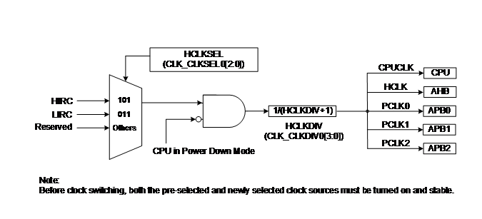 |
|--------------------------------|

Figure 6.3‑4 System Clock
Block Diagram

|  |
|--------------------------------|

Figure 6.3‑5 SysTick
Clock Control Block Diagram

The clock source of SysTick in processor can use CPU clock or external
clock (SYST_CTRL\[2\]). If using external clock, the SysTick clock
(STCLK) has 2 clock sources. The clock source switch depends on the
setting of the register STCLKSEL (CLK_CLKSEL0\[5:3\]). The block diagram
is shown in Figure 6.3‑5.

### Peripherals Clock

Each peripheral clock has its own clock source selection. Refer to the
CLK_CLKSEL1 and CLK_CLKSEL2 register.

### Power-down Mode Clock

When entering Power-down mode, system clocks, some clock sources and
some peripheral clocks are disabled. Some clock sources and peripherals
clock are still active in Power-down mode.

For theses clocks, which still keep active, are listed below:

- Clock Generator

  - 10 kHz internal low speed RC oscillator (LIRC) clock

- Peripherals Clock

  - when the modules adopt LIRC as clock source

### Clock Output

This device is equipped with a power-of-2 frequency divider that is
composed by 16 chained divide-by-2 shift registers. One of the 16 shift
register outputs selected by a sixteen to one multiplexer is reflected
to CLKO function pin. Therefore, there are 16 options of power-of-2
divided clocks with the frequency from Fin/21 to
Fin/216 where Fin is input clock
frequency to the clock divider.

The output formula is **Fout =
Fin/2(N+1)**, where Fin is the input
clock frequency, Fout is the clock divider output frequency
and N is the 4-bit value in FREQSEL (CLK_CLKOCTL\[3:0\]). When writing 1
to CLKOEN (CLK_CLKOCTL\[4\]), the chained counter starts to count. When
writing 0 to CLKOEN (CLK_CLKOCTL\[4\]), the chained counter continuously
runs till divided clock reaches low state and stays in low state.

If DIV1EN(CLK_CLKOCTL\[5\]) is set to 1, the clock output clock
(CLKO_CLK) will bypass power-of-2 frequency divider. The output divider
clock will be output to CLKO pin directly.

When entering Power-down mode, clock output does not output clock.

|  |
|--------------------------------|

Figure 6.3‑6 Clock Output
Block Diagram

### Register Map

**R:** read only, **W:** write only, **R/W:** both read and write

<table>
<colgroup>
<col style="width: 18%" />
<col style="width: 14%" />
<col style="width: 4%" />
<col style="width: 48%" />
<col style="width: 13%" />
</colgroup>
<tbody>
<tr>
<td><strong>Register</strong></td>
<td><strong>Offset</strong></td>
<td><strong>R/W</strong></td>
<td><strong>Description</strong></td>
<td><strong>Reset Value</strong></td>
</tr>
<tr>
<td colspan="5">
<strong>CLK Base Address:</strong>

<strong>CLK_BA = 0x4000_0200</strong>

<strong>CLK_BA non-secure base address is CLK_BA +
0x1000_0000.</strong>
</td>
</tr>
<tr>
<td><strong>CLK_PWRCTL</strong></td>
<td>CLK_BA+0x00</td>
<td>R/W</td>
<td>System Power-down Control Register</td>
<td>0x0200_000C</td>
</tr>
<tr>
<td><strong>CLK_AHBCLK</strong></td>
<td>CLK_BA+0x04</td>
<td>R/W</td>
<td>AHB Devices Clock Enable Register</td>
<td>0x0000_0101</td>
</tr>
<tr>
<td><strong>CLK_APBCLK0</strong></td>
<td>CLK_BA+0x08</td>
<td>R/W</td>
<td>APB Devices Clock Enable Register 0</td>
<td>0x0000_0001</td>
</tr>
<tr>
<td><strong>CLK_APBCLK1</strong></td>
<td>CLK_BA+0x0C</td>
<td>R/W</td>
<td>APB Devices Clock Enable Register 1</td>
<td>0x0000_0000</td>
</tr>
<tr>
<td><strong>CLK_CLKSEL0</strong></td>
<td>CLK_BA+0x10</td>
<td>R/W</td>
<td>Clock Source Select Register 0</td>
<td>0x0000_001D</td>
</tr>
<tr>
<td><strong>CLK_CLKSEL1</strong></td>
<td>CLK_BA+0x14</td>
<td>R/W</td>
<td>Clock Source Select Register 1</td>
<td>0xA022_2203</td>
</tr>
<tr>
<td><strong>CLK_CLKSEL2</strong></td>
<td>CLK_BA+0x18</td>
<td>R/W</td>
<td>Clock Source Select Register 2</td>
<td>0x0244_01A1</td>
</tr>
<tr>
<td><strong>CLK_CLKDIV0</strong></td>
<td>CLK_BA+0x20</td>
<td>R/W</td>
<td>Clock Divider Number Register 0</td>
<td>0x0001_1100</td>
</tr>
<tr>
<td><strong>CLK_PCLKDIV</strong></td>
<td>CLK_BA+0x34</td>
<td>R/W</td>
<td>APB Clock Divider Register</td>
<td>0x0000_0000</td>
</tr>
<tr>
<td><strong>CLK_STATUS</strong></td>
<td>CLK_BA+0x50</td>
<td>R</td>
<td>Clock Status Monitor Register</td>
<td>0x0000_0018</td>
</tr>
<tr>
<td><strong>CLK_CLKOCTL</strong></td>
<td>CLK_BA+0x60</td>
<td>R/W</td>
<td>Clock Output Control Register</td>
<td>0x0000_0000</td>
</tr>
<tr>
<td><strong>CLK_PMUCTL</strong></td>
<td>CLK_BA+0x90</td>
<td>R/W</td>
<td>Power Manager Control Register</td>
<td>0x0000_0010</td>
</tr>
<tr>
<td><strong>CLK_PMUSTS</strong></td>
<td>CLK_BA+0x94</td>
<td>R/W</td>
<td>Power Manager Status Register</td>
<td>0x0000_0000</td>
</tr>
<tr>
<td><strong>CLK_SWKDBCTL</strong></td>
<td>CLK_BA+0x9C</td>
<td>R/W</td>
<td>Power-down Wake-up De-bounce Control Register</td>
<td>0x0000_0000</td>
</tr>
<tr>
<td><strong>CLK_PBSWKCTL</strong></td>
<td>CLK_BA+0xA4</td>
<td>R/W</td>
<td>GPB Power-down Wake-up Control Register</td>
<td>0x0000_0000</td>
</tr>
<tr>
<td><strong>CLK_PCSWKCTL</strong></td>
<td>CLK_BA+0xA8</td>
<td>R/W</td>
<td>GPC Power-down Wake-up Control Register</td>
<td>0x0000_0000</td>
</tr>
<tr>
<td><strong>CLK_IOPDCTL</strong></td>
<td>CLK_BA+0xB0</td>
<td>R/W</td>
<td>GPIO Power-down Control Register</td>
<td>0x0000_0000</td>
</tr>
</tbody>
</table>

### Register Description

##### System Power-down Control Register (CLK_PWRCTL) 

|  |  |  |  |  |
|----|----|----|----|----|
| **Register** | **Offset** | **R/W** | **Description** | **Reset Value** |
| **CLK_PWRCTL** | CLK_BA+0x00 | R/W | System Power-down Control Register | 0x0200_000C |

|  |  |  |  |  |  |  |  |
|:--:|:--:|:--:|:--:|:--:|:--:|:--:|:--:|
| **31** | **30** | **29** | **28** | **27** | **26** | **25** | **24** |
| **Reserved** |  |  |  |  |  |  |  |
| **23** | **22** | **21** | **20** | **19** | **18** | **17** | **16** |
| **Reserved** |  |  |  |  |  |  |  |
| **15** | **14** | **13** | **12** | **11** | **10** | **9** | **8** |
| **Reserved** |  |  |  |  |  |  |  |
| **7** | **6** | **5** | **4** | **3** | **2** | **1** | **0** |
| **PDEN** | **PDWKIF** | **PDWKIEN** | **Reserved** | **LIRCEN** | **HIRCEN** | **Reserved** |  |

<table>
<colgroup>
<col style="width: 5%" />
<col style="width: 8%" />
<col style="width: 86%" />
</colgroup>
<tbody>
<tr>
<td><strong>Bits</strong></td>
<td colspan="2"><strong>Description</strong></td>
</tr>
<tr>
<td>[31:8]</td>
<td><strong>Reserved</strong></td>
<td>Reserved.</td>
</tr>
<tr>
<td>[7]</td>
<td><strong>PDEN</strong></td>
<td>
<strong>System Power-down Enable (Write Protect)</strong>

When this bit is set to 1, Power-down mode is enabled and the chip
keeps active till the CPU sleep mode is also active and then the chip
enters Power-down mode.

When chip wakes up from Power-down mode, this bit is auto cleared.
Users need to set this bit again for next Power-down.

In Power-down mode, HIRC and system clock will be disabled and
ignored the clock source selection. The clocks of peripheral are not
controlled by Power-down mode, if the peripheral clock source is from
LIRC.

0 = Chip operating normally or chip in idle mode because of WFI
command.

1 = Chip waits CPU sleep command WFI and then enters Power-down
mode.

<strong>Note:</strong> This bit is write protected. Refer to the
SYS_REGLCTL register.
</td>
</tr>
<tr>
<td>[6]</td>
<td><strong>PDWKIF</strong></td>
<td>
<strong>Power-down Mode Wake-up Interrupt Status</strong>

Set by “Power-down wake-up event”, which indicates that resume from
Power-down mode.

The flag is set if the EINT0~5, GPIO, UART0~1, BOD, WDT, TIMER, I2C0,
USCI0 and CLKD wake-up occurred.

<strong>Note 1:</strong> Write 1 to clear the bit to 0.

<strong>Note 2:</strong> This bit works only if PDWKIEN
(CLK_PWRCTL[5]) set to 1.
</td>
</tr>
<tr>
<td>[5]</td>
<td><strong>PDWKIEN</strong></td>
<td>
<strong>Power-down Mode Wake-up Interrupt Enable Bit (Write
Protect)</strong>

0 = Power-down mode wake-up interrupt Disabled.

1 = Power-down mode wake-up interrupt Enabled.

<strong>Note 1:</strong> The interrupt will occur when both PDWKIF
and PDWKIEN are high, after resume from power-down mode.

<strong>Note 2:</strong> This bit is write protected. Refer to the
SYS_REGLCTL register.
</td>
</tr>
<tr>
<td>[4]</td>
<td><strong>Reserved</strong></td>
<td>Reserved.</td>
</tr>
<tr>
<td>[3]</td>
<td><strong>LIRCEN</strong></td>
<td>
<strong>LIRC Enable Bit (Write Protect)</strong>

0 = 10 kHz internal low speed RC oscillator (LIRC) Disabled.

1 = 10 kHz internal low speed RC oscillator (LIRC) Enabled.

<strong>Note 1:</strong> This bit is write protected. Refer to the
SYS_REGLCTL register.

<strong>Note 2:</strong> LIRC cannot be disabled and LIRCEN will read
as 1 if HCLK clock source is selected from LIRC.

<strong>Note 3:</strong> If CWDTEN(CONFIG0[31,4:3]) is set to 111,
LIRC clock can be enabled or disabled by setting
LIRCEN(CLK_PWRCTL[3]).

If CWDTEN(CONFIG0[31,4:3]) is not set to 111, LIRC cannot be disabled
in normal mode. In Power-down mode, LIRC clock is controlled by
LIRCEN(CLK_PWRCTL[3]) and CWDTPDEN(CONFIG0[30]) setting.
</td>
</tr>
<tr>
<td>[2]</td>
<td><strong>HIRCEN</strong></td>
<td>
<strong>HIRC Enable Bit (Write Protect)</strong>

0 = 24 MHz internal high speed RC oscillator (HIRC) Disabled.

1 = 24 MHz internal high speed RC oscillator (HIRC) Enabled.

<strong>Note 1:</strong> This bit is write protected. Refer to the
SYS_REGLCTL register.

<strong>Note 2:</strong> HIRC cannot be disabled and HIRCEN will read
as 1 if HCLK clock source is selected from HIRC (clock source from
HIRC).
</td>
</tr>
<tr>
<td>[1:0]</td>
<td><strong>Reserved</strong></td>
<td>Reserved.</td>
</tr>
</tbody>
</table>

##### AHB Devices Clock Enable Control Register (CLK_AHBCLK) 

The bits in this register are used to enable/disable clock for system
clock, AHB bus devices clock.

|  |  |  |  |  |
|----|----|----|----|----|
| **Register** | **Offset** | **R/W** | **Description** | **Reset Value** |
| **CLK_AHBCLK** | CLK_BA+0x04 | R/W | AHB Devices Clock Enable Register | 0x0000_0101 |

|  |  |  |  |  |  |  |  |
|:--:|:--:|:--:|:--:|:--:|:--:|:--:|:--:|
| **31** | **30** | **29** | **28** | **27** | **26** | **25** | **24** |
| **Reserved** |  |  |  |  |  |  |  |
| **23** | **22** | **21** | **20** | **19** | **18** | **17** | **16** |
| **Reserved** |  | **GPFCKEN** | **GPECKEN** | **Reserved** | **GPCCKEN** | **GPBCKEN** | **Reserved** |
| **15** | **14** | **13** | **12** | **11** | **10** | **9** | **8** |
| **Reserved** |  |  |  |  |  |  | **SRAM0CKEN** |
| **7** | **6** | **5** | **4** | **3** | **2** | **1** | **0** |
| **Reserved** |  |  |  | **STCKEN** | **Reserved** | **ISPCKEN** | **FMCIDLE** |

<table>
<colgroup>
<col style="width: 9%" />
<col style="width: 18%" />
<col style="width: 72%" />
</colgroup>
<tbody>
<tr>
<td><strong>Bits</strong></td>
<td colspan="2"><strong>Description</strong></td>
</tr>
<tr>
<td>[31:22]</td>
<td><strong>Reserved</strong></td>
<td>Reserved.</td>
</tr>
<tr>
<td>[21]</td>
<td><strong>GPFCKEN</strong></td>
<td>
<strong>GPIOF Clock Enable Bit</strong>

0 = GPIOF port clock Disabled.

1 = GPIOF port clock Enabled.
</td>
</tr>
<tr>
<td>[20]</td>
<td><strong>GPECKEN</strong></td>
<td>
<strong>GPIOE Clock Enable Bit</strong>

0 = GPIOE port clock Disabled.

1 = GPIOE port clock Enabled.
</td>
</tr>
<tr>
<td>[19]</td>
<td><strong>Reserved</strong></td>
<td>Reserved.</td>
</tr>
<tr>
<td>[18]</td>
<td><strong>GPCCKEN</strong></td>
<td>
<strong>GPIOC Clock Enable Bit</strong>

0 = GPIOC port clock Disabled.

1 = GPIOC port clock Enabled.
</td>
</tr>
<tr>
<td>[17]</td>
<td><strong>GPBCKEN</strong></td>
<td>
<strong>GPIOB Clock Enable Bit</strong>

0 = GPIOB port clock Disabled.

1 = GPIOB port clock Enabled.
</td>
</tr>
<tr>
<td>[16:10]</td>
<td><strong>Reserved</strong></td>
<td>Reserved.</td>
</tr>
<tr>
<td>[8]</td>
<td><strong>SRAM0CKEN</strong></td>
<td>
<strong>SRAM Bank0 Controller Clock Enable Bit</strong>

0 = SRAM bank0 clock Disabled.

1 = SRAM bank0 clock Enabled.
</td>
</tr>
<tr>
<td>[7:4]</td>
<td><strong>Reserved</strong></td>
<td>Reserved.</td>
</tr>
<tr>
<td>[3]</td>
<td><strong>STCKEN</strong></td>
<td>
<strong>System Tick Clock Enable Bit</strong>

0 = External System tick clock Disabled.

1 = External System tick clock Enabled.
</td>
</tr>
<tr>
<td>[2]</td>
<td><strong>Reserved</strong></td>
<td>Reserved.</td>
</tr>
<tr>
<td>[1]</td>
<td><strong>ISPCKEN</strong></td>
<td>
<strong>Flash ISP Controller Clock Enable Bit</strong>

0 = Flash ISP peripheral clock Disabled.

1 = Flash ISP peripheral clock Enabled.
</td>
</tr>
<tr>
<td>[0]</td>
<td><strong>FMCIDLE</strong></td>
<td>
<strong>Flash Memory Controller Clock Enable Bit in IDLE
Mode</strong>

0 = FMC clock Disabled when chip is under IDLE mode.

1 = FMC clock Enabled when chip is under IDLE mode.
</td>
</tr>
</tbody>
</table>

##### APB Devices Clock Enable Control Register 0 (CLK_APBCLK0) 

The bits in this register are used to enable/disable clock for
peripheral controller clocks.

|  |  |  |  |  |
|----|----|----|----|----|
| **Register** | **Offset** | **R/W** | **Description** | **Reset Value** |
| **CLK_APBCLK0** | CLK_BA+0x08 | R/W | APB Devices Clock Enable Register 0 | 0x0000_0001 |

|  |  |  |  |  |  |  |  |
|:--:|:--:|:--:|:--:|:--:|:--:|:--:|:--:|
| **31** | **30** | **29** | **28** | **27** | **26** | **25** | **24** |
| **Reserved** |  |  | **ADCCKEN** | **Reserved** |  |  |  |
| **23** | **22** | **21** | **20** | **19** | **18** | **17** | **16** |
| **Reserved** |  |  |  |  |  | **UART1CKEN** | **UART0CKEN** |
| **15** | **14** | **13** | **12** | **11** | **10** | **9** | **8** |
| **Reserved** |  |  | **Reserved** |  |  | **Reserved** | **I2C0CKEN** |
| **7** | **6** | **5** | **4** | **3** | **2** | **1** | **0** |
| **Reserved** | **CLKOCKEN** | **TMR3CKEN** | **TMR2CKEN** | **TMR1CKEN** | **TMR0CKEN** | **Reserved** | **WDTCKEN** |

<table>
<colgroup>
<col style="width: 8%" />
<col style="width: 15%" />
<col style="width: 75%" />
</colgroup>
<tbody>
<tr>
<td><strong>Bits</strong></td>
<td colspan="2"><strong>Description</strong></td>
</tr>
<tr>
<td>[31:29]</td>
<td><strong>Reserved</strong></td>
<td>Reserved.</td>
</tr>
<tr>
<td>[28]</td>
<td><strong>ADCCKEN</strong></td>
<td>
<strong>Analog-digital-converter Clock Enable Bit</strong>

0 = ADC clock Disabled.

1 = ADC clock Enabled.
</td>
</tr>
<tr>
<td>[27:18]</td>
<td><strong>Reserved</strong></td>
<td>Reserved.</td>
</tr>
<tr>
<td>[17]</td>
<td><strong>UART1CKEN</strong></td>
<td>
<strong>UART1 Clock Enable Bit</strong>

0 = UART1 clock Disabled.

1 = UART1 clock Enabled.
</td>
</tr>
<tr>
<td>[16]</td>
<td><strong>UART0CKEN</strong></td>
<td>
<strong>UART0 Clock Enable Bit</strong>

0 = UART0 clock Disabled.

1 = UART0 clock Enabled.
</td>
</tr>
<tr>
<td>[15:9]</td>
<td><strong>Reserved</strong></td>
<td>Reserved.</td>
</tr>
<tr>
<td>[8]</td>
<td><strong>I2C0CKEN</strong></td>
<td>
<strong>I2C0 Clock Enable Bit</strong>

0 = I2C0 clock Disabled.

1 = I2C0 clock Enabled.
</td>
</tr>
<tr>
<td>[7]</td>
<td><strong>Reserved</strong></td>
<td>Reserved.</td>
</tr>
<tr>
<td>[6]</td>
<td><strong>CLKOCKEN</strong></td>
<td>
<strong>CLKO Clock Enable Bit</strong>

0 = CLKO clock Disabled.

1 = CLKO clock Enabled.
</td>
</tr>
<tr>
<td>[5]</td>
<td><strong>TMR3CKEN</strong></td>
<td>
<strong>Timer3 Clock Enable Bit</strong>

0 = Timer3 clock Disabled.

1 = Timer3 clock Enabled.
</td>
</tr>
<tr>
<td>[4]</td>
<td><strong>TMR2CKEN</strong></td>
<td>
<strong>Timer2 Clock Enable Bit</strong>

0 = Timer2 clock Disabled.

1 = Timer2 clock Enabled.
</td>
</tr>
<tr>
<td>[3]</td>
<td><strong>TMR1CKEN</strong></td>
<td>
<strong>Timer1 Clock Enable Bit</strong>

0 = Timer1 clock Disabled.

1 = Timer1 clock Enabled.
</td>
</tr>
<tr>
<td>[2]</td>
<td><strong>TMR0CKEN</strong></td>
<td>
<strong>Timer0 Clock Enable Bit</strong>

0 = Timer0 clock Disabled.

1 = Timer0 clock Enabled.
</td>
</tr>
<tr>
<td>[1]</td>
<td><strong>Reserved</strong></td>
<td>Reserved.</td>
</tr>
<tr>
<td>[0]</td>
<td><strong>WDTCKEN</strong></td>
<td>
<strong>Watchdog Timer Clock Enable Bit (Write
Protect)</strong>

0 = Watchdog timer and Windows watchdog timer clock Disabled.

1 = Watchdog timer and Windows watchdog timer clock Enabled.

<strong>Note:</strong> This bit is write protected. Refer to the
SYS_REGLCTL register.
</td>
</tr>
</tbody>
</table>

##### APB Devices Clock Enable Control Register 1 (CLK_APBCLK1) 

The bits in this register are used to enable/disable clock for
peripheral controller clocks.

|  |  |  |  |  |
|----|----|----|----|----|
| **Register** | **Offset** | **R/W** | **Description** | **Reset Value** |
| **CLK_APBCLK1** | CLK_BA+0x0C | R/W | APB Devices Clock Enable Register 1 | 0x0000_0000 |

|  |  |  |  |  |  |  |  |
|:--:|:--:|:--:|:--:|:--:|:--:|:--:|:--:|
| **31** | **30** | **29** | **28** | **27** | **26** | **25** | **24** |
| **Reserved** |  |  |  |  | **ECAP0CKEN** | **Reserved** |  |
| **23** | **22** | **21** | **20** | **19** | **18** | **17** | **16** |
| **Reserved** |  |  |  |  |  |  | **PWM0CKEN** |
| **15** | **14** | **13** | **12** | **11** | **10** | **9** | **8** |
| **Reserved** |  |  |  |  |  |  | **USCI0CKEN** |
| **7** | **6** | **5** | **4** | **3** | **2** | **1** | **0** |
| **Reserved** |  |  |  |  |  |  |  |

<table>
<colgroup>
<col style="width: 15%" />
<col style="width: 29%" />
<col style="width: 55%" />
</colgroup>
<tbody>
<tr>
<td><strong>Bits</strong></td>
<td colspan="2"><strong>Description</strong></td>
</tr>
<tr>
<td>[31:27]</td>
<td><strong>Reserved</strong></td>
<td>Reserved.</td>
</tr>
<tr>
<td>[26]</td>
<td><strong>ECAP0CKEN</strong></td>
<td>
<strong>ECAP0 Clock Enable Bit</strong>

0 = ECAP0 clock Disabled.

1 = ECAP0 clock Enabled.
</td>
</tr>
<tr>
<td>[25:17]</td>
<td><strong>Reserved</strong></td>
<td>Reserved.</td>
</tr>
<tr>
<td>[16]</td>
<td><strong>PWM0CKEN</strong></td>
<td>
<strong>PWM0 Clock Enable Bit</strong>

0 = PWM0 clock Disabled.

1 = PWM0 clock Enabled.
</td>
</tr>
<tr>
<td>[15:9]</td>
<td><strong>Reserved</strong></td>
<td>Reserved.</td>
</tr>
<tr>
<td>[8]</td>
<td><strong>USCI0CKEN</strong></td>
<td>
<strong>USCI0 Clock Enable Bit</strong>

0 = USCI0 clock Disabled.

1 = USCI0 clock Enabled.
</td>
</tr>
<tr>
<td>[7:0]</td>
<td><strong>Reserved</strong></td>
<td>Reserved.</td>
</tr>
</tbody>
</table>

##### Clock Source Select Control Register 0 (CLK_CLKSEL0) 

|  |  |  |  |  |
|----|----|----|----|----|
| **Register** | **Offset** | **R/W** | **Description** | **Reset Value** |
| **CLK_CLKSEL0** | CLK_BA+0x10 | R/W | Clock Source Select Register 0 | 0x0000_001D |

|              |        |              |        |        |             |        |        |
|:------------:|:------:|:------------:|:------:|:------:|:-----------:|:------:|:------:|
|    **31**    | **30** |    **29**    | **28** | **27** |   **26**    | **25** | **24** |
| **Reserved** |        |              |        |        |             |        |        |
|    **23**    | **22** |    **21**    | **20** | **19** |   **18**    | **17** | **16** |
| **Reserved** |        |              |        |        |             |        |        |
|    **15**    | **14** |    **13**    | **12** | **11** |   **10**    | **9**  | **8**  |
| **Reserved** |        |              |        |        |             |        |        |
|    **7**     | **6**  |    **5**     | **4**  | **3**  |    **2**    | **1**  | **0**  |
| **Reserved** |        | **STCLKSEL** |        |        | **HCLKSEL** |        |        |

<table>
<colgroup>
<col style="width: 5%" />
<col style="width: 9%" />
<col style="width: 85%" />
</colgroup>
<tbody>
<tr>
<td><strong>Bits</strong></td>
<td colspan="2"><strong>Description</strong></td>
</tr>
<tr>
<td>[31:6]</td>
<td><strong>Reserved</strong></td>
<td>Reserved.</td>
</tr>
<tr>
<td>[5:3]</td>
<td><strong>STCLKSEL</strong></td>
<td>
<strong>SysTick Clock Source Selection (Write
Protect)</strong>

If SYST_CTRL[2]=0, SysTick uses listed clock source below.

011 = Clock source from HCLK/2.

100 = Clock source from HIRC/2.

Others = Reserved.

<strong>Note 1:</strong> if SysTick clock source is not from HCLK
(i.e. SYST_CTRL[2] = 0), SysTick needs to enable EXSTCKEN(CLK_AHBCLK[4])
and clock frequency must less than or equal to HCLK/2.

<strong>Note 2:</strong> These bits are write protected. Refer to the
SYS_REGLCTL register.
</td>
</tr>
<tr>
<td>[2:0]</td>
<td><strong>HCLKSEL</strong></td>
<td>
<strong>HCLK Clock Source Selection (Write Protect)</strong>

Before clock switching, the related clock sources (both pre-select
and new-select) must be turned on.

011 = Clock source from LIRC.

101 = Clock source from HIRC.

Others = Reserved.

<strong>Note:</strong> These bits are write protected. Refer to the
SYS_REGLCTL register.
</td>
</tr>
</tbody>
</table>

##### Clock Source Select Control Register 1 (CLK_CLKSEL1) 

Before clock switching, the related clock sources (pre-selected and
newly-selected) must be turned on.

|  |  |  |  |  |
|----|----|----|----|----|
| **Register** | **Offset** | **R/W** | **Description** | **Reset Value** |
| **CLK_CLKSEL1** | CLK_BA+0x14 | R/W | Clock Source Select Register 1 | 0xA022_2203 |

|  |  |  |  |  |  |  |  |
|:--:|:--:|:--:|:--:|:--:|:--:|:--:|:--:|
| **31** | **30** | **29** | **28** | **27** | **26** | **25** | **24** |
| **WWDTSEL** |  | **CLKOSEL** |  | **Reserved** |  |  |  |
| **23** | **22** | **21** | **20** | **19** | **18** | **17** | **16** |
| **Reserved** | **TMR3SEL** |  |  | **Reserved** | **TMR2SEL** |  |  |
| **15** | **14** | **13** | **12** | **11** | **10** | **9** | **8** |
| **Reserved** | **TMR1SEL** |  |  | **Reserved** | **TMR0SEL** |  |  |
| **7** | **6** | **5** | **4** | **3** | **2** | **1** | **0** |
| **Reserved** |  |  |  |  |  | **WDTSEL** |  |

<table>
<colgroup>
<col style="width: 8%" />
<col style="width: 13%" />
<col style="width: 78%" />
</colgroup>
<tbody>
<tr>
<td><strong>Bits</strong></td>
<td colspan="2"><strong>Description</strong></td>
</tr>
<tr>
<td>[31:30]</td>
<td><strong>WWDTSEL</strong></td>
<td>
<strong>Window Watchdog Timer Clock Source Selection (Write
Protect)</strong>

10 = Clock source from HCLK/2048.

11 = Clock source from 10 kHz internal low speed RC oscillator
(LIRC).

Others = Reserved.

<strong>Note:</strong> These bits are write protected. Refer to the
SYS_REGLCTL register.
</td>
</tr>
<tr>
<td>[29:28]</td>
<td><strong>CLKOSEL</strong></td>
<td>
<strong>Clock Output Clock Source Selection</strong>

10 = Clock source from HCLK.

11 = Clock source from 24 MHz internal high speed RC oscillator
(HIRC).
</td>
</tr>
<tr>
<td>[27:23]</td>
<td><strong>Reserved</strong></td>
<td>Reserved.</td>
</tr>
<tr>
<td>[22:20]</td>
<td><strong>TMR3SEL</strong></td>
<td>
<strong>TIMER3 Clock Source Selection</strong>

010 = Clock source from PCLK1.

011 = Clock source from external clock TM3 pin.

100 = Clock source from 10 kHz internal low speed RC oscillator
(LIRC).

101 = Clock source from 24 MHz internal high speed RC oscillator
(HIRC).

Others = Reserved.
</td>
</tr>
<tr>
<td>[19]</td>
<td><strong>Reserved</strong></td>
<td>Reserved.</td>
</tr>
<tr>
<td>[18:16]</td>
<td><strong>TMR2SEL</strong></td>
<td>
<strong>TIMER2 Clock Source Selection</strong>

010 = Clock source from PCLK1.

011 = Clock source from external clock TM2 pin.

100 = Clock source from 10 kHz internal low speed RC oscillator
(LIRC).

101 = Clock source from 24 MHz internal high speed RC oscillator
(HIRC).

Others = Reserved.
</td>
</tr>
<tr>
<td>[15]</td>
<td><strong>Reserved</strong></td>
<td>Reserved.</td>
</tr>
<tr>
<td>[14:12]</td>
<td><strong>TMR1SEL</strong></td>
<td>
<strong>TIMER1 Clock Source Selection</strong>

010 = Clock source from PCLK0.

011 = Clock source from external clock TM1 pin.

100 = Clock source from 10 kHz internal low speed RC oscillator
(LIRC).

101 = Clock source from 24 MHz internal high speed RC oscillator
(HIRC).

Others = Reserved.
</td>
</tr>
<tr>
<td>[11]</td>
<td><strong>Reserved</strong></td>
<td>Reserved.</td>
</tr>
<tr>
<td>[10:8]</td>
<td><strong>TMR0SEL</strong></td>
<td>
<strong>TIMER0 Clock Source Selection</strong>

010 = Clock source from PCLK0.

011 = Clock source from external clock TM0 pin.

100 = Clock source from 10 kHz internal low speed RC oscillator
(LIRC).

101 = Clock source from 24 MHz internal high speed RC oscillator
(HIRC).

Others = Reserved.
</td>
</tr>
<tr>
<td>[7:2]</td>
<td><strong>Reserved</strong></td>
<td>Reserved.</td>
</tr>
<tr>
<td>[1:0]</td>
<td><strong>WDTSEL</strong></td>
<td>
<strong>Watchdog Timer Clock Source Selection (Write
Protect)</strong>

10 = Clock source from HCLK/2048.

11 = Clock source from 10 kHz internal low speed RC oscillator
(LIRC).

Others = Reserved.

<strong>Note:</strong> These bits are write protected. Refer to the
SYS_REGLCTL register.
</td>
</tr>
</tbody>
</table>

##### Clock Source Select Control Register 2 (CLK_CLKSEL2) 

Before clock switching, the related clock sources (pre-select and
new-select) must be turned on.

|  |  |  |  |  |
|----|----|----|----|----|
| **Register** | **Offset** | **R/W** | **Description** | **Reset Value** |
| **CLK_CLKSEL2** | CLK_BA+0x18 | R/W | Clock Source Select Register 2 | 0x0244_01A1 |

|  |  |  |  |  |  |  |  |
|:--:|:--:|:--:|:--:|:--:|:--:|:--:|:--:|
| **31** | **30** | **29** | **28** | **27** | **26** | **25** | **24** |
| **Reserved** |  |  |  |  |  | **ADCSEL** |  |
| **23** | **22** | **21** | **20** | **19** | **18** | **17** | **16** |
| **Reserved** | **UART1SEL** |  |  | **Reserved** | **UART0SEL** |  |  |
| **15** | **14** | **13** | **12** | **11** | **10** | **9** | **8** |
| **Reserved** |  |  |  |  |  |  |  |
| **7** | **6** | **5** | **4** | **3** | **2** | **1** | **0** |
| **Reserved** |  |  |  |  |  |  | **PWM0SEL** |

<table>
<colgroup>
<col style="width: 8%" />
<col style="width: 13%" />
<col style="width: 78%" />
</colgroup>
<tbody>
<tr>
<td><strong>Bits</strong></td>
<td colspan="2"><strong>Description</strong></td>
</tr>
<tr>
<td>[31:26]</td>
<td><strong>Reserved</strong></td>
<td>Reserved.</td>
</tr>
<tr>
<td>[25:24]</td>
<td><strong>ADCSEL</strong></td>
<td>
<strong>ADC Clock Source Selection</strong>

10 = Clock source from PCLK2.

11 = Clock source from 24 MHz internal high speed RC oscillator
(HIRC).

Others = Reserved.
</td>
</tr>
<tr>
<td>[23]</td>
<td><strong>Reserved</strong></td>
<td>Reserved.</td>
</tr>
<tr>
<td>[22:20]</td>
<td><strong>UART1SEL</strong></td>
<td>
<strong>UART1 Clock Source Selection</strong>

011 = Clock source from 24 MHz internal high speed RC oscillator
(HIRC).

100 = Clock source from PCLK1.

Others = Reserved.
</td>
</tr>
<tr>
<td>[19]</td>
<td><strong>Reserved</strong></td>
<td>Reserved.</td>
</tr>
<tr>
<td>[18:16]</td>
<td><strong>UART0SEL</strong></td>
<td>
<strong>UART0 Clock Source Selection</strong>

011 = Clock source from 24 MHz internal high speed RC oscillator
(HIRC).

100 = Clock source from PCLK0.

Others = Reserved.
</td>
</tr>
<tr>
<td>[15:1]</td>
<td><strong>Reserved</strong></td>
<td>Reserved.</td>
</tr>
<tr>
<td>[0]</td>
<td><strong>PWM0SEL</strong></td>
<td>
<strong>PWM0 Clock Source Selection (Read Only)</strong>

The peripheral clock source of PWM0 is defined by PWM0SEL.

0 = Reserved.

1 = Clock source from PCLK0.
</td>
</tr>
</tbody>
</table>

##### Clock Divider Number Register 0 (CLK_CLKDIV0) 

|  |  |  |  |  |
|----|----|----|----|----|
| **Register** | **Offset** | **R/W** | **Description** | **Reset Value** |
| **CLK_CLKDIV0** | CLK_BA+0x20 | R/W | Clock Divider Number Register 0 | 0x0001_1100 |

|              |        |        |        |              |        |        |        |
|:------------:|:------:|:------:|:------:|:------------:|:------:|:------:|:------:|
|    **31**    | **30** | **29** | **28** |    **27**    | **26** | **25** | **24** |
| **Reserved** |        |        |        |              |        |        |        |
|    **23**    | **22** | **21** | **20** |    **19**    | **18** | **17** | **16** |
|  **ADCDIV**  |        |        |        |              |        |        |        |
|    **15**    | **14** | **13** | **12** |    **11**    | **10** | **9**  | **8**  |
| **UART1DIV** |        |        |        | **UART0DIV** |        |        |        |
|    **7**     | **6**  | **5**  | **4**  |    **3**     | **2**  | **1**  | **0**  |
| **Reserved** |        |        |        | **HCLKDIV**  |        |        |        |

<table>
<colgroup>
<col style="width: 7%" />
<col style="width: 12%" />
<col style="width: 79%" />
</colgroup>
<tbody>
<tr>
<td><strong>Bits</strong></td>
<td colspan="2"><strong>Description</strong></td>
</tr>
<tr>
<td>[31:24]</td>
<td><strong>Reserved</strong></td>
<td>Reserved.</td>
</tr>
<tr>
<td>[23:16]</td>
<td><strong>ADCDIV</strong></td>
<td>
<strong>ADC Clock Divide Number From ADC Clock
Source</strong>

ADC clock frequency = (ADC clock source frequency) / (ADCDIV +
1).

<strong>Note:</strong> This field write ignore when CLK_APBCLK0’s
ADCCKEN = 1.
</td>
</tr>
<tr>
<td>[15:12]</td>
<td><strong>UART1DIV</strong></td>
<td>
<strong>UART1 Clock Divide Number From UART1 Clock
Source</strong>

UART1 clock frequency = (UART1 clock source frequency) / (UART1DIV +
1).
</td>
</tr>
<tr>
<td>[11:8]</td>
<td><strong>UART0DIV</strong></td>
<td>
<strong>UART0 Clock Divide Number From UART0 Clock
Source</strong>

UART0 clock frequency = (UART0 clock source frequency) / (UART0DIV +
1).
</td>
</tr>
<tr>
<td>[7:4]</td>
<td><strong>Reserved</strong></td>
<td>Reserved.</td>
</tr>
<tr>
<td>[3:0]</td>
<td><strong>HCLKDIV</strong></td>
<td>
<strong>HCLK Clock Divide Number From HCLK Clock
Source</strong>

HCLK clock frequency = (HCLK clock source frequency) / (HCLKDIV +
1).
</td>
</tr>
</tbody>
</table>

##### APB Clock Divider Register (CLK_PCLKDIV) 

|  |  |  |  |  |
|----|----|----|----|----|
| **Register** | **Offset** | **R/W** | **Description** | **Reset Value** |
| **CLK_PCLKDIV** | CLK_BA+0x34 | R/W | APB Clock Divider Register | 0x0000_0000 |

|              |             |        |        |              |             |        |        |
|:------------:|:-----------:|:------:|:------:|:------------:|:-----------:|:------:|:------:|
|    **31**    |   **30**    | **29** | **28** |    **27**    |   **26**    | **25** | **24** |
| **Reserved** |             |        |        |              |             |        |        |
|    **23**    |   **22**    | **21** | **20** |    **19**    |   **18**    | **17** | **16** |
| **Reserved** |             |        |        |              |             |        |        |
|    **15**    |   **14**    | **13** | **12** |    **11**    |   **10**    | **9**  | **8**  |
| **Reserved** |             |        |        |              | **APB2DIV** |        |        |
|    **7**     |    **6**    | **5**  | **4**  |    **3**     |    **2**    | **1**  | **0**  |
| **Reserved** | **APB1DIV** |        |        | **Reserved** | **APB0DIV** |        |        |

<table>
<colgroup>
<col style="width: 13%" />
<col style="width: 18%" />
<col style="width: 68%" />
</colgroup>
<tbody>
<tr>
<td><strong>Bits</strong></td>
<td colspan="2"><strong>Description</strong></td>
</tr>
<tr>
<td>[31:11]</td>
<td><strong>Reserved</strong></td>
<td>Reserved.</td>
</tr>
<tr>
<td>[10:8]</td>
<td><strong>APB2DIV</strong></td>
<td>
<strong>APB2 Clock Divider</strong>

APB2 clock can be divided from HCLK.

000 = PCLK2 frequency is HCLK.

001 = PCLK2 frequency is 1/2 HCLK.

010 = PCLK2 frequency is 1/4 HCLK.

011 = PCLK2 frequency is 1/8 HCLK.

100 = PCLK2 frequency is 1/16 HCLK.

101 = PCLK2 frequency is 1/32 HCLK.

Others = Reserved.
</td>
</tr>
<tr>
<td>[7]</td>
<td><strong>Reserved</strong></td>
<td>Reserved.</td>
</tr>
<tr>
<td>[6:4]</td>
<td><strong>APB1DIV</strong></td>
<td>
<strong>APB1 Clock Divider</strong>

APB1 clock can be divided from HCLK.

000 = PCLK1 frequency is HCLK.

001 = PCLK1 frequency is 1/2 HCLK.

010 = PCLK1 frequency is 1/4 HCLK.

011 = PCLK1 frequency is 1/8 HCLK.

100 = PCLK1 frequency is 1/16 HCLK.

101 = PCLK1 frequency is 1/32 HCLK.

Others = Reserved.
</td>
</tr>
<tr>
<td>[3]</td>
<td><strong>Reserved</strong></td>
<td>Reserved.</td>
</tr>
<tr>
<td>[2:0]</td>
<td><strong>APB0DIV</strong></td>
<td>
<strong>APB0 Clock Divider</strong>

APB0 clock can be divided from HCLK.

000 = PCLK0 frequency is HCLK.

001 = PCLK0 frequency is 1/2 HCLK.

010 = PCLK0 frequency is 1/4 HCLK.

011 = PCLK0 frequency is 1/8 HCLK.

100 = PCLK0 frequency is 1/16 HCLK.

101 = PCLK0 frequency is 1/32 HCLK.

Others = Reserved.
</td>
</tr>
</tbody>
</table>

##### Clock Status Monitor Register (CLK_STATUS) 

The bits in this register are used to monitor if the chip clock source
is stable or not, and whether the clock switch is failed.

|  |  |  |  |  |
|----|----|----|----|----|
| **Register** | **Offset** | **R/W** | **Description** | **Reset Value** |
| **CLK_STATUS** | CLK_BA+0x50 | R | Clock Status Monitor Register | 0x0000_0018 |

|  |  |  |  |  |  |  |  |
|:--:|:--:|:--:|:--:|:--:|:--:|:--:|:--:|
| **31** | **30** | **29** | **28** | **27** | **26** | **25** | **24** |
| **Reserved** |  |  |  |  |  |  |  |
| **23** | **22** | **21** | **20** | **19** | **18** | **17** | **16** |
| **Reserved** |  |  |  |  |  |  |  |
| **15** | **14** | **13** | **12** | **11** | **10** | **9** | **8** |
| **Reserved** |  |  |  |  |  |  |  |
| **7** | **6** | **5** | **4** | **3** | **2** | **1** | **0** |
| **CLKSFAIL** | **Reserved** |  | **HIRCSTB** | **LIRCSTB** | **Reserved** |  |  |

<table>
<colgroup>
<col style="width: 5%" />
<col style="width: 9%" />
<col style="width: 85%" />
</colgroup>
<tbody>
<tr>
<td><strong>Bits</strong></td>
<td colspan="2"><strong>Description</strong></td>
</tr>
<tr>
<td>[31:8]</td>
<td><strong>Reserved</strong></td>
<td>Reserved.</td>
</tr>
<tr>
<td>[7]</td>
<td><strong>CLKSFAIL</strong></td>
<td>
<strong>Clock Switching Fail Flag (Read Only)</strong>

This bit is updated when software switches system clock source. If
switch target clock is stable, this bit will be set to 0. If switch
target clock is not stable, this bit will be set to 1.

0 = Clock switching success.

1 = Clock switching failure.

<strong>Note:</strong> This bit is read only. After selected clock
source is stable, hardware will switch system clock to selected clock
automatically, and CLKSFAIL will be cleared automatically by
hardware.
</td>
</tr>
<tr>
<td>[6:5]</td>
<td><strong>Reserved</strong></td>
<td>Reserved.</td>
</tr>
<tr>
<td>[4]</td>
<td><strong>HIRCSTB</strong></td>
<td>
<strong>HIRC Clock Source Stable Flag (Read Only)</strong>

0 = 24 MHz internal high speed RC oscillator (HIRC) clock is not
stable or disabled.

1 = 24 MHz internal high speed RC oscillator (HIRC) clock is stable
and enabled.
</td>
</tr>
<tr>
<td>[3]</td>
<td><strong>LIRCSTB</strong></td>
<td>
<strong>LIRC Clock Source Stable Flag (Read Only)</strong>

0 = 10 kHz internal low speed RC oscillator (LIRC) clock is not
stable or disabled.

1 = 10 kHz internal low speed RC oscillator (LIRC) clock is stable
and enabled.
</td>
</tr>
<tr>
<td>[2:0]</td>
<td><strong>Reserved</strong></td>
<td>Reserved.</td>
</tr>
</tbody>
</table>

##### Clock Output Control Register (CLK_CLKOCTL) 

|  |  |  |  |  |
|----|----|----|----|----|
| **Register** | **Offset** | **R/W** | **Description** | **Reset Value** |
| **CLK_CLKOCTL** | CLK_BA+0x60 | R/W | Clock Output Control Register | 0x0000_0000 |

|  |  |  |  |  |  |  |  |
|:--:|:--:|:--:|:--:|:--:|:--:|:--:|:--:|
| **31** | **30** | **29** | **28** | **27** | **26** | **25** | **24** |
| **Reserved** |  |  |  |  |  |  |  |
| **23** | **22** | **21** | **20** | **19** | **18** | **17** | **16** |
| **Reserved** |  |  |  |  |  |  |  |
| **15** | **14** | **13** | **12** | **11** | **10** | **9** | **8** |
| **Reserved** |  |  |  |  |  |  |  |
| **7** | **6** | **5** | **4** | **3** | **2** | **1** | **0** |
| **Reserved** | **CLK1HZEN** | **DIV1EN** | **CLKOEN** | **FREQSEL** |  |  |  |

<table>
<colgroup>
<col style="width: 6%" />
<col style="width: 13%" />
<col style="width: 80%" />
</colgroup>
<tbody>
<tr>
<td><strong>Bits</strong></td>
<td colspan="2"><strong>Description</strong></td>
</tr>
<tr>
<td>[31:7]</td>
<td><strong>Reserved</strong></td>
<td>Reserved.</td>
</tr>
<tr>
<td>[6]</td>
<td><strong>CLK1HZEN</strong></td>
<td>
<strong>CLK1HZEN</strong>

<strong>Note:</strong> This bits has to set to 0.
</td>
</tr>
<tr>
<td>[5]</td>
<td><strong>DIV1EN</strong></td>
<td>
<strong>Clock Output Divide One Enable Bit</strong>

0 = Clock Output will output clock with source frequency divided by
FREQSEL.

1 = Clock Output will output clock with source frequency.
</td>
</tr>
<tr>
<td>[4]</td>
<td><strong>CLKOEN</strong></td>
<td>
<strong>Clock Output Enable Bit</strong>

0 = Clock Output function Disabled.

1 = Clock Output function Enabled.
</td>
</tr>
<tr>
<td>[3:0]</td>
<td><strong>FREQSEL</strong></td>
<td>
<strong>Clock Output Frequency Selection</strong>

The formula of output frequency is

<strong>Fout =
Fin/2(N+1).</strong>

Fin is the input clock frequency.

Fout is the frequency of divider output clock.

N is the 4-bit value of FREQSEL[3:0].
</td>
</tr>
</tbody>
</table>

##### Power Manager Control Register (CLK_PMUCTL) 

|  |  |  |  |  |
|----|----|----|----|----|
| **Register** | **Offset** | **R/W** | **Description** | **Reset Value** |
| **CLK_PMUCTL** | CLK_BA+0x90 | R/W | Power Manager Control Register | 0x0000_0010 |

|  |  |  |  |  |  |  |  |
|:--:|:--:|:--:|:--:|:--:|:--:|:--:|:--:|
| **31** | **30** | **29** | **28** | **27** | **26** | **25** | **24** |
| **Reserved** |  | **WKPINEN3** |  | **WKPINEN2** |  | **WKPINEN1** |  |
| **23** | **22** | **21** | **20** | **19** | **18** | **17** | **16** |
| **Reserved** |  |  |  |  |  |  |  |
| **15** | **14** | **13** | **12** | **11** | **10** | **9** | **8** |
| **Reserved** |  |  |  | **WKTMRIS** |  |  | **WKTMREN** |
| **7** | **6** | **5** | **4** | **3** | **2** | **1** | **0** |
| **WRBUSY** | **Reserved** |  |  |  | **PDMSEL** |  |  |

<table>
<colgroup>
<col style="width: 6%" />
<col style="width: 9%" />
<col style="width: 84%" />
</colgroup>
<tbody>
<tr>
<td><strong>Bits</strong></td>
<td colspan="2"><strong>Description</strong></td>
</tr>
<tr>
<td>[31:30]</td>
<td><strong>Reserved</strong></td>
<td><strong>Reserved</strong></td>
</tr>
<tr>
<td>[29:28]</td>
<td><strong>WKPINEN3</strong></td>
<td></td>
</tr>
<tr>
<td>[27:26]</td>
<td><strong>WKPINEN2</strong></td>
<td>
<strong>Wake-up Pin 3 Enable Bits (Write Protect)</strong>

This is control register for GPB.12 to wake-up pin.

00 = Wake-up pin disable at Power-down mode.

01 = Wake-up pin rising edge enabled at Power-down mode.

10 = Wake-up pin falling edge enabled at Power-down mode.

11 = Wake-up pin both edge enabled at Power-down mode.

<strong>Note:</strong> These bits are write protected. Refer to the
SYS_REGLCTL register.
</td>
</tr>
<tr>
<td>[25:24]</td>
<td><strong>WKPINEN1</strong></td>
<td>
<strong>Wake-up Pin 1 Enable Bits (Write Protect)</strong>

This is control register for GPB.0 to wake-up pin.

00 = Wake-up pin disable at Power-down mode.

01 = Wake-up pin rising edge enabled at Power-down mode.

10 = Wake-up pin falling edge enabled at Power-down mode.

11 = Wake-up pin both edge enabled at Power-down mode.

<strong>Note:</strong> These bits are write protected. Refer to the
SYS_REGLCTL register.
</td>
</tr>
<tr>
<td>[23:12]</td>
<td><strong>Reserved</strong></td>
<td>Reserved.</td>
</tr>
<tr>
<td>[11:9]</td>
<td><strong>WKTMRIS</strong></td>
<td>
<strong>Wake-up Timer Time-out Interval Select Bits (Write
Protect)</strong>

These bits control wake-up timer time-out interval when chip under
Power-down mode.

000 = Time-out interval is 128 LIRC clocks (12.8ms).

001 = Time-out interval is 256 LIRC clocks (25.6ms).

010 = Time-out interval is 512 LIRC clocks (51.2ms).

011 = Time-out interval is 1024 LIRC clocks (102.4ms).

100 = Time-out interval is 4096 LIRC clocks (409.6ms).

101 = Time-out interval is 8192 LIRC clocks (819.2ms).

110 = Time-out interval is 16384 LIRC clocks (1638.4ms).

111 = Time-out interval is 65536 LIRC clocks (6553.6ms).

<strong>Note:</strong> These bits are write protected. Refer to the
SYS_REGLCTL register.
</td>
</tr>
<tr>
<td>[8]</td>
<td><strong>WKTMREN</strong></td>
<td>
<strong>Wake-up Timer Enable Bit (Write Protect)</strong>

0 = Wake-up timer disable at Power-down mode.

1 = Wake-up timer enabled at Power-down mode.

<strong>Note:</strong> This bit is write protected. Refer to the
SYS_REGLCTL register.
</td>
</tr>
<tr>
<td>[7]</td>
<td><strong>WRBUSY</strong></td>
<td>
<strong>Write Busy Flag (Read Only)</strong>

If CLK_PMUCTL be written, this bit be asserted automatic by hardware,
and be de-asserted when write procedure finish.

0 = CLK_PMUCTL write ready.

1 = CLK_PMUCTL write ignore.
</td>
</tr>
<tr>
<td>[6:3]</td>
<td><strong>Reserved</strong></td>
<td>Reserved.</td>
</tr>
<tr>
<td>[2:0]</td>
<td><strong>PDMSEL</strong></td>
<td>
<strong>Power-down Mode Selection (Write Protect)</strong>

These bits control chip power-down mode grade selection when CPU
executes WFI/WFE instruction.

000 = Power-down mode is selected (PD).

001 = Reserved.

010 = Reserved.

011 = Reserved.

100 = Reserved.

101 = Reserved.

110 = Reserved.

111 = Reserved.

<strong>Note:</strong> These bits are write protected. Refer to the
SYS_REGLCTL register.
</td>
</tr>
</tbody>
</table>

##### Power Manager Status Register (CLK_PMUSTS) 

|  |  |  |  |  |
|----|----|----|----|----|
| **Register** | **Offset** | **R/W** | **Description** | **Reset Value** |
| **CLK_PMUSTS** | CLK_BA+0x94 | R/W | Power Manager Status Register | 0x0000_0000 |

|  |  |  |  |  |  |  |  |
|:--:|:--:|:--:|:--:|:--:|:--:|:--:|:--:|
| **31** | **30** | **29** | **28** | **27** | **26** | **25** | **24** |
| **CLRWK** | **Reserved** |  |  |  |  |  |  |
| **23** | **22** | **21** | **20** | **19** | **18** | **17** | **16** |
| **Reserved** |  |  |  |  |  |  |  |
| **15** | **14** | **13** | **12** | **11** | **10** | **9** | **8** |
| **Reserved** |  | **BODWK** | **LVRWK** | **Reserved** | **GPCWK** | **GPBWK** | **Reserved** |
| **7** | **6** | **5** | **4** | **3** | **2** | **1** | **0** |
| **Reserved** |  | **PINWK3** | **PINWK2** | **PINWK1** | **Reserved** | **TMRWK** | **Reserved** |

<table>
<colgroup>
<col style="width: 6%" />
<col style="width: 8%" />
<col style="width: 85%" />
</colgroup>
<tbody>
<tr>
<td><strong>Bits</strong></td>
<td colspan="2"><strong>Description</strong></td>
</tr>
<tr>
<td>[31]</td>
<td><strong>CLRWK</strong></td>
<td>
<strong>Clear Wake-up Flag</strong>

0 = No clear.

1 = Clear all of wake-up flag.

<strong>Note:</strong> This bit is auto cleared by hardware.
</td>
</tr>
<tr>
<td>[30:14]</td>
<td><strong>Reserved</strong></td>
<td>Reserved.</td>
</tr>
<tr>
<td>[13]</td>
<td><strong>BODWK</strong></td>
<td>
<strong>BOD Wake-up Flag (Read Only)</strong>

This flag indicates that wakeup of device from Power-down mode was
requested with a BOD happened..
</td>
</tr>
<tr>
<td>[12]</td>
<td><strong>LVRWK</strong></td>
<td>
<strong>LVR Wake-up Flag (Read Only)</strong>

This flag indicates that wakeup of device from Power-down mode was
requested with a LVR happened.
</td>
</tr>
<tr>
<td>[11]</td>
<td><strong>Reserved</strong></td>
<td>Reserved.</td>
</tr>
<tr>
<td>[10]</td>
<td><strong>GPCWK</strong></td>
<td>
<strong>GPC Wake-up Flag (Read Only)</strong>

This flag indicates that wake-up of chip from Power-down mode was
requested by a transition of selected one GPC group pins.
</td>
</tr>
<tr>
<td>[9]</td>
<td><strong>GPBWK</strong></td>
<td>
<strong>GPB Wake-up Flag (Read Only)</strong>

This flag indicates that wake-up of chip from Power-down mode was
requested by a transition of selected one GPB group pins.
</td>
</tr>
<tr>
<td>[8:6]</td>
<td><strong>Reserved</strong></td>
<td>Reserved.</td>
</tr>
<tr>
<td>[5]</td>
<td><strong>PINWK3</strong></td>
<td>
<strong>Pin 3 Wake-up Flag (Read Only)</strong>

This flag indicates that wake-up of chip from Power-down mode was
requested by a transition of the Wake-up pin (GPB.12).
</td>
</tr>
<tr>
<td>[4]</td>
<td><strong>PINWK2</strong></td>
<td>
<strong>Pin 2 Wake-up Flag (Read Only)</strong>

This flag indicates that wake-up of chip from Power-down mode was
requested by a transition of the Wake-up pin (GPB.2).
</td>
</tr>
<tr>
<td>[3]</td>
<td><strong>PINWK1</strong></td>
<td>
<strong>Pin 1 Wake-up Flag (Read Only)</strong>

This flag indicates that wake-up of chip from Power-down mode was
requested by a transition of the Wake-up pin (GPB.0).
</td>
</tr>
<tr>
<td>[2]</td>
<td><strong>Reserved</strong></td>
<td>Reserved.</td>
</tr>
<tr>
<td>[1]</td>
<td><strong>TMRWK</strong></td>
<td>
<strong>Timer Wake-up Flag (Read Only)</strong>

This flag indicates that wake-up of chip from Power-down mode was
requested by wakeup timer time-out.
</td>
</tr>
<tr>
<td>[0]</td>
<td><strong>Reserved</strong></td>
<td>Reserved.</td>
</tr>
</tbody>
</table>

##### Power-down Wake-up De-bounce Control Register (CLK_SWKDBCTL) 

|  |  |  |  |  |
|----|----|----|----|----|
| **Register** | **Offset** | **R/W** | **Description** | **Reset Value** |
| **CLK_SWKDBCTL** | CLK_BA+0x9C | R/W | Power-down Wake-up De-bounce Control Register | 0x0000_0000 |

|              |        |        |        |                 |        |        |        |
|:------------:|:------:|:------:|:------:|:---------------:|:------:|:------:|:------:|
|    **31**    | **30** | **29** | **28** |     **27**      | **26** | **25** | **24** |
| **Reserved** |        |        |        |                 |        |        |        |
|    **23**    | **22** | **21** | **20** |     **19**      | **18** | **17** | **16** |
| **Reserved** |        |        |        |                 |        |        |        |
|    **15**    | **14** | **13** | **12** |     **11**      | **10** | **9**  | **8**  |
| **Reserved** |        |        |        |                 |        |        |        |
|    **7**     | **6**  | **5**  | **4**  |      **3**      | **2**  | **1**  | **0**  |
| **Reserved** |        |        |        | **SWKDBCLKSEL** |        |        |        |

<table>
<colgroup>
<col style="width: 5%" />
<col style="width: 15%" />
<col style="width: 78%" />
</colgroup>
<tbody>
<tr>
<td><strong>Bits</strong></td>
<td colspan="2"><strong>Description</strong></td>
</tr>
<tr>
<td>[31:4]</td>
<td><strong>Reserved</strong></td>
<td>Reserved.</td>
</tr>
<tr>
<td>[3:0]</td>
<td><strong>SWKDBCLKSEL</strong></td>
<td>
<strong>Power-down Wake-up De-bounce Sampling Cycle
Selection</strong>

0000 = Sample wake-up input once per 1 clocks.

0001 = Sample wake-up input once per 2 clocks.

0010 = Sample wake-up input once per 4 clocks.

0011 = Sample wake-up input once per 8 clocks.

0100 = Sample wake-up input once per 16 clocks.

0101 = Sample wake-up input once per 32 clocks.

0110 = Sample wake-up input once per 64 clocks.

0111 = Sample wake-up input once per 128 clocks.

1000 = Sample wake-up input once per 256 clocks.

1001 = Sample wake-up input once per 2*256 clocks.

1010 = Sample wake-up input once per 4*256 clocks.

1011 = Sample wake-up input once per 8*256 clocks.

1100 = Sample wake-up input once per 16*256 clocks.

1101 = Sample wake-up input once per 32*256 clocks.

1110 = Sample wake-up input once per 64*256 clocks.

1111 = Sample wake-up input once per 128*256 clocks.

<strong>Note:</strong> De-bounce counter clock source is the 10kHz
internal low speed RC oscillator (LIRC).
</td>
</tr>
</tbody>
</table>

##### GPB Power-down Wake-up Control Register (CLK_PBSWKCTL) 

|  |  |  |  |  |
|----|----|----|----|----|
| **Register** | **Offset** | **R/W** | **Description** | **Reset Value** |
| **CLK_PBSWKCTL** | CLK_BA+0xA4 | R/W | GPB Power-down Wake-up Control Register | 0x0000_0000 |

|              |        |        |        |              |            |            |          |
|:------------:|:------:|:------:|:------:|:------------:|:----------:|:----------:|:--------:|
|    **31**    | **30** | **29** | **28** |    **27**    |   **26**   |   **25**   |  **24**  |
| **Reserved** |        |        |        |              |            |            |          |
|    **23**    | **22** | **21** | **20** |    **19**    |   **18**   |   **17**   |  **16**  |
| **Reserved** |        |        |        |              |            |            |          |
|    **15**    | **14** | **13** | **12** |    **11**    |   **10**   |   **9**    |  **8**   |
| **Reserved** |        |        |        |              |            |            | **DBEN** |
|    **7**     | **6**  | **5**  | **4**  |    **3**     |   **2**    |   **1**    |  **0**   |
|  **WKPSEL**  |        |        |        | **Reserved** | **PFWKEN** | **PRWKEN** | **WKEN** |

<table>
<colgroup>
<col style="width: 5%" />
<col style="width: 8%" />
<col style="width: 86%" />
</colgroup>
<tbody>
<tr>
<td><strong>Bits</strong></td>
<td colspan="2"><strong>Description</strong></td>
</tr>
<tr>
<td>[31:9]</td>
<td><strong>Reserved</strong></td>
<td>Reserved.</td>
</tr>
<tr>
<td>[8]</td>
<td><strong>DBEN</strong></td>
<td>
<strong>GPB Input Signal De-bounce Enable Bit</strong>

The DBEN bit is used to enable the de-bounce function for each
corresponding I/O. If the input signal pulse width cannot be sampled by
continuous two de-bounce sample cycle, the input signal transition is
seen as the signal bounce and will not trigger the wakeup. The de-bounce
clock source is the 10 kHz internal low speed RC oscillator (LIRC).

0 = power-down wake-up pin De-bounce function Disabled.

1 = power-down wake-up pin De-bounce function Enabled.

<strong>Note:</strong> The de-bounce function is valid only for edge
triggered.
</td>
</tr>
<tr>
<td>[7:4]</td>
<td><strong>WKPSEL</strong></td>
<td>
<strong>GPB Standby Power-down Wake-up Pin Select</strong>

0000 = GPB.0 wake-up function Enabled.

0001 = GPB.1 wake-up function Enabled.

0010 = GPB.2 wake-up function Enabled.

0011 = GPB.3 wake-up function Enabled.

0100 = GPB.4 wake-up function Enabled.

0101 = GPB.5 wake-up function Enabled.

0111 = GPB.7 wake-up function Enabled.

1000 = GPB.8 wake-up function Enabled.

1001 = GPB.9 wake-up function Enabled.

1011 = GPB.11 wake-up function Enabled.

1100 = GPB.12 wake-up function Enabled.

1101 = GPB.13 wake-up function Enabled.

1110 = GPB.14 wake-up function Enabled.

1111 = GPB.15 wake-up function Enabled.

Others are reserved.
</td>
</tr>
<tr>
<td>[3]</td>
<td><strong>Reserved</strong></td>
<td>Reserved.</td>
</tr>
<tr>
<td>[2]</td>
<td><strong>PFWKEN</strong></td>
<td>
<strong>Pin Falling Edge Wake-up Enable Bit</strong>

0 = GPB group pin falling edge wake-up function Disabled.

1 = GPB group pin falling edge wake-up function Enabled.
</td>
</tr>
<tr>
<td>[1]</td>
<td><strong>PRWKEN</strong></td>
<td>
<strong>Pin Rising Edge Wake-up Enable Bit</strong>

0 = GPB group pin rising edge wake-up function Disabled.

1 = GPB group pin rising edge wake-up function Enabled.
</td>
</tr>
<tr>
<td>[0]</td>
<td><strong>WKEN</strong></td>
<td>
<strong>Power-down Pin Wake-up Enable Bit</strong>

0 = GPB group pin wake-up function Disabled.

1 = GPB group pin wake-up function Enabled.
</td>
</tr>
</tbody>
</table>

##### GPC Power-down Wake-up Control Register (CLK_PCSWKCTL) 

|  |  |  |  |  |
|----|----|----|----|----|
| **Register** | **Offset** | **R/W** | **Description** | **Reset Value** |
| **CLK_PCSWKCTL** | CLK_BA+0xA8 | R/W | GPC Power-down Wake-up Control Register | 0x0000_0000 |

|              |        |        |        |              |            |            |          |
|:------------:|:------:|:------:|:------:|:------------:|:----------:|:----------:|:--------:|
|    **31**    | **30** | **29** | **28** |    **27**    |   **26**   |   **25**   |  **24**  |
| **Reserved** |        |        |        |              |            |            |          |
|    **23**    | **22** | **21** | **20** |    **19**    |   **18**   |   **17**   |  **16**  |
| **Reserved** |        |        |        |              |            |            |          |
|    **15**    | **14** | **13** | **12** |    **11**    |   **10**   |   **9**    |  **8**   |
| **Reserved** |        |        |        |              |            |            | **DBEN** |
|    **7**     | **6**  | **5**  | **4**  |    **3**     |   **2**    |   **1**    |  **0**   |
|  **WKPSEL**  |        |        |        | **Reserved** | **PFWKEN** | **PRWKEN** | **WKEN** |

<table>
<colgroup>
<col style="width: 5%" />
<col style="width: 8%" />
<col style="width: 86%" />
</colgroup>
<tbody>
<tr>
<td><strong>Bits</strong></td>
<td colspan="2"><strong>Description</strong></td>
</tr>
<tr>
<td>[31:9]</td>
<td><strong>Reserved</strong></td>
<td>Reserved.</td>
</tr>
<tr>
<td>[8]</td>
<td><strong>DBEN</strong></td>
<td>
<strong>GPC Input Signal De-bounce Enable Bit</strong>

The DBEN bit is used to enable the de-bounce function for each
corresponding I/O. If the input signal pulse width cannot be sampled by
continuous two de-bounce sample cycle, the input signal transition is
seen as the signal bounce and will not trigger the wakeup. The de-bounce
clock source is the 10 kHz internal low speed RC oscillator.

0 = power-down wake-up pin De-bounce function Disabled.

1 = power-down wake-up pin De-bounce function Enabled.

The de-bounce function is valid only for edge triggered.
</td>
</tr>
<tr>
<td>[7:4]</td>
<td><strong>WKPSEL</strong></td>
<td>
<strong>GPC Power-down Wake-up Pin Select</strong>

1110 = GPC.14 wake-up function Enabled.

Others are reserved
</td>
</tr>
<tr>
<td>[3]</td>
<td><strong>Reserved</strong></td>
<td>Reserved.</td>
</tr>
<tr>
<td>[2]</td>
<td><strong>PFWKEN</strong></td>
<td>
<strong>Pin Falling Edge Wake-up Enable Bit</strong>

0 = GPC group pin falling edge wake-up function Disabled.

1 = GPC group pin falling edge wake-up function Enabled.
</td>
</tr>
<tr>
<td>[1]</td>
<td><strong>PRWKEN</strong></td>
<td>
<strong>Pin Rising Edge Wake-up Enable Bit</strong>

0 = GPC group pin rising edge wake-up function Disabled.

1 = GPC group pin rising edge wake-up function Enabled.
</td>
</tr>
<tr>
<td>[0]</td>
<td><strong>WKEN</strong></td>
<td>
<strong>Standby Power-down Pin Wake-up Enable Bit</strong>

0 = GPC group pin wake-up function Disabled.

1 = GPC group pin wake-up function Enabled.
</td>
</tr>
</tbody>
</table>

##### GPIO Power-down Control Register (CLK_IOPDCTL) 

|  |  |  |  |  |
|----|----|----|----|----|
| **Register** | **Offset** | **R/W** | **Description** | **Reset Value** |
| **CLK_IOPDCTL** | CLK_BA+0xB0 | R/W | GPIO Power-down Control Register | 0x0000_0000 |

|              |        |        |        |        |        |        |          |
|:------------:|:------:|:------:|:------:|:------:|:------:|:------:|:--------:|
|    **31**    | **30** | **29** | **28** | **27** | **26** | **25** |  **24**  |
| **Reserved** |        |        |        |        |        |        |          |
|    **23**    | **22** | **21** | **20** | **19** | **18** | **17** |  **16**  |
| **Reserved** |        |        |        |        |        |        |          |
|    **15**    | **14** | **13** | **12** | **11** | **10** | **9**  |  **8**   |
| **Reserved** |        |        |        |        |        |        |          |
|    **7**     | **6**  | **5**  | **4**  | **3**  | **2**  | **1**  |  **0**   |
| **Reserved** |        |        |        |        |        |        | **IOHR** |

<table>
<colgroup>
<col style="width: 5%" />
<col style="width: 8%" />
<col style="width: 86%" />
</colgroup>
<tbody>
<tr>
<td><strong>Bits</strong></td>
<td colspan="2"><strong>Description</strong></td>
</tr>
<tr>
<td>[31:1]</td>
<td><strong>Reserved</strong></td>
<td>Reserved.</td>
</tr>
<tr>
<td>[0]</td>
<td><strong>IOHR</strong></td>
<td>
<strong>GPIO Hold Release</strong>

When GPIO enter power-down mode, all I/O status are hold to keep
normal operating status. After chip was waked up from power-down mode,
the I/O are still keep hold status until user set this bit to release
I/O hold status.

<strong>Note:</strong> This bit is auto cleared by hardware.
</td>
</tr>
</tbody>
</table>

## Flash Memory Controller (FMC)

### Overview

The FMC is equipped with on-chip embedded Flash for application. Thus,
the total size of application ROM (APROM) is 32 Kbytes. A User
Configuration block provides for system initiation. A 4 Kbytes loader
ROM (LDROM) is used for In-System-Programming (ISP) function. A security
protection ROM (SPROM) can conceal user program, and consists of native
ISP functions. This chip also supports In-Application-Programming (IAP)
function. User switches the code executing without chip reset after the
embedded Flash is updated.

### Features

- 
- 
- 
- 
- 
- 
- 
- 
- 
- 

### Supports 32 Kbytes application ROM (APROM)Supports 4 Kbytes loader ROM (LDROM)Supports 1 Kbytes security protection ROM (SPROM) to conceal user programSupports 16 bytes User Configuration block to control system initiationSupports 512 bytes page erase for all embedded FlashSupports 32-bit Flash programming function Supports fast Flash programming verification functionSupports CRC32 checksum calculation functionSupports Flash all one verification functionSupports In-System-Programming (ISP) / In-Application-Programming (IAP) to update embedded Flash memoryBlock Diagram

The Flash memory controller (FMC) consists of AHB slave interface, Flash
control registers, Flash initialization controller, Flash operation
control and embedded Flash memory. The block diagram of Flash memory
controller is shown in Figure 6.4‑1.

|  |
|--------------------------------|

Figure 6.4‑1 Flash Memory
Controller Block Diagram

1.  AHB Slave Interface

There are two AHB slave interfaces in Flash memory controller, one is
from both Cortex®- M23 Bus for the instruction and data
fetch; and the other is from Cortex®-M23 Bus for Flash
control registers access including ISP registers.

2.  Flash Control Registers

All of ISP control and status registers are in the Flash control
registers. The detail registers description is in the Register
Description section. ISP Control Register Space can only be accessed by
“Secure Master”.

3.  Flash Initialization Controller

When chip is powered on or active from reset, the Flash initialization
controller will start to access Flash automatically and check the Flash
stability, and also reload User Configuration content to the Flash
control registers for system initiation.

4.  Flash Operation Controller

The Flash operations, such as Flash erase, Flash program, and Flash read
operation, have specific control timing for embedded Flash memory. The
Flash operation controller generates those control timing by requested
from the Flash control registers and the Flash initialization
controller.

5.  Embedded Flash Memory

The embedded Flash memory is the main memory for user application code
and parameters. It consists of the user configuration block, 4 Kbytes
LDROM, two 0.5 Kbytes SPROM setting pages and 32 Kbytes APROM The page
erase Flash size is 0.5 Kbytes, and minimum program bit size is 32 bits.

### Functional Description

FMC functions include the memory organization, boot selection, secure
boot, IAP, ISP, the embedded Flash programming, and checksum
calculation. The Flash memory map and system memory map are also
introduced in the memory organization.

#### Memory Organization

The FMC memory consists of the embedded Flash memory. The Flash memory
is programmable, and includes APROM, LDROM, the User Configuration block
and SPROM. The address map includes Flash memory map and three system
address maps: LDROM with IAP, APROM with IAP with IAP functions.

| Flash Memory Block   | Address Rang          |
|----------------------|-----------------------|
| APROM with 32 Kbytes | 0x00_0000 ~ 0x00_7fff |
| User Configuration   | 0x30_0000 ~ 0x30_000f |
| LDROM                | 0x10_0000 ~ 0x10_0fff |
| SPROM Setting        | 0x20_0000 ~ 0x20_03ff |

Table 6.4‑1 Address Range

#### LDROM and APROM 

LDROM is designed for a loader to implement In-System-Programming (ISP)
function by user. LDROM is a 4 Kbytes embedded Flash memory, the Flash
address range is from 0x0010_0000 to 0x0010_0FFF. APROM is main memory
for user applications. APROM size is 32 Kbytes. All of the embedded
Flash memory is 0.5 Kbytes page erased. Data Flash is used to store
application parameters (not instruction).

|  |
|--------------------------------|

Figure 6.4‑2 APROM
Examples (32 Kbytes)

#### User Configuration Block 

User Configuration block is internal programmable configuration area for
boot options, such as boot select and brown-out voltage level. It works
like a fuse for power on setting. It is loaded from Flash memory to its
corresponding control registers during chip power on. User can set these
bits according to different application requests. User Configuration
block can be updated by ISP function and located at 0x0030_0000 with
four 32 bits words (CONFIG0, CONFIG1, CONFIG2 and CONFIG3). Any change
on User Configuration block will take effect after system reboot.

##### CONFIG0 (Address = 0x0030_0000) 

| **31** | **30** | **29** | **28** | **27** | **26** | **25** | **24** |
|:--:|:--:|:--:|:--:|:--:|:--:|:--:|:--:|
| **CWDTEN\[2\]** | **CWDTPDEN** | **Reserved** | **Reserved** | **Reserved** | **Reserved** | **RPD** | **Reserved** |
| **23** | **22** | **21** | **20** | **19** | **18** | **17** | **16** |
| **CBOV** |  |  | **CBORST** | **CBODEN** | **Reserved** |  | **Reserved** |
| **15** | **14** | **13** | **12** | **11** | **10** | **9** | **8** |
| **Reserved** | **Reserved** |  |  | **ICELOCK** | **CIOINI** | **Reserved** |  |
| **7** | **6** | **5** | **4** | **3** | **2** | **1** | **0** |
| **CBS** | **Reserved** | **Reserved** | **CWDTEN\[1:0\]** |  | **Reserved** | **LOCK** | **Reserved** |

<table>
<colgroup>
<col style="width: 6%" />
<col style="width: 12%" />
<col style="width: 81%" />
</colgroup>
<thead>
<tr>
<th style="text-align: left;"><strong>Bits</strong></th>
<th colspan="2"
style="text-align: left;"><strong>Descriptions</strong></th>
</tr>
</thead>
<tbody>
<tr>
<td style="text-align: left;">[31]</td>
<td style="text-align: left;"><strong>CWDTEN[2]</strong></td>
<td>
<strong>Watchdog Timer Hardware Enable Bit</strong>

When watchdog timer hardware enable function is enabled, the watchdog
enable bit WDTEN (WDT_CTL[7]) and watchdog reset enable bit RSTEN
(WDT_CTL[1]) is set to 1 automatically after power on. The clock source
of watchdog timer is force at LIRC and LIRC cannot be disabled.

<strong>CWDTEN[2:0]</strong> is CONFIG0[31][4][3],

011 = WDT hardware enable function is active. WDT clock is always on
except chip enters Power- down mode. When chip enter Power-down mode,
WDT clock is always on if CWDTPDEN is 0 or WDT clock is controlled by
LIRCEN (CLK_PWRCTL[3]) if CWDTPDEN is 1. Please refer to bit field
description of CWDTPDEN.

111 = WDT hardware enable function is inactive.

Others = WDT hardware enable function is active. WDT clock is always
on.
</td>
</tr>
<tr>
<td style="text-align: left;">[30]</td>
<td style="text-align: left;"><strong>CWDTPDEN</strong></td>
<td>
<strong>Watchdog Clock Power-down Enable Bit</strong>

0 = Watchdog Timer clock kept enabled when chip enters
Power-down.

1 = Watchdog Timer clock is controlled by LIRCEN (CLK_PWRCTL[3]) when
chip enters Power-down.

<strong>Note:</strong> This bit only works if CWDTEN[2:0] is set to
011
</td>
</tr>
<tr>
<td style="text-align: left;">[29]</td>
<td style="text-align: left;"><strong>Reserved</strong></td>
<td style="text-align: left;">Reserved.</td>
</tr>
<tr>
<td style="text-align: left;">[28]</td>
<td style="text-align: left;"><strong>Reserved</strong></td>
<td>Reserved.</td>
</tr>
<tr>
<td style="text-align: left;">[27]</td>
<td style="text-align: left;"><strong>Reserved</strong></td>
<td style="text-align: left;">Reserved.</td>
</tr>
<tr>
<td style="text-align: left;">[26]</td>
<td style="text-align: left;"><strong>Reserved</strong></td>
<td>Reserved.</td>
</tr>
<tr>
<td style="text-align: left;">[25]</td>
<td style="text-align: left;"><strong>RPD</strong></td>
<td>
<strong>Reset Pin Disabled Selection</strong>

0 = The reset function of PE.15/nRESET pin Disabled. PE.15/nRESET
functions as an input-only pin PE.15.

1 = The reset function of PE.15/nRESET pin Enabled. PE.15/nRESET
functions as the external reset pin.
</td>
</tr>
<tr>
<td style="text-align: left;">[24]</td>
<td style="text-align: left;"><strong>Reserved</strong></td>
<td>Reserved.</td>
</tr>
<tr>
<td style="text-align: left;">[23:21]</td>
<td style="text-align: left;"><strong>CBOV</strong></td>
<td>
<strong>Brown-out Voltage Selection</strong>

000 = Brown-out voltage is 2.2V.

000 = Brown-out voltage is 2.2V

010 = Brown-out voltage is 2.7V.

011 = Brown-out voltage is 2.7V.

100 = Brown-out voltage is 3.7V.

101 = Brown-out voltage is 3.7V

110 = Brown-out voltage is 4.4V.

111 = Brown-out voltage is 4.4V.
</td>
</tr>
<tr>
<td style="text-align: left;">[20]</td>
<td style="text-align: left;"><strong>CBORST</strong></td>
<td>
<strong>Brown-out Reset Enable Bit</strong>

0 = Brown-out reset Enabled after powered on.

1 = Brown-out reset Disabled after powered on.
</td>
</tr>
<tr>
<td style="text-align: left;">[19]</td>
<td style="text-align: left;"><strong>CBODEN</strong></td>
<td>
<strong>Brown-out Detector Enable Bit</strong>

0= Brown-out detect Enabled after powered on.

1= Brown-out detect Disabled after powered on.
</td>
</tr>
<tr>
<td style="text-align: left;">[18:17]</td>
<td style="text-align: left;"><strong>Reserved</strong></td>
<td style="text-align: left;">Reserved.</td>
</tr>
<tr>
<td style="text-align: left;">[16]</td>
<td style="text-align: left;"><strong>Reserved</strong></td>
<td style="text-align: left;">Reserved.</td>
</tr>
<tr>
<td style="text-align: left;">[15]</td>
<td style="text-align: left;"><strong>Reserved</strong></td>
<td style="text-align: left;">Reserved.</td>
</tr>
<tr>
<td style="text-align: left;">[14:12]</td>
<td style="text-align: left;"><strong>Reserved</strong></td>
<td>Reserved.</td>
</tr>
<tr>
<td style="text-align: left;">[11]</td>
<td style="text-align: left;"><strong>ICELOCK</strong></td>
<td>
<strong>ICE Lock Bit</strong>

0 = ICE function Disabled.

1 = ICE function Enabled.
</td>
</tr>
<tr>
<td style="text-align: left;">[10]</td>
<td style="text-align: left;"><strong>CIOINI</strong></td>
<td>
<strong>I/O Initial State Selection</strong>

0 = All GPIO set as Quasi-bidirectional mode after chip powered
on.

1 = All GPIO set as input tri-state mode after powered on.
</td>
</tr>
<tr>
<td style="text-align: left;">[9:8]</td>
<td style="text-align: left;"><strong>Reserved</strong></td>
<td style="text-align: left;">Reserved.</td>
</tr>
<tr>
<td style="text-align: left;">[7]</td>
<td style="text-align: left;"><strong>CBS</strong></td>
<td>
<strong>Chip Booting Selection</strong>

IAP mode is supported, the code in LDROM and APROM can be called by
each other.

0 = Direct boot from LDROM.

1 = Direct boot from APROM.
</td>
</tr>
<tr>
<td style="text-align: left;">[6:5]</td>
<td style="text-align: left;"><strong>Reserved</strong></td>
<td>Reserved.</td>
</tr>
<tr>
<td style="text-align: left;">[4:3]</td>
<td style="text-align: left;"><strong>CWDTEN[1:0]</strong></td>
<td>
<strong>Watchdog Timer Hardware Enable Bit</strong>

When watchdog timer hardware enable function is enabled, the watchdog
enable bit WDTEN (WDT_CTL[7]) and watchdog reset enable bit RSTEN
(WDT_CTL[1]) is set to 1 automatically after power on. The clock source
of watchdog timer is force at LIRC and LIRC cannot be disabled.

<strong>CWDTEN[2:0]</strong> is CONFIG0[31][4][3],

011 = WDT hardware enable function is active. WDT clock is always on
except chip enter Power-down mode. When chip enter Power-down mode, WDT
clock is always on if CWDTPDEN is 0 or WDT clock is controlled by LIRCEN
(CLK_PWRCTL[3]) if CWDTPDEN is 1. Please refer to bit field description
of CWDTPDEN.

111 = WDT hardware enable function is inactive.

Others = WDT hardware enable function is active. WDT clock is always
on.
</td>
</tr>
<tr>
<td style="text-align: left;">[2]</td>
<td style="text-align: left;"><strong>Reserved</strong></td>
<td style="text-align: left;">Reserved.</td>
</tr>
<tr>
<td style="text-align: left;">[1]</td>
<td style="text-align: left;"><strong>LOCK</strong></td>
<td>
<strong>Security Lock Control</strong>

0 = Flash memory content is locked.

1 = Flash memory content is not locked if ALOCK(CONFIG2[7:0]) is
0x5A.

When Flash data is locked by LOCK,user can look up the lock effect of
FMC in lock effect tables.
</td>
</tr>
<tr>
<td style="text-align: left;">[0]</td>
<td style="text-align: left;"><strong>Reserved</strong></td>
<td style="text-align: left;">Reserved.</td>
</tr>
</tbody>
</table>

**Note:** The config bits should be 1 if reserved.

##### CONFIG2 (Address = 0x0030_0008) 

|    **31**    | **30** | **29** | **28** | **27** | **26** | **25** | **24** |
|:------------:|:------:|:------:|:------:|:------:|:------:|:------:|:------:|
| **Reserved** |        |        |        |        |        |        |        |
|    **23**    | **22** | **21** | **20** | **19** | **18** | **17** | **16** |
| **Reserved** |        |        |        |        |        |        |        |
|    **15**    | **14** | **13** | **12** | **11** | **10** | **9**  | **8**  |
| **Reserved** |        |        |        |        |        |        |        |
|    **7**     | **6**  | **5**  | **4**  | **3**  | **2**  | **1**  | **0**  |
|  **ALOCK**   |        |        |        |        |        |        |        |

<table>
<colgroup>
<col style="width: 22%" />
<col style="width: 14%" />
<col style="width: 63%" />
</colgroup>
<thead>
<tr>
<th style="text-align: left;"><strong>Bits</strong></th>
<th colspan="2"
style="text-align: left;"><strong>Description</strong></th>
</tr>
</thead>
<tbody>
<tr>
<td style="text-align: left;">[31:8]</td>
<td style="text-align: left;"><strong>Reserved</strong></td>
<td style="text-align: left;">Reserved.</td>
</tr>
<tr>
<td style="text-align: left;">[7:0]</td>
<td style="text-align: left;"><strong>ALOCK</strong></td>
<td style="text-align: left;">
<strong>Advance Security Lock
Control</strong>

0x5A = Flash memory content is unlocked if LOCK (CONFIG0[1]) is
1.

The others = Flash memory content is locked.

When Flash data is locked by ALOCK,user must look the lock effect of
FMC up in lock effect tables.
</td>
</tr>
</tbody>
</table>

**Note:** The config bits should be 1 if reserved.

#### Security Protection Memory (SPROM)

The security protection memory (SPROM) is used to store instructions for
security application. The SPROM includes 1Kbytes at location address
0x20_0000 ~ 0x20_03FF and does not support “whole chip erase command”.
Figure 6.4‑3 shows that the last byte of SPROM (address: 0x0020_03FF) is
used to identify the SPROM code is non-secured, debug secured or secured
mode.

|  |
|--------------------------------|

Figure 6.4‑3 32 Kbytes
Flash SPROM Security Mode

1.  SPROM non-secured mode (the last byte is 0xFF). The access behavior
    of SPROM is the same with APROM and LDROM. All area can be read by
    CPU or ISP command, and can be erased and programmed by ISP command.

2.  SPROM debug secured mode (the last byte is 0xAA). In order to debug
    easily, FMC controller accepts to execute program of SPROM when
    Cortex®-M23 ICE (In-Circuit-Emulator) port is connected.
    Other behaviors of SPROM are the same with SPROM secured mode.

3.  SPROM secured mode (the last byte is not 0xFF or 0xAA). In order to
    conceal SPROM code in secured mode, CPU only can perform instruction
    fetch and get data from SPROM when CPU is run at SPROM area.
    Otherwise, CPU will get all F(0xffff_ffff for data access. If user
    uses ICE tool to debug system. In order to protect SPROM, CPU
    fetches code from secured SPROM area will cause ICE disconnection.
    At this mode, SPROM doesn’t support ISP program and read Flash
    command.Only support ISP do SPROM erase or CRC check,others cause
    ISPFF pull high.

4.  The SCODE (FMC_ISPSTS\[31\]) is SPROM secured flag to indicate that
    SPROM keeps secured mode, debug secured mode or not. It is set to 1
    at Flash initialization if the last byte of SPROM isn’t 0xFF, and
    can be cleared after the SPROM page erase operation complete. In
    order to easily test SPROM secured mode at normal run, it also can
    be set to 1 by user if the last byte of SPROM is 0xFF.

5.  SPROM only supports page erase command with 0x0055AA03 data. Before
    executing the SPROM page erase or program operation, SPUEN
    (FMC_ISPCTL\[2\]) must be set to 1

#### Flash Memory Map

The Flash memory map is different from system memory map. The system
memory map is used by CPU fetch code or data from FMC memory. The Flash
memory map is used for ISP function to read, program or erase FMC
memory. The Flash memory map is as Figure 6.4‑4.

|  |
|--------------------------------|

Figure 6.4‑4 Flash Memory
Map

6.  

#### System Memory Map with IAP Mode

The system memory map is used by CPU to fetch code or data from FMC
memory. LDROM(0x0010_0000~0x0010_0FFF) address map is the same as in the
Flash memory map. The 0x0000_0200~ 0x0000_7FFF) is APROM region for
Cortex®-M23 data access when APROM size is 32 Kbytes,
respectively.

The address from 0x0000_0000 to 0x0000_01FF is called system memory
vector. APROM, LDROM can map to the system memory vector for CPU start
up. There are three kinds of system memory map with IAP mode when chip
booting: (1) LDROM with IAP, (2) APROM with IAP.

|  |
|--------------------------------|

Figure 6.4‑5 System
Memory Map with IAP Mode

In LDROM with IAP mode, the LDROM (0x0010_0000~0x0010_01FF) is mapping
to the system memory vector for Cortex®-M instruction or data
access.

|  |
|--------------------------------|

Figure 6.4‑6 LDROM with
IAP Mode

In APROM with IAP mode, the APROM (0x0000_0000~0x0000_01FF) is mapping
to the system memory vector for Cortex®-M instruction or data
access.

|  |
|--------------------------------|

Figure 6.4‑7 APROM with
IAP Mode

In system memory map with IAP mode, APROM, LDROM, APROM can remap to the
system memory vector when CPU running. User can write the target remap
address to FMC_ISPADDR register and then trigger ISP procedure with the
“Vector Remap” command (0x2E). In VECMAP (FMC_ISPSTS\[23:9\]), shows the
finial system memory vector mapping address.

#### In-Application-Programming (IAP)

In-Application-Programming (IAP) function for user to switch the system
memory vector code executing between APROM, LDROM. When chip boots with
IAP function is enabled, any executable code (align to 512 bytes) is
allowed to map to the system memory vector any time. User can change the
remap address to FMC_ISPADDR and then trigger ISP procedure with the
“Vector Remap” command.

#### In-System-Programming (ISP)

In-System-Programming (ISP) function allowing the embedded Flash memory
to be reprogrammed under software control. ISP is performed without
removing the microcontroller from the system through the firmware and
on-chip connectivity interface, such as UART and I2C
(depended on chip feature).

The ISP provides the following functions for embedded Flash memory.

- 

- 

- 

- 

- 

- 

- 

- 

- 

- 1.  Supports Flash page erase functionSupports Flash data program
      functionSupports Flash data read functionSupports company ID read
      functionSupports device ID read functionSupports unique ID read
      functionSupports memory CRC32 checksum calculation
      functionSupports Flash all one verification functionSupports
      system memory vector remap functionDo In-System-Programming (ISP)
      HCLK need to be faster than 8MhzISP Commands

<table>
<caption>
Table 6.4‑2
ISP Command List
</caption>
<colgroup>
<col style="width: 23%" />
<col style="width: 14%" />
<col style="width: 34%" />
<col style="width: 27%" />
</colgroup>
<thead>
<tr>
<th style="text-align: left;">ISP Command</th>
<th style="text-align: left;">FMC_ISPCMD</th>
<th style="text-align: left;">FMC_ISPADDR</th>
<th style="text-align: left;">FMC_ISPDAT</th>
</tr>
</thead>
<tbody>
<tr>
<td style="text-align: left;">
Flash Mass Erase

(This command is only valid while MERASE(CONFIG0[13]) bit =
0.)
</td>
<td style="text-align: left;">0x26</td>
<td style="text-align: left;">0x0000_0000</td>
<td style="text-align: left;">N/A</td>
</tr>
<tr>
<td style="text-align: left;">Flash Page Erase</td>
<td style="text-align: left;">0x22</td>
<td style="text-align: left;">Valid address of Flash memory
organization. It must be page (512bytes) alignment. Note that
FMC_ISPADDR[8:0] will be ignored.</td>
<td style="text-align: left;"></td>
</tr>
<tr>
<td style="text-align: left;">Flash 32-bit Program</td>
<td style="text-align: left;">0x21</td>
<td style="text-align: left;">Valid address of Flash memory
organization</td>
<td style="text-align: left;">FMC_ISPDAT :Programming Data</td>
</tr>
<tr>
<td style="text-align: left;">Flash Read</td>
<td style="text-align: left;">0x00</td>
<td style="text-align: left;">Valid address of Flash memory
organization</td>
<td style="text-align: left;">FMC_ISPDAT: Return Data</td>
</tr>
<tr>
<td style="text-align: left;">Read Company ID</td>
<td style="text-align: left;">0x0B</td>
<td style="text-align: left;">0x0000_0000</td>
<td style="text-align: left;">FMC_ISPDAT: 0x0000_00DA</td>
</tr>
<tr>
<td style="text-align: left;">Read Device ID</td>
<td style="text-align: left;">0x0C</td>
<td style="text-align: left;">0x0000_0000</td>
<td style="text-align: left;">FMC_ISPDAT: Return Device ID</td>
</tr>
<tr>
<td style="text-align: left;">Read CRC32 Checksum</td>
<td style="text-align: left;">0x0D</td>
<td style="text-align: left;">0x0000_0000</td>
<td style="text-align: left;">FMC_ISPDAT: Return Checksum</td>
</tr>
<tr>
<td style="text-align: left;">Run CRC32 Checksum Calculation</td>
<td style="text-align: left;">0x2D</td>
<td style="text-align: left;">
Valid start address of memory
organization

It must be 0.5 Kbytes page alignment
</td>
<td style="text-align: left;">
FMC_ISPDAT: Size

It must be 0.5 Kbytes alignment
</td>
</tr>
<tr>
<td style="text-align: left;">Read Flash All One Result</td>
<td style="text-align: left;">0x08</td>
<td style="text-align: left;">Keep address of “Run Flash All One
Verification”</td>
<td style="text-align: left;">
FMC_ISPDAT: Return Result

0xA110_0000 : Flash is not all one

0xA11F_FFFF: Flash is all one.
</td>
</tr>
<tr>
<td style="text-align: left;">Run Flash All One Verification</td>
<td style="text-align: left;">0x28</td>
<td style="text-align: left;">
Valid start address of memory
organization

It must be 0.5 Kbytes page alignment
</td>
<td style="text-align: left;">
FMC_ISPDAT: Size

It must be 0.5 Kbytes alignment
</td>
</tr>
<tr>
<td rowspan="3" style="text-align: left;">Read Unique ID</td>
<td rowspan="3" style="text-align: left;">0x04</td>
<td style="text-align: left;">0x0000_0000</td>
<td style="text-align: left;">FMC_ISPDAT: Unique ID Word 0</td>
</tr>
<tr>
<td style="text-align: left;">0x0000_0004</td>
<td style="text-align: left;">FMC_ISPDAT: Unique ID Word 1</td>
</tr>
<tr>
<td style="text-align: left;">0x0000_0008</td>
<td style="text-align: left;">FMC_ISPDAT: Unique ID Word 2</td>
</tr>
<tr>
<td style="text-align: left;">Vector Remap</td>
<td style="text-align: left;">0x2E</td>
<td style="text-align: left;">
Valid address in APROM, LDROM

It must be 512 bytes alignment
</td>
<td style="text-align: left;">N/A</td>
</tr>
</tbody>
</table>

Table 6.4‑2 ISP Command
List

2.  ISP Procedure

The FMC controller provides embedded Flash memory read, erase and
program operation. Several control bits of FMC control register are
write-protected, thus it is necessary to unlock before setting.

After unlocking the protected register bits, user needs to set the
FMC_ISPCTL control register to decide to update LDROM, APROM or user
configuration block, and then set ISPEN (FMC_ISPCTL\[0\]) to enable ISP
function. Note that, when FMC is doing ISP command，user cannot enter
any Power-down mode!

Once the FMC_ISPCTL register is set properly, user can set FMC_ISPCMD
(refer to Table 6.4‑2 ISP command list) for specify operation. Set
FMC_ISPADDR for target Flash memory based on Flash memory organization.
FMC_ISPDAT can be used to set the data to program or used to return the
read data according to FMC_ISPCMD.

|  |
|--------------------------------|

Figure 6.4‑8 ISP
Procedure Example

Finally, set the ISPGO (FMC_ISPTRG\[0\]) register to perform the
relative ISP function. When ISP function is active, the
ISPBUSY(FMC_ISPSTS\[0\]) and MPBUSY(FMC_MPSTS\[0\]) be set to 1. The
ISPGO(FMC_ISPTRG\[0\]), ISPBUSY(FMC_ISPSTS\[0\]) and
MPBUSY(FMC_MPSTS\[0\]) are self-cleared when ISP function has been done.

Several error conditions will be checked after ISP is completed. If an
error condition occurs, ISP operation is not started and the ISP fail
flag will be set instead. ISPFF(FMC_ISPSTS\[6\]) flag can only be
cleared by software. The next ISP procedure can be started even
ISPFF(FMC_ISPSTS\[6\]) bit is kept as 1. Therefore, it is recommended to
check the ISPFF(FMC_ISPSTS\[6\]) bit and clear it after each ISP
operation if it is set to 1.

When the ISPGO(FMC_ISPTRG\[0\]) bit is set and then CPU access the same
bank, CPU will wait for ISP operation to finish during this period; the
peripheral still keeps working as usual. If any interrupt request
occurs, CPU will not service it till ISP operation is finished. When ISP
operation is finished, the ISPGO bit will be cleared by hardware
automatically. User can check whether ISP operation is finished or not
by the ISPGO(FMC_ISPTRG\[0\]) bit.

#### Embedded Flash Memory Programming 

The provided 32-bit Flash memory programming function accelerates the
procedure for updating Flash, enhancing its speed. . Table 6.4‑3 lists
required FMC control registers in each embedded Flash programming
function.

<table>
<caption>
Table 6.4‑3
FMC Control Registers for Flash Programming
</caption>
<colgroup>
<col style="width: 28%" />
<col style="width: 40%" />
<col style="width: 30%" />
</colgroup>
<thead>
<tr>
<th style="text-align: left;">Register</th>
<th style="text-align: left;">Description</th>
<th style="text-align: left;">
32-Bit

Programming
</th>
</tr>
</thead>
<tbody>
<tr>
<td style="text-align: left;">FMC_ISPCTL</td>
<td style="text-align: left;">ISP Control Register</td>
<td style="text-align: left;">√</td>
</tr>
<tr>
<td style="text-align: left;">FMC_ISPADDR</td>
<td style="text-align: left;">ISP Address Register</td>
<td style="text-align: left;">√</td>
</tr>
<tr>
<td style="text-align: left;">FMC_ISPDAT</td>
<td style="text-align: left;">ISP Data Register</td>
<td style="text-align: left;">√</td>
</tr>
<tr>
<td style="text-align: left;">FMC_ISPCMD</td>
<td style="text-align: left;">ISP CMD Register</td>
<td style="text-align: left;">0x21</td>
</tr>
<tr>
<td style="text-align: left;">FMC_ISPTRG</td>
<td style="text-align: left;">ISP Trigger Register</td>
<td style="text-align: left;">√</td>
</tr>
<tr>
<td style="text-align: left;">FMC_ISPSTS</td>
<td style="text-align: left;">ISP Status Register</td>
<td style="text-align: left;">√</td>
</tr>
</tbody>
</table>

Table 6.4‑3 FMC Control
Registers for Flash Programming

3.  32-bit Programming

FMC_ISPDAT is used for 32-bit programming data register. Figure 6.4‑9
show the ISP 32-bit programing procedure flow.

|  |
|--------------------------------|

Figure 6.4‑9 ISP 32-bit
Programming Procedure

#### Fast Flash Programming Verification

In traditional Flash programming operation, the controller receives the
programming trigger event then control the timing to perform the
programming embedded Flash memory as show in Figure 6.4‑10.

The fast Flash programming verification function, which provides
hardware verification for Flash programming to save time of the CPU read
back and comparison. When data is programmed to the embedded Flash
memory, the controller asserts the Flash read operation to read data
out, and performs data comparison with data in. Finally, the comparison
result is saved in PGFF (FMC_ISPSTS\[5\]). The PGFF is set to 1 if
output data is not the same as the input programming data. The flag is
kept until clear by software or a new erase operation. The fast Flash
programming verification flow is shown in Figure 6.4‑10.

| 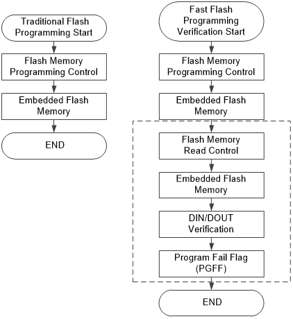 |
|--------------------------------|

Figure 6.4‑10 Fast Flash
Programming Verification Flow

In traditional Flash updated operation, the Flash memory has to perform
three steps to complete the Flash memory updated procedure, (1) Flash
ERASE (2) Flash PROGRAM (3) Flash READ back all of data to check the
correctionIt only reads FMC_ISPSTS to check PGFF flag in Step (3)
without reading data back to confirm. Figure 6.4‑11 compares traditional
programming verification flow and fast programming verification flow.

|  |
|--------------------------------|

Figure 6.4‑11
Verification Flow

The fast Flash programming verification function is released for 32-bit
programming.

#### CRC32 Checksum Calculation

The CRC32 checksum calculation function to help user quickly check the
memory content includes APROM, LDROM, Data Flash. The CRC32 polynomial
is

CRC-32: X32 + X26 + X23 +
X22 + X16 + X12 + X11 +
X10 + X8 + X7 + X5 +
X4 + X2 + X + 1

With seed = 0xFFFF_FFFF

The CRC32 checksum calculation flow is shown in Figure 6.4‑12.

|  |
|--------------------------------|

Figure 6.4‑12 Flash CRC32
Checksum Calculation

Use the following three steps to complete the CRC32 checksum
calculation.

1.  Perform ISP “Run Memory CRC32 Checksum” operation

2.  Perform ISP “Read Memory CRC32 Checksum” operation

3.  Read FMC_ISPDAT to get checksum.

In Step 1, user has to set the memory starting address (FMC_ISPADDR) and
size (FMC_ISPDAT) to calculate. Both address and size have to be 0.5
Kbytes alignment, the size should be ≥ 0.5 Kbytes and the starting
address includes APROM, LDROM, Data Flash.

In Step 2, the FMC_ISPADDR should be kept as the same as Step 1.

In Step 3, the checksum is read from FMC_ISPDAT. If the checksum is
0x0000_0000, there is one of two conditions (1) Checksum calculation is
in-progress, (2) Address and size is over device limitation

#### Flash All One Verification

The Flash all one verification function to help user quickly check a
memory block content blanking for APROM, Data Flash, and LDROM after
Flash erase operation.

Two or Three steps complete this Flash all one verification.

Two-step flow:

4.  Perform ISP “Run Flash All One Verification” operation

5.  Read ALLONE(FMC_ISPSTA\[7\])bit to get the verification result

ALLONE: 1, all of Flash bits are 1 in verification block memory.

ALLONE: 0, Flash bits are not all 1 in verification block memory.

Three-step flow:

1.  
2.  

<!-- -->

6.  Perform ISP “Run Flash All One Verification” operationPerform ISP
    “Read Flash All One Result” operationRead FMC_ISPDAT to get the
    verification result.

> FMC_ISPDATA: 0xA11F_FFFF, all of Flash bits are 1 in verification
> block memory.

FMC_ISPDATA: 0xA110_0000, Flash bits are not all 1 in verification block
memory

In Step 1, user has to set the memory starting address (FMC_ISPADDR) and
size (FMC_ISPDAT) to verify. Both address and size have to be 2 Kbytes
alignment, the size should be ≥ 2 Kbytes and the starting address
includes APROM and LDROM.

In Step 2, the FMC_ISPADDR should be kept as the same as Step 1.

#### Lock Effect Tables

Four kinds of protections include the Security Lock Control (i.e., LOCK
in CONFIG0\[1\] and ALOCK in CONFIG2\[7:0\]). In this section, prepares
some lock effect tables for user to understand the lock effects on
APROM, LDROM, CONFIG and others with above four protections for CPU, ICE
and ICP/Writer.

| LOCK/ALOCK       | OFF |     | ON  |     |
|:-----------------|:----|:----|:----|:----|
| APROM            | R   | W   | R   | W   |
| LDROM            | R   | W   | R   | W   |
| CFG              | R   | W   | R   | W   |
| DID/UID/Checksum | R   | \-  | R   | \-  |

Table 6.4‑4 Lock Effect
Table with Four Protections for CPU

| LOCK/ALOCK       | OFF |     | ON  |     |
|:-----------------|:----|:----|:----|:----|
| APROM            | R   | W   | \-  | \-  |
| LDROM            | R   | W   | \-  | \-  |
| CFG              | R   | W   | R   | \-  |
| DID/UID/Checksum | R   | \-  | R   | \-  |

Table 6.4‑5 Lock Effect
Table with Four Protections for ICE/ ICP/Writer

**Note:**

7.  The symbol “R” means readable and the symbol “W” means writable.

8.  The symbol “X” means no matter what value is.

9.  MassErase (i.e. whole chip erase) can be executed any time and any
    address.

10. When any protection conflicts with another, FMC will adopt the most
    stringent one.

### Register Map

**R**: read only, **W**: write only, **R/W**: both read and write

<table>
<colgroup>
<col style="width: 18%" />
<col style="width: 18%" />
<col style="width: 5%" />
<col style="width: 41%" />
<col style="width: 16%" />
</colgroup>
<thead>
<tr>
<th style="text-align: left;"><strong>Register</strong></th>
<th style="text-align: left;"><strong>Offset</strong></th>
<th style="text-align: left;"><strong>R/W</strong></th>
<th style="text-align: left;"><strong>Description</strong></th>
<th style="text-align: left;"><strong>Reset Value</strong></th>
</tr>
</thead>
<tbody>
<tr>
<td colspan="5" style="text-align: left;">
<strong>FMC Base
Address</strong>

<strong>FMC_BA = 0x4000_C000</strong>
</td>
</tr>
<tr>
<td style="text-align: left;"><strong>FMC_ISPCTL</strong></td>
<td style="text-align: left;">FMC_BA+0x00</td>
<td style="text-align: left;">R/W</td>
<td style="text-align: left;">ISP Control Register</td>
<td style="text-align: left;">0x0000_0008</td>
</tr>
<tr>
<td style="text-align: left;"><strong>FMC_ISPADDR</strong></td>
<td style="text-align: left;">FMC_BA+0x04</td>
<td style="text-align: left;">R/W</td>
<td style="text-align: left;">ISP Address Register</td>
<td style="text-align: left;">0x0000_0000</td>
</tr>
<tr>
<td style="text-align: left;"><strong>FMC_ISPDAT</strong></td>
<td style="text-align: left;">FMC_BA+0x08</td>
<td style="text-align: left;">R/W</td>
<td style="text-align: left;">ISP Data Register</td>
<td style="text-align: left;">0x0000_0000</td>
</tr>
<tr>
<td style="text-align: left;"><strong>FMC_ISPCMD</strong></td>
<td style="text-align: left;">FMC_BA+0x0C</td>
<td style="text-align: left;">R/W</td>
<td style="text-align: left;">ISP Command Register</td>
<td style="text-align: left;">0x0000_0000</td>
</tr>
<tr>
<td style="text-align: left;"><strong>FMC_ISPTRG</strong></td>
<td style="text-align: left;">FMC_BA+0x10</td>
<td style="text-align: left;">R/W</td>
<td style="text-align: left;">ISP Trigger Control Register</td>
<td style="text-align: left;">0x0000_0000</td>
</tr>
<tr>
<td style="text-align: left;"><strong>FMC_ISPSTS</strong></td>
<td style="text-align: left;">FMC_BA+0x40</td>
<td style="text-align: left;">R/W</td>
<td style="text-align: left;">ISP Status Register</td>
<td style="text-align: left;">0xX000_001X</td>
</tr>
<tr>
<td style="text-align: left;"><strong>FMC_CYCCTL</strong></td>
<td style="text-align: left;">FMC_BA+0x4C</td>
<td style="text-align: left;">R/W</td>
<td style="text-align: left;">Flash Access Cycle Control Register</td>
<td style="text-align: left;">0x0000_0101</td>
</tr>
</tbody>
</table>

### Register Description

##### ISP Control Register (FMC_ISPCTL) 

| **Register**   | **Offset**  | **R/W** | **Description**      | **Reset Value** |
|----------------|-------------|---------|----------------------|-----------------|
| **FMC_ISPCTL** | FMC_BA+0x00 | R/W     | ISP Control Register | 0x0000_0008     |

| **31** | **30** | **29** | **28** | **27** | **26** | **25** | **24** |
|:--:|:--:|:--:|:--:|:--:|:--:|:--:|:--:|
| **Reserved** |  |  |  |  |  |  | **INTEN** |
| **23** | **22** | **21** | **20** | **19** | **18** | **17** | **16** |
| **Reserved** |  |  |  |  |  |  | **Reserved** |
| **15** | **14** | **13** | **12** | **11** | **10** | **9** | **8** |
| **Reserved** |  |  |  |  |  |  |  |
| **7** | **6** | **5** | **4** | **3** | **2** | **1** | **0** |
| **Reserved** | **ISPFF** | **LDUEN** | **CFGUEN** | **APUEN** | **SPUEN** | **BS** | **ISPEN** |

<table>
<colgroup>
<col style="width: 6%" />
<col style="width: 8%" />
<col style="width: 85%" />
</colgroup>
<thead>
<tr>
<th><strong>Bits</strong></th>
<th colspan="2"
style="text-align: left;"><strong>Description</strong></th>
</tr>
</thead>
<tbody>
<tr>
<td>[31:25]</td>
<td style="text-align: left;"><strong>Reserved</strong></td>
<td style="text-align: left;">Reserved.</td>
</tr>
<tr>
<td>[24]</td>
<td style="text-align: left;"><strong>INTEN</strong></td>
<td style="text-align: left;">
<strong>INT Enable Bit (Write
Protect)</strong>

0= ISP INT Disabled.

1= ISP INT Enabled.

<strong>Note:</strong> This bit is write protected. Refer to the
SYS_REGLCTL register. Before using INT, user needs to clear the
INTFLAG(FMC_ISPSTS[24]) make sure INT happen at correct time.
</td>
</tr>
<tr>
<td>[23:17]</td>
<td style="text-align: left;"><strong>Reserved</strong></td>
<td style="text-align: left;">Reserved.</td>
</tr>
<tr>
<td>[16]</td>
<td style="text-align: left;"><strong>Reserved</strong></td>
<td style="text-align: left;">Reserved.</td>
</tr>
<tr>
<td>[15:7]</td>
<td style="text-align: left;"><strong>Reserved</strong></td>
<td style="text-align: left;">Reserved.</td>
</tr>
<tr>
<td>[6]</td>
<td style="text-align: left;"><strong>ISPFF</strong></td>
<td style="text-align: left;">
<strong>ISP Fail Flag (Write
Protect)</strong>

This bit is set by hardware when a triggered ISP meets any of the
following conditions:

This bit needs to be cleared by writing 1 to it.

<ul>
<li></li>
<li></li>
<li></li>
<li></li>
<li></li>
<li></li>
<li></li>
<li></li>
</ul>

APROM writes to itself if APUEN is set to 0.LDROM writes to itself if
LDUEN is set to 0.CONFIG is erased/programmed if CFGUEN is set to 0.Page
Erase command at LOCK mode with ICE connection.Erase or Program command
at brown-out detectedDestination address is illegal, such as over an
available range.Invalid ISP commandsMass erase when MERASE (CFG0[13]) is
disabled<strong>Note:</strong> This bit is write protected. Refer to the
SYS_REGLCTL register.
</td>
</tr>
<tr>
<td>[5]</td>
<td style="text-align: left;"><strong>LDUEN</strong></td>
<td style="text-align: left;">
<strong>LDROM Update Enable Bit (Write
Protect)</strong>

0 = LDROM cannot be updated.

1 = LDROM can be updated.

<strong>Note:</strong> This bit is write protected. Refer to the
SYS_REGLCTL register.
</td>
</tr>
<tr>
<td>[4]</td>
<td style="text-align: left;"><strong>CFGUEN</strong></td>
<td style="text-align: left;">
<strong>CONFIG Update Enable Bit (Write
Protect)</strong>

0 = CONFIG cannot be updated.

1 = CONFIG can be updated.

<strong>Note:</strong> This bit is write protected. Refer to the
SYS_REGLCTL register.
</td>
</tr>
<tr>
<td>[3]</td>
<td style="text-align: left;"><strong>APUEN</strong></td>
<td style="text-align: left;">
<strong>APROM Update Enable Bit (Write
Protect)</strong>

0 = APROM cannot be updated when the chip runs in APROM.

1 = APROM can be updated when the chip runs in APROM.

<strong>Note:</strong> This bit is write protected. Refer to the
SYS_REGLCTL register.
</td>
</tr>
<tr>
<td>[2]</td>
<td style="text-align: left;"><strong>SPUEN</strong></td>
<td style="text-align: left;">
<strong>SPROM Update Enable Bit (Write
Protect)</strong>

0 = SPROM cannot be updated.

1 = SPROM can be updated.

<strong>Note:</strong> This bit is write protected. Refer to the
SYS_REGLCTL register.
</td>
</tr>
<tr>
<td>[1]</td>
<td style="text-align: left;"><strong>BS</strong></td>
<td style="text-align: left;">
<strong>Boot Select (Write
Protect)</strong>

Set/clear this bit to select next booting from LDROM/APROM,
respectively. This bit also functions as chip booting status flag, which
can be used to check where chip booted from. This bit is initiated with
the inversed value of CBS (CONFIG0[7]) after any reset is happened
except CPU reset (CPU is 1) or system reset (SYS) is happened

0 = Booting from APROM.

1 = Booting from LDROM.

<strong>Note:</strong> This bit is write protected. Refer to the
SYS_REGLCTL register.
</td>
</tr>
<tr>
<td>[0]</td>
<td style="text-align: left;"><strong>ISPEN</strong></td>
<td style="text-align: left;">
<strong>ISP Enable Flag Bit (Read
Only)</strong>

0 = ISP function is Disabled status.

1 = ISP function is Enabled status.

<strong>Note:</strong> This bit is read only to show ISP function
enable.
</td>
</tr>
</tbody>
</table>

##### ISP Address (FMC_ISPADDR) 

| **Register**    | **Offset**  | **R/W** | **Description**      | **Reset Value** |
|-----------------|-------------|---------|----------------------|-----------------|
| **FMC_ISPADDR** | FMC_BA+0x04 | R/W     | ISP Address Register | 0x0000_0000     |

|   **31**    | **30** | **29** | **28** | **27** | **26** | **25** | **24** |
|:-----------:|:------:|:------:|:------:|:------:|:------:|:------:|:------:|
| **ISPADDR** |        |        |        |        |        |        |        |
|   **23**    | **22** | **21** | **20** | **19** | **18** | **17** | **16** |
| **ISPADDR** |        |        |        |        |        |        |        |
|   **15**    | **14** | **13** | **12** | **11** | **10** | **9**  | **8**  |
| **ISPADDR** |        |        |        |        |        |        |        |
|    **7**    | **6**  | **5**  | **4**  | **3**  | **2**  | **1**  | **0**  |
| **ISPADDR** |        |        |        |        |        |        |        |

<table>
<colgroup>
<col style="width: 5%" />
<col style="width: 8%" />
<col style="width: 86%" />
</colgroup>
<thead>
<tr>
<th><strong>Bits</strong></th>
<th colspan="2"><strong>Description</strong></th>
</tr>
</thead>
<tbody>
<tr>
<td>[31:0]</td>
<td><strong>ISPADDR</strong></td>
<td>
<strong>ISP Address</strong>

Since equipped with embedded Flash. ISPADDR[1:0] must be kept 00 for
ISP 32-bit operation. I

For CRC32 Checksum Calculation command, this field is the Flash
starting address for checksum calculation, 0.5 Kbytes alignment is
necessary for CRC32 checksum calculation.

For Flash32-bit Program, ISP address needs word alignment
(4-byte).
</td>
</tr>
</tbody>
</table>

##### ISP Data Register (FMC_ISPDAT) 

| **Register**   | **Offset**  | **R/W** | **Description**   | **Reset Value** |
|----------------|-------------|---------|-------------------|-----------------|
| **FMC_ISPDAT** | FMC_BA+0x08 | R/W     | ISP Data Register | 0x0000_0000     |

|   **31**   | **30** | **29** | **28** | **27** | **26** | **25** | **24** |
|:----------:|:------:|:------:|:------:|:------:|:------:|:------:|:------:|
| **ISPDAT** |        |        |        |        |        |        |        |
|   **23**   | **22** | **21** | **20** | **19** | **18** | **17** | **16** |
| **ISPDAT** |        |        |        |        |        |        |        |
|   **15**   | **14** | **13** | **12** | **11** | **10** | **9**  | **8**  |
| **ISPDAT** |        |        |        |        |        |        |        |
|   **7**    | **6**  | **5**  | **4**  | **3**  | **2**  | **1**  | **0**  |
| **ISPDAT** |        |        |        |        |        |        |        |

<table>
<colgroup>
<col style="width: 5%" />
<col style="width: 7%" />
<col style="width: 87%" />
</colgroup>
<thead>
<tr>
<th><strong>Bits</strong></th>
<th colspan="2"><strong>Description</strong></th>
</tr>
</thead>
<tbody>
<tr>
<td>[31:0]</td>
<td><strong>ISPDAT</strong></td>
<td>
<strong>ISP Data</strong>

Write data to this register before ISP program operation.

Read data from this register after ISP read operation.

When ISPFF (FMC_ISPCTL[6]) is 1, ISPDAT = 0xffff_ffff. For Run CRC32
Checksum Calculation command, ISPDAT is the memory size (byte) and 0.5
Kbytes alignment. For ISP Read CRC32 Checksum command, ISPDAT is the
checksum result. If ISPDAT = 0x0000_0000, it means that (1) the checksum
calculation is in progress, or (2) the memory range for checksum
calculation is incorrect.
</td>
</tr>
</tbody>
</table>

##### ISP Command Register (FMC_ISPCMD) 

| **Register**   | **Offset**  | **R/W** | **Description**      | **Reset Value** |
|----------------|-------------|---------|----------------------|-----------------|
| **FMC_ISPCMD** | FMC_BA+0x0C | R/W     | ISP Command Register | 0x0000_0000     |

|    **31**    | **30**  | **29** | **28** | **27** | **26** | **25** | **24** |
|:------------:|:-------:|:------:|:------:|:------:|:------:|:------:|:------:|
| **Reserved** |         |        |        |        |        |        |        |
|    **23**    | **22**  | **21** | **20** | **19** | **18** | **17** | **16** |
| **Reserved** |         |        |        |        |        |        |        |
|    **15**    | **14**  | **13** | **12** | **11** | **10** | **9**  | **8**  |
| **Reserved** |         |        |        |        |        |        |        |
|    **7**     |  **6**  | **5**  | **4**  | **3**  | **2**  | **1**  | **0**  |
| **Reserved** | **CMD** |        |        |        |        |        |        |

<table>
<colgroup>
<col style="width: 6%" />
<col style="width: 11%" />
<col style="width: 81%" />
</colgroup>
<thead>
<tr>
<th><strong>Bits</strong></th>
<th colspan="2"
style="text-align: left;"><strong>Description</strong></th>
</tr>
</thead>
<tbody>
<tr>
<td>[31:7]</td>
<td style="text-align: left;"><strong>Reserved</strong></td>
<td style="text-align: left;">Reserved.</td>
</tr>
<tr>
<td>[6:0]</td>
<td style="text-align: left;"><strong>CMD</strong></td>
<td style="text-align: left;">
<strong>ISP Command</strong>

The ISP command table is shown below:

0x00= FLASH Read.

0x04= Read Unique ID.

0x08= Read Flash All-One Result.

0x0B= Read Company ID.

0x0C= Read Device ID.

0x0D= Read Checksum.

0x21= FLASH 32-bit Program.

0x22= FLASH Page Erase. Erase any page in APROM, LDROM and SPROM.

0x28= Run Flash All-One Verification.

0x2D= Run Checksum Calculation.

0x2E= Vector Remap.

The other commands are invalid.
</td>
</tr>
</tbody>
</table>

##### ISP Trigger Control Register (FMC_ISPTRG) 

| **Register** | **Offset** | **R/W** | **Description** | **Reset Value** |
|----|----|----|----|----|
| **FMC_ISPTRG** | FMC_BA+0x10 | R/W | ISP Trigger Control Register | 0x0000_0000 |

|    **31**    | **30** | **29** | **28** | **27** | **26** | **25** |  **24**   |
|:------------:|:------:|:------:|:------:|:------:|:------:|:------:|:---------:|
| **Reserved** |        |        |        |        |        |        |           |
|    **23**    | **22** | **21** | **20** | **19** | **18** | **17** |  **16**   |
| **Reserved** |        |        |        |        |        |        |           |
|    **15**    | **14** | **13** | **12** | **11** | **10** | **9**  |   **8**   |
| **Reserved** |        |        |        |        |        |        |           |
|    **7**     | **6**  | **5**  | **4**  | **3**  | **2**  | **1**  |   **0**   |
| **Reserved** |        |        |        |        |        |        | **ISPGO** |

<table>
<colgroup>
<col style="width: 5%" />
<col style="width: 8%" />
<col style="width: 86%" />
</colgroup>
<thead>
<tr>
<th><strong>Bits</strong></th>
<th colspan="2"
style="text-align: left;"><strong>Description</strong></th>
</tr>
</thead>
<tbody>
<tr>
<td>[31:1]</td>
<td style="text-align: left;"><strong>Reserved</strong></td>
<td style="text-align: left;">Reserved.</td>
</tr>
<tr>
<td>[0]</td>
<td style="text-align: left;"><strong>ISPGO</strong></td>
<td style="text-align: left;">
<strong>ISP Start Trigger (Write
Protect)</strong>

Write 1 to start ISP operation and this bit will be cleared to 0 by
hardware automatically when ISP operation is finished. When ISPGO=1, the
operation of writing value to address from FMC_BA+0x00 to FMC_BA+0x68
would be ignored.

0 = ISP operation is finished.

1 = ISP is progressed.

<strong>Note:</strong> This bit is write protected. Refer to the
SYS_REGLCTL register.
</td>
</tr>
</tbody>
</table>

##### ISP Status Register (FMC_ISPSTS) 

| **Register**   | **Offset**  | **R/W** | **Description**     | **Reset Value** |
|----------------|-------------|---------|---------------------|-----------------|
| **FMC_ISPSTS** | FMC_BA+0x40 | R/W     | ISP Status Register | 0xX000_001X     |

| **31** | **30** | **29** | **28** | **27** | **26** | **25** | **24** |
|:--:|:--:|:--:|:--:|:--:|:--:|:--:|:--:|
| **SCODE** | **Reserved** | **Reserved** | **Reserved** | **Reserved** |  |  | **INTFLAG** |
| **23** | **22** | **21** | **20** | **19** | **18** | **17** | **16** |
| **VECMAP** |  |  |  |  |  |  |  |
| **15** | **14** | **13** | **12** | **11** | **10** | **9** | **8** |
| **VECMAP** |  |  |  |  |  |  | **Reserved** |
| **7** | **6** | **5** | **4** | **3** | **2** | **1** | **0** |
| **ALLONE** | **ISPFF** | **PGFF** | **Reserved** | **Reserved** | **CBS** | **Reserved** | **ISPBUSY** |

<table>
<colgroup>
<col style="width: 6%" />
<col style="width: 8%" />
<col style="width: 85%" />
</colgroup>
<thead>
<tr>
<th><strong>Bits</strong></th>
<th colspan="2"
style="text-align: left;"><strong>Description</strong></th>
</tr>
</thead>
<tbody>
<tr>
<td>[31]</td>
<td style="text-align: left;"><strong>SCODE</strong></td>
<td>
<strong>Security Code Active Flag</strong>

This bit is set by hardware when detecting SPROM secured code is
active at Flash initiation, or software writes 1 to this bit to make
secured code active; this bit is clear by SPROM page erase
operation.

0 = Secured code is inactive.

1 = Secured code is active.
</td>
</tr>
<tr>
<td>[30:25]</td>
<td style="text-align: left;"><strong>Reserved</strong></td>
<td>Reserved.</td>
</tr>
<tr>
<td>[24]</td>
<td style="text-align: left;"><strong>INTFLAG</strong></td>
<td>
<strong>ISP Interrupt Flag</strong>

0 = ISP Not Finished.

1 = ISP done or ISPFF set.

<strong>Note:</strong> This function needs to be enabled by
FMC_ISPCTRL[24].
</td>
</tr>
<tr>
<td>[23:9]</td>
<td style="text-align: left;"><strong>VECMAP</strong></td>
<td>
<strong>Vector Page Mapping Address (Read Only)</strong>

All access to 0x0000_0000~0x0000_01FF is remapped to the Flash memory
address {VECMAP[14:0], 9’h000} ~ {VECMAP[14:0], 9’h1FF}
</td>
</tr>
<tr>
<td>[8]</td>
<td style="text-align: left;"><strong>Reserved</strong></td>
<td>Reserved.</td>
</tr>
<tr>
<td>[7]</td>
<td style="text-align: left;"><strong>ALLONE</strong></td>
<td>
<strong>Flash All-one Verification Flag</strong>

This bit is set by hardware if all of Flash bits are 1, and cleared
if Flash bits are not all 1 after “Run Flash All-One Verification” is
complete; this bit also can be cleared by writing 1

0 = Flash bits are not all 1 after “Run Flash All-One Verification”
is complete.

1 = All of Flash bits are 1 after “Run Flash All-One Verification” is
complete.
</td>
</tr>
<tr>
<td>[6]</td>
<td style="text-align: left;"><strong>ISPFF</strong></td>
<td>
<strong>ISP Fail Flag (Write Protect)</strong>

This bit is the mirror of ISPFF (FMC_ISPCTL[6]), it needs to be
cleared by writing 1 to FMC_ISPCTL[6] or FMC_ISPSTS[6]. This bit is set
by hardware when a triggered ISP meets any of the following
conditions:

<ul>
<li></li>
<li></li>
<li></li>
<li></li>
<li></li>
<li></li>
<li></li>
<li></li>
</ul>

APROM writes to itself if APUEN is set to 0.LDROM writes to itself if
LDUEN is set to 0.CONFIG is erased/programmed if CFGUEN is set to 0.Page
Erase command at LOCK mode with ICE connection.Erase or Program command
at brown-out detectedDestination address is illegal, such as over an
available range.Invalid ISP commandsMass erase when MERASE (CFG0[13]) is
disabled<strong>Note:</strong> This bit is write protected. Refer to the
SYS_REGLCTL register.
</td>
</tr>
<tr>
<td>[5]</td>
<td style="text-align: left;"><strong>PGFF</strong></td>
<td>
<strong>Flash Program with Fast Verification Flag (Read
Only)</strong>

This bit is set if data is mismatched at ISP programming
verification. This bit is cleared by performing ISP Flash erase or ISP
read CID operation

0 = Flash Program is success.

1 = Flash Program is failed. Program data is different with data in
the Flash memory.
</td>
</tr>
<tr>
<td>[4]</td>
<td style="text-align: left;"><strong>Reserved</strong></td>
<td>Reserved.</td>
</tr>
<tr>
<td>[3]</td>
<td style="text-align: left;"><strong>Reserved</strong></td>
<td style="text-align: left;">Reserved.</td>
</tr>
<tr>
<td>[2]</td>
<td style="text-align: left;"><strong>CBS</strong></td>
<td>
<strong>Boot Selection of CONFIG (Read Only)</strong>

This bit is initiated with the CBS (CONFIG0[7]) after any reset is
happened except CPU reset (CPU is 1) or system reset (SYS) is
happened.

The following function is valid when MBYTES (FMC_ISPSTS[3])= 1.

0 = LDROM with IAP mode.

1 = APROM with IAP mode.
</td>
</tr>
<tr>
<td>[1]</td>
<td style="text-align: left;"><strong>Reserved</strong></td>
<td>Reserved.</td>
</tr>
<tr>
<td>[0]</td>
<td style="text-align: left;"><strong>ISPBUSY</strong></td>
<td>
<strong>ISP Busy Flag (Read Only)</strong>

Write 1 to start ISP operation and this bit will be cleared to 0 by
hardware automatically when ISP operation is finished.

This bit is the mirror of ISPGO(FMC_ISPTRG[0]).

0 = ISP operation is finished.

1 = ISP is progressed.
</td>
</tr>
</tbody>
</table>

##### Flash Access Cycle Control Register (FMC_CYCCTL) 

| **Register** | **Offset** | **R/W** | **Description** | **Reset Value** |
|----|----|----|----|----|
| **FMC_CYCCTL** | FMC_BA+0x4C | R/W | Flash Access Cycle Control Register | 0x0000_0101 |

|    **31**    | **30** | **29** | **28** |  **27**   | **26** | **25** | **24** |
|:------------:|:------:|:------:|:------:|:---------:|:------:|:------:|:------:|
| **Reserved** |        |        |        |           |        |        |        |
|    **23**    | **22** | **21** | **20** |  **19**   | **18** | **17** | **16** |
| **Reserved** |        |        |        |           |        |        |        |
|    **15**    | **14** | **13** | **12** |  **11**   | **10** | **9**  | **8**  |
| **Reserved** |        |        |        |           |        |        |        |
|    **7**     | **6**  | **5**  | **4**  |   **3**   | **2**  | **1**  | **0**  |
| **Reserved** |        |        |        | **CYCLE** |        |        |        |

<table>
<colgroup>
<col style="width: 5%" />
<col style="width: 9%" />
<col style="width: 85%" />
</colgroup>
<thead>
<tr>
<th><strong>Bits</strong></th>
<th colspan="2"
style="text-align: left;"><strong>Description</strong></th>
</tr>
</thead>
<tbody>
<tr>
<td>[31:4]</td>
<td style="text-align: left;"><strong>Reserved</strong></td>
<td style="text-align: left;">Reserved.</td>
</tr>
<tr>
<td>[3:0]</td>
<td style="text-align: left;"><strong>CYCLE</strong></td>
<td style="text-align: left;">
<strong>Flash Access Cycle Control
(Write Protect)</strong>

This register is updated by software. User needs to check the speed
of HCLK and set the cycle &gt;0.

0001 = Flash access cycle is 1

The HCLK working frequency range is&lt;25 MHz

The others are reserved.

<strong>Note:</strong> This bit is write protected. Refer to the
SYS_REGLCTL register.
</td>
</tr>
</tbody>
</table>

## General Purpose I/O (GPIO)

### Overview

This chip has up to 18 General Purpose I/O pins to be shared with other
function pins depending on the chip configuration. These 18 pins are
arranged in 4 ports named as PB, PC, PE, and PF. PB has 14 pins on port.
PC has 1 pin on port. PF has 2 pins on port. PE has 1 pins on port. Each
of the 18 pins is independent and has the corresponding register bits to
control the pin mode function and data.

The I/O type of each of I/O pins can be configured by software
individually as Input, Push-pull output, Open-drain output or
Quasi-bidirectional mode. After the chip is reset, the I/O mode of all
pins are depending on CIOINI (CONFIG0\[10\]). Please refer Datasheet for
detailed pin operation voltage information about VDD
electrical characteristics.

### Features

- Four I/O modes:

  - Quasi bi-direction

  - Push-Pull output

  - Open-Drain output

  - Input only with high impendence

- TTL/Schmitt trigger input selectable

- I/O pin configured as interrupt source with edge/level trigger setting

- I/O pin internal pull-up resistor enabled only in Quasi-bidirectional
  I/O mode

- Software selectable slew rate control

- Reset pin can be configured as GPIO

### Block Diagram

|  |
|--------------------------------|

Figure 6.5‑1 GPIO
Controller Block Diagram

|  |
|--------------------------------|

Figure 6.5‑2 GPIO Clock Control Diagram

### Basic Configuration

- Clock Source Selection

  - Enable GPIO peripheral clock in CLK_AHBCLK\[21:20\] and
    CLK_AHB_CLK\[18:17\].

- Reset configuration

  - Reset GPIO in GPIORST (SYS_IPRST1\[1\])

### 

#### Functional DescriptionInput Mode

Set MODEn (Px_MODE\[2n+1:2n\]) to 00 as the Px.n pin is in Input mode
and the I/O pin is in tri-state (high impedance) without output drive
capability. The PIN (Px_PIN\[n\]) value reflects the status of the
corresponding port pins.

Each I/O pin includes an internal resistor. Set (Px_PUSEL\[2n+1:2n\]) to
01 to enable internal pull-up resistor and (Px_PUSEL\[2n+1:2n\]) to 10
to enable internal pull-down resistor. Setting both pull-up/down is not
available.

Figure 6.5‑3 Input Mode

#### Push-pull Output Mode

Figure 6.5‑ shows the diagram of Push-pull Output Mode. Set MODEn
(Px_MODE\[2n+1:2n\]) to 01 as Px.n pin is in Push-pull Output mode and
the I/O pin supports digital output function with source/sink current
capability. The bit value in the corresponding DOUT (Px_DOUT\[n\]) is
driven on the pin.

|  |
|--------------------------------|

Figure 6.5‑4 Push-Pull Output

#### Open-drain Mode

Figure 6.5‑ shows the diagram of Open-drain Mode. Set MODEn
(Px_MODE\[2n+1:2n\]) to 10 the Px.n pin is in Open-drain mode and the
digital output function of I/O pin supports only sink current
capability, an external pull-up register is needed for driving high
state. If the bit value in the corresponding DOUT (Px_DOUT\[n\]) bit is
0, the pin drive a low output on the pin. If the bit value in the
corresponding DOUT (Px_DOUT\[n\]) bit is 1, the pin output drives high
that is controlled by external pull high resistor.

Each I/O pin includes an internal resistor. Set (Px_PUSEL\[2n+1:2n\]) to
01 to enable internal pull-up resistor. Only pull-up is available in
Open-drain mode.

|  |
|--------------------------------|

Figure 6.5‑5 Open-Drain Output

#### Quasi-bidirectional Mode 

Figure 6.5‑ shows the diagram of Quasi-bidirectional Mode. Set MODEn
(Px_MODE\[2n+1:2n\]) to 11 as the Px.n pin is in Quasi-bidirectional
mode and the I/O pin supports digital output and input function at the
same time but the source current is only up to hundreds uA. Before the
digital input function is performed the corresponding DOUT
(Px_DOUT\[n\]) bit must be set to 1. The quasi-bidirectional output is
common on the 80C51 and most of its derivatives. If the bit value in the
corresponding DOUT (Px_DOUT\[n\]) bit is 0, the pin drive a low output
on the pin. If the bit value in the corresponding DOUT (Px_DOUT\[n\])
bit is 1, the pin will check the pin value. If pin value is high, no
action takes. If pin state is low, the pin will drive strong high with 2
clock cycles on the pin and then disable the strong output drive.
Meanwhile, the pin status is controlled by internal pull-up resistor.
Note that the source current capability in quasi-bidirectional mode,
please refer Datasheet for detailed information.

|  |
|--------------------------------|

Figure 6.5‑6 Quasi-Bidirectional I/O Mode

#### GPIO Interrupt and Wake-up Function

Each GPIO pin can be set as chip interrupt source by setting correlative
RHIEN (Px_INTEN\[n+16\])/ FLIEN (Px_INTEN\[n\]) bit and TYPE
(Px_INTTYPE\[n\]). There are five types of interrupt condition can be
selected: low level trigger, high level trigger, falling edge trigger,
rising edge trigger and both rising and falling edge trigger. The GPIO
can also be the chip wake-up source when chip enters Idle/Power-down
mode. Level trigger source needs to keep its state until entering
interrupt handler. The setting of wake-up trigger condition is the same
as GPIO interrupt trigger.

#### GPIO De-bounce Function

GPIO de-bounce function can be used to sample interrupt input for each
GPIO pin and prevent unexpected interrupt happened which caused by
noise. GPIO de-bounce function only support edge detection trigger type
For edge trigger condition, there are three types of interrupt
conditions that can be selected for de-bounce function: falling edge
trigger, rising edge trigger and both rising and falling edge trigger If
user wants to use de-bounce function, de-bounce enable control register
Px_DBEN must be set for corresponding GPIO pin. The de-bounce clock
source can be HCLK or LIRC (10 kHz) by setting DBCLKSRC (Px_DBCTL\[4\])
register. And DBCLKSEL (Px_DBCTL\[3:0\]) register can control sampling
cycle period.

Figure 6.5‑ shows GPIO rising edge trigger interrupt. The interval of
time between the two valid sample signal is determined by DBCLKSRC
(Px_DBCTL\[4\]) and DBCLKSEL (Px_DBCTL\[3:0\]). Each valid data from
GPIO pin need to be sample twice. For rising edge setting, if pin status
is low before setting DBEN (Px_DBEN), interrupt will happen when
generating a pin high valid data. But, if pin status is high before
setting DBEN (Px_DBEN), interrupt will happen when generating a pin low
valid data first, and then generating a pin high valid data. For falling
edge trigger, Figure 6.5‑ shows the situation is opposite to rising edge
trigger.

|  |
|--------------------------------|

Figure 6.5‑7 GPIO Rising Edge Trigger Interrupt

|  |
|--------------------------------|

Figure 6.5‑8 GPIO Falling Edge Trigger Interrupt

#### GPIO Digital Input Path Disable Control

User can disable GPIO digital input path by setting DINOFF
(Px_DINOFF\[n+16\]). When GPIO digital input path is disabled, the
digital input pin value PIN (Px_PIN\[n\]) is tied to low. By the way,
the GPIO digital input path is force disabled by hardware and DINOFF
control is useless when I/O function configure as ADC.

### Register Map

**R**: read only, **W**: write only, **R/W**: both read and write

<table>
<colgroup>
<col style="width: 14%" />
<col style="width: 26%" />
<col style="width: 4%" />
<col style="width: 40%" />
<col style="width: 14%" />
</colgroup>
<tbody>
<tr>
<td style="text-align: left;"><strong>Register</strong></td>
<td style="text-align: left;"><strong>Offset</strong></td>
<td style="text-align: left;"><strong>R/W</strong></td>
<td style="text-align: left;"><strong>Description</strong></td>
<td style="text-align: left;"><strong>Reset Value</strong></td>
</tr>
<tr>
<td colspan="5" style="text-align: left;">
<strong>GPIO Base
Address:</strong>

<strong>GPIO_BA = 0x4000_4000</strong>
</td>
</tr>
<tr>
<td style="text-align: left;"><strong>PB_MODE</strong></td>
<td style="text-align: left;">GPIO_BA+0x040</td>
<td style="text-align: left;">R/W</td>
<td style="text-align: left;">PB I/O Mode Control</td>
<td style="text-align: left;">0xXXXX_XXXX</td>
</tr>
<tr>
<td style="text-align: left;"><strong>PB_DINOFF</strong></td>
<td style="text-align: left;">GPIO_BA+0x044</td>
<td style="text-align: left;">R/W</td>
<td style="text-align: left;">PB Digital Input Path Disable Control</td>
<td style="text-align: left;">0x0000_0000</td>
</tr>
<tr>
<td style="text-align: left;"><strong>PB_DOUT</strong></td>
<td style="text-align: left;">GPIO_BA+0x048</td>
<td style="text-align: left;">R/W</td>
<td style="text-align: left;">PB Data Output Value</td>
<td style="text-align: left;">0x0000_FFFF</td>
</tr>
<tr>
<td style="text-align: left;"><strong>PB_DATMSK</strong></td>
<td style="text-align: left;">GPIO_BA+0x04C</td>
<td style="text-align: left;">R/W</td>
<td style="text-align: left;">PB Data Output Write Mask</td>
<td style="text-align: left;">0x0000_0000</td>
</tr>
<tr>
<td style="text-align: left;"><strong>PB_PIN</strong></td>
<td style="text-align: left;">GPIO_BA+0x050</td>
<td style="text-align: left;">R</td>
<td style="text-align: left;">PB Pin Value</td>
<td style="text-align: left;">0x0000_XXXX</td>
</tr>
<tr>
<td style="text-align: left;"><strong>PB_DBEN</strong></td>
<td style="text-align: left;">GPIO_BA+0x054</td>
<td style="text-align: left;">R/W</td>
<td style="text-align: left;">PB De-bounce Enable Control Register</td>
<td style="text-align: left;">0x0000_0000</td>
</tr>
<tr>
<td style="text-align: left;"><strong>PB_INTTYPE</strong></td>
<td style="text-align: left;">GPIO_BA+0x058</td>
<td style="text-align: left;">R/W</td>
<td style="text-align: left;">PB Interrupt Trigger Type Control</td>
<td style="text-align: left;">0x0000_0000</td>
</tr>
<tr>
<td style="text-align: left;"><strong>PB_INTEN</strong></td>
<td style="text-align: left;">GPIO_BA+0x05C</td>
<td style="text-align: left;">R/W</td>
<td style="text-align: left;">PB Interrupt Enable Control Register</td>
<td style="text-align: left;">0x0000_0000</td>
</tr>
<tr>
<td style="text-align: left;"><strong>PB_INTSRC</strong></td>
<td style="text-align: left;">GPIO_BA+0x060</td>
<td style="text-align: left;">R/W</td>
<td style="text-align: left;">PB Interrupt Source Flag</td>
<td style="text-align: left;">0x0000_XXXX</td>
</tr>
<tr>
<td style="text-align: left;"><strong>PB_SMTEN</strong></td>
<td style="text-align: left;">GPIO_BA+0x064</td>
<td style="text-align: left;">R/W</td>
<td style="text-align: left;">PB Input Schmitt Trigger Enable
Register</td>
<td style="text-align: left;">0x0000_0000</td>
</tr>
<tr>
<td style="text-align: left;"><strong>PB_SLEWCTL</strong></td>
<td style="text-align: left;">GPIO_BA+0x068</td>
<td style="text-align: left;">R/W</td>
<td style="text-align: left;">PB High Slew Rate Control Register</td>
<td style="text-align: left;">0x0000_0000</td>
</tr>
<tr>
<td style="text-align: left;"><strong>PB_PUSEL</strong></td>
<td style="text-align: left;">GPIO_BA+0x070</td>
<td style="text-align: left;">R/W</td>
<td style="text-align: left;">PB Pull-up and Pull-down Selection
Register</td>
<td style="text-align: left;">0x0000_0000</td>
</tr>
<tr>
<td style="text-align: left;"><strong>PB_DBCTL</strong></td>
<td style="text-align: left;">GPIO_BA+0x074</td>
<td style="text-align: left;">R/W</td>
<td style="text-align: left;">PB Interrupt De-bounce Control
Register</td>
<td style="text-align: left;">0x0000_0020</td>
</tr>
<tr>
<td style="text-align: left;"><strong>PC_MODE</strong></td>
<td style="text-align: left;">GPIO_BA+0x080</td>
<td style="text-align: left;">R/W</td>
<td style="text-align: left;">PC I/O Mode Control</td>
<td style="text-align: left;">0xXXXX_XXXX</td>
</tr>
<tr>
<td style="text-align: left;"><strong>PC_DINOFF</strong></td>
<td style="text-align: left;">GPIO_BA+0x084</td>
<td style="text-align: left;">R/W</td>
<td style="text-align: left;">PC Digital Input Path Disable Control</td>
<td style="text-align: left;">0x0000_0000</td>
</tr>
<tr>
<td style="text-align: left;"><strong>PC_DOUT</strong></td>
<td style="text-align: left;">GPIO_BA+0x088</td>
<td style="text-align: left;">R/W</td>
<td style="text-align: left;">PC Data Output Value</td>
<td style="text-align: left;">0x0000_C0FF</td>
</tr>
<tr>
<td style="text-align: left;"><strong>PC_DATMSK</strong></td>
<td style="text-align: left;">GPIO_BA+0x08C</td>
<td style="text-align: left;">R/W</td>
<td style="text-align: left;">PC Data Output Write Mask</td>
<td style="text-align: left;">0x0000_0000</td>
</tr>
<tr>
<td style="text-align: left;"><strong>PC_PIN</strong></td>
<td style="text-align: left;">GPIO_BA+0x090</td>
<td style="text-align: left;">R</td>
<td style="text-align: left;">PC Pin Value</td>
<td style="text-align: left;">0x0000_XXXX</td>
</tr>
<tr>
<td style="text-align: left;"><strong>PC_DBEN</strong></td>
<td style="text-align: left;">GPIO_BA+0x094</td>
<td style="text-align: left;">R/W</td>
<td style="text-align: left;">PC De-bounce Enable Control Register</td>
<td style="text-align: left;">0x0000_0000</td>
</tr>
<tr>
<td style="text-align: left;"><strong>PC_INTTYPE</strong></td>
<td style="text-align: left;">GPIO_BA+0x098</td>
<td style="text-align: left;">R/W</td>
<td style="text-align: left;">PC Interrupt Trigger Type Control</td>
<td style="text-align: left;">0x0000_0000</td>
</tr>
<tr>
<td style="text-align: left;"><strong>PC_INTEN</strong></td>
<td style="text-align: left;">GPIO_BA+0x09C</td>
<td style="text-align: left;">R/W</td>
<td style="text-align: left;">PC Interrupt Enable Control Register</td>
<td style="text-align: left;">0x0000_0000</td>
</tr>
<tr>
<td style="text-align: left;"><strong>PC_INTSRC</strong></td>
<td style="text-align: left;">GPIO_BA+0x0A0</td>
<td style="text-align: left;">R/W</td>
<td style="text-align: left;">PC Interrupt Source Flag</td>
<td style="text-align: left;">0x0000_XXXX</td>
</tr>
<tr>
<td style="text-align: left;"><strong>PC_SMTEN</strong></td>
<td style="text-align: left;">GPIO_BA+0x0A4</td>
<td style="text-align: left;">R/W</td>
<td style="text-align: left;">PC Input Schmitt Trigger Enable
Register</td>
<td style="text-align: left;">0x0000_0000</td>
</tr>
<tr>
<td style="text-align: left;"><strong>PC_SLEWCTL</strong></td>
<td style="text-align: left;">GPIO_BA+0x0A8</td>
<td style="text-align: left;">R/W</td>
<td style="text-align: left;">PC High Slew Rate Control Register</td>
<td style="text-align: left;">0x0000_0000</td>
</tr>
<tr>
<td style="text-align: left;"><strong>PC_PUSEL</strong></td>
<td style="text-align: left;">GPIO_BA+0x0B0</td>
<td style="text-align: left;">R/W</td>
<td style="text-align: left;">PC Pull-up and Pull-down Selection
Register</td>
<td style="text-align: left;">0x0000_0000</td>
</tr>
<tr>
<td style="text-align: left;"><strong>PC_DBCTL</strong></td>
<td style="text-align: left;">GPIO_BA+0x0B4</td>
<td style="text-align: left;">R/W</td>
<td style="text-align: left;">PC Interrupt De-bounce Control
Register</td>
<td style="text-align: left;">0x0000_0020</td>
</tr>
<tr>
<td style="text-align: left;"><strong>PE_PIN</strong></td>
<td style="text-align: left;">GPIO_BA+0x110</td>
<td style="text-align: left;">R</td>
<td style="text-align: left;">PE Pin Value</td>
<td style="text-align: left;">0x0000_XXXX</td>
</tr>
<tr>
<td style="text-align: left;"><strong>PE_DBEN</strong></td>
<td style="text-align: left;">GPIO_BA+0x114</td>
<td style="text-align: left;">R/W</td>
<td style="text-align: left;">PE De-bounce Enable Control Register</td>
<td style="text-align: left;">0x0000_0000</td>
</tr>
<tr>
<td style="text-align: left;"><strong>PE_INTTYPE</strong></td>
<td style="text-align: left;">GPIO_BA+0x118</td>
<td style="text-align: left;">R/W</td>
<td style="text-align: left;">PE Interrupt Trigger Type Control</td>
<td style="text-align: left;">0x0000_0000</td>
</tr>
<tr>
<td style="text-align: left;"><strong>PE_INTEN</strong></td>
<td style="text-align: left;">GPIO_BA+0x11C</td>
<td style="text-align: left;">R/W</td>
<td style="text-align: left;">PE Interrupt Enable Control Register</td>
<td style="text-align: left;">0x0000_0000</td>
</tr>
<tr>
<td style="text-align: left;"><strong>PE_INTSRC</strong></td>
<td style="text-align: left;">GPIO_BA+0x120</td>
<td style="text-align: left;">R/W</td>
<td style="text-align: left;">PE Interrupt Source Flag</td>
<td style="text-align: left;">0x0000_XXXX</td>
</tr>
<tr>
<td style="text-align: left;"><strong>PE_PUSEL</strong></td>
<td style="text-align: left;">GPIO_BA+0x130</td>
<td style="text-align: left;">R/W</td>
<td style="text-align: left;">PE Pull-up Selection Register</td>
<td style="text-align: left;">0x0000_0000</td>
</tr>
<tr>
<td style="text-align: left;"><strong>PE_DBCTL</strong></td>
<td style="text-align: left;">GPIO_BA+0x134</td>
<td style="text-align: left;">R/W</td>
<td style="text-align: left;">PE Interrupt De-bounce Control
Register</td>
<td style="text-align: left;">0x0000_0020</td>
</tr>
<tr>
<td style="text-align: left;"><strong>PF_MODE</strong></td>
<td style="text-align: left;">GPIO_BA+0x140</td>
<td style="text-align: left;">R/W</td>
<td style="text-align: left;">PF I/O Mode Control</td>
<td style="text-align: left;">0xXXXX_XXXX</td>
</tr>
<tr>
<td style="text-align: left;"><strong>PF_DINOFF</strong></td>
<td style="text-align: left;">GPIO_BA+0x144</td>
<td style="text-align: left;">R/W</td>
<td style="text-align: left;">PF Digital Input Path Disable Control</td>
<td style="text-align: left;">0x0000_0000</td>
</tr>
<tr>
<td style="text-align: left;"><strong>PF_DOUT</strong></td>
<td style="text-align: left;">GPIO_BA+0x148</td>
<td style="text-align: left;">R/W</td>
<td style="text-align: left;">PF Data Output Value</td>
<td style="text-align: left;">0x0000_C07F</td>
</tr>
<tr>
<td style="text-align: left;"><strong>PF_DATMSK</strong></td>
<td style="text-align: left;">GPIO_BA+0x14C</td>
<td style="text-align: left;">R/W</td>
<td style="text-align: left;">PF Data Output Write Mask</td>
<td style="text-align: left;">0x0000_0000</td>
</tr>
<tr>
<td style="text-align: left;"><strong>PF_PIN</strong></td>
<td style="text-align: left;">GPIO_BA+0x150</td>
<td style="text-align: left;">R</td>
<td style="text-align: left;">PF Pin Value</td>
<td style="text-align: left;">0x0000_XXXX</td>
</tr>
<tr>
<td style="text-align: left;"><strong>PF_DBEN</strong></td>
<td style="text-align: left;">GPIO_BA+0x154</td>
<td style="text-align: left;">R/W</td>
<td style="text-align: left;">PF De-bounce Enable Control Register</td>
<td style="text-align: left;">0x0000_0000</td>
</tr>
<tr>
<td style="text-align: left;"><strong>PF_INTTYPE</strong></td>
<td style="text-align: left;">GPIO_BA+0x158</td>
<td style="text-align: left;">R/W</td>
<td style="text-align: left;">PF Interrupt Trigger Type Control</td>
<td style="text-align: left;">0x0000_0000</td>
</tr>
<tr>
<td style="text-align: left;"><strong>PF_INTEN</strong></td>
<td style="text-align: left;">GPIO_BA+0x15C</td>
<td style="text-align: left;">R/W</td>
<td style="text-align: left;">PF Interrupt Enable Control Register</td>
<td style="text-align: left;">0x0000_0000</td>
</tr>
<tr>
<td style="text-align: left;"><strong>PF_INTSRC</strong></td>
<td style="text-align: left;">GPIO_BA+0x160</td>
<td style="text-align: left;">R/W</td>
<td style="text-align: left;">PF Interrupt Source Flag</td>
<td style="text-align: left;">0x0000_XXXX</td>
</tr>
<tr>
<td style="text-align: left;"><strong>PF_SMTEN</strong></td>
<td style="text-align: left;">GPIO_BA+0x164</td>
<td style="text-align: left;">R/W</td>
<td style="text-align: left;">PF Input Schmitt Trigger Enable
Register</td>
<td style="text-align: left;">0x0000_0000</td>
</tr>
<tr>
<td style="text-align: left;"><strong>PF_SLEWCTL</strong></td>
<td style="text-align: left;">GPIO_BA+0x168</td>
<td style="text-align: left;">R/W</td>
<td style="text-align: left;">PF High Slew Rate Control Register</td>
<td style="text-align: left;">0x0000_0000</td>
</tr>
<tr>
<td style="text-align: left;"><strong>PF_PUSEL</strong></td>
<td style="text-align: left;">GPIO_BA+0x170</td>
<td style="text-align: left;">R/W</td>
<td style="text-align: left;">PF Pull-up and Pull-down Selection
Register</td>
<td style="text-align: left;">0x0000_0000</td>
</tr>
<tr>
<td style="text-align: left;"><strong>PF_DBCTL</strong></td>
<td style="text-align: left;">GPIO_BA+0x174</td>
<td style="text-align: left;">R/W</td>
<td style="text-align: left;">PF Interrupt De-bounce Control
Register</td>
<td style="text-align: left;">0x0000_0020</td>
</tr>
<tr>
<td style="text-align: left;">
<strong>PBn_PDIO</strong>

<strong>n=0,1..15</strong>
</td>
<td style="text-align: left;">GPIO_BA+0x840+(0x04 * n)</td>
<td style="text-align: left;">R/W</td>
<td style="text-align: left;">GPIO PB.n Pin Data Input/Output
Register</td>
<td style="text-align: left;">0x0000_000X</td>
</tr>
<tr>
<td style="text-align: left;">
<strong>PCn_PDIO</strong>

<strong>n=0,1..15</strong>
</td>
<td style="text-align: left;">GPIO_BA+0x880+(0x04 * n)</td>
<td style="text-align: left;">R/W</td>
<td style="text-align: left;">GPIO PC.n Pin Data Input/Output
Register</td>
<td style="text-align: left;">0x0000_000X</td>
</tr>
<tr>
<td style="text-align: left;">
<strong>PEn_PDIO</strong>

<strong>n=0,1..15</strong>
</td>
<td style="text-align: left;">GPIO_BA+0x900+(0x04 * n)</td>
<td style="text-align: left;">R/W</td>
<td style="text-align: left;">GPIO PE.n Pin Data Input/Output
Register</td>
<td style="text-align: left;">0x0000_000X</td>
</tr>
<tr>
<td style="text-align: left;">
<strong>PFn_PDIO</strong>

<strong>n=0,1..15</strong>
</td>
<td style="text-align: left;">GPIO_BA+0x940+(0x04 * n)</td>
<td style="text-align: left;">R/W</td>
<td style="text-align: left;">GPIO PF.n Pin Data Input/Output
Register</td>
<td style="text-align: left;">0x0000_000X</td>
</tr>
</tbody>
</table>

### Register Description

##### Port B-F I/O Mode Control (Px_MODE) 

|              |               |         |                     |                 |
|:-------------|:--------------|:--------|:--------------------|:----------------|
| **Register** | **Offset**    | **R/W** | **Description**     | **Reset Value** |
| **PB_MODE**  | GPIO_BA+0x040 | R/W     | PB I/O Mode Control | 0xXXXX_XXXX     |
| **PC_MODE**  | GPIO_BA+0x080 | R/W     | PC I/O Mode Control | 0xXXXX_XXXX     |
| **PF_MODE**  | GPIO_BA+0x140 | R/W     | PF I/O Mode Control | 0xXXXX_XXXX     |

|            |        |            |        |            |        |            |        |
|:----------:|:------:|:----------:|:------:|:----------:|:------:|:----------:|:------:|
|   **31**   | **30** |   **29**   | **28** |   **27**   | **26** |   **25**   | **24** |
| **MODE15** |        | **MODE14** |        | **MODE13** |        | **MODE12** |        |
|   **23**   | **22** |   **21**   | **20** |   **19**   | **18** |   **17**   | **16** |
| **MODE11** |        | **MODE10** |        | **MODE9**  |        | **MODE8**  |        |
|   **15**   | **14** |   **13**   | **12** |   **11**   | **10** |   **9**    | **8**  |
| **MODE7**  |        | **MODE6**  |        | **MODE5**  |        | **MODE4**  |        |
|   **7**    | **6**  |   **5**    | **4**  |   **3**    | **2**  |   **1**    | **0**  |
| **MODE3**  |        | **MODE2**  |        | **MODE1**  |        | **MODE0**  |        |

<table>
<colgroup>
<col style="width: 8%" />
<col style="width: 6%" />
<col style="width: 84%" />
</colgroup>
<tbody>
<tr>
<td style="text-align: left;"><strong>Bits</strong></td>
<td colspan="2"
style="text-align: left;"><strong>Description</strong></td>
</tr>
<tr>
<td style="text-align: left;">
[2n+1:2n]

n=0,1..15
</td>
<td style="text-align: left;"><strong>MODEn</strong></td>
<td style="text-align: left;">
<strong>Port B-F I/O Pin[n] Mode
Control</strong>

Determine each I/O mode of Px.n pins.

00 = Px.n is in Input mode (tri-state).

01 = Px.n is in Push-pull Output mode.

10 = Px.n is in Open-drain Output mode.

11 = Px.n is in Quasi-bidirectional mode.

<strong>Note 1:</strong> The initial value of this field is defined
by CIOINI (CONFIG0 [10]). 
If CIOINI is set to 0, the default value is 0xFFFF_FFFF and all pins
will be quasi-bidirectional mode after chip powered on. 
If CIOINI is set to 1, the default value is 0x0000_0000 and all pins
will be 
input mode after chip powered on.

<strong>Note 2:</strong> The PB.6/PB.10/PC.0~13/PC.15/PE.0~15/
PF.3~15 pins are ignored.

<strong>Note 3:</strong> If MFOS is enabled then GPIO mode setting is
ignored.
</td>
</tr>
</tbody>
</table>

##### Port B-F Digital Input Path Disable Control (Px_DINOFF) 

|  |  |  |  |  |
|:---|:---|:---|:---|:---|
| **Register** | **Offset** | **R/W** | **Description** | **Reset Value** |
| **PB_DINOFF** | GPIO_BA+0x044 | R/W | PB Digital Input Path Disable Control | 0x0000_0000 |
| **PC_DINOFF** | GPIO_BA+0x084 | R/W | PC Digital Input Path Disable Control | 0x0000_0000 |
| **PF_DINOFF** | GPIO_BA+0x144 | R/W | PF Digital Input Path Disable Control | 0x0000_0000 |

|              |        |        |        |        |        |        |        |
|:------------:|:------:|:------:|:------:|:------:|:------:|:------:|:------:|
|    **31**    | **30** | **29** | **28** | **27** | **26** | **25** | **24** |
|  **DINOFF**  |        |        |        |        |        |        |        |
|    **23**    | **22** | **21** | **20** | **19** | **18** | **17** | **16** |
|  **DINOFF**  |        |        |        |        |        |        |        |
|    **15**    | **14** | **13** | **12** | **11** | **10** | **9**  | **8**  |
| **Reserved** |        |        |        |        |        |        |        |
|    **7**     | **6**  | **5**  | **4**  | **3**  | **2**  | **1**  | **0**  |
| **Reserved** |        |        |        |        |        |        |        |

<table>
<colgroup>
<col style="width: 8%" />
<col style="width: 9%" />
<col style="width: 82%" />
</colgroup>
<tbody>
<tr>
<td style="text-align: left;"><strong>Bits</strong></td>
<td colspan="2"
style="text-align: left;"><strong>Description</strong></td>
</tr>
<tr>
<td style="text-align: left;">
[n+16]

n=0,1..15
</td>
<td style="text-align: left;"><strong>DINOFF[n]</strong></td>
<td style="text-align: left;">
<strong>Port B-F Pin[n] Digital Input
Path Disable Bit</strong>

Each of these bits is used to control if the digital input path of
corresponding Px.n pin is disabled. If input is analog signal, users can
disable Px.n digital input path to avoid input current leakage.

0 = Px.n digital input path Enabled.

1 = Px.n digital input path Disabled (digital input tied to low).

<strong>Note:</strong> The PB.6/PB.10/PC.0~13/PC.15/PE.0~15/ PF.3~15
pins are ignored.
</td>
</tr>
<tr>
<td style="text-align: left;">[15:0]</td>
<td style="text-align: left;"><strong>Reserved</strong></td>
<td style="text-align: left;">Reserved.</td>
</tr>
</tbody>
</table>

##### Port B-F Data Output Value (Px_DOUT) 

|              |               |         |                      |                 |
|:-------------|:--------------|:--------|:---------------------|:----------------|
| **Register** | **Offset**    | **R/W** | **Description**      | **Reset Value** |
| **PB_DOUT**  | GPIO_BA+0x048 | R/W     | PB Data Output Value | 0x0000_FFFF     |
| **PC_DOUT**  | GPIO_BA+0x088 | R/W     | PC Data Output Value | 0x0000_C0FF     |
| **PF_DOUT**  | GPIO_BA+0x148 | R/W     | PF Data Output Value | 0x0000_C07F     |

|              |        |        |        |        |        |        |        |
|:------------:|:------:|:------:|:------:|:------:|:------:|:------:|:------:|
|    **31**    | **30** | **29** | **28** | **27** | **26** | **25** | **24** |
| **Reserved** |        |        |        |        |        |        |        |
|    **23**    | **22** | **21** | **20** | **19** | **18** | **17** | **16** |
| **Reserved** |        |        |        |        |        |        |        |
|    **15**    | **14** | **13** | **12** | **11** | **10** | **9**  | **8**  |
|   **DOUT**   |        |        |        |        |        |        |        |
|    **7**     | **6**  | **5**  | **4**  | **3**  | **2**  | **1**  | **0**  |
|   **DOUT**   |        |        |        |        |        |        |        |

<table>
<colgroup>
<col style="width: 8%" />
<col style="width: 8%" />
<col style="width: 83%" />
</colgroup>
<tbody>
<tr>
<td style="text-align: left;"><strong>Bits</strong></td>
<td colspan="2"
style="text-align: left;"><strong>Description</strong></td>
</tr>
<tr>
<td style="text-align: left;">[31:16]</td>
<td style="text-align: left;"><strong>Reserved</strong></td>
<td style="text-align: left;">Reserved.</td>
</tr>
<tr>
<td style="text-align: left;">
[n]

n=0,1..15
</td>
<td style="text-align: left;"><strong>DOUT[n]</strong></td>
<td style="text-align: left;">
<strong>Port B-F Pin[n] Output
Value</strong>

Each of these bits controls the status of a Px.n pin when the Px.n is
configured as Push-pull output, Open-drain output or Quasi-bidirectional
mode.

0 = Px.n will drive Low if the Px.n pin is configured as Push-pull
output, Open-drain output or Quasi-bidirectional mode.

1 = Px.n will drive High if the Px.n pin is configured as Push-pull
output or Quasi-bidirectional mode.

<strong>Note:</strong> The PB.6/PB.10/PC.0~13/PC.15/PE.0~15/ PF.3~15
pins are ignored.
</td>
</tr>
</tbody>
</table>

##### Port B-F Data Output Write Mask (Px_DATMSK) 

|  |  |  |  |  |
|:---|:---|:---|:---|:---|
| **Register** | **Offset** | **R/W** | **Description** | **Reset Value** |
| **PB_DATMSK** | GPIO_BA+0x04C | R/W | PB Data Output Write Mask | 0x0000_0000 |
| **PC_DATMSK** | GPIO_BA+0x08C | R/W | PC Data Output Write Mask | 0x0000_0000 |
| **PF_DATMSK** | GPIO_BA+0x14C | R/W | PF Data Output Write Mask | 0x0000_0000 |

|              |        |        |        |        |        |        |        |
|:------------:|:------:|:------:|:------:|:------:|:------:|:------:|:------:|
|    **31**    | **30** | **29** | **28** | **27** | **26** | **25** | **24** |
| **Reserved** |        |        |        |        |        |        |        |
|    **23**    | **22** | **21** | **20** | **19** | **18** | **17** | **16** |
| **Reserved** |        |        |        |        |        |        |        |
|    **15**    | **14** | **13** | **12** | **11** | **10** | **9**  | **8**  |
|  **DATMSK**  |        |        |        |        |        |        |        |
|    **7**     | **6**  | **5**  | **4**  | **3**  | **2**  | **1**  | **0**  |
|  **DATMSK**  |        |        |        |        |        |        |        |

<table>
<colgroup>
<col style="width: 8%" />
<col style="width: 10%" />
<col style="width: 81%" />
</colgroup>
<tbody>
<tr>
<td style="text-align: left;"><strong>Bits</strong></td>
<td colspan="2"
style="text-align: left;"><strong>Description</strong></td>
</tr>
<tr>
<td style="text-align: left;">[31:8]</td>
<td style="text-align: left;"><strong>Reserved</strong></td>
<td style="text-align: left;">Reserved.</td>
</tr>
<tr>
<td style="text-align: left;">
[n]

n=0,1..15
</td>
<td style="text-align: left;"><strong>DATMSK[n]</strong></td>
<td style="text-align: left;">
<strong>Port B-F Pin[n] Data Output
Write Mask</strong>

These bits are used to protect the corresponding DOUT (Px_DOUT[n])
bit. When the DATMSK (Px_DATMSK[n]) bit is set to 1, the corresponding
DOUT (Px_DOUT[n]) bit is protected. If the write signal is masked,
writing data to the protect bit is ineffective.

0 = Corresponding DOUT (Px_DOUT[n]) bit can be updated.

1 = Corresponding DOUT (Px_DOUT[n]) bit protected.

<strong>Note 1:</strong> This function only protects the
corresponding DOUT (Px_DOUT[n]) bit, and will not protect the
corresponding PDIO (Pxn_PDIO[0]) bit.

<strong>Note 2:</strong> The PB.6/PB.10/PC.0~13/PC.15/PE.0~15/
PF.3~15 pins are ignored.
</td>
</tr>
</tbody>
</table>

##### Port B-F Pin Value (Px_PIN) 

|              |               |         |                 |                 |
|:-------------|:--------------|:--------|:----------------|:----------------|
| **Register** | **Offset**    | **R/W** | **Description** | **Reset Value** |
| **PB_PIN**   | GPIO_BA+0x050 | R       | PB Pin Value    | 0x0000_XXXX     |
| **PC_PIN**   | GPIO_BA+0x090 | R       | PC Pin Value    | 0x0000_XXXX     |
| **PE_PIN**   | GPIO_BA+0x110 | R       | PE Pin Value    | 0x0000_XXXX     |
| **PF_PIN**   | GPIO_BA+0x150 | R       | PF Pin Value    | 0x0000_XXXX     |

|              |        |        |        |        |        |        |        |
|:------------:|:------:|:------:|:------:|:------:|:------:|:------:|:------:|
|    **31**    | **30** | **29** | **28** | **27** | **26** | **25** | **24** |
| **Reserved** |        |        |        |        |        |        |        |
|    **23**    | **22** | **21** | **20** | **19** | **18** | **17** | **16** |
| **Reserved** |        |        |        |        |        |        |        |
|    **15**    | **14** | **13** | **12** | **11** | **10** | **9**  | **8**  |
|   **PIN**    |        |        |        |        |        |        |        |
|    **7**     | **6**  | **5**  | **4**  | **3**  | **2**  | **1**  | **0**  |
|   **PIN**    |        |        |        |        |        |        |        |

<table>
<colgroup>
<col style="width: 10%" />
<col style="width: 11%" />
<col style="width: 78%" />
</colgroup>
<tbody>
<tr>
<td style="text-align: left;"><strong>Bits</strong></td>
<td colspan="2"
style="text-align: left;"><strong>Description</strong></td>
</tr>
<tr>
<td style="text-align: left;">[31:16]</td>
<td style="text-align: left;"><strong>Reserved</strong></td>
<td style="text-align: left;">Reserved.</td>
</tr>
<tr>
<td style="text-align: left;">
[n]

n=0,1..15
</td>
<td style="text-align: left;"><strong>PIN[n]</strong></td>
<td style="text-align: left;">
<strong>Port B-F Pin[n] Pin
Value</strong>

Each bit of the register reflects the actual status of the respective
Px.n pin.

0 = The corresponding pin status is low.

1 = The corresponding pin status is high.

<strong>Note:</strong> The PB.6/PB.10/PC.0~13/PC.15/PE.0~14/ PF.3~15
pins are ignored.
</td>
</tr>
</tbody>
</table>

##### Port B-F De-bounce Enable Control Register (Px_DBEN) 

|  |  |  |  |  |
|:---|:---|:---|:---|:---|
| **Register** | **Offset** | **R/W** | **Description** | **Reset Value** |
| **PB_DBEN** | GPIO_BA+0x054 | R/W | PB De-bounce Enable Control Register | 0x0000_0000 |
| **PC_DBEN** | GPIO_BA+0x094 | R/W | PC De-bounce Enable Control Register | 0x0000_0000 |
| **PE_DBEN** | GPIO_BA+0x114 | R/W | PE De-bounce Enable Control Register | 0x0000_0000 |
| **PF_DBEN** | GPIO_BA+0x154 | R/W | PF De-bounce Enable Control Register | 0x0000_0000 |

|              |        |        |        |        |        |        |        |
|:------------:|:------:|:------:|:------:|:------:|:------:|:------:|:------:|
|    **31**    | **30** | **29** | **28** | **27** | **26** | **25** | **24** |
| **Reserved** |        |        |        |        |        |        |        |
|    **23**    | **22** | **21** | **20** | **19** | **18** | **17** | **16** |
| **Reserved** |        |        |        |        |        |        |        |
|    **15**    | **14** | **13** | **12** | **11** | **10** | **9**  | **8**  |
|   **DBEN**   |        |        |        |        |        |        |        |
|    **7**     | **6**  | **5**  | **4**  | **3**  | **2**  | **1**  | **0**  |
|   **DBEN**   |        |        |        |        |        |        |        |

<table>
<colgroup>
<col style="width: 8%" />
<col style="width: 8%" />
<col style="width: 83%" />
</colgroup>
<tbody>
<tr>
<td style="text-align: left;"><strong>Bits</strong></td>
<td colspan="2"
style="text-align: left;"><strong>Description</strong></td>
</tr>
<tr>
<td style="text-align: left;">[31:16]</td>
<td style="text-align: left;"><strong>Reserved</strong></td>
<td style="text-align: left;">Reserved.</td>
</tr>
<tr>
<td style="text-align: left;">
[n]

n=0,1..15
</td>
<td style="text-align: left;"><strong>DBEN[n]</strong></td>
<td style="text-align: left;">
<strong>Port B-F Pin[n] Input Signal
De-bounce Enable Bit</strong>

The DBEN[n] bit is used to enable the de-bounce function for each
corresponding bit. If the input signal pulse width cannot be sampled by
continuous two de-bounce sample cycle, the input signal transition is
seen as the signal bounce and will not trigger the interrupt. The
de-bounce clock source is controlled by DBCLKSRC (Px_DBCTL [4]), one
de-bounce sample cycle period is controlled by DBCLKSEL (Px_DBCTL
[3:0]).

0 = Px.n de-bounce function Disabled.

1 = Px.n de-bounce function Enabled.

The de-bounce function is valid only for edge triggered interrupt. If
the interrupt mode is level triggered, the de-bounce enable bit is
ineffective.

<strong>Note:</strong> The PB.6/PB.10/PC.0~13/PC.15/PE.0~14/ PF.3~15
pins are ignored.
</td>
</tr>
</tbody>
</table>

##### Port B-F Interrupt Trigger Type Control (Px_INTTYPE) 

|  |  |  |  |  |
|:---|:---|:---|:---|:---|
| **Register** | **Offset** | **R/W** | **Description** | **Reset Value** |
| **PB_INTTYPE** | GPIO_BA+0x058 | R/W | PB Interrupt Trigger Type Control | 0x0000_0000 |
| **PC_INTTYPE** | GPIO_BA+0x098 | R/W | PC Interrupt Trigger Type Control | 0x0000_0000 |
| **PE_INTTYPE** | GPIO_BA+0x118 | R/W | PE Interrupt Trigger Type Control | 0x0000_0000 |
| **PF_INTTYPE** | GPIO_BA+0x158 | R/W | PF Interrupt Trigger Type Control | 0x0000_0000 |

|              |        |        |        |        |        |        |        |
|:------------:|:------:|:------:|:------:|:------:|:------:|:------:|:------:|
|    **31**    | **30** | **29** | **28** | **27** | **26** | **25** | **24** |
| **Reserved** |        |        |        |        |        |        |        |
|    **23**    | **22** | **21** | **20** | **19** | **18** | **17** | **16** |
| **Reserved** |        |        |        |        |        |        |        |
|    **15**    | **14** | **13** | **12** | **11** | **10** | **9**  | **8**  |
|   **TYPE**   |        |        |        |        |        |        |        |
|    **7**     | **6**  | **5**  | **4**  | **3**  | **2**  | **1**  | **0**  |
|   **TYPE**   |        |        |        |        |        |        |        |

<table>
<colgroup>
<col style="width: 8%" />
<col style="width: 8%" />
<col style="width: 83%" />
</colgroup>
<tbody>
<tr>
<td style="text-align: left;"><strong>Bits</strong></td>
<td colspan="2"
style="text-align: left;"><strong>Description</strong></td>
</tr>
<tr>
<td style="text-align: left;">[31:16]</td>
<td style="text-align: left;"><strong>Reserved</strong></td>
<td style="text-align: left;">Reserved.</td>
</tr>
<tr>
<td style="text-align: left;">
[n]

n=0,1..15
</td>
<td style="text-align: left;"><strong>TYPE[n]</strong></td>
<td style="text-align: left;">
<strong>Port B-F Pin[n] Edge or Level
Detection Interrupt Trigger Type Control</strong>

TYPE (Px_INTTYPE[n]) bit is used to control the triggered interrupt
is by level trigger or by edge trigger. If the interrupt is by edge
trigger, the trigger source can be controlled by de-bounce. If the
interrupt is by level trigger, the input source is sampled by one HCLK
clock and generates the interrupt.

0 = Edge trigger interrupt.

1 = Level trigger interrupt.

If the pin is set as the level trigger interrupt, only one level can
be set on the registers RHIEN (Px_INTEN[n+16])/FLIEN (Px_INTEN[n]). If
both levels to trigger interrupt are set, the setting has no effect and
no interrupt will occur.

The de-bounce function is valid only for edge triggered interrupt. If
the interrupt mode is level triggered, the de-bounce enable bit is
ineffective.

<strong>Note:</strong> The PB.6/PB.10/PC.0~13/PC.15/PE.0~14/ PF.3~15
pins are ignored.
</td>
</tr>
</tbody>
</table>

##### Port B-F Interrupt Enable Control Register (Px_INTEN) 

|  |  |  |  |  |
|:---|:---|:---|:---|:---|
| **Register** | **Offset** | **R/W** | **Description** | **Reset Value** |
| **PB_INTEN** | GPIO_BA+0x05C | R/W | PB Interrupt Enable Control Register | 0x0000_0000 |
| **PC_INTEN** | GPIO_BA+0x09C | R/W | PC Interrupt Enable Control Register | 0x0000_0000 |
| **PE_INTEN** | GPIO_BA+0x11C | R/W | PE Interrupt Enable Control Register | 0x0000_0000 |
| **PF_INTEN** | GPIO_BA+0x15C | R/W | PF Interrupt Enable Control Register | 0x0000_0000 |

|           |        |        |        |        |        |        |        |
|:---------:|:------:|:------:|:------:|:------:|:------:|:------:|:------:|
|  **31**   | **30** | **29** | **28** | **27** | **26** | **25** | **24** |
| **RHIEN** |        |        |        |        |        |        |        |
|  **23**   | **22** | **21** | **20** | **19** | **18** | **17** | **16** |
| **RHIEN** |        |        |        |        |        |        |        |
|  **15**   | **14** | **13** | **12** | **11** | **10** | **9**  | **8**  |
| **FLIEN** |        |        |        |        |        |        |        |
|   **7**   | **6**  | **5**  | **4**  | **3**  | **2**  | **1**  | **0**  |
| **FLIEN** |        |        |        |        |        |        |        |

<table>
<colgroup>
<col style="width: 8%" />
<col style="width: 8%" />
<col style="width: 83%" />
</colgroup>
<tbody>
<tr>
<td style="text-align: left;"><strong>Bits</strong></td>
<td colspan="2"
style="text-align: left;"><strong>Description</strong></td>
</tr>
<tr>
<td style="text-align: left;">
[n+16]

n=0,1..15
</td>
<td style="text-align: left;"><strong>RHIEN[n]</strong></td>
<td style="text-align: left;">
<strong>Port B-F Pin[n] Rising Edge or
High Level Interrupt Trigger Type Enable Bit</strong>

The RHIEN (Px_INTEN[n+16]) bit is used to enable the interrupt for
each of the corresponding input Px.n pin. Set bit to 1 also enable the
pin wake-up function.

When setting the RHIEN (Px_INTEN[n+16]) bit to 1 :

If the interrupt is level trigger (TYPE (Px_INTTYPE[n]) bit is set to
1), the input Px.n pin will generate the interrupt while this pin state
is at high level.

If the interrupt is edge trigger (TYPE (Px_INTTYPE[n]) bit is set to
0), the input Px.n pin will generate the interrupt while this pin state
changed from low to high.

0 = Px.n level high or low to high interrupt Disabled.

1 = Px.n level high or low to high interrupt Enabled.

<strong>Note:</strong> The P PB.6/PB.10/PC.0~13/PC.15/PE.0~14/
PF.3~15 pins are ignored.
</td>
</tr>
<tr>
<td style="text-align: left;">
[n]

n=0,1..15
</td>
<td style="text-align: left;"><strong>FLIEN[n]</strong></td>
<td style="text-align: left;">
<strong>Port B-F Pin[n] Falling Edge or
Low Level Interrupt Trigger Type Enable Bit</strong>

The FLIEN (Px_INTEN[n]) bit is used to enable the interrupt for each
of the corresponding input Px.n pin. Set bit to 1 also enable the pin
wake-up function.

When setting the FLIEN (Px_INTEN[n]) bit to 1 :

If the interrupt is level trigger (TYPE (Px_INTTYPE[n]) bit is set to
1), the input Px.n pin will generate the interrupt while this pin state
is at low level.

If the interrupt is edge trigger(TYPE (Px_INTTYPE[n]) bit is set to
0), the input Px.n pin will generate the interrupt while this pin state
changed from high to low.

0 = Px.n level low or high to low interrupt Disabled.

1 = Px.n level low or high to low interrupt Enabled.

<strong>Note:</strong> The PB.6/PB.10/PC.0~13/PC.15/PE.0~14/ PF.3~15
pins are ignored.
</td>
</tr>
</tbody>
</table>

##### Port B-F Interrupt Source Flag (Px_INTSRC) 

|               |               |         |                          |                 |
|:--------------|:--------------|:--------|:-------------------------|:----------------|
| **Register**  | **Offset**    | **R/W** | **Description**          | **Reset Value** |
| **PB_INTSRC** | GPIO_BA+0x060 | R/W     | PB Interrupt Source Flag | 0x0000_XXXX     |
| **PC_INTSRC** | GPIO_BA+0x0A0 | R/W     | PC Interrupt Source Flag | 0x0000_XXXX     |
| **PE_INTSRC** | GPIO_BA+0x120 | R/W     | PE Interrupt Source Flag | 0x0000_XXXX     |
| **PF_INTSRC** | GPIO_BA+0x160 | R/W     | PF Interrupt Source Flag | 0x0000_XXXX     |

|              |        |        |        |        |        |        |        |
|:------------:|:------:|:------:|:------:|:------:|:------:|:------:|:------:|
|    **31**    | **30** | **29** | **28** | **27** | **26** | **25** | **24** |
| **Reserved** |        |        |        |        |        |        |        |
|    **23**    | **22** | **21** | **20** | **19** | **18** | **17** | **16** |
| **Reserved** |        |        |        |        |        |        |        |
|    **15**    | **14** | **13** | **12** | **11** | **10** | **9**  | **8**  |
|  **INTSRC**  |        |        |        |        |        |        |        |
|    **7**     | **6**  | **5**  | **4**  | **3**  | **2**  | **1**  | **0**  |
|  **INTSRC**  |        |        |        |        |        |        |        |

<table>
<colgroup>
<col style="width: 10%" />
<col style="width: 12%" />
<col style="width: 77%" />
</colgroup>
<tbody>
<tr>
<td style="text-align: left;"><strong>Bits</strong></td>
<td colspan="2"
style="text-align: left;"><strong>Description</strong></td>
</tr>
<tr>
<td style="text-align: left;">[31:16]</td>
<td style="text-align: left;"><strong>Reserved</strong></td>
<td style="text-align: left;">Reserved.</td>
</tr>
<tr>
<td style="text-align: left;">
[n]

n=0,1..15
</td>
<td style="text-align: left;"><strong>INTSRC[n]</strong></td>
<td style="text-align: left;">
<strong>Port B-F Pin[n] Interrupt
Source Flag</strong>

Write Operation:

0 = No action.

1 = Clear the corresponding pending interrupt.

Read Operation:

0 = No interrupt at Px.n.

1 = Px.n generates an interrupt.

<strong>Note:</strong> The PB.6/PB.10/PC.0~13/PC.15/PE.0~14/ PF.3~15
pins are ignored.
</td>
</tr>
</tbody>
</table>

##### Port B-F Input Schmitt Trigger Enable Register (Px_SMTEN) 

|  |  |  |  |  |
|:---|:---|:---|:---|:---|
| **Register** | **Offset** | **R/W** | **Description** | **Reset Value** |
| **PB_SMTEN** | GPIO_BA+0x064 | R/W | PB Input Schmitt Trigger Enable Register | 0x0000_0000 |
| **PC_SMTEN** | GPIO_BA+0x0A4 | R/W | PC Input Schmitt Trigger Enable Register | 0x0000_0000 |
| **PF_SMTEN** | GPIO_BA+0x164 | R/W | PF Input Schmitt Trigger Enable Register | 0x0000_0000 |

|              |        |        |        |        |        |        |        |
|:------------:|:------:|:------:|:------:|:------:|:------:|:------:|:------:|
|    **31**    | **30** | **29** | **28** | **27** | **26** | **25** | **24** |
| **Reserved** |        |        |        |        |        |        |        |
|    **23**    | **22** | **21** | **20** | **19** | **18** | **17** | **16** |
| **Reserved** |        |        |        |        |        |        |        |
|    **15**    | **14** | **13** | **12** | **11** | **10** | **9**  | **8**  |
|  **SMTEN**   |        |        |        |        |        |        |        |
|    **7**     | **6**  | **5**  | **4**  | **3**  | **2**  | **1**  | **0**  |
|  **SMTEN**   |        |        |        |        |        |        |        |

<table>
<colgroup>
<col style="width: 10%" />
<col style="width: 11%" />
<col style="width: 77%" />
</colgroup>
<tbody>
<tr>
<td style="text-align: left;"><strong>Bits</strong></td>
<td colspan="2"
style="text-align: left;"><strong>Description</strong></td>
</tr>
<tr>
<td style="text-align: left;">[31:16]</td>
<td style="text-align: left;"><strong>Reserved</strong></td>
<td style="text-align: left;">Reserved.</td>
</tr>
<tr>
<td style="text-align: left;">
[n]

n=0,1..15
</td>
<td style="text-align: left;"><strong>SMTEN[n]</strong></td>
<td style="text-align: left;">
<strong>Port B-F Pin[n] Input Schmitt
Trigger Enable Bit</strong>

0 = Px.n input schmitt trigger function Disabled.

1 = Px.n input schmitt trigger function Enabled.

<strong>Note:</strong> The PB.6/PB.10/PC.0~13/PC.15/PE.0~15/ PF.3~15
pins are ignored.
</td>
</tr>
</tbody>
</table>

##### Port B-F High Slew Rate Control Register (Px_SLEWCTL) 

|  |  |  |  |  |
|:---|:---|:---|:---|:---|
| **Register** | **Offset** | **R/W** | **Description** | **Reset Value** |
| **PB_SLEWCTL** | GPIO_BA+0x068 | R/W | PB High Slew Rate Control Register | 0x0000_0000 |
| **PC_SLEWCTL** | GPIO_BA+0x0A8 | R/W | PC High Slew Rate Control Register | 0x0000_0000 |
| **PF_SLEWCTL** | GPIO_BA+0x168 | R/W | PF High Slew Rate Control Register | 0x0000_0000 |

|             |        |             |        |             |        |             |        |
|:-----------:|:------:|:-----------:|:------:|:-----------:|:------:|:-----------:|:------:|
|   **31**    | **30** |   **29**    | **28** |   **27**    | **26** |   **25**    | **24** |
| **HSREN15** |        | **HSREN14** |        | **HSREN13** |        | **HSREN12** |        |
|   **23**    | **22** |   **21**    | **20** |   **19**    | **18** |   **17**    | **16** |
| **HSREN11** |        | **HSREN10** |        | **HSREN9**  |        | **HSREN8**  |        |
|   **15**    | **14** |   **13**    | **12** |   **11**    | **10** |    **9**    | **8**  |
| **HSREN07** |        | **HSREN6**  |        | **HSREN5**  |        | **HSREN4**  |        |
|    **7**    | **6**  |    **5**    | **4**  |    **3**    | **2**  |    **1**    | **0**  |
| **HSREN03** |        | **HSREN2**  |        | **HSREN1**  |        | **HSREN0**  |        |

<table>
<colgroup>
<col style="width: 8%" />
<col style="width: 7%" />
<col style="width: 84%" />
</colgroup>
<tbody>
<tr>
<td style="text-align: left;"><strong>Bits</strong></td>
<td colspan="2"
style="text-align: left;"><strong>Description</strong></td>
</tr>
<tr>
<td style="text-align: left;">
[2n+1:2n]

n=0,1..15
</td>
<td style="text-align: left;"><strong>HSRENn</strong></td>
<td style="text-align: left;">
<strong>Port B-F Pin[n] High Slew Rate
Control</strong>

00 = Px.n output with normal slew rate mode.

01 = Px.n output with high slew rate mode.

10 = Px.n output with high slew rate mode.

11 = Reserved.

<strong>Note 1:</strong> The PB.6/PB.10/PC.0~13/PC.15/PE.0~15/
PF.3~15 pins are ignored.

<strong>Note 2:</strong> Please refer to the Datasheet for detailed
pin operation voltage information about VDD, VDDIO
and VBAT electrical characteristics.
</td>
</tr>
</tbody>
</table>

##### Port B-F Pull-up and Pull-down Selection Register (Px_PUSEL) 

| **Register** | **Offset** | **R/W** | **Description** | **Reset Value** |
|:---|:---|:---|:---|:---|
| **PB_PUSEL** | GPIO_BA+0x070 | R/W | PB Pull-up and Pull-down Selection Register | 0x0000_0000 |
| **PC_PUSEL** | GPIO_BA+0x0B0 | R/W | PC Pull-up and Pull-down Selection Register | 0x0000_0000 |
| **PE_PUSEL** | GPIO_BA+0x130 | R/W | PE Pull-up Selection Register | 0x0000_0000 |
| **PF_PUSEL** | GPIO_BA+0x170 | R/W | PF Pull-up and Pull-down Selection Register | 0x0000_0000 |

|   **31**    | **30** |   **29**    | **28** |   **27**    | **26** |   **25**    | **24** |
|:-----------:|:------:|:-----------:|:------:|:-----------:|:------:|:-----------:|:------:|
| **PUSEL15** |        | **PUSEL14** |        | **PUSEL13** |        | **PUSEL12** |        |
|   **23**    | **22** |   **21**    | **20** |   **19**    | **18** |   **17**    | **16** |
| **PUSEL11** |        | **PUSEL10** |        | **PUSEL9**  |        | **PUSEL8**  |        |
|   **15**    | **14** |   **13**    | **12** |   **11**    | **10** |    **9**    | **8**  |
| **PUSEL7**  |        | **PUSEL6**  |        | **PUSEL5**  |        | **PUSEL4**  |        |
|    **7**    | **6**  |    **5**    | **4**  |    **3**    | **2**  |    **1**    | **0**  |
| **PUSEL3**  |        | **PUSEL2**  |        | **PUSEL1**  |        | **PUSEL0**  |        |

<table>
<colgroup>
<col style="width: 8%" />
<col style="width: 7%" />
<col style="width: 84%" />
</colgroup>
<thead>
<tr>
<th style="text-align: left;"><strong>Bits</strong></th>
<th colspan="2"
style="text-align: left;"><strong>Description</strong></th>
</tr>
</thead>
<tbody>
<tr>
<td style="text-align: left;">
[2n+1:2n]

n=0,1..15
</td>
<td style="text-align: left;"><strong>PUSELn</strong></td>
<td style="text-align: left;">
<strong>Port B-F Pin[n] Pull-up and
Pull-down Enable Register</strong>

Determine each I/O Pull-up/pull-down of Px.n pins.

00 = Px.n pull-up and pull-down disabled.

01 = Px.n pull-up enabled.

10 = Px.n pull-down enabled.

11 = Px.n pull-up and pull- down disabled.

<strong>Note 1:</strong> Basically, the pull-up control and pull-down
control has following behavior limitation.

The independent pull-up control register only valid when MODEn set as
input and open-drain mode even if I/O function is switched to
multi-function pin. Ex: UARTx_RXD.

The independent pull-down control register only valid when MODEn set
as tri-state mode.

When both pull-up pull-down is set as 1 at “tri-state” mode, keep I/O
in tri-state mode.

<strong>Note 2:</strong> The PB.6/PB.10/PC.0~13/PC.15/PE.0~14/
PF.3~15 pins are ignored, PE.15 pin only support pull-up enabled or
disalbed.
</td>
</tr>
</tbody>
</table>

##### Port B-F Interrupt De-bounce Control Register (Px_DBCTL) 

|  |  |  |  |  |
|:---|:---|:---|:---|:---|
| **Register** | **Offset** | **R/W** | **Description** | **Reset Value** |
| **PB_DBCTL** | GPIO_BA+0x074 | R/W | PB Interrupt De-bounce Control Register | 0x0000_0020 |
| **PC_DBCTL** | GPIO_BA+0x0B4 | R/W | PC Interrupt De-bounce Control Register | 0x0000_0020 |
| **PE_DBCTL** | GPIO_BA+0x134 | R/W | PE Interrupt De-bounce Control Register | 0x0000_0020 |
| **PF_DBCTL** | GPIO_BA+0x174 | R/W | PF Interrupt De-bounce Control Register | 0x0000_0020 |

|              |        |            |              |              |        |        |        |
|:------------:|:------:|:----------:|:------------:|:------------:|:------:|:------:|:------:|
|    **31**    | **30** |   **29**   |    **28**    |    **27**    | **26** | **25** | **24** |
| **Reserved** |        |            |              |              |        |        |        |
|    **23**    | **22** |   **21**   |    **20**    |    **19**    | **18** | **17** | **16** |
| **Reserved** |        |            |              |              |        |        |        |
|    **15**    | **14** |   **13**   |    **12**    |    **11**    | **10** | **9**  | **8**  |
| **Reserved** |        |            |              |              |        |        |        |
|    **7**     | **6**  |   **5**    |    **4**     |    **3**     | **2**  | **1**  | **0**  |
| **Reserved** |        | **ICLKON** | **DBCLKSRC** | **DBCLKSEL** |        |        |        |

<table>
<colgroup>
<col style="width: 5%" />
<col style="width: 10%" />
<col style="width: 84%" />
</colgroup>
<thead>
<tr>
<th style="text-align: left;"><strong>Bits</strong></th>
<th colspan="2"
style="text-align: left;"><strong>Description</strong></th>
</tr>
</thead>
<tbody>
<tr>
<td style="text-align: left;">[31:6]</td>
<td style="text-align: left;"><strong>Reserved</strong></td>
<td style="text-align: left;">Reserved.</td>
</tr>
<tr>
<td style="text-align: left;">[5]</td>
<td style="text-align: left;"><strong>ICLKON</strong></td>
<td style="text-align: left;">
<strong>Interrupt Clock on Mode -
Secure Only</strong>

0 = Edge detection circuit is active only if I/O pin corresponding
RHIEN (Px_INTEN[n+16])/FLIEN (Px_INTEN[n]) bit is set to 1.

1 = All I/O pins edge detection circuit is always active after
reset.

<strong>Note 1:</strong> It is recommended to disable this bit to
save system power if no special application concern.

<strong>Note 2:</strong> This bit is only accessible from the Secure
state.
</td>
</tr>
<tr>
<td style="text-align: left;">[4]</td>
<td style="text-align: left;"><strong>DBCLKSRC</strong></td>
<td style="text-align: left;">
<strong>De-bounce Counter Clock Source
Selection - Secure only</strong>

0 = De-bounce counter clock source is the HCLK.

1 = De-bounce counter clock source is the 10 kHz internal low speed
RC oscillator (LIRC).

<strong>Note:</strong> This bit is only accessible from the Secure
state.
</td>
</tr>
<tr>
<td style="text-align: left;">[3:0]</td>
<td style="text-align: left;"><strong>DBCLKSEL</strong></td>
<td style="text-align: left;">
<strong>De-bounce Sampling Cycle
Selection - Secure only</strong>

0000 = Sample interrupt input once per 1 clocks.

0001 = Sample interrupt input once per 2 clocks.

0010 = Sample interrupt input once per 4 clocks.

0011 = Sample interrupt input once per 8 clocks.

0100 = Sample interrupt input once per 16 clocks.

0101 = Sample interrupt input once per 32 clocks.

0110 = Sample interrupt input once per 64 clocks.

0111 = Sample interrupt input once per 128 clocks.

1000 = Sample interrupt input once per 256 clocks.

1001 = Sample interrupt input once per 2*256 clocks.

1010 = Sample interrupt input once per 4*256 clocks.

1011 = Sample interrupt input once per 8*256 clocks.

1100 = Sample interrupt input once per 16*256 clocks.

1101 = Sample interrupt input once per 32*256 clocks.

1110 = Sample interrupt input once per 64*256 clocks.

1111 = Sample interrupt input once per 128*256 clocks.

<strong>Note:</strong> These bits are only accessible from the Secure
state.
</td>
</tr>
</tbody>
</table>

##### GPIO Px.n Pin Data Input/Output Register (Pxn_PDIO) 

<table>
<colgroup>
<col style="width: 11%" />
<col style="width: 27%" />
<col style="width: 4%" />
<col style="width: 41%" />
<col style="width: 14%" />
</colgroup>
<tbody>
<tr>
<td style="text-align: left;"><strong>Register</strong></td>
<td style="text-align: left;"><strong>Offset</strong></td>
<td style="text-align: left;"><strong>R/W</strong></td>
<td style="text-align: left;"><strong>Description</strong></td>
<td style="text-align: left;"><strong>Reset Value</strong></td>
</tr>
<tr>
<td style="text-align: left;">
<strong>PBn_PDIO</strong>

<strong>n=0,1..15</strong>
</td>
<td style="text-align: left;">GPIO_BA+0x840+(0x04 * n)</td>
<td style="text-align: left;">R/W</td>
<td style="text-align: left;">GPIO PB.n Pin Data Input/Output
Register</td>
<td style="text-align: left;">0x0000_000X</td>
</tr>
<tr>
<td style="text-align: left;">
<strong>PCn_PDIO</strong>

<strong>n=0,1..15</strong>
</td>
<td style="text-align: left;">GPIO_BA+0x880+(0x04 * n)</td>
<td style="text-align: left;">R/W</td>
<td style="text-align: left;">GPIO PC.n Pin Data Input/Output
Register</td>
<td style="text-align: left;">0x0000_000X</td>
</tr>
<tr>
<td style="text-align: left;">
<strong>PEn_PDIO</strong>

<strong>n=0,1..15</strong>
</td>
<td style="text-align: left;">GPIO_BA+0x900+(0x04 * n)</td>
<td style="text-align: left;">R/W</td>
<td style="text-align: left;">GPIO PE.n Pin Data Input/Output
Register</td>
<td style="text-align: left;">0x0000_000X</td>
</tr>
<tr>
<td style="text-align: left;">
<strong>PFn_PDIO</strong>

<strong>n=0,1..15</strong>
</td>
<td style="text-align: left;">GPIO_BA+0x940+(0x04 * n)</td>
<td style="text-align: left;">R/W</td>
<td style="text-align: left;">GPIO PF.n Pin Data Input/Output
Register</td>
<td style="text-align: left;">0x0000_000X</td>
</tr>
</tbody>
</table>

|              |        |        |        |        |        |        |          |
|:------------:|:------:|:------:|:------:|:------:|:------:|:------:|:--------:|
|    **31**    | **30** | **29** | **28** | **27** | **26** | **25** |  **24**  |
| **Reserved** |        |        |        |        |        |        |          |
|    **23**    | **22** | **21** | **20** | **19** | **18** | **17** |  **16**  |
| **Reserved** |        |        |        |        |        |        |          |
|    **15**    | **14** | **13** | **12** | **11** | **10** | **9**  |  **8**   |
| **Reserved** |        |        |        |        |        |        |          |
|    **7**     | **6**  | **5**  | **4**  | **3**  | **2**  | **1**  |  **0**   |
| **Reserved** |        |        |        |        |        |        | **PDIO** |

<table>
<colgroup>
<col style="width: 5%" />
<col style="width: 8%" />
<col style="width: 86%" />
</colgroup>
<tbody>
<tr>
<td style="text-align: left;"><strong>Bits</strong></td>
<td colspan="2"
style="text-align: left;"><strong>Description</strong></td>
</tr>
<tr>
<td style="text-align: left;">[31:1]</td>
<td style="text-align: left;"><strong>Reserved</strong></td>
<td style="text-align: left;">Reserved.</td>
</tr>
<tr>
<td style="text-align: left;">[0]</td>
<td style="text-align: left;"><strong>PDIO</strong></td>
<td style="text-align: left;">
<strong>GPIO Px.n Pin Data
Input/Output</strong>

Writing this bit can control one GPIO pin output value.

0 = Corresponding GPIO pin set to low.

1 = Corresponding GPIO pin set to high.

Read this register to get GPIO pin status.

For example, writing PB0_PDIO will reflect the written value to bit
DOUT (PB_DOUT[0]), reading PB0_PDIO will return the value of PIN
(PB_PIN[0]).

<strong>Note 1:</strong> The writing operation will not be affected
by register DATMSK (Px_DATMSK[n]).

<strong>Note 2:</strong> The PB.6/PB.10/PC.0~13/PC.15/PE.0~14/
PF.3~15 pins are ignored.

<strong>Note 3:</strong> The PE.15 pin is only input mode
</td>
</tr>
</tbody>
</table>

## Timer Controller (TMR)

### Overview

The timer controller includes four 32-bit timers, Timer0 ~ Timer3,
allowing user to easily implement a timer control for applications. The
timer can perform functions, such as frequency measurement, delay
timing, clock generation, and event counting by external input pins, and
interval measurement by external capture pins.

### Features

#### Timer Function Features

- Four sets of 32-bit timers, each timer having one 24-bit up counter
  and one 8-bit prescale counter

- Independent clock source for each timer

- Provides one-shot, periodic, toggle-output and continuous counting
  operation modes

- 24-bit up counter value is readable through CNT (TIMERx_CNT\[23:0\])

- Support 3-bit capture input noise filter

- Supports event counting function

- 24-bit capture value is readable through CAPDAT (TIMERx_CAP\[23:0\])

- Supports external capture pin (TMx_EXT) event for interval measurement

- Supports external capture pin (TMx_EXT) event to reset 24-bit up
  counter

- Supports internal clock (HIRC, LIRC) for capture event

- Supports chip wake-up from Idle/Power-down mode if a timer interrupt
  signal is generated

- Supports Timer0 ~ Timer3 time-out interrupt signal or capture
  interrupt signal to trigger PWM and ADC function

- Supports Inter-Timer trigger mode

- 

### Block Diagram

The timer controller block diagram and clock control are shown as
follows.

|  |
|--------------------------------|

Figure 6.6‑1 Timer
Controller Block Diagram

The clock source of Timer0 ~ Timer3 in timer mode can be enabled in
TMRxCKEN (CLK_APBCLK0\[5:2\]) and selected as different frequency in
TMR0SEL (CLK_CLKSEL1\[10:8\]) for Timer0, TMR1SEL (CLK_CLKSEL1\[14:12\])
for Timer1, TMR2SEL (CLK_CLKSEL1\[18:16\]) for Timer2 and TMR3SEL
(CLK_CLKSEL1\[22:20\]) for Timer3 as Figure 6.6‑2.

|  |
|--------------------------------|

Figure 6.6‑2 Clock Source
of Timer Controller

### Basic Configuration

The clock source of Timer0 ~ Timer3 in timer mode can be enabled in
TMRxCKEN (CLK_APBCLK0\[5:2\]) and selected as different frequency in
TMR0SEL (CLK_CLKSEL1\[10:8\]) for Timer0, TMR1SEL (CLK_CLKSEL1\[14:12\])
for Timer1, TMR2SEL (CLK_CLKSEL1\[18:16\]) for Timer2 and TMR3SEL
(CLK_CLKSEL1\[22:20\]) for Timer3.

#### TIMER01 Basic Configurations

- Clock Source Configuration

  - Enable TIMER0 peripheral clock in TMR0CKEN (CLK_APBCLK0\[2\]).

  - Enable TIMER1 peripheral clock in TMR1CKEN (CLK_APBCLK0\[3\]).

- Reset Configuration

  - Reset TIMER0 controller in TMR0RST (SYS_IPRST1\[2\]).

  - Reset TIMER1 controller in TMR1RST (SYS_IPRST1\[3\]).

#### TIMER23 Basic Configurations

- Clock Source Configuration

  - Enable TIMER2 peripheral clock in TMR2CKEN (CLK_APBCLK0\[4\]).

  - Enable TIMER3 peripheral clock in TMR3CKEN (CLK_APBCLK0\[5\]).

- Reset Configuration

  - Reset TIMER2 controller in TMR2RST (SYS_IPRST1\[4\]).

  - Reset TIMER3 controller in TMR3RST (SYS_IPRST1\[5\]).

### Functional Description

#### Timer Interrupt Flag

The timer controller supports the following interrupt flags: TIF
(TIMERx_INTSTS\[0\]) which is set while timer counter value CNT
(TIMERx_CNT\[23:0\]) matches the timer compared value CMPDAT
(TIMERx_CMP\[23:0\]), and CAPIF (TIMERx_EINTSTS\[0\]), which is set when
the transition on the external TMx_EXT pin, or clock source (HIRC, LIRC)
is associated with CAPEDGE (TIMERx_EXTCTL\[14:12\]) setting. The TWKF
(TIMERx_INTSTS\[1\]) bit indicates the interrupt wake-up flag status of
timer. User can set CAPSRC (TIMERx_CTL\[22\]) and INTERCAPSEL
(TIMERx_EXTCTL\[10:8\]) to select capture source. Set WKEN
(TIMERx_CTL\[23\] to 1 can use wake-up function.

#### Timer Counting Mode

The timer controller provides four timer counting modes: one-shot,
periodic, toggle-output and continuous counting operation modes:

1.  One–shot Mode

If the timer controller is configured at one-shot mode
(TIMERx_CTL\[28:27\] is 00) and CNTEN (TIMERx_CTL\[30\]) is set, the
timer counter starts up counting. Once the CNT (TIMERx_CNT\[23:0\])
value reaches CMPDAT (TIMERx_CMP\[23:0\]) value, the TIF
(TIMERx_INTSTS\[0\]) will be set to 1, CNT value and CNTEN bit is
cleared automatically by timer controller then timer counting operation
stops. In the meantime, if the INTEN (TIMERx_CTL\[29\]) is enabled, the
timer interrupt signal is generated and sent to NVIC to inform CPU also.

User can monitor the RSTACT (TIMERx_CNT\[31\]) to ensure counter reset
operation active and disable ICE debug mode acknowledgement effects
TIMER counting by setting ICEDEBUG (TIMERx_CTL\[31\]) to 1.

2.  Periodic Mode

If the timer controller is configured at periodic mode
(TIMERx_CTL\[28:27\] is 01) and CNTEN (TIMERx_CTL\[30\]) is set, the
timer counter starts up counting. Once the CNT (TIMERx_CNT\[23:0\])
value reaches CMPDAT (TIMERx_CMP\[23:0\]) value, the TIF
(TIMERx_INTSTS\[0\]) will be set to 1, CNT value will be cleared
automatically by timer controller and timer counter operates counting
again. In the meantime, if the INTEN (TIMERx_CTL\[29\]) bit is enabled,
the timer interrupt signal is generated and sent to NVIC to inform CPU
also. In this mode, the timer controller operates counting and compares
with CMPDAT value periodically until the CNTEN bit is cleared by user.

User can set PERIOSEL (TIMERx_CTL\[20\]) to select Timer behavior.

3.  Toggle-Output Mode

If the timer controller is configured at toggle-output mode
(TIMERx_CTL\[28:27\] is 10) and CNTEN (TIMERx_CTL\[30\]) is set, the
timer counter starts up counting. The counting operation of
toggle-output mode is almost the same as periodic mode, except
toggle-output mode has associated TM0 ~ TM3 or TM0_EXT ~ TM3_EXT pin to
output signal while specify TIF (TIMERx_INTSTS\[0\]) is set. Use can set
TGLPINSEL (TIMERx_CTL\[21\]) to choose TMx or TMx_EXT as toggle-output
pin. Thus, the toggle-output signal on TM0 ~ TM3 pin is high and
changing back and forth with 50% duty cycle.

4.  Continuous Counting Mode

If the timer controller is configured at continuous counting mode
(TIMERx_CTL\[28:27\] is 11) and CNTEN (TIMERx_CTL\[30\]) is set, the
timer counter starts up counting. Once the CNT (TIMERx_CNT\[23:0\])
value reaches CMPDAT (TIMERx_CMP\[23:0\]) value, the TIF
(TIMERx_INTSTS\[0\]) will be set to 1 and CNT value keeps up counting.
In the meantime, if the INTEN (TIMERx_CTL\[29\]) is enabled, the timer
interrupt signal is generated and sent to NVIC to inform CPU also. User
can change different CMPDAT value immediately without disabling timer
counting and restarting timer counting in this mode.

For example, CMPDAT value is set as 80, first. The TIF will set to 1
when CNT value is equal to 80, timer counter is kept counting and CNT
value will not goes back to 0, it continues to count 81, 82, 83, … to
(224 -1), 0, 1, 2, 3, … to (224 -1) again and
again. Next, if user programs CMPDAT value as 200 and clears TIF, the
TIF will set to 1 again when CNT value reaches to 200. At last, user
programs CMPDAT as 500 and clears TIF, the TIF will set to 1 again when
CNT value reaches to 500.

In this mode, the timer counting is continuous. So this operation mode
is called as continuous counting mode.

|  |
|--------------------------------|

Figure 6.6‑3 Continuous
Counting Mode

#### Event Counting Mode

The timer controller also provides an application which can count the
input event from TMx (x= 0~3) pin and the number of event will reflect
to CNT (TIMERx_CNT\[23:0\]) value. It is also called as event counting
function. In this function, EXTCNTEN (TIMERx_CTL\[24\]) should be set
and the timer peripheral clock source should be set as PCLK.

If ECNTSSEL (TIMERx_EXTCTL\[18:16\]) is 0, the event counter source is
from external TMx pin. User can enable or disable TMx pin de-bounce
circuit by setting CNTDBEN (TIMERx_EXTCTL\[7\]). The input event
frequency should be less than 1/3 PCLK if TMx pin de-bounce disabled or
less than 1/8 PCLK if TMx pin de-bounce enabled to assure the returned
CNT value is correct, and user can also select edge detection phase of
TMx pin by setting CNTPHASE (TIMERx_EXTCTL\[0\]) bit.

In event counting mode, the timer counting operation mode can be
selected as one-shot, periodic and continuous counting mode to counts
the counter value CNT (TIMERx_CNT\[23:0\]) for TMx. .

#### Capture Mode

The event capture function is used to load CNT (TIMERx_CNT\[23:0\])
value to CAPDAT (TIMERx_CAP\[23:0\]) value while edge transition
detected on TMx_EXT (x= 0~3) pin, internal clock and external clock. In
this mode, CAPFUNCS (TIMERx_EXTCTL\[4\]) should be as 0 to trigger event
capture function and the timer peripheral clock source should be set as
PCLK.

If CAPSRC (TIMERx_CTL\[22\]) is 0, the capture event is triggered by
TMx_EXT pin transition. The TMx_EXT signals will be filtered by a 3-bit
noise filter. User can enable the noise filter function by CAPNFEN
(TIMERx_CAPNF\[0\]) bit, and noise filter sampling clock can be selected
by setting CAPNFSEL (TIMERx_CAPNF\[6:4\]) bits to fit different noise
properties. Moreover, by setting the CAPNFCNT (TIMERx_CAPNF\[10:8\])
bits, user can define by how many sampling clock cycles a filter will
recognize the effective edge of the TMx_EXT signal.

User can also enable or disable TMx_EXT pin de-bounce circuit by setting
CAPDBEN (TIMERx_EXTCTL\[6\]). The transition frequency of TMx_EXT pin
should be less than 1/3 PCLK if TMx_EXT pin de-bounce disabled or less
than 1/8 PCLK if TMx_EXT pin de-bounce enabled to assure the capture
function can be work normally, and user can also select edge transition
detection of TMx_EXT pin by setting CAPEDGE (TIMERx_EXTCTL\[14:12\]).

In event capture mode, user does not consider what timer counting
operation mode is selected, the capture event occurred only if edge
transition on TMx_EXT pin is detected.

User can enable CAPIEN (TIMERx_EXTCTL\[5\]) to use capture interrupt
function. When the TMx_EXT edge transition meets setting, CAPIF is high.

User must consider the Timer will keep register TIMERx_CAP unchanged and
drop the new capture value, if the CPU does not clear the CAPIF status.

|  |
|--------------------------------|

Figure 6.6‑4 External
Capture Mode

If CAPSRC (TIMERx_CTL\[22\]) is 1, set INTERCAPSEL
(TIMERx_EXTCTL\[10:8\]) to choose different capture source. The capture
sources are LIRC, HIRC if INTERCAPSEL is 101, 100 respectively. User can
switch capture source only when original source and target source is all
off.

The capture source can be divided by capture divider. Use can set
CAPDIVSCL (TIMERx_EXTCTL\[31:28\]) to select different divider number.
Be aware that timer clock frequency must be four times than capture
source at least.

The default value of CAPLSEL (TIMERx_EXTCTL\[21:20\]) is 0, which means
that Timer capture is only executed once. User can set CAPLSEL to
execute Timer capture multiple times in succession. When all the
executions of Timer capture are completed, the CAPIF
(TIMERx_EINTSTS\[0\]) will be set to 1 and the captured value will be
auto-loaded into the CAPDAT (TIMERx_CAP\[23:0\]), CAPDAT1
(TIMERx_CAP1\[23:0\]), CAPDAT2 (TIMERx_CAP2\[23:0\]), and CAPDAT3
(TIMERx_CAP3\[23:0\]) in sequence.

|  |
|--------------------------------|

Figure 6.6‑5 External
Capture Trigger Length

#### Reset Counter Mode

The timer controller also provides reset counter function to reset CNT
(TIMERx_CNT\[23:0\]) value while capture event is generated. In this
mode, CAPFUNCS (TIMERx_EXTCTL\[4\]) should be 1.User must set CAPSRC and
INTERCAPSEL to select TMx_EXT transition and internal clock or external
clock to trigger reset counter value.

|  |
|--------------------------------|

Figure 6.6‑6 Reset
Counter Mode

#### Timer Trigger Function

The timer controller provides timer time-out interrupt or capture
interrupt to trigger PWM and ADC. If TRGSSEL (TIMERx_TRGCTL\[0\]) is 0,
time-out interrupt signal is used to trigger PWM and ADC. If TRGSSEL
(TIMERx_TRGCTL\[0\]) is 1, capture interrupt signal is used to trigger
PWM and ADC.

When the TRGPWM (TIMERx_TRGCTL\[1\]) is set, if the timer interrupt
signal is generated, the timer controller will generate a trigger pulse
as PWM external clock source.

When the TRGADC (TIMERx_TRGCTL\[2\]) is set, if the timer interrupt
signal is generated, the timer controller will trigger ADC to start
converter.

|  |
|--------------------------------|

Figure 6.6‑7 Internal
Timer Trigger

When TRGSSEL (TIMERx_TRGCTL\[0\]) is 1, TIMERx_CAP will change when
encountering timer capture edge no matter whether CPU clears CAPIF
status or not. In Trigger ADC or PWM function, user must consider that
the Timer will keep register TIMERx_CAP unchanged if the CPU does not
clear the CAPIF status.

#### Inter-Timer Trigger Capture Mode

In this mode, the Timer0/2 will be forced in event counting mode,
counting with external event, and will generate an internal signal
(INTR_TMR_TRG) to trigger Timer1/3 start or stop counting. Also, the
Timer1/3 will be forced in capture mode and start/stop trigger-counting
by Timer0/2 counter status.

Setting Timer0 Inter-timer Trigger Capture enabled, trigger-counting
capture function is forced on Timer1. Setting Timer2 Inter-Timer Trigger
Capture enabled, trigger-counting capture function is forced on Timer3.

5.  Start Trigger

While INTRGEN (TIMERx_CTL\[19\]) is in Timer0/2 is set, the Timer0/2
will make a rising-edge transition of INTR_TMR_TRG while Timer0/2 24-bit
counter value (CNT) is counting from 0x0 to 0x1 and Timer1/3 counter
will start counting immediately and automatically.

6.  Stop Trigger

When Timer0/2 CNT reaches the Timer0/2 CMPDAT(TIMERx_CMP\[23:0\]) value,
the Timer0/2 will make a falling-edge transition of INTR_TMR_TRG. Then
Timer0/2 counter mode function will be disabled and INTRGEN
(TIMERx_CTL\[19\]) will be cleared by hardware then Timer1/3 will stop
counting also. At the same time, the Timer1/3 CNT value will be saved
into Timer1/3 CAPDAT (TIMERx_CAP\[23:0\]).

User can use inter-timer trigger mode to measure the period of external
event (TMx) more precisely. Figure 6.6‑8 shows the sample flow of
Inter-Timer Trigger Capture Mode for Timer0 as event counting mode and
Timer1 as trigger-counting capture mode.

|  |
|--------------------------------|

Figure 6.6‑8 Inter-Timer
Trigger Capture Timing

User must clear Timer1/3 CAPIF if user wants to use second inter-timer
trigger function again.

### Register Map

**R:** read only, **W**: write only, **R/W**: both read and write

<table>
<colgroup>
<col style="width: 19%" />
<col style="width: 17%" />
<col style="width: 5%" />
<col style="width: 42%" />
<col style="width: 14%" />
</colgroup>
<tbody>
<tr>
<td>Register</td>
<td>Offset</td>
<td>R/W</td>
<td>Description</td>
<td>Reset Value</td>
</tr>
<tr>
<td colspan="5">
TIMER Base Address:

TMR0_BA = 0x4005_0000

TMR1_BA = 0x4005_0100

TMR2_BA = 0x4005_1000

TMR3_BA = 0x4005_1100
</td>
</tr>
<tr>
<td>TIMER0_CTL</td>
<td>TMR0_BA+0x00</td>
<td>R/W</td>
<td>Timer0 Control Register</td>
<td>0x0000_0005</td>
</tr>
<tr>
<td>TIMER0_CMP</td>
<td>TMR0_BA+0x04</td>
<td>R/W</td>
<td>Timer0 Comparator Register</td>
<td>0x0000_0000</td>
</tr>
<tr>
<td>TIMER0_INTSTS</td>
<td>TMR0_BA+0x08</td>
<td>R/W</td>
<td>Timer0 Interrupt Status Register</td>
<td>0x0000_0000</td>
</tr>
<tr>
<td>TIMER0_CNT</td>
<td>TMR0_BA+0x0C</td>
<td>R/W</td>
<td>Timer0 Data Register</td>
<td>0x0000_0000</td>
</tr>
<tr>
<td>TIMER0_CAP</td>
<td>TMR0_BA+0x10</td>
<td>R</td>
<td>Timer0 Capture Data Register</td>
<td>0x0000_0000</td>
</tr>
<tr>
<td>TIMER0_EXTCTL</td>
<td>TMR0_BA+0x14</td>
<td>R/W</td>
<td>Timer0 External Control Register</td>
<td>0x0000_0000</td>
</tr>
<tr>
<td>TIMER0_EINTSTS</td>
<td>TMR0_BA+0x18</td>
<td>R/W</td>
<td>Timer0 External Interrupt Status Register</td>
<td>0x0000_0000</td>
</tr>
<tr>
<td>TIMER0_TRGCTL</td>
<td>TMR0_BA+0x1C</td>
<td>R/W</td>
<td>Timer0 Trigger Control Register</td>
<td>0x0000_0000</td>
</tr>
<tr>
<td>TIMER0_CAPNF</td>
<td>TMR0_BA+0x24</td>
<td>R/W</td>
<td>Timer0 Capture Input Noise Filter Register</td>
<td>0x0000_0000</td>
</tr>
<tr>
<td>TIMER0_CAP1</td>
<td>TMR0_BA+0x78</td>
<td>R</td>
<td>Timer0 Capture Data 1 Register</td>
<td>0x0000_0000</td>
</tr>
<tr>
<td>TIMER0_CAP2</td>
<td>TMR0_BA+0x7C</td>
<td>R</td>
<td>Timer0 Capture Data 2 Register</td>
<td>0x0000_0000</td>
</tr>
<tr>
<td>TIMER0_CAP3</td>
<td>TMR0_BA+0x80</td>
<td>R</td>
<td>Timer0 Capture Data 3 Register</td>
<td>0x0000_0000</td>
</tr>
<tr>
<td>TIMER1_CTL</td>
<td>TMR1_BA+0x00</td>
<td>R/W</td>
<td>Timer1 Control Register</td>
<td>0x0000_0005</td>
</tr>
<tr>
<td>TIMER1_CMP</td>
<td>TMR1_BA+0x04</td>
<td>R/W</td>
<td>Timer1 Comparator Register</td>
<td>0x0000_0000</td>
</tr>
<tr>
<td>TIMER1_INTSTS</td>
<td>TMR1_BA+0x08</td>
<td>R/W</td>
<td>Timer1 Interrupt Status Register</td>
<td>0x0000_0000</td>
</tr>
<tr>
<td>TIMER1_CNT</td>
<td>TMR1_BA+0x0C</td>
<td>R/W</td>
<td>Timer1 Data Register</td>
<td>0x0000_0000</td>
</tr>
<tr>
<td>TIMER1_CAP</td>
<td>TMR1_BA+0x10</td>
<td>R</td>
<td>Timer1 Capture Data Register</td>
<td>0x0000_0000</td>
</tr>
<tr>
<td>TIMER1_EXTCTL</td>
<td>TMR1_BA+0x14</td>
<td>R/W</td>
<td>Timer1 External Control Register</td>
<td>0x0000_0000</td>
</tr>
<tr>
<td>TIMER1_EINTSTS</td>
<td>TMR1_BA+0x18</td>
<td>R/W</td>
<td>Timer1 External Interrupt Status Register</td>
<td>0x0000_0000</td>
</tr>
<tr>
<td>TIMER1_TRGCTL</td>
<td>TMR1_BA+0x1C</td>
<td>R/W</td>
<td>Timer1 Trigger Control Register</td>
<td>0x0000_0000</td>
</tr>
<tr>
<td>TIMER1_CAPNF</td>
<td>TMR1_BA+0x24</td>
<td>R/W</td>
<td>Timer1 Capture Input Noise Filter Register</td>
<td>0x0000_0000</td>
</tr>
<tr>
<td>TIMER2_CTL</td>
<td>TMR2_BA+0x00</td>
<td>R/W</td>
<td>Timer2 Control Register</td>
<td>0x0000_0005</td>
</tr>
<tr>
<td>TIMER2_CMP</td>
<td>TMR2_BA+0x04</td>
<td>R/W</td>
<td>Timer2 Comparator Register</td>
<td>0x0000_0000</td>
</tr>
<tr>
<td>TIMER2_INTSTS</td>
<td>TMR2_BA+0x08</td>
<td>R/W</td>
<td>Timer2 Interrupt Status Register</td>
<td>0x0000_0000</td>
</tr>
<tr>
<td>TIMER2_CNT</td>
<td>TMR2_BA+0x0C</td>
<td>R/W</td>
<td>Timer2 Data Register</td>
<td>0x0000_0000</td>
</tr>
<tr>
<td>TIMER2_CAP</td>
<td>TMR2_BA+0x10</td>
<td>R</td>
<td>Timer2 Capture Data Register</td>
<td>0x0000_0000</td>
</tr>
<tr>
<td>TIMER2_EXTCTL</td>
<td>TMR2_BA+0x14</td>
<td>R/W</td>
<td>Timer2 External Control Register</td>
<td>0x0000_0000</td>
</tr>
<tr>
<td>TIMER2_EINTSTS</td>
<td>TMR2_BA+0x18</td>
<td>R/W</td>
<td>Timer2 External Interrupt Status Register</td>
<td>0x0000_0000</td>
</tr>
<tr>
<td>TIMER2_TRGCTL</td>
<td>TMR2_BA+0x1C</td>
<td>R/W</td>
<td>Timer2 Trigger Control Register</td>
<td>0x0000_0000</td>
</tr>
<tr>
<td>TIMER2_CAPNF</td>
<td>TMR2_BA+0x24</td>
<td>R/W</td>
<td>Timer2 Capture Input Noise Filter Register</td>
<td>0x0000_0000</td>
</tr>
<tr>
<td>TIMER2_CAP1</td>
<td>TMR2_BA+0x78</td>
<td>R</td>
<td>Timer2 Capture Data 1 Register</td>
<td>0x0000_0000</td>
</tr>
<tr>
<td>TIMER2_CAP2</td>
<td>TMR2_BA+0x7C</td>
<td>R</td>
<td>Timer2 Capture Data 2 Register</td>
<td>0x0000_0000</td>
</tr>
<tr>
<td>TIMER2_CAP3</td>
<td>TMR2_BA+0x80</td>
<td>R</td>
<td>Timer2 Capture Data 3 Register</td>
<td>0x0000_0000</td>
</tr>
<tr>
<td>TIMER3_CTL</td>
<td>TMR3_BA+0x00</td>
<td>R/W</td>
<td>Timer3 Control Register</td>
<td>0x0000_0005</td>
</tr>
<tr>
<td>TIMER3_CMP</td>
<td>TMR3_BA+0x04</td>
<td>R/W</td>
<td>Timer3 Comparator Register</td>
<td>0x0000_0000</td>
</tr>
<tr>
<td>TIMER3_INTSTS</td>
<td>TMR3_BA+0x08</td>
<td>R/W</td>
<td>Timer3 Interrupt Status Register</td>
<td>0x0000_0000</td>
</tr>
<tr>
<td>TIMER3_CNT</td>
<td>TMR3_BA+0x0C</td>
<td>R/W</td>
<td>Timer3 Data Register</td>
<td>0x0000_0000</td>
</tr>
<tr>
<td>TIMER3_CAP</td>
<td>TMR3_BA+0x10</td>
<td>R</td>
<td>Timer3 Capture Data Register</td>
<td>0x0000_0000</td>
</tr>
<tr>
<td>TIMER3_EXTCTL</td>
<td>TMR3_BA+0x14</td>
<td>R/W</td>
<td>Timer3 External Control Register</td>
<td>0x0000_0000</td>
</tr>
<tr>
<td>TIMER3_EINTSTS</td>
<td>TMR3_BA+0x18</td>
<td>R/W</td>
<td>Timer3 External Interrupt Status Register</td>
<td>0x0000_0000</td>
</tr>
<tr>
<td>TIMER3_TRGCTL</td>
<td>TMR3_BA+0x1C</td>
<td>R/W</td>
<td>Timer3 Trigger Control Register</td>
<td>0x0000_0000</td>
</tr>
<tr>
<td>TIMER3_CAPNF</td>
<td>TMR3_BA+0x24</td>
<td>R/W</td>
<td>Timer3 Capture Input Noise Filter Register</td>
<td>0x0000_0000</td>
</tr>
</tbody>
</table>

### Register Description

##### Timer Control Register (TIMERx_CTL) 

|                |              |         |                         |                 |
|----------------|--------------|---------|-------------------------|-----------------|
| **Register**   | **Offset**   | **R/W** | **Description**         | **Reset Value** |
| **TIMER0_CTL** | TMR0_BA+0x00 | R/W     | Timer0 Control Register | 0x0000_0005     |
| **TIMER1_CTL** | TMR1_BA+0x00 | R/W     | Timer1 Control Register | 0x0000_0005     |
| **TIMER2_CTL** | TMR2_BA+0x00 | R/W     | Timer2 Control Register | 0x0000_0005     |
| **TIMER3_CTL** | TMR3_BA+0x00 | R/W     | Timer3 Control Register | 0x0000_0005     |

|  |  |  |  |  |  |  |  |
|:--:|:--:|:--:|:--:|:--:|:--:|:--:|:--:|
| **31** | **30** | **29** | **28** | **27** | **26** | **25** | **24** |
| **ICEDEBUG** | **CNTEN** | **INTEN** | **OPMODE** |  | **Reserved** | **ACTSTS** | **EXTCNTEN** |
| **23** | **22** | **21** | **20** | **19** | **18** | **17** | **16** |
| **WKEN** | **CAPSRC** | **TGLPINSEL** | **PERIOSEL** | **INTRGEN** | **Reserved** |  |  |
| **15** | **14** | **13** | **12** | **11** | **10** | **9** | **8** |
| **Reserved** |  |  |  |  |  |  |  |
| **7** | **6** | **5** | **4** | **3** | **2** | **1** | **0** |
| **PSC** |  |  |  |  |  |  |  |

<table>
<colgroup>
<col style="width: 6%" />
<col style="width: 10%" />
<col style="width: 83%" />
</colgroup>
<tbody>
<tr>
<td><strong>Bits</strong></td>
<td colspan="2"><strong>Description</strong></td>
</tr>
<tr>
<td>[31]</td>
<td><strong>ICEDEBUG</strong></td>
<td>
<strong>ICE Debug Mode Acknowledge Disable Bit (Write
Protect)</strong>

0 = ICE debug mode acknowledgement effects TIMER counting.

TIMER counter will be held while CPU is held by ICE.

1 = ICE debug mode acknowledgement Disabled.

TIMER counter will keep going no matter CPU is held by ICE or
not.

<strong>Note:</strong> This bit is write protected. Refer to the
SYS_REGLCTL register.
</td>
</tr>
<tr>
<td>[30]</td>
<td><strong>CNTEN</strong></td>
<td>
<strong>Timer Counting Enable Bit</strong>

0 = Stops/Suspends counting.

1 = Starts counting.

<strong>Note 1:</strong> In stop status, and then set CNTEN to 1 will
enable the 24-bit up counter to keep counting from the last stop
counting value.

<strong>Note 2:</strong> This bit is auto-cleared by hardware in
one-shot mode (TIMER_CTL[28:27] = 00) when the timer time-out interrupt
flag TIF (TIMERx_INTSTS[0]) is generated.

<strong>Note 3:</strong> Set enable/disable this bit needs 2 *
TMR_CLK period to become active, user can read ACTSTS (TIMERx_CTL[25])
to check enable/disable command is completed or not.
</td>
</tr>
<tr>
<td>[29]</td>
<td><strong>INTEN</strong></td>
<td>
<strong>Timer Interrupt Enable Bit</strong>

0 = Timer time-out interrupt Disabled.

1 = Timer time-out interrupt Enabled.

<strong>Note:</strong> If this bit is enabled, when the timer
time-out interrupt flag TIF is set to 1, the timer interrupt signal is
generated and inform to CPU.
</td>
</tr>
<tr>
<td>[28:27]</td>
<td><strong>OPMODE</strong></td>
<td>
<strong>Timer Counting Mode Select</strong>

00 = The timer controller is operated in One-shot mode.

01 = The timer controller is operated in Periodic mode.

10 = The timer controller is operated in Toggle-output mode.

11 = The timer controller is operated in Continuous Counting
mode.
</td>
</tr>
<tr>
<td>[26]</td>
<td><strong>Reserved</strong></td>
<td>Reserved.</td>
</tr>
<tr>
<td>[25]</td>
<td><strong>ACTSTS</strong></td>
<td>
<strong>Timer Active Status Bit (Read Only)</strong>

This bit indicates the 24-bit up counter status.

0 = 24-bit up counter is not active.

1 = 24-bit up counter is active.

<strong>Note:</strong> This bit may active when CNT 0 transition to
CNT 1.
</td>
</tr>
<tr>
<td>[24]</td>
<td><strong>EXTCNTEN</strong></td>
<td>
<strong>Event Counter Mode Enable Bit</strong>

This bit is for external counting pin function enabled.

0 = Event counter mode Disabled.

1 = Event counter mode Enabled.

<strong>Note:</strong> When timer is used as an event counter, this
bit should be set to 1 and select PCLK as timer clock source.
</td>
</tr>
<tr>
<td>[23]</td>
<td><strong>WKEN</strong></td>
<td>
<strong>Wake-up Function Enable Bit</strong>

If this bit is set to 1, while timer interrupt flag TIF
(TIMERx_INTSTS[0]) is 1 and INTEN (TIMERx_CTL[29]) is enabled, the timer
interrupt signal will generate a wake-up trigger event to CPU.

0 = Wake-up function Disabled if timer interrupt signal
generated.

1 = Wake-up function Enabled if timer interrupt signal
generated.
</td>
</tr>
<tr>
<td>[22]</td>
<td><strong>CAPSRC</strong></td>
<td>
<strong>Capture Pin Source Selection</strong>

0 = Capture Function source is from TMx_EXT (x= 0~3) pin.

1 = Reserved.

<strong>Note:</strong> Set this bit to 0 .
</td>
</tr>
<tr>
<td>[21]</td>
<td><strong>TGLPINSEL</strong></td>
<td style="text-align: left;">
<strong>Toggle-output Pin
Select</strong>

0 = Toggle mode output to TMx (Timer Event Counter Pin).

1 = Toggle mode output to TMx_EXT (Timer External Capture
Pin).
</td>
</tr>
<tr>
<td>[20]</td>
<td><strong>PERIOSEL</strong></td>
<td>
<strong>Periodic Mode Behavior Selection Enable Bit</strong>

0 = The behavior selection in periodic mode Disabled.

When user updates CMPDAT while timer is running in periodic mode, CNT
will be reset to default value.

1 = The behavior selection in periodic mode Enabled.

When user updates CMPDAT while timer is running in periodic mode, the
limitations as following list,

If updated CMPDAT value &gt; CNT, CMPDAT will be updated and CNT keep
running continually.

If updated CMPDAT value = CNT, timer time-out interrupt will be
asserted immediately.

If updated CMPDAT value &lt; CNT, CNT will be reset to default
value.
</td>
</tr>
<tr>
<td>[19]</td>
<td><strong>INTRGEN</strong></td>
<td>
<strong>Inter-timer Trigger Mode Enable Bit</strong>

Setting this bit will enable the inter-timer trigger capture
function.

The Timer0/2 will be in event counter mode and counting with external
clock source or event. 
Also, Timer1/3 will be in trigger-counting mode of capture function.

0 = Inter-Timer Trigger Capture mode Disabled.

1 = Inter-Timer Trigger Capture mode Enabled.

<strong>Note:</strong> For Timer1/3, this bit is ineffective and the
read back value is always 0.
</td>
</tr>
<tr>
<td>[18:8]</td>
<td><strong>Reserved</strong></td>
<td>Reserved.</td>
</tr>
<tr>
<td>[7:0]</td>
<td><strong>PSC</strong></td>
<td>
<strong>Prescale Counter</strong>

Timer input clock or event source is divided by (PSC+1) before it is
fed to the timer up counter. If this field is 0 (PSC = 0), then there is
no scaling.

<strong>Note:</strong> Update prescale counter value will reset
internal 8-bit prescale counter and 24-bit up counter value.
</td>
</tr>
</tbody>
</table>

##### Timer Comparator Register (TIMERx_CMP) 

|  |  |  |  |  |
|----|----|----|----|----|
| **Register** | **Offset** | **R/W** | **Description** | **Reset Value** |
| **TIMER0_CMP** | TMR0_BA+0x04 | R/W | Timer0 Comparator Register | 0x0000_0000 |
| **TIMER1_CMP** | TMR1_BA+0x04 | R/W | Timer1 Comparator Register | 0x0000_0000 |
| **TIMER2_CMP** | TMR2_BA+0x04 | R/W | Timer2 Comparator Register | 0x0000_0000 |
| **TIMER3_CMP** | TMR3_BA+0x04 | R/W | Timer3 Comparator Register | 0x0000_0000 |

|              |        |        |        |        |        |        |        |
|:------------:|:------:|:------:|:------:|:------:|:------:|:------:|:------:|
|    **31**    | **30** | **29** | **28** | **27** | **26** | **25** | **24** |
| **Reserved** |        |        |        |        |        |        |        |
|    **23**    | **22** | **21** | **20** | **19** | **18** | **17** | **16** |
|  **CMPDAT**  |        |        |        |        |        |        |        |
|    **15**    | **14** | **13** | **12** | **11** | **10** | **9**  | **8**  |
|  **CMPDAT**  |        |        |        |        |        |        |        |
|    **7**     | **6**  | **5**  | **4**  | **3**  | **2**  | **1**  | **0**  |
|  **CMPDAT**  |        |        |        |        |        |        |        |

<table>
<colgroup>
<col style="width: 6%" />
<col style="width: 8%" />
<col style="width: 85%" />
</colgroup>
<tbody>
<tr>
<td><strong>Bits</strong></td>
<td colspan="2"><strong>Description</strong></td>
</tr>
<tr>
<td>[31:24]</td>
<td><strong>Reserved</strong></td>
<td>Reserved.</td>
</tr>
<tr>
<td>[23:0]</td>
<td><strong>CMPDAT</strong></td>
<td>
<strong>Timer Comparator Value</strong>

CMPDAT is a 24-bit compared value register. When the internal 24-bit
up counter value is equal to CMPDAT value, the TIF (TIMERx_INTSTS[0]
Timer Interrupt Flag) will set to 1.

Time-out period = (Period of timer clock input) * (8-bit PSC + 1) *
(24-bit CMPDAT).

<strong>Note 1:</strong> Never write 0x0 or 0x1 in CMPDAT field, or
the core will run into unknown state.

<strong>Note 2:</strong> When timer is operating at continuous
counting mode, the 24-bit up counter will keep counting continuously
even if user writes a new value into CMPDAT field. But if timer is
operating at other modes, the 24-bit up counter will restart counting
from 0 and using newest CMPDAT value to be the timer compared value
while user writes a new value into CMPDAT field.
</td>
</tr>
</tbody>
</table>

##### Timer Interrupt Status Register (TIMERx_INTSTS) 

|  |  |  |  |  |
|----|----|----|----|----|
| **Register** | **Offset** | **R/W** | **Description** | **Reset Value** |
| **TIMER0_INTSTS** | TMR0_BA+0x08 | R/W | Timer0 Interrupt Status Register | 0x0000_0000 |
| **TIMER1_INTSTS** | TMR1_BA+0x08 | R/W | Timer1 Interrupt Status Register | 0x0000_0000 |
| **TIMER2_INTSTS** | TMR2_BA+0x08 | R/W | Timer2 Interrupt Status Register | 0x0000_0000 |
| **TIMER3_INTSTS** | TMR3_BA+0x08 | R/W | Timer3 Interrupt Status Register | 0x0000_0000 |

|              |        |        |        |        |        |          |         |
|:------------:|:------:|:------:|:------:|:------:|:------:|:--------:|:-------:|
|    **31**    | **30** | **29** | **28** | **27** | **26** |  **25**  | **24**  |
| **Reserved** |        |        |        |        |        |          |         |
|    **23**    | **22** | **21** | **20** | **19** | **18** |  **17**  | **16**  |
| **Reserved** |        |        |        |        |        |          |         |
|    **15**    | **14** | **13** | **12** | **11** | **10** |  **9**   |  **8**  |
| **Reserved** |        |        |        |        |        |          |         |
|    **7**     | **6**  | **5**  | **4**  | **3**  | **2**  |  **1**   |  **0**  |
| **Reserved** |        |        |        |        |        | **TWKF** | **TIF** |

<table>
<colgroup>
<col style="width: 5%" />
<col style="width: 8%" />
<col style="width: 86%" />
</colgroup>
<tbody>
<tr>
<td><strong>Bits</strong></td>
<td colspan="2"><strong>Description</strong></td>
</tr>
<tr>
<td>[31:2]</td>
<td><strong>Reserved</strong></td>
<td>Reserved.</td>
</tr>
<tr>
<td>[1]</td>
<td><strong>TWKF</strong></td>
<td>
<strong>Timer Wake-up Flag</strong>

This bit indicates the interrupt wake-up flag status of timer.

0 = Timer does not cause CPU wake-up.

1 = CPU wake-up from Idle or Power-down mode if timer time-out
interrupt signal generated.

<strong>Note:</strong> This bit is cleared by writing 1 to
it.
</td>
</tr>
<tr>
<td>[0]</td>
<td><strong>TIF</strong></td>
<td>
<strong>Timer Interrupt Flag</strong>

This bit indicates the interrupt flag status of Timer while 24-bit
timer up counter CNT (TIMERx_CNT[23:0]) value reaches to CMPDAT
(TIMERx_CMP[23:0]) value.

0 = No effect.

1 = CNT value matches the CMPDAT value.

<strong>Note:</strong> This bit is cleared by writing 1 to
it.
</td>
</tr>
</tbody>
</table>

##### Timer Data Register (TIMERx_CNT) 

|                |              |         |                      |                 |
|----------------|--------------|---------|----------------------|-----------------|
| **Register**   | **Offset**   | **R/W** | **Description**      | **Reset Value** |
| **TIMER0_CNT** | TMR0_BA+0x0C | R/W     | Timer0 Data Register | 0x0000_0000     |
| **TIMER1_CNT** | TMR1_BA+0x0C | R/W     | Timer1 Data Register | 0x0000_0000     |
| **TIMER2_CNT** | TMR2_BA+0x0C | R/W     | Timer2 Data Register | 0x0000_0000     |
| **TIMER3_CNT** | TMR3_BA+0x0C | R/W     | Timer3 Data Register | 0x0000_0000     |

|            |              |        |        |        |        |        |        |
|:----------:|:------------:|:------:|:------:|:------:|:------:|:------:|:------:|
|   **31**   |    **30**    | **29** | **28** | **27** | **26** | **25** | **24** |
| **RSTACT** | **Reserved** |        |        |        |        |        |        |
|   **23**   |    **22**    | **21** | **20** | **19** | **18** | **17** | **16** |
|  **CNT**   |              |        |        |        |        |        |        |
|   **15**   |    **14**    | **13** | **12** | **11** | **10** | **9**  | **8**  |
|  **CNT**   |              |        |        |        |        |        |        |
|   **7**    |    **6**     | **5**  | **4**  | **3**  | **2**  | **1**  | **0**  |
|  **CNT**   |              |        |        |        |        |        |        |

<table>
<colgroup>
<col style="width: 6%" />
<col style="width: 8%" />
<col style="width: 85%" />
</colgroup>
<tbody>
<tr>
<td><strong>Bits</strong></td>
<td colspan="2"><strong>Description</strong></td>
</tr>
<tr>
<td>[31]</td>
<td><strong>RSTACT</strong></td>
<td>
<strong>Timer Data Register Reset Active (Read Only)</strong>

This bit indicates if the counter reset operation active.

When user writes this CNT register, timer starts to reset its
internal 24-bit timer up-counter to 0 and reload 8-bit pre-scale
counter. At the same time, timer set this flag to 1 to indicate the
counter reset operation is in progress. Once the counter reset operation
done, timer clear this bit to 0 automatically.

0 = Reset operation is done.

1 = Reset operation triggered by writing TIMERx_CNT is in
progress.
</td>
</tr>
<tr>
<td>[30:24]</td>
<td><strong>Reserved</strong></td>
<td>Reserved.</td>
</tr>
<tr>
<td>[23:0]</td>
<td><strong>CNT</strong></td>
<td>
<strong>Timer Data Register</strong>

Read operation.

Read this register to get CNT value. For example:

If EXTCNTEN (TIMERx_CTL[24]) is 0, user can read CNT value for
getting current 24-bit counter value.

If EXTCNTEN (TIMERx_CTL[24]) is 1, user can read CNT value for
getting current 24-bit event input counter value.

Write operation.

Writing any value to this register will reset current CNT value to 0
and reload internal 8-bit prescale counter.
</td>
</tr>
</tbody>
</table>

##### Timer Capture Data Register (TIMERx_CAP) 

|  |  |  |  |  |
|----|----|----|----|----|
| **Register** | **Offset** | **R/W** | **Description** | **Reset Value** |
| **TIMER0_CAP** | TMR0_BA+0x10 | R | Timer0 Capture Data Register | 0x0000_0000 |
| **TIMER1_CAP** | TMR1_BA+0x10 | R | Timer1 Capture Data Register | 0x0000_0000 |
| **TIMER2_CAP** | TMR2_BA+0x10 | R | Timer2 Capture Data Register | 0x0000_0000 |
| **TIMER3_CAP** | TMR3_BA+0x10 | R | Timer3 Capture Data Register | 0x0000_0000 |

|              |        |        |        |        |        |        |        |
|:------------:|:------:|:------:|:------:|:------:|:------:|:------:|:------:|
|    **31**    | **30** | **29** | **28** | **27** | **26** | **25** | **24** |
| **Reserved** |        |        |        |        |        |        |        |
|    **23**    | **22** | **21** | **20** | **19** | **18** | **17** | **16** |
|  **CAPDAT**  |        |        |        |        |        |        |        |
|    **15**    | **14** | **13** | **12** | **11** | **10** | **9**  | **8**  |
|  **CAPDAT**  |        |        |        |        |        |        |        |
|    **7**     | **6**  | **5**  | **4**  | **3**  | **2**  | **1**  | **0**  |
|  **CAPDAT**  |        |        |        |        |        |        |        |

<table>
<colgroup>
<col style="width: 6%" />
<col style="width: 8%" />
<col style="width: 85%" />
</colgroup>
<tbody>
<tr>
<td><strong>Bits</strong></td>
<td colspan="2"><strong>Description</strong></td>
</tr>
<tr>
<td>[31:24]</td>
<td><strong>Reserved</strong></td>
<td>Reserved.</td>
</tr>
<tr>
<td>[23:0]</td>
<td><strong>CAPDAT</strong></td>
<td>
<strong>Timer Capture Data Register</strong>

When CAPEN (TIMERx_EXTCTL[3]) bit is set, CAPFUNCS (TIMERx_EXTCTL[4])
bit is 0, and a transition on TMx_EXT pin matched the CAPEDGE
(TIMERx_EXTCTL[14:12]) setting, CAPIF (TIMERx_EINTSTS[0]) will set to 1
and the current timer counter value CNT (TIMERx_CNT[23:0]) will be
auto-loaded into this CAPDAT field.
</td>
</tr>
</tbody>
</table>

##### Timer External Control Register (TIMERx_EXTCTL) 

<table style="width:100%;">
<colgroup>
<col style="width: 21%" />
<col style="width: 19%" />
<col style="width: 6%" />
<col style="width: 37%" />
<col style="width: 16%" />
</colgroup>
<tbody>
<tr>
<td><blockquote>

<strong>Register</strong>

</blockquote></td>
<td><blockquote>

<strong>Offset</strong>

</blockquote></td>
<td><blockquote>

<strong>R/W</strong>

</blockquote></td>
<td><blockquote>

<strong>Description</strong>

</blockquote></td>
<td><blockquote>

<strong>Reset Value</strong>

</blockquote></td>
</tr>
<tr>
<td><strong>TIMER0_EXTCTL</strong></td>
<td>TMR0_BA+0x14</td>
<td>R/W</td>
<td>Timer0 External Control Register</td>
<td>0x0000_0000</td>
</tr>
<tr>
<td><strong>TIMER1_EXTCTL</strong></td>
<td>TMR1_BA+0x14</td>
<td>R/W</td>
<td>Timer1 External Control Register</td>
<td>0x0000_0000</td>
</tr>
<tr>
<td><strong>TIMER2_EXTCTL</strong></td>
<td>TMR2_BA+0x14</td>
<td>R/W</td>
<td>Timer2 External Control Register</td>
<td>0x0000_0000</td>
</tr>
<tr>
<td><strong>TIMER3_EXTCTL</strong></td>
<td>TMR3_BA+0x14</td>
<td>R/W</td>
<td>Timer3 External Control Register</td>
<td>0x0000_0000</td>
</tr>
</tbody>
</table>

|  |  |  |  |  |  |  |  |
|:--:|:--:|:--:|:--:|:--:|:--:|:--:|:--:|
| **31** | **30** | **29** | **28** | **27** | **26** | **25** | **24** |
| **CAPDIVSCL** |  |  |  | **Reserved** |  |  |  |
| **23** | **22** | **21** | **20** | **19** | **18** | **17** | **16** |
| **Reserved** |  | **CAPLSEL** |  |  | **ECNTSSEL** |  |  |
| **15** | **14** | **13** | **12** | **11** | **10** | **9** | **8** |
| **Reserved** | **CAPEDGE** |  |  | **Reserved** | **INTERCAPSEL** |  |  |
| **7** | **6** | **5** | **4** | **3** | **2** | **1** | **0** |
| **CNTDBEN** | **CAPDBEN** | **CAPIEN** | **CAPFUNCS** | **CAPEN** | **Reserved** |  | **CNTPHASE** |

<table>
<colgroup>
<col style="width: 6%" />
<col style="width: 13%" />
<col style="width: 80%" />
</colgroup>
<tbody>
<tr>
<td><strong>Bits</strong></td>
<td colspan="2"><strong>Description</strong></td>
</tr>
<tr>
<td>[31:28]</td>
<td><strong>CAPDIVSCL</strong></td>
<td>
<strong>Timer Capture Source Divider Scale</strong>

<strong>This bits indicate the divide scale for capture source
divider</strong>

0000 = Capture source/1.

0001 = Capture source/2.

0010 = Capture source/4.

0011 = Capture source/8.

0100 = Capture source/16.

0101 = Capture source/32.

0110 = Capture source/64.

0111 = Capture source/128.

1000 = Capture source/256.

1001~1111 = Reserved.

<strong>Note:</strong> Set INTERCAPSEL (TIMERx_EXTCTL[10:8]) and
CAPSRC (TIMERx_CTL[22]) to select capture source.
</td>
</tr>
<tr>
<td>[27:22]</td>
<td><strong>Reserved</strong></td>
<td>Reserved.</td>
</tr>
<tr>
<td>[21:20]</td>
<td><strong>CAPLSEL</strong></td>
<td>
<strong>Capture Trigger Length Selection</strong>

00 = TMx_EXT (x= 0,2) pin input capture length 1 selection.

01 = TMx_EXT (x= 0,2) pin input capture length 2 selection.

10 = TMx_EXT (x= 0,2) pin input capture length 3 selection.

11 = TMx_EXT (x= 0,2) pin input capture length 4 selection.

<strong>Note:</strong> This function is exclusively operational in
Timer0 and Timer2.
</td>
</tr>
<tr>
<td>[19]</td>
<td><strong>Reserved</strong></td>
<td>Reserved.</td>
</tr>
<tr>
<td>[18:16]</td>
<td><strong>ECNTSSEL</strong></td>
<td>
<strong>Event Counter Source Selection to Trigger Event Counter
Function</strong>

000 = Event Counter input source is from external TMx (x= 0~3)
pin.

001~111 = Reserved
</td>
</tr>
<tr>
<td>[15]</td>
<td><strong>Reserved</strong></td>
<td>Reserved.</td>
</tr>
<tr>
<td>[14:12]</td>
<td><strong>CAPEDGE</strong></td>
<td>
<strong>Timer External Capture Pin Edge Detect</strong>

When first capture event is generated, the CNT (TIMERx_CNT[23:0])
will be reset to 0 and first CAPDAT (TIMERx_CAP[23:0]) should be to
0.

000 = Capture event occurred when detect falling edge transfer on
TMx_EXT (x= 0~3) pin.

001 = Capture event occurred when detect rising edge transfer on
TMx_EXT (x= 0~3) pin.

010 = Capture event occurred when detect both falling and rising edge
transfer on TMx_EXT (x= 0~3) pin, and first capture event occurred at
falling edge transfer.

011 = Capture event occurred when detect both rising and falling edge
transfer on TMx_EXT (x= 0~3) pin, and first capture event occurred at
rising edge transfer.

110 = First capture event occurred at falling edge, follows capture
events are at rising edge transfer on TMx_EXT (x= 0~3) pin.

111 = First capture event occurred at rising edge, follows capture
events are at falling edge transfer on TMx_EXT (x= 0~3) pin.

100, 101 = Reserved.

<strong>Note:</strong> Set CAPSRC (TIMERx_CTL[22]) and INTERCAPSEL
(TIMERx_EXTCTL[10:8]) to select capture source.
</td>
</tr>
<tr>
<td>[11]</td>
<td><strong>Reserved</strong></td>
<td>Reserved.</td>
</tr>
<tr>
<td>[10:8]</td>
<td><strong>INTERCAPSEL</strong></td>
<td>
<strong>Internal Capture Source Select</strong>

000 = Capture Function source is from TMx_EXT (x=0~3) pin.

001 = Capture Function source is from TMx_EXT (x=0~3) pin.

100 = Capture Function source is from HIRC.

101 = Capture Function source is from LIRC.

Others = Reserved.

<strong>Note:</strong> 000 and 001 are only available when CAPSRC
(TIMERx_CTL[22]) is 0.
</td>
</tr>
<tr>
<td>[7]</td>
<td><strong>CNTDBEN</strong></td>
<td>
<strong>Timer Counter Pin De-bounce Enable Bit</strong>

0 = TMx (x= 0~3) pin de-bounce Disabled.

1 = TMx (x= 0~3) pin de-bounce Enabled.

<strong>Note:</strong> If this bit is enabled, the edge detection of
TMx pin is detected with de-bounce circuit.
</td>
</tr>
<tr>
<td>[6]</td>
<td><strong>CAPDBEN</strong></td>
<td>
<strong>Timer External Capture Pin De-bounce Enable
Bit</strong>

0 = TMx_EXT (x= 0~3) pin de-bounce Disabled.

1 = TMx_EXT (x= 0~3) pin de-bounce Enabled.

<strong>Note:</strong> If this bit is enabled, the edge detection of
TMx_EXT pin is detected with de-bounce circuit.
</td>
</tr>
<tr>
<td>[5]</td>
<td><strong>CAPIEN</strong></td>
<td>
<strong>Timer External Capture Interrupt Enable Bit</strong>

0 = TMx_EXT (x= 0~3) pin, internal clock, or external clock detection
Interrupt Disabled.

1 = TMx_EXT (x= 0~3) pin, internal clock, or external clock detection
Interrupt Enabled.

<strong>Note:</strong> CAPIEN is used to enable timer external
interrupt. If CAPIEN enabled, timer will rise an interrupt when CAPIF
(TIMERx_EINTSTS[0]) is 1.

For example, while CAPIEN = 1, CAPEN = 1, and CAPEDGE = 00, a 1 to 0
transition on the TMx_EXT (x= 0~3) pin, internal clock, or external
clock will cause the CAPIF to be set then the interrupt signal is
generated and sent to NVIC to inform CPU.
</td>
</tr>
<tr>
<td>[4]</td>
<td><strong>CAPFUNCS</strong></td>
<td>
<strong>Capture Function Selection</strong>

0 = External Capture Mode Enabled.

1 = External Reset Mode Enabled.

<strong>Note 1:</strong> When CAPFUNCS is 0, transition on TMx_EXT
(x= 0~3) pin is using to save current 24-bit timer counter value (CNT
value) to CAPDAT field.

<strong>Note 2:</strong> When CAPFUNCS is 1, transition on TMx_EXT
(x= 0~3) pin is using to save current 24-bit timer counter value (CNT
value) to CAPDAT field then CNT value will be reset
immediately.
</td>
</tr>
<tr>
<td>[3]</td>
<td><strong>CAPEN</strong></td>
<td>
<strong>Timer Capture Enable Bit</strong>

This bit enables the capture input function.

0 =Capture source Disabled.

1 =Capture source Enabled.

<strong>Note:</strong> When CAPEN is 1, user can set INTERCAPSEL
(TIMERx_EXTCTL [10:8]) to select capture source.
</td>
</tr>
<tr>
<td>[2:1]</td>
<td><strong>Reserved</strong></td>
<td>Reserved.</td>
</tr>
<tr>
<td>[0]</td>
<td><strong>CNTPHASE</strong></td>
<td>
<strong>Timer External Count Phase</strong>

This bit indicates the detection phase of external counting pin TMx
(x= 0~3).

0 = A falling edge of external counting pin will be counted.

1 = A rising edge of external counting pin will be counted.
</td>
</tr>
</tbody>
</table>

##### Timer External Interrupt Status Register (TIMERx_EINTSTS) 

<table>
<colgroup>
<col style="width: 19%" />
<col style="width: 17%" />
<col style="width: 5%" />
<col style="width: 42%" />
<col style="width: 14%" />
</colgroup>
<tbody>
<tr>
<td><blockquote>

<strong>Register</strong>

</blockquote></td>
<td><blockquote>

<strong>Offset</strong>

</blockquote></td>
<td><blockquote>

<strong>R/W</strong>

</blockquote></td>
<td><blockquote>

<strong>Description</strong>

</blockquote></td>
<td><blockquote>

<strong>Reset Value</strong>

</blockquote></td>
</tr>
<tr>
<td><strong>TIMER0_EINTSTS</strong></td>
<td>TMR0_BA+0x18</td>
<td>R/W</td>
<td>Timer0 External Interrupt Status Register</td>
<td>0x0000_0000</td>
</tr>
<tr>
<td><strong>TIMER1_EINTSTS</strong></td>
<td>TMR1_BA+0x18</td>
<td>R/W</td>
<td>Timer1 External Interrupt Status Register</td>
<td>0x0000_0000</td>
</tr>
<tr>
<td><strong>TIMER2_EINTSTS</strong></td>
<td>TMR2_BA+0x18</td>
<td>R/W</td>
<td>Timer2 External Interrupt Status Register</td>
<td>0x0000_0000</td>
</tr>
<tr>
<td><strong>TIMER3_EINTSTS</strong></td>
<td>TMR3_BA+0x18</td>
<td>R/W</td>
<td>Timer3 External Interrupt Status Register</td>
<td>0x0000_0000</td>
</tr>
</tbody>
</table>

|              |        |        |        |        |        |             |           |
|:------------:|:------:|:------:|:------:|:------:|:------:|:-----------:|:---------:|
|    **31**    | **30** | **29** | **28** | **27** | **26** |   **25**    |  **24**   |
| **Reserved** |        |        |        |        |        |             |           |
|    **23**    | **22** | **21** | **20** | **19** | **18** |   **17**    |  **16**   |
| **Reserved** |        |        |        |        |        |             |           |
|    **15**    | **14** | **13** | **12** | **11** | **10** |    **9**    |   **8**   |
| **Reserved** |        |        |        |        |        |             |           |
|    **7**     | **6**  | **5**  | **4**  | **3**  | **2**  |    **1**    |   **0**   |
| **Reserved** |        |        |        |        |        | **CAPIFOV** | **CAPIF** |

<table>
<colgroup>
<col style="width: 5%" />
<col style="width: 8%" />
<col style="width: 86%" />
</colgroup>
<tbody>
<tr>
<td><strong>Bits</strong></td>
<td colspan="2"><strong>Description</strong></td>
</tr>
<tr>
<td>[31:2]</td>
<td><strong>Reserved</strong></td>
<td>Reserved.</td>
</tr>
<tr>
<td>[1]</td>
<td><strong>CAPIFOV</strong></td>
<td>
<strong>Capture Latch Interrupt Flag Overrun Status (Read
Only)</strong>

0 = Capture latch happened when the corresponding CAPIF is 0.

1 = Capture latch happened when the corresponding CAPIF is 1.

<strong>Note:</strong> This bit will be cleared automatically when
user clear corresponding CAPIF.
</td>
</tr>
<tr>
<td>[0]</td>
<td><strong>CAPIF</strong></td>
<td>
<strong>Timer External Capture Interrupt Flag</strong>

This bit indicates the timer external capture interrupt flag
status.

0 = TMx_EXT (x= 0~3) pin, internal clock, or external clock interrupt
did not occur.

1 = TMx_EXT (x= 0~3) pin, internal clock, or external clock interrupt
occurred.

<strong>Note 1:</strong> This bit is cleared by writing 1 to it.

<strong>Note 2:</strong> When CAPEN (TIMERx_EXTCTL[3]) bit is set,
CAPFUNCS (TIMERx_EXTCTL[4]) bit is 0, and a transition on TMx_EXT (x=
0~3) pin, internal clock, or external clock matched the CAPEDGE
(TIMERx_EXTCTL[2:1]) setting, this bit will set to 1 by hardware.

<strong>Note 3:</strong> There is a new incoming capture event
detected before CPU clearing the CAPIF status. If the above condition
occurred, the Timer will keep register TIMERx_CAP unchanged and drop the
new capture value.
</td>
</tr>
</tbody>
</table>

##### Timer Trigger Control Register (TIMERx_TRGCTL) 

|  |  |  |  |  |
|----|----|----|----|----|
| **Register** | **Offset** | **R/W** | **Description** | **Reset Value** |
| **TIMER0_TRGCTL** | TMR0_BA+0x1C | R/W | Timer0 Trigger Control Register | 0x0000_0000 |
| **TIMER1_TRGCTL** | TMR1_BA+0x1C | R/W | Timer1 Trigger Control Register | 0x0000_0000 |
| **TIMER2_TRGCTL** | TMR2_BA+0x1C | R/W | Timer2 Trigger Control Register | 0x0000_0000 |
| **TIMER3_TRGCTL** | TMR3_BA+0x1C | R/W | Timer3 Trigger Control Register | 0x0000_0000 |

|  |  |  |  |  |  |  |  |
|:--:|:--:|:--:|:--:|:--:|:--:|:--:|:--:|
| **31** | **30** | **29** | **28** | **27** | **26** | **25** | **24** |
| **Reserved** |  |  |  |  |  |  |  |
| **23** | **22** | **21** | **20** | **19** | **18** | **17** | **16** |
| **Reserved** |  |  |  |  |  |  |  |
| **15** | **14** | **13** | **12** | **11** | **10** | **9** | **8** |
| **Reserved** |  |  |  |  |  |  |  |
| **7** | **6** | **5** | **4** | **3** | **2** | **1** | **0** |
| **Reserved** |  |  | **Reserved** | **Reserved** | **TRGADC** | **TRGPWM** | **TRGSSEL** |

<table>
<colgroup>
<col style="width: 5%" />
<col style="width: 8%" />
<col style="width: 86%" />
</colgroup>
<tbody>
<tr>
<td><strong>Bits</strong></td>
<td colspan="2"><strong>Description</strong></td>
</tr>
<tr>
<td>[31:3]</td>
<td><strong>Reserved</strong></td>
<td>Reserved.</td>
</tr>
<tr>
<td>[2]</td>
<td><strong>TRGADC</strong></td>
<td>
<strong>Trigger ADC Enable Bit</strong>

If this bit is set to 1, each timer time-out event or capture event
can be triggered ADC conversion.

0 = Timer interrupt trigger ADC Disabled.

1 = Timer interrupt trigger ADC Enabled.

<strong>Note:</strong> If TRGSSEL (TIMERx_TRGCTL[0]) = 0, time-out
interrupt signal will trigger ADC conversion.

If TRGSSEL (TIMERx_TRGCTL[0]) = 1, capture interrupt signal will
trigger ADC conversion.
</td>
</tr>
<tr>
<td>[1]</td>
<td><strong>TRGPWM</strong></td>
<td>
<strong>Trigger PWM Enable Bit</strong>

If this bit is set to 1, each timer time-out event or capture event
can be as PWM counter clock source.

0 = Timer interrupt trigger PWM Disabled.

1 = Timer interrupt trigger PWM Enabled.

<strong>Note:</strong> If TRGSSEL (TIMERx_TRGCTL[0]) = 0, time-out
interrupt signal as PWM counter clock source.

If TRGSSEL (TIMERx_TRGCTL[0]) = 1, capture interrupt signal as PWM
counter clock source.
</td>
</tr>
<tr>
<td>[0]</td>
<td><strong>TRGSSEL</strong></td>
<td>
<strong>Trigger Source Select Bit</strong>

This bit is used to select internal trigger source is form timer
time-out interrupt signal or capture interrupt signal.

0 = Time-out interrupt signal is used to internal trigger PWM and
ADC.

1 = Capture interrupt signal is used to internal trigger PWM and
ADC.
</td>
</tr>
</tbody>
</table>

##### Timer Capture Input Noise Filter Register (TIMERx_CAPNF) 

|  |  |  |  |  |
|----|----|----|----|----|
| **Register** | **Offset** | **R/W** | **Description** | **Reset Value** |
| **TIMER0_CAPNF** | TMR0_BA+0x24 | R/W | Timer0 Capture Input Noise Filter Register | 0x0000_0000 |
| **TIMER1_CAPNF** | TMR1_BA+0x24 | R/W | Timer1 Capture Input Noise Filter Register | 0x0000_0000 |
| **TIMER2_CAPNF** | TMR2_BA+0x24 | R/W | Timer2 Capture Input Noise Filter Register | 0x0000_0000 |
| **TIMER3_CAPNF** | TMR3_BA+0x24 | R/W | Timer3 Capture Input Noise Filter Register | 0x0000_0000 |

|  |  |  |  |  |  |  |  |
|:--:|:--:|:--:|:--:|:--:|:--:|:--:|:--:|
| **31** | **30** | **29** | **28** | **27** | **26** | **25** | **24** |
| **Reserved** |  |  |  |  |  |  |  |
| **23** | **22** | **21** | **20** | **19** | **18** | **17** | **16** |
| **Reserved** |  |  |  |  |  |  |  |
| **15** | **14** | **13** | **12** | **11** | **10** | **9** | **8** |
| **Reserved** |  |  |  |  | **CAPNFCNT** |  |  |
| **7** | **6** | **5** | **4** | **3** | **2** | **1** | **0** |
| **Reserved** | **CAPNFSEL** |  |  | **Reserved** |  |  | **CAPNFEN** |

<table>
<colgroup>
<col style="width: 14%" />
<col style="width: 18%" />
<col style="width: 66%" />
</colgroup>
<tbody>
<tr>
<td><strong>Bits</strong></td>
<td colspan="2"><strong>Description</strong></td>
</tr>
<tr>
<td>[31:11]</td>
<td><strong>Reserved</strong></td>
<td>Reserved.</td>
</tr>
<tr>
<td>[10:8]</td>
<td><strong>CAPNFCNT</strong></td>
<td>
<strong>Capture Edge Detector Noise Filter Count</strong>

These bits control the capture filter counter to count from 0 to
CAPNFCNT.
</td>
</tr>
<tr>
<td>[7]</td>
<td><strong>Reserved</strong></td>
<td>Reserved.</td>
</tr>
<tr>
<td>[6:4]</td>
<td><strong>CAPNFSEL</strong></td>
<td>
<strong>Capture Edge Detector Noise Filter Clock
Selection</strong>

000 = Noise filter clock is PCLKx.

001 = Noise filter clock is PCLKx/2.

010 = Noise filter clock is PCLKx/4.

011 = Noise filter clock is PCLKx/8.

100 = Noise filter clock is PCLKx/16.

101 = Noise filter clock is PCLKx/32.

110 = Noise filter clock is PCLKx/64.

111 = Noise filter clock is PCLKx/128.
</td>
</tr>
<tr>
<td>[3:1]</td>
<td><strong>Reserved</strong></td>
<td>Reserved.</td>
</tr>
<tr>
<td>[0]</td>
<td><strong>CAPNFEN</strong></td>
<td>
<strong>Capture Noise Filter Enable</strong>

0 = Capture Noise Filter function Disabled.

1 = Capture Noise Filter function Enabled.
</td>
</tr>
</tbody>
</table>

##### Timer Capture Data n Register (TIMERx_CAPn) 

|  |  |  |  |  |
|----|----|----|----|----|
| **Register** | **Offset** | **R/W** | **Description** | **Reset Value** |
| **TIMER0_CAP1** | TMR0_BA+0x78 | R | Timer0 Capture Data 1 Register | 0x0000_0000 |
| **TIMER0_CAP2** | TMR0_BA+0x7C | R | Timer0 Capture Data 2 Register | 0x0000_0000 |
| **TIMER0_CAP3** | TMR0_BA+0x80 | R | Timer0 Capture Data 3 Register | 0x0000_0000 |
| **TIMER2_CAP1** | TMR2_BA+0x78 | R | Timer2 Capture Data 1 Register | 0x0000_0000 |
| **TIMER2_CAP2** | TMR2_BA+0x7C | R | Timer2 Capture Data 2 Register | 0x0000_0000 |
| **TIMER2_CAP3** | TMR2_BA+0x80 | R | Timer2 Capture Data 3 Register | 0x0000_0000 |

|              |        |        |        |        |        |        |        |
|:------------:|:------:|:------:|:------:|:------:|:------:|:------:|:------:|
|    **31**    | **30** | **29** | **28** | **27** | **26** | **25** | **24** |
| **Reserved** |        |        |        |        |        |        |        |
|    **23**    | **22** | **21** | **20** | **19** | **18** | **17** | **16** |
| **CAPDATn**  |        |        |        |        |        |        |        |
|    **15**    | **14** | **13** | **12** | **11** | **10** | **9**  | **8**  |
| **CAPDATn**  |        |        |        |        |        |        |        |
|    **7**     | **6**  | **5**  | **4**  | **3**  | **2**  | **1**  | **0**  |
| **CAPDATn**  |        |        |        |        |        |        |        |

<table>
<colgroup>
<col style="width: 6%" />
<col style="width: 9%" />
<col style="width: 84%" />
</colgroup>
<tbody>
<tr>
<td><strong>Bits</strong></td>
<td colspan="2"><strong>Description</strong></td>
</tr>
<tr>
<td>[31:24]</td>
<td><strong>Reserved</strong></td>
<td>Reserved.</td>
</tr>
<tr>
<td>[23:0]</td>
<td><strong>CAPDATn</strong></td>
<td>
<strong>Timer Capture Data n Register</strong>

When CAPEN (TIMERx_EXTCTL[3]) bit is set and
CAPLSEL(TIMERx_EXTCTL[21:20]) not equal to 00b, CAPFUNCS
(TIMERx_EXTCTL[4]) bit is 0, and a transition on TMx_EXT pin matched the
CAPEDGE (TIMERx_EXTCTL[14:12]) setting, the current timer counter value
CNT (TIMERx_CNT[23:0]) will be auto-loaded into this CAPDATn
field.
</td>
</tr>
</tbody>
</table>

## PWM Generator and Capture Timer (PWM) 

### 

OverviewThe chip provides
one PWM generators. PWM supports 6 channels of PWM output or input
capture. There is a 12-bit prescaler to support flexible clock to the
16-bit PWM counter with 16-bit comparator. The PWM counter supports up,
down and up-down counter types. PWM uses comparator compared with
counter to generate events. These events use to generate PWM pulse,
interrupt and trigger signal for ADC to start conversion.

The PWM generator supports two standard PWM output modes: Independent
mode and Complementary mode, they have difference architecture. In
Complementary mode, there are two comparators to generate various PWM
pulse with 12-bit dead-time generator. For PWM output control unit, it
supports polarity output, independent pin mask and brake functions.

The PWM generator also supports input capture function to latch PWM
counter value to the corresponding register when input channel has a
rising transition, falling transition or both transition is happened.

### 

#### 

- FeaturesPWM Function
  FeaturesSupports maximum clock frequency up to 24 MHz

- Supports up to two PWM modules, each module provides 6 output channels

- Supports independent mode for PWM output/Capture input channel

- Supports complementary mode for 3 complementary paired PWM output
  channel

  - Dead-time insertion with 12-bit resolution

  - Two compared values during one period

- Supports 12-bit prescaler from 1 to 4096

- Supports 16-bit resolution PWM counter

  - Up, down and up-down counter operation type

- Supports mask function and tri-state enable for each PWM pin

- Supports brake function

  - Brake source from pin and system safety events (Brown-out detection
    and CPU lockup)

  - Noise filter for brake source from pin

  - Edge detect brake source to control brake state until brake
    interrupt cleared

  - Level detect brake source to auto recover function after brake
    condition removed

- Supports interrupt on the following events:

  - PWM counter matches 0, period value or compared value

  - Brake condition happened

- Supports trigger ADC on the following events:

  - PWM counter matches 0, period value or compared value

#### 

- Capture Function FeaturesSupports up to 6 capture input channels with
  16-bit resolution

- Supports rising or falling capture condition

- Supports input rising/falling capture interrupt

- Supports rising/falling capture with counter reload option

### 

| Block Diagram |
|----|

Figure 6.7‑1 PWM
Generator Overview Block Diagram

PWM Clock frequency can be set equal or double to PCLK frequency as
Figure 6.7‑2, For the detailed register setting, please refer to Table
6.7‑1. Each PWM generator has three clock source inputs, each clock
source can be selected from PWM Clock or four TIMER trigger PWM outputs
as Figure 6.7‑3 by ECLKSRC0 (PWM_CLKSRC\[2:0\]) for PWM_CLK0, ECLKSRC2
(PWM_CLKSRC\[10:8\]) for PWM_CLK2 and ECLKSRC4 (PWM_CLKSRC\[18:16\]) for
PWM_CLK4.

|  |
|--------------------------------|

Figure 6.7‑2 PWM System
Clock Source Control

<table style="width:100%;">
<caption>
Table 6.7‑1
PWM Clock Source Control Registers Setting Table
</caption>
<colgroup>
<col style="width: 16%" />
<col style="width: 6%" />
<col style="width: 6%" />
<col style="width: 7%" />
<col style="width: 17%" />
<col style="width: 15%" />
<col style="width: 14%" />
<col style="width: 15%" />
</colgroup>
<thead>
<tr>
<th style="text-align: center;">
<strong>Frequency Ratio</strong>

<strong>PCLK:PWM Clock</strong>
</th>
<th style="text-align: center;"><strong>HCLK</strong></th>
<th style="text-align: center;"><strong>PCLK</strong></th>
<th style="text-align: center;">
<strong>PWM</strong>

<strong>Clock</strong>
</th>
<th style="text-align: center;">
<strong>HCLKSEL</strong>

<strong>CLK_CLKSEL0[2:0]</strong>
</th>
<th style="text-align: center;">
<strong>HCLKDIV</strong>

<strong>CLK_CLKDIV0[3:0]</strong>
</th>
<th style="text-align: center;">
<strong>APBnDIV</strong>

<strong>(CLK_PCLKDIV 
[2+4n:4n]),</strong>

<strong>N Denotes 0 Or 1</strong>
</th>
<th style="text-align: center;">
<strong>PWMnSEL</strong>

<strong>(CLK_CLKSEL2[N]),</strong>

<strong>N Denotes 0 Or 1</strong>
</th>
</tr>
</thead>
<tbody>
<tr>
<td style="text-align: center;">1:1</td>
<td style="text-align: center;">HCLK</td>
<td style="text-align: center;">PCLK</td>
<td style="text-align: center;">PCLK</td>
<td style="text-align: center;">Don’t care</td>
<td style="text-align: center;">Don’t care</td>
<td style="text-align: center;">Don’t care</td>
<td style="text-align: center;">1</td>
</tr>
</tbody>
</table>

Table 6.7‑1 PWM Clock
Source Control Registers Setting Table

|  |
|--------------------------------|

Figure 6.7‑3 PWM Clock
Source Control

Figure 6.7‑4 and Figure 6.7‑5 illustrate the architecture of PWM
independent mode and complementary mode. No matter independent mode or
complementary mode, paired channels’ (PWM_CH0 and PWM_CH1, PWM_CH2 and
PWM_CH3, PWM_CH4 and PWM_CH5) counters both come from the same clock
source and prescaler. When counter count to 0, PERIOD
(PWM_PERIODn\[15:0\]) or equal to comparator, events will be generated.
These events are passed to corresponding generators to generate PWM
pulse, interrupt signal and trigger signal for ADC to start conversion.
Output control is used to changing PWM pulse output state; brake
function in output control also generates interrupt events. In
complementary mode, even channel use odd channel comparator to generate
events.

|  |
|--------------------------------|

Figure 6.7‑4 PWM
Independent Mode Architecture Diagram

|  |
|--------------------------------|

Figure 6.7‑5 PWM
Complementary Mode Architecture Diagram

### 

#### 

- - Basic
    ConfigurationPWM0 Basic ConfigurationClock Source
    ConfigurationSelect the source of PWM0 peripheral clock on PWM0SEL
    (CLK_CLKSEL2\[0\])

  - Enable PWM0 peripheral clock in PWM0CKEN CLK_APBCLK1\[16\]).

- - Reset ConfigurationReset PWM0 in PWM0RST (SYS_IPRST2\[16\])

### 

#### 

Functional DescriptionPWM
PrescalerThe PWM prescaler is used to divide clock source, prescaler
counting CLKPSC +1 times, PWM counter only count once. The prescale
double buffer is setting by CLKPSC (PWM_CLKPSCn\[11:0\], n = 0, 2, 4)
bits. Figure 6.7‑6 is an example of PWM channel 0 prescale waveform. The
prescale counter will reload CLKPSC at the begin of the next prescale
counter down-count.

|  |
|--------------------------------|

Figure 6.7‑6 PWM0_CH0
Prescaler Waveform in Up Counter Type

#### 

PWM CounterPWM supports 3 counter types operation: Up Counter, Down
Counter and Up-Down Counter types.

To clear PWM counter, take PWM channel0 for an example,
CNT(PWM_CNT0\[15:0\]) can clear to 0x00 by CNTCLR0 (PWM_CNTCLR\[0\]).
CNT will be cleared when prescale counter count to 0, and CNTCLR0 will
be set 0 by hardware automatically.

| 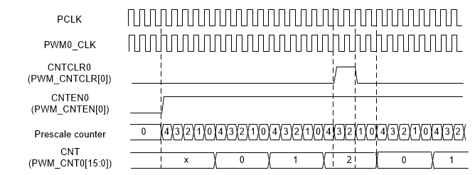 |
|--------------------------------|

Figure 6.7‑7 PWM Counter
Waveform when Setting clear counter

#### 

Up Counter TypeWhen PWM counter is set to up counter type, CNTTYPEn
(PWM_CTL1\[2n+1:2n\], n = 0,1..5) is 0x0, it starts up-counting from 0
to PERIOD (PWM_PERIODn\[15:0\], where n denotes channel number) to
complete a PWM period. The current counter value can be read from CNT
(PWM_CNTn\[15:0\]) bits. PWM generates zero point event when the counter
counts to 0 and prescale counts to 0. PWM generates period point event
when the counter counts to PERIOD and prescale counts to 0. The Figure
6.7‑8 shows an example of up counter, wherein

PWM period time = (PERIOD+1) \*(CLKPSC+1)\* PWM_CLK.

|  |
|--------------------------------|

Figure 6.7‑8 PWM Up
Counter Type

#### 

Down Counter Type When PWM counter is set to down counter type, CNTTYPEn
(PWM_CTL1\[2n+1:2n\], n = 0,1..5) is 0x1, it starts down-counting from
PERIOD to 0 to complete a PWM period. The current counter value can be
read from CNT (PWM_CNTn\[15:0\]) bits. PWM generates zero point event
when the counter counts to 0 and prescale counts to 0. PWM generates
period point event when the counter counts to PERIOD and prescale counts
to 0. The Figure 6.7‑9 shows an example of down counter, wherein

PWM period time = (PERIOD+1) \* (CLKPSC+1) \* PWM_CLK.

|  |
|--------------------------------|

Figure 6.7‑9 PWM Down
Counter Type

#### 

Up-Down Counter Type When PWM counter is set to up-down count type,
CNTTYPEn (PWM_CTL1\[2n+1:2n\], n = 0,1..5) is 0x2, it starts counting-up
from 0 to PERIOD and then starts counting down to 0 to complete a PWM
period. The current counter value can be read from CNT
(PWM_CNTn\[15:0\]) bits. PWM generates zero point event when the counter
counts to 0 and prescale counts to 0. PWM generates center point event
which is equal to period point event when the counter counts to PERIOD.
Figure 6.7‑10 shows an example of up-down counter, wherein

PWM period time =(2\*PERIOD) \* (CLKPSC+1) \* PWM_CLK.

The DIRF (PWM_CNTn\[16\]) bit is counter direction indicator flag, where
high is up counting, and low is down counting.

|  |
|--------------------------------|

Figure 6.7‑10 PWM Up-Down
Counter Type

#### 

PWM ComparatorCMPDATn is a basic comparator register of PWM channel n;
In Independent mode each channel only has one comparator, the value of
CMPDATn register is continuously compared to the corresponding channel’s
counter value. In Complementary mode each paired channels has two
comparators, and the value of CMPDATn and CMPDATm (n = 0,2,4, m = 1,3,5)
registers are continuously compared to the complementary even channel’s
counter value, because of odd channel’s counter is useless. For example,
channel 0 and channel 1 are complementary channels, in Complementary
mode, channel 1’s comparator is continuously compared to channel 0’s
counter, but not channel 1’s. When the counter is equal to value of
CMPDAT0 register, PWM generates a compared point event and uses the
event to generate PWM pulse, interrupt or use to trigger ADC. In up-down
counter type, two events will be generated in a PWM period as shown in
Figure 6.7‑11. The CMPU is up count compared point event and CMPD is
down count compared point event.

|  |
|--------------------------------|

Figure 6.7‑11 PWM
Compared point Events in Up-Down Counter Type

#### 

PWM Double BufferingThe double buffering uses double buffers to separate
software writing and hardware action operation timing. There are three
loading modes for loading values to buffer: period loading mode,
immediately loading mode, and center loading mode. After registers are
modified through software, hardware will load register value to the
buffer register according to the loading mode timing. The hardware
action is based on the buffer value. This can prevent asynchronously
operation problem due to software and hardware asynchronism.

The PWM provides PBUF (PWM_PBUFn\[15:0\]) as the active PERIOD buffer
register, CMPBUF (PWM_CMPBUFn\[15:0\]) as the active CMPDAT buffer
register. The concept of double buffering is used in loading modes,
which are described in the following sections. For example, as shown
Figure 6.7‑12, in period loading mode, writing PERIOD and CMPDAT through
software, PWM will load new values to their buffer PBUF
(PWM_PBUFn\[15:0\]) and CMPBUF (PWM_CMPBUFn\[15:0\]) at start of the
next period without affecting the current period counter operation.

|  |
|--------------------------------|

Figure 6.7‑12 PWM Double
Buffering Illustration

#### 

Period Loading ModeWhen immediately loading mode and center loading mode
are disabled that IMMLDENn (PWM_CTL0\[21:16\]) and CTRLDn
(PWM_CTL0\[5:0\]) are set to 0, PWM operates at period Loading mode. In
period Loading mode, PERIOD(PWM_PERIODn\[15:0\]) and
CMP(PWM_CMPDATn\[15:0\]) will all load to their active PBUF and CMPBUF
registers while each period is completed. For example, after PWM counter
up counts from zero to PERIOD in the up-counter operation or down counts
from PERIOD to zero in the down-counter operation or counts up from 0 to
PERIOD and then counts down to 0 in the up-down counter operation.

Figure 6.7‑13 shows period loading timing of up-count operation, where
PERIOD DATA0 denotes the initial data of PERIOD, PERIOD DATA1 denotes
the first updated PERIOD data by software and so on. CMPDAT also follows
this rule. The following describes steps sequence of Figure 6.7‑13. User
can know the PERIOD and CMPDAT update condition, by watching PWM period
and CMPU event.

1.  
2.  
3.  
4.  
5.  
6.  

| Software writes CMPDAT DATA1 to CMPDAT at point 1. Hardware loads CMPDAT DATA1 to CMPBUF at the end of PWM period at point 2.Software writes PERIOD DATA1 to PERIOD at point 3.Hardware loads PERIOD DATA1 to PBUF at the end of PWM period at point 4.Software writes PERIOD DATA2 to PERIOD at point 5.Hardware loads PERIOD DATA2 to PBUF at the end of PWM period at point 6. |
|----|

Figure 6.7‑13 Period
Loading in Up-Count Mode

#### 

Immediately Loading ModeIf the IMMLDENn (PWM_CTL0\[21:16\]) bit is set
to 1, PWM operates at immediately loading mode. In immediately loading
mode, when user update PERIOD (PWM_PERIODn\[15:0\]) or CMP
(PWM_CMPDATn\[15:0\]), PERIOD or CMPDAT will be load to active PBUF
(PWM_PBUFn\[15:0\]) or CMPBUF (PWM_CMPBUFn\[15:0\]) after current
counter count is completed. If the updated PERIOD value is less than
current counter value, counter will count to 0xFFFF. When counter counts
to 0xFFFF and prescale also counts to 0, the flag
CNTMAXF(PWM_STATUS\[5:0\]) will raise. And then counter will count
wraparound. Immediately loading mode has the highest priority. If
IMMLDENn has been set, other loading mode for channel n will become
invalid.Figure 6.7‑14 shows an example and its steps sequence is
described below.

7.  
8.  
9.  

| Software writes CMPDAT DATA1 and hardware immediately loading CMPDAT DATA1 to CMPBUF at point 1.Software writes PERIOD DATA1 which is greater than current counter value at point 2; counter will continue counting until equal to PERIOD DATA1 to finish a period loading.Software writes PERIOD DATA2 which is less than the current counter value at point 3; counter will continue counting to its maximum value 0xFFFF and count wraparound from 0 to PERIOD DATA2 to finish this period loading. |
|----|

Figure 6.7‑14 Immediately
Loading in Up-Count Mode

#### 

Center Loading ModeWhen the CTRLDn (PWM_CTL0\[5:0\]) bit is set to 1 and
PWM counter is set to up-down count type, CNTTYPEn (PWM_CTL1\[2n+1:2n\],
n = 0,1..5) is 0x2, PWM operates at center loading mode. In center
loading mode, CMP(PWM_CMPDATn\[15:0\]) will load to active CMPBUF
register in center of each period, that is, counter counts to PERIOD.
PERIOD(PWM_PERIODn\[15:0\]) will all load to their active PBUF registers
while each period is completed. Figure 6.7‑15 shows an example and its
steps sequence is described below.

1.  
2.  
3.  
4.  
5.  
6.  
7.  
8.  

Software writes CMPDAT DATA1 at point 1.Hardware loads CMPDAT DATA1 to
CMPBUF at center of PWM period at point 2.Software writes PERIOD DATA1
at point 3.Hardware loads PERIOD DATA1 to PBUF at the end of PWM period
at point 4.Software writes CMPDAT DATA2 at point 5.Hardware loads CMPDAT
DATA2 to CMPBUF at center of PWM period at point 6.Software writes
PERIOD DATA2 at point 7.Hardware loads PERIOD DATA2 to PBUF at the end
of PWM period at point 8.

| 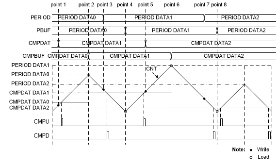 |
|--------------------------------|

Figure 6.7‑15 Center
Loading in Up-Down-Count Mode

#### 

PWM Counter Operation ModeThe PWM counter supports Auto-reload mode.

In Auto-reload mode, CMPDAT and PERIOD registers should be written first
and then the CNTENn(PWM_CNTEN\[n\]) bit is set to 1 to enable PWM
prescaler and start to run counter. The value of
CLKPSC(PWM_CLKPSCn_m\[11:0\]), PERIOD(PWM_PERIODn\[15:0\]) and
CMP(EPWM_CMPDATn\[15:0\]) will auto reload to their active buffer
according different loading mode. If PERIOD(EPWM_PERIODn\[15:0\]) is set
to 0, PWM counter will be set to 0.

#### 

PWM Pulse GeneratorThe PWM pulse generator uses counter and comparator
events to generate PWM pulse. The events are: zero point, period point
in up counter type and down counter type, center point in up-down
counter type and counter equal to comparator point in three types. As to
up-down counter type, there are two counter equal comparator points, one
at up count and the other at down count. Besides, Complementary mode has
two comparators compared with counter, and thus comparing equal points
will become four in up-down counter type and two for up or down counter
type.

Each event point can decide PWM waveform to do nothing (X), set Low (L),
set High (H) or toggle (T) by setting the PWM_WGCTL0 and PWM_WGCTL1
registers. Using these points can easily generate asymmetric PWM pulse
or variant waveform as shown in Figure 6.7‑16. In the figure, PWM is in
complementary mode, there are two comparators n and m to generate PWM
pulse. n denotes even channel number 0, 2, or 4, and m denotes odd
channel number 1, 3, or 5. n channel and m channel are complementary
paired. Complementary mode uses two channels (CH0 and CH1, CH2 and CH3,
or CH4 and CH5) as a pair of PWM outputs to generate complement paired
waveforms. CMPU denotes CNT(PWM_CNTn\[15:0\]) is equal to
CMP(PWM_CMPDATn\[15:0\]) when counting up. CMPD denotes CNT bits is
equal to CMP bits when counting down.

|  |
|--------------------------------|

Figure 6.7‑16 PWM Pulse
Generation

The generation events may sometimes set to the same value, as the
reason, events priority between different counter types are list below,
up counter type (Table 6.7‑2), down counter type (Table 6.7‑3) and
up-down counter type (Table 6.7‑4). By using event priority, user can
easily generate 0% to 100% duty pulse as shown in Figure 6.7‑17.

| 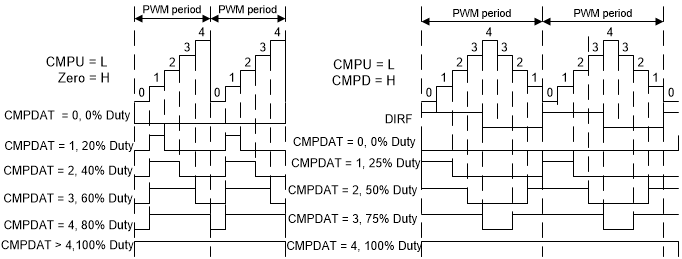 |
|--------------------------------|

Figure 6.7‑17 PWM 0% to
100% Pulse Generation

| **Priority** | **Up Event**                                   |
|--------------|------------------------------------------------|
| 1 (Highest)  | Period event (CNT = PERIOD)                    |
| 2            | Compare up event of odd channel (CNT = CMPUm)  |
| 3            | Compare up event of even channel (CNT = CMPUn) |
| 4 (Lowest)   | Zero event (CNT = 0)                           |

Table 6.7‑2 PWM Pulse
Generation Event Priority for Up-Counter

| **Priority** | **Down Event**                                    |
|--------------|---------------------------------------------------|
| 1 (Highest)  | Zero event (CNT = 0)                              |
| 2            | Compare down event of odd channel (CNT = CMPDm )  |
| 3            | Compare down event of even channel (CNT = CMPDn ) |
| 4 (Lowest)   | Period event (CNT = PERIOD)                       |

Table 6.7‑3 PWM Pulse
Generation Event Priority for Down-Counter

| **Priority** | **Up Event** | **Down Event** |
|----|----|----|
| 1 (Highest) | Compare up event of odd channel (CNT = CMPUm | Compare down event of odd channel (CNT = CMPDm) |
| 2 | Compare up event of even channel (CNT = CMPUn) | Compare down event of even channel (CNT = CMPDn) |
| 3 (Lowest) | Zero event (CNT = 0) | Period (center) event (CNT = PERIOD) |

Table 6.7‑4 PWM Pulse
Generation Event Priority for Up-Down-Counter

#### 

PWM Output ModeThe PWM supports two output modes: Independent mode which
may be applied to DC motor system, Complementary mode with dead-time
insertion which may be used in the application of AC induction motor and
permanent magnet synchronous motor.

#### 

Independent modeBy default, the PWM is operating in independent mode,
independent mode is enabled when channel n corresponding PWMMODEn
(PWM_CTL1\[26:24\]) bit is set to 0. In this mode six PWM channels:
PWM_CH0, PWM_CH1, PWM_CH2, PWM_CH3, PWM_CH4 and PWM_CH5 are running off
its own period and duty as shown in Figure 6.7‑18.

|  |
|--------------------------------|

Figure 6.7‑18 PWM
Independent Mode Waveform

#### 

Complementary modeComplementary mode is enabled when the paired channel
corresponding PWMMODEn (PWM_CTL1\[26:24\]) bit set to 1. In this mode
there are 3 PWM generators utilized for complementary mode, with total
of 3 PWM output paired pins in this module. In Complimentary modes, the
internal odd PWM signal must always be the complement of the
corresponding even PWM signal. PWM_CH1 will be the complement of
PWM_CH0. PWM_CH3 will be the complement of PWM_CH2 and PWM_CH5 will be
the complement of PWM_CH4 as shown in Figure 6.7‑19.

|  |
|--------------------------------|

Figure 6.7‑19 PWM
Complementary Mode Waveform

#### 

PWM Output ControlAfter PWM pulse generation, there are four to six
steps to control the output of PWM channels. In independent mode, there
are Mask, Brake, Pin Polarity and Output Enable four steps as shown in
Figure 6.7‑20. In complementary mode, it needs two more steps to precede
these four steps, Complementary channels and Dead-Time Insertion as
shown in Figure 6.7‑21.

|  |
|--------------------------------|

Figure 6.7‑20 PWM_CH0
Output Control in Independent Mode

|  |
|--------------------------------|

Figure 6.7‑21 PWM_CH0 and
PWM_CH1 Output Control in Complementary Mode

#### 

Dead-Time InsertionIn the complementary application, the complement
channels may drive the external devices like power switches. The
dead-time generator inserts a low level period called “dead-time”
between complementary outputs to drive these devices safely and to
prevent system or devices from the burn-out damage. Hence the dead-time
control is a crucial mechansism to the proper operation of the
complementary system. By setting corresponding channel n DTEN
(PWM_DTCTLn_m\[16\]) bit to enable dead-time function and DTCNT
(PWM_DTCTLn_m\[11:0\]) to control dead-time period, the dead-time can be
calculated from the following formula:

Dead-time = (DTCNT (PWM_DTCTLn\[11:0\])+1) \* PWM_CLK period

Dead-time insertion clock source can be selected from prescaler output
by setting DTCKSEL (PWM_DTCTLn_m\[24\]) to 1. By default, clock source
comes from PWM_CLK, which is prescaler input. Then the dead-time can be
calculated from the following formula:

Dead-time = (DTCNT (PWM_DTCTLn\[11:0\])+1) \*

(CLKPSC (PWM_CLKPSCn \[11:0\])+1)\*PWM_CLK period

Please note that the PWM_DTCTLn_m are write-protected registers.

Figure 6.7‑22 indicates the dead-time insertion for one pair of PWM
signals.

|  |
|--------------------------------|

Figure 6.7‑22 Dead-Time
Insertion

#### 

PWM Mask Output FunctionEach of the PWM channel output value can be
manually overridden with the settings in the PWM Mask Enable Control
Register (PWM_MSKEN) and the PWM Masked Data Register (PWM_MSK). With
these settings, the PWM channel outputs can be assigned to specified
logic states independent of the duty cycle comparison units. The PWM
mask bits are useful when controlling various types of Electrically
Commutated Motor (ECM) like a BLDC motor. The PWM_MSKEN register
contains six bits, MSKENn(PWM_MSKEN\[5:0\]). If the MASKENn is set to
active-high, the PWM channel n output will be overridden. The PWM_MSK
register contains six bits, MSKDATn(PWM_MSK\[5:0\]). The bit value of
the MSKDATn determines the state value of the PWM channel n output when
the channel is overridden. Figure 6.7‑23 shows an example of how PWM
mask control can be used for the override feature.

|  |
|--------------------------------|

Figure 6.7‑23
Illustration of Mask Control Waveform

#### 

PWM BrakeEach PWM module has two external input brake control signals.
User can select active brake pin source is from PWM_BRAKEy pin by BKxSRC
bits of BNF register(x=0,1, y=0,1). The external signals will be
filtered by a 3-bit noise filter. User can enable the noise filter
function by BRKxNFEN bits of BNF reigster, and noise filter sampling
clock can be selected by setting BRKxNFSEL bits of BNF register to fit
different noise properties. Moreover, by setting the BRKxFCNT bits, user
can define by how many sampling clock cycles a filter will recognize the
effective edge of the brake signal.

In addition, it can be inversed by setting the BRKxPINV (x denotes input
external pin 0 or 1) bits of BNF register to realize the polarity setup
for the brake control signals. Set BRKxPINV bit to 0, brake event will
occurred when PWM_BRAKEy(x=0,1, y=0,1) pin status is from low to high;
set BRKxPINV to 1, brake event will occurred when PWM_BRAKEy pin status
is from high to low.

|  |
|--------------------------------|

Figure 6.7‑24 Brake Noise
Filter Block Diagram

For Complementatry mode, it is often necessary to set a safe output
state to the complement output pairs once the brake event occurs.

Each complementary channel pair shares a PWM brake function, as shown
Figure 6.7‑25. To control paired channels to output safety state, user
can setup BRKAEVEN (PWM_BRKCTL0_1\[17:16\]) for even channels and
BRKAODD (PWM_BRKCTL0_1\[19:18\]) for odd channels when the fault brake
event happens. There are two brake detectors: Edge detector and Level
detector. When the edge detector detects the brake signal and BRKEIENn_m
(PWM_INTEN1\[2:0\]) is enabled, the brake function generates BRK_INT.
This interrupt needs software to clear, and the BRKESTSn
(PWM_INTSTS1\[21:16\]) brake state will keep until the next PWM period
starts after the interrupt cleared. The brake function can also operate
in another way through the level detector. Once the level detector
detects the brake signal and the BRKLIENn_m (PWM_INTEN1\[10:8\]) is also
enabled, the brake function will generate BRK_INT, but BRKLSTSn
(PWM_INTSTS1\[29:24\]) brake state will auto recovery to normal output
while level brake source recovery to high level and pass through “Low
Level Detection” at the PWM waveform period when brake condition removed
without clear interrupt.

|  |
|--------------------------------|

Figure 6.7‑25 Brake Block
Diagram for PWM_CH0 and PWM_CH1 Pair

Figure 6.7‑26 illustrates the edge detector waveform for PWM_CH0 and
PWM_CH1 pair. In this case, the edge detect brake source has occurred
twice for the brake events. When the event occurs, both of the BRKEIF0
and BRKEIF1 flags are set and BRKESTS0 and BRKESTS1 bits are also set to
indicate brake state of PWM_CH0 and PWM_CH1. For the first occurring
event, software writes 1 to clear the BRKEIF0 flag. After that, the
BRKESTS0 bit is cleared by hardware at the next start of the PWM period.
At the same moment, the PWM_CH0 outputs the normal waveform even though
the brake event is still occurring. The second event also triggers the
same flags, but at this time, software writes 1 to clear the BRKEIF1
flag. Afterward, PWM_CH1 outputs normally at the next start of the PWM
period.

As a contrast to the edge detector example, Figure 6.7‑27 illustrates
the level detector waveform for PWM_CH0 and PWM_CH1 pair. In this case,
the BRKLIF0 and BRKLIF1 flags can only indicate the brake event having
occurred. The BRKLSTS0 and BRKLSTS1 brake states will automatically
recover at the start of the next PWM period no matter at what states the
BRKLIF0 and BRKLIF1 flags are at that moment.

| 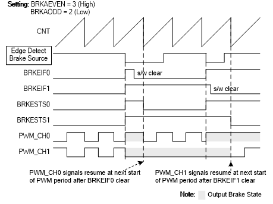 |
|--------------------------------|

Figure 6.7‑26 Edge
Detector Waveform for PWM_CH0 and PWM_CH1 Pair

|  |
|--------------------------------|

Figure 6.7‑27 Level
Detector Waveform for PWM_CH0 and PWM_CH1 Pair

The two kinds of detectors detect the same four brake sources: two from
external input signals and one from system fail, and one from software
triggered, that are shown in Figure 6.7‑28.

Among the above described brake sources, the brake source coming from
system fail can still be specified to several different system fail
conditions. These conditions include Brown-out detect, and Core lockup.
Figure 6.7‑29 shows that by setting corresponding enable bits, the
enabled system fail condition can be one of the sources to issue the
Brake system fail to the PWM brake.

|  |
|--------------------------------|

Figure 6.7‑28 Brake
Source Block Diagram

| 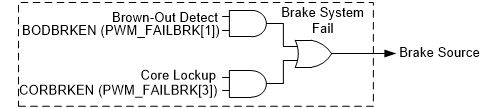 |
|--------------------------------|

Figure 6.7‑29 Brake
System Fail Block Diagram

#### 

Polarity ControlEach PWM port, from PWM_CH0 to PWM_CH5, has an
independent polarity control module to configure the polarity of the
active state of the PWM output. By default, the PWM output is active
high. This implies the PWM OFF state is low and ON state is high. This
definition is variable through setting the PWM Negative Polarity Control
Register (PWM_POLCTL), for each individual PWM channel. Figure 6.7‑30
shows the initial state before PWM starting with different polarity
settings.

|  |
|--------------------------------|

Figure 6.7‑30 Initial
State and Polarity Control with Rising Edge Dead-Time Insertion

#### 

Synchronous start functionThe synchronous start function can be enabled
when SSEN0 (PWM_SSCTL\[0\]) is set. User can select synchronous source
which is from PWM0 by SSRC (PWM_SSCTL\[9:8\]). The selected PWM channels
(include channel0 to channel5 of each PWM) will start counting at the
same time once the synchronous start function is enabled and set CNTSEN
(PWM_SSTRG). It is noted that set CNTSEN (PWM_SSTRG) will also set the
counter enable bit (CNTENn, n denotes channel 0 to 5) to start counting.

#### 

PWM Interrupt Generator.There are three independent interrupts for each
PWM as shown in Figure 6.7‑31.

The 1st PWM interrupt (PWM_INT) comes from PWM complementary
pair events. The counter can generate the Zero point Interrupt Flag ZIFn
(PWM_INTSTS0\[n\], n=0,2,4) and the Period point Interrupt Flag PIFn
(PWM_INTSTS0\[n+8\], n=0,2,4). When PWM channel n’s counter equals to
the comparator value stored in PWM_CMPDATn, the different interrupt
flags will be triggered depending on the counting direction. If the
matching occurs at up-count direction, the Up Interrupt Flag CMPUIFn
(PWM_INTSTS0\[21:16\]) is set and if matching at the opposite direction,
the Down Interrupt Flag CMPDIFn (PWM_INTSTS0\[29:24\]) is set. If the
corresponding interrupt enable bits are set, the trigger events will
generates interrupt signals.

The 2nd interrupt is the capture interrupt (CAP_INT). It
shares the PWM_INT vector in NVIC. The CAP_INT can be generated when the
CRLIFn (PWM_CAPIF\[5:0\]) is triggered and the Capture Rising Interrupt
Enable bit CAPRIENn (PWM_CAPIEN\[5:0\]) is set to 1. Or in the falling
edge condition, the CFLIFn (PWM_CAPIF\[13:8\]) can be triggered when the
Capture Falling Interrupt Enable bit CAPFIENn (PWM_CAPIEN\[13:8\]) is
set to 1.

The last one is the brake interrupt (BRK_INT). The detail of the BRK_INT
is described in the PWM Brake section.

Figure 6.7‑31 demonstrates the architecture of the PWM interrupts.

|  |
|--------------------------------|

Figure 6.7‑31 PWM_CH0 and
PWM_CH1 Pair Interrupt Architecture Diagram

#### 

PWM Trigger ADC GeneratorPWM can be one of the ADC conversion trigger
source. Each PWM paired channels share the same trigger source. Setting
TRGSELn is to select the trigger sources, where TRGSELn is TRGSEL0,
TRGSEL1, …, and TRGSEL5, which are located in PWM_ADCTS0\[3:0\],
PWM_ADCTS0\[11:8\], PWM_ADCTS0\[19:16\], PWM_ADCTS0\[27:24\],
PWM_ADCTS1\[3:0\] and PWM_ADCTS1\[11:8\], respectively. Setting TRGENn
is to enable the trigger output to ADC, where TRGENn is TRGEN0, TRGEN1,
…, TRGEN5, which are located in PWM_ADCTS0\[7\], PWM_ADCTS0\[15\],
PWM_ADCTS0\[23\], PWM_ADCTS0\[31\], PWM_ADCTS1\[7\] and
PWM_ADCTS1\[15\], respectively. The number n (n = 0,1, ..,5) denotes PWM
channel number.

There are 7 PWM events can be selected as the trigger source for one
pair of channels. Figure 6.7‑32 is an example of PWM_CH0 and PWM_CH1.
PWM can trigger ADC to start conversion in different timings by setting
PERIOD and CMPDAT. Figure 6.7‑33 is the trigger ADC timing waveform in
the up-down counter type.

|  |
|--------------------------------|

Figure 6.7‑32 PWM_CH0 and
PWM_CH1 Pair Trigger ADC Block Diagram

|  |
|--------------------------------|

Figure 6.7‑33 PWM Trigger
ADC in Up-Down Counter Type Timing Waveform

#### 

Capture OperationThe channels of the capture input and the PWM output
share the same pin and counter. The counter can operate in up or down
counter type. The capture function will always latch the PWM counter to
the RCAPDATn (PWM_RCAPDATn\[15:0\]) bits or the FCAPDATn
(PWM_FCAPDATn\[15:0\]) bits, if the input channel has a rising
transition or a falling transition, respectively. The capture function
will also generate an interrupt CAP_INT (using PWM_INT vector) if the
rising or falling latch occurs and the corresponding channel n’s rising
or falling interrupt enable bits are set, where the CAPRIENn
(PWM_CAPIEN\[5:0\]) bit is for the rising edge and the CAPFIENn
(PWM_CAPIEN\[13:8\]) bit is for the falling edge. When rising or falling
latch occurs, the corresponding PWM counter may be reloaded with the
value of PWM_PERIODn register, depending on the setting of RCRLDENn or
FCRLDENn bits (where RCRLDENn and FCRLDENn are located at
PWM_CAPCTL\[21:16\] and PWM_CAPCTL\[29:24\], respectively). Note that
the corresponding GPIO pins must be configured as the capture function
by enable the CAPINENn (PWM_CAPINEN\[5:0\]) bits for the corresponding
capture channel n. Figure 6.7‑34is the capture block diagram of channel
0.

|  |
|--------------------------------|

Figure 6.7‑34 PWM_CH0
Capture Block Diagram

Figure 6.7‑35 illustrates the capture function timing. In this case, the
capture counter is set as PWM down counter type and the PERIOD is set to
8 so that the counter counts in the down direction, from 8 to 0. When
detecting a falling edge at the capture input pin, the capture function
latches the counter value to the PWM_FCAPDATn register. When detecting
the rising edge, it latches the counter value to the PWM_RCAPDATn
register. In this timing diagram, when the falling edge is detected at
the first time, the capture function will reload the counter value from
the PERIOD setting because the FCRLDENn bit is enabled. But at the
second time, the falling edge does not result in a reload because of the
disabled FCRLDENn bit. In this example, the counter also reloads at the
rising edge of the capture input because the RCRLDENn bit is enabled,
too.

Moreover, if the case is setup as the up counter type, the counter will
reload the value zero and count up to the value PERIOD.

Figure 6.7‑35 also illustrates the timing example for the interrupt and
interrupt flag generation. When the rising edge at channel n is
detected, the corresponding CRLIFn (PWM_CAPIF\[5:0\]) bit is set by
hardware. Similarly, a falling edge detection at chnnel n causes the
corresponding CFLIFn (PWM_CAPIF\[13:8\]) bit is set by hardware. CRLIFn
and CFLIFn bits can be cleared by software by writing ‘1’. If the CRLIFn
bit is set and the CAPRIENn bit is enabled, the capture function
generates an interrupt. If the CFLIFn bit is set and the CAPFIENn is
enabled, the interrupt also happens.

A condition which is not shown in this figure is: if the rising latch
happens again when the CRLIFn bit is already set, the Over run status
CRLIFOVn (PWM_CAPSTS\[5:0\]) bit will be set to 1 by hardware to
indicate the CRLIF flag overrunning. Also, if the falling latch happens
again, the same hardware operation occurs for the CFLIF interrupt flag
and the Over run status CFLIFOVn (PWM_CAPSTS\[13:8\]).

|  |
|--------------------------------|

Figure 6.7‑35 Capture
Operation Waveform

The capture pulse width meeting the following conditions can be
calculated according to the formula.

1.  
2.  
3.  

> The capture positive or negative pulse width is shorter than a counter
> period.The counter operates in down counter type.The counter can be
> reloaded by both falling and rising capture events through setting
> FCRLDENn and RCRLDENn bits of PWM_CAPCTL register to 1.

For the negative pulse case, the channel low pulse width is calculated
as (PWM_PERIODn + 1 - PWM_RCAPDATn) PWM counter time, where one PWM
counter time is (CLKPSC+1) \* PWM_CLK clock time. In Figure 6.7‑35, the
low pulse width is 8+1-5 = 4 PWM counter time .

For the positive pulse case, the channel high pulse width is calculated
as (PWM_PERIODn + 1 - PWM_FCAPDATn) PWM counter time, where one PWM
counter time is (CLKPSC+1) \* PWM_CLK clock time. In Figure 6.7‑35, the
high pulse width is 8+1-7 = 2 PWM counter time.

### 

Register Map**R**: read
only, **W**: write only, **R/W**: both read and write

<table>
<colgroup>
<col style="width: 18%" />
<col style="width: 16%" />
<col style="width: 4%" />
<col style="width: 46%" />
<col style="width: 14%" />
</colgroup>
<tbody>
<tr>
<td><strong>Register</strong></td>
<td><strong>Offset</strong></td>
<td><strong>R/W</strong></td>
<td><strong>Description</strong></td>
<td><strong>Reset Value</strong></td>
</tr>
<tr>
<td colspan="5">
<strong>PWM Base Address:</strong>

<strong>PWM_BA = 0x4005_8000</strong>
</td>
</tr>
<tr>
<td><strong>PWM_CTL0</strong></td>
<td>PWM_BA+0x00</td>
<td>R/W</td>
<td>PWM Control Register 0</td>
<td>0x0000_0000</td>
</tr>
<tr>
<td><strong>PWM_CTL1</strong></td>
<td>PWM_BA+0x04</td>
<td>R/W</td>
<td>PWM Control Register 1</td>
<td>0x0000_0000</td>
</tr>
<tr>
<td><strong>PWM_CLKSRC</strong></td>
<td>PWM_BA+0x10</td>
<td>R/W</td>
<td>PWM Clock Source Register</td>
<td>0x0000_0000</td>
</tr>
<tr>
<td><strong>PWM_CLKPSC0_1</strong></td>
<td>PWM_BA+0x14</td>
<td>R/W</td>
<td>PWM Clock Prescale Register 0/1</td>
<td>0x0000_0000</td>
</tr>
<tr>
<td><strong>PWM_CLKPSC2_3</strong></td>
<td>PWM_BA+0x18</td>
<td>R/W</td>
<td>PWM Clock Prescale Register 2/3</td>
<td>0x0000_0000</td>
</tr>
<tr>
<td><strong>PWM_CLKPSC4_5</strong></td>
<td>PWM_BA+0x1C</td>
<td>R/W</td>
<td>PWM Clock Prescale Register 4/5</td>
<td>0x0000_0000</td>
</tr>
<tr>
<td><strong>PWM_CNTEN</strong></td>
<td>PWM_BA+0x20</td>
<td>R/W</td>
<td>PWM Counter Enable Register</td>
<td>0x0000_0000</td>
</tr>
<tr>
<td><strong>PWM_CNTCLR</strong></td>
<td>PWM_BA+0x24</td>
<td>R/W</td>
<td>PWM Clear Counter Register</td>
<td>0x0000_0000</td>
</tr>
<tr>
<td><strong>PWM_PERIOD0</strong></td>
<td>PWM_BA+0x30</td>
<td>R/W</td>
<td>PWM Period Register 0</td>
<td>0x0000_0000</td>
</tr>
<tr>
<td><strong>PWM_PERIOD2</strong></td>
<td>PWM_BA+0x38</td>
<td>R/W</td>
<td>PWM Period Register 2</td>
<td>0x0000_0000</td>
</tr>
<tr>
<td><strong>PWM_PERIOD4</strong></td>
<td>PWM_BA+0x40</td>
<td>R/W</td>
<td>PWM Period Register 4</td>
<td>0x0000_0000</td>
</tr>
<tr>
<td><strong>PWM_CMPDAT0</strong></td>
<td>PWM_BA+0x50</td>
<td>R/W</td>
<td>PWM Comparator Register 0</td>
<td>0x0000_0000</td>
</tr>
<tr>
<td><strong>PWM_CMPDAT1</strong></td>
<td>PWM_BA+0x54</td>
<td>R/W</td>
<td>PWM Comparator Register 1</td>
<td>0x0000_0000</td>
</tr>
<tr>
<td><strong>PWM_CMPDAT2</strong></td>
<td>PWM_BA+0x58</td>
<td>R/W</td>
<td>PWM Comparator Register 2</td>
<td>0x0000_0000</td>
</tr>
<tr>
<td><strong>PWM_CMPDAT3</strong></td>
<td>PWM_BA+0x5C</td>
<td>R/W</td>
<td>PWM Comparator Register 3</td>
<td>0x0000_0000</td>
</tr>
<tr>
<td><strong>PWM_CMPDAT4</strong></td>
<td>PWM_BA+0x60</td>
<td>R/W</td>
<td>PWM Comparator Register 4</td>
<td>0x0000_0000</td>
</tr>
<tr>
<td><strong>PWM_CMPDAT5</strong></td>
<td>PWM_BA+0x64</td>
<td>R/W</td>
<td>PWM Comparator Register 5</td>
<td>0x0000_0000</td>
</tr>
<tr>
<td><strong>PWM_DTCTL0_1</strong></td>
<td>PWM_BA+0x70</td>
<td>R/W</td>
<td>PWM Dead-time Control Register 0/1</td>
<td>0x0000_0000</td>
</tr>
<tr>
<td><strong>PWM_DTCTL2_3</strong></td>
<td>PWM_BA+0x74</td>
<td>R/W</td>
<td>PWM Dead-time Control Register 2/3</td>
<td>0x0000_0000</td>
</tr>
<tr>
<td><strong>PWM_DTCTL4_5</strong></td>
<td>PWM_BA+0x78</td>
<td>R/W</td>
<td>PWM Dead-time Control Register 4/5</td>
<td>0x0000_0000</td>
</tr>
<tr>
<td><strong>PWM_CNT0</strong></td>
<td>PWM_BA+0x90</td>
<td>R</td>
<td>PWM Counter Register 0</td>
<td>0x0000_0000</td>
</tr>
<tr>
<td><strong>PWM_CNT2</strong></td>
<td>PWM_BA+0x98</td>
<td>R</td>
<td>PWM Counter Register 2</td>
<td>0x0000_0000</td>
</tr>
<tr>
<td><strong>PWM_CNT4</strong></td>
<td>PWM_BA+0xA0</td>
<td>R</td>
<td>PWM Counter Register 4</td>
<td>0x0000_0000</td>
</tr>
<tr>
<td><strong>PWM_WGCTL0</strong></td>
<td>PWM_BA+0xB0</td>
<td>R/W</td>
<td>PWM Generation Register 0</td>
<td>0x0000_0000</td>
</tr>
<tr>
<td><strong>PWM_WGCTL1</strong></td>
<td>PWM_BA+0xB4</td>
<td>R/W</td>
<td>PWM Generation Register 1</td>
<td>0x0000_0000</td>
</tr>
<tr>
<td><strong>PWM_MSKEN</strong></td>
<td>PWM_BA+0xB8</td>
<td>R/W</td>
<td>PWM Mask Enable Register</td>
<td>0x0000_0000</td>
</tr>
<tr>
<td><strong>PWM_MSK</strong></td>
<td>PWM_BA+0xBC</td>
<td>R/W</td>
<td>PWM Mask Data Register</td>
<td>0x0000_0000</td>
</tr>
<tr>
<td><strong>PWM_BNF</strong></td>
<td>PWM_BA+0xC0</td>
<td>R/W</td>
<td>PWM Brake Noise Filter Register</td>
<td>0x0000_0000</td>
</tr>
<tr>
<td><strong>PWM_FAILBRK</strong></td>
<td>PWM_BA+0xC4</td>
<td>R/W</td>
<td>PWM System Fail Brake Control Register</td>
<td>0x0000_0000</td>
</tr>
<tr>
<td><strong>PWM_BRKCTL0_1</strong></td>
<td>PWM_BA+0xC8</td>
<td>R/W</td>
<td>PWM Brake Edge Detect Control Register 0/1</td>
<td>0x0000_0000</td>
</tr>
<tr>
<td><strong>PWM_BRKCTL2_3</strong></td>
<td>PWM_BA+0xCC</td>
<td>R/W</td>
<td>PWM Brake Edge Detect Control Register 2/3</td>
<td>0x0000_0000</td>
</tr>
<tr>
<td><strong>PWM_BRKCTL4_5</strong></td>
<td>PWM_BA+0xD0</td>
<td>R/W</td>
<td>PWM Brake Edge Detect Control Register 4/5</td>
<td>0x0000_0000</td>
</tr>
<tr>
<td><strong>PWM_POLCTL</strong></td>
<td>PWM_BA+0xD4</td>
<td>R/W</td>
<td>PWM Pin Polar Inverse Register</td>
<td>0x0000_0000</td>
</tr>
<tr>
<td><strong>PWM_POEN</strong></td>
<td>PWM_BA+0xD8</td>
<td>R/W</td>
<td>PWM Output Enable Register</td>
<td>0x0000_0000</td>
</tr>
<tr>
<td><strong>PWM_SWBRK</strong></td>
<td>PWM_BA+0xDC</td>
<td>W</td>
<td>PWM Software Brake Control Register</td>
<td>0x0000_0000</td>
</tr>
<tr>
<td><strong>PWM_INTEN0</strong></td>
<td>PWM_BA+0xE0</td>
<td>R/W</td>
<td>PWM Interrupt Enable Register 0</td>
<td>0x0000_0000</td>
</tr>
<tr>
<td><strong>PWM_INTEN1</strong></td>
<td>PWM_BA+0xE4</td>
<td>R/W</td>
<td>PWM Interrupt Enable Register 1</td>
<td>0x0000_0000</td>
</tr>
<tr>
<td><strong>PWM_INTSTS0</strong></td>
<td>PWM_BA+0xE8</td>
<td>R/W</td>
<td>PWM Interrupt Flag Register 0</td>
<td>0x0000_0000</td>
</tr>
<tr>
<td><strong>PWM_INTSTS1</strong></td>
<td>PWM_BA+0xEC</td>
<td>R/W</td>
<td>PWM Interrupt Flag Register 1</td>
<td>0x0000_0000</td>
</tr>
<tr>
<td><strong>PWM_ADCTS0</strong></td>
<td>PWM_BA+0xF8</td>
<td>R/W</td>
<td>PWM Trigger ADC Source Select Register 0</td>
<td>0x0000_0000</td>
</tr>
<tr>
<td><strong>PWM_ADCTS1</strong></td>
<td>PWM_BA+0xFC</td>
<td>R/W</td>
<td>PWM Trigger ADC Source Select Register 1</td>
<td>0x0000_0000</td>
</tr>
<tr>
<td><strong>PWM_SSCTL</strong></td>
<td>PWM_BA+0x110</td>
<td>R/W</td>
<td>PWM Synchronous Start Control Register</td>
<td>0x0000_0000</td>
</tr>
<tr>
<td><strong>PWM_SSTRG</strong></td>
<td>PWM_BA+0x114</td>
<td>W</td>
<td>PWM Synchronous Start Trigger Register</td>
<td>0x0000_0000</td>
</tr>
<tr>
<td><strong>PWM_STATUS</strong></td>
<td>PWM_BA+0x120</td>
<td>R/W</td>
<td>PWM Status Register</td>
<td>0x0000_0000</td>
</tr>
<tr>
<td><strong>PWM_WECAP</strong></td>
<td>PWM_BA+0x130</td>
<td>R/W</td>
<td>PWM Trigger Window Mode ECAP Source Select Register</td>
<td>0x0000_0000</td>
</tr>
<tr>
<td><strong>PWM_CAPINEN</strong></td>
<td>PWM_BA+0x200</td>
<td>R/W</td>
<td>PWM Capture Input Enable Register</td>
<td>0x0000_0000</td>
</tr>
<tr>
<td><strong>PWM_CAPCTL</strong></td>
<td>PWM_BA+0x204</td>
<td>R/W</td>
<td>PWM Capture Control Register</td>
<td>0x0000_0000</td>
</tr>
<tr>
<td><strong>PWM_CAPSTS</strong></td>
<td>PWM_BA+0x208</td>
<td>R</td>
<td>PWM Capture Status Register</td>
<td>0x0000_0000</td>
</tr>
<tr>
<td><strong>PWM_RCAPDAT0</strong></td>
<td>PWM_BA+0x20C</td>
<td>R</td>
<td>PWM Rising Capture Data Register 0</td>
<td>0x0000_0000</td>
</tr>
<tr>
<td><strong>PWM_FCAPDAT0</strong></td>
<td>PWM_BA+0x210</td>
<td>R</td>
<td>PWM Falling Capture Data Register 0</td>
<td>0x0000_0000</td>
</tr>
<tr>
<td><strong>PWM_RCAPDAT1</strong></td>
<td>PWM_BA+0x214</td>
<td>R</td>
<td>PWM Rising Capture Data Register 1</td>
<td>0x0000_0000</td>
</tr>
<tr>
<td><strong>PWM_FCAPDAT1</strong></td>
<td>PWM_BA+0x218</td>
<td>R</td>
<td>PWM Falling Capture Data Register 1</td>
<td>0x0000_0000</td>
</tr>
<tr>
<td><strong>PWM_RCAPDAT2</strong></td>
<td>PWM_BA+0x21C</td>
<td>R</td>
<td>PWM Rising Capture Data Register 2</td>
<td>0x0000_0000</td>
</tr>
<tr>
<td><strong>PWM_FCAPDAT2</strong></td>
<td>PWM_BA+0x220</td>
<td>R</td>
<td>PWM Falling Capture Data Register 2</td>
<td>0x0000_0000</td>
</tr>
<tr>
<td><strong>PWM_RCAPDAT3</strong></td>
<td>PWM_BA+0x224</td>
<td>R</td>
<td>PWM Rising Capture Data Register 3</td>
<td>0x0000_0000</td>
</tr>
<tr>
<td><strong>PWM_FCAPDAT3</strong></td>
<td>PWM_BA+0x228</td>
<td>R</td>
<td>PWM Falling Capture Data Register 3</td>
<td>0x0000_0000</td>
</tr>
<tr>
<td><strong>PWM_RCAPDAT4</strong></td>
<td>PWM_BA+0x22C</td>
<td>R</td>
<td>PWM Rising Capture Data Register 4</td>
<td>0x0000_0000</td>
</tr>
<tr>
<td><strong>PWM_FCAPDAT4</strong></td>
<td>PWM_BA+0x230</td>
<td>R</td>
<td>PWM Falling Capture Data Register 4</td>
<td>0x0000_0000</td>
</tr>
<tr>
<td><strong>PWM_RCAPDAT5</strong></td>
<td>PWM_BA+0x234</td>
<td>R</td>
<td>PWM Rising Capture Data Register 5</td>
<td>0x0000_0000</td>
</tr>
<tr>
<td><strong>PWM_FCAPDAT5</strong></td>
<td>PWM_BA+0x238</td>
<td>R</td>
<td>PWM Falling Capture Data Register 5</td>
<td>0x0000_0000</td>
</tr>
<tr>
<td><strong>PWM_CAPIEN</strong></td>
<td>PWM_BA+0x250</td>
<td>R/W</td>
<td>PWM Capture Interrupt Enable Register</td>
<td>0x0000_0000</td>
</tr>
<tr>
<td><strong>PWM_CAPIF</strong></td>
<td>PWM_BA+0x254</td>
<td>R/W</td>
<td>PWM Capture Interrupt Flag Register</td>
<td>0x0000_0000</td>
</tr>
<tr>
<td><strong>PWM_PBUF0</strong></td>
<td>PWM_BA+0x304</td>
<td>R</td>
<td>PWM PERIOD0 Buffer</td>
<td>0x0000_0000</td>
</tr>
<tr>
<td><strong>PWM_PBUF2</strong></td>
<td>PWM_BA+0x30C</td>
<td>R</td>
<td>PWM PERIOD2 Buffer</td>
<td>0x0000_0000</td>
</tr>
<tr>
<td><strong>PWM_PBUF4</strong></td>
<td>PWM_BA+0x314</td>
<td>R</td>
<td>PWM PERIOD4 Buffer</td>
<td>0x0000_0000</td>
</tr>
<tr>
<td><strong>PWM_CMPBUF0</strong></td>
<td>PWM_BA+0x31C</td>
<td>R</td>
<td>PWM CMPDAT0 Buffer</td>
<td>0x0000_0000</td>
</tr>
<tr>
<td><strong>PWM_CMPBUF1</strong></td>
<td>PWM_BA+0x320</td>
<td>R</td>
<td>PWM CMPDAT1 Buffer</td>
<td>0x0000_0000</td>
</tr>
<tr>
<td><strong>PWM_CMPBUF2</strong></td>
<td>PWM_BA+0x324</td>
<td>R</td>
<td>PWM CMPDAT2 Buffer</td>
<td>0x0000_0000</td>
</tr>
<tr>
<td><strong>PWM_CMPBUF3</strong></td>
<td>PWM_BA+0x328</td>
<td>R</td>
<td>PWM CMPDAT3 Buffer</td>
<td>0x0000_0000</td>
</tr>
<tr>
<td><strong>PWM_CMPBUF4</strong></td>
<td>PWM_BA+0x32C</td>
<td>R</td>
<td>PWM CMPDAT4 Buffer</td>
<td>0x0000_0000</td>
</tr>
<tr>
<td><strong>PWM_CMPBUF5</strong></td>
<td>PWM_BA+0x330</td>
<td>R</td>
<td>PWM CMPDAT5 Buffer</td>
<td>0x0000_0000</td>
</tr>
</tbody>
</table>

### 

##### Register DescriptionPWM Control Register 0 (PWM_CTL0) 

|              |             |         |                        |                 |
|--------------|-------------|---------|------------------------|-----------------|
| **Register** | **Offset**  | **R/W** | **Description**        | **Reset Value** |
| **PWM_CTL0** | PWM_BA+0x00 | R/W     | PWM Control Register 0 | 0x0000_0000     |

|  |  |  |  |  |  |  |  |
|:--:|:--:|:--:|:--:|:--:|:--:|:--:|:--:|
| **31** | **30** | **29** | **28** | **27** | **26** | **25** | **24** |
| **DBGTRIOFF** | **DBGHALT** | **Reserved** |  |  |  |  |  |
| **23** | **22** | **21** | **20** | **19** | **18** | **17** | **16** |
| **Reserved** |  | **IMMLDEN5** | **IMMLDEN4** | **IMMLDEN3** | **IMMLDEN2** | **IMMLDEN1** | **IMMLDEN0** |
| **15** | **14** | **13** | **12** | **11** | **10** | **9** | **8** |
| **Reserved** |  |  |  |  |  |  |  |
| **7** | **6** | **5** | **4** | **3** | **2** | **1** | **0** |
| **Reserved** |  | **CTRLD5** | **CTRLD4** | **CTRLD3** | **CTRLD2** | **CTRLD1** | **CTRLD0** |

<table>
<colgroup>
<col style="width: 12%" />
<col style="width: 16%" />
<col style="width: 71%" />
</colgroup>
<tbody>
<tr>
<td><strong>Bits</strong></td>
<td colspan="2"><strong>Description</strong></td>
</tr>
<tr>
<td>[31]</td>
<td><strong>DBGTRIOFF</strong></td>
<td>
<strong>ICE Debug Mode Acknowledge Disable Bit (Write
Protect)</strong>

0 = ICE debug mode acknowledgement effects PWM output.

PWM pin will be forced as tri-state while ICE debug mode
acknowledged.

1 = ICE debug mode acknowledgement disabled.

PWM pin will keep output no matter ICE debug mode acknowledged or
not.

<strong>Note:</strong> This bit is write protected. Refer to
SYS_REGLCTL register.
</td>
</tr>
<tr>
<td>[30]</td>
<td><strong>DBGHALT</strong></td>
<td>
<strong>ICE Debug Mode Counter Halt (Write Protect)</strong>

If counter halt is enabled, PWM all counters will keep current value
until exit ICE debug mode.

0 = ICE debug mode counter halt Disable.

1 = ICE debug mode counter halt Enable.

<strong>Note:</strong> This bit is write protected. Refer to
SYS_REGLCTL register.
</td>
</tr>
<tr>
<td>[29:22]</td>
<td><strong>Reserved</strong></td>
<td>Reserved.</td>
</tr>
<tr>
<td>
[n+16]

n=0,1…5
</td>
<td><strong>IMMLDENn</strong></td>
<td>
<strong>Immediately Load Enable Bits</strong>

0 = PERIOD will load to PBUF at the end point of each period. CMPDAT
will load to CMPBUF at the end point or center point of each period by
setting CTRLD bit.

1 = PERIOD/CMPDAT will load to PBUF and CMPBUF immediately when
software update PERIOD/CMPDAT.

<strong>Note:</strong> If IMMLDENn is enabled, WINLDENn and CTRLDn
will be invalid.
</td>
</tr>
<tr>
<td>[15:6]</td>
<td><strong>Reserved</strong></td>
<td>Reserved.</td>
</tr>
<tr>
<td>
[n]

n=0,1…5
</td>
<td><strong>CTRLDn</strong></td>
<td>
<strong>Center Load Enable Bits</strong>

In up-down counter type, PERIOD will load to PBUF at the end point of
each period. CMPDAT will load to CMPBUF at the center point of a
period.
</td>
</tr>
</tbody>
</table>

##### PWM Control Register 1 (PWM_CTL1) 

|              |             |         |                        |                 |
|--------------|-------------|---------|------------------------|-----------------|
| **Register** | **Offset**  | **R/W** | **Description**        | **Reset Value** |
| **PWM_CTL1** | PWM_BA+0x04 | R/W     | PWM Control Register 1 | 0x0000_0000     |

|  |  |  |  |  |  |  |  |
|:--:|:--:|:--:|:--:|:--:|:--:|:--:|:--:|
| **31** | **30** | **29** | **28** | **27** | **26** | **25** | **24** |
| **Reserved** |  |  |  |  | **OUTMODE4** | **OUTMODE2** | **OUTMODE0** |
| **23** | **22** | **21** | **20** | **19** | **18** | **17** | **16** |
| **Reserved** |  |  |  |  |  |  |  |
| **15** | **14** | **13** | **12** | **11** | **10** | **9** | **8** |
| **Reserved** |  |  |  |  |  | **CNTTYPE4** |  |
| **7** | **6** | **5** | **4** | **3** | **2** | **1** | **0** |
| **Reserved** |  | **CNTTYPE2** |  | **Reserved** |  | **CNTTYPE0** |  |

<table>
<colgroup>
<col style="width: 12%" />
<col style="width: 16%" />
<col style="width: 71%" />
</colgroup>
<tbody>
<tr>
<td><strong>Bits</strong></td>
<td colspan="2"><strong>Description</strong></td>
</tr>
<tr>
<td>[31:27]</td>
<td><strong>Reserved</strong></td>
<td>Reserved.</td>
</tr>
<tr>
<td>[26:24]</td>
<td><strong>OUTMODEn</strong></td>
<td>
<strong>PWM Output Mode</strong>

Each bit n controls the output mode of corresponding PWM channel
n.

0 = PWM independent mode.

1 = PWM complementary mode.

<strong>Note:</strong> When operating in group function, these bits
must all set to the same mode.
</td>
</tr>
<tr>
<td>[23:10]</td>
<td><strong>Reserved</strong></td>
<td>Reserved.</td>
</tr>
<tr>
<td>[9:8]</td>
<td><strong>CNTTYPE4</strong></td>
<td>
<strong>PWM Counter Behavior Type 4</strong>

The two bits control channel5 and channel4

00 = Up counter type (supported in capture mode).

01 = Down count type (supported in capture mode).

10 = Up-down counter type.

11 = Reserved.
</td>
</tr>
<tr>
<td>[7:6]</td>
<td><strong>Reserved</strong></td>
<td>Reserved.</td>
</tr>
<tr>
<td>[5:4]</td>
<td><strong>CNTTYPE2</strong></td>
<td>
<strong>PWM Counter Behavior Type 2</strong>

The two bits control channel3 and channel2

00 = Up counter type (supported in capture mode).

01 = Down count type (supported in capture mode).

10 = Up-down counter type.

11 = Reserved.
</td>
</tr>
<tr>
<td>[3:2]</td>
<td><strong>Reserved</strong></td>
<td>Reserved.</td>
</tr>
<tr>
<td>[1:0]</td>
<td><strong>CNTTYPE0</strong></td>
<td>
<strong>PWM Counter Behavior Type 0</strong>

The two bits control channel1 and channel0

00 = Up counter type (supported in capture mode).

01 = Down count type (supported in capture mode).

10 = Up-down counter type.

11 = Reserved.
</td>
</tr>
</tbody>
</table>

##### PWM Clock Source Register (PWM_CLKSRC) 

|                |             |         |                           |                 |
|----------------|-------------|---------|---------------------------|-----------------|
| **Register**   | **Offset**  | **R/W** | **Description**           | **Reset Value** |
| **PWM_CLKSRC** | PWM_BA+0x10 | R/W     | PWM Clock Source Register | 0x0000_0000     |

|              |        |        |        |        |              |        |        |
|:------------:|:------:|:------:|:------:|:------:|:------------:|:------:|:------:|
|    **31**    | **30** | **29** | **28** | **27** |    **26**    | **25** | **24** |
| **Reserved** |        |        |        |        |              |        |        |
|    **23**    | **22** | **21** | **20** | **19** |    **18**    | **17** | **16** |
| **Reserved** |        |        |        |        | **ECLKSRC4** |        |        |
|    **15**    | **14** | **13** | **12** | **11** |    **10**    | **9**  | **8**  |
| **Reserved** |        |        |        |        | **ECLKSRC2** |        |        |
|    **7**     | **6**  | **5**  | **4**  | **3**  |    **2**     | **1**  | **0**  |
| **Reserved** |        |        |        |        | **ECLKSRC0** |        |        |

<table>
<colgroup>
<col style="width: 12%" />
<col style="width: 16%" />
<col style="width: 71%" />
</colgroup>
<tbody>
<tr>
<td><strong>Bits</strong></td>
<td colspan="2"><strong>Description</strong></td>
</tr>
<tr>
<td>[31:19]</td>
<td><strong>Reserved</strong></td>
<td>Reserved.</td>
</tr>
<tr>
<td>[18:16]</td>
<td><strong>ECLKSRC4</strong></td>
<td>
<strong>PWM_CH45 External Clock Source Select</strong>

000 = PWM_CLK, x denotes 0 or 1.

001 = TIMER0 overflow.

010 = TIMER1 overflow.

011 = TIMER2 overflow.

100 = TIMER3 overflow.

Others = Reserved.
</td>
</tr>
<tr>
<td>[15:11]</td>
<td><strong>Reserved</strong></td>
<td>Reserved.</td>
</tr>
<tr>
<td>[10:8]</td>
<td><strong>ECLKSRC2</strong></td>
<td>
<strong>PWM_CH23 External Clock Source Select</strong>

000 = PWM_CLK, x denotes 0 or 1.

001 = TIMER0 overflow.

010 = TIMER1 overflow.

011 = TIMER2 overflow.

100 = TIMER3 overflow.

Others = Reserved.
</td>
</tr>
<tr>
<td>[7:3]</td>
<td><strong>Reserved</strong></td>
<td>Reserved.</td>
</tr>
<tr>
<td>[2:0]</td>
<td><strong>ECLKSRC0</strong></td>
<td>
<strong>PWM_CH01 External Clock Source Select</strong>

000 = PWM_CLK, x denotes 0 or 1.

001 = TIMER0 overflow.

010 = TIMER1 overflow.

011 = TIMER2 overflow.

100 = TIMER3 overflow.

Others = Reserved.
</td>
</tr>
</tbody>
</table>

##### PWM Clock Pre-scale Register 0_1, 2_3, 4_5 (PWM_CLKPSC0_1, 2_3, 4_5) 

|  |  |  |  |  |
|----|----|----|----|----|
| **Register** | **Offset** | **R/W** | **Description** | **Reset Value** |
| **PWM_CLKPSC0_1** | PWM_BA+0x14 | R/W | PWM Clock Prescale Register 0/1 | 0x0000_0000 |
| **PWM_CLKPSC2_3** | PWM_BA+0x18 | R/W | PWM Clock Prescale Register 2/3 | 0x0000_0000 |
| **PWM_CLKPSC4_5** | PWM_BA+0x1C | R/W | PWM Clock Prescale Register 4/5 | 0x0000_0000 |

|              |        |        |        |            |        |        |        |
|:------------:|:------:|:------:|:------:|:----------:|:------:|:------:|:------:|
|    **31**    | **30** | **29** | **28** |   **27**   | **26** | **25** | **24** |
| **Reserved** |        |        |        |            |        |        |        |
|    **23**    | **22** | **21** | **20** |   **19**   | **18** | **17** | **16** |
| **Reserved** |        |        |        |            |        |        |        |
|    **15**    | **14** | **13** | **12** |   **11**   | **10** | **9**  | **8**  |
| **Reserved** |        |        |        | **CLKPSC** |        |        |        |
|    **7**     | **6**  | **5**  | **4**  |   **3**    | **2**  | **1**  | **0**  |
|  **CLKPSC**  |        |        |        |            |        |        |        |

<table>
<colgroup>
<col style="width: 12%" />
<col style="width: 16%" />
<col style="width: 71%" />
</colgroup>
<tbody>
<tr>
<td><strong>Bits</strong></td>
<td colspan="2"><strong>Description</strong></td>
</tr>
<tr>
<td>[31:12]</td>
<td><strong>Reserved</strong></td>
<td>Reserved.</td>
</tr>
<tr>
<td>[11:0]</td>
<td><strong>CLKPSC</strong></td>
<td>
<strong>PWM Counter Clock Prescale</strong>

The clock of PWM counter is decided by clock prescaler. Each PWM pair
share one PWM counter clock prescaler. The clock of PWM counter is
divided by (CLKPSC+ 1).
</td>
</tr>
</tbody>
</table>

##### PWM Counter Enable Register (PWM_CNTEN) 

|  |  |  |  |  |
|----|----|----|----|----|
| **Register** | **Offset** | **R/W** | **Description** | **Reset Value** |
| **PWM_CNTEN** | PWM_BA+0x20 | R/W | PWM Counter Enable Register | 0x0000_0000 |

|  |  |  |  |  |  |  |  |
|:--:|:--:|:--:|:--:|:--:|:--:|:--:|:--:|
| **31** | **30** | **29** | **28** | **27** | **26** | **25** | **24** |
| **Reserved** |  |  |  |  |  |  |  |
| **23** | **22** | **21** | **20** | **19** | **18** | **17** | **16** |
| **Reserved** |  |  |  |  |  |  |  |
| **15** | **14** | **13** | **12** | **11** | **10** | **9** | **8** |
| **Reserved** |  |  |  |  |  |  |  |
| **7** | **6** | **5** | **4** | **3** | **2** | **1** | **0** |
| **Reserved** |  |  | **CNTEN4** | **Reserved** | **CNTEN2** | **Reserved** | **CNTEN0** |

<table>
<colgroup>
<col style="width: 12%" />
<col style="width: 16%" />
<col style="width: 71%" />
</colgroup>
<tbody>
<tr>
<td><strong>Bits</strong></td>
<td colspan="2"><strong>Description</strong></td>
</tr>
<tr>
<td>[31:5]</td>
<td><strong>Reserved</strong></td>
<td>Reserved.</td>
</tr>
<tr>
<td>[4]</td>
<td><strong>CNTEN4</strong></td>
<td>
<strong>PWM Counter Enable Bit 4</strong>

0 = PWM Counter and clock prescaler Stop Running.

1 = PWM Counter and clock prescaler Start Running.
</td>
</tr>
<tr>
<td>[3]</td>
<td><strong>Reserved</strong></td>
<td>Reserved.</td>
</tr>
<tr>
<td>[2]</td>
<td><strong>CNTEN2</strong></td>
<td>
<strong>PWM Counter Enable Bit 2</strong>

0 = PWM Counter and clock prescaler Stop Running.

1 = PWM Counter and clock prescaler Start Running.
</td>
</tr>
<tr>
<td>[1]</td>
<td><strong>Reserved</strong></td>
<td>Reserved.</td>
</tr>
<tr>
<td>[0]</td>
<td><strong>CNTEN0</strong></td>
<td>
<strong>PWM Counter Enable Bit 0</strong>

0 = PWM Counter and clock prescaler Stop Running.

1 = PWM Counter and clock prescaler Start Running.
</td>
</tr>
</tbody>
</table>

##### PWM Clear Counter Register (PWM_CNTCLR) 

|  |  |  |  |  |
|----|----|----|----|----|
| **Register** | **Offset** | **R/W** | **Description** | **Reset Value** |
| **PWM_CNTCLR** | PWM_BA+0x24 | R/W | PWM Clear Counter Register | 0x0000_0000 |

|  |  |  |  |  |  |  |  |
|:--:|:--:|:--:|:--:|:--:|:--:|:--:|:--:|
| **31** | **30** | **29** | **28** | **27** | **26** | **25** | **24** |
| **Reserved** |  |  |  |  |  |  |  |
| **23** | **22** | **21** | **20** | **19** | **18** | **17** | **16** |
| **Reserved** |  |  |  |  |  |  |  |
| **15** | **14** | **13** | **12** | **11** | **10** | **9** | **8** |
| **Reserved** |  |  |  |  |  |  |  |
| **7** | **6** | **5** | **4** | **3** | **2** | **1** | **0** |
| **Reserved** |  |  | **CNTCLR4** | **Reserved** | **CNTCLR2** | **Reserved** | **CNTCLR0** |

<table>
<colgroup>
<col style="width: 12%" />
<col style="width: 16%" />
<col style="width: 71%" />
</colgroup>
<tbody>
<tr>
<td><strong>Bits</strong></td>
<td colspan="2"><strong>Description</strong></td>
</tr>
<tr>
<td>[31:5]</td>
<td><strong>Reserved</strong></td>
<td>Reserved.</td>
</tr>
<tr>
<td>[4]</td>
<td><strong>CNTCLR4</strong></td>
<td>
<strong>Clear PWM Counter Control Bit 4</strong>

It is automatically cleared by hardware.

0 = No effect.

1 = Clear 16-bit PWM counter to 0000H.
</td>
</tr>
<tr>
<td>[3]</td>
<td><strong>Reserved</strong></td>
<td>Reserved.</td>
</tr>
<tr>
<td>[2]</td>
<td><strong>CNTCLR2</strong></td>
<td>
<strong>Clear PWM Counter Control Bit 2</strong>

It is automatically cleared by hardware.

0 = No effect.

1 = Clear 16-bit PWM counter to 0000H.
</td>
</tr>
<tr>
<td>[1]</td>
<td><strong>Reserved</strong></td>
<td>Reserved.</td>
</tr>
<tr>
<td>[0]</td>
<td><strong>CNTCLR0</strong></td>
<td>
<strong>Clear PWM Counter Control Bit 0</strong>

It is automatically cleared by hardware.

0 = No effect.

1 = Clear 16-bit PWM counter to 0000H.
</td>
</tr>
</tbody>
</table>

##### PWM Period Register 0, 2, 4 (PWM_PERIOD0, 2, 4) 

|                 |             |         |                       |                 |
|-----------------|-------------|---------|-----------------------|-----------------|
| **Register**    | **Offset**  | **R/W** | **Description**       | **Reset Value** |
| **PWM_PERIOD0** | PWM_BA+0x30 | R/W     | PWM Period Register 0 | 0x0000_0000     |
| **PWM_PERIOD2** | PWM_BA+0x38 | R/W     | PWM Period Register 2 | 0x0000_0000     |
| **PWM_PERIOD4** | PWM_BA+0x40 | R/W     | PWM Period Register 4 | 0x0000_0000     |

|              |        |        |        |        |        |        |        |
|:------------:|:------:|:------:|:------:|:------:|:------:|:------:|:------:|
|    **31**    | **30** | **29** | **28** | **27** | **26** | **25** | **24** |
| **Reserved** |        |        |        |        |        |        |        |
|    **23**    | **22** | **21** | **20** | **19** | **18** | **17** | **16** |
| **Reserved** |        |        |        |        |        |        |        |
|    **15**    | **14** | **13** | **12** | **11** | **10** | **9**  | **8**  |
|  **PERIOD**  |        |        |        |        |        |        |        |
|    **7**     | **6**  | **5**  | **4**  | **3**  | **2**  | **1**  | **0**  |
|  **PERIOD**  |        |        |        |        |        |        |        |

<table>
<colgroup>
<col style="width: 12%" />
<col style="width: 16%" />
<col style="width: 71%" />
</colgroup>
<tbody>
<tr>
<td><strong>Bits</strong></td>
<td colspan="2"><strong>Description</strong></td>
</tr>
<tr>
<td>[31:16]</td>
<td><strong>Reserved</strong></td>
<td>Reserved.</td>
</tr>
<tr>
<td>[15:0]</td>
<td><strong>PERIOD</strong></td>
<td>
<strong>PWM Period Register</strong>

Up-Count mode: In this mode, PWM counter counts from 0 to PERIOD, and
restarts from 0.

Down-Count mode: In this mode, PWM counter counts from PERIOD to 0,
and restarts from PERIOD.

PWM period time = (PERIOD+1) * PWM_CLK period.

Up-Down-Count mode: In this mode, PWM counter counts from 0 to
PERIOD, then decrements to 0 and repeats again.

PWM period time = 2 * PERIOD * PWM_CLK period.
</td>
</tr>
</tbody>
</table>

##### PWM Comparator Register 0~5 (PWM_CMPDAT0~5) 

|  |  |  |  |  |
|----|----|----|----|----|
| **Register** | **Offset** | **R/W** | **Description** | **Reset Value** |
| **PWM_CMPDAT0** | PWM_BA+0x50 | R/W | PWM Comparator Register 0 | 0x0000_0000 |
| **PWM_CMPDAT1** | PWM_BA+0x54 | R/W | PWM Comparator Register 1 | 0x0000_0000 |
| **PWM_CMPDAT2** | PWM_BA+0x58 | R/W | PWM Comparator Register 2 | 0x0000_0000 |
| **PWM_CMPDAT3** | PWM_BA+0x5C | R/W | PWM Comparator Register 3 | 0x0000_0000 |
| **PWM_CMPDAT4** | PWM_BA+0x60 | R/W | PWM Comparator Register 4 | 0x0000_0000 |
| **PWM_CMPDAT5** | PWM_BA+0x64 | R/W | PWM Comparator Register 5 | 0x0000_0000 |

|              |        |        |        |        |        |        |        |
|:------------:|:------:|:------:|:------:|:------:|:------:|:------:|:------:|
|    **31**    | **30** | **29** | **28** | **27** | **26** | **25** | **24** |
| **Reserved** |        |        |        |        |        |        |        |
|    **23**    | **22** | **21** | **20** | **19** | **18** | **17** | **16** |
| **Reserved** |        |        |        |        |        |        |        |
|    **15**    | **14** | **13** | **12** | **11** | **10** | **9**  | **8**  |
|   **CMP**    |        |        |        |        |        |        |        |
|    **7**     | **6**  | **5**  | **4**  | **3**  | **2**  | **1**  | **0**  |
|   **CMP**    |        |        |        |        |        |        |        |

<table>
<colgroup>
<col style="width: 12%" />
<col style="width: 15%" />
<col style="width: 71%" />
</colgroup>
<tbody>
<tr>
<td><strong>Bits</strong></td>
<td colspan="2"><strong>Description</strong></td>
</tr>
<tr>
<td>[31:16]</td>
<td><strong>Reserved</strong></td>
<td>Reserved.</td>
</tr>
<tr>
<td>[15:0]</td>
<td><strong>CMP</strong></td>
<td>
<strong>PWM Comparator Register</strong>

CMP is used to compare with CNTR to generate PWM waveform, interrupt
and trigger ADC.

In independent mode, PWM_CMPDAT0~5 denote as 6 independent PWM_CH0~5
compared point.

In complementary mode, PWM_CMPDAT0, 2, 4 denote as first compared
point, and PWM_CMPDAT1, 3, 5 denote as second compared point for the
corresponding 3 complementary pairs PWM_CH0 and PWM_CH1, PWM_CH2 and
PWM_CH3, PWM_CH4 and PWM_CH5.
</td>
</tr>
</tbody>
</table>

##### PWM Dead-time Control Register 0_1, 2_3, 4_5 (PWM_DTCTL0_1, 2_3, 4_5) 

|  |  |  |  |  |
|----|----|----|----|----|
| **Register** | **Offset** | **R/W** | **Description** | **Reset Value** |
| **PWM_DTCTL0_1** | PWM_BA+0x70 | R/W | PWM Dead-time Control Register 0/1 | 0x0000_0000 |
| **PWM_DTCTL2_3** | PWM_BA+0x74 | R/W | PWM Dead-time Control Register 2/3 | 0x0000_0000 |
| **PWM_DTCTL4_5** | PWM_BA+0x78 | R/W | PWM Dead-time Control Register 4/5 | 0x0000_0000 |

|              |        |        |        |           |        |        |             |
|:------------:|:------:|:------:|:------:|:---------:|:------:|:------:|:-----------:|
|    **31**    | **30** | **29** | **28** |  **27**   | **26** | **25** |   **24**    |
| **Reserved** |        |        |        |           |        |        | **DTCKSEL** |
|    **23**    | **22** | **21** | **20** |  **19**   | **18** | **17** |   **16**    |
| **Reserved** |        |        |        |           |        |        |  **DTEN**   |
|    **15**    | **14** | **13** | **12** |  **11**   | **10** | **9**  |    **8**    |
| **Reserved** |        |        |        | **DTCNT** |        |        |             |
|    **7**     | **6**  | **5**  | **4**  |   **3**   | **2**  | **1**  |    **0**    |
|  **DTCNT**   |        |        |        |           |        |        |             |

<table>
<colgroup>
<col style="width: 12%" />
<col style="width: 15%" />
<col style="width: 71%" />
</colgroup>
<tbody>
<tr>
<td><strong>Bits</strong></td>
<td colspan="2"><strong>Description</strong></td>
</tr>
<tr>
<td>[31:25]</td>
<td><strong>Reserved</strong></td>
<td>Reserved.</td>
</tr>
<tr>
<td>[24]</td>
<td><strong>DTCKSEL</strong></td>
<td>
<strong>Dead-time Clock Select (Write Protect)</strong>

0 = Dead-time clock source from PWM_CLK.

1 = Dead-time clock source from prescaler output.

<strong>Note:</strong> This bit is write protected. Refer to
REGWRPROT register.
</td>
</tr>
<tr>
<td>[23:17]</td>
<td><strong>Reserved</strong></td>
<td>Reserved.</td>
</tr>
<tr>
<td>[16]</td>
<td><strong>DTEN</strong></td>
<td>
<strong>Enable Dead-time Insertion for PWM Pair(Write
Protect)</strong>

<strong>(PWM_CH0, PWM_CH1) (PWM_CH2, PWM_CH3) (PWM_CH4, PWM_CH5)
(Write Protect)</strong>

Dead-time insertion is only active when this pair of complementary
PWM is enabled. If dead- time insertion is inactive, the outputs of pin
pair are complementary without any delay.

0 = Dead-time insertion Disabled on the pin pair.

1 = Dead-time insertion Enabled on the pin pair.

<strong>Note:</strong> This bit is write protected. Refer to
SYS_REGLCTL register.
</td>
</tr>
<tr>
<td>[15:12]</td>
<td><strong>Reserved</strong></td>
<td>Reserved.</td>
</tr>
<tr>
<td>[11:0]</td>
<td><strong>DTCNT</strong></td>
<td>
<strong>Dead-time Counter (Write Protect)</strong>

The dead-time can be calculated from the following formula:

DTCKSEL=0: Dead-time = (DTCNT[11:0]+1) * PWM_CLK period.

DTCKSEL=1: Dead-time = (DTCNT[11:0]+1) * PWM_CLK period *
(CLKPSC+1).

<strong>Note:</strong> This bit is write protected. Refer to
SYS_REGLCTL register.
</td>
</tr>
</tbody>
</table>

#####  PWM Counter Register 0, 2, 4 (PWM_CNT0, 2, 4) 

|              |             |         |                        |                 |
|--------------|-------------|---------|------------------------|-----------------|
| **Register** | **Offset**  | **R/W** | **Description**        | **Reset Value** |
| **PWM_CNT0** | PWM_BA+0x90 | R       | PWM Counter Register 0 | 0x0000_0000     |
| **PWM_CNT2** | PWM_BA+0x98 | R       | PWM Counter Register 2 | 0x0000_0000     |
| **PWM_CNT4** | PWM_BA+0xA0 | R       | PWM Counter Register 4 | 0x0000_0000     |

|              |        |        |        |        |        |        |          |
|:------------:|:------:|:------:|:------:|:------:|:------:|:------:|:--------:|
|    **31**    | **30** | **29** | **28** | **27** | **26** | **25** |  **24**  |
| **Reserved** |        |        |        |        |        |        |          |
|    **23**    | **22** | **21** | **20** | **19** | **18** | **17** |  **16**  |
| **Reserved** |        |        |        |        |        |        | **DIRF** |
|    **15**    | **14** | **13** | **12** | **11** | **10** | **9**  |  **8**   |
|   **CNT**    |        |        |        |        |        |        |          |
|    **7**     | **6**  | **5**  | **4**  | **3**  | **2**  | **1**  |  **0**   |
|   **CNT**    |        |        |        |        |        |        |          |

<table>
<colgroup>
<col style="width: 12%" />
<col style="width: 16%" />
<col style="width: 71%" />
</colgroup>
<tbody>
<tr>
<td><strong>Bits</strong></td>
<td colspan="2"><strong>Description</strong></td>
</tr>
<tr>
<td>[31:17]</td>
<td><strong>Reserved</strong></td>
<td>Reserved.</td>
</tr>
<tr>
<td>[16]</td>
<td><strong>DIRF</strong></td>
<td>
<strong>PWM Direction Indicator Flag (Read Only)</strong>

0 = Counter is counting down.

1 = Counter is counting up.
</td>
</tr>
<tr>
<td>[15:0]</td>
<td><strong>CNT</strong></td>
<td>
<strong>PWM Data Register (Read Only)</strong>

User can monitor CNTR to know the current value in 16-bit period
counter.
</td>
</tr>
</tbody>
</table>

##### PWM Generation Register 0 (PWM_WGCTL0) 

|                |             |         |                           |                 |
|----------------|-------------|---------|---------------------------|-----------------|
| **Register**   | **Offset**  | **R/W** | **Description**           | **Reset Value** |
| **PWM_WGCTL0** | PWM_BA+0xB0 | R/W     | PWM Generation Register 0 | 0x0000_0000     |

|              |        |              |        |              |        |              |        |
|:------------:|:------:|:------------:|:------:|:------------:|:------:|:------------:|:------:|
|    **31**    | **30** |    **29**    | **28** |    **27**    | **26** |    **25**    | **24** |
| **Reserved** |        |              |        | **PRDPCTL5** |        | **PRDPCTL4** |        |
|    **23**    | **22** |    **21**    | **20** |    **19**    | **18** |    **17**    | **16** |
| **PRDPCTL3** |        | **PRDPCTL2** |        | **PRDPCTL1** |        | **PRDPCTL0** |        |
|    **15**    | **14** |    **13**    | **12** |    **11**    | **10** |    **9**     | **8**  |
| **Reserved** |        |              |        |  **ZPCTL5**  |        |  **ZPCTL4**  |        |
|    **7**     | **6**  |    **5**     | **4**  |    **3**     | **2**  |    **1**     | **0**  |
|  **ZPCTL3**  |        |  **ZPCTL2**  |        |  **ZPCTL1**  |        |  **ZPCTL0**  |        |

<table>
<colgroup>
<col style="width: 12%" />
<col style="width: 16%" />
<col style="width: 71%" />
</colgroup>
<tbody>
<tr>
<td><strong>Bits</strong></td>
<td colspan="2"><strong>Description</strong></td>
</tr>
<tr>
<td>[31:28]</td>
<td><strong>Reserved</strong></td>
<td>Reserved.</td>
</tr>
<tr>
<td>
[17+2n:16+2n]

n=0,1..5
</td>
<td><strong>PRDPCTLn</strong></td>
<td>
<strong>PWM Period Center Point Control</strong>

00 = Do nothing.

01 = PWM period (center) point output Low.

10 = PWM period (center) point output High.

11 = PWM period (center) point output Toggle.

<strong>Note1:</strong> PWM can control output level when PWM counter
counts to (PERIODn+1).

<strong>Note2:</strong> This bit is center point control when PWM
counter operating in up-down counter type.
</td>
</tr>
<tr>
<td>[15:12]</td>
<td><strong>Reserved</strong></td>
<td>Reserved.</td>
</tr>
<tr>
<td>
[1+2n:2n]

n=0,1..5
</td>
<td><strong>ZPCTLn</strong></td>
<td>
<strong>PWM Zero Point Control</strong>

00 = Do nothing.

01 = PWM zero point output Low.

10 = PWM zero point output High.

11 = PWM zero point output Toggle.

<strong>Note:</strong> PWM can control output level when PWM counter
counts to 0.
</td>
</tr>
</tbody>
</table>

##### PWM Generation Register 1 (PWM_WGCTL1) 

|                |             |         |                           |                 |
|----------------|-------------|---------|---------------------------|-----------------|
| **Register**   | **Offset**  | **R/W** | **Description**           | **Reset Value** |
| **PWM_WGCTL1** | PWM_BA+0xB4 | R/W     | PWM Generation Register 1 | 0x0000_0000     |

|              |        |              |        |              |        |              |        |
|:------------:|:------:|:------------:|:------:|:------------:|:------:|:------------:|:------:|
|    **31**    | **30** |    **29**    | **28** |    **27**    | **26** |    **25**    | **24** |
| **Reserved** |        |              |        | **CMPDCTL5** |        | **CMPDCTL4** |        |
|    **23**    | **22** |    **21**    | **20** |    **19**    | **18** |    **17**    | **16** |
| **CMPDCTL3** |        | **CMPDCTL2** |        | **CMPDCTL1** |        | **CMPDCTL0** |        |
|    **15**    | **14** |    **13**    | **12** |    **11**    | **10** |    **9**     | **8**  |
| **Reserved** |        |              |        | **CMPUCTL5** |        | **CMPUCTL4** |        |
|    **7**     | **6**  |    **5**     | **4**  |    **3**     | **2**  |    **1**     | **0**  |
| **CMPUCTL3** |        | **CMPUCTL2** |        | **CMPUCTL1** |        | **CMPUCTL0** |        |

<table>
<colgroup>
<col style="width: 12%" />
<col style="width: 16%" />
<col style="width: 71%" />
</colgroup>
<tbody>
<tr>
<td><strong>Bits</strong></td>
<td colspan="2"><strong>Description</strong></td>
</tr>
<tr>
<td>[31:28]</td>
<td><strong>Reserved</strong></td>
<td>Reserved.</td>
</tr>
<tr>
<td>
[17+2n:16+2n]

n=0,1..5
</td>
<td><strong>CMPDCTLn</strong></td>
<td>
<strong>PWM Compare Down Point Control</strong>

00 = Do nothing.

01 = PWM compare down point output Low.

10 = PWM compare down point output High.

11 = PWM compare down point output Toggle.

<strong>Note1:</strong> PWM can control output level when PWM counter
counts down to CMPDAT.

<strong>Note2:</strong> In complementary mode, CMPDCTL1, 3, 5 is used
as another CMPDCTL for channel 0, 2, 4.
</td>
</tr>
<tr>
<td>[15:12]</td>
<td><strong>Reserved</strong></td>
<td>Reserved.</td>
</tr>
<tr>
<td>
[1+2n:2n]

n=0,1..5
</td>
<td><strong>CMPUCTLn</strong></td>
<td>
<strong>PWM Compare Up Point Control</strong>

00 = Do nothing.

01 = PWM compare up point output Low.

10 = PWM compare up point output High.

11 = PWM compare up point output Toggle.

<strong>Note1:</strong> PWM can control output level when PWM counter
counts up to CMPDAT.

<strong>Note2:</strong> In complementary mode, CMPUCTL1, 3, 5 is used
as another CMPUCTL for channel 0, 2, 4.
</td>
</tr>
</tbody>
</table>

##### PWM Mask Enable Register (PWM_MSKEN) 

|               |             |         |                          |                 |
|---------------|-------------|---------|--------------------------|-----------------|
| **Register**  | **Offset**  | **R/W** | **Description**          | **Reset Value** |
| **PWM_MSKEN** | PWM_BA+0xB8 | R/W     | PWM Mask Enable Register | 0x0000_0000     |

|  |  |  |  |  |  |  |  |
|:--:|:--:|:--:|:--:|:--:|:--:|:--:|:--:|
| **31** | **30** | **29** | **28** | **27** | **26** | **25** | **24** |
| **Reserved** |  |  |  |  |  |  |  |
| **23** | **22** | **21** | **20** | **19** | **18** | **17** | **16** |
| **Reserved** |  |  |  |  |  |  |  |
| **15** | **14** | **13** | **12** | **11** | **10** | **9** | **8** |
| **Reserved** |  |  |  |  |  |  |  |
| **7** | **6** | **5** | **4** | **3** | **2** | **1** | **0** |
| **Reserved** |  | **MSKEN5** | **MSKEN4** | **MSKEN3** | **MSKEN2** | **MSKEN1** | **MSKEN0** |

<table>
<colgroup>
<col style="width: 12%" />
<col style="width: 15%" />
<col style="width: 71%" />
</colgroup>
<tbody>
<tr>
<td><strong>Bits</strong></td>
<td colspan="2"><strong>Description</strong></td>
</tr>
<tr>
<td>[31:6]</td>
<td><strong>Reserved</strong></td>
<td>Reserved.</td>
</tr>
<tr>
<td>
[n]

n=0,1..5
</td>
<td><strong>MSKENn</strong></td>
<td>
<strong>PWM Mask Enable Bits</strong>

The PWM output signal will be masked when this bit is enabled. The
corresponding PWM channel n will output MSKDATn (PWM_MSK[5:0]) data.

0 = PWM output signal is non-masked.

1 = PWM output signal is masked and output MSKDATn data.
</td>
</tr>
</tbody>
</table>

##### PWM Mask DATA Register (PWM_MSK) 

|              |             |         |                        |                 |
|--------------|-------------|---------|------------------------|-----------------|
| **Register** | **Offset**  | **R/W** | **Description**        | **Reset Value** |
| **PWM_MSK**  | PWM_BA+0xBC | R/W     | PWM Mask Data Register | 0x0000_0000     |

|  |  |  |  |  |  |  |  |
|:--:|:--:|:--:|:--:|:--:|:--:|:--:|:--:|
| **31** | **30** | **29** | **28** | **27** | **26** | **25** | **24** |
| **Reserved** |  |  |  |  |  |  |  |
| **23** | **22** | **21** | **20** | **19** | **18** | **17** | **16** |
| **Reserved** |  |  |  |  |  |  |  |
| **15** | **14** | **13** | **12** | **11** | **10** | **9** | **8** |
| **Reserved** |  |  |  |  |  |  |  |
| **7** | **6** | **5** | **4** | **3** | **2** | **1** | **0** |
| **Reserved** |  | **MSKDAT5** | **MSKDAT4** | **MSKDAT3** | **MSKDAT2** | **MSKDAT1** | **MSKDAT0** |

<table>
<colgroup>
<col style="width: 12%" />
<col style="width: 15%" />
<col style="width: 71%" />
</colgroup>
<tbody>
<tr>
<td><strong>Bits</strong></td>
<td colspan="2"><strong>Description</strong></td>
</tr>
<tr>
<td>[31:6]</td>
<td><strong>Reserved</strong></td>
<td>Reserved.</td>
</tr>
<tr>
<td>
[n]

n=0,1..5
</td>
<td><strong>MSKDATn</strong></td>
<td>
<strong>PWM Mask Data Bit</strong>

This data bit control the state of PWMn output pin, if corresponding
mask function is enabled. Each bit n controls the corresponding PWM
channel n.

0 = Output logic low to PWM channel n.

1 = Output logic high to PWM channel n.
</td>
</tr>
</tbody>
</table>

##### PWM Brake Noise Filter Register (PWM_BNF) 

|  |  |  |  |  |
|----|----|----|----|----|
| **Register** | **Offset** | **R/W** | **Description** | **Reset Value** |
| **PWM_BNF** | PWM_BA+0xC0 | R/W | PWM Brake Noise Filter Register | 0x0000_0000 |

|  |  |  |  |  |  |  |  |
|:--:|:--:|:--:|:--:|:--:|:--:|:--:|:--:|
| **31** | **30** | **29** | **28** | **27** | **26** | **25** | **24** |
| **Reserved** |  |  |  |  |  |  | **BK1SRC** |
| **23** | **22** | **21** | **20** | **19** | **18** | **17** | **16** |
| **Reserved** |  |  |  |  |  |  | **BK0SRC** |
| **15** | **14** | **13** | **12** | **11** | **10** | **9** | **8** |
| **BRK1PINV** | **BRK1FCNT** |  |  | **BRK1NFSEL** |  |  | **BRK1NFEN** |
| **7** | **6** | **5** | **4** | **3** | **2** | **1** | **0** |
| **BRK0PINV** | **BRK0FCNT** |  |  | **BRK0NFSEL** |  |  | **BRK0NFEN** |

<table>
<colgroup>
<col style="width: 14%" />
<col style="width: 18%" />
<col style="width: 66%" />
</colgroup>
<tbody>
<tr>
<td><strong>Bits</strong></td>
<td colspan="2"><strong>Description</strong></td>
</tr>
<tr>
<td>[31:25]</td>
<td><strong>Reserved</strong></td>
<td>Reserved.</td>
</tr>
<tr>
<td>[24]</td>
<td><strong>BK1SRC</strong></td>
<td>
<strong>Brake 1 Pin Source Select</strong>

For PWM0 setting:

0 = Brake 1 pin source come from PWM0_BRAKE1.

1 = Reserved.
</td>
</tr>
<tr>
<td>[23:17]</td>
<td><strong>Reserved</strong></td>
<td>Reserved.</td>
</tr>
<tr>
<td>[16]</td>
<td><strong>BK0SRC</strong></td>
<td>
<strong>Brake 0 Pin Source Select</strong>

For PWM0 setting:

0 = Brake 0 pin source come from PWM0_BRAKE0.

1 = Reserved.
</td>
</tr>
<tr>
<td>[15]</td>
<td><strong>BRK1PINV</strong></td>
<td>
<strong>Brake 1 Pin Inverse</strong>

0 = The state of pin PWM_BRAKE1 is passed to the negative edge
detector.

1 = The inversed state of pin PWM_BRAKE1 is passed to the negative
edge detector.
</td>
</tr>
<tr>
<td>[14:12]</td>
<td><strong>BRK1FCNT</strong></td>
<td>
<strong>Brake 1 Edge Detector Filter Count</strong>

The register bits control the Brake1 filter counter to count from 0
to BRK1FCNT.
</td>
</tr>
<tr>
<td>[11:9]</td>
<td><strong>BRK1NFSEL</strong></td>
<td>
<strong>Brake 1 Edge Detector Filter Clock Selection</strong>

000 = Filter clock = HCLK.

001 = Filter clock = HCLK/2.

010 = Filter clock = HCLK/4.

011 = Filter clock = HCLK/8.

100 = Filter clock = HCLK/16.

101 = Filter clock = HCLK/32.

110 = Filter clock = HCLK/64.

111 = Filter clock = HCLK/128.
</td>
</tr>
<tr>
<td>[8]</td>
<td><strong>BRK1NFEN</strong></td>
<td>
<strong>PWM Brake 1 Noise Filter Enable Bit</strong>

0 = Noise filter of PWM Brake 1 Disabled.

1 = Noise filter of PWM Brake 1 Enabled.
</td>
</tr>
<tr>
<td>[7]</td>
<td><strong>BRK0PINV</strong></td>
<td>
<strong>Brake 0 Pin Inverse</strong>

0 = The state of pin PWM_BRAKE0 is passed to the negative edge
detector.

1 = The inversed state of pin PWM_BRAKE10 is passed to the negative
edge detector.
</td>
</tr>
<tr>
<td>[6:4]</td>
<td><strong>BRK0FCNT</strong></td>
<td>
<strong>Brake 0 Edge Detector Filter Count</strong>

The register bits control the Brake0 filter counter to count from 0
to BRK1FCNT.
</td>
</tr>
<tr>
<td>[3:1]</td>
<td><strong>BRK0NFSEL</strong></td>
<td>
<strong>Brake 0 Edge Detector Filter Clock Selection</strong>

000 = Filter clock = HCLK.

001 = Filter clock = HCLK/2.

010 = Filter clock = HCLK/4.

011 = Filter clock = HCLK/8.

100 = Filter clock = HCLK/16.

101 = Filter clock = HCLK/32.

110 = Filter clock = HCLK/64.

111 = Filter clock = HCLK/128.
</td>
</tr>
<tr>
<td>[0]</td>
<td><strong>BRK0NFEN</strong></td>
<td>
<strong>PWM Brake 0 Noise Filter Enable Bit</strong>

0 = Noise filter of PWM Brake 0 Disabled.

1 = Noise filter of PWM Brake 0 Enabled.
</td>
</tr>
</tbody>
</table>

##### PWM System Fail Brake Control Register (PWM_FAILBRK) 

|  |  |  |  |  |
|----|----|----|----|----|
| **Register** | **Offset** | **R/W** | **Description** | **Reset Value** |
| **PWM_FAILBRK** | PWM_BA+0xC4 | R/W | PWM System Fail Brake Control Register | 0x0000_0000 |

|  |  |  |  |  |  |  |  |
|:--:|:--:|:--:|:--:|:--:|:--:|:--:|:--:|
| **31** | **30** | **29** | **28** | **27** | **26** | **25** | **24** |
| **Reserved** |  |  |  |  |  |  |  |
| **23** | **22** | **21** | **20** | **19** | **18** | **17** | **16** |
| **Reserved** |  |  |  |  |  |  |  |
| **15** | **14** | **13** | **12** | **11** | **10** | **9** | **8** |
| **Reserved** |  |  |  |  |  |  |  |
| **7** | **6** | **5** | **4** | **3** | **2** | **1** | **0** |
| **Reserved** |  |  |  | **CORBRKEN** | **Reserved** | **BODBRKEN** | **Reserved** |

<table>
<colgroup>
<col style="width: 14%" />
<col style="width: 18%" />
<col style="width: 66%" />
</colgroup>
<tbody>
<tr>
<td><strong>Bits</strong></td>
<td colspan="2"><strong>Description</strong></td>
</tr>
<tr>
<td>[31:4]</td>
<td><strong>Reserved</strong></td>
<td>Reserved.</td>
</tr>
<tr>
<td>[3]</td>
<td><strong>CORBRKEN</strong></td>
<td>
<strong>Core Lockup Detection Trigger PWM Brake Function 0 Enable
Bit</strong>

0 = Brake Function triggered by Core lockup detection Disabled.

1 = Brake Function triggered by Core lockup detection
Enabled.
</td>
</tr>
<tr>
<td>[2]</td>
<td><strong>Reserved</strong></td>
<td>Reserved.</td>
</tr>
<tr>
<td>[1]</td>
<td><strong>BODBRKEN</strong></td>
<td>
<strong>Brown-out Detection Trigger PWM Brake Function 0 Enable
Bit</strong>

0 = Brake Function triggered by BOD Disabled.

1 = Brake Function triggered by BOD Enabled.
</td>
</tr>
<tr>
<td>[0]</td>
<td><strong>Reserved</strong></td>
<td>Reserved.</td>
</tr>
</tbody>
</table>

##### PWM Brake Edge Detect Control Register 0_1, 2_3, 4_5 (PWM_BRKCTL0_1, 2_3, 4_5) 

|  |  |  |  |  |
|----|----|----|----|----|
| **Register** | **Offset** | **R/W** | **Description** | **Reset Value** |
| **PWM_BRKCTL0_1** | PWM_BA+0xC8 | R/W | PWM Brake Edge Detect Control Register 0/1 | 0x0000_0000 |
| **PWM_BRKCTL2_3** | PWM_BA+0xCC | R/W | PWM Brake Edge Detect Control Register 2/3 | 0x0000_0000 |
| **PWM_BRKCTL4_5** | PWM_BA+0xD0 | R/W | PWM Brake Edge Detect Control Register 4/5 | 0x0000_0000 |

|  |  |  |  |  |  |  |  |
|:--:|:--:|:--:|:--:|:--:|:--:|:--:|:--:|
| **31** | **30** | **29** | **28** | **27** | **26** | **25** | **24** |
| **Reserved** |  |  |  |  |  |  |  |
| **23** | **22** | **21** | **20** | **19** | **18** | **17** | **16** |
| **Reserved** |  |  |  | **BRKAODD** |  | **BRKAEVEN** |  |
| **15** | **14** | **13** | **12** | **11** | **10** | **9** | **8** |
| **SYSLBEN** | **Reserved** | **BRKP1LEN** | **BRKP0LEN** | **Reserved** |  | **Reserved** | **Reserved** |
| **7** | **6** | **5** | **4** | **3** | **2** | **1** | **0** |
| **SYSEBEN** | **Reserved** | **BRKP1EEN** | **BRKP0EEN** | **Reserved** |  | **Reserved** | **Reserved** |

<table>
<colgroup>
<col style="width: 14%" />
<col style="width: 18%" />
<col style="width: 66%" />
</colgroup>
<tbody>
<tr>
<td><strong>Bits</strong></td>
<td colspan="2"><strong>Description</strong></td>
</tr>
<tr>
<td>[31:20]</td>
<td><strong>Reserved</strong></td>
<td>Reserved.</td>
</tr>
<tr>
<td>[19:18]</td>
<td><strong>BRKAODD</strong></td>
<td>
<strong>PWM Brake Action Select for Odd Channel (Write
Protect)</strong>

00 = PWM odd channel level-detect brake function not affect channel
output.

01 = PWM odd channel output tri-state when level-detect brake
happened.

10 = PWM odd channel output low level when level-detect brake
happened.

11 = PWM odd channel output high level when level-detect brake
happened.

<strong>Note:</strong> These bits are write protected. Refer to
SYS_REGLCTL register.
</td>
</tr>
<tr>
<td>[17:16]</td>
<td><strong>BRKAEVEN</strong></td>
<td>
<strong>PWM Brake Action Select for Even Channel (Write
Protect)</strong>

00 = PWM even channel level-detect brake function not affect channel
output.

01 = PWM even channel output tri-state when level-detect brake
happened.

10 = PWM even channel output low level when level-detect brake
happened.

11 = PWM even channel output high level when level-detect brake
happened.

<strong>Note:</strong> These bits are write protected. Refer to
SYS_REGLCTL register.
</td>
</tr>
<tr>
<td>[15]</td>
<td><strong>SYSLBEN</strong></td>
<td>
<strong>Enable System Fail As Level-detect Brake Source (Write
Protect)</strong>

0 = System Fail condition as level-detect brake source Disabled.

1 = System Fail condition as level-detect brake source Enabled.

<strong>Note:</strong> This bit is write protected. Refer to
SYS_REGLCTL register.
</td>
</tr>
<tr>
<td>[14]</td>
<td><strong>Reserved</strong></td>
<td>Reserved.</td>
</tr>
<tr>
<td>[13]</td>
<td><strong>BRKP1LEN</strong></td>
<td>
<strong>Enable BKP1 Pin As Level-detect Brake Source (Write
Protect)</strong>

0 = PWM_BRAKE1 pin as level-detect brake source Disabled.

1 = PWM_BRAKE1 pin as level-detect brake source Enabled.

<strong>Note:</strong> This bit is write protected. Refer to
SYS_REGLCTL register.
</td>
</tr>
<tr>
<td>[12]</td>
<td><strong>BRKP0LEN</strong></td>
<td>
<strong>Enable BKP0 Pin As Level-detect Brake Source (Write
Protect)</strong>

0 = PWM_BRAKE0 pin as level-detect brake source Disabled.

1 = PWM_BRAKE0 pin as level-detect brake source Enabled.

<strong>Note:</strong> This bit is write protected. Refer to
SYS_REGLCTL register.
</td>
</tr>
<tr>
<td>[11:10]</td>
<td><strong>Reserved</strong></td>
<td>Reserved.</td>
</tr>
<tr>
<td>[9]</td>
<td><strong>Reserved</strong></td>
<td>Reserved.</td>
</tr>
<tr>
<td>[8]</td>
<td><strong>Reserved</strong></td>
<td>Reserved.</td>
</tr>
<tr>
<td>[7]</td>
<td><strong>SYSEBEN</strong></td>
<td>
<strong>Enable System Fail As Edge-detect Brake Source (Write
Protect)</strong>

0 = System Fail condition as edge-detect brake source Disabled.

1 = System Fail condition as edge-detect brake source Enabled.

<strong>Note:</strong> This bit is write protected. Refer to
SYS_REGLCTL register.
</td>
</tr>
<tr>
<td>[6]</td>
<td><strong>Reserved</strong></td>
<td>Reserved.</td>
</tr>
<tr>
<td>[5]</td>
<td><strong>BRKP1EEN</strong></td>
<td>
<strong>Enable PWM_BRAKE1 Pin As Edge-detect Brake Source (Write
Protect)</strong>

0 = BKP1 pin as edge-detect brake source Disabled.

1 = BKP1 pin as edge-detect brake source Enabled.

<strong>Note:</strong> This bit is write protected. Refer to
SYS_REGLCTL register.
</td>
</tr>
<tr>
<td>[4]</td>
<td><strong>BRKP0EEN</strong></td>
<td>
<strong>Enable PWM_BRAKE0 Pin As Edge-detect Brake Source (Write
Protect)</strong>

0 = BKP0 pin as edge-detect brake source Disabled.

1 = BKP0 pin as edge-detect brake source Enabled.

<strong>Note:</strong> This bit is write protected. Refer to
SYS_REGLCTL register.
</td>
</tr>
<tr>
<td>[3:2]</td>
<td><strong>Reserved</strong></td>
<td>Reserved.</td>
</tr>
<tr>
<td>[1]</td>
<td><strong>Reserved</strong></td>
<td>Reserved.</td>
</tr>
<tr>
<td>[0]</td>
<td><strong>Reserved</strong></td>
<td>Reserved.</td>
</tr>
</tbody>
</table>

##### PWM Pin Polar Inverse Control (PWM_POLCTL) 

|  |  |  |  |  |
|----|----|----|----|----|
| **Register** | **Offset** | **R/W** | **Description** | **Reset Value** |
| **PWM_POLCTL** | PWM_BA+0xD4 | R/W | PWM Pin Polar Inverse Register | 0x0000_0000 |

|              |        |           |           |           |           |           |           |
|:------------:|:------:|:---------:|:---------:|:---------:|:---------:|:---------:|:---------:|
|    **31**    | **30** |  **29**   |  **28**   |  **27**   |  **26**   |  **25**   |  **24**   |
| **Reserved** |        |           |           |           |           |           |           |
|    **23**    | **22** |  **21**   |  **20**   |  **19**   |  **18**   |  **17**   |  **16**   |
| **Reserved** |        |           |           |           |           |           |           |
|    **15**    | **14** |  **13**   |  **12**   |  **11**   |  **10**   |   **9**   |   **8**   |
| **Reserved** |        |           |           |           |           |           |           |
|    **7**     | **6**  |   **5**   |   **4**   |   **3**   |   **2**   |   **1**   |   **0**   |
| **Reserved** |        | **PINV5** | **PINV4** | **PINV3** | **PINV2** | **PINV1** | **PINV0** |

<table>
<colgroup>
<col style="width: 14%" />
<col style="width: 18%" />
<col style="width: 66%" />
</colgroup>
<tbody>
<tr>
<td><strong>Bits</strong></td>
<td colspan="2"><strong>Description</strong></td>
</tr>
<tr>
<td>[31:6]</td>
<td><strong>Reserved</strong></td>
<td>Reserved.</td>
</tr>
<tr>
<td>
[n]

n=0,1..5
</td>
<td><strong>PINVn</strong></td>
<td>
<strong>PWM PIN Polar Inverse Control</strong>

The register controls polarity state of PWM output.

0 = PWM output polar inverse Disabled.

1 = PWM output polar inverse Enabled.
</td>
</tr>
</tbody>
</table>

##### PWM Output Enable Register (PWM_POEN) 

|              |             |         |                            |                 |
|--------------|-------------|---------|----------------------------|-----------------|
| **Register** | **Offset**  | **R/W** | **Description**            | **Reset Value** |
| **PWM_POEN** | PWM_BA+0xD8 | R/W     | PWM Output Enable Register | 0x0000_0000     |

|              |        |           |           |           |           |           |           |
|:------------:|:------:|:---------:|:---------:|:---------:|:---------:|:---------:|:---------:|
|    **31**    | **30** |  **29**   |  **28**   |  **27**   |  **26**   |  **25**   |  **24**   |
| **Reserved** |        |           |           |           |           |           |           |
|    **23**    | **22** |  **21**   |  **20**   |  **19**   |  **18**   |  **17**   |  **16**   |
| **Reserved** |        |           |           |           |           |           |           |
|    **15**    | **14** |  **13**   |  **12**   |  **11**   |  **10**   |   **9**   |   **8**   |
| **Reserved** |        |           |           |           |           |           |           |
|    **7**     | **6**  |   **5**   |   **4**   |   **3**   |   **2**   |   **1**   |   **0**   |
| **Reserved** |        | **POEN5** | **POEN4** | **POEN3** | **POEN2** | **POEN1** | **POEN0** |

<table>
<colgroup>
<col style="width: 14%" />
<col style="width: 18%" />
<col style="width: 66%" />
</colgroup>
<tbody>
<tr>
<td><strong>Bits</strong></td>
<td colspan="2"><strong>Description</strong></td>
</tr>
<tr>
<td>[31:6]</td>
<td><strong>Reserved</strong></td>
<td>Reserved.</td>
</tr>
<tr>
<td>
[n]

n=0,1..5
</td>
<td><strong>POENn</strong></td>
<td>
<strong>PWM Pin Output Enable Bits</strong>

0 = PWM pin at tri-state.

1 = PWM pin in output mode.
</td>
</tr>
</tbody>
</table>

##### PWM Software Brake Control Register (PWM_SWBRK) 

|  |  |  |  |  |
|----|----|----|----|----|
| **Register** | **Offset** | **R/W** | **Description** | **Reset Value** |
| **PWM_SWBRK** | PWM_BA+0xDC | W | PWM Software Brake Control Register | 0x0000_0000 |

|              |        |        |        |        |              |              |              |
|:------------:|:------:|:------:|:------:|:------:|:------------:|:------------:|:------------:|
|    **31**    | **30** | **29** | **28** | **27** |    **26**    |    **25**    |    **24**    |
| **Reserved** |        |        |        |        |              |              |              |
|    **23**    | **22** | **21** | **20** | **19** |    **18**    |    **17**    |    **16**    |
| **Reserved** |        |        |        |        |              |              |              |
|    **15**    | **14** | **13** | **12** | **11** |    **10**    |    **9**     |    **8**     |
| **Reserved** |        |        |        |        | **BRKLTRG4** | **BRKLTRG2** | **BRKLTRG0** |
|    **7**     | **6**  | **5**  | **4**  | **3**  |    **2**     |    **1**     |    **0**     |
| **Reserved** |        |        |        |        | **BRKETRG4** | **BRKETRG2** | **BRKETRG0** |

<table>
<colgroup>
<col style="width: 14%" />
<col style="width: 18%" />
<col style="width: 66%" />
</colgroup>
<tbody>
<tr>
<td><strong>Bits</strong></td>
<td colspan="2"><strong>Description</strong></td>
</tr>
<tr>
<td>[31:11]</td>
<td><strong>Reserved</strong></td>
<td>Reserved.</td>
</tr>
<tr>
<td>
[8+n/2]

n=0,2,4
</td>
<td><strong>BRKLTRGn</strong></td>
<td>
<strong>PWM Level Brake Software Trigger (Write Only) (Write
Protect)</strong>

Write 1 to this bit will trigger level brake, and set BRKLIFn to 1 in
PWM_INTSTS1 register.

<strong>Note:</strong> This bit is write protected. Refer to
SYS_REGLCTL register.
</td>
</tr>
<tr>
<td>[7:3]</td>
<td><strong>Reserved</strong></td>
<td>Reserved.</td>
</tr>
<tr>
<td>
[n/2]

n=0,2,4
</td>
<td><strong>BRKETRGn</strong></td>
<td>
<strong>PWM Edge Brake Software Trigger (Write Only) (Write
Protect)</strong>

Write 1 to this bit will trigger Edge brake, and set BRKEIFn to 1 in
PWM_INTSTS1 register.

<strong>Note:</strong> This bit is write protected. Refer to
SYS_REGLCTL register.
</td>
</tr>
</tbody>
</table>

##### PWM Interrupt Enable Register 0 (PWM_INTEN0) 

|  |  |  |  |  |
|----|----|----|----|----|
| **Register** | **Offset** | **R/W** | **Description** | **Reset Value** |
| **PWM_INTEN0** | PWM_BA+0xE0 | R/W | PWM Interrupt Enable Register 0 | 0x0000_0000 |

|  |  |  |  |  |  |  |  |
|:--:|:--:|:--:|:--:|:--:|:--:|:--:|:--:|
| **31** | **30** | **29** | **28** | **27** | **26** | **25** | **24** |
| **Reserved** |  | **CMPDIEN5** | **CMPDIEN4** | **CMPDIEN3** | **CMPDIEN2** | **CMPDIEN1** | **CMPDIEN0** |
| **23** | **22** | **21** | **20** | **19** | **18** | **17** | **16** |
| **Reserved** |  | **CMPUIEN5** | **CMPUIEN4** | **CMPUIEN3** | **CMPUIEN2** | **CMPUIEN1** | **CMPUIEN0** |
| **15** | **14** | **13** | **12** | **11** | **10** | **9** | **8** |
| **Reserved** |  |  | **PIEN4** | **Reserved** | **PIEN2** | **Reserved** | **PIEN0** |
| **7** | **6** | **5** | **4** | **3** | **2** | **1** | **0** |
| **Reserved** |  |  | **ZIEN4** | **Reserved** | **ZIEN2** | **Reserved** | **ZIEN0** |

<table>
<colgroup>
<col style="width: 12%" />
<col style="width: 15%" />
<col style="width: 71%" />
</colgroup>
<tbody>
<tr>
<td><strong>Bits</strong></td>
<td colspan="2"><strong>Description</strong></td>
</tr>
<tr>
<td>[31:30]</td>
<td><strong>Reserved</strong></td>
<td>Reserved.</td>
</tr>
<tr>
<td>
[24+n]

n=0,1..5
</td>
<td><strong>CMPDIENn</strong></td>
<td>
<strong>PWM Compare Down Count Interrupt Enable Bits</strong>

0 = Compare down count interrupt Disabled.

1 = Compare down count interrupt Enabled.

<strong>Note:</strong> In complementary mode, CMPDIEN1, 3, 5 is used
as another CMPDIEN for channel 0, 2, 4.
</td>
</tr>
<tr>
<td>[23:22]</td>
<td><strong>Reserved</strong></td>
<td>Reserved.</td>
</tr>
<tr>
<td>
[16+n]

n=0,1..5
</td>
<td><strong>CMPUIENn</strong></td>
<td>
<strong>PWM Compare Up Count Interrupt Enable Bits</strong>

Each bit n controls the corresponding PWM channel n.

0 = Compare up count interrupt Disabled.

1 = Compare up count interrupt Enabled.

<strong>Note:</strong> In complementary mode, CMPUIEN1, 3, 5 is used
as another CMPUIEN for channel 0, 2, 4.
</td>
</tr>
<tr>
<td>[15:13]</td>
<td><strong>Reserved</strong></td>
<td>Reserved.</td>
</tr>
<tr>
<td>[12]</td>
<td><strong>PIEN4</strong></td>
<td>
<strong>PWM Period Point Interrupt Enable Bit 4</strong>

0 = Period point interrupt Disabled.

1 = Period point interrupt Enabled.

<strong>Note:</strong> When up-down counter type, period point means
center point.
</td>
</tr>
<tr>
<td>[11]</td>
<td><strong>Reserved</strong></td>
<td>Reserved.</td>
</tr>
<tr>
<td>[10]</td>
<td><strong>PIEN2</strong></td>
<td>
<strong>PWM Period Point Interrupt Enable Bit 2</strong>

0 = Period point interrupt Disabled.

1 = Period point interrupt Enabled.

<strong>Note:</strong> When up-down counter type, period point means
center point.
</td>
</tr>
<tr>
<td>[9]</td>
<td><strong>Reserved</strong></td>
<td>Reserved.</td>
</tr>
<tr>
<td>[8]</td>
<td><strong>PIEN0</strong></td>
<td>
<strong>PWM Period Point Interrupt Enable Bit 0</strong>

0 = Period point interrupt Disabled.

1 = Period point interrupt Enabled.

<strong>Note:</strong> When up-down counter type, period point means
center point.
</td>
</tr>
<tr>
<td>[7:5]</td>
<td><strong>Reserved</strong></td>
<td>Reserved.</td>
</tr>
<tr>
<td>[4]</td>
<td><strong>ZIEN4</strong></td>
<td>
<strong>PWM Zero Point Interrupt Enable Bit 4</strong>

0 = Zero point interrupt Disabled.

1 = Zero point interrupt Enabled.

<strong>Note:</strong> Odd channels will read always 0 at
complementary mode.
</td>
</tr>
<tr>
<td>[3]</td>
<td><strong>Reserved</strong></td>
<td>Reserved.</td>
</tr>
<tr>
<td>[2]</td>
<td><strong>ZIEN2</strong></td>
<td>
<strong>PWM Zero Point Interrupt Enable Bit 2</strong>

0 = Zero point interrupt Disabled.

1 = Zero point interrupt Enabled.

<strong>Note:</strong> Odd channels will read always 0 at
complementary mode.
</td>
</tr>
<tr>
<td>[1]</td>
<td><strong>Reserved</strong></td>
<td>Reserved.</td>
</tr>
<tr>
<td>[0]</td>
<td><strong>ZIEN0</strong></td>
<td>
<strong>PWM Zero Point Interrupt Enable Bit 0</strong>

0 = Zero point interrupt Disabled.

1 = Zero point interrupt Enabled.

<strong>Note:</strong> Odd channels will read always 0 at
complementary mode.
</td>
</tr>
</tbody>
</table>

##### PWM Interrupt Enable Register 1 (PWM_INTEN1) 

|  |  |  |  |  |
|----|----|----|----|----|
| **Register** | **Offset** | **R/W** | **Description** | **Reset Value** |
| **PWM_INTEN1** | PWM_BA+0xE4 | R/W | PWM Interrupt Enable Register 1 | 0x0000_0000 |

|  |  |  |  |  |  |  |  |
|:--:|:--:|:--:|:--:|:--:|:--:|:--:|:--:|
| **31** | **30** | **29** | **28** | **27** | **26** | **25** | **24** |
| **Reserved** |  |  |  |  |  |  |  |
| **23** | **22** | **21** | **20** | **19** | **18** | **17** | **16** |
| **Reserved** |  |  |  |  |  |  |  |
| **15** | **14** | **13** | **12** | **11** | **10** | **9** | **8** |
| **Reserved** |  |  |  |  | **BRKLIEN4_5** | **BRKLIEN2_3** | **BRKLIEN0_1** |
| **7** | **6** | **5** | **4** | **3** | **2** | **1** | **0** |
| **Reserved** |  |  |  |  | **BRKEIEN4_5** | **BRKEIEN2_3** | **BRKEIEN0_1** |

<table>
<colgroup>
<col style="width: 12%" />
<col style="width: 15%" />
<col style="width: 71%" />
</colgroup>
<tbody>
<tr>
<td><strong>Bits</strong></td>
<td colspan="2"><strong>Description</strong></td>
</tr>
<tr>
<td>[31:11]</td>
<td><strong>Reserved</strong></td>
<td>Reserved.</td>
</tr>
<tr>
<td>[10]</td>
<td><strong>BRKLIEN4_5</strong></td>
<td>
<strong>PWM Level-detect Brake Interrupt Enable for Channel4/5
(Write Protect)</strong>

0 = Level-detect Brake interrupt for channel4/5 Disabled.

1 = Level-detect Brake interrupt for channel4/5 Enabled.

<strong>Note:</strong> This bit is write protected. Refer to
SYS_REGLCTL register.
</td>
</tr>
<tr>
<td>[9]</td>
<td><strong>BRKLIEN2_3</strong></td>
<td>
<strong>PWM Level-detect Brake Interrupt Enable for Channel2/3
(Write Protect)</strong>

0 = Level-detect Brake interrupt for channel2/3 Disabled.

1 = Level-detect Brake interrupt for channel2/3 Enabled.

<strong>Note:</strong> This bit is write protected. Refer to
SYS_REGLCTL register.
</td>
</tr>
<tr>
<td>[8]</td>
<td><strong>BRKLIEN0_1</strong></td>
<td>
<strong>PWM Level-detect Brake Interrupt Enable for Channel0/1
(Write Protect)</strong>

0 = Level-detect Brake interrupt for channel0/1 Disabled.

1 = Level-detect Brake interrupt for channel0/1 Enabled.

<strong>Note:</strong> This bit is write protected. Refer to
SYS_REGLCTL register.
</td>
</tr>
<tr>
<td>[7:3]</td>
<td><strong>Reserved</strong></td>
<td>Reserved.</td>
</tr>
<tr>
<td>[2]</td>
<td><strong>BRKEIEN4_5</strong></td>
<td>
<strong>PWM Edge-detect Brake Interrupt Enable for Channel4/5
(Write Protect)</strong>

0 = Edge-detect Brake interrupt for channel4/5 Disabled.

1 = Edge-detect Brake interrupt for channel4/5 Enabled.

<strong>Note:</strong> This bitr is write protected. Refer to
SYS_REGLCTL register.
</td>
</tr>
<tr>
<td>[1]</td>
<td><strong>BRKEIEN2_3</strong></td>
<td>
<strong>PWM Edge-detect Brake Interrupt Enable for Channel2/3
(Write Protect)</strong>

0 = Edge-detect Brake interrupt for channel2/3 Disabled.

1 = Edge-detect Brake interrupt for channel2/3 Enabled.

<strong>Note:</strong> This bit is write protected. Refer to
SYS_REGLCTL register.
</td>
</tr>
<tr>
<td>[0]</td>
<td><strong>BRKEIEN0_1</strong></td>
<td>
<strong>PWM Edge-detect Brake Interrupt Enable for Channel0/1
(Write Protect)</strong>

0 = Edge-detect Brake interrupt for channel0/1 Disabled.

1 = Edge-detect Brake interrupt for channel0/1 Enabled.

<strong>Note:</strong> This bit is write protected. Refer to
SYS_REGLCTL register.
</td>
</tr>
</tbody>
</table>

##### PWM Interrupt Flag Register 0 (PWM_INTSTS0) 

|  |  |  |  |  |
|----|----|----|----|----|
| **Register** | **Offset** | **R/W** | **Description** | **Reset Value** |
| **PWM_INTSTS0** | PWM_BA+0xE8 | R/W | PWM Interrupt Flag Register 0 | 0x0000_0000 |

|  |  |  |  |  |  |  |  |
|:--:|:--:|:--:|:--:|:--:|:--:|:--:|:--:|
| **31** | **30** | **29** | **28** | **27** | **26** | **25** | **24** |
| **Reserved** |  | **CMPDIF5** | **CMPDIF4** | **CMPDIF3** | **CMPDIF2** | **CMPDIF1** | **CMPDIF0** |
| **23** | **22** | **21** | **20** | **19** | **18** | **17** | **16** |
| **Reserved** |  | **CMPUIF5** | **CMPUIF4** | **CMPUIF3** | **CMPUIF2** | **CMPUIF1** | **CMPUIF0** |
| **15** | **14** | **13** | **12** | **11** | **10** | **9** | **8** |
| **Reserved** |  |  | **PIF4** | **Reserved** | **PIF2** | **Reserved** | **PIF0** |
| **7** | **6** | **5** | **4** | **3** | **2** | **1** | **0** |
| **Reserved** |  |  | **ZIF4** | **Reserved** | **ZIF2** | **Reserved** | **ZIF0** |

<table>
<colgroup>
<col style="width: 12%" />
<col style="width: 15%" />
<col style="width: 71%" />
</colgroup>
<tbody>
<tr>
<td><strong>Bits</strong></td>
<td colspan="2"><strong>Description</strong></td>
</tr>
<tr>
<td>[31:30]</td>
<td><strong>Reserved</strong></td>
<td>Reserved.</td>
</tr>
<tr>
<td>
[24+n]

n=0,1..5
</td>
<td><strong>CMPDIFn</strong></td>
<td>
<strong>PWM Compare Down Count Interrupt Flag</strong>

Flag is set by hardware when PWM counter down count and reaches
PWM_CMPDATn, software can clear this bit by writing 1 to it.

<strong>Note:</strong> In complementary mode, CMPDIF1, 3, 5 is used
as another CMPDIF for channel 0, 2, 4.
</td>
</tr>
<tr>
<td>[23:22]</td>
<td><strong>Reserved</strong></td>
<td>Reserved.</td>
</tr>
<tr>
<td>[21:16]</td>
<td><strong>CMPUIFn</strong></td>
<td>
<strong>PWM Compare Up Count Interrupt Flag</strong>

Flag is set by hardware when PWM counter up count and reaches
PWM_CMPDATn, software can clear this bit by writing 1 to it.

<strong>Note:</strong> In complementary mode, CMPUIF1, 3, 5 is used
as another CMPUIF for channel 0, 2, 4.
</td>
</tr>
<tr>
<td>[15:13]</td>
<td><strong>Reserved</strong></td>
<td>Reserved.</td>
</tr>
<tr>
<td>[12]</td>
<td><strong>PIF4</strong></td>
<td>
<strong>PWM Period Point Interrupt Flag 4</strong>

This bit is set by hardware when PWM_CH4 counter reaches
PWM_PERIOD4.

<strong>Note:</strong> This bit can be cleared to 0 by software
writing 1.
</td>
</tr>
<tr>
<td>[11]</td>
<td><strong>Reserved</strong></td>
<td>Reserved.</td>
</tr>
<tr>
<td>[10]</td>
<td><strong>PIF2</strong></td>
<td>
<strong>PWM Period Point Interrupt Flag 2</strong>

This bit is set by hardware when PWM_CH2 counter reaches
PWM_PERIOD2.

<strong>Note:</strong> This bit can be cleared to 0 by software
writing 1.
</td>
</tr>
<tr>
<td>[9]</td>
<td><strong>Reserved</strong></td>
<td>Reserved.</td>
</tr>
<tr>
<td>[8]</td>
<td><strong>PIF0</strong></td>
<td>
<strong>PWM Period Point Interrupt Flag 0</strong>

This bit is set by hardware when PWM_CH0 counter reaches
PWM_PERIOD0.

<strong>Note:</strong> This bit can be cleared to 0 by software
writing 1.
</td>
</tr>
<tr>
<td>[7:5]</td>
<td><strong>Reserved</strong></td>
<td>Reserved.</td>
</tr>
<tr>
<td>[4]</td>
<td><strong>ZIF4</strong></td>
<td>
<strong>PWM Zero Point Interrupt Flag 4</strong>

This bit is set by hardware when PWM_CH4 counter reaches 0.

<strong>Note:</strong> This bit can be cleared to 0 by software
writing 1.
</td>
</tr>
<tr>
<td>[3]</td>
<td><strong>Reserved</strong></td>
<td>Reserved.</td>
</tr>
<tr>
<td>[2]</td>
<td><strong>ZIF2</strong></td>
<td>
<strong>PWM Zero Point Interrupt Flag 2</strong>

This bit is set by hardware when PWM_CH2 counter reaches 0.

<strong>Note:</strong> This bit can be cleared to 0 by software
writing 1.
</td>
</tr>
<tr>
<td>[1]</td>
<td><strong>Reserved</strong></td>
<td>Reserved.</td>
</tr>
<tr>
<td>[0]</td>
<td><strong>ZIF0</strong></td>
<td>
<strong>PWM Zero Point Interrupt Flag 0</strong>

This bit is set by hardware when PWM_CH0 counter reaches 0.

<strong>Note:</strong> This bit can be cleared to 0 by software
writing 1.
</td>
</tr>
</tbody>
</table>

##### PWM Interrupt Flag Register 1 (PWM_INTSTS1) 

|  |  |  |  |  |
|----|----|----|----|----|
| **Register** | **Offset** | **R/W** | **Description** | **Reset Value** |
| **PWM_INTSTS1** | PWM_BA+0xEC | R/W | PWM Interrupt Flag Register 1 | 0x0000_0000 |

|  |  |  |  |  |  |  |  |
|:--:|:--:|:--:|:--:|:--:|:--:|:--:|:--:|
| **31** | **30** | **29** | **28** | **27** | **26** | **25** | **24** |
| **Reserved** |  | **BRKLSTS5** | **BRKLSTS4** | **BRKLSTS3** | **BRKLSTS2** | **BRKLSTS1** | **BRKLSTS0** |
| **23** | **22** | **21** | **20** | **19** | **18** | **17** | **16** |
| **Reserved** |  | **BRKESTS5** | **BRKESTS4** | **BRKESTS3** | **BRKESTS2** | **BRKESTS1** | **BRKESTS0** |
| **15** | **14** | **13** | **12** | **11** | **10** | **9** | **8** |
| **Reserved** |  | **BRKLIF5** | **BRKLIF4** | **BRKLIF3** | **BRKLIF2** | **BRKLIF1** | **BRKLIF0** |
| **7** | **6** | **5** | **4** | **3** | **2** | **1** | **0** |
| **Reserved** |  | **BRKEIF5** | **BRKEIF4** | **BRKEIF3** | **BRKEIF2** | **BRKEIF1** | **BRKEIF0** |

<table>
<colgroup>
<col style="width: 12%" />
<col style="width: 15%" />
<col style="width: 71%" />
</colgroup>
<tbody>
<tr>
<td><strong>Bits</strong></td>
<td colspan="2"><strong>Description</strong></td>
</tr>
<tr>
<td>[31:30]</td>
<td><strong>Reserved</strong></td>
<td>Reserved.</td>
</tr>
<tr>
<td>
[24+n]

n=0,1..5
</td>
<td><strong>BRKLSTSn</strong></td>
<td>
<strong>PWM Channel N Level-detect Brake Status (Read
Only)</strong>

0 = PWM channel n level-detect brake state is released.

1 = When PWM channel n level-detect brake detects a falling edge of
any enabled brake source; this flag will be set to indicate the PWM
channel n at brake state.

<strong>Note:</strong> This bit is read only and auto cleared by
hardware. When enabled brake source return to high level, PWM will
release brake state until current PWM period finished. The PWM waveform
will start output from next full PWM period.
</td>
</tr>
<tr>
<td>[23:22]</td>
<td><strong>Reserved</strong></td>
<td>Reserved.</td>
</tr>
<tr>
<td>
[16+n]

n=0,1..5
</td>
<td><strong>BRKESTSn</strong></td>
<td>
<strong>PWM Channel N Edge-detect Brake Status (Read
Only)</strong>

0 = PWM channel n edge-detect brake state is released.

1 = When PWM channel n edge-detect brake detects a falling edge of
any enabled brake source; this flag will be set to indicate the PWM
channel n at brake state.

<strong>Note:</strong> This bit is read only and auto cleared by
hardware. When edge-detect brake interrupt flag is cleared, EPWM will
release brake state until current EPWM period finished. The EPWM
waveform will start output from next full EPWM period.
</td>
</tr>
<tr>
<td>[15:14]</td>
<td><strong>Reserved</strong></td>
<td>Reserved.</td>
</tr>
<tr>
<td>
[8+n]

n=0,1..5
</td>
<td><strong>BRKLIFn</strong></td>
<td>
<strong>PWM Channel N Level-detect Brake Interrupt Flag (Write
Protect)</strong>

0 = PWM channel n level-detect brake event do not happened.

1 = When PWM channel n level-detect brake event happened, this bit is
set to 1, writing 1 to clear.

<strong>Note:</strong> This bit is write protected. Refer to
SYS_REGLCTL register.
</td>
</tr>
<tr>
<td>[7:6]</td>
<td><strong>Reserved</strong></td>
<td>Reserved.</td>
</tr>
<tr>
<td>
[n]

n=0,1..5
</td>
<td><strong>BRKEIFn</strong></td>
<td>
<strong>PWM Channel N Edge-detect Brake Interrupt Flag (Write
Protect)</strong>

0 = PWM channel n edge-detect brake event do not happened.

1 = When PWM channel n edge-detect brake event happened, this bit is
set to 1, writing 1 to clear.

<strong>Note:</strong> This bit is write protected. Refer to
SYS_REGLCTL register.
</td>
</tr>
</tbody>
</table>

##### PWM Trigger ADC Source Select Register 0 (PWM_ADCTS0) 

|  |  |  |  |  |
|----|----|----|----|----|
| **Register** | **Offset** | **R/W** | **Description** | **Reset Value** |
| **PWM_ADCTS0** | PWM_BA+0xF8 | R/W | PWM Trigger ADC Source Select Register 0 | 0x0000_0000 |

|            |              |        |        |             |        |        |        |
|:----------:|:------------:|:------:|:------:|:-----------:|:------:|:------:|:------:|
|   **31**   |    **30**    | **29** | **28** |   **27**    | **26** | **25** | **24** |
| **TRGEN3** | **Reserved** |        |        | **TRGSEL3** |        |        |        |
|   **23**   |    **22**    | **21** | **20** |   **19**    | **18** | **17** | **16** |
| **TRGEN2** | **Reserved** |        |        | **TRGSEL2** |        |        |        |
|   **15**   |    **14**    | **13** | **12** |   **11**    | **10** | **9**  | **8**  |
| **TRGEN1** | **Reserved** |        |        | **TRGSEL1** |        |        |        |
|   **7**    |    **6**     | **5**  | **4**  |    **3**    | **2**  | **1**  | **0**  |
| **TRGEN0** | **Reserved** |        |        | **TRGSEL0** |        |        |        |

<table>
<colgroup>
<col style="width: 12%" />
<col style="width: 15%" />
<col style="width: 71%" />
</colgroup>
<tbody>
<tr>
<td><strong>Bits</strong></td>
<td colspan="2"><strong>Description</strong></td>
</tr>
<tr>
<td>[31]</td>
<td><strong>TRGEN3</strong></td>
<td>
<strong>PWM_CH3 Trigger ADC Enable Bit</strong>

0 = PWM_CH3 Trigger ADC function Disabled.

1 = PWM_CH3 Trigger ADC function Enabled.
</td>
</tr>
<tr>
<td>[30:28]</td>
<td><strong>Reserved</strong></td>
<td>Reserved.</td>
</tr>
<tr>
<td>[27:24]</td>
<td><strong>TRGSEL3</strong></td>
<td>
<strong>PWM_CH3 Trigger ADC Source Select</strong>

0000 = PWM_CH2 zero point.

0001 = PWM_CH2 period point.

0010 = PWM_CH2 zero or period point.

0011 = PWM_CH2 up-count CMPDAT point.

0100 = PWM_CH2 down-count CMPDAT point.

0101 = Reserved.

0110 = Reserved.

0111 = Reserved.

1000 = PWM_CH3 up-count CMPDAT point.

1001 = PWM_CH3 down-count CMPDAT point.

Others = reserved.
</td>
</tr>
<tr>
<td>[23]</td>
<td><strong>TRGEN2</strong></td>
<td>
<strong>PWM_CH2 Trigger ADC Enable Bit</strong>

0 = PWM_CH2 Trigger ADC function Disabled.

1 = PWM_CH2 Trigger ADC function Enabled.
</td>
</tr>
<tr>
<td>[22:20]</td>
<td><strong>Reserved</strong></td>
<td>Reserved.</td>
</tr>
<tr>
<td>[19:16]</td>
<td><strong>TRGSEL2</strong></td>
<td>
<strong>PWM_CH2 Trigger ADC Source Select</strong>

0000 = PWM_CH2 zero point.

0001 = PWM_CH2 period point.

0010 = PWM_CH2 zero or period point.

0011 = PWM_CH2 up-count CMPDAT point.

0100 = PWM_CH2 down-count CMPDAT point.

0101 = Reserved.

0110 = Reserved.

0111 = Reserved.

1000 = PWM_CH3 up-count CMPDAT point.

1001 = PWM_CH3 down-count CMPDAT point.

Others = reserved.
</td>
</tr>
<tr>
<td>[15]</td>
<td><strong>TRGEN1</strong></td>
<td>
<strong>PWM_CH1 Trigger ADC Enable Bit</strong>

0 = PWM_CH1 Trigger ADC function Disabled.

1 = PWM_CH1 Trigger ADC function Enabled.
</td>
</tr>
<tr>
<td>[14:12]</td>
<td><strong>Reserved</strong></td>
<td>Reserved.</td>
</tr>
<tr>
<td>[11:8]</td>
<td><strong>TRGSEL1</strong></td>
<td>
<strong>PWM_CH1 Trigger ADC Source Select</strong>

0000 = PWM_CH0 zero point.

0001 = PWM_CH0 period point.

0010 = PWM_CH0 zero or period point.

0011 = PWM_CH0 up-count CMPDAT point.

0100 = PWM_CH0 down-count CMPDAT point.

0101 = Reserved.

0110 = Reserved.

0111 = Reserved.

1000 = PWM_CH1 up-count CMPDAT point.

1001 = PWM_CH1 down-count CMPDAT point.

Others = reserved.
</td>
</tr>
<tr>
<td>[7]</td>
<td><strong>TRGEN0</strong></td>
<td>
<strong>PWM_CH0 Trigger ADC Enable Bit</strong>

0 = PWM_CH0 Trigger ADC function Disabled.

1 = PWM_CH0 Trigger ADC function Enabled.
</td>
</tr>
<tr>
<td>[6:4]</td>
<td><strong>Reserved</strong></td>
<td>Reserved.</td>
</tr>
<tr>
<td>[3:0]</td>
<td><strong>TRGSEL0</strong></td>
<td>
<strong>PWM_CH0 Trigger ADC Source Select</strong>

0000 = PWM_CH0 zero point.

0001 = PWM_CH0 period point.

0010 = PWM_CH0 zero or period point.

0011 = PWM_CH0 up-count CMPDAT point.

0100 = PWM_CH0 down-count CMPDAT point.

0101 = Reserved.

0110 = Reserved.

0111 = Reserved.

1000 = PWM_CH1 up-count CMPDAT point.

1001 = PWM_CH1 down-count CMPDAT point.

Others = reserved.
</td>
</tr>
</tbody>
</table>

##### PWM Trigger ADC Source Select Register 1 (PWM_ADCTS1) 

|  |  |  |  |  |
|----|----|----|----|----|
| **Register** | **Offset** | **R/W** | **Description** | **Reset Value** |
| **PWM_ADCTS1** | PWM_BA+0xFC | R/W | PWM Trigger ADC Source Select Register 1 | 0x0000_0000 |

|              |              |        |        |             |        |        |        |
|:------------:|:------------:|:------:|:------:|:-----------:|:------:|:------:|:------:|
|    **31**    |    **30**    | **29** | **28** |   **27**    | **26** | **25** | **24** |
| **Reserved** |              |        |        |             |        |        |        |
|    **23**    |    **22**    | **21** | **20** |   **19**    | **18** | **17** | **16** |
| **Reserved** |              |        |        |             |        |        |        |
|    **15**    |    **14**    | **13** | **12** |   **11**    | **10** | **9**  | **8**  |
|  **TRGEN5**  | **Reserved** |        |        | **TRGSEL5** |        |        |        |
|    **7**     |    **6**     | **5**  | **4**  |    **3**    | **2**  | **1**  | **0**  |
|  **TRGEN4**  | **Reserved** |        |        | **TRGSEL4** |        |        |        |

<table>
<colgroup>
<col style="width: 12%" />
<col style="width: 15%" />
<col style="width: 71%" />
</colgroup>
<tbody>
<tr>
<td><strong>Bits</strong></td>
<td colspan="2"><strong>Description</strong></td>
</tr>
<tr>
<td>[31:16]</td>
<td><strong>Reserved</strong></td>
<td>Reserved.</td>
</tr>
<tr>
<td>[15]</td>
<td><strong>TRGEN5</strong></td>
<td>
<strong>PWM_CH5 Trigger ADC Enable Bit</strong>

0 = PWM_CH5 Trigger ADC function Disabled.

1 = PWM_CH5 Trigger ADC function Enabled.
</td>
</tr>
<tr>
<td>[14:12]</td>
<td><strong>Reserved</strong></td>
<td>Reserved.</td>
</tr>
<tr>
<td>[11:8]</td>
<td><strong>TRGSEL5</strong></td>
<td>
<strong>PWM_CH5 Trigger ADC Source Select</strong>

0000 = PWM_CH4 zero point.

0001 = PWM_CH4 period point.

0010 = PWM_CH4 zero or period point.

0011 = PWM_CH4 up-count CMPDAT point.

0100 = PWM_CH4 down-count CMPDAT point.

0101 = Reserved.

0110 = Reserved.

0111 = Reserved.

1000 = PWM_CH5 up-count CMPDAT point.

1001 = PWM_CH5 down-count CMPDAT point.

Others = reserved.
</td>
</tr>
<tr>
<td>[7]</td>
<td><strong>TRGEN4</strong></td>
<td>
<strong>PWM_CH4 Trigger ADC Enable Bit</strong>

0 = PWM_CH4 Trigger ADC function Disabled.

1 = PWM_CH4 Trigger ADC function Enabled.
</td>
</tr>
<tr>
<td>[6:4]</td>
<td><strong>Reserved</strong></td>
<td>Reserved.</td>
</tr>
<tr>
<td>[3:0]</td>
<td><strong>TRGSEL4</strong></td>
<td>
<strong>PWM_CH4 Trigger ADC Source Select</strong>

0000 = PWM_CH4 zero point.

0001 = PWM_CH4 period point.

0010 = PWM_CH4 zero or period point.

0011 = PWM_CH4 up-count CMPDAT point.

0100 = PWM_CH4 down-count CMPDAT point.

0101 = Reserved.

0110 = Reserved.

0111 = Reserved.

1000 = PWM_CH5 up-count CMPDAT point.

1001 = PWM_CH5 down-count CMPDAT point.

Others = reserved.
</td>
</tr>
</tbody>
</table>

##### PWM Synchronous Start Control Register (PWM_SSCTL) 

|  |  |  |  |  |
|----|----|----|----|----|
| **Register** | **Offset** | **R/W** | **Description** | **Reset Value** |
| **PWM_SSCTL** | PWM_BA+0x110 | R/W | PWM Synchronous Start Control Register | 0x0000_0000 |

|  |  |  |  |  |  |  |  |
|:--:|:--:|:--:|:--:|:--:|:--:|:--:|:--:|
| **31** | **30** | **29** | **28** | **27** | **26** | **25** | **24** |
| **Reserved** |  |  |  |  |  |  |  |
| **23** | **22** | **21** | **20** | **19** | **18** | **17** | **16** |
| **Reserved** |  |  |  |  |  |  |  |
| **15** | **14** | **13** | **12** | **11** | **10** | **9** | **8** |
| **Reserved** |  |  |  |  |  | **SSRC** |  |
| **7** | **6** | **5** | **4** | **3** | **2** | **1** | **0** |
| **Reserved** |  |  | **SSEN4** | **Reserved** | **SSEN2** | **Reserved** | **SSEN0** |

<table>
<colgroup>
<col style="width: 12%" />
<col style="width: 15%" />
<col style="width: 71%" />
</colgroup>
<tbody>
<tr>
<td><strong>Bits</strong></td>
<td colspan="2"><strong>Description</strong></td>
</tr>
<tr>
<td>[31:10]</td>
<td><strong>Reserved</strong></td>
<td>Reserved.</td>
</tr>
<tr>
<td>[9:8]</td>
<td><strong>SSRC</strong></td>
<td>
<strong>PWM Synchronous Start Source Select Bits</strong>

00 = Synchronous start source come from PWM0.

01 = Reserved.

10 = Reserved.

11 = Reserved.
</td>
</tr>
<tr>
<td>[7:5]</td>
<td><strong>Reserved</strong></td>
<td>Reserved.</td>
</tr>
<tr>
<td>[4]</td>
<td><strong>SSEN4</strong></td>
<td>
<strong>PWM Synchronous Start Function Enable Bit 4</strong>

When synchronous start function is enabled, the PWM_CH4 counter
enable bit (CNTEN4) can be enabled by writing PWM synchronous start
trigger bit (CNTSEN).

0 = PWM synchronous start function Disabled.

1 = PWM synchronous start function Enabled.
</td>
</tr>
<tr>
<td>[3]</td>
<td><strong>Reserved</strong></td>
<td>Reserved.</td>
</tr>
<tr>
<td>[2]</td>
<td><strong>SSEN2</strong></td>
<td>
<strong>PWM Synchronous Start Function Enable Bit 2</strong>

When synchronous start function is enabled, the PWM_CH2 counter
enable bit (CNTEN2) can be enabled by writing PWM synchronous start
trigger bit (CNTSEN).

0 = PWM synchronous start function Disabled.

1 = PWM synchronous start function Enabled.
</td>
</tr>
<tr>
<td>[1]</td>
<td><strong>Reserved</strong></td>
<td>Reserved.</td>
</tr>
<tr>
<td>[0]</td>
<td><strong>SSEN0</strong></td>
<td>
<strong>PWM Synchronous Start Function Enable Bit 0</strong>

When synchronous start function is enabled, the PWM_CH0 counter
enable bit (CNTEN0) can be enabled by writing PWM synchronous start
trigger bit (CNTSEN).

0 = PWM synchronous start function Disabled.

1 = PWM synchronous start function Enabled.
</td>
</tr>
</tbody>
</table>

##### PWM Synchronous Start Trigger Register (PWM_SSTRG) 

|  |  |  |  |  |
|----|----|----|----|----|
| **Register** | **Offset** | **R/W** | **Description** | **Reset Value** |
| **PWM_SSTRG** | PWM_BA+0x114 | W | PWM Synchronous Start Trigger Register | 0x0000_0000 |

|              |        |        |        |        |        |        |            |
|:------------:|:------:|:------:|:------:|:------:|:------:|:------:|:----------:|
|    **31**    | **30** | **29** | **28** | **27** | **26** | **25** |   **24**   |
| **Reserved** |        |        |        |        |        |        |            |
|    **23**    | **22** | **21** | **20** | **19** | **18** | **17** |   **16**   |
| **Reserved** |        |        |        |        |        |        |            |
|    **15**    | **14** | **13** | **12** | **11** | **10** | **9**  |   **8**    |
| **Reserved** |        |        |        |        |        |        |            |
|    **7**     | **6**  | **5**  | **4**  | **3**  | **2**  | **1**  |   **0**    |
| **Reserved** |        |        |        |        |        |        | **CNTSEN** |

<table>
<colgroup>
<col style="width: 12%" />
<col style="width: 15%" />
<col style="width: 71%" />
</colgroup>
<tbody>
<tr>
<td><strong>Bits</strong></td>
<td colspan="2"><strong>Description</strong></td>
</tr>
<tr>
<td>[31:1]</td>
<td><strong>Reserved</strong></td>
<td>Reserved.</td>
</tr>
<tr>
<td>[0]</td>
<td><strong>CNTSEN</strong></td>
<td>
<strong>PWM Counter Synchronous Start Enable (Write
Only)</strong>

PWM counter synchronous enable function is used to make selected PWM
channels (include PWM0_CHx) start counting at the same time.

Writing this bit to 1 will also set the counter enable bit (CNTENn, n
denotes channel 0 to 5) if correlated PWM channel counter synchronous
start function is enabled.
</td>
</tr>
</tbody>
</table>

##### PWM Status Register (PWM_STATUS) 

|                |              |         |                     |                 |
|----------------|--------------|---------|---------------------|-----------------|
| **Register**   | **Offset**   | **R/W** | **Description**     | **Reset Value** |
| **PWM_STATUS** | PWM_BA+0x120 | R/W     | PWM Status Register | 0x0000_0000     |

|  |  |  |  |  |  |  |  |
|:--:|:--:|:--:|:--:|:--:|:--:|:--:|:--:|
| **31** | **30** | **29** | **28** | **27** | **26** | **25** | **24** |
| **Reserved** |  |  |  |  |  |  |  |
| **23** | **22** | **21** | **20** | **19** | **18** | **17** | **16** |
| **Reserved** |  | **ADCTRG5** | **ADCTRG4** | **ADCTRG3** | **ADCTRG2** | **ADCTRG1** | **ADCTRG0** |
| **15** | **14** | **13** | **12** | **11** | **10** | **9** | **8** |
| **Reserved** |  |  |  |  |  |  |  |
| **7** | **6** | **5** | **4** | **3** | **2** | **1** | **0** |
| **Reserved** |  | **CNTMAX4** |  | **Reserved** | **CNTMAX2** | **Reserved** | **CNTMAX0** |

<table>
<colgroup>
<col style="width: 12%" />
<col style="width: 15%" />
<col style="width: 71%" />
</colgroup>
<tbody>
<tr>
<td><strong>Bits</strong></td>
<td colspan="2"><strong>Description</strong></td>
</tr>
<tr>
<td>[31:22]</td>
<td><strong>Reserved</strong></td>
<td>Reserved.</td>
</tr>
<tr>
<td>
[16+n]

n=0,1..5
</td>
<td><strong>ADCTRGn</strong></td>
<td>
<strong>ADC Start of Conversion Status</strong>

0 = Indicates no ADC start of conversion trigger event has
occurred.

1 = An ADC start of conversion trigger event has occurred.

<strong>Note:</strong> This bit can be cleared by software writing
1.
</td>
</tr>
<tr>
<td>[15:5]</td>
<td><strong>Reserved</strong></td>
<td>Reserved.</td>
</tr>
<tr>
<td>[4]</td>
<td><strong>CNTMAX4</strong></td>
<td>
<strong>Time-base Counter 4 Equal to 0xFFFF Latched
Flag</strong>

0 = The time-base counter never reached its maximum value 0xFFFF.

1 = The time-base counter reached its maximum value.

<strong>Note:</strong> This bit can be cleared by software writing
1.
</td>
</tr>
<tr>
<td>[3]</td>
<td><strong>Reserved</strong></td>
<td>Reserved.</td>
</tr>
<tr>
<td>[2]</td>
<td><strong>CNTMAX2</strong></td>
<td>
<strong>Time-base Counter 2 Equal to 0xFFFF Latched
Flag</strong>

0 = indicates the time-base counter never reached its maximum value
0xFFFF.

1 = indicates the time-base counter reached its maximum value.

<strong>Note:</strong> This bit can be cleared by software writing
1.
</td>
</tr>
<tr>
<td>[1]</td>
<td><strong>Reserved</strong></td>
<td>Reserved.</td>
</tr>
<tr>
<td>[0]</td>
<td><strong>CNTMAX0</strong></td>
<td>
<strong>Time-base Counter 0 Equal to 0xFFFF Latched
Flag</strong>

0 = indicates the time-base counter never reached its maximum value
0xFFFF.

1 = indicates the time-base counter reached its maximum value.

<strong>Note:</strong> This bit can be cleared by software writing
1.
</td>
</tr>
</tbody>
</table>

##### PWM Trigger Window Mode ECAP Source Select Register (PWM_WECAP) 

|  |  |  |  |  |
|----|----|----|----|----|
| **Register** | **Offset** | **R/W** | **Description** | **Reset Value** |
| **PWM_WECAP** | PWM_BA+0x130 | R/W | PWM Trigger Window Mode ECAP Source Select Register | 0x0000_0000 |

<table style="width:100%;">
<colgroup>
<col style="width: 12%" />
<col style="width: 12%" />
<col style="width: 12%" />
<col style="width: 12%" />
<col style="width: 12%" />
<col style="width: 12%" />
<col style="width: 12%" />
<col style="width: 12%" />
</colgroup>
<tbody>
<tr>
<td style="text-align: center;">31</td>
<td style="text-align: center;">30</td>
<td style="text-align: center;">29</td>
<td style="text-align: center;">28</td>
<td style="text-align: center;">27</td>
<td style="text-align: center;">26</td>
<td style="text-align: center;">25</td>
<td style="text-align: center;">24</td>
</tr>
<tr>
<td colspan="8"
style="text-align: center;">
<strong>Reserved</strong>

TRGSEL3
</td>
</tr>
<tr>
<td style="text-align: center;">23</td>
<td style="text-align: center;">22</td>
<td style="text-align: center;">21</td>
<td style="text-align: center;">20</td>
<td style="text-align: center;">19</td>
<td style="text-align: center;">18</td>
<td style="text-align: center;">17</td>
<td style="text-align: center;">16</td>
</tr>
<tr>
<td style="text-align: center;"><strong>TRGWEC2</strong></td>
<td colspan="3"
style="text-align: center;"><strong>Reserved</strong></td>
<td colspan="4"
style="text-align: center;"><strong>TRGWECSEL2</strong></td>
</tr>
<tr>
<td style="text-align: center;">15</td>
<td style="text-align: center;">14</td>
<td style="text-align: center;">13</td>
<td style="text-align: center;">12</td>
<td style="text-align: center;">11</td>
<td style="text-align: center;">10</td>
<td style="text-align: center;">9</td>
<td style="text-align: center;">8</td>
</tr>
<tr>
<td style="text-align: center;"><strong>TRGWEC1</strong></td>
<td colspan="3"
style="text-align: center;"><strong>Reserved</strong></td>
<td colspan="4"
style="text-align: center;"><strong>TRGWECSEL1</strong></td>
</tr>
<tr>
<td style="text-align: center;">7</td>
<td style="text-align: center;">6</td>
<td style="text-align: center;">5</td>
<td style="text-align: center;">4</td>
<td style="text-align: center;">3</td>
<td style="text-align: center;">2</td>
<td style="text-align: center;">1</td>
<td style="text-align: center;">0</td>
</tr>
<tr>
<td style="text-align: center;"><strong>TRGWEC0</strong></td>
<td colspan="3"
style="text-align: center;"><strong>Reserved</strong></td>
<td colspan="4"
style="text-align: center;"><strong>TRGWECSEL0</strong></td>
</tr>
</tbody>
</table>

<table>
<colgroup>
<col style="width: 12%" />
<col style="width: 15%" />
<col style="width: 71%" />
</colgroup>
<tbody>
<tr>
<td><strong>Bits</strong></td>
<td colspan="2"><strong>Description</strong></td>
</tr>
<tr>
<td>[31:24]</td>
<td><strong>Reserved</strong></td>
<td>Reserved.</td>
</tr>
<tr>
<td>[23]</td>
<td><strong>TRGWEC2</strong></td>
<td>
<strong>PWM Trigger Window Mode ECAP2 Enable Bit</strong>

0 = PWM Trigger ECAP2 function Disabled.

1 = PWM Trigger ECAP2 function Enabled.
</td>
</tr>
<tr>
<td>[22:20]</td>
<td><strong>Reserved</strong></td>
<td>Reserved.</td>
</tr>
<tr>
<td>[19:16]</td>
<td><strong>TRGWECSEL2</strong></td>
<td>
<strong>PWM Trigger Window Mode ECAP2 Source Select</strong>

0000 = PWM_CH0 duty ON as window period.

0001 = PWM_CH0 duty OFF as window period.

0010 = PWM_CH1 duty ON as window period.

0011 = PWM_CH1 duty OFF as window period

0100 = PWM_CH2 duty ON as window period.

0101 = PWM_CH2 duty OFF as window period.

0110 = PWM_CH3 duty ON as window period.

0111 = PWM_CH3 duty OFF as window period.

1000 = PWM_CH4 duty ON as window period.

1001 = PWM_CH4 duty OFF as window period.

1010 = PWM_CH5 duty ON as window period.

1011 = PWM_CH5 duty OFF as window period

1100 = PWM_CH0 period as window period

1101 = PWM_CH2 period as window period

1110 = PWM_CH4 period as window period

1111 = Reserved
</td>
</tr>
<tr>
<td>[15]</td>
<td><strong>TRGWEC1</strong></td>
<td>
<strong>PWM Trigger Window Mode ECAP1 Enable Bit</strong>

0 = PWM Trigger ECAP1 function Disabled.

1 = PWM Trigger ECAP1 function Enabled.
</td>
</tr>
<tr>
<td>[14:12]</td>
<td><strong>Reserved</strong></td>
<td>Reserved.</td>
</tr>
<tr>
<td>[11:8]</td>
<td><strong>TRGWECSEL1</strong></td>
<td>
<strong>PWM Trigger Window Mode ECAP1 Source Select</strong>

0000 = PWM_CH0 duty ON as window period.

0001 = PWM_CH0 duty OFF as window period.

0010 = PWM_CH1 duty ON as window period.

0011 = PWM_CH1 duty OFF as window period

0100 = PWM_CH2 duty ON as window period.

0101 = PWM_CH2 duty OFF as window period.

0110 = PWM_CH3 duty ON as window period.

0111 = PWM_CH3 duty OFF as window period.

1000 = PWM_CH4 duty ON as window period.

1001 = PWM_CH4 duty OFF as window period.

1010 = PWM_CH5 duty ON as window period.

1011 = PWM_CH5 duty OFF as window period

1100 = PWM_CH0 period as window period

1101 = PWM_CH2 period as window period

1110 = PWM_CH4 period as window period

1111 = Reserved
</td>
</tr>
<tr>
<td>[7]</td>
<td><strong>TRGWEC0</strong></td>
<td>
<strong>PWM Trigger Window Mode ECAP0 Enable Bit</strong>

0 = PWM Trigger ECAP0 function Disabled.

1 = PWM Trigger ECAP0 function Enabled.
</td>
</tr>
<tr>
<td>[6:4]</td>
<td><strong>Reserved</strong></td>
<td>Reserved.</td>
</tr>
<tr>
<td>[3:0]</td>
<td><strong>TRGWECSEL0</strong></td>
<td>
<strong>PWM Trigger Window Mode ECAP0 Source Select</strong>

0000 = PWM_CH0 duty ON as window period.

0001 = PWM_CH0 duty OFF as window period.

0010 = PWM_CH1 duty ON as window period.

0011 = PWM_CH1 duty OFF as window period

0100 = PWM_CH2 duty ON as window period.

0101 = PWM_CH2 duty OFF as window period.

0110 = PWM_CH3 duty ON as window period.

0111 = PWM_CH3 duty OFF as window period.

1000 = PWM_CH4 duty ON as window period.

1001 = PWM_CH4 duty OFF as window period.

1010 = PWM_CH5 duty ON as window period.

1011 = PWM_CH5 duty OFF as window period

1100 = PWM_CH0 period as window period

1101 = PWM_CH2 period as window period

1110 = PWM_CH4 period as window period

1111 = Reserved
</td>
</tr>
</tbody>
</table>

##### PWM Capture Input Enable Register (PWM_CAPINEN) 

|  |  |  |  |  |
|----|----|----|----|----|
| **Register** | **Offset** | **R/W** | **Description** | **Reset Value** |
| **PWM_CAPINEN** | PWM_BA+0x200 | R/W | PWM Capture Input Enable Register | 0x0000_0000 |

|  |  |  |  |  |  |  |  |
|:--:|:--:|:--:|:--:|:--:|:--:|:--:|:--:|
| **31** | **30** | **29** | **28** | **27** | **26** | **25** | **24** |
| **Reserved** |  |  |  |  |  |  |  |
| **23** | **22** | **21** | **20** | **19** | **18** | **17** | **16** |
| **Reserved** |  |  |  |  |  |  |  |
| **15** | **14** | **13** | **12** | **11** | **10** | **9** | **8** |
| **Reserved** |  |  |  |  |  |  |  |
| **7** | **6** | **5** | **4** | **3** | **2** | **1** | **0** |
| **Reserved** |  | **CAPINEN5** | **CAPINEN4** | **CAPINEN3** | **CAPINEN2** | **CAPINEN1** | **CAPINEN0** |

<table>
<colgroup>
<col style="width: 12%" />
<col style="width: 15%" />
<col style="width: 71%" />
</colgroup>
<tbody>
<tr>
<td><strong>Bits</strong></td>
<td colspan="2"><strong>Description</strong></td>
</tr>
<tr>
<td>[31:6]</td>
<td><strong>Reserved</strong></td>
<td>Reserved.</td>
</tr>
<tr>
<td>
[n]

n=0,1..5
</td>
<td><strong>CAPINENn</strong></td>
<td>
<strong>Capture Input Enable Bits</strong>

0 = PWM Channel capture input path Disabled. The input of PWM channel
capture function is always regarded as 0.

1 = PWM Channel capture input path Enabled. The input of PWM channel
capture function comes from correlative multifunction pin.
</td>
</tr>
</tbody>
</table>

##### PWM Capture Control Register (PWM_CAPCTL) 

|  |  |  |  |  |
|----|----|----|----|----|
| **Register** | **Offset** | **R/W** | **Description** | **Reset Value** |
| **PWM_CAPCTL** | PWM_BA+0x204 | R/W | PWM Capture Control Register | 0x0000_0000 |

|  |  |  |  |  |  |  |  |
|:--:|:--:|:--:|:--:|:--:|:--:|:--:|:--:|
| **31** | **30** | **29** | **28** | **27** | **26** | **25** | **24** |
| **Reserved** |  | **FCRLDEN5** | **FCRLDEN4** | **FCRLDEN3** | **FCRLDEN2** | **FCRLDEN1** | **FCRLDEN0** |
| **23** | **22** | **21** | **20** | **19** | **18** | **17** | **16** |
| **Reserved** |  | **RCRLDEN5** | **RCRLDEN4** | **RCRLDEN3** | **RCRLDEN2** | **RCRLDEN1** | **RCRLDEN0** |
| **15** | **14** | **13** | **12** | **11** | **10** | **9** | **8** |
| **Reserved** |  | **CAPINV5** | **CAPINV4** | **CAPINV3** | **CAPINV2** | **CAPINV1** | **CAPINV0** |
| **7** | **6** | **5** | **4** | **3** | **2** | **1** | **0** |
| **Reserved** | **CAPEN5** |  | **CAPEN4** | **CAPEN3** | **CAPEN2** | **CAPEN1** | **CAPEN0** |

<table>
<colgroup>
<col style="width: 12%" />
<col style="width: 15%" />
<col style="width: 71%" />
</colgroup>
<tbody>
<tr>
<td><strong>Bits</strong></td>
<td colspan="2"><strong>Description</strong></td>
</tr>
<tr>
<td>[31:30]</td>
<td><strong>Reserved</strong></td>
<td>Reserved.</td>
</tr>
<tr>
<td>
[24+n]

n=0,1..5
</td>
<td><strong>FCRLDENn</strong></td>
<td>
<strong>Falling Capture Reload Enable Bits</strong>

0 = Falling capture reload counter Disabled.

1 = Falling capture reload counter Enabled.
</td>
</tr>
<tr>
<td>[23:22]</td>
<td><strong>Reserved</strong></td>
<td>Reserved.</td>
</tr>
<tr>
<td>
[16+n]

n=0,1..5
</td>
<td><strong>RCRLDENn</strong></td>
<td>
<strong>Rising Capture Reload Enable Bits</strong>

0 = Rising capture reload counter Disabled.

1 = Rising capture reload counter Enabled.
</td>
</tr>
<tr>
<td>[15:14]</td>
<td><strong>Reserved</strong></td>
<td>Reserved.</td>
</tr>
<tr>
<td>
[8+n]

n=0,1..5
</td>
<td><strong>CAPINVn</strong></td>
<td>
<strong>Capture Inverter Enable Bits</strong>

0 = Capture source inverter Disabled.

1 = Capture source inverter Enabled. Reverse the input signal from
GPIO.
</td>
</tr>
<tr>
<td>[7:6]</td>
<td><strong>Reserved</strong></td>
<td>Reserved.</td>
</tr>
<tr>
<td>
[n]

n=0,1..5
</td>
<td><strong>CAPENn</strong></td>
<td>
<strong>Capture Function Enable Bits</strong>

0 = Capture function Disabled. RCAPDAT/FCAPDAT register will not be
updated.

1 = Capture function Enabled. Capture latched the PWM counter value
when detected rising or falling edge of input signal and saved to
RCAPDAT (Rising latch) and FCAPDAT (Falling latch).
</td>
</tr>
</tbody>
</table>

##### PWM Capture Status Register (PWM_CAPSTS) 

|  |  |  |  |  |
|----|----|----|----|----|
| **Register** | **Offset** | **R/W** | **Description** | **Reset Value** |
| **PWM_CAPSTS** | PWM_BA+0x208 | R | PWM Capture Status Register | 0x0000_0000 |

|  |  |  |  |  |  |  |  |
|:--:|:--:|:--:|:--:|:--:|:--:|:--:|:--:|
| **31** | **30** | **29** | **28** | **27** | **26** | **25** | **24** |
| **Reserved** |  |  |  |  |  |  |  |
| **23** | **22** | **21** | **20** | **19** | **18** | **17** | **16** |
| **Reserved** |  |  |  |  |  |  |  |
| **15** | **14** | **13** | **12** | **11** | **10** | **9** | **8** |
| **Reserved** |  | **CFLIFOV5** | **CFLIFOV4** | **CFLIFOV3** | **CFLIFOV2** | **CFLIFOV1** | **CFLIFOV0** |
| **7** | **6** | **5** | **4** | **3** | **2** | **1** | **0** |
| **Reserved** |  | **CRLIFOV5** | **CRLIFOV4** | **CRLIFOV3** | **CRLIFOV2** | **CRLIFOV1** | **CRLIFOV0** |

<table>
<colgroup>
<col style="width: 12%" />
<col style="width: 16%" />
<col style="width: 71%" />
</colgroup>
<tbody>
<tr>
<td><strong>Bits</strong></td>
<td colspan="2"><strong>Description</strong></td>
</tr>
<tr>
<td>[31:14]</td>
<td><strong>Reserved</strong></td>
<td>Reserved.</td>
</tr>
<tr>
<td>
[8+n]

n=0,1..5
</td>
<td><strong>CFLIFOVn</strong></td>
<td>
<strong>Capture Falling Latch Interrupt Flag Overrun Status (Read
Only)</strong>

This flag indicates if falling latch happened when the corresponding
CFLIF is 1.

<strong>Note:</strong> This bit will be cleared automatically when
user clear corresponding CFLIF.
</td>
</tr>
<tr>
<td>[7:6]</td>
<td><strong>Reserved</strong></td>
<td>Reserved.</td>
</tr>
<tr>
<td>
[n]

n=0,1..5
</td>
<td><strong>CRLIFOVn</strong></td>
<td>
<strong>Capture Rising Latch Interrupt Flag Overrun Status (Read
Only)</strong>

This flag indicates if rising latch happened when the corresponding
CRLIF is 1.

<strong>Note:</strong> This bit will be cleared automatically when
user clear corresponding CRLIF.
</td>
</tr>
</tbody>
</table>

##### PWM Rising Capture Data Register 0~5 (PWM_RCAPDAT 0~5) 

|  |  |  |  |  |
|----|----|----|----|----|
| **Register** | **Offset** | **R/W** | **Description** | **Reset Value** |
| **PWM_RCAPDAT0** | PWM_BA+0x20C | R | PWM Rising Capture Data Register 0 | 0x0000_0000 |
| **PWM_RCAPDAT1** | PWM_BA+0x214 | R | PWM Rising Capture Data Register 1 | 0x0000_0000 |
| **PWM_RCAPDAT2** | PWM_BA+0x21C | R | PWM Rising Capture Data Register 2 | 0x0000_0000 |
| **PWM_RCAPDAT3** | PWM_BA+0x224 | R | PWM Rising Capture Data Register 3 | 0x0000_0000 |
| **PWM_RCAPDAT4** | PWM_BA+0x22C | R | PWM Rising Capture Data Register 4 | 0x0000_0000 |
| **PWM_RCAPDAT5** | PWM_BA+0x234 | R | PWM Rising Capture Data Register 5 | 0x0000_0000 |

|              |        |        |        |        |        |        |        |
|:------------:|:------:|:------:|:------:|:------:|:------:|:------:|:------:|
|    **31**    | **30** | **29** | **28** | **27** | **26** | **25** | **24** |
| **Reserved** |        |        |        |        |        |        |        |
|    **23**    | **22** | **21** | **20** | **19** | **18** | **17** | **16** |
| **Reserved** |        |        |        |        |        |        |        |
|    **15**    | **14** | **13** | **12** | **11** | **10** | **9**  | **8**  |
| **RCAPDAT**  |        |        |        |        |        |        |        |
|    **7**     | **6**  | **5**  | **4**  | **3**  | **2**  | **1**  | **0**  |
| **RCAPDAT**  |        |        |        |        |        |        |        |

<table>
<colgroup>
<col style="width: 14%" />
<col style="width: 18%" />
<col style="width: 66%" />
</colgroup>
<tbody>
<tr>
<td><strong>Bits</strong></td>
<td colspan="2"><strong>Description</strong></td>
</tr>
<tr>
<td>[31:16]</td>
<td><strong>Reserved</strong></td>
<td>Reserved.</td>
</tr>
<tr>
<td>[15:0]</td>
<td><strong>RCAPDAT</strong></td>
<td>
<strong>PWM Rising Capture Data Register (Read Only)</strong>

When rising capture condition happened, the PWM counter value will be
saved in this register.
</td>
</tr>
</tbody>
</table>

##### PWM Falling Capture Data Register 0~5 (PWM_FCAPDAT 0~5) 

|  |  |  |  |  |
|----|----|----|----|----|
| **Register** | **Offset** | **R/W** | **Description** | **Reset Value** |
| **PWM_FCAPDAT0** | PWM_BA+0x210 | R | PWM Falling Capture Data Register 0 | 0x0000_0000 |
| **PWM_FCAPDAT1** | PWM_BA+0x218 | R | PWM Falling Capture Data Register 1 | 0x0000_0000 |
| **PWM_FCAPDAT2** | PWM_BA+0x220 | R | PWM Falling Capture Data Register 2 | 0x0000_0000 |
| **PWM_FCAPDAT3** | PWM_BA+0x228 | R | PWM Falling Capture Data Register 3 | 0x0000_0000 |
| **PWM_FCAPDAT4** | PWM_BA+0x230 | R | PWM Falling Capture Data Register 4 | 0x0000_0000 |
| **PWM_FCAPDAT5** | PWM_BA+0x238 | R | PWM Falling Capture Data Register 5 | 0x0000_0000 |

|              |        |        |        |        |        |        |        |
|:------------:|:------:|:------:|:------:|:------:|:------:|:------:|:------:|
|    **31**    | **30** | **29** | **28** | **27** | **26** | **25** | **24** |
| **Reserved** |        |        |        |        |        |        |        |
|    **23**    | **22** | **21** | **20** | **19** | **18** | **17** | **16** |
| **Reserved** |        |        |        |        |        |        |        |
|    **15**    | **14** | **13** | **12** | **11** | **10** | **9**  | **8**  |
| **FCAPDAT**  |        |        |        |        |        |        |        |
|    **7**     | **6**  | **5**  | **4**  | **3**  | **2**  | **1**  | **0**  |
| **FCAPDAT**  |        |        |        |        |        |        |        |

<table>
<colgroup>
<col style="width: 14%" />
<col style="width: 18%" />
<col style="width: 66%" />
</colgroup>
<tbody>
<tr>
<td><strong>Bits</strong></td>
<td colspan="2"><strong>Description</strong></td>
</tr>
<tr>
<td>[31:16]</td>
<td><strong>Reserved</strong></td>
<td>Reserved.</td>
</tr>
<tr>
<td>[15:0]</td>
<td><strong>FCAPDAT</strong></td>
<td>
<strong>PWM Falling Capture Data Register (Read
Only)</strong>

When falling capture condition happened, the PWM counter value will
be saved in this register.
</td>
</tr>
</tbody>
</table>

##### PWM Capture Interrupt Enable Register (PWM_CAPIEN) 

|  |  |  |  |  |
|----|----|----|----|----|
| **Register** | **Offset** | **R/W** | **Description** | **Reset Value** |
| **PWM_CAPIEN** | PWM_BA+0x250 | R/W | PWM Capture Interrupt Enable Register | 0x0000_0000 |

|  |  |  |  |  |  |  |  |
|:--:|:--:|:--:|:--:|:--:|:--:|:--:|:--:|
| **31** | **30** | **29** | **28** | **27** | **26** | **25** | **24** |
| **Reserved** |  |  |  |  |  |  |  |
| **23** | **22** | **21** | **20** | **19** | **18** | **17** | **16** |
| **Reserved** |  |  |  |  |  |  |  |
| **15** | **14** | **13** | **12** | **11** | **10** | **9** | **8** |
| **Reserved** |  | **CAPFIEN5** | **CAPFIEN4** | **CAPFIEN3** | **CAPFIEN2** | **CAPFIEN1** | **CAPFIEN0** |
| **7** | **6** | **5** | **4** | **3** | **2** | **1** | **0** |
| **Reserved** |  | **CAPRIEN5** | **CAPRIEN4** | **CAPRIEN3** | **CAPRIEN2** | **CAPRIEN1** | **CAPRIEN0** |

<table>
<colgroup>
<col style="width: 12%" />
<col style="width: 15%" />
<col style="width: 71%" />
</colgroup>
<tbody>
<tr>
<td><strong>Bits</strong></td>
<td colspan="2"><strong>Description</strong></td>
</tr>
<tr>
<td>[31:14]</td>
<td><strong>Reserved</strong></td>
<td>Reserved.</td>
</tr>
<tr>
<td>
[8+n]

n=0,1..5
</td>
<td><strong>CAPFIENn</strong></td>
<td>
<strong>PWM Capture Falling Latch Interrupt Enable
Bits</strong>

0 = Capture falling edge latch interrupt Disabled.

1 = Capture falling edge latch interrupt Enabled.
</td>
</tr>
<tr>
<td>[7:6]</td>
<td><strong>Reserved</strong></td>
<td>Reserved.</td>
</tr>
<tr>
<td>
[n]

n=0,1..5
</td>
<td><strong>CAPRIENn</strong></td>
<td>
<strong>PWM Capture Rising Latch Interrupt Enable
Bits</strong>

0 = Capture rising edge latch interrupt Disabled.

1 = Capture rising edge latch interrupt Enabled.
</td>
</tr>
</tbody>
</table>

##### PWM Capture Interrupt Flag Register (PWM_CAPIF) 

|  |  |  |  |  |
|----|----|----|----|----|
| **Register** | **Offset** | **R/W** | **Description** | **Reset Value** |
| **PWM_CAPIF** | PWM_BA+0x254 | R/W | PWM Capture Interrupt Flag Register | 0x0000_0000 |

|  |  |  |  |  |  |  |  |
|:--:|:--:|:--:|:--:|:--:|:--:|:--:|:--:|
| **31** | **30** | **29** | **28** | **27** | **26** | **25** | **24** |
| **Reserved** |  |  |  |  |  |  |  |
| **23** | **22** | **21** | **20** | **19** | **18** | **17** | **16** |
| **Reserved** |  |  |  |  |  |  |  |
| **15** | **14** | **13** | **12** | **11** | **10** | **9** | **8** |
| **Reserved** |  | **CFLIF5** | **CFLIF4** | **CFLIF3** | **CFLIF2** | **CFLIF1** | **CFLIF0** |
| **7** | **6** | **5** | **4** | **3** | **2** | **1** | **0** |
| **Reserved** |  | **CRLIF5** | **CRLIF4** | **CRLIF3** | **CRLIF2** | **CRLIF1** | **CRLIF0** |

<table>
<colgroup>
<col style="width: 12%" />
<col style="width: 15%" />
<col style="width: 71%" />
</colgroup>
<tbody>
<tr>
<td><strong>Bits</strong></td>
<td colspan="2"><strong>Description</strong></td>
</tr>
<tr>
<td>[31:14]</td>
<td><strong>Reserved</strong></td>
<td>Reserved.</td>
</tr>
<tr>
<td>
[8+n]

n=0,1..5
</td>
<td><strong>CFLIFn</strong></td>
<td>
<strong>PWM Capture Falling Latch Interrupt Flag</strong>

0 = No capture falling latch condition happened.

1 = Capture falling latch condition happened, this flag will be set
to high.

<strong>Note1:</strong> This bit is cleared by writing 1 to
it.
</td>
</tr>
<tr>
<td>[7:6]</td>
<td><strong>Reserved</strong></td>
<td>Reserved.</td>
</tr>
<tr>
<td>
[n]

n=0,1..5
</td>
<td><strong>CRLIFn</strong></td>
<td>
<strong>PWM Capture Rising Latch Interrupt Flag</strong>

0 = No capture rising latch condition happened.

1 = Capture rising latch condition happened, this flag will be set to
high.

<strong>Note1:</strong> This bit is cleared by writing 1 to
it.
</td>
</tr>
</tbody>
</table>

##### PWM Period Register Buffer 0, 2, 4 (PWM_PBUF0, 2, 4) 

|               |              |         |                    |                 |
|---------------|--------------|---------|--------------------|-----------------|
| **Register**  | **Offset**   | **R/W** | **Description**    | **Reset Value** |
| **PWM_PBUF0** | PWM_BA+0x304 | R       | PWM PERIOD0 Buffer | 0x0000_0000     |
| **PWM_PBUF2** | PWM_BA+0x30C | R       | PWM PERIOD2 Buffer | 0x0000_0000     |
| **PWM_PBUF4** | PWM_BA+0x314 | R       | PWM PERIOD4 Buffer | 0x0000_0000     |

|              |        |        |        |        |        |        |        |
|:------------:|:------:|:------:|:------:|:------:|:------:|:------:|:------:|
|    **31**    | **30** | **29** | **28** | **27** | **26** | **25** | **24** |
| **Reserved** |        |        |        |        |        |        |        |
|    **23**    | **22** | **21** | **20** | **19** | **18** | **17** | **16** |
| **Reserved** |        |        |        |        |        |        |        |
|    **15**    | **14** | **13** | **12** | **11** | **10** | **9**  | **8**  |
|   **PBUF**   |        |        |        |        |        |        |        |
|    **7**     | **6**  | **5**  | **4**  | **3**  | **2**  | **1**  | **0**  |
|   **PBUF**   |        |        |        |        |        |        |        |

<table>
<colgroup>
<col style="width: 12%" />
<col style="width: 16%" />
<col style="width: 71%" />
</colgroup>
<tbody>
<tr>
<td><strong>Bits</strong></td>
<td colspan="2"><strong>Description</strong></td>
</tr>
<tr>
<td>[31:16]</td>
<td><strong>Reserved</strong></td>
<td>Reserved.</td>
</tr>
<tr>
<td>[15:0]</td>
<td><strong>PBUF</strong></td>
<td>
<strong>PWM Period Register Buffer (Read Only)</strong>

Used as PERIOD active register.
</td>
</tr>
</tbody>
</table>

##### PWM Comparator Register Buffer 0~5 (PWM_CMPBUF0~5) 

|                 |              |         |                    |                 |
|-----------------|--------------|---------|--------------------|-----------------|
| **Register**    | **Offset**   | **R/W** | **Description**    | **Reset Value** |
| **PWM_CMPBUF0** | PWM_BA+0x31C | R       | PWM CMPDAT0 Buffer | 0x0000_0000     |
| **PWM_CMPBUF1** | PWM_BA+0x320 | R       | PWM CMPDAT1 Buffer | 0x0000_0000     |
| **PWM_CMPBUF2** | PWM_BA+0x324 | R       | PWM CMPDAT2 Buffer | 0x0000_0000     |
| **PWM_CMPBUF3** | PWM_BA+0x328 | R       | PWM CMPDAT3 Buffer | 0x0000_0000     |
| **PWM_CMPBUF4** | PWM_BA+0x32C | R       | PWM CMPDAT4 Buffer | 0x0000_0000     |
| **PWM_CMPBUF5** | PWM_BA+0x330 | R       | PWM CMPDAT5 Buffer | 0x0000_0000     |

|              |        |        |        |        |        |        |        |
|:------------:|:------:|:------:|:------:|:------:|:------:|:------:|:------:|
|    **31**    | **30** | **29** | **28** | **27** | **26** | **25** | **24** |
| **Reserved** |        |        |        |        |        |        |        |
|    **23**    | **22** | **21** | **20** | **19** | **18** | **17** | **16** |
| **Reserved** |        |        |        |        |        |        |        |
|    **15**    | **14** | **13** | **12** | **11** | **10** | **9**  | **8**  |
|  **CMPBUF**  |        |        |        |        |        |        |        |
|    **7**     | **6**  | **5**  | **4**  | **3**  | **2**  | **1**  | **0**  |
|  **CMPBUF**  |        |        |        |        |        |        |        |

<table>
<colgroup>
<col style="width: 12%" />
<col style="width: 15%" />
<col style="width: 71%" />
</colgroup>
<tbody>
<tr>
<td><strong>Bits</strong></td>
<td colspan="2"><strong>Description</strong></td>
</tr>
<tr>
<td>[31:16]</td>
<td><strong>Reserved</strong></td>
<td>Reserved.</td>
</tr>
<tr>
<td>[15:0]</td>
<td><strong>CMPBUF</strong></td>
<td>
<strong>PWM Comparator Register Buffer (Read Only)</strong>

Used as CMP active register.
</td>
</tr>
</tbody>
</table>

## Watchdog Timer (WDT)

### 

OverviewThe Watchdog
Timer (WDT) is used to perform a system reset when system runs into an
unknown state. This prevents system from hanging for an infinite period
of time. Besides, this Watchdog Timer supports the function to wake up
system from Idle/Power-down mode.

### 

- Features20-bit free
  running up counter for WDT time-out interval

- Selectable time-out interval (24 ~ 220) and the
  time-out interval is 1.6ms ~ 104.9 s if WDT_CLK = 10 kHz (LIRC).

- System kept in reset state for a period of (1 / WDT_CLK) \* 63

- Supports selectable WDT reset delay period, including 1026、130、18 or
  3 WDT_CLK reset delay period

- Supports to force WDT enabled after chip powered on or reset by
  setting CWDTEN\[2:0\] in Config0 register

- Supports WDT time-out wake-up function only if WDT clock source is
  selected as LIRC.

### 

| Block Diagram |
|----|

Figure 6.8‑1 Watchdog
Timer Block Diagram

**Note1:** WDT resets CPU and lasts 63 WDT_CLK.

**Note2:** Chip can be woken up by WDT time-out interrupt signal
generated only if WDT clock source is selected to LIRC.

**Note3:** The WDT reset delay period can be selected as 3/18/130/1026
WDT_CLK.

### 

- Basic
  ConfigurationClock Source Configuration

  - Select the source of WDT peripheral clock on WDTSEL
    (CLK_CLKSEL1\[1:0\])

  - Enable WDT peripheral clock in WDTCKEN (CLK_APBCLK0\[0\]).

  - Force enable WDT controller after chip powered on or reset in
    CWDTEN\[2:0\] (CWDTEN\[2\] is Config0\[31\], CWDTEN\[1:0\] is
    Config0\[4:3\])

  - WDT clock source can be changed only if CWDTEN\[2:0\] is 111.

The WDT clock control is shown in Figure 6.8‑2.

|  |
|--------------------------------|

Figure 6.8‑2 Watchdog
Timer Clock Control

### 

Functional DescriptionThe
WDT includes an 20-bit free running up counter with programmable
time-out intervals. Table 6.8‑1 shows the WDT time-out interval period
selection and Figure 6.8‑3 shows the WDT time-out interval and reset
period timing.

#### 

WDT Time-out InterruptSetting WDTEN (WDT_CTL\[7\]) to 1 will enable the
WDT function and the WDT counter to start counting up. The SYNC
(WDT_CTL\[30\]) can be indicated whether enable/disable WDTEN function
is completed or not. There are eight time-out interval period can be
selected by setting TOUTSEL (WDT_CTL\[11:8\]). When the WDT up counter
reaches the TOUTSEL (WDT_CTL\[11:8\]) settings, WDT time-out interrupt
will occur then WDT time-out interrupt flag IF (WDT_CTL\[3\]) will be
set to 1 immediately. If INTEN (WDT_CTL\[6\]) is enabled, WDT time-out
interrupt will inform CPU.

#### 

WDT Reset Delay Period and Reset SystemThere is a specified
TRSTD reset delay period follows the IF (WDT_CTL\[3\]) is
setting to 1. User should set WDT_RSTCNT to reset the 20-bit WDT up
counter value to avoid generate WDT time-out reset signal before the
TRSTD reset delay period expires. Moreover, user should set
RSTDSEL (WDT_ALTCTL \[1:0\]) to select reset delay period to clear WDT
counter. If the WDT up counter value has not been cleared after the
specific TRSTD delay period expires, the WDT control will set
RSTF (WDT_CTL\[2\]) to 1 if RSTEN (WDT_CTL\[1\]) bit is enabled, then
chip enters reset state immediately. Refer to Figure 6.8‑3.
TRST reset period will keep last 63 WDT clocks then chip
restart executing program from reset vector (0x0000_0000). The RSTF
(WDT_CTL\[2\]) will keep 1 after WDT time-out resets the chip, user can
check RSTF (WDT_CTL\[2\]) by software to recognize the system has been
reset by WDT time-out reset or not.

<table>
<caption>
Table 6.8‑1
Watchdog Timer Time-out Interval Period Selection
</caption>
<colgroup>
<col style="width: 14%" />
<col style="width: 40%" />
<col style="width: 45%" />
</colgroup>
<tbody>
<tr>
<td style="text-align: center;"><strong>TOUTSEL</strong></td>
<td style="text-align: center;">
<strong>Time-Out Interval
Period</strong>

<strong>TTIS</strong>
</td>
<td style="text-align: center;">
<strong>Reset Delay
Period</strong>

<strong>TRSTD</strong>
</td>
</tr>
<tr>
<td style="text-align: center;">000</td>
<td style="text-align: center;">24 * TWDT</td>
<td style="text-align: center;">(3/18/130/1026) * TWDT</td>
</tr>
<tr>
<td style="text-align: center;">001</td>
<td style="text-align: center;">26 * TWDT</td>
<td style="text-align: center;">(3/18/130/1026) * TWDT</td>
</tr>
<tr>
<td style="text-align: center;">010</td>
<td style="text-align: center;">28 * TWDT</td>
<td style="text-align: center;">(3/18/130/1026) * TWDT</td>
</tr>
<tr>
<td style="text-align: center;">011</td>
<td style="text-align: center;">210 * TWDT</td>
<td style="text-align: center;">(3/18/130/1026) * TWDT</td>
</tr>
<tr>
<td style="text-align: center;">100</td>
<td style="text-align: center;">212 * TWDT</td>
<td style="text-align: center;">(3/18/130/1026) * TWDT</td>
</tr>
<tr>
<td style="text-align: center;">101</td>
<td style="text-align: center;">214 * TWDT</td>
<td style="text-align: center;">(3/18/130/1026) * TWDT</td>
</tr>
<tr>
<td style="text-align: center;">110</td>
<td style="text-align: center;">216 * TWDT</td>
<td style="text-align: center;">(3/18/130/1026) * TWDT</td>
</tr>
<tr>
<td style="text-align: center;">111</td>
<td style="text-align: center;">218 * TWDT</td>
<td style="text-align: center;">(3/18/130/1026) * TWDT</td>
</tr>
<tr>
<td style="text-align: center;">1000</td>
<td style="text-align: center;">220* TWDT</td>
<td style="text-align: center;">(3/18/130/1026) * TWDT</td>
</tr>
</tbody>
</table>

Table 6.8‑1 Watchdog
Timer Time-out Interval Period Selection

|  |
|--------------------------------|

Figure 6.8‑3 Watchdog
Timer Time-out Interval and Reset Period Timing

#### 

WDT Wake-upIf WDT clock source is selected to LIRC, system can be woken
up from Power-down mode while WDT time-out interrupt signal is generated
and WKEN (WDT_CTL\[4\]) enabled. Note that user should set LIRCEN
(CLK_PWRCTL \[3\]) to select clock source before system enters
Power-down mode because the system peripheral clock are disabled when
system is in Power-down mode. In the meanwhile, the WKF (WDT_CTL\[5\])
will be set to 1 automatically, and user can check WKF (WDT_CTL\[5\])
status by software to recognize the system has been woken up by WDT
time-out interrupt or not.

#### 

WDT ICE Debug When ICE is connected to MCU, WDT counter is counting or
not by ICEDEBUG (WDT_CTL\[31\]). The default value of ICEDEBUG is 0, WDT
counter will stop counting when CPU is held by ICE. If ICEDEBUG is set
to 1, WDT counter will keep counting no matter CPU is held by ICE or
not.

### 

Register Map**R**: read
only, **W**: write only, **R/W**: both read and write

<table style="width:100%;">
<colgroup>
<col style="width: 14%" />
<col style="width: 14%" />
<col style="width: 6%" />
<col style="width: 51%" />
<col style="width: 13%" />
</colgroup>
<tbody>
<tr>
<td><strong>Register</strong></td>
<td><strong>Offset</strong></td>
<td><strong>R/W</strong></td>
<td><strong>Description</strong></td>
<td><strong>Reset Value</strong></td>
</tr>
<tr>
<td colspan="5">
<strong>WDT Base Address:</strong>

<strong>WDT_BA = 0x4004_0000</strong>
</td>
</tr>
<tr>
<td><strong>WDT_CTL</strong></td>
<td>WDT_BA+0x00</td>
<td>R/W</td>
<td>WDT Control Register</td>
<td>0x0000_0800</td>
</tr>
<tr>
<td><strong>WDT_ALTCTL</strong></td>
<td>WDT_BA+0x04</td>
<td>R/W</td>
<td>WDT Alternative Control Register</td>
<td>0x0000_0000</td>
</tr>
<tr>
<td><strong>WDT_RSTCNT</strong></td>
<td>WDT_BA+0x08</td>
<td>W</td>
<td>WDT Reset Counter Register</td>
<td>0x0000_0000</td>
</tr>
</tbody>
</table>

### 

##### Register DescriptionWDT Control Register (WDT_CTL) 

|              |             |         |                      |                 |
|--------------|-------------|---------|----------------------|-----------------|
| **Register** | **Offset**  | **R/W** | **Description**      | **Reset Value** |
| **WDT_CTL**  | WDT_BA+0x00 | R/W     | WDT Control Register | 0x0000_0800     |

|  |  |  |  |  |  |  |  |
|:--:|:--:|:--:|:--:|:--:|:--:|:--:|:--:|
| **31** | **30** | **29** | **28** | **27** | **26** | **25** | **24** |
| **ICEDEBUG** | **SYNC** | **Reserved** |  |  |  |  |  |
| **23** | **22** | **21** | **20** | **19** | **18** | **17** | **16** |
| **Reserved** |  |  |  |  |  |  |  |
| **15** | **14** | **13** | **12** | **11** | **10** | **9** | **8** |
| **Reserved** |  |  |  | **TOUTSEL** |  |  |  |
| **7** | **6** | **5** | **4** | **3** | **2** | **1** | **0** |
| **WDTEN** | **INTEN** | **WKF** | **WKEN** | **IF** | **RSTF** | **RSTEN** | **Reserved** |

<table>
<colgroup>
<col style="width: 12%" />
<col style="width: 18%" />
<col style="width: 68%" />
</colgroup>
<tbody>
<tr>
<td><strong>Bits</strong></td>
<td colspan="2"><strong>Description</strong></td>
</tr>
<tr>
<td>[31]</td>
<td><strong>ICEDEBUG</strong></td>
<td>
<strong>ICE Debug Mode Acknowledge Disable Bit (Write
Protect)</strong>

0 = ICE debug mode acknowledgement affects WDT counting.

WDT up counter will be held while CPU is held by ICE.

1 = ICE debug mode acknowledgement Disabled.

WDT up counter will keep going no matter CPU is held by ICE or
not.

<strong>Note:</strong> This bit is write protected. Refer to the
SYS_REGLCTL register.
</td>
</tr>
<tr>
<td>[30]</td>
<td><strong>SYNC</strong></td>
<td>
<strong>WDT Enable Control SYNC Flag Indicator (Read
Only)</strong>

If user executes enable/disable WDTEN (WDT_CTL[7]), this flag can be
indicated enable/disable WDTEN function is completed or not.

0 = Set WDTEN bit is completed.

1 = Set WDTEN bit is synchronizing and not become active yet.

<strong>Note:</strong> Performing enable or disable WDTEN bit needs 2
* WDT_CLK period to become active.
</td>
</tr>
<tr>
<td>[29:12]</td>
<td><strong>Reserved</strong></td>
<td>Reserved.</td>
</tr>
<tr>
<td>[11:8]</td>
<td><strong>TOUTSEL</strong></td>
<td>
<strong>WDT Time-out Interval Selection (Write
Protect)</strong>

These four bits select the time-out interval period for the WDT.

0000 = 24 * WDT_CLK.

0001 = 26 * WDT_CLK.

0010 = 28 * WDT_CLK.

0011 = 210 * WDT_CLK.

0100 = 212 * WDT_CLK.

0101 = 214 * WDT_CLK.

0110 = 216 * WDT_CLK.

0111 = 218 * WDT_CLK.

1000 = 220 * WDT_CLK.

<strong>Note:</strong> This bit is write protected. Refer to the
SYS_REGLCTL register.
</td>
</tr>
<tr>
<td>[7]</td>
<td><strong>WDTEN</strong></td>
<td>
<strong>WDT Enable Bit (Write Protect)</strong>

0 = WDT Disabled (This action will reset the internal up counter
value).

1 = WDT Enabled.

<strong>Note 1:</strong> This bit is write protected. Refer to the
SYS_REGLCTL register.

<strong>Note 2:</strong> If CWDTEN[2:0] (combined by Config0[31] and
Config0[4:3]) bits is not configured to 111, this bit is forced as 1 and
user cannot change this bit to 0.
</td>
</tr>
<tr>
<td>[6]</td>
<td><strong>INTEN</strong></td>
<td>
<strong>WDT Time-out Interrupt Enable Bit (Write
Protect)</strong>

If this bit is enabled, the WDT time-out interrupt signal is
generated and inform to CPU.

0 = WDT time-out interrupt Disabled.

1 = WDT time-out interrupt Enabled.

<strong>Note:</strong> This bit is write protected. Refer to the
SYS_REGLCTL register.
</td>
</tr>
<tr>
<td>[5]</td>
<td><strong>WKF</strong></td>
<td>
<strong>WDT Time-out Wake-up Flag (Write Protect)</strong>

This bit indicates the interrupt wake-up flag status of WDT

0 = WDT does not cause chip wake-up.

1 = Chip wake-up from Idle or Power-down mode if WDT time-out
interrupt signal generated.

<strong>Note 1:</strong> This bit is write protected. Refer to the
SYS_REGLCTL register.

<strong>Note 2:</strong> This bit is cleared by writing 1 to
it.
</td>
</tr>
<tr>
<td>[4]</td>
<td><strong>WKEN</strong></td>
<td>
<strong>WDT Time-out Wake-up Function Control (Write
Protect)</strong>

If this bit is set to 1, while WDT time-out interrupt flag IF
(WDT_CTL[3]) is generated to 1 and interrupt enable bit INTEN
(WDT_CTL[6]) is enabled, the WDT time-out interrupt signal will generate
a wake-up trigger event to chip.

0 = Wake-up trigger event Disabled if WDT time-out interrupt signal
generated.

1 = Wake-up trigger event Enabled if WDT time-out interrupt signal
generated.

<strong>Note 1:</strong> This bit is write protected. Refer to the
SYS_REGLCTL register.

<strong>Note 2:</strong> Chip can be woken up by WDT time-out
interrupt signal generated only if WDT clock source is selected to 10
kHz internal low speed RC oscillator (LIRC).
</td>
</tr>
<tr>
<td>[3]</td>
<td><strong>IF</strong></td>
<td>
<strong>WDT Time-out Interrupt Flag</strong>

This bit will set to 1 while WDT up counter value reaches the
selected WDT time-out interval

0 = WDT time-out interrupt did not occur.

1 = WDT time-out interrupt occurred.

<strong>Note:</strong> This bit is cleared by writing 1 to
it.
</td>
</tr>
<tr>
<td>[2]</td>
<td><strong>RSTF</strong></td>
<td>
<strong>WDT Time-out Reset Flag</strong>

This bit indicates the system has been reset by WDT time-out reset or
not.

0 = WDT time-out reset did not occur.

1 = WDT time-out reset occurred.

<strong>Note:</strong> This bit is cleared by writing 1 to
it.
</td>
</tr>
<tr>
<td>[1]</td>
<td><strong>RSTEN</strong></td>
<td>
<strong>WDT Time-out Reset Enable Bit (Write
Protect)</strong>

Setting this bit will enable the WDT time-out reset function If the
WDT up counter value has not been cleared after the specific WDT reset
delay period expires.

0 = WDT time-out reset function Disabled.

1 = WDT time-out reset function Enabled.

<strong>Note:</strong> This bit is write protected. Refer to the
SYS_REGLCTL register.
</td>
</tr>
<tr>
<td>[0]</td>
<td><strong>Reserved</strong></td>
<td>Reserved.</td>
</tr>
</tbody>
</table>

##### WDT Alternative Control Register (WDT_ALTCTL) 

|  |  |  |  |  |
|:---|:---|:---|:---|:---|
| **Register** | **Offset** | **R/W** | **Description** | **Reset Value** |
| **WDT_ALTCTL** | WDT_BA+0x04 | R/W | WDT Alternative Control Register | 0x0000_0000 |

|              |        |        |        |        |        |             |        |
|:------------:|:------:|:------:|:------:|:------:|:------:|:-----------:|:------:|
|    **31**    | **30** | **29** | **28** | **27** | **26** |   **25**    | **24** |
| **Reserved** |        |        |        |        |        |             |        |
|    **23**    | **22** | **21** | **20** | **19** | **18** |   **17**    | **16** |
| **Reserved** |        |        |        |        |        |             |        |
|    **15**    | **14** | **13** | **12** | **11** | **10** |    **9**    | **8**  |
| **Reserved** |        |        |        |        |        |             |        |
|    **7**     | **6**  | **5**  | **4**  | **3**  | **2**  |    **1**    | **0**  |
| **Reserved** |        |        |        |        |        | **RSTDSEL** |        |

<table>
<colgroup>
<col style="width: 12%" />
<col style="width: 20%" />
<col style="width: 66%" />
</colgroup>
<tbody>
<tr>
<td><strong>Bits</strong></td>
<td colspan="2"><strong>Description</strong></td>
</tr>
<tr>
<td>[31:2]</td>
<td style="text-align: left;">Reserved</td>
<td style="text-align: left;">Reserved.</td>
</tr>
<tr>
<td>[1:0]</td>
<td><strong>RSTDSEL</strong></td>
<td>
<strong>WDT Reset Delay Selection (Write Protect)</strong>

When WDT time-out happened, user has a time named WDT Reset Delay
Period to clear WDT counter by writing 0x00005aa5 to RSTCNT
(WDT_RSTCNT[31:0]) to prevent WDT time-out reset happened.

User can select a suitable setting of RSTDSEL for different WDT Reset
Delay Period.

00 = WDT Reset Delay Period is 1026 * WDT_CLK.

01 = WDT Reset Delay Period is 130 * WDT_CLK.

10 = WDT Reset Delay Period is 18 * WDT_CLK.

11 = WDT Reset Delay Period is 3 * WDT_CLK.

<strong>Note 1:</strong> This bit is write protected. Refer to the
SYS_REGLCTL register.

<strong>Note 2:</strong> This register will be reset to 0 if WDT
time-out reset happened.
</td>
</tr>
</tbody>
</table>

##### WDT Reset Counter Register (WDT_RSTCNT) 

|  |  |  |  |  |
|:---|:---|:---|:---|:---|
| **Register** | **Offset** | **R/W** | **Description** | **Reset Value** |
| **WDT_RSTCNT** | WDT_BA+0x08 | W | WDT Reset Counter Register | 0x0000_0000 |

|            |        |        |        |        |        |        |        |
|:----------:|:------:|:------:|:------:|:------:|:------:|:------:|:------:|
|   **31**   | **30** | **29** | **28** | **27** | **26** | **25** | **24** |
| **RSTCNT** |        |        |        |        |        |        |        |
|   **23**   | **22** | **21** | **20** | **19** | **18** | **17** | **16** |
| **RSTCNT** |        |        |        |        |        |        |        |
|   **15**   | **14** | **13** | **12** | **11** | **10** | **9**  | **8**  |
| **RSTCNT** |        |        |        |        |        |        |        |
|   **7**    | **6**  | **5**  | **4**  | **3**  | **2**  | **1**  | **0**  |
| **RSTCNT** |        |        |        |        |        |        |        |

<table>
<colgroup>
<col style="width: 12%" />
<col style="width: 20%" />
<col style="width: 66%" />
</colgroup>
<tbody>
<tr>
<td><strong>Bits</strong></td>
<td colspan="2"><strong>Description</strong></td>
</tr>
<tr>
<td>[31:0]</td>
<td><strong>RSTCNT</strong></td>
<td>
<strong>WDT Reset Counter Register</strong>

Writing 0x00005AA5 to this field will reset the internal 20-bit WDT
up counter value to 0.

<strong>Note 1:</strong> Performing RSTCNT to reset counter needs 2 *
WDT_CLK period to become active<strong>.</strong>
</td>
</tr>
</tbody>
</table>

## Window Watchdog Timer (WWDT)

### 

OverviewThe Window
Watchdog Timer (WWDT) is used to perform a system reset within a
specified window period to prevent software run to uncontrollable status
by any unpredictable condition.

### 

- 
- 
- 

### 

| Features6-bit down counter value (CNTDAT, WWDT_CNT\[5:0\]) and 6-bit compare value (CMPDAT, WWDT_CTL\[21:16\]) to make the WWDT time-out window period flexibleSupports 4-bit value (PSCSEL, WWDT_CTL\[11:8\]) to programmable maximum 11-bit prescale counter period of WWDT counterWWDT counter suspends in Idle/Power-down modeBlock Diagram |
|----|

Figure 6.9‑1 WWDT Block
Diagram

### 

- - Basic
    ConfigurationClock Source ConfigurationSelect the source of WWDT
    peripheral clock on WWDTSEL (CLK_CLKSEL1\[31:30\])

  - Enable WWDT peripheral clock in WDTCKEN (CLK_APBCLK0\[0\]).

The WWDT clock control is shown in Figure 6.9‑2.

|  |
|--------------------------------|

Figure 6.9‑2 WWDT Clock
Control

### 

Functional DescriptionThe
WWDT includes a 6-bit down counter with programmable prescale value to
define different WWDT time-out intervals. The clock source of 6-bit WWDT
is based on system clock divide 2048 (HCLK/2048) or 10 kHz internal low
speed RC oscillator (LIRC) with a programmable 11-bit prescale counter
value which controlled by PSCSEL (WWDT_CTL\[11:8\]). Also, the correlate
of PSCSEL (WWDT_CTL\[11:8\]) and prescale value are listed in Table
6.9‑1.

|  |  |  |  |
|----|----|----|----|
| PSCSEL | Prescaler Value | Max. Time-Out Period | Max. Time-Out Interval (WWDT_CLK=10 kHz) |
| 0000 | 1 | 1 \* 64 \* TWWDT | 6.4 ms |
| 0001 | 2 | 2 \* 64 \* TWWDT | 12.8 ms |
| 0010 | 4 | 4 \* 64 \* TWWDT | 25.6 ms |
| 0011 | 8 | 8 \* 64 \* TWWDT | 51.2 ms |
| 0100 | 16 | 16 \* 64 \* TWWDT | 102.4 ms |
| 0101 | 32 | 32 \* 64 \* TWWDT | 204.8 ms |
| 0110 | 64 | 64 \* 64 \* TWWDT | 409.6 ms |
| 0111 | 128 | 128 \* 64 \* TWWDT | 819.2 ms |
| 1000 | 192 | 192 \* 64 \* TWWDT | 1.23 s |
| 1001 | 256 | 256 \* 64 \* TWWDT | 1.64 s |
| 1010 | 384 | 384 \* 64 \* TWWDT | 2.46 s |
| 1011 | 512 | 512 \* 64 \* TWWDT | 3.28s |
| 1100 | 768 | 768 \* 64 \* TWWDT | 4.92 s |
| 1101 | 1024 | 1024 \* 64 \* TWWDT | 6.56 s |
| 1110 | 1536 | 1536 \* 64 \* TWWDT | 9.83 s |
| 1111 | 2048 | 2048 \* 64 \* TWWDT | 13.12 s |

Table 6.9‑1 WWDT
Prescaler Value Selection

#### 

WWDT CountingWhen the WWDTEN (WWDT_CTL\[0\]) is set, WWDT down counter
will start counting from 0x3F to 0. To prevent program runs to disable
WWDT counter counting unexpected, the WWDT_CTL register can only be
written once after chip is powered on or reset. User cannot disable WWDT
counter counting (WWDTEN), change counter prescale period (PSCSEL) or
change window compare value (CMPDAT) while WWDTEN (WWDT_CTL\[0\]) has
been enabled by user unless chip is reset.

To avoid the system is reset while CPU clock is disabled, the WWDT
counter will stop counting when CPU enters Idle/Power-down mode. After
CPU enters normal mode, the WWDT counter will start down counting.

#### 

WWDT Compare Match InterruptDuring down counting by the WWDT counter,
the WWDTIF (WWDT_STATUS\[0\]) is set to 1 while the WWDT counter value
(CNTDAT) is equal to window compare value (CMPDAT) and WWDTIF can be
cleared by user; if INTEN (WWDT_CTL\[1\]) is also set to 1 by user, the
WWDT compare match interrupt signal is generated also while WWDTIF is
set to 1 by hardware.

#### 

WWDT Reset SystemFigure 6.9‑3 shows three cases of WWDT reset and reload
behavior.

|  |
|--------------------------------|

Figure 6.9‑3 WWDT Reset
and Reload Behavior

If the current CNTDAT (WWDT_CNT\[5:0\]) is larger than CMPDAT
(WWDT_CTL\[21:16\]) and user writes 0x00005AA5 to the WWDT_RLDCNT
register, the WWDT reset system signal will be generated immediately to
cause chip reset also. The waveform of WWDT reload counter when CNTDAT
\> CMPDAT is shown in Figure 6.9‑4.

|  |
|--------------------------------|

Figure 6.9‑4 WWDT Reload
Counter When CNTDAT \> CMPDAT

When WWDTIF (WWDT_STATUS\[0\]) is generated, user must reload WWDT
counter value to 0x3F by writing 0x00005AA5 to WWDT_RLDCNT register, and
also to prevent WWDT counter value reached to 0 and generate WWDT reset
system signal to info system reset. Figure 6.9‑5 shows the waveform of
WWDT reload counter when CNTDAT \< CMPDAT and Figure 6.9‑6 shows WWDT
generate reset system signal (WWDTRF) if user doesn’t write 0x00005AA5
to WWDT_RLD before WWDT counter value reach to 0.

|  |
|--------------------------------|

Figure 6.9‑5 WWDT Reload
Counter When WWDT_CNT \< WINCMP

|  |
|--------------------------------|

Figure 6.9‑6 WWDT
Interrupt and Reset Signals

#### 

WWDT Window Setting LimitationWhen user writes 0x00005AA5 to WWDT_RLDCNT
register to reload WWDT counter value to 0x3F, it needs 3 WWDT clocks to
sync the reload command to actually perform reload action. Note that if
user sets PSCSEL (WWDT_CTL\[11:8\]) to 0000, the counter prescale value
should be as 1, and the CMPDAT (WWDT_CTL\[21:16\]) must be larger than
2. Otherwise, writing WWDT_RLDCNT register to reload WWDT counter value
to 0x3F is unavailable, WWDTIF (WWDT_STATUS\[0\]) is generated, and WWDT
reset system event always happened. The WWDT CMPDAT setting limitation
is shown in Table 6.9‑2.

If user sets CMPDATA as 0x3F and 0x0, the interrupt doesn’t occur. The
reset occurs when WWDT counts to 0x0, so the interrupt doesn’t occur
when CMPDATA is 0x0.

| PSCSEL | Prescale Value | Valid CMPDAT Value |
|--------|----------------|--------------------|
| 0000   | 1              | 0x3 ~ 0x3E         |
| 0001   | 2              | 0x2 ~ 0x3E         |
| Others | Others         | 0x1 ~ 0x3E         |

Table 6.9‑2 CMPDAT
Setting Limitation

#### 

WWDT ICE Debug When ICE is connected to MCU, the WWDT counter is
counting or not by ICEDEBUG (WWDT_CTL\[31\]). The default value of
ICEDEBUG is 0. The WWDT counter will stop counting when CPU is held by
ICE. If ICEDEBUG is set to 1, WWDT counter will keep counting no matter
CPU is held by ICE or not.

### 

Register Map**R**: read
only, **W**: write only, **R/W**: both read and write

<table style="width:100%;">
<colgroup>
<col style="width: 12%" />
<col style="width: 15%" />
<col style="width: 6%" />
<col style="width: 51%" />
<col style="width: 13%" />
</colgroup>
<tbody>
<tr>
<td><strong>Register</strong></td>
<td><strong>Offset</strong></td>
<td><strong>R/W</strong></td>
<td><strong>Description</strong></td>
<td><strong>Reset Value</strong></td>
</tr>
<tr>
<td colspan="5">
<strong>WWDT Base Address:</strong>

<strong>WWDT_BA = 0x4004_0100</strong>
</td>
</tr>
<tr>
<td><strong>WWDT_RLDCNT</strong></td>
<td>WWDT_BA+0x00</td>
<td>W</td>
<td>WWDT Reload Counter Register</td>
<td>0x0000_0000</td>
</tr>
<tr>
<td><strong>WWDT_CTL</strong></td>
<td>WWDT_BA+0x04</td>
<td>R/W</td>
<td>WWDT Control Register</td>
<td>0x003F_0800</td>
</tr>
<tr>
<td><strong>WWDT_STATUS</strong></td>
<td>WWDT_BA+0x08</td>
<td>R/W</td>
<td>WWDT Status Register</td>
<td>0x0000_0000</td>
</tr>
<tr>
<td><strong>WWDT_CNT</strong></td>
<td>WWDT_BA+0x0C</td>
<td>R</td>
<td>WWDT Counter Value Register</td>
<td>0x0000_003F</td>
</tr>
</tbody>
</table>

### 

##### Register DescriptionWWDT Reload Counter Register (WWDT_RLDCNT) 

|  |  |  |  |  |
|----|----|----|----|----|
| **Register** | **Offset** | **R/W** | **Description** | **Reset Value** |
| **WWDT_RLDCNT** | WWDT_BA+0x00 | W | WWDT Reload Counter Register | 0x0000_0000 |

|            |        |        |        |        |        |        |        |
|:----------:|:------:|:------:|:------:|:------:|:------:|:------:|:------:|
|   **31**   | **30** | **29** | **28** | **27** | **26** | **25** | **24** |
| **RLDCNT** |        |        |        |        |        |        |        |
|   **23**   | **22** | **21** | **20** | **19** | **18** | **17** | **16** |
| **RLDCNT** |        |        |        |        |        |        |        |
|   **15**   | **14** | **13** | **12** | **11** | **10** | **9**  | **8**  |
| **RLDCNT** |        |        |        |        |        |        |        |
|   **7**    | **6**  | **5**  | **4**  | **3**  | **2**  | **1**  | **0**  |
| **RLDCNT** |        |        |        |        |        |        |        |

<table>
<colgroup>
<col style="width: 12%" />
<col style="width: 20%" />
<col style="width: 66%" />
</colgroup>
<tbody>
<tr>
<td><strong>Bits</strong></td>
<td colspan="2"><strong>Description</strong></td>
</tr>
<tr>
<td>[31:0]</td>
<td><strong>RLDCNT</strong></td>
<td>
<strong>WWDT Reload Counter Register</strong>

Writing 0x00005AA5 to this register will reload the WWDT counter
value to 0x3F.

<strong>Note:</strong> User can only write WWDT_RLDCNT register to
reload WWDT counter value when current WWDT counter value between 0 and
CMPDAT (WWDT_CTL[21:16]). If user writes WWDT_RLDCNT when current WWDT
counter value is larger than CMPDAT, WWDT reset signal will be generated
immediately.
</td>
</tr>
</tbody>
</table>

##### WWDT Control Register (WWDT_CTL) 

|              |              |         |                       |                 |
|--------------|--------------|---------|-----------------------|-----------------|
| **Register** | **Offset**   | **R/W** | **Description**       | **Reset Value** |
| **WWDT_CTL** | WWDT_BA+0x04 | R/W     | WWDT Control Register | 0x003F_0800     |

**Note:** This register can be written only one time after chip is
powered on or reset.

|  |  |  |  |  |  |  |  |
|:--:|:--:|:--:|:--:|:--:|:--:|:--:|:--:|
| **31** | **30** | **29** | **28** | **27** | **26** | **25** | **24** |
| **ICEDEBUG** | **Reserved** |  |  |  |  |  |  |
| **23** | **22** | **21** | **20** | **19** | **18** | **17** | **16** |
| **Reserved** |  | **CMPDAT** |  |  |  |  |  |
| **15** | **14** | **13** | **12** | **11** | **10** | **9** | **8** |
| **Reserved** |  |  |  | **PSCSEL** |  |  |  |
| **7** | **6** | **5** | **4** | **3** | **2** | **1** | **0** |
| **Reserved** |  |  |  |  |  | **INTEN** | **WWDTEN** |

<table>
<colgroup>
<col style="width: 12%" />
<col style="width: 20%" />
<col style="width: 66%" />
</colgroup>
<tbody>
<tr>
<td><strong>Bits</strong></td>
<td colspan="2"><strong>Description</strong></td>
</tr>
<tr>
<td>[31]</td>
<td><strong>ICEDEBUG</strong></td>
<td>
<strong>ICE Debug Mode Acknowledge Disable Bit</strong>

0 = ICE debug mode acknowledgement effects WWDT counting.

WWDT down counter will be held while CPU is held by ICE.

1 = ICE debug mode acknowledgement Disabled.

<strong>Note:</strong> WWDT down counter will keep going no matter
CPU is held by ICE or not.
</td>
</tr>
<tr>
<td>[30:22]</td>
<td><strong>Reserved</strong></td>
<td>Reserved.</td>
</tr>
<tr>
<td>[21:16]</td>
<td><strong>CMPDAT</strong></td>
<td>
<strong>WWDT Window Compare Register</strong>

Set this register to adjust the valid reload window.

<strong>Note:</strong> User can only write WWDT_RLDCNT register to
reload WWDT counter value when current WWDT counter value between 0 and
CMPDAT. If user writes WWDT_RLDCNT register when current WWDT counter
value larger than CMPDAT, WWDT reset signal will generate
immediately.
</td>
</tr>
<tr>
<td>[15:12]</td>
<td><strong>Reserved</strong></td>
<td>Reserved.</td>
</tr>
<tr>
<td>[11:8]</td>
<td><strong>PSCSEL</strong></td>
<td>
<strong>WWDT Counter Prescale Period Selection</strong>

0000 = Pre-scale is 1; Max time-out period is 1 * 64 * WWDT_CLK.

0001 = Pre-scale is 2; Max time-out period is 2 * 64 * WWDT_CLK.

0010 = Pre-scale is 4; Max time-out period is 4 * 64 * WWDT_CLK.

0011 = Pre-scale is 8; Max time-out period is 8 * 64 * WWDT_CLK.

0100 = Pre-scale is 16; Max time-out period is 16 * 64 *
WWDT_CLK.

0101 = Pre-scale is 32; Max time-out period is 32 * 64 *
WWDT_CLK.

0110 = Pre-scale is 64; Max time-out period is 64 * 64 *
WWDT_CLK.

0111 = Pre-scale is 128; Max time-out period is 128 * 64 *
WWDT_CLK.

1000 = Pre-scale is 192; Max time-out period is 192 * 64 *
WWDT_CLK.

1001 = Pre-scale is 256; Max time-out period is 256 * 64 *
WWDT_CLK.

1010 = Pre-scale is 384; Max time-out period is 384 * 64 *
WWDT_CLK.

1011 = Pre-scale is 512; Max time-out period is 512 * 64 *
WWDT_CLK.

1100 = Pre-scale is 768; Max time-out period is 768 * 64 *
WWDT_CLK.

1101 = Pre-scale is 1024; Max time-out period is 1024 * 64 *
WWDT_CLK.

1110 = Pre-scale is 1536; Max time-out period is 1536 * 64 *
WWDT_CLK.

1111 = Pre-scale is 2048; Max time-out period is 2048 * 64 *
WWDT_CLK.
</td>
</tr>
<tr>
<td>[7:2]</td>
<td><strong>Reserved</strong></td>
<td>Reserved.</td>
</tr>
<tr>
<td>[1]</td>
<td><strong>INTEN</strong></td>
<td>
<strong>WWDT Interrupt Enable Bit</strong>

If this bit is enabled, the WWDT counter compare match interrupt
signal is generated and inform to CPU.

0 = WWDT counter compare match interrupt Disabled.

1 = WWDT counter compare match interrupt Enabled.
</td>
</tr>
<tr>
<td>[0]</td>
<td><strong>WWDTEN</strong></td>
<td>
<strong>WWDT Enable Bit</strong>

0 = WWDT counter is stopped.

1 = WWDT counter starts counting.
</td>
</tr>
</tbody>
</table>

##### WWDT Status Register (WWDT_STATUS) 

|                 |              |         |                      |                 |
|-----------------|--------------|---------|----------------------|-----------------|
| **Register**    | **Offset**   | **R/W** | **Description**      | **Reset Value** |
| **WWDT_STATUS** | WWDT_BA+0x08 | R/W     | WWDT Status Register | 0x0000_0000     |

|              |        |        |        |        |        |            |            |
|:------------:|:------:|:------:|:------:|:------:|:------:|:----------:|:----------:|
|    **31**    | **30** | **29** | **28** | **27** | **26** |   **25**   |   **24**   |
| **Reserved** |        |        |        |        |        |            |            |
|    **23**    | **22** | **21** | **20** | **19** | **18** |   **17**   |   **16**   |
| **Reserved** |        |        |        |        |        |            |            |
|    **15**    | **14** | **13** | **12** | **11** | **10** |   **9**    |   **8**    |
| **Reserved** |        |        |        |        |        |            |            |
|    **7**     | **6**  | **5**  | **4**  | **3**  | **2**  |   **1**    |   **0**    |
| **Reserved** |        |        |        |        |        | **WWDTRF** | **WWDTIF** |

<table>
<colgroup>
<col style="width: 12%" />
<col style="width: 20%" />
<col style="width: 66%" />
</colgroup>
<tbody>
<tr>
<td><strong>Bits</strong></td>
<td colspan="2"><strong>Description</strong></td>
</tr>
<tr>
<td>[31:2]</td>
<td><strong>Reserved</strong></td>
<td>Reserved.</td>
</tr>
<tr>
<td>[1]</td>
<td><strong>WWDTRF</strong></td>
<td>
<strong>WWDT Timer-out Reset Flag</strong>

This bit indicates the system has been reset by WWDT time-out reset
or not.

0 = WWDT time-out reset did not occur.

1 = WWDT time-out reset occurred.

<strong>Note:</strong> This bit is cleared by writing 1 to
it.
</td>
</tr>
<tr>
<td>[0]</td>
<td><strong>WWDTIF</strong></td>
<td>
<strong>WWDT Compare Match Interrupt Flag</strong>

This bit indicates the interrupt flag status of WWDT while WWDT
counter value matches CMPDAT (WWDT_CTL[21:16]).

0 = No effect.

1 = WWDT counter value matches CMPDAT.

<strong>Note:</strong> This bit is cleared by writing 1 to
it.
</td>
</tr>
</tbody>
</table>

##### WWDT Counter Value Register (WWDT_CNT) 

|  |  |  |  |  |
|----|----|----|----|----|
| **Register** | **Offset** | **R/W** | **Description** | **Reset Value** |
| **WWDT_CNT** | WWDT_BA+0x0C | R | WWDT Counter Value Register | 0x0000_003F |

|              |        |            |        |        |        |        |        |
|:------------:|:------:|:----------:|:------:|:------:|:------:|:------:|:------:|
|    **31**    | **30** |   **29**   | **28** | **27** | **26** | **25** | **24** |
| **Reserved** |        |            |        |        |        |        |        |
|    **23**    | **22** |   **21**   | **20** | **19** | **18** | **17** | **16** |
| **Reserved** |        |            |        |        |        |        |        |
|    **15**    | **14** |   **13**   | **12** | **11** | **10** | **9**  | **8**  |
| **Reserved** |        |            |        |        |        |        |        |
|    **7**     | **6**  |   **5**    | **4**  | **3**  | **2**  | **1**  | **0**  |
| **Reserved** |        | **CNTDAT** |        |        |        |        |        |

<table>
<colgroup>
<col style="width: 12%" />
<col style="width: 20%" />
<col style="width: 66%" />
</colgroup>
<tbody>
<tr>
<td><strong>Bits</strong></td>
<td colspan="2"><strong>Description</strong></td>
</tr>
<tr>
<td>[31:6]</td>
<td><strong>Reserved</strong></td>
<td>Reserved.</td>
</tr>
<tr>
<td>[5:0]</td>
<td><strong>CNTDAT</strong></td>
<td>
<strong>WWDT Counter Value</strong>

CNTDAT will be updated continuously to monitor 6-bit WWDT down
counter value.
</td>
</tr>
</tbody>
</table>

## Enhanced Input Capture Timer (ECAP)

### Overview

This device provides up to one units of Input Capture Timer/Counter
whose capture function can detect the digital edge-changed signal at
channel inputs. Each unit has three input capture channels. The
timer/counter is equipped with up counting, reload and compare-match
capabilities.

### Features

- 3 input channels.

- 24-bit Input Capture up-counting timer/counter.

- With noise filter in front end of input ports.

- Edge detector with three options:

  - Rising edge detection

  - Falling edge detection

  - Both edge detection

- Captured events reset and/or reload capture counter.

- Supports compare-match function.

- Supports window mode capture function.

### Block Diagram

| 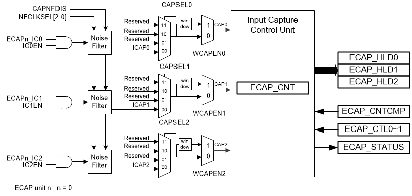 |
|--------------------------------|

Figure 6.10‑1 Input
Capture Timer/Counter Architecture

### Basic Configuration

#### ECAP0 Basic Configuration

- Clock Source Configuration

  - Enable ECAP0 peripheral clock in ECAP0CKEN(CLK_APBCLK1\[26\]).

- Reset Configuration

  - Reset ECAP0 peripheral in ECAP0RST (SYS_IPRST2\[26\]).

### Functional Description

|  |
|--------------------------------|

Figure 6.10‑2 Input
Capture Timer/Counter Clock Source Control

Figure 6.10‑1 illustrates the architecture of the Input Capture. Each
input capture timer/counter unit supports 3 input channels with
programmable input signal sources. The port pins ECAP_IC0 to ECAP_IC2
can be fed to the inputs of capture unit through noise filter or bypass
it (CAPNFDIS = 1).

#### Input Noise Filter

The architecture of input noise filter includes 6 sampling-rate options.
It supports a wide range of filtering noise whose duration is from 125
ns (NFCLKSEL = 000) to 8 us (NFCLKSEL = 101) while PCLK is running at
the frequency of 24 MHz. Table 6.10‑1 lists the relation between the
setting of NFCLKSEL, the duration of filtered noise and the duration of
the signal that is guaranteed to be sampled.

The maximum duration of the noise that is filtered out should not be
greater than 3 clock cycles, while the minimum duration of the signal
that is guaranteed to be sampled should be greater than 4 clock cycles.

| **NFCLKSEL** | **Maximum Duration Of Noise** | **Minimum Duration Of Signal** |
|--------------|-------------------------------|--------------------------------|
| 000          | 125 ns                        | 167 ns                         |
| 001          | 250 ns                        | 334 ns                         |
| 010          | 500 ns                        | 668 ns                         |
| 011          | 2000 ns                       | 2672 ns                        |
| 100          | 4000 ns                       | 5344 ns                        |
| 101          | 8000 ns                       | 10688 ns                       |
| PCLK= 24 MHz |                               |                                |

Table 6.10‑1 Typical Case
of Noise Filter Settings

|  |
|--------------------------------|

Figure 6.10‑3 Noise
Filter Sampling Clock Selection

|  |
|--------------------------------|

Figure 6.10‑4 Input
Capture Timer/Counter Function Block

#### Input Capture Timer/Counter Operation

An Input Capture Timer/Counter unit consists of 2 main functional
blocks, Capture block and Operation block. There are 3 Input Capture
units in Capture block for 3 input channels.

The capture units function as detecting and measuring the pulse width
and the period of a square wave. The input channel 0 to 2 have their own
edge detectors, which are in Input Capture block but share with one
capture timer/counter, ECAP_CNT, which is in Operation block. The edge
trigger option is programmable through EDGESEL (ECAP_CTL1\[5,4\],
\[3,2\], \[1,0\]) register supporting positive edge, negative edge and
both edge triggers. Each capture unit consists of an enable control bit,
IC0EN ~ IC2EN (ECAP_CTL0\[6:4\]) to enable/disable each input channel
and a status bit CAP0 ~ CAP2 (ECAP_STATUS\[10:8\]) to let software
monitor the current status of each channel.

The Input Capture supports reload mode and compare mode. For both mode,
the capture counter (ECAP_CNT) serves as a 24-bit up-counting counter
whose clock comes from the output of the clock divider and is gated with
CNTEN, and the clock source of the clock divider, which can be set by
CLKSEL\[2:0\] to divide clock by 1,4,16,32,64,96,112 and 128, is
programmable (by setting CNTSRCSEL\[1:0\]) to be from system clock
source, CAP_CLK or input channel CAP0 ~ CAP2. In reload mode,
ECAP_CNTCMP serves as a reload register while in compare mode
ECAP_CNTCMP serves as a compare register. The Input Capture
Timer/Counter Enable bit (CAPEN) must be set to enable Input Capture
Timer/Counter functions. More details of operation are described in the
following.

1.  Capture Function

Each time when the capture input detect a valid edge change, it triggers
a valid capture event (CAPTE0~2) so that the content of the free running
24-bit capture counter ECAP_CNT will be captured/transferred into the
capture hold registers, ECAP_HLD0~2 depending on which channel is
triggered. This event also causes the corresponding flag CAPTFx
(ECAP_STATUS\[2:0\]) to be set, which will generate an interrupt if the
corresponding interrupt enable bit CAPIENx (ECAP_CTL0\[18:16\]) is set.
Triggered Flags are set by hardware and should be cleared by software.
Software can read the register ECAP_STATUS to get the status of flags
and has to write 1 to the corresponding bit(s) of ECAP_STATUS to clear
flag(s).

In addition, setting the CAPxCLREN(ECAP_CTL1\[22:20\]) will allow
hardware to reset capture counter (ECAP_CNT) automatically whenever the
event happens.

2.  Compare Mode

The compare function is enabled by setting the CMPEN (ECAP_CTL0\[28\])
bit to 1, and ECAP_CNTCMP will serve as a compare register. As ECAP_CNT
counting up, upon matching ECAP_CNTCMP value, the flag, CAPCMPF
(ECAP_STATUS\[4\]), will be set, which will generate an interrupt,
CMP_INT, if compare interrupt enable bit, CMPIEN (ECAP_CTL0\[21\]), is
set.

Besides, setting the CMPCLR (ECAP_CTL0\[25\]) will allow hardware to
make capture counter cleared to zero automatically after a compare-match
event occurs.

3.  Reload Mode

The Input Capture Timer/Counter can also be configured for reload mode.
The reload function is enabled by setting the RLDEN\[3:0\] bits
(ECAP_CTL1\[11:8\]) – OVRLDEN, CAPxRLDEN – to 1, and each bit enables a
reload source.

In this mode, ECAP_CNTCMP serves as a reload register. If OVRLDEN is
set, a reload event is generated and causes the content of the
ECAP_CNTCMP register to be loaded into the ECAP_CNT register when
ECAP_CNT overflows. Furthermore, CAPxRLDEN, x=0~2, are enable bits of
making CAPTE2 ~ CAPTE0 as reload sources.

One thing should be noted is that if CAPxCLREN as well as CAPxRLDEN are
set, when a valid trigger event (CAPTEx) occurs, only RELAOD function
will be executed.

4.  Window Mode

The window mode links the PWM timing and capture function. The Input
Capture detects the edge change only in a specific period (time window)
which is programmable and synchronized with PWM period and duty. Figure
6.10‑5 illustrates the detecting time in Window Mode. The relative
control registers include ECAP_WMCTL, ECAP_WMDLY and PWM_WECAP.

|  |
|---------------------------------|

Figure 6.10‑5 Timing of
Detecting Falling Edge at IC0 in Window Mode

In widow mode (WECAPENx=1), the initial state of CAPx before entering
window time depends on which edge will be detected that is decided by
EDGESELx\[1:0\]. If EDGESELx\[1:0\]= 00 (detect rising edge) the state
of CAPx will be set as low outside the window. If EDGESELx\[1:0\] = 01
(detect falling edge) the state of CAPx will be set as high outside the
window. If EDGESELx\[1:0\] =1x (detect both edge) the state of CAPx will
be synchronized with ICAPx.

#### Input Capture Timer/Counter Interrupt Architecture

Figure 6.10‑6 demonstrates the architecture of Input Capture
Timer/Counter interrupt module. There are 5 interrupt sources (OVF_INT,
CMP_INT, CAPTF0_INT~CAPTF2_INT), which are logical ‘OR’ together, in a
input capture unit, and each one has an interrupt flag (CAPOVF, CAPCMPF,
CAPTF0~CAPTF2), which can trigger Interrupt (ECAP_INT), as well as an
the enable control bit (OVIEN, CMPIEN, CAPIEN0~CAPIEN2) to
enable/disable the flag.

Note that all the interrupt flags are set by hardware and must be
cleared by software by writing 1 to the bit (ECAP_STATUS\[5:4\],\[2:0\])
corresponding to the flag.

|  |
|---------------------------------|

Figure 6.10‑6 Input
Capture Timer/Counter Interrupt Architecture Diagram

### Register Map

**R**: read only, **W**: write only, **R/W**: both read and write

<table>
<colgroup>
<col style="width: 15%" />
<col style="width: 16%" />
<col style="width: 4%" />
<col style="width: 51%" />
<col style="width: 12%" />
</colgroup>
<thead>
<tr>
<th><strong>Register</strong></th>
<th><strong>Offset</strong></th>
<th><strong>R/W</strong></th>
<th><strong>Description</strong></th>
<th><strong>Reset Value</strong></th>
</tr>
</thead>
<tbody>
<tr>
<td colspan="5">
<strong>ECAP Base Address:</strong>

<strong>ECAPn_BA = 0x400B_4000 + (0x0000_1000*n)</strong>

<strong>n=0</strong>
</td>
</tr>
<tr>
<td><strong>ECAP_CNT</strong></td>
<td>ECAPn_BA+0x00</td>
<td>R/W</td>
<td>Input Capture Counter (24-bit Up Counter)</td>
<td>0x0000_0000</td>
</tr>
<tr>
<td><strong>ECAP_HLD0</strong></td>
<td>ECAPn_BA+0x04</td>
<td>R/W</td>
<td>Input Capture Hold Register 0</td>
<td>0x0000_0000</td>
</tr>
<tr>
<td><strong>ECAP_HLD1</strong></td>
<td>ECAPn_BA+0x08</td>
<td>R/W</td>
<td>Input Capture Hold Register 1</td>
<td>0x0000_0000</td>
</tr>
<tr>
<td><strong>ECAP_HLD2</strong></td>
<td>ECAPn_BA+0x0C</td>
<td>R/W</td>
<td>Input Capture Hold Register 2</td>
<td>0x0000_0000</td>
</tr>
<tr>
<td><strong>ECAP_CNTCMP</strong></td>
<td>ECAPn_BA+0x10</td>
<td>R/W</td>
<td>Input Capture Compare Register</td>
<td>0x0000_0000</td>
</tr>
<tr>
<td><strong>ECAP_CTL0</strong></td>
<td>ECAPn_BA+0x14</td>
<td>R/W</td>
<td>Input Capture Control Register 0</td>
<td>0x0000_0000</td>
</tr>
<tr>
<td><strong>ECAP_CTL1</strong></td>
<td>ECAPn_BA+0x18</td>
<td>R/W</td>
<td>Input Capture Control Register 1</td>
<td>0x0000_0000</td>
</tr>
<tr>
<td><strong>ECAP_STATUS</strong></td>
<td>ECAPn_BA+0x1C</td>
<td>R/W</td>
<td>Input Capture Status Register</td>
<td>0x0000_0000</td>
</tr>
<tr>
<td><strong>ECAP_WMCTL</strong></td>
<td>ECAPn_BA+0x20</td>
<td>R/W</td>
<td>Input Capture timer/Counter Window Mode Control Register</td>
<td>0x0000_0000</td>
</tr>
<tr>
<td><strong>ECAP_WMDLY</strong></td>
<td>ECAPn_BA+0x24</td>
<td>R/W</td>
<td>Window Mode CAP Trigger Delay Control Register</td>
<td>0x0000_0000</td>
</tr>
<tr>
<td><strong>ECAP_TRGHLD</strong></td>
<td>ECAPn_BA+0x28</td>
<td>R/W</td>
<td>Window Mode Trigger Counter Hold Register</td>
<td>0x0000_0000</td>
</tr>
</tbody>
</table>

### Register Description

##### Input Capture Counter (ECAP_CNT) 

| **Register** | **Offset** | **R/W** | **Description** | **Reset Value** |
|----|----|----|----|----|
| **ECAP_CNT** | ECAPn_BA+0x00 | R/W | Input Capture Counter (24-bit Up Counter) | 0x0000_0000 |

|    **31**    | **30** | **29** | **28** | **27** | **26** | **25** | **24** |
|:------------:|:------:|:------:|:------:|:------:|:------:|:------:|:------:|
| **Reserved** |        |        |        |        |        |        |        |
|    **23**    | **22** | **21** | **20** | **19** | **18** | **17** | **16** |
|   **CNT**    |        |        |        |        |        |        |        |
|    **15**    | **14** | **13** | **12** | **11** | **10** | **9**  | **8**  |
|   **CNT**    |        |        |        |        |        |        |        |
|    **7**     | **6**  | **5**  | **4**  | **3**  | **2**  | **1**  | **0**  |
|   **CNT**    |        |        |        |        |        |        |        |

<table>
<colgroup>
<col style="width: 6%" />
<col style="width: 8%" />
<col style="width: 85%" />
</colgroup>
<thead>
<tr>
<th><strong>Bits</strong></th>
<th colspan="2"><strong>Description</strong></th>
</tr>
</thead>
<tbody>
<tr>
<td>[31:24]</td>
<td><strong>Reserved</strong></td>
<td>Reserved.</td>
</tr>
<tr>
<td>[23:0]</td>
<td><strong>CNT</strong></td>
<td>
<strong>Input Capture Timer/Counter</strong>

The input Capture Timer/Counter is a 24-bit up-counting counter. The
clock source for the counter is from the clock divider.
</td>
</tr>
</tbody>
</table>

##### Input Capture Counter Hold Register (ECAP_HLD0~2) 

| **Register** | **Offset** | **R/W** | **Description** | **Reset Value** |
|----|----|----|----|----|
| **ECAP_HLD0** | ECAPn_BA+0x04 | R/W | Input Capture Hold Register 0 | 0x0000_0000 |
| **ECAP_HLD1** | ECAPn_BA+0x08 | R/W | Input Capture Hold Register 1 | 0x0000_0000 |
| **ECAP_HLD2** | ECAPn_BA+0x0C | R/W | Input Capture Hold Register 2 | 0x0000_0000 |

|    **31**    | **30** | **29** | **28** | **27** | **26** | **25** | **24** |
|:------------:|:------:|:------:|:------:|:------:|:------:|:------:|:------:|
| **Reserved** |        |        |        |        |        |        |        |
|    **23**    | **22** | **21** | **20** | **19** | **18** | **17** | **16** |
|   **HOLD**   |        |        |        |        |        |        |        |
|    **15**    | **14** | **13** | **12** | **11** | **10** | **9**  | **8**  |
|   **HOLD**   |        |        |        |        |        |        |        |
|    **7**     | **6**  | **5**  | **4**  | **3**  | **2**  | **1**  | **0**  |
|   **HOLD**   |        |        |        |        |        |        |        |

<table>
<colgroup>
<col style="width: 6%" />
<col style="width: 8%" />
<col style="width: 85%" />
</colgroup>
<thead>
<tr>
<th><strong>Bits</strong></th>
<th colspan="2"><strong>Description</strong></th>
</tr>
</thead>
<tbody>
<tr>
<td>[31:24]</td>
<td><strong>Reserved</strong></td>
<td>Reserved.</td>
</tr>
<tr>
<td>[23:0]</td>
<td><strong>HOLD</strong></td>
<td>
<strong>Input Capture Counter Hold Register</strong>

When an active input capture channel detects a valid edge signal
change, the ECAPCNT value is latched into the corresponding holding
register. Each input channel has its own holding register named by
ECAP_HLDx where x is from 0 to 2 to indicate inputs from IC0 to IC2,
respectively.
</td>
</tr>
</tbody>
</table>

##### Input Capture Counter Compare Register (ECAP_CNTCMP) 

| **Register** | **Offset** | **R/W** | **Description** | **Reset Value** |
|----|----|----|----|----|
| **ECAP_CNTCMP** | ECAPn_BA+0x10 | R/W | Input Capture Compare Register | 0x0000_0000 |

|    **31**    | **30** | **29** | **28** | **27** | **26** | **25** | **24** |
|:------------:|:------:|:------:|:------:|:------:|:------:|:------:|:------:|
| **Reserved** |        |        |        |        |        |        |        |
|    **23**    | **22** | **21** | **20** | **19** | **18** | **17** | **16** |
|  **CNTCMP**  |        |        |        |        |        |        |        |
|    **15**    | **14** | **13** | **12** | **11** | **10** | **9**  | **8**  |
|  **CNTCMP**  |        |        |        |        |        |        |        |
|    **7**     | **6**  | **5**  | **4**  | **3**  | **2**  | **1**  | **0**  |
|  **CNTCMP**  |        |        |        |        |        |        |        |

<table>
<colgroup>
<col style="width: 6%" />
<col style="width: 8%" />
<col style="width: 85%" />
</colgroup>
<thead>
<tr>
<th><strong>Bits</strong></th>
<th colspan="2"><strong>Description</strong></th>
</tr>
</thead>
<tbody>
<tr>
<td>[31:24]</td>
<td><strong>Reserved</strong></td>
<td>Reserved.</td>
</tr>
<tr>
<td>[23:0]</td>
<td><strong>CNTCMP</strong></td>
<td>
<strong>Input Capture Counter Compare Register</strong>

If the compare function is enabled (CMPEN = 1), this register
(ECAP_CNTCMP) is used to compare with the capture counter
(ECAP_CNT).

If the reload control is enabled (RLDEN[n] = 1, n=0~3), an overflow
event or capture events will trigger the hardware to load the value of
this register (ECAP_CNTCMP) into ECAP_CNT.
</td>
</tr>
</tbody>
</table>

##### Input Capture Timer/Counter Control Register (ECAP_CTL0) 

| **Register** | **Offset** | **R/W** | **Description** | **Reset Value** |
|----|----|----|----|----|
| **ECAP_CTL0** | ECAPn_BA+0x14 | R/W | Input Capture Control Register 0 | 0x0000_0000 |

| **31** | **30** | **29** | **28** | **27** | **26** | **25** | **24** |
|:--:|:--:|:--:|:--:|:--:|:--:|:--:|:--:|
| **Reserved** |  | **CAPEN** | **CMPEN** | **Reserved** |  | **CMPCLREN** | **CNTEN** |
| **23** | **22** | **21** | **20** | **19** | **18** | **17** | **16** |
| **Reserved** |  | **CMPIEN** | **OVIEN** | **Reserved** | **CAPIEN2** | **CAPIEN1** | **CAPIEN0** |
| **15** | **14** | **13** | **12** | **11** | **10** | **9** | **8** |
| **Reserved** |  | **CAPSEL2** |  | **CAPSEL1** |  | **CAPSEL0** |  |
| **7** | **6** | **5** | **4** | **3** | **2** | **1** | **0** |
| **Reserved** | **IC2EN** | **IC1EN** | **IC0EN** | **CAPNFDIS** | **NFCLKSEL** |  |  |

<table>
<colgroup>
<col style="width: 6%" />
<col style="width: 10%" />
<col style="width: 83%" />
</colgroup>
<thead>
<tr>
<th><strong>Bits</strong></th>
<th colspan="2"><strong>Description</strong></th>
</tr>
</thead>
<tbody>
<tr>
<td>[31:30]</td>
<td><strong>Reserved</strong></td>
<td>Reserved.</td>
</tr>
<tr>
<td>[29]</td>
<td><strong>CAPEN</strong></td>
<td>
<strong>Input Capture Timer/Counter Enable Bit</strong>

0 = Input Capture function Disabled.

1 = Input Capture function Enabled.
</td>
</tr>
<tr>
<td>[28]</td>
<td><strong>CMPEN</strong></td>
<td>
<strong>Compare Function Enable Bit</strong>

The compare function in input capture timer/counter is to compare the
dynamic counting ECAP_CNT with the compare register ECAP_CNTCMP, if
ECAP_CNT value reaches ECAP_CNTCMP, the flag CAPCMPF will be set.

0 = The compare function Disabled.

1 = The compare function Enabled.
</td>
</tr>
<tr>
<td>[27:26]</td>
<td><strong>Reserved</strong></td>
<td>Reserved.</td>
</tr>
<tr>
<td>[25]</td>
<td><strong>CMPCLREN</strong></td>
<td>
<strong>Input Capture Counter Cleared by Compare-match
Control</strong>

If this bit is set to 1, the capture counter (ECAP_CNT) will be
cleared to 0 when the compare-match event (CAPCMPF = 1) occurs.

0 = Compare-match event (CAPCMPF) can clear capture counter
(ECAP_CNT) Disabled.

1 = Compare-match event (CAPCMPF) can clear capture counter
(ECAP_CNT) Enabled.
</td>
</tr>
<tr>
<td>[24]</td>
<td><strong>CNTEN</strong></td>
<td>
<strong>Input Capture Counter Start Counting Control</strong>

Setting this bit to 1, the capture counter (ECAP_CNT) starts
up-counting the clock.

0 = ECAP_CNT stops counting.

1 = ECAP_CNT starts up-counting.
</td>
</tr>
<tr>
<td>[23:22]</td>
<td><strong>Reserved</strong></td>
<td>Reserved.</td>
</tr>
<tr>
<td>[21]</td>
<td><strong>CMPIEN</strong></td>
<td>
<strong>CAPCMPF Trigger Input Capture Interrupt Enable
Bit</strong>

0 = The flag CAPCMPF can trigger Input Capture interrupt
Disabled.

1 = The flag CAPCMPF can trigger Input Capture interrupt
Enabled.
</td>
</tr>
<tr>
<td>[20]</td>
<td><strong>OVIEN</strong></td>
<td>
<strong>CAPOVF Trigger Input Capture Interrupt Enable
Bit</strong>

0 = The flag CAPOVF can trigger Input Capture interrupt Disabled.

1 = The flag CAPOVF can trigger Input Capture interrupt
Enabled.
</td>
</tr>
<tr>
<td>[19]</td>
<td><strong>Reserved</strong></td>
<td>Reserved.</td>
</tr>
<tr>
<td>[18]</td>
<td><strong>CAPIEN2</strong></td>
<td>
<strong>Input Capture Channel 2 Interrupt Enable
Control</strong>

0 = The flag CAPTF2 can trigger Input Capture interrupt Disabled.

1 = The flag CAPTF2 can trigger Input Capture interrupt
Enabled.
</td>
</tr>
<tr>
<td>[17]</td>
<td><strong>CAPIEN1</strong></td>
<td>
<strong>Input Capture Channel 1 Interrupt Enable
Control</strong>

0 = The flag CAPTF1 can trigger Input Capture interrupt Disabled.

1 = The flag CAPTF1 can trigger Input Capture interrupt
Enabled.
</td>
</tr>
<tr>
<td>[16]</td>
<td><strong>CAPIEN0</strong></td>
<td>
<strong>Input Capture Channel 0 Interrupt Enable
Control</strong>

0 = The flag CAPTF0 can trigger Input Capture interrupt Disabled.

1 = The flag CAPTF0 can trigger Input Capture interrupt
Enabled.
</td>
</tr>
<tr>
<td>[15:14]</td>
<td><strong>Reserved</strong></td>
<td>Reserved.</td>
</tr>
<tr>
<td>[13:12]</td>
<td><strong>CAPSEL2</strong></td>
<td>
<strong>CAP2 Input Source Selection</strong>

00 = CAP2 input is from port pin ICAP2.

01 = Reserved.

10 = Reserved

11 = Reserved.
</td>
</tr>
<tr>
<td>[11:10]</td>
<td><strong>CAPSEL1</strong></td>
<td>
<strong>CAP1 Input Source Selection</strong>

00 = CAP1 input is from port pin ICAP1.

01 = Reserved.

10 = Reserved

11 = Reserved.
</td>
</tr>
<tr>
<td>[9:8]</td>
<td><strong>CAPSEL0</strong></td>
<td>
<strong>CAP0 Input Source Selection</strong>

00 = CAP0 input is from port pin ICAP0.

01 = Reserved.

10 = Reserved

11 = Reserved.
</td>
</tr>
<tr>
<td>[7]</td>
<td><strong>Reserved</strong></td>
<td>Reserved.</td>
</tr>
<tr>
<td>[6]</td>
<td><strong>IC2EN</strong></td>
<td>
<strong>Port Pin IC2 Input to Input Capture Unit Enable
Control</strong>

0 = IC2 input to Input Capture Unit Disabled.

1 = IC2 input to Input Capture Unit Enabled.
</td>
</tr>
<tr>
<td>[5]</td>
<td><strong>IC1EN</strong></td>
<td>
<strong>Port Pin IC1 Input to Input Capture Unit Enable
Control</strong>

0 = IC1 input to Input Capture Unit Disabled.

1 = IC1 input to Input Capture Unit Enabled.
</td>
</tr>
<tr>
<td>[4]</td>
<td><strong>IC0EN</strong></td>
<td>
<strong>Port Pin IC0 Input to Input Capture Unit Enable
Control</strong>

0 = IC0 input to Input Capture Unit Disabled.

1 = IC0 input to Input Capture Unit Enabled.
</td>
</tr>
<tr>
<td>[3]</td>
<td><strong>CAPNFDIS</strong></td>
<td>
<strong>Input Capture Noise Filter Disable Control</strong>

0 = Noise filter of Input Capture Enabled.

1 = Noise filter of Input Capture Disabled (Bypass).
</td>
</tr>
<tr>
<td>[2:0]</td>
<td><strong>NFCLKSEL</strong></td>
<td>
<strong>Noise Filter Clock Pre-divide Selection</strong>

To determine the sampling frequency of the Noise Filter clock

000 = CAP_CLK.

001 = CAP_CLK/2.

010 = CAP_CLK/4.

011 = CAP_CLK/16.

100 = CAP_CLK/32.

101 = CAP_CLK/64.
</td>
</tr>
</tbody>
</table>

##### Input Capture Timer/Counter Control Register (ECAP_CTL1) 

| **Register** | **Offset** | **R/W** | **Description** | **Reset Value** |
|----|----|----|----|----|
| **ECAP_CTL1** | ECAPn_BA+0x18 | R/W | Input Capture Control Register 1 | 0x0000_0000 |

| **31** | **30** | **29** | **28** | **27** | **26** | **25** | **24** |
|:--:|:--:|:--:|:--:|:--:|:--:|:--:|:--:|
| **Reserved** |  |  |  |  |  |  |  |
| **23** | **22** | **21** | **20** | **19** | **18** | **17** | **16** |
| **Reserved** | **CAP2CLREN** | **CAP1CLREN** | **CAP0CLREN** | **Reserved** |  | **CNTSRCSEL** |  |
| **15** | **14** | **13** | **12** | **11** | **10** | **9** | **8** |
| **Reserved** | **CLKSEL** |  |  | **OVRLDEN** | **CAP2RLDEN** | **CAP1RLDEN** | **CAP0RLDEN** |
| **7** | **6** | **5** | **4** | **3** | **2** | **1** | **0** |
| **Reserved** |  | **EDGESEL2** |  | **EDGESEL1** |  | **EDGESEL0** |  |

<table>
<colgroup>
<col style="width: 6%" />
<col style="width: 12%" />
<col style="width: 81%" />
</colgroup>
<thead>
<tr>
<th><strong>Bits</strong></th>
<th colspan="2"><strong>Description</strong></th>
</tr>
</thead>
<tbody>
<tr>
<td>[31:23]</td>
<td><strong>Reserved</strong></td>
<td>Reserved.</td>
</tr>
<tr>
<td>[22]</td>
<td><strong>CAP2CLREN</strong></td>
<td>
<strong>Capture Counter Cleared by Capture Event2
Control</strong>

0 = Event CAPTE2 can clear capture counter (ECAP_CNT) Disabled.

1 = Event CAPTE2 can clear capture counter (ECAP_CNT)
Enabled.
</td>
</tr>
<tr>
<td>[21]</td>
<td><strong>CAP1CLREN</strong></td>
<td>
<strong>Capture Counter Cleared by Capture Event1
Control</strong>

0 = Event CAPTE1 can clear capture counter (ECAP_CNT) Disabled.

1 = Event CAPTE1 can clear capture counter (ECAP_CNT)
Enabled.
</td>
</tr>
<tr>
<td>[20]</td>
<td><strong>CAP0CLREN</strong></td>
<td>
<strong>Capture Counter Cleared by Capture Event0
Control</strong>

0 = Event CAPTE0 can clear capture counter (ECAP_CNT) Disabled.

1 = Event CAPTE0 can clear capture counter (ECAP_CNT)
Enabled.
</td>
</tr>
<tr>
<td>[17:16]</td>
<td><strong>CNTSRCSEL</strong></td>
<td>
<strong>Capture Timer/Counter Clock Source Selection</strong>

Select the capture timer/counter clock source.

00 = CAP_CLK (default).

01 = CAP0.

10 = CAP1.

11 = CAP2.
</td>
</tr>
<tr>
<td>[15]</td>
<td><strong>Reserved</strong></td>
<td>Reserved.</td>
</tr>
<tr>
<td>[14:12]</td>
<td><strong>CLKSEL</strong></td>
<td>
<strong>Capture Timer Clock Divide Selection</strong>

The capture timer clock has a pre-divider with eight divided options
controlled by CLKSEL[2:0].

000 = CAP_CLK/1.

001 = CAP_CLK/4.

010 = CAP_CLK/16.

011 = CAP_CLK/32.

100 = CAP_CLK/64.

101 = CAP_CLK/96.

110 = CAP_CLK/112.

111 = CAP_CLK/128.
</td>
</tr>
<tr>
<td>[11]</td>
<td><strong>OVRLDEN</strong></td>
<td>
<strong>Capture Counter’s Reload Function Triggered by Overflow
Enable Bit</strong>

0 = The reload triggered by CAPOV Disabled.

1 = The reload triggered by CAPOV Enabled.
</td>
</tr>
<tr>
<td>[10]</td>
<td><strong>CAP2RLDEN</strong></td>
<td>
<strong>Capture Counter’s Reload Function Triggered by Event
CAPTE2 Enable Bit</strong>

0 = The reload triggered by Event CAPTE2 Disabled.

1 = The reload triggered by Event CAPTE2 Enabled.
</td>
</tr>
<tr>
<td>[9]</td>
<td><strong>CAP1RLDEN</strong></td>
<td>
<strong>Capture Counter’s Reload Function Triggered by Event
CAPTE1 Enable Bit</strong>

0 = The reload triggered by Event CAPTE1 Disabled.

1 = The reload triggered by Event CAPTE1 Enabled.
</td>
</tr>
<tr>
<td>[8]</td>
<td><strong>CAP0RLDEN</strong></td>
<td>
<strong>Capture Counter’s Reload Function Triggered by Event
CAPTE0 Enable Bit</strong>

0 = The reload triggered by Event CAPTE0 Disabled.

1 = The reload triggered by Event CAPTE0 Enabled.
</td>
</tr>
<tr>
<td>[7:6]</td>
<td><strong>Reserved</strong></td>
<td>Reserved.</td>
</tr>
<tr>
<td>[5:4]</td>
<td><strong>EDGESEL2</strong></td>
<td>
<strong>Channel 2 Captured Edge Selection</strong>

Input capture2 can detect falling edge change only, rising edge
change only or both edge changes

00 = Detect rising edge only.

01 = Detect falling edge only.

1x = Detect both rising and falling edge.
</td>
</tr>
<tr>
<td>[3:2]</td>
<td><strong>EDGESEL1</strong></td>
<td>
<strong>Channel 1 Captured Edge Selection</strong>

Input capture1 can detect falling edge change only, rising edge
change only or both edge change

00 = Detect rising edge only.

01 = Detect falling edge only.

1x = Detect both rising and falling edge.
</td>
</tr>
<tr>
<td>[1:0]</td>
<td><strong>EDGESEL0</strong></td>
<td>
<strong>Channel 0 Captured Edge Selection</strong>

Input capture0 can detect falling edge change only, rising edge
change only or both edge change

00 = Detect rising edge only.

01 = Detect falling edge only.

1x = Detect both rising and falling edge.
</td>
</tr>
</tbody>
</table>

##### Input Capture Timer/Counter Status Register (ECAP_STATUS) 

| **Register** | **Offset** | **R/W** | **Description** | **Reset Value** |
|----|----|----|----|----|
| **ECAP_STATUS** | ECAPn_BA+0x1C | R/W | Input Capture Status Register | 0x0000_0000 |

| **31** | **30** | **29** | **28** | **27** | **26** | **25** | **24** |
|:--:|:--:|:--:|:--:|:--:|:--:|:--:|:--:|
| **Reserved** |  |  |  |  |  |  |  |
| **23** | **22** | **21** | **20** | **19** | **18** | **17** | **16** |
| **Reserved** |  |  |  |  |  |  |  |
| **15** | **14** | **13** | **12** | **11** | **10** | **9** | **8** |
| **Reserved** |  |  |  |  | **CAP2** | **CAP1** | **CAP0** |
| **7** | **6** | **5** | **4** | **3** | **2** | **1** | **0** |
| **Reserved** |  | **CAPOVF** | **CAPCMPF** | **Reserved** | **CAPTF2** | **CAPTF1** | **CAPTF0** |

<table>
<colgroup>
<col style="width: 6%" />
<col style="width: 9%" />
<col style="width: 84%" />
</colgroup>
<thead>
<tr>
<th><strong>Bits</strong></th>
<th colspan="2"><strong>Description</strong></th>
</tr>
</thead>
<tbody>
<tr>
<td>[31:11]</td>
<td><strong>Reserved</strong></td>
<td>Reserved.</td>
</tr>
<tr>
<td>[10]</td>
<td><strong>CAP2</strong></td>
<td>
<strong>Value of Input Channel 2, CAP2 (Read Only)</strong>

Reflecting the value of input channel 2, CAP2.

<strong>Note:</strong> The bit is read only and write is
ignored.
</td>
</tr>
<tr>
<td>[9]</td>
<td><strong>CAP1</strong></td>
<td>
<strong>Value of Input Channel 1, CAP1 (Read Only)</strong>

Reflecting the value of input channel 1, CAP1

<strong>Note:</strong> The bit is read only and write is
ignored.
</td>
</tr>
<tr>
<td>[8]</td>
<td><strong>CAP0</strong></td>
<td>
<strong>Value of Input Channel 0, CAP0 (Read Only)</strong>

Reflecting the value of input channel 0, CAP0

<strong>Note:</strong> The bit is read only and write is
ignored.
</td>
</tr>
<tr>
<td>[7:6]</td>
<td><strong>Reserved</strong></td>
<td>Reserved.</td>
</tr>
<tr>
<td>[5]</td>
<td><strong>CAPOVF</strong></td>
<td>
<strong>Input Capture Counter Overflow Flag</strong>

Flag is set by hardware when counter (ECAP_CNT) overflows from
0x00FF_FFFF to zero.

0 = No overflow event has occurred since last clear.

1 = Overflow event(s) has/have occurred since last clear.

<strong>Note:</strong> This bit is only cleared by writing 1 to
it.
</td>
</tr>
<tr>
<td>[4]</td>
<td><strong>CAPCMPF</strong></td>
<td>
<strong>Input Capture Compare-match Flag</strong>

If the input capture compare function is enabled, the flag is set by
hardware when capture counter (ECAP_CNT) up counts and reaches the
ECAP_CNTCMP value.

0 = ECAP_CNT has not matched ECAP_CNTCMP value since last clear.

1 = ECAP_CNT has matched ECAP_CNTCMP value at least once since last
clear.

<strong>Note:</strong> This bit is only cleared by writing 1 to
it.
</td>
</tr>
<tr>
<td>[3]</td>
<td><strong>Reserved</strong></td>
<td>Reserved.</td>
</tr>
<tr>
<td>[2]</td>
<td><strong>CAPTF2</strong></td>
<td>
<strong>Input Capture Channel 2 Triggered Flag</strong>

When the input capture channel 2 detects a valid edge change at CAP2
input, it will set flag CAPTF2 to high.

0 = No valid edge change has been detected at CAP2 input since last
clear.

1 = At least a valid edge change has been detected at CAP2 input
since last clear.

<strong>Note:</strong> This bit is only cleared by writing 1 to
it.
</td>
</tr>
<tr>
<td>[1]</td>
<td><strong>CAPTF1</strong></td>
<td>
<strong>Input Capture Channel 1 Triggered Flag</strong>

When the input capture channel 1 detects a valid edge change at CAP1
input, it will set flag CAPTF1 to high.

0 = No valid edge change has been detected at CAP1 input since last
clear.

1 = At least a valid edge change has been detected at CAP1 input
since last clear.

<strong>Note:</strong> This bit is only cleared by writing 1 to
it.
</td>
</tr>
<tr>
<td>[0]</td>
<td><strong>CAPTF0</strong></td>
<td>
<strong>Input Capture Channel 0 Triggered Flag</strong>

When the input capture channel 0 detects a valid edge change at CAP0
input, it will set flag CAPTF0 to high.

0 = No valid edge change has been detected at CAP0 input since last
clear.

1 = At least a valid edge change has been detected at CAP0 input
since last clear.

<strong>Note:</strong> This bit is only cleared by writing 1 to
it.
</td>
</tr>
</tbody>
</table>

##### Input Capture Timer/Counter Window Mode Control Register (ECAP_WMCTL) 

|  |  |  |  |  |
|----|----|----|----|----|
| **Register** | **Offset** | **R/W** | **Description** | **Reset Value** |
| **ECAP_WMCTL** | ECAPn_BA+0x20 | R/W | Input Capture timer/Counter Window Mode Control Register | 0x0000_0000 |

|              |        |        |        |        |             |             |             |
|:------------:|:------:|:------:|:------:|:------:|:-----------:|:-----------:|:-----------:|
|    **31**    | **30** | **29** | **28** | **27** |   **26**    |   **25**    |   **24**    |
| **Reserved** |        |        |        |        |             |             |             |
|    **23**    | **22** | **21** | **20** | **19** |   **18**    |   **17**    |   **16**    |
| **Reserved** |        |        |        |        |             |             |             |
|    **15**    | **14** | **13** | **12** | **11** |   **10**    |    **9**    |    **8**    |
| **Reserved** |        |        |        |        |             |             |             |
|    **7**     | **6**  | **5**  | **4**  | **3**  |    **2**    |    **1**    |    **0**    |
| **Reserved** |        |        |        |        | **WCAP2EN** | **WCAP1EN** | **WCAP0EN** |

<table>
<colgroup>
<col style="width: 12%" />
<col style="width: 15%" />
<col style="width: 71%" />
</colgroup>
<tbody>
<tr>
<td><strong>Bits</strong></td>
<td colspan="2"><strong>Description</strong></td>
</tr>
<tr>
<td>[31:3]</td>
<td><strong>Reserved</strong></td>
<td>Reserved.</td>
</tr>
<tr>
<td>[2]</td>
<td><strong>WCAP2EN</strong></td>
<td>
<strong>Window Mode CAP2 Enable Bit</strong>

0 = CAP2 Window Mode Disabled.

1 = CAP2 Window Mode Enabled.
</td>
</tr>
<tr>
<td>[1]</td>
<td><strong>WCAP1EN</strong></td>
<td>
<strong>Window Mode CAP1 Enable Bit</strong>

0 = CAP1 Window Mode Disabled.

1 = CAP1 Window Mode Enabled.
</td>
</tr>
<tr>
<td>[0]</td>
<td><strong>WCAP0EN</strong></td>
<td>
<strong>Window Mode CAP0 Enable Bit</strong>

0 = CAP0 Window Mode Disabled.

1 = CAP0 Window Mode Enabled.
</td>
</tr>
</tbody>
</table>

##### Window Mode CAP Trigger Delay Control Register (ECAP_WMDLY)  

<table>
<colgroup>
<col style="width: 15%" />
<col style="width: 15%" />
<col style="width: 6%" />
<col style="width: 48%" />
<col style="width: 13%" />
</colgroup>
<tbody>
<tr>
<td><blockquote>

<strong>Register</strong>

</blockquote></td>
<td><blockquote>

<strong>Offset</strong>

</blockquote></td>
<td><blockquote>

<strong>R/W</strong>

</blockquote></td>
<td><blockquote>

<strong>Description</strong>

</blockquote></td>
<td><blockquote>

<strong>Reset Value</strong>

</blockquote></td>
</tr>
<tr>
<td><blockquote>

<strong>ECAP_WMDLY</strong>

</blockquote></td>
<td><blockquote>

ECAPn_BA+0x24

</blockquote></td>
<td><blockquote>

R/W

</blockquote></td>
<td><blockquote>

Window Mode CAP Trigger Delay Control Register

</blockquote></td>
<td><blockquote>

0x0000_0000

</blockquote></td>
</tr>
</tbody>
</table>

|               |        |        |        |        |        |        |        |
|:-------------:|:------:|:------:|:------:|:------:|:------:|:------:|:------:|
|    **31**     | **30** | **29** | **28** | **27** | **26** | **25** | **24** |
| **Reserved**  |        |        |        |        |        |        |        |
|    **23**     | **22** | **23** | **22** | **19** | **18** | **17** | **16** |
| **WMCAP2DLY** |        |        |        |        |        |        |        |
|    **15**     | **14** | **13** | **12** | **11** | **10** | **9**  | **8**  |
| **WMCAP1DLY** |        |        |        |        |        |        |        |
|     **7**     | **6**  | **5**  | **4**  | **3**  | **2**  | **1**  | **0**  |
| **WMCAP0DLY** |        |        |        |        |        |        |        |

<table>
<colgroup>
<col style="width: 14%" />
<col style="width: 19%" />
<col style="width: 66%" />
</colgroup>
<tbody>
<tr>
<td><strong>Bits</strong></td>
<td colspan="2"><strong>Description</strong></td>
</tr>
<tr>
<td>[31:24]</td>
<td><strong>Reserved</strong></td>
<td>Reserved.</td>
</tr>
<tr>
<td>[23:16]</td>
<td><strong>WMCAP2DLY</strong></td>
<td>
<strong>Window Mode CAP2 Delay Timer</strong>

Setting this field will delay CAP2 window period after WM CAP2
trigger is coming.

Delay time is (4 * WMCAP2DLY) * ECAP_CLK
</td>
</tr>
<tr>
<td>[15:8]</td>
<td><strong>WMCAP1DLY</strong></td>
<td>
<strong>Window Mode CAP1 Delay Timer</strong>

Setting this field will delay CAP1 window period after WM CAP1
trigger is coming.

Delay time is (4 * WMCAP1DLY) * ECAP_CLK
</td>
</tr>
<tr>
<td>[7:0]</td>
<td><strong>WMCAP0DLY</strong></td>
<td>
<strong>Window Mode CAP0 Delay Timer</strong>

Setting this field will delay CAP0 window period after WM CAP0
trigger is coming.

Delay time is (4 * WMCAP0DLY) * ECAP_CLK
</td>
</tr>
</tbody>
</table>

##### Window Mode Trigger Counter Hold Register (ECAP_TRGHLD)  

<table>
<colgroup>
<col style="width: 15%" />
<col style="width: 15%" />
<col style="width: 6%" />
<col style="width: 48%" />
<col style="width: 13%" />
</colgroup>
<tbody>
<tr>
<td><blockquote>

<strong>Register</strong>

</blockquote></td>
<td><blockquote>

<strong>Offset</strong>

</blockquote></td>
<td><blockquote>

<strong>R/W</strong>

</blockquote></td>
<td><blockquote>

<strong>Description</strong>

</blockquote></td>
<td><blockquote>

<strong>Reset Value</strong>

</blockquote></td>
</tr>
<tr>
<td><blockquote>

<strong>ECAP_TRGHLD</strong>

</blockquote></td>
<td><blockquote>

ECAPn_BA+0x28

</blockquote></td>
<td><blockquote>

R/W

</blockquote></td>
<td><blockquote>

Window Mode Trigger Counter Hold Register

</blockquote></td>
<td><blockquote>

0x0000_0000

</blockquote></td>
</tr>
</tbody>
</table>

|              |        |        |        |        |        |        |        |
|:------------:|:------:|:------:|:------:|:------:|:------:|:------:|:------:|
|    **31**    | **30** | **29** | **28** | **27** | **26** | **25** | **24** |
| **Reserved** |        |        |        |        |        |        |        |
|    **23**    | **22** | **23** | **22** | **19** | **18** | **17** | **16** |
| **TRGHOLD**  |        |        |        |        |        |        |        |
|    **15**    | **14** | **13** | **12** | **11** | **10** | **9**  | **8**  |
| **TRGHOLD**  |        |        |        |        |        |        |        |
|    **7**     | **6**  | **5**  | **4**  | **3**  | **2**  | **1**  | **0**  |
| **TRGHOLD**  |        |        |        |        |        |        |        |

<table>
<colgroup>
<col style="width: 14%" />
<col style="width: 19%" />
<col style="width: 66%" />
</colgroup>
<tbody>
<tr>
<td><strong>Bits</strong></td>
<td colspan="2"><strong>Description</strong></td>
</tr>
<tr>
<td>[31:24]</td>
<td><strong>Reserved</strong></td>
<td>Reserved.</td>
</tr>
<tr>
<td>[23:0]</td>
<td><strong>TRGHOLD</strong></td>
<td>
<strong>Window Mode Trigger Counter Hold Register</strong>

When WM CAP0 trigger is coming, the ECAPCNT value is latched into
this holding register.
</td>
</tr>
</tbody>
</table>

## UART Interface Controller (UART)

### 

OverviewThe chip provides
two channels of Universal Asynchronous Receiver/Transmitters (UART). The
UART controller performs serial-to-parallel conversion on data received
from the peripheral and parallel-to-serial conversion on data
transmitted from the CPU. Each UART controller channel supports ten
types of interrupts. The UART controller supports flow control function.
The UART controller also supports IrDA SIR, RS-485 and Single-wire
function modes and auto-baud rate measuring function.

### 

- FeaturesFull-duplex
  asynchronous communications

- Separates receive and transmit 16/16 bytes entry FIFO for data
  payloads

- Supports hardware auto-flow control

- Programmable receiver buffer trigger level

- Supports programmable baud rate generator for each channel
  individually

- Supports nCTS and incoming data wake-up function

- Supports 8-bit receiver buffer time-out detection function

- Programmable transmitting data delay time between the last stop and
  the next start bit by setting DLY (UART_TOUT \[15:8\])

- Supports Auto-Baud Rate measurement and baud rate compensation
  function

- Supports break error, frame error, parity error and receive/transmit
  buffer overflow detection function

- Fully programmable serial-interface characteristics

  - Programmable number of data bit, 5-, 6-, 7-, 8- bit character

  - Programmable parity bit, even, odd, no parity or stick parity bit
    generation and detection

  - Programmable stop bit, 1, 1.5, or 2 stop bit generation

- Supports IrDA SIR function mode

  - Supports for 3/16 bit duration for normal mode

- Supports RS-485 function mode

  - Supports RS-485 9-bit mode

  - Supports hardware or software enables to program nRTS pin to control
    RS-485 transmission direction

- Supports Single-wire function mode

| **UART Feature**            | **UART0/ UART1/** |
|-----------------------------|-------------------|
| FIFO                        | 16 Bytes          |
| Auto Flow Control (CTS/RTS) | √                 |
| IrDA                        | √                 |
| RS-485 Function Mode        | √                 |
| nCTS Wake-up                | √                 |
| Incoming Data Wake-up       | √                 |
| Baud Rate Compensation      | √                 |
| Auto-Baud Rate Measurement  | √                 |
| STOP Bit Length             | 1, 1.5, 2 bit     |
| Word Length                 | 5, 6, 7, 8 bits   |
| Even / Odd Parity           | √                 |
| Stick Bit                   | √                 |
| **Note:** √= Supported      |                   |

Table 6.11‑1 UART
Features

### 

Block DiagramThe UART
clock control and block diagram are shown in Figure 6.11‑1 and Figure
6.11‑2 respectively.

**Note:** The frequency of UARTx_CLK should not be greater than 30 times
HCLK.

|  |
|---------------------------------|

Figure 6.11‑1 UART Clock
Control Diagram

|  |
|---------------------------------|

Figure 6.11‑2 UART Block
Diagram

Each block is described in detail as follows:

1.  

TX_FIFOThe transmitter is buffered with a 16 bytes FIFO to reduce the
number of interrupts presented to the CPU.

2.  

RX_FIFOThe receiver is buffered with a 16 bytes FIFO (plus three error
bits, BIF (UART_FIFOSTS\[6\]), FEF (UART_FIFOSTS\[5\]), PEF
(UART_FIFOSTS\[4\])) to reduce the number of interrupts presented to the
CPU.

3.  

TX Shift RegisterThis block is responsible for shifting out the
transmitting data serially.

4.  

RX Shift RegisterThis block is responsible for shifting in the receiving
data serially.

5.  

Modem Control and Status RegisterThis register controls the interface to
the MODEM or data set (or a peripheral device emulating a MODEM).

6.  

Baud Rate GeneratorDivide the external clock by the divisor to get the
desired baud rate clock. Refer to baud rate equation.

7.  

IrDA EncodeThis block is IrDA encoding control block.

8.  

IrDA DecodeThis block is IrDA decoding control block.

9.  

FIFO & Line Control and Status RegisterThis field is register set that
including the FIFO control register (UART_FIFO), FIFO status register
(UART_FIFOSTS), and line control register (UART_LINE) for transmitter
and receiver. The time-out register (UART_TOUT) identifies the condition
of time-out interrupt.

10. 

Auto-Baud Rate MeasurementThis block is responsible for auto-baud rate
measurement.

11. 

Interrupt Control and Status RegisterThere are ten types of interrupts.
Interrupt enable register (UART_INTEN) enable or disable the responding
interrupt and interrupt status register (UART_INTSTS) identifying the
occurrence of the responding interrupt.

| **Interrupt** | **Description** |
|----|----|
| RDAINT | Receive Data Available Interrupt. |
| THREINT | Transmit Holding Register Empty Interrupt. |
| TXENDINT | Transmitter Empty Interrupt. |
| RLSINT | Receive Line Status Interrupt (parity error or frame error or break error). |
| MODEMINT | MODEM Status Interrupt. |
| RXTOINT | Receiver Buffer Time-out Interrupt. |
| BUFERRINT | Buffer Error Interrupt. |
| WKINT | Wake-up Interrupt. |
| ABRINT | Auto-Baud Rate Interrupt. |
| SWBEINT | Single-wire Bit Error Detect Interrupt. |

Table 6.11‑2 UART
Interrupt

### 

Basic ConfigurationThe
basic configurations of UART0 are as follows:

- Clock Source Configuration

  - Select the source of UART0 peripheral clock on UART0SEL
    (CLK_CLKSEL2\[18:16\]).

  - Select the clock divider number of UART0 peripheral clock on
    UART0DIV (CLK_CLKDIV0\[11:8\]).

  - Enable UART0 peripheral clock in UART0CKEN (CLK_APBCLK0\[16\]).

- Reset UART0 controller in UART0RST (SYS_IPRST1\[16\]).

- The basic configurations of UART1 are as follows:Clock Source
  Configuration

  - Select the source of UART1 peripheral clock on UART1SEL
    (CLK_CLKSEL2\[22:20\]).

  - Select the clock divider number of UART1 peripheral clock on
    UART1DIV (CLK_CLKDIV0\[15:12\]).

  - Enable UART1 peripheral clock in UART1CKEN (CLK_APBCLK0\[17\]).

- Reset UART1 controller in UART1RST (SYS_IPRST1\[17\]).

UART Interface Controller Pin description is shown in Table 6.11‑3:

| **Pin**    | **Type** | **Description**             |
|------------|----------|-----------------------------|
| UARTx_TXD  | Output   | UARTx transmit              |
| UARTx_RXD  | Input    | UARTx receive               |
| UARTx_nCTS | Input    | UARTx modem clear to send   |
| UARTx_nRTS | Output   | UARTx modem request to send |

Table 6.11‑3 UART
Interface Controller Pin

### 

Functional DescriptionThe
UART controller supports four function modes including UART, IrDA,
RS-485, and Single-wire mode. User can select a function by setting the
UART_FUNCSEL register. The four function modes will be described in
following section.

#### 

UART Controller Baud Rate GeneratorThe UART controller includes a
programmable baud rate generator capable of dividing clock input by
divisors to produce the serial clock that transmitter and receiver need.
Table 6.11‑4 lists the UART baud rate equations in the various
conditions. Table 6.11‑5 and Table 6.11‑6 list the UART baud rate
parameter and register setting example. In IrDA function mode, the baud
rate generator must be set in mode 0. More detailed register description
is shown in UART_BAUD register. There are three setting modes. Mode 0 is
set by UART_BAUD\[29:28\] with 00. Mode 1 is set by UART_BAUD\[29:28\]
with 10. Mode 2 is set by UART_BAUD\[29:28\] with 11.

<table>
<caption>
Table 6.11‑4
UART controller Baud Rate Equation Table
</caption>
<colgroup>
<col style="width: 10%" />
<col style="width: 11%" />
<col style="width: 12%" />
<col style="width: 65%" />
</colgroup>
<thead>
<tr>
<th><strong>Mode</strong></th>
<th><strong>BAUDM1</strong></th>
<th><strong>BAUDM0</strong></th>
<th><strong>Baud Rate Equation</strong></th>
</tr>
</thead>
<tbody>
<tr>
<td>Mode 0</td>
<td>0</td>
<td>0</td>
<td>UART_CLK / [16 * (BRD+2)].</td>
</tr>
<tr>
<td>Mode 1</td>
<td>1</td>
<td>0</td>
<td>UART_CLK / [(EDIVM1+1) * (BRD+2)], EDIVM1 must &gt;= 8.</td>
</tr>
<tr>
<td>Mode 2</td>
<td>1</td>
<td>1</td>
<td>
UART_CLK / (BRD+2)

If UART_CLK &lt;= 3*HCLK, BRD must &gt;= 8.

If UART_CLK &gt; 3*HCLK, BRD must &gt;= 3*N – 1.

N is the smallest integer larger than or equal to the ratio of
UART_CLK /HCLK.

For example,

if 3*HCLK &lt; UART_CLK =&lt; 4*HCLK, BRD must &gt;=11.

if 4*HCLK &lt; UART_CLK =&lt; 5*HCLK, BRD must &gt;=14.
</td>
</tr>
</tbody>
</table>

Table 6.11‑4 UART
controller Baud Rate Equation Table

|  |  |  |  |
|----|----|----|----|
| **UART Peripheral Clock = 12 MHz** |  |  |  |
| Baud Rate | Mode 0 | Mode 1 | Mode 2 |
| 921600 | Not support | Not recommended | BRD=11 |
| 460800 | Not recommended | BRD=0, EDIVM1 =13 | BRD=24 |
| 230400 | Not recommended | BRD =2, EDIVM1 =13 | BRD =50 |
| 115200 | Not recommended | BRD =6, EDIVM1 =13 | BRD =102 |
| 57600 | BRD =11 | BRD =14, EDIVM1 =13 | BRD =206 |
| 38400 | BRD =18 | BRD =22, EDIVM1 =13 | BRD =311 |
| 19200 | BRD =37 | BRD =123, EDIVM1 =5 | BRD =623 |
| 9600 | BRD =76 | BRD =123, EDIVM1 =10 | BRD =1248 |
| 4800 | BRD =154 | BRD =248, EDIVM1 =10 | BRD =2498 |

|  |  |  |  |
|----|----|----|----|
| **UART Peripheral Clock = 12 MHz** |  |  |  |
| Baud Rate | UART_BAUD Value |  |  |
|  | Mode 0 | Mode 1 | Mode 2 |
| 921600 | Not support | Not recommended | 0x3000_000B |
| 460800 | Not recommended | 0x2D00_0000 | 0x3000_0018 |
| 230400 | Not recommended | 0x2D00_0002 | 0x3000_0032 |
| 115200 | Not recommended | 0x2D00_0006 | 0x3000_0066 |
| 57600 | 0x0000_000B | 0x2D00_000E | 0x3000_00CE |
| 38400 | 0x0000_0012 | 0x2D00_0016 | 0x3000_0137 |
| 19200 | 0x0000_0025 | 0x2500_007B | 0x3000_026F |
| 9600 | 0x0000_004C | 0x2A00_007B | 0x3000_04E0 |
| 4800 | 0x0000_009A | 0x2A00_00F8 | 0x3000_09C2 |

Table 6.11‑5 UART
controller Baud Rate Parameter Setting Example Table

Table 6.11‑6 UART
controller Baud Rate Register Setting Example Table

#### 

UART Controller Baud Rate CompensationThe UART controller supports baud
rate compensation function. It is used to optimize the precision in each
bit. The precision of the compensation is half of UART module clock
because there is BRCOMPDEC (UART_BRCOMP\[31\]) to define the positive or
negative compensation in each bit. If the BRCOMPDEC (UART_BRCOMP\[31\])
= 0, it is positive compensation for each bit, one more module clock
will be append in the compensated bit. If the BRCOMPDEC
(UART_BRCOMP\[31\]) = 1, it is negative compensation for each bit,
decrease one module clock in the compensated bit.

There is 9-bits location, BRCOMP\[8:0\] (UART_BRCOMP\[8:0\]), can be
configured by user to define the relative bit is compensated or not.
BRCOMP\[7:0\] is used to define the compensation of DAT
(UART_DAT\[7:0\]) and BRCOMP\[8\] is used to define PARITY
(UART_DAT\[8\]).

**Example:**

1.  

UART’s peripheral clock = 12M and baud rate is 115200Baud rate is
115200, UART peripheral clock is 12M 🡪 104.167 peripheral clock/bit

if the baud divider is set 102 (104 peripheral clock/bit), the
inaccuracy of each bit is -0.167 peripheral clock and BRCOMPDEC
(UART_BRCOMP\[31\]) = 0,

| **Bit** | **Name** | **Total INACCURACY** | **BRCOMP Compensated** | **Final Inaccuracy** |
|----|----|----|----|----|
| 0 | Start | -0.167 | x | -0.167 |
| 1 | UART_DAT\[0\] | -0.334(-0.167-0.167) | 0 | -0.334 |
| 2 | UART_DAT\[1\] | -0.501(-0.334-0.167) | 1 | 0.499 |
| 3 | UART_DAT\[2\] | 0.332(0.499-0.167) | 0 | 0.332 |
| 4 | UART_DAT\[3\] | 0.165(0.332-0.167) | 0 | 0.165 |
| 5 | UART_DAT\[4\] | -0.002(0.165-0.167) | 0 | -0.002 |
| 6 | UART_DAT\[5\] | -0.169(-0.002-0.167) | 0 | -0.169 |
| 7 | UART_DAT\[6\] | -0.336(-0.169-0.167) | 0 | -0.336 |
| 8 | UART_DAT\[7\] | -0.503(-0.336-0.167) | 1 | 0.497 |
| 9 | Parity | 0.330(0.497-0.167) | 0 | 0.330 |

Table 6.11‑7 Baud Rate
Compensation Example Table 1

So that the BRCOMP (UART_BRCOMP\[8:0\]) can be set as 9’b010000010 =
0x82.

2.  

UART’s peripheral clock = 1.6M and baud rate is 9600Baud rate is 9600,
UART peripheral clock is 24M/15 = 1.6M 🡪 166.667 peripheral clock/bit

if the baud divider is set 165 (167 peripheral clock/bit), the
inaccuracy of each bit is 0.333 peripheral clock and BRCOMPDEC
(UART_BRCOMP\[31\]) = 1,

| **Bit** | **Name** | **Total INACCURACY** | **BRCOMP Compensated** | **Final Inaccuracy** |
|----|----|----|----|----|
| 0 | Start | 0.333 | x | 0.333 |
| 1 | UART_DAT\[0\] | 0.666(0. 333+0. 333) | 1 | -0.334 |
| 2 | UART_DAT\[1\] | -0.001(-0.334+0.333) | 0 | -0.001 |
| 3 | UART_DAT\[2\] | 0.332(-0.001+0.333) | 0 | 0.332 |
| 4 | UART_DAT\[3\] | 0.665(0.332+0.333) | 1 | -0.335 |
| 5 | UART_DAT\[4\] | -0.002(-0.335+0.333) | 0 | -0.002 |
| 6 | UART_DAT\[5\] | 0.331(-0.002+0.333) | 0 | 0.331 |
| 7 | UART_DAT\[6\] | 0.664(0.331+0.333) | 1 | -0.336 |
| 8 | UART_DAT\[7\] | -0.003(-0.336+0.333) | 0 | -0.003 |
| 9 | Parity | 0.330(-0.003+0.333) | 0 | 0.330 |

Table 6.11‑8 Baud Rate
Compensation Example Table 2

So that the BRCOMP (UART_BRCOMP\[8:0\]) can be set as 9’b001001001 =
0x49.

UART Controller Auto-Baud Rate Function Mode

Auto-Baud Rate function can measure baud rate of receiving data from
UART RX pin automatically. When the Auto-Baud Rate measurement is
finished, the measuring baud rate is loaded to BRD (UART_BAUD\[15:0\]).
Both of the BAUDM1 (UART_BAUD\[29\]) and BAUDM0 (UART_BAUD\[28\]) are
set to 1 automatically. UART RX data from Start bit to 1st rising edge
time is set by 2ABRDBITS bit time in Auto-Baud Rate function
detection frame.

2ABRDBITS bit time from START bit to the 1st
rising edge is calculated by setting ABRDBITS (UART_ALTCTL\[20:19\]).
Set ABRDEN (UART_ALTCTL\[18\]) to enable auto-baud rate function. In the
beginning when no data transfer, the UART RX is held high. Once the
falling edge is detected, START bit is received. The auto-baud rate
counter will be reset and then start counting. The auto-baud rate
counter will be stop when the 1st rising edge is detected.
Then, the auto-baud rate counter value divided by ABRDBITS
(UART_ALTCTL\[20:19\]) is loaded to BRD (UART_BAUD\[15:0\])
automatically. ABRDEN (UART_ALTCTL\[18\]) is cleared. The Auto-Baud
measurement is shown in Figure 6.11‑3. Once the auto-baud rate
measurement is finished, the ABRDIF (UART_FIFOSTS\[1\]) is set. When
auto-baud rate counter is overflow, ABRDTOIF (UART_FIFOSTS\[2\]) is set.
If ABRDIF (UART_FIFOSTS\[1\]) or ABRDTOIF (UART_FIFOSTS\[2\]) is set,
the auto-baud rate flag ABRIF (UART_ALTCTL\[17\]) generated. If ABRIEN
(UART_INTEN\[18\]) is enabled, the auto-baud rate interrupt ABRINT
(UART_INTSTS\[31\]) is generated when ABRIF (UART_ALTCTL\[17\]) is set.

|  |
|---------------------------------|

Figure 6.11‑3 Auto-Baud
Rate Measurement

#### 

3.  
4.  
5.  
6.  
7.  
8.  
9.  

#### 

Programming Sequence ExampleProgram ABRDBITS (UART_ALTCTL\[20:19\]) to
determines 2ABRDBITS bit time from UART RX receive START bit
falling edge to data 1st rising edge.Set ABRIEN (UART_INTEN\[18\]) to
enable auto-baud rate function interrupt.Set ABRDEN (UART_ALTCTL\[18\])
to enable auto-baud rate function.ABRDIF (UART_FIFOSTS\[1\]) is set, the
auto-baud rate measurement is finished.Operate UART transmit and receive
action.ABRDTOIF (UART_FIFOSTS\[2\]) is set, if auto-baud rate counter is
overflow.Go to Step 3.UART Controller Transmit Delay Time ValueThe UART
controller programs DLY (UART_TOUT \[15:8\]) to control the transfer
delay time between the last stop bit and next start bit in transmission.
The unit is baud. The operation is shown in Figure 6.11‑4.

|  |
|---------------------------------|

Figure 6.11‑4 Transmit
Delay Time Operation

#### 

UART Controller FIFO Control and StatusThe UART controller is built-in
with a 16 bytes transmitter FIFO (TX_FIFO) and a 16 bytes receiver FIFO
(RX_FIFO) that reduces the number of interrupts presented to the CPU.
The CPU can read the status of the UART at any time during operation.
The reported status information includes condition of the transfer
operations being performed by the UART, as well as 3 error conditions
(parity error, framing error, break interrupt) occur if receiving data
has parity, frame or break error. UART, IrDA and RS-485 mode support
FIFO control and status function.

#### 

UART Controller Wake-up FunctionThe UART controller supports wake-up
system function. The wake-up function includes nCTS pin wake-up and
incoming data wake-up function. CTSWKF (UART_WKSTS\[0\]) or DATWKF
(UART_WKSTS\[1\]) cause the wake-up interrupt flag
WKIF(UART_INTSTS\[6\]) generated. If the WKIEN (UART_INTEN\[6\]) is
enabled, the wake-up interrupt flag WKIF(UART_INTSTS\[6\]) cause the
wake-up interrupt WKINT (UART_INTSTS\[14\]) generated.

nCTS pin wake-up :

When the system is in Power-down mode and WKCTSEN (UART_WKCTL\[0\]) is
set, the toggle of nCTS pin can wake-up system. If the WKCTSEN
(UART_WKCTL\[0\]) is enabled, the toggle of nCTS pin cause the nCTS
wake-up flag CTSWKF (UART_WKSTS\[0\]) generated. The nCTS wake-up is
shown in Figure 6.11‑5 and Figure 6.11‑6.

1.  

<table>
<caption>
Figure 6.11‑5
UART nCTS Wake-up Case1
</caption>
<colgroup>
<col style="width: 100%" />
</colgroup>
<thead>
<tr>
<th style="text-align: center;">
nCTS Wake-up Case 1 (nCTS transition
from low to high)

<strong>Note:</strong> Stable count means HCLK source recovery stable
count.
</th>
</tr>
</thead>
<tbody>
</tbody>
</table>

Figure 6.11‑5 UART nCTS
Wake-up Case1

2.  

<table>
<caption>
Figure 6.11‑6
UART nCTS Wake-up Case2
</caption>
<colgroup>
<col style="width: 100%" />
</colgroup>
<thead>
<tr>
<th style="text-align: center;">
nCTS Wake-up Case 2 (nCTS transition
from high to low)

<strong>Note:</strong> Stable count means HCLK source recovery stable
count.
</th>
</tr>
</thead>
<tbody>
</tbody>
</table>

Figure 6.11‑6 UART nCTS
Wake-up Case2

3.  

Incoming Data Wake-up When system is in Power-down mode and the WKDATEN
(UART_WKCTL \[1\]) is set, the toggle of incoming data (UART_RXD) pin
can wake-up the system. In order to receive the incoming data after the
system wake-up, the STCOMP (UART_DWKCOMP\[15:0\]) shall be set. These
bits field of STCOMP indicate how many clock cycle selected by UART_CLK
do the UART controller can get the 1st bit (start bit) when
the system is wakeup from Power-down mode.

When incoming data wakes system up, the incoming data will be received
and stored in FIFO. If the WKDATEN (UART_WKCTL\[1\]) is enabled, the
toggle of incoming data (UART_RXD) pin cause the incoming data wake-up
flag DATWKF (UART_WKSTS\[1\]) generated. The incoming data wake-up is
shown in Figure 6.11‑7.

**Note 1:** The UART controller clock source should be selected as HIRC
and the compensation time for start bit is about 91.129us. It means that
the value of STCOMP (UART_DWKCOMP\[15:0\]) can be set as 0x1116.

**Note 2:** The value of BRD(UART_BAUD\[15:0\]) should be greater than
STCOMP (UART_DWKCOMP\[15:0\]).

<table>
<caption>
Figure 6.11‑7
UART Data Wake-up
</caption>
<colgroup>
<col style="width: 100%" />
</colgroup>
<thead>
<tr>
<th style="text-align: center;">

<strong>Note 1:</strong> Stable count means HCLK source recovery
stable count.

<strong>Note 2:</strong> UART_CLK stable count means UART clock
source recovery stable count.
</th>
</tr>
</thead>
<tbody>
</tbody>
</table>

Figure 6.11‑7 UART Data
Wake-up

#### 

UART Controller Interrupt and StatusEach UART controller supports ten
types of interrupts including:

- Receive Data Available Interrupt (RDAINT)

- Transmit Holding Register Empty Interrupt (THREINT)

- Transmitter Empty Interrupt (TXENDIF)

- Receive Line Status Interrupt (RLSINT)

  - Break Interrupt Flag (BIF)

  - Framing Error Flag (FEF)

  - Parity Error Flag (PEF)

  - RS-485 Address Byte Detect Flag (ADDRDETF)

- MODEM Status Interrupt (MODEMINT)

  - Detect nCTS State Change Flag (CTSDETF)

- Receiver Buffer Time-out Interrupt (RXTOINT)

- Buffer Error Interrupt (BUFERRINT)

  - TX Overflow Error Interrupt Flag (TXOVIF)

  - RX Overflow Error Interrupt Flag (RXOVIF)

- Wake-up Interrupt (WKINT)

  - nCTS Wake-up Flag (CTSWKF)

  - Incoming Data Wake-up Flag (DATWKF)

- Auto-Baud Rate Interrupt (ABRINT)

  - Auto-baud Rate Detect Interrupt Flag (ABRDIF)

  - Auto-baud Rate Detect Time-out Interrupt Flag (ABRDTOIF)

- Single-wire Bit Error Detect Interrupt (SWBEINT)

Table 6.11‑9 describes the interrupt sources and flags. The interrupt is
generated when the interrupt flag is generated and the interrupt enable
bit is set. User must clear the interrupt flag after the interrupt is
generated.

| **Interrupt Source** | **Interrupt Indicator** | **Interrupt Enable Bit** | **Interrupt Flag** | **Flag Caused By** | **Flag Cleared By** |
|----|----|----|----|----|----|
| Receive Data Available Interrupt | RDAINT | RDAIEN | RDAIF | N/A | Read UART_DAT |
| Transmit Holding Register Empty Interrupt | THREINT | THREIEN | THREIF | N/A | Write UART_DAT |
| Transmitter Empty Interrupt | TXENDINT | TXENDIEN | TXENDIF | N/A | Write UART_DAT |
| Receive Line Status Interrupt | RLSINT | RLSIEN | RLSIF | RLSIF = BIF | Write ‘1’ to BIF |
|  |  |  |  | RLSIF = FEF | Write ‘1’ to FEF |
|  |  |  |  | RLSIF = PEF | Write ‘1’ to PEF |
|  |  |  |  | RLSIF = ADDRDETF | Write ‘1’ to ADDRDETF |
| Modem Status Interrupt | MODEMINT | MODEMIEN | MODEMIF | MODEMIF = CTSDETF | Write ‘1’ to CTSDETF |
| Receiver Buffer Time-out Interrupt | RXTOINT | RXTOIEN | RXTOIF | N/A | Read UART_DAT |
| Buffer Error Interrupt | BUFERRINT | BUFERRIEN | BUFERRIF | BUFERRIF = TXOVIF | Write ‘1’ to TXOVIF |
|  |  |  |  | BUFERRIF = RXOVIF | Write ‘1’ to RXOVIF |
| Wake-up Interrupt | WKINT | WKIEN | WKIF | WKIF = CTSWKF | Write ‘1’ to CTSWKF |
|  |  |  |  | WKIF = DATWKF | Write ‘1’ to DATWKF |
| Auto-Baud Rate Interrupt | ABRINT | ABRIEN | ABRIF | ABRIF = ABRDIF | Write ‘1’ to ABRDIF |
|  |  |  |  | ABRIF = ABRDTOIF | Write ‘1’ to ABRDTOIF |
| Single-wire Bit Error Detect Interrupt | SWBEINT | SWBEIEN | SWBEIF | N/A | Writing ‘1’ to SWBEIF |

Table 6.11‑9 UART
controller Interrupt Source and Flag List

#### 

UART Function ModeThe UART controller provides UART function (Setting
FUNCSEL (UART_FUNCSEL\[2:0\]) to ‘000’ to enable UART function mode).

The UART provides full-duplex and asynchronous communications. The
transmitter and receiver contain 16 bytes FIFO for payloads. User can
program receiver buffer trigger level and receiver buffer time-out
detection for receiver. The transmitting data delay time between the
last stop and the next start bit can be programed by setting DLY
(UART_TOUT \[15:8\]) register. The UART supports hardware auto-flow
control that provides programmable nRTS flow control trigger level. The
number of data bytes in RX FIFO is equal to or greater than RTSTRGLV
(UART_FIFO\[19:16\]), the nRTS is de-asserted.

1.  

UART Line Control FunctionThe UART controller supports fully
programmable serial-interface characteristics by setting the UART_LINE
register. User can program UART_LINE register for the word length, stop
bit and parity bit setting. Table 6.11‑10 and Table 6.11‑11 list the
UART word, stop bit length and the parity bit settings.

<table>
<caption>
Table 6.11‑10
UART Line Control of Word and Stop Length Setting
</caption>
<colgroup>
<col style="width: 23%" />
<col style="width: 25%" />
<col style="width: 25%" />
<col style="width: 25%" />
</colgroup>
<thead>
<tr>
<th><strong>NSB 
(UART_LINE[2])</strong></th>
<th><strong>WLS 
(UART_LINE[1:0])</strong></th>
<th><strong>Word Length (Bit)</strong></th>
<th><strong>Stop Length (Bit)</strong></th>
</tr>
</thead>
<tbody>
<tr>
<td>0</td>
<td>00</td>
<td>5</td>
<td>1</td>
</tr>
<tr>
<td>0</td>
<td>01</td>
<td>6</td>
<td>1</td>
</tr>
<tr>
<td>0</td>
<td>10</td>
<td>7</td>
<td>1</td>
</tr>
<tr>
<td>0</td>
<td>11</td>
<td>8</td>
<td>1</td>
</tr>
<tr>
<td>1</td>
<td>00</td>
<td>5</td>
<td>1.5</td>
</tr>
<tr>
<td>1</td>
<td>01</td>
<td>6</td>
<td>2</td>
</tr>
<tr>
<td>1</td>
<td>10</td>
<td>7</td>
<td>2</td>
</tr>
<tr>
<td>1</td>
<td>11</td>
<td>8</td>
<td>2</td>
</tr>
</tbody>
</table>

Table 6.11‑10 UART Line
Control of Word and Stop Length Setting

<table>
<caption>
Table 6.11‑11
UART Line Control of Parity Bit Setting
</caption>
<colgroup>
<col style="width: 9%" />
<col style="width: 12%" />
<col style="width: 12%" />
<col style="width: 12%" />
<col style="width: 12%" />
<col style="width: 40%" />
</colgroup>
<thead>
<tr>
<th><strong>Parity Type</strong></th>
<th><strong>SPE 
(UART_LINE[5])</strong></th>
<th><strong>EPE 
(UART_LINE[4])</strong></th>
<th><strong>PSS 
(UART_LINE[7])</strong></th>
<th><strong>PBE 
(UART_LINE[3])</strong></th>
<th><strong>Description</strong></th>
</tr>
</thead>
<tbody>
<tr>
<td>No Parity</td>
<td>x</td>
<td>x</td>
<td>x</td>
<td>0</td>
<td>No parity bit output.</td>
</tr>
<tr>
<td>Parity source from UART_DAT</td>
<td>x</td>
<td>x</td>
<td>1</td>
<td>1</td>
<td>Parity bit is generated and checked by software.</td>
</tr>
<tr>
<td>Odd Parity</td>
<td>0</td>
<td>0</td>
<td>0</td>
<td>1</td>
<td>Odd Parity is calculated by adding all the “1’s” in a data stream
and adding a parity bit to the total bits, to make the total count an
odd number.</td>
</tr>
<tr>
<td>Even Parity</td>
<td>0</td>
<td>1</td>
<td>0</td>
<td>1</td>
<td>Even Parity is calculated by adding all the “1’s” in a data stream
and adding a parity bit to the total bits, to make the count an even
number.</td>
</tr>
<tr>
<td>Forced Mask Parity</td>
<td>1</td>
<td>0</td>
<td>0</td>
<td>1</td>
<td>
Parity bit always logic 1.

Parity bit on the serial byte is set to “1” regardless of total
number of “1’s” (even or odd counts).
</td>
</tr>
<tr>
<td>Forced Space Parity</td>
<td>1</td>
<td>1</td>
<td>0</td>
<td>1</td>
<td>
Parity bit always logic 0.

Parity bit on the serial byte is set to “0” regardless of total
number of “1’s” (even or odd counts).
</td>
</tr>
</tbody>
</table>

Table 6.11‑11 UART Line
Control of Parity Bit Setting

2.  

UART Auto-Flow Control FunctionThe UART supports auto-flow control
function that uses two signals, nCTS (clear-to-send) and nRTS
(request-to-send), to control the flow of data transfer between the UART
and external devices (e.g. Modem). When auto-flow is enabled, the UART
is not allowed to receive data until the UART asserts nRTS to external
device. When the number of bytes stored in the RX FIFO equals the value
of RTSTRGLV (UART_FIFO \[19:16\]), the nRTS is de-asserted. The UART
sends data out when UART detects nCTS is asserted from external device.
If the valid asserted nCTS is not detected, the UART will not send data
out. The auto flow control block diagram is shown in Figure 6.11‑8.

|  |
|---------------------------------|

Figure 6.11‑8 Auto-Flow
Control Block Diagram

Figure 6.11‑9 demonstrates the nCTS auto-flow control of UART function
mode. User must set ATOCTSEN (UART_INTEN \[13\]) to enable nCTS
auto-flow control function. The CTSACTLV (UART_MODEMSTS \[8\]) can set
nCTS pin input active state. The CTSDETF (UART_MODEMSTS\[0\]) is set
when any state change of nCTS pin input has occurred, and then TX data
will be automatically transmitted from TX FIFO.

|  |
|---------------------------------|

Figure 6.11‑9 UART nCTS
Auto-Flow Control Enabled

As shown in Figure 6.11‑10, in UART nRTS auto-flow control mode
(ATORTSEN(UART_INTEN\[12\])=1), the nRTS internal signal is controlled
by UART FIFO controller with RTSTRGLV(UART_FIFO\[19:16\]) trigger level.

Setting RTSACTLV(UART_MODEM\[9\]) can control the nRTS pin output is
inverse or non-inverse from nRTS signal. User can read the RTSSTS
(UART_MODEM\[13\]) bit to get real nRTS pin output voltage logic status.

|  |
|---------------------------------|

Figure 6.11‑10 UART nRTS
Auto-Flow Control Enabled

As shown in Figure 6.11‑11, in software mode
(ATORTSEN(UART_INTEN\[12\])=0), the nRTS flow is directly controlled by
software programming of RTS(UART_MODEM\[1\]) control bit.

Setting RTSACTLV(UART_MODEM\[9\]) can control the nRTS pin output is
inverse or non-inverse from RTS(UART_MODEM\[1\]) control bit. User can
read the RTSSTS(UART_MODEM\[13\]) bit to get real nRTS pin output
voltage logic status.

|  |
|---------------------------------|

Figure 6.11‑11 UART nRTS
Auto-Flow with Software Control

#### 

IrDA Function ModeThe UART controller also provides Serial IrDA (SIR,
Serial Infrared) function (Setting UART_FUNCSEL\[2:0\] to ‘010’ to
enable the IrDA function). The SIR specification defines a short-range
infrared asynchronous serial transmission mode with one start bit, 8
data bits, and 1 stop bit. The maximum data rate is 115.2 kbps. The IrDA
SIR block contains an IrDA SIR protocol encoder/decoder. The IrDA SIR
protocol is half-duplex only. So, it cannot transmit and receive data at
the same time. The IrDA SIR physical layer specifies a minimum 10 ms
transfer delay between transmission and reception, and this delay
feature must be implemented by software.

In IrDA mode, the BAUDM1 (UART_BAUD \[29\]) must be cleared.

**Baud Rate = Clock / (16 \* (BRD +2))**, where BRD (UART_BAUD\[15:0\])
is Baud Rate Divider in UART_BAUD register.

**Note:** The tolerance of baud-rate is ±5% between IrDA master and IrDA
slave.

The IrDA control block diagram is shown in Figure 6.11‑12.

|  |
|---------------------------------|

Figure 6.11‑12 IrDA
Control Block Diagram

3.  

IrDA SIR Transmit EncoderThe IrDA SIR Transmit Encoder modulates
Non-Return-to-Zero (NRZ) transmit bit stream output from UART. The IrDA
SIR physical layer specifies the use of Return-to-Zero, Inverted (RZI)
modulation scheme which represents logic 0 as an infra light pulse. The
modulated output pulse stream is transmitted to an external output
driver and infrared light emitting diode.

The transmitted pulse width is specified as 3/16 period of baud rate.

4.  

IrDA SIR Receive DecoderThe IrDA SIR Receive Decoder demodulates the
Return-to-Zero bit stream from the input detector and outputs the NRZ
serial bits stream to the UART received data input.

In idle state, the decoder input is high. A start bit is detected when
the decoder input is LOW. In normal operation, the RXINV
(UART_IRDA\[6\]) is set to ‘1’ and TXINV (UART_IRDA\[5\]) is set to ‘0’.

5.  

IrDA SIR OperationThe IrDA SIR encoder/decoder provides functionality
which converts between UART data stream and half-duplex serial SIR
interface. Figure 6.11‑13 is IrDA encoder/decoder waveform.

|  |
|---------------------------------|

Figure 6.11‑13 IrDA TX/RX
Timing Diagram

#### 

RS-485 Function ModeAnother alternate function of UART controller is
RS-485 function (user must set UART_FUNCSEL\[2:0\] to ‘011’ to enable
RS-485 function), and direction control provided by nRTS pin from an
asynchronous serial port. The RS-485 transceiver control is implemented
by using the nRTS control signal to enable the RS-485 driver. Many
characteristics of the RX and TX are same as UART in RS-485 mode.

The UART controller can be configured as an RS-485 addressable slave and
the RS-485 master transmitter will identify an address character by
setting the parity (9-th bit) to 1. For data characters, the parity is
set to 0. Software can use UART_LINE register to control the 9-th bit
(When the PBE, EPE and SPE are set, the 9-th bit is transmitted 0 and
when PBE and SPE are set and EPE is cleared, the 9-th bit is transmitted
1).

The controller supports three operation modes: RS-485 Normal Multidrop
Operation Mode (NMM), RS-485 Auto Address Detection Operation Mode (AAD)
and RS-485 Auto Direction Control Operation Mode (AUD). Software can
choose any operation mode by programming the UART_ALTCTL register, and
drive the transfer delay time between the last stop bit leaving the TX
FIFO and the de-assertion of by setting DLY (UART_TOUT \[15:8\])
register.

6.  

RS-485 Normal Multidrop Operation Mode (NMM)In RS-485 Normal Multidrop
Operation Mode (RS485NMM (UART_ALTCTL\[8\]) = 1), in first, software
must decide the data which before the address byte be detected will be
stored in RX FIFO or not. If software wants to ignore any data before
address byte detected, the flow is set RXOFF (UART_FIFO \[8\]) then
enable RS485NMM (UART_ALTCTL \[8\]) and the receiver will ignore any
data until an address byte is detected (bit 9 = 1) and the address byte
data will be stored in the RX FIFO. If software wants to receive any
data before address byte detected, the flow is disables RXOFF (UART_FIFO
\[8\]) then enable RS485NMM (UART_ALTCTL \[8\]) and the receiver will
received any data.

If an address byte is detected (bit 9 = 1), it will generate an
interrupt to CPU and RXOFF (UART_FIFO \[8\]) can decide whether
accepting the following data bytes are stored in the RX FIFO. If
software disables receiver by setting RXOFF (UART_FIFO \[8\]) register,
when a next address byte is detected, the controller will clear the
RXOFF (UART_FIFO \[8\]) bit and the address byte data will be stored in
the RX FIFO.

7.  

RS-485 Auto Address Detection Operation Mode (AAD)In RS-485 Auto Address
Detection Operation Mode (RS485AAD (UART_ALTCTL\[9\]) = 1), the receiver
will ignore any data until an address byte is detected (bit 9 = 1) and
the address byte data matches the ADDRMV (UART_ALTCTL\[31:24\]) value.
The address byte data will be stored in the RX FIFO. The all received
byte data will be accepted and stored in the RX FIFO until an address
byte data not match the ADDRMV (UART_ALTCTL\[31:24\]) value.

8.  

RS-485 Auto Direction Function (AUD)Another option function of RS-485
controllers is RS-485 auto direction control function (RS485AUD
(UART_ALTCTL\[10) = 1). The RS-485 transceiver control is implemented by
using the nRTS control signal from an asynchronous serial port. The nRTS
line is connected to the RS-485 transceiver enable pin such that setting
the nRTS line to high (logic 1) enables the RS-485 transceiver. Setting
the nRTS line to low (logic 0) puts the transceiver into the tri-state
condition. User can set RTSACTLV in UART_MODEM register to change the
nRTS driving level.

Figure 6.11‑14 demonstrates the RS-485 nRTS driving level in AUD mode.
The nRTS pin will be automatically driven during TX data transmission.

Setting RTSACTLV(UART_MODEM\[9\]) can control nRTS pin output driving
level. User can read the RTSSTS(UART_MODEM\[13\]) bit to get real nRTS
pin output voltage logic status.

<table>
<caption>
Figure
6.11‑14 RS-485 nRTS Driving Level in Auto Direction Mode
</caption>
<colgroup>
<col style="width: 100%" />
</colgroup>
<thead>
<tr>
<th style="text-align: center;">
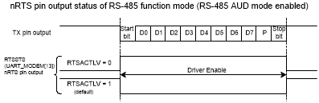

<strong>Note:</strong> RS485AUD(UART_ALTCTL[10]) = 1, the nRTS pin
output by hardware control only.
</th>
</tr>
</thead>
<tbody>
</tbody>
</table>

Figure 6.11‑14 RS-485
nRTS Driving Level in Auto Direction Mode

Figure 6.11‑15 demonstrates the RS-485 nRTS driving level in software
control (RS485AUD (UART_ALTCTL\[10\])=0). The nRTS driving level is
controlled by programing the RTS(UART_MODEM\[1\]) control bit.

Setting RTSACTLV (UART_MODEM\[9\]) can control the nRTS pin output is
inverse or non-inverse from RTS(UART_MODEM\[1\]) control bit. User can
read the RTSSTS (UART_MODEM\[13\]) bit to get real nRTS pin output
voltage logic status. The structure of RS-485 frame is shown in Figure
6.11‑16.

<table>
<caption>
Figure
6.11‑15 RS-485 nRTS Driving Level with Software Control
</caption>
<colgroup>
<col style="width: 100%" />
</colgroup>
<thead>
<tr>
<th style="text-align: center;">

<strong>Note:</strong> RS485AUD (UART_ALTCTL[10]) = 0, support nRTS
control bit by software control only.
</th>
</tr>
</thead>
<tbody>
</tbody>
</table>

Figure 6.11‑15 RS-485
nRTS Driving Level with Software Control

9.  1.  
    2.  
    3.  
    4.  
    5.  

<table>
<caption>
Figure
6.11‑16 Structure of RS-485 Frame
</caption>
<colgroup>
<col style="width: 100%" />
</colgroup>
<thead>
<tr>
<th style="text-align: center;">
Programming Sequence Example:Program
FUNCSEL (UART_FUNCSEL[2:0]) to select RS-485 function.Program the RXOFF
(UART_FIFO[8]) to determine enable or disable the receiver RS-485
receiver.Program the RS485NMM (UART_ALTCTL[8]) or RS485AAD
(UART_ALTCTL[9]) mode.If the RS485AAD (UART_ALTCTL[9]) mode is selected,
the ADDRMV (UART_ALTCTL[31:24]) is programmed for auto address match
value.Determine auto direction control by programming RS485AUD
(UART_ALTCTL[10]).

<strong>Note:</strong> RS485AUD(UART_ALTCTL[10]) must be set to 1,
and RTSACTLV(UART_MODEM[9]) must be set to 0.
</th>
</tr>
</thead>
<tbody>
</tbody>
</table>

Figure 6.11‑16 Structure
of RS-485 Frame

#### 

UART Single-wire Half DuplexThe UART controller provides single-wire
half duplex function in UART function mode (Setting UART_FUNCSEL\[2:0\]
to ‘100’ to enable the UART Single-wire function). The single-wire bus
keeps at RX state during the single-wire bus is idle. By writing data to
TX buffer DAT (UART_DAT\[7:0\]), the single wire transfers the bus state
to TX state immediately. After end of transmission, the single wire
transfer bus type from TX state to RX state.

To reduce the bus conflict problem, the UART controller supports flow
control and bit error detection. The nRTS is inactivated during the bus
keeping in TX state. The default state of the UART is RX mode, and the
UART only changes to TX mode to send data after the nCTS is inactivated
when ATOCTSEN (UART_INTEN\[13\]) is enabled. Under the TX state, the
UART controller will monitor bus state. If the bus state is not equal to
the UART controller TX state, the SWBEIF (UART_INTSTS\[16\]) will be
set.

**Note 1:** Before writing data to TX buffer, the bus state should be
checked in idle state by RXIDLE (UART_FIFOSTS\[29\]). And the bus
confliction may cause RX receive broken data.

**Note 2:** Single-wire does not support auto-flow control because the
nRTS is actived automatic during TX transmitted.

### 

Register Map**R**: read
only, **W**: write only, **R/W**: both read and write

<table style="width:100%;">
<colgroup>
<col style="width: 20%" />
<col style="width: 19%" />
<col style="width: 6%" />
<col style="width: 39%" />
<col style="width: 15%" />
</colgroup>
<tbody>
<tr>
<td><strong>Register</strong></td>
<td><strong>Offset</strong></td>
<td><strong>R/W</strong></td>
<td><strong>Description</strong></td>
<td><strong>Reset Value</strong></td>
</tr>
<tr>
<td colspan="5" style="text-align: left;">
<strong>UART Base
Address:</strong>

<strong>UARTx_BA = 0x4007_0000 + (0x1000 * x)</strong>

<strong>x=0,1</strong>
</td>
</tr>
<tr>
<td>
<strong>UART_DAT</strong>

<strong>x=0,1</strong>
</td>
<td>UARTx_BA+0x00</td>
<td>R/W</td>
<td>UART Receive/Transmit Buffer Register</td>
<td>0x0000_0000</td>
</tr>
<tr>
<td>
<strong>UART_INTEN</strong>

<strong>x=0,1</strong>
</td>
<td>UARTx_BA+0x04</td>
<td>R/W</td>
<td>UART Interrupt Enable Register</td>
<td>0x0000_0000</td>
</tr>
<tr>
<td>
<strong>UART_FIFO</strong>

<strong>x=0,1</strong>
</td>
<td>UARTx_BA+0x08</td>
<td>R/W</td>
<td>UART FIFO Control Register</td>
<td>0x0000_0101</td>
</tr>
<tr>
<td>
<strong>UART_LINE</strong>

<strong>x=0,1</strong>
</td>
<td>UARTx_BA+0x0C</td>
<td>R/W</td>
<td>UART Line Control Register</td>
<td>0x0000_0000</td>
</tr>
<tr>
<td>
<strong>UART_MODEM</strong>

<strong>x=0,1</strong>
</td>
<td>UARTx_BA+0x10</td>
<td>R/W</td>
<td>UART Modem Control Register</td>
<td>0x0000_0200</td>
</tr>
<tr>
<td>
<strong>UART_MODEMSTS</strong>

<strong>x=0,1</strong>
</td>
<td>UARTx_BA+0x14</td>
<td>R/W</td>
<td>UART Modem Status Register</td>
<td>0x0000_0110</td>
</tr>
<tr>
<td>
<strong>UART_FIFOSTS</strong>

<strong>x=0,1</strong>
</td>
<td>UARTx_BA+0x18</td>
<td>R/W</td>
<td>UART FIFO Status Register</td>
<td>0xB040_4000</td>
</tr>
<tr>
<td>
<strong>UART_INTSTS</strong>

<strong>x=0,1</strong>
</td>
<td>UARTx_BA+0x1C</td>
<td>R/W</td>
<td>UART Interrupt Status Register</td>
<td>0x0040_0002</td>
</tr>
<tr>
<td>
<strong>UART_TOUT</strong>

<strong>x=0,1</strong>
</td>
<td>UARTx_BA+0x20</td>
<td>R/W</td>
<td>UART Time-out Register</td>
<td>0x0000_0000</td>
</tr>
<tr>
<td>
<strong>UART_BAUD</strong>

<strong>x=0,1</strong>
</td>
<td>UARTx_BA+0x24</td>
<td>R/W</td>
<td>UART Baud Rate Divider Register</td>
<td>0x0F00_0000</td>
</tr>
<tr>
<td>
<strong>UART_IRDA</strong>

<strong>x=0,1</strong>
</td>
<td>UARTx_BA+0x28</td>
<td>R/W</td>
<td>UART IrDA Control Register</td>
<td>0x0000_0040</td>
</tr>
<tr>
<td>
<strong>UART_ALTCTL</strong>

<strong>x=0,1</strong>
</td>
<td>UARTx_BA+0x2C</td>
<td>R/W</td>
<td>UART Alternate Control/Status Register</td>
<td>0x0000_000C</td>
</tr>
<tr>
<td>
<strong>UART_FUNCSEL</strong>

<strong>x=0,1</strong>
</td>
<td>UARTx_BA+0x30</td>
<td>R/W</td>
<td>UART Function Select Register</td>
<td>0x0000_0000</td>
</tr>
<tr>
<td>
<strong>UART_BRCOMP</strong>

<strong>x=0,1</strong>
</td>
<td>UARTx_BA+0x3C</td>
<td>R/W</td>
<td>UART Baud Rate Compensation Register</td>
<td>0x0000_0000</td>
</tr>
<tr>
<td>
<strong>UART_WKCTL</strong>

<strong>x=0,1</strong>
</td>
<td>UARTx_BA+0x40</td>
<td>R/W</td>
<td>UART Wake-up Control Register</td>
<td>0x0000_0000</td>
</tr>
<tr>
<td>
<strong>UART_WKSTS</strong>

<strong>x=0,1</strong>
</td>
<td>UARTx_BA+0x44</td>
<td>R/W</td>
<td>UART Wake-up Status Register</td>
<td>0x0000_0000</td>
</tr>
<tr>
<td>
<strong>UART_DWKCOMP</strong>

<strong>x=0,1</strong>
</td>
<td>UARTx_BA+0x48</td>
<td>R/W</td>
<td>UART Incoming Data Wake-up Compensation Register</td>
<td>0x0000_0000</td>
</tr>
</tbody>
</table>

### 

##### Register DescriptionUART Receive/Transmit Buffer Register (UART_DAT) 

<table>
<colgroup>
<col style="width: 13%" />
<col style="width: 16%" />
<col style="width: 5%" />
<col style="width: 50%" />
<col style="width: 13%" />
</colgroup>
<tbody>
<tr>
<td><strong>Register</strong></td>
<td><strong>Offset</strong></td>
<td><strong>R/W</strong></td>
<td><strong>Description</strong></td>
<td><strong>Reset Value</strong></td>
</tr>
<tr>
<td>
<strong>UART_DAT</strong>

<strong>x=0,1</strong>
</td>
<td>UARTx_BA+0x00</td>
<td>R/W</td>
<td>UART Receive/Transmit Buffer Register</td>
<td>0x0000_0000</td>
</tr>
</tbody>
</table>

|              |        |        |        |        |        |        |            |
|:------------:|:------:|:------:|:------:|:------:|:------:|:------:|:----------:|
|    **31**    | **30** | **29** | **28** | **27** | **26** | **25** |   **24**   |
| **Reserved** |        |        |        |        |        |        |            |
|    **23**    | **22** | **21** | **20** | **19** | **18** | **17** |   **16**   |
| **Reserved** |        |        |        |        |        |        |            |
|    **15**    | **14** | **13** | **12** | **11** | **10** | **9**  |   **8**    |
| **Reserved** |        |        |        |        |        |        | **PARITY** |
|    **7**     | **6**  | **5**  | **4**  | **3**  | **2**  | **1**  |   **0**    |
|   **DAT**    |        |        |        |        |        |        |            |

<table>
<colgroup>
<col style="width: 12%" />
<col style="width: 16%" />
<col style="width: 71%" />
</colgroup>
<tbody>
<tr>
<td><strong>Bits</strong></td>
<td colspan="2"><strong>Description</strong></td>
</tr>
<tr>
<td>[31:9]</td>
<td><strong>Reserved</strong></td>
<td>Reserved.</td>
</tr>
<tr>
<td>[8]</td>
<td><strong>PARITY</strong></td>
<td>
<strong>Parity Bit Receive/Transmit Buffer</strong>

Write Operation:

By writing to this bit, the parity bit will be stored in transmitter
FIFO. If PBE (UART_LINE[3]) and PSS (UART_LINE[7]) are set, the UART
controller will send out this bit follow the DAT (UART_DAT[7:0]) through
the UART_TXD.

Read Operation:

If PBE (UART_LINE[3]) and PSS (UART_LINE[7]) are enabled, the parity
bit can be read by this bit.

<strong>Note:</strong> This bit has effect only when PBE
(UART_LINE[3]) and PSS (UART_LINE[7]) are set.
</td>
</tr>
<tr>
<td>[7:0]</td>
<td><strong>DAT</strong></td>
<td>
<strong>Data Receive/Transmit Buffer</strong>

Write Operation:

By writing one byte to this register, the data byte will be stored in
transmitter FIFO. The UART controller will send out the data stored in
transmitter FIFO top location through the UART_TXD.

Read Operation:

By reading this register, the UART controller will return an 8-bit
data received from receiver FIFO.
</td>
</tr>
</tbody>
</table>

##### UART Interrupt Enable Register (UART_INTEN) 

<table>
<colgroup>
<col style="width: 14%" />
<col style="width: 15%" />
<col style="width: 5%" />
<col style="width: 50%" />
<col style="width: 13%" />
</colgroup>
<tbody>
<tr>
<td><strong>Register</strong></td>
<td><strong>Offset</strong></td>
<td><strong>R/W</strong></td>
<td><strong>Description</strong></td>
<td><strong>Reset Value</strong></td>
</tr>
<tr>
<td>
<strong>UART_INTEN</strong>

<strong>x=0,1</strong>
</td>
<td>UARTx_BA+0x04</td>
<td>R/W</td>
<td>UART Interrupt Enable Register</td>
<td>0x0000_0000</td>
</tr>
</tbody>
</table>

|  |  |  |  |  |  |  |  |
|:--:|:--:|:--:|:--:|:--:|:--:|:--:|:--:|
| **31** | **30** | **29** | **28** | **27** | **26** | **25** | **24** |
| **Reserved** |  |  |  |  |  |  |  |
| **23** | **22** | **21** | **20** | **19** | **18** | **17** | **16** |
| **Reserved** | **TXENDIEN** | **Reserved** |  |  | **ABRIEN** | **Reserved** | **SWBEIEN** |
| **15** | **14** | **13** | **12** | **11** | **10** | **9** | **8** |
| **Reserved** | **Reserved** | **ATOCTSEN** | **ATORTSEN** | **TOCNTEN** | **Reserved** |  | **Reserved** |
| **7** | **6** | **5** | **4** | **3** | **2** | **1** | **0** |
| **Reserved** | **WKIEN** | **BUFERRIEN** | **RXTOIEN** | **MODEMIEN** | **RLSIEN** | **THREIEN** | **RDAIEN** |

<table>
<colgroup>
<col style="width: 12%" />
<col style="width: 16%" />
<col style="width: 71%" />
</colgroup>
<tbody>
<tr>
<td><strong>Bits</strong></td>
<td colspan="2"><strong>Description</strong></td>
</tr>
<tr>
<td>[31:23]</td>
<td><strong>Reserved</strong></td>
<td>Reserved.</td>
</tr>
<tr>
<td>[22]</td>
<td><strong>TXENDIEN</strong></td>
<td>
<strong>Transmitter Empty Interrupt Enable Bit</strong>

If TXENDIEN (UART_INTEN[22]) is enabled, the Transmitter Empty
interrupt TXENDINT (UART_INTSTS[30]) will be generated when TXENDIF
(UART_INTSTS[22]) is set (TX FIFO (UART_DAT) is empty and the STOP bit
of the last byte has been transmitted).

0 = Transmitter empty interrupt Disabled.

1 = Transmitter empty interrupt Enabled.
</td>
</tr>
<tr>
<td>[21:19]</td>
<td><strong>Reserved</strong></td>
<td>Reserved.</td>
</tr>
<tr>
<td>[18]</td>
<td><strong>ABRIEN</strong></td>
<td>
<strong>Auto-baud Rate Interrupt Enable Bit</strong>

0 = Auto-baud rate interrupt Disabled.

1 = Auto-baud rate interrupt Enabled.
</td>
</tr>
<tr>
<td>[17]</td>
<td><strong>Reserved</strong></td>
<td>Reserved.</td>
</tr>
<tr>
<td>[16]</td>
<td><strong>SWBEIEN</strong></td>
<td>
<strong>Single-wire Bit Error Detection Interrupt Enable
Bit</strong>

Set this bit, the Single-wire Half Duplex Bit Error Detection
Interrupt SWBEINT(UART_INTSTS[24]) is generated when Single-wire Bit
Error Detection SWBEIF(UART_INTSTS[16]) is set.

0 = Single-wire Bit Error Detect Interrupt Disabled.

1 = Single-wire Bit Error Detect Interrupt Enabled.

<strong>Note:</strong> This bit is valid when FUNCSEL
(UART_FUNCSEL[2:0]) is select UART Single-wire mode.
</td>
</tr>
<tr>
<td>[15]</td>
<td><strong>Reserved</strong></td>
<td>Reserved.</td>
</tr>
<tr>
<td>[14]</td>
<td><strong>Reserved</strong></td>
<td>Reserved.</td>
</tr>
<tr>
<td>[13]</td>
<td><strong>ATOCTSEN</strong></td>
<td>
<strong>nCTS Auto-flow Control Enable Bit</strong>

0 = nCTS auto-flow control Disabled.

1 = nCTS auto-flow control Enabled.

<strong>Note:</strong> When nCTS auto-flow is enabled, the UART will
send data to external device if nCTS input assert (UART will not send
data to device until nCTS is asserted).
</td>
</tr>
<tr>
<td>[12]</td>
<td><strong>ATORTSEN</strong></td>
<td>
<strong>nRTS Auto-flow Control Enable Bit</strong>

0 = nRTS auto-flow control Disabled.

1 = nRTS auto-flow control Enabled.

<strong>Note:</strong> When nRTS auto-flow is enabled, if the number
of bytes in the RX FIFO equals the RTSTRGLV (UART_FIFO[19:16]), the UART
will de-assert nRTS signal.
</td>
</tr>
<tr>
<td>[11]</td>
<td><strong>TOCNTEN</strong></td>
<td>
<strong>Receive Buffer Time-out Counter Enable Bit</strong>

0 = Receive Buffer Time-out counter Disabled.

1 = Receive Buffer Time-out counter Enabled.
</td>
</tr>
<tr>
<td>[10:9]</td>
<td><strong>Reserved</strong></td>
<td>Reserved.</td>
</tr>
<tr>
<td>[8]</td>
<td><strong>Reserved</strong></td>
<td>Reserved.</td>
</tr>
<tr>
<td>[7]</td>
<td><strong>Reserved</strong></td>
<td>Reserved.</td>
</tr>
<tr>
<td>[6]</td>
<td><strong>WKIEN</strong></td>
<td>
<strong>Wake-up Interrupt Enable Bit</strong>

0 = Wake-up Interrupt Disabled.

1 = Wake-up Interrupt Enabled.
</td>
</tr>
<tr>
<td>[5]</td>
<td><strong>BUFERRIEN</strong></td>
<td>
<strong>Buffer Error Interrupt Enable Bit</strong>

0 = Buffer error interrupt Disabled.

1 = Buffer error interrupt Enabled.
</td>
</tr>
<tr>
<td>[4]</td>
<td><strong>RXTOIEN</strong></td>
<td>
<strong>RX Time-out Interrupt Enable Bit</strong>

0 = RX time-out interrupt Disabled.

1 = RX time-out interrupt Enabled.
</td>
</tr>
<tr>
<td>[3]</td>
<td><strong>MODEMIEN</strong></td>
<td>
<strong>Modem Status Interrupt Enable Bit</strong>

0 = Modem status interrupt Disabled.

1 = Modem status interrupt Enabled.
</td>
</tr>
<tr>
<td>[2]</td>
<td><strong>RLSIEN</strong></td>
<td>
<strong>Receive Line Status Interrupt Enable Bit</strong>

0 = Receive Line Status interrupt Disabled.

1 = Receive Line Status interrupt Enabled.
</td>
</tr>
<tr>
<td>[1]</td>
<td><strong>THREIEN</strong></td>
<td>
<strong>Transmit Holding Register Empty Interrupt Enable
Bit</strong>

0 = Transmit holding register empty interrupt Disabled.

1 = Transmit holding register empty interrupt Enabled.
</td>
</tr>
<tr>
<td>[0]</td>
<td><strong>RDAIEN</strong></td>
<td>
<strong>Receive Data Available Interrupt Enable Bit</strong>

0 = Receive data available interrupt Disabled.

1 = Receive data available interrupt Enabled.
</td>
</tr>
</tbody>
</table>

##### UART FIFO Control Register (UART_FIFO) 

<table>
<colgroup>
<col style="width: 14%" />
<col style="width: 16%" />
<col style="width: 5%" />
<col style="width: 50%" />
<col style="width: 13%" />
</colgroup>
<tbody>
<tr>
<td><strong>Register</strong></td>
<td><strong>Offset</strong></td>
<td><strong>R/W</strong></td>
<td><strong>Description</strong></td>
<td><strong>Reset Value</strong></td>
</tr>
<tr>
<td>
<strong>UART_FIFO</strong>

<strong>x=0,1</strong>
</td>
<td>UARTx_BA+0x08</td>
<td>R/W</td>
<td>UART FIFO Control Register</td>
<td>0x0000_0101</td>
</tr>
</tbody>
</table>

|              |        |        |        |              |           |           |              |
|:------------:|:------:|:------:|:------:|:------------:|:---------:|:---------:|:------------:|
|    **31**    | **30** | **29** | **28** |    **27**    |  **26**   |  **25**   |    **24**    |
| **Reserved** |        |        |        |              |           |           |              |
|    **23**    | **22** | **21** | **20** |    **19**    |  **18**   |  **17**   |    **16**    |
| **Reserved** |        |        |        | **RTSTRGLV** |           |           |              |
|    **15**    | **14** | **13** | **12** |    **11**    |  **10**   |   **9**   |    **8**     |
| **Reserved** |        |        |        |              |           |           |  **RXOFF**   |
|    **7**     | **6**  | **5**  | **4**  |    **3**     |   **2**   |   **1**   |    **0**     |
|  **RFITL**   |        |        |        | **Reserved** | **TXRST** | **RXRST** | **Reserved** |

<table>
<colgroup>
<col style="width: 12%" />
<col style="width: 15%" />
<col style="width: 71%" />
</colgroup>
<tbody>
<tr>
<td><strong>Bits</strong></td>
<td colspan="2"><strong>Description</strong></td>
</tr>
<tr>
<td>[31:20]</td>
<td><strong>Reserved</strong></td>
<td>Reserved.</td>
</tr>
<tr>
<td>[19:16]</td>
<td><strong>RTSTRGLV</strong></td>
<td>
<strong>nRTS Trigger Level for Auto-flow Control</strong>

0000 = nRTS Trigger Level is 1 byte.

0001 = nRTS Trigger Level is 4 bytes.

0010 = nRTS Trigger Level is 8 bytes.

0011 = nRTS Trigger Level is 14 bytes.

Others = Reserved.

<strong>Note:</strong> This field is used for auto nRTS flow
control.
</td>
</tr>
<tr>
<td>[15:9]</td>
<td><strong>Reserved</strong></td>
<td>Reserved.</td>
</tr>
<tr>
<td>[8]</td>
<td><strong>RXOFF</strong></td>
<td>
<strong>Receiver Disable Bit</strong>

The receiver is disabled or not (set 1 to disable receiver).

0 = Receiver Enabled.

1 = Receiver Disabled.

<strong>Note:</strong> This bit is used for RS-485 Normal Multi-drop
mode. It should be programmed before RS485NMM (UART_ALTCTL [8]) is
programmed.
</td>
</tr>
<tr>
<td>[7:4]</td>
<td><strong>RFITL</strong></td>
<td>
<strong>RX FIFO Interrupt Trigger Level</strong>

When the number of bytes in the receive FIFO equals the RFITL, the
RDAIF (UART_INTSTS[0]) will be set (if RDAIEN (UART_INTEN [0]) enabled,
and an interrupt will be generated).

0000 = RX FIFO Interrupt Trigger Level is 1 byte.

0001 = RX FIFO Interrupt Trigger Level is 4 bytes.

0010 = RX FIFO Interrupt Trigger Level is 8 bytes.

0011 = RX FIFO Interrupt Trigger Level is 14 bytes.

Others = Reserved.
</td>
</tr>
<tr>
<td>[3]</td>
<td><strong>Reserved</strong></td>
<td>Reserved.</td>
</tr>
<tr>
<td>[2]</td>
<td><strong>TXRST</strong></td>
<td>
<strong>TX Field Software Reset</strong>

When TXRST (UART_FIFO[2]) is set, all the byte in the transmit FIFO
and TX internal state machine are cleared.

0 = No effect.

1 = Reset the TX internal state machine and pointers.

<strong>Note 1:</strong> This bit will automatically clear at least 3
UART peripheral clock cycles.

<strong>Note 2:</strong> Before setting this bit, it should wait for
the TXEMPTYF (UART_FIFOSTS[28]) be set.
</td>
</tr>
<tr>
<td>[1]</td>
<td><strong>RXRST</strong></td>
<td>
<strong>RX Field Software Reset</strong>

When RXRST (UART_FIFO[1]) is set, all the byte in the receiver FIFO
and RX internal state machine are cleared.

0 = No effect.

1 = Reset the RX internal state machine and pointers.

<strong>Note 1:</strong> This bit will automatically clear at least 3
UART peripheral clock cycles.

<strong>Note 2:</strong> Before setting this bit, it should wait for
the RXIDLE (UART_FIFOSTS[29]) be set.
</td>
</tr>
<tr>
<td>[0]</td>
<td><strong>Reserved</strong></td>
<td>Reserved.</td>
</tr>
</tbody>
</table>

##### UART Line Control Register (UART_LINE) 

<table>
<colgroup>
<col style="width: 14%" />
<col style="width: 16%" />
<col style="width: 5%" />
<col style="width: 50%" />
<col style="width: 13%" />
</colgroup>
<tbody>
<tr>
<td><strong>Register</strong></td>
<td><strong>Offset</strong></td>
<td><strong>R/W</strong></td>
<td><strong>Description</strong></td>
<td><strong>Reset Value</strong></td>
</tr>
<tr>
<td>
<strong>UART_LINE</strong>

<strong>x=0,1</strong>
</td>
<td>UARTx_BA+0x0C</td>
<td>R/W</td>
<td>UART Line Control Register</td>
<td>0x0000_0000</td>
</tr>
</tbody>
</table>

|              |         |         |         |         |         |            |            |
|:------------:|:-------:|:-------:|:-------:|:-------:|:-------:|:----------:|:----------:|
|    **31**    | **30**  | **29**  | **28**  | **27**  | **26**  |   **25**   |   **24**   |
| **Reserved** |         |         |         |         |         |            |            |
|    **23**    | **22**  | **21**  | **20**  | **19**  | **18**  |   **17**   |   **16**   |
| **Reserved** |         |         |         |         |         |            |            |
|    **15**    | **14**  | **13**  | **12**  | **11**  | **10**  |   **9**    |   **8**    |
| **Reserved** |         |         |         |         |         | **RXDINV** | **TXDINV** |
|    **7**     |  **6**  |  **5**  |  **4**  |  **3**  |  **2**  |   **1**    |   **0**    |
|   **PSS**    | **BCB** | **SPE** | **EPE** | **PBE** | **NSB** |  **WLS**   |            |

<table>
<colgroup>
<col style="width: 12%" />
<col style="width: 15%" />
<col style="width: 71%" />
</colgroup>
<tbody>
<tr>
<td><strong>Bits</strong></td>
<td colspan="2"><strong>Description</strong></td>
</tr>
<tr>
<td>[31:10]</td>
<td><strong>Reserved</strong></td>
<td>Reserved.</td>
</tr>
<tr>
<td>[9]</td>
<td><strong>RXDINV</strong></td>
<td>
<strong>RX Data Inverted</strong>

0 = Received data signal inverted Disabled.

1 = Received data signal inverted Enabled.

<strong>Note 1:</strong> Before setting this bit, TXRXDIS
(UART_FUNCSEL[3]) should be set then waited for TXRXACT
(UART_FIFOSTS[31]) is cleared. When the configuration is done, cleared
TXRXDIS (UART_FUNCSEL[3]) to activate UART controller.

<strong>Note 2:</strong> This bit is valid when FUNCSEL
(UART_FUNCSEL[2:0]) is select UART or RS485 function.
</td>
</tr>
<tr>
<td>[8]</td>
<td><strong>TXDINV</strong></td>
<td>
<strong>TX Data Inverted</strong>

0 = Transmitted data signal inverted Disabled.

1 = Transmitted data signal inverted Enabled.

<strong>Note 1:</strong> Before setting this bit, TXRXDIS
(UART_FUNCSEL[3]) should be set then waited for TXRXACT
(UART_FIFOSTS[31]) is cleared. When the configuration is done, cleared
TXRXDIS (UART_FUNCSEL[3]) to activate UART controller.

<strong>Note 2:</strong> This bit is valid when FUNCSEL
(UART_FUNCSEL[2:0]) is select UART or RS485 function.
</td>
</tr>
<tr>
<td>[7]</td>
<td><strong>PSS</strong></td>
<td>
<strong>Parity Bit Source Selection</strong>

The parity bit can be selected to be generated and checked
automatically or by software.

0 = Parity bit is generated by EPE (UART_LINE[4]) and SPE
(UART_LINE[5]) setting and checked automatically.

1 = Parity bit generated and checked by software.

<strong>Note 1:</strong> This bit has effect only when PBE
(UART_LINE[3]) is set.

<strong>Note 2:</strong> If PSS is 0, the parity bit is transmitted
and checked automatically. If PSS is 1, the transmitted parity bit value
can be determined by writing PARITY (UART_DAT[8]) and the parity bit can
be read by reading PARITY (UART_DAT[8]).
</td>
</tr>
<tr>
<td>[6]</td>
<td><strong>BCB</strong></td>
<td>
<strong>Break Control Bit</strong>

0 = Break Control Disabled.

1 = Break Control Enabled.

<strong>Note:</strong> When this bit is set to logic 1, the
transmitted serial data output (TX) is forced to the Spacing State
(logic 0). This bit acts only on TX line and has no effect on the
transmitter logic.
</td>
</tr>
<tr>
<td>[5]</td>
<td><strong>SPE</strong></td>
<td>
<strong>Stick Parity Enable Bit</strong>

0 = Stick parity Disabled.

1 = Stick parity Enabled.

<strong>Note:</strong> If PBE (UART_LINE[3]) and EPE (UART_LINE[4])
are logic 1, the parity bit is transmitted and checked as logic 0. If
PBE (UART_LINE[3]) is 1 and EPE (UART_LINE[4]) is 0 then the parity bit
is transmitted and checked as 1.
</td>
</tr>
<tr>
<td>[4]</td>
<td><strong>EPE</strong></td>
<td>
<strong>Even Parity Enable Bit</strong>

0 = Odd number of logic 1’s is transmitted and checked in each
word.

1 = Even number of logic 1’s is transmitted and checked in each
word.

<strong>Note:</strong> This bit has effect only when PBE
(UART_LINE[3]) is set.
</td>
</tr>
<tr>
<td>[3]</td>
<td><strong>PBE</strong></td>
<td>
<strong>Parity Bit Enable Bit</strong>

0 = Parity bit generated Disabled.

1 = Parity bit generated Enabled.

<strong>Note:</strong> Parity bit is generated on each outgoing
character and is checked on each incoming data.
</td>
</tr>
<tr>
<td>[2]</td>
<td><strong>NSB</strong></td>
<td>
<strong>Number of “STOP Bit”</strong>

0 = One “STOP bit” is generated in the transmitted data.

1 = When select 5-bit word length, 1.5 “STOP bit” is generated in the
transmitted data. When select 6-, 7- and 8-bit word length, 2 “STOP bit”
is generated in the transmitted data.
</td>
</tr>
<tr>
<td>[1:0]</td>
<td><strong>WLS</strong></td>
<td>
<strong>Word Length Selection</strong>

This field sets UART word length.

00 = 5 bits.

01 = 6 bits.

10 = 7 bits.

11 = 8 bits.
</td>
</tr>
</tbody>
</table>

##### UART Modem Control Register (UART_MODEM) 

<table>
<colgroup>
<col style="width: 14%" />
<col style="width: 17%" />
<col style="width: 5%" />
<col style="width: 49%" />
<col style="width: 13%" />
</colgroup>
<tbody>
<tr>
<td><strong>Register</strong></td>
<td><strong>Offset</strong></td>
<td><strong>R/W</strong></td>
<td><strong>Description</strong></td>
<td><strong>Reset Value</strong></td>
</tr>
<tr>
<td>
<strong>UART_MODEM</strong>

<strong>x=0,1</strong>
</td>
<td>UARTx_BA+0x10</td>
<td>R/W</td>
<td>UART Modem Control Register</td>
<td>0x0000_0200</td>
</tr>
</tbody>
</table>

|  |  |  |  |  |  |  |  |
|:--:|:--:|:--:|:--:|:--:|:--:|:--:|:--:|
| **31** | **30** | **29** | **28** | **27** | **26** | **25** | **24** |
| **Reserved** |  |  |  |  |  |  |  |
| **23** | **22** | **21** | **20** | **19** | **18** | **17** | **16** |
| **Reserved** |  |  |  |  |  |  |  |
| **15** | **14** | **13** | **12** | **11** | **10** | **9** | **8** |
| **Reserved** |  | **RTSSTS** | **Reserved** |  |  | **RTSACTLV** | **Reserved** |
| **7** | **6** | **5** | **4** | **3** | **2** | **1** | **0** |
| **Reserved** |  |  |  |  |  | **RTS** | **Reserved** |

<table>
<colgroup>
<col style="width: 12%" />
<col style="width: 15%" />
<col style="width: 71%" />
</colgroup>
<tbody>
<tr>
<td><strong>Bits</strong></td>
<td colspan="2"><strong>Description</strong></td>
</tr>
<tr>
<td>[31:14]</td>
<td><strong>Reserved</strong></td>
<td>Reserved.</td>
</tr>
<tr>
<td>[13]</td>
<td><strong>RTSSTS</strong></td>
<td>
<strong>nRTS Pin Status (Read Only)</strong>

This bit mirror from nRTS pin output of voltage logic status.

0 = nRTS pin output is low level voltage logic state.

1 = nRTS pin output is high level voltage logic state.
</td>
</tr>
<tr>
<td>[12:10]</td>
<td><strong>Reserved</strong></td>
<td>Reserved.</td>
</tr>
<tr>
<td>[9]</td>
<td><strong>RTSACTLV</strong></td>
<td>
<strong>nRTS Pin Active Level</strong>

This bit defines the active level state of nRTS pin output.

0 = nRTS pin output is high level active.

1 = nRTS pin output is low level active. (Default)

<strong>Note 1:</strong> Refer to Figure 6.11‑10 and Figure 6.11‑11
for UART function mode.

<strong>Note 2:</strong> Refer to Figure 6.11‑14 and Figure 6.11‑15
for RS-485 function mode.

<strong>Note 3:</strong> Before setting this bit, TXRXDIS
(UART_FUNCSEL[3]) should be set then waited for TXRXACT
(UART_FIFOSTS[31]) is cleared. When the configuration is done, cleared
TXRXDIS (UART_FUNCSEL[3]) to activate UART controller.
</td>
</tr>
<tr>
<td>[8:2]</td>
<td><strong>Reserved</strong></td>
<td>Reserved.</td>
</tr>
<tr>
<td>[1]</td>
<td><strong>RTS</strong></td>
<td>
<strong>nRTS Signal Control</strong>

This bit is direct control internal nRTS (Request-To-Send) signal
active or not, and then drive the nRTS pin output with RTSACTLV bit
configuration.

0 = nRTS signal is active.

1 = nRTS signal is inactive.

<strong>Note 1:</strong> The nRTS signal control bit is not effective
when nRTS auto-flow control is enabled in UART function mode.

<strong>Note 2:</strong> The nRTS signal control bit is not effective
when RS-485 auto direction mode (AUD) is enabled in RS-485 function
mode.

<strong>Note 3:</strong> Single-wire mode is support this
feature.
</td>
</tr>
<tr>
<td>[0]</td>
<td><strong>Reserved</strong></td>
<td>Reserved.</td>
</tr>
</tbody>
</table>

##### UART Modem Status Register (UART_MODEMSTS) 

<table>
<colgroup>
<col style="width: 14%" />
<col style="width: 16%" />
<col style="width: 5%" />
<col style="width: 50%" />
<col style="width: 13%" />
</colgroup>
<tbody>
<tr>
<td><strong>Register</strong></td>
<td><strong>Offset</strong></td>
<td><strong>R/W</strong></td>
<td><strong>Description</strong></td>
<td><strong>Reset Value</strong></td>
</tr>
<tr>
<td>
<strong>UART_MODEMSTS</strong>

<strong>x=0,1</strong>
</td>
<td>UARTx_BA+0x14</td>
<td>R/W</td>
<td>UART Modem Status Register</td>
<td>0x0000_0110</td>
</tr>
</tbody>
</table>

|              |        |        |            |              |        |        |              |
|:------------:|:------:|:------:|:----------:|:------------:|:------:|:------:|:------------:|
|    **31**    | **30** | **29** |   **28**   |    **27**    | **26** | **25** |    **24**    |
| **Reserved** |        |        |            |              |        |        |              |
|    **23**    | **22** | **21** |   **20**   |    **19**    | **18** | **17** |    **16**    |
| **Reserved** |        |        |            |              |        |        |              |
|    **15**    | **14** | **13** |   **12**   |    **11**    | **10** | **9**  |    **8**     |
| **Reserved** |        |        |            |              |        |        | **CTSACTLV** |
|    **7**     | **6**  | **5**  |   **4**    |    **3**     | **2**  | **1**  |    **0**     |
| **Reserved** |        |        | **CTSSTS** | **Reserved** |        |        | **CTSDETF**  |

<table>
<colgroup>
<col style="width: 12%" />
<col style="width: 15%" />
<col style="width: 71%" />
</colgroup>
<tbody>
<tr>
<td><strong>Bits</strong></td>
<td colspan="2"><strong>Description</strong></td>
</tr>
<tr>
<td>[31:9]</td>
<td><strong>Reserved</strong></td>
<td>Reserved.</td>
</tr>
<tr>
<td>[8]</td>
<td><strong>CTSACTLV</strong></td>
<td>
<strong>nCTS Pin Active Level</strong>

This bit defines the active level state of nCTS pin input.

0 = nCTS pin input is high level active.

1 = nCTS pin input is low level active. (Default)

<strong>Note:</strong> Before setting this bit, TXRXDIS
(UART_FUNCSEL[3]) should be set then waited for TXRXACT
(UART_FIFOSTS[31]) is cleared. When the configuration is done, cleared
TXRXDIS (UART_FUNCSEL[3]) to activate UART controller.
</td>
</tr>
<tr>
<td>[7:5]</td>
<td><strong>Reserved</strong></td>
<td>Reserved.</td>
</tr>
<tr>
<td>[4]</td>
<td><strong>CTSSTS</strong></td>
<td>
<strong>nCTS Pin Status (Read Only)</strong>

This bit mirror from nCTS pin input of voltage logic status.

0 = nCTS pin input is low level voltage logic state.

1 = nCTS pin input is high level voltage logic state.

<strong>Note:</strong> This bit echoes when UART controller
peripheral clock is enabled, and nCTS multi-function port is
selected.
</td>
</tr>
<tr>
<td>[3:1]</td>
<td><strong>Reserved</strong></td>
<td>Reserved.</td>
</tr>
<tr>
<td>[0]</td>
<td><strong>CTSDETF</strong></td>
<td>
<strong>Detect nCTS State Change Flag</strong>

This bit is set whenever nCTS input has change state, and it will
generate Modem interrupt to CPU when MODEMIEN (UART_INTEN [3]) is set to
1.

0 = nCTS input has not change state.

1 = nCTS input has change state.

<strong>Note:</strong> This bit can be cleared by writing “1” to
it.
</td>
</tr>
</tbody>
</table>

##### UART FIFO Status Register (UART_FIFOSTS) 

<table>
<colgroup>
<col style="width: 14%" />
<col style="width: 16%" />
<col style="width: 5%" />
<col style="width: 49%" />
<col style="width: 13%" />
</colgroup>
<tbody>
<tr>
<td><strong>Register</strong></td>
<td><strong>Offset</strong></td>
<td><strong>R/W</strong></td>
<td><strong>Description</strong></td>
<td><strong>Reset Value</strong></td>
</tr>
<tr>
<td>
<strong>UART_FIFOSTS</strong>

<strong>x=0,1</strong>
</td>
<td>UARTx_BA+0x18</td>
<td>R/W</td>
<td>UART FIFO Status Register</td>
<td>0xB040_4000</td>
</tr>
</tbody>
</table>

|  |  |  |  |  |  |  |  |
|:--:|:--:|:--:|:--:|:--:|:--:|:--:|:--:|
| **31** | **30** | **29** | **28** | **27** | **26** | **25** | **24** |
| **TXRXACT** | **Reserved** | **RXIDLE** | **TXEMPTYF** | **Reserved** |  |  | **TXOVIF** |
| **23** | **22** | **21** | **20** | **19** | **18** | **17** | **16** |
| **TXFULL** | **TXEMPTY** | **TXPTR** |  |  |  |  |  |
| **15** | **14** | **13** | **12** | **11** | **10** | **9** | **8** |
| **RXFULL** | **RXEMPTY** | **RXPTR** |  |  |  |  |  |
| **7** | **6** | **5** | **4** | **3** | **2** | **1** | **0** |
| **Reserved** | **BIF** | **FEF** | **PEF** | **ADDRDETF** | **ABRDTOIF** | **ABRDIF** | **RXOVIF** |

<table>
<colgroup>
<col style="width: 12%" />
<col style="width: 17%" />
<col style="width: 70%" />
</colgroup>
<tbody>
<tr>
<td><strong>Bits</strong></td>
<td colspan="2"><strong>Description</strong></td>
</tr>
<tr>
<td>[31]</td>
<td><strong>TXRXACT</strong></td>
<td>
<strong>TX and RX Active Status (Read Only)</strong>

This bit indicates TX and RX are active or inactive.

0 = TX and RX are inactive.

1 = TX and RX are active. (Default)

<strong>Note:</strong> When TXRXDIS (UART_FUNCSEL[3]) is set and both
TX and RX are in idle state, this bit is cleared. The UART controller
cannot transmit or receive data at this moment. Otherwise this bit is
set.
</td>
</tr>
<tr>
<td>[30]</td>
<td><strong>Reserved</strong></td>
<td>Reserved.</td>
</tr>
<tr>
<td>[29]</td>
<td><strong>RXIDLE</strong></td>
<td>
<strong>RX Idle Status (Read Only)</strong>

This bit is set by hardware when RX is idle.

0 = RX is busy.

1 = RX is idle. (Default)
</td>
</tr>
<tr>
<td>[28]</td>
<td><strong>TXEMPTYF</strong></td>
<td>
<strong>Transmitter Empty Flag (Read Only)</strong>

This bit is set by hardware when TX FIFO (UART_DAT) is empty and the
STOP bit of the last byte has been transmitted.

0 = TX FIFO is not empty or the STOP bit of the last byte has been
not transmitted.

1 = TX FIFO is empty and the STOP bit of the last byte has been
transmitted.

<strong>Note:</strong> This bit is cleared automatically when TX FIFO
is not empty or the last byte transmission has not completed.
</td>
</tr>
<tr>
<td>[27:25]</td>
<td><strong>Reserved</strong></td>
<td>Reserved.</td>
</tr>
<tr>
<td>[24]</td>
<td><strong>TXOVIF</strong></td>
<td>
<strong>TX Overflow Error Interrupt Flag</strong>

If TX FIFO (UART_DAT) is full, an additional write to UART_DAT will
cause this bit to logic 1.

0 = TX FIFO is not overflow.

1 = TX FIFO is overflow.

<strong>Note:</strong> This bit can be cleared by writing “1” to
it.
</td>
</tr>
<tr>
<td>[23]</td>
<td><strong>TXFULL</strong></td>
<td>
<strong>Transmitter FIFO Full (Read Only)</strong>

This bit indicates TX FIFO full or not.

0 = TX FIFO is not full.

1 = TX FIFO is full.

<strong>Note:</strong> This bit is set when the number of usage in TX
FIFO Buffer is equal to 16, otherwise it is cleared by
hardware.
</td>
</tr>
<tr>
<td>[22]</td>
<td><strong>TXEMPTY</strong></td>
<td>
<strong>Transmitter FIFO Empty (Read Only)</strong>

This bit indicates TX FIFO empty or not.

0 = TX FIFO is not empty.

1 = TX FIFO is empty.

<strong>Note:</strong> When the last byte of TX FIFO has been
transferred to Transmitter Shift Register, hardware sets this bit high.
It will be cleared when writing data into UART_DAT (TX FIFO not
empty).
</td>
</tr>
<tr>
<td>[21:16]</td>
<td><strong>TXPTR</strong></td>
<td>
<strong>TX FIFO Pointer (Read Only)</strong>

This field indicates the TX FIFO Buffer Pointer. When CPU writes one
byte into UART_DAT, TXPTR increases one. When one byte of TX FIFO is
transferred to Transmitter Shift Register, TXPTR decreases one.

The Maximum value shown in TXPTR is 15. When the using level of TX
FIFO Buffer equal to 16, the TXFULL bit is set to 1 and TXPTR will show
0. As one byte of TX FIFO is transferred to Transmitter Shift Register,
the TXFULL bit is cleared to 0 and TXPTR will show 15.
</td>
</tr>
<tr>
<td>[15]</td>
<td><strong>RXFULL</strong></td>
<td>
<strong>Receiver FIFO Full (Read Only)</strong>

This bit initiates RX FIFO full or not.

0 = RX FIFO is not full.

1 = RX FIFO is full.

<strong>Note:</strong> This bit is set when the number of usage in RX
FIFO Buffer is equal to 16, otherwise it is cleared by
hardware.
</td>
</tr>
<tr>
<td>[14]</td>
<td><strong>RXEMPTY</strong></td>
<td>
<strong>Receiver FIFO Empty (Read Only)</strong>

This bit initiate RX FIFO empty or not.

0 = RX FIFO is not empty.

1 = RX FIFO is empty.

<strong>Note:</strong> When the last byte of RX FIFO has been read by
CPU, hardware sets this bit high. It will be cleared when UART receives
any new data.
</td>
</tr>
<tr>
<td>[13:8]</td>
<td><strong>RXPTR</strong></td>
<td>
<strong>RX FIFO Pointer (Read Only)</strong>

This field indicates the RX FIFO Buffer Pointer. When UART receives
one byte from external device, RXPTR increases one. When one byte of RX
FIFO is read by CPU, RXPTR decreases one.

The Maximum value shown in RXPTR is 15. When the using level of RX
FIFO Buffer equal to 16, the RXFULL bit is set to 1 and RXPTR will show
0. As one byte of RX FIFO is read by CPU, the RXFULL bit is cleared to 0
and RXPTR will show 15.
</td>
</tr>
<tr>
<td>[7]</td>
<td><strong>Reserved</strong></td>
<td>Reserved.</td>
</tr>
<tr>
<td>[6]</td>
<td><strong>BIF</strong></td>
<td>
<strong>Break Interrupt Flag</strong>

This bit is set to logic 1 whenever the received data input (RX) is
held in the “spacing state” (logic 0) for longer than a full word
transmission time (that is, the total time of “start bit” + data bits +
parity + stop bits).

0 = No Break interrupt is generated.

1 = Break interrupt is generated.

<strong>Note:</strong> This bit can be cleared by writing “1” to
it.
</td>
</tr>
<tr>
<td>[5]</td>
<td><strong>FEF</strong></td>
<td>
<strong>Framing Error Flag</strong>

This bit is set to logic 1 whenever the received character does not
have a valid “stop bit” (that is, the stop bit following the last data
bit or parity bit is detected as logic 0).

0 = No framing error is generated.

1 = Framing error is generated.

<strong>Note:</strong> This bit can be cleared by writing “1” to
it.
</td>
</tr>
<tr>
<td>[4]</td>
<td><strong>PEF</strong></td>
<td>
<strong>Parity Error Flag</strong>

This bit is set to logic 1 whenever the received character does not
have a valid “parity bit”.

0 = No parity error is generated.

1 = Parity error is generated.

<strong>Note:</strong> This bit can be cleared by writing “1” to
it.
</td>
</tr>
<tr>
<td>[3]</td>
<td><strong>ADDRDETF</strong></td>
<td>
<strong>RS-485 Address Byte Detect Flag</strong>

0 = Receiver detects a data that is not an address bit (bit 9
=’0’).

1 = Receiver detects a data that is an address bit (bit 9 =’1’).

<strong>Note 1:</strong> This field is used for RS-485 function mode
and ADDRDEN (UART_ALTCTL[15]) is set to 1 to enable Address detection
mode.

<strong>Note 2:</strong> This bit can be cleared by writing “1” to
it.
</td>
</tr>
<tr>
<td>[2]</td>
<td><strong>ABRDTOIF</strong></td>
<td>
<strong>Auto-baud Rate Detect Time-out Interrupt
Flag</strong>

This bit is set to logic “1” in Auto-baud Rate Detect mode when the
baud rate counter is overflow.

0 = Auto-baud rate counter is underflow.

1 = Auto-baud rate counter is overflow.

<strong>Note:</strong> This bit can be cleared by writing “1” to
it.
</td>
</tr>
<tr>
<td>[1]</td>
<td><strong>ABRDIF</strong></td>
<td>
<strong>Auto-baud Rate Detect Interrupt Flag</strong>

This bit is set to logic “1” when auto-baud rate detect function is
finished.

0 = Auto-baud rate detect function is not finished.

1 = Auto-baud rate detect function is finished.

<strong>Note:</strong> This bit can be cleared by writing “1” to
it.
</td>
</tr>
<tr>
<td>[0]</td>
<td><strong>RXOVIF</strong></td>
<td>
<strong>RX Overflow Error Interrupt Flag</strong>

This bit is set when RX FIFO overflow.

If the number of bytes of received data is greater than RX_FIFO
(UART_DAT) size 16 bytes, this bit will be set.

0 = RX FIFO is not overflow.

1 = RX FIFO is overflow.

<strong>Note:</strong> This bit can be cleared by writing “1” to
it.
</td>
</tr>
</tbody>
</table>

##### UART Interrupt Status Register (UART_INTSTS) 

<table>
<colgroup>
<col style="width: 14%" />
<col style="width: 16%" />
<col style="width: 5%" />
<col style="width: 49%" />
<col style="width: 13%" />
</colgroup>
<tbody>
<tr>
<td><strong>Register</strong></td>
<td><strong>Offset</strong></td>
<td><strong>R/W</strong></td>
<td><strong>Description</strong></td>
<td><strong>Reset Value</strong></td>
</tr>
<tr>
<td>
<strong>UART_INTSTS</strong>

<strong>x=0,1</strong>
</td>
<td>UARTx_BA+0x1C</td>
<td>R/W</td>
<td>UART Interrupt Status Register</td>
<td>0x0040_0002</td>
</tr>
</tbody>
</table>

|  |  |  |  |  |  |  |  |
|:--:|:--:|:--:|:--:|:--:|:--:|:--:|:--:|
| **31** | **30** | **29** | **28** | **27** | **26** | **25** | **24** |
| **ABRINT** | **TXENDINT** | **Reserved** |  |  |  |  | **SWBEINT** |
| **23** | **22** | **21** | **20** | **19** | **18** | **17** | **16** |
| **Reserved** | **TXENDIF** | **Reserved** |  |  |  |  | **SWBEIF** |
| **15** | **14** | **13** | **12** | **11** | **10** | **9** | **8** |
| **Reserved** | **WKINT** | **BUFERRINT** | **RXTOINT** | **MODEMINT** | **RLSINT** | **THREINT** | **RDAINT** |
| **7** | **6** | **5** | **4** | **3** | **2** | **1** | **0** |
| **Reserved** | **WKIF** | **BUFERRIF** | **RXTOIF** | **MODEMIF** | **RLSIF** | **THREIF** | **RDAIF** |

<table>
<colgroup>
<col style="width: 12%" />
<col style="width: 17%" />
<col style="width: 70%" />
</colgroup>
<tbody>
<tr>
<td><strong>Bits</strong></td>
<td colspan="2"><strong>Description</strong></td>
</tr>
<tr>
<td>[31]</td>
<td><strong>ABRINT</strong></td>
<td>
<strong>Auto-baud Rate Interrupt Indicator (Read
Only)</strong>

This bit is set if ABRIEN (UART_INTEN[18]) and ABRIF
(UART_ALTCTL[17]) are both set to 1.

0 = No Auto-baud Rate interrupt is generated.

1 = The Auto-baud Rate interrupt is generated.
</td>
</tr>
<tr>
<td>[30]</td>
<td><strong>TXENDINT</strong></td>
<td>
<strong>Transmitter Empty Interrupt Indicator (Read
Only)</strong>

This bit is set if TXENDIEN (UART_INTEN[22]) and
TXENDIF(UART_INTSTS[22]) are both set to 1.

0 = No Transmitter Empty interrupt is generated.

1 = Transmitter Empty interrupt is generated.
</td>
</tr>
<tr>
<td>[29:25]</td>
<td><strong>Reserved</strong></td>
<td>Reserved.</td>
</tr>
<tr>
<td>[24]</td>
<td><strong>SWBEINT</strong></td>
<td>
<strong>Single-wire Bit Error Detect Interrupt Indicator (Read
Only)</strong>

This bit is set if SWBEIEN (UART_INTEN[16]) and SWBEIF
(UART_INTSTS[16]) are both set to 1.

0 = No Single-wire Bit Error Detection Interrupt generated.

1 = Single-wire Bit Error Detection Interrupt generated.
</td>
</tr>
<tr>
<td>[23]</td>
<td><strong>Reserved</strong></td>
<td>Reserved.</td>
</tr>
<tr>
<td>[22]</td>
<td><strong>TXENDIF</strong></td>
<td>
<strong>Transmitter Empty Interrupt Flag</strong>

This bit is set when TX FIFO (UART_DAT) is empty and the STOP bit of
the last byte has been transmitted (TXEMPTYF (UART_FIFOSTS[28]) is set).
If TXENDIEN (UART_INTEN[22]) is enabled, the Transmitter Empty interrupt
will be generated.

0 = No transmitter empty interrupt flag is generated.

1 = Transmitter empty interrupt flag is generated.

<strong>Note:</strong> This bit is cleared automatically when TX FIFO
is not empty or the last byte transmission has not completed.
</td>
</tr>
<tr>
<td>[21:17]</td>
<td><strong>Reserved</strong></td>
<td>Reserved.</td>
</tr>
<tr>
<td>[16]</td>
<td><strong>SWBEIF</strong></td>
<td>
<strong>Single-wire Bit Error Detection Interrupt
Flag</strong>

This bit is set when the single wire bus state not equals to UART
controller TX state in Single-wire mode.

0 = No single-wire bit error detection interrupt flag is
generated.

1 = Single-wire bit error detection interrupt flag is generated.

<strong>Note 1:</strong> This bit is active when FUNCSEL
(UART_FUNCSEL[2:0]) is select UART Single-wire mode.

<strong>Note 2:</strong> This bit can be cleared by writing “1” to
it.
</td>
</tr>
<tr>
<td>[15]</td>
<td><strong>Reserved</strong></td>
<td style="text-align: left;">Reserved.</td>
</tr>
<tr>
<td>[14]</td>
<td><strong>WKINT</strong></td>
<td>
<strong>UART Wake-up Interrupt Indicator (Read Only)</strong>

This bit is set if WKIEN (UART_INTEN[6]) and WKIF (UART_INTSTS[6])
are both set to 1.

0 = No UART wake-up interrupt is generated.

1 = UART wake-up interrupt is generated.
</td>
</tr>
<tr>
<td>[13]</td>
<td><strong>BUFERRINT</strong></td>
<td>
<strong>Buffer Error Interrupt Indicator (Read Only)</strong>

This bit is set if BUFERRIEN(UART_INTEN[5]) and BUFERRIF(UART_
INTSTS[5]) are both set to 1.

0 = No buffer error interrupt is generated.

1 = Buffer error interrupt is generated.
</td>
</tr>
<tr>
<td>[12]</td>
<td><strong>RXTOINT</strong></td>
<td>
<strong>RX Time-out Interrupt Indicator (Read Only)</strong>

This bit is set if RXTOIEN (UART_INTEN[4]) and RXTOIF(UART_INTSTS[4])
are both set to 1.

0 = No RX time-out interrupt is generated.

1 = RX time-out interrupt is generated.
</td>
</tr>
<tr>
<td>[11]</td>
<td><strong>MODEMINT</strong></td>
<td>
<strong>MODEM Status Interrupt Indicator (Read Only)</strong>

This bit is set if MODEMIEN(UART_INTEN[3]) and
MODEMIF(UART_INTSTS[3]) are both set to 1

0 = No Modem interrupt is generated.

1 = Modem interrupt is generated..
</td>
</tr>
<tr>
<td>[10]</td>
<td><strong>RLSINT</strong></td>
<td>
<strong>Receive Line Status Interrupt Indicator (Read
Only)</strong>

This bit is set if RLSIEN (UART_INTEN[2]) and RLSIF(UART_INTSTS[2])
are both set to 1.

0 = No RLS interrupt is generated.

1 = RLS interrupt is generated.
</td>
</tr>
<tr>
<td>[9]</td>
<td><strong>THREINT</strong></td>
<td>
<strong>Transmit Holding Register Empty Interrupt Indicator (Read
Only)</strong>

This bit is set if THREIEN (UART_INTEN[1]) and THREIF(UART_INTSTS[1])
are both set to 1.

0 = No THRE interrupt is generated.

1 = THRE interrupt is generated.
</td>
</tr>
<tr>
<td>[8]</td>
<td><strong>RDAINT</strong></td>
<td>
<strong>Receive Data Available Interrupt Indicator (Read
Only)</strong>

This bit is set if RDAIEN (UART_INTEN[0]) and RDAIF (UART_INTSTS[0])
are both set to 1.

0 = No RDA interrupt is generated.

1 = RDA interrupt is generated.
</td>
</tr>
<tr>
<td>[7]</td>
<td><strong>Reserved</strong></td>
<td>Reserved.</td>
</tr>
<tr>
<td>[6]</td>
<td><strong>WKIF</strong></td>
<td>
<strong>UART Wake-up Interrupt Flag (Read Only)</strong>

This bit is set when DATWKF (UART_WKSTS[1]) or CTSWKF(UART_WKSTS[0])
is set to 1.

0 = No UART wake-up interrupt flag is generated.

1 = UART wake-up interrupt flag is generated.

<strong>Note:</strong> This bit is cleared if all of DATWKF and
CTSWKF are cleared to 0 by writing 1 to the corresponding interrupt
flag.
</td>
</tr>
<tr>
<td>[5]</td>
<td><strong>BUFERRIF</strong></td>
<td>
<strong>Buffer Error Interrupt Flag (Read Only)</strong>

This bit is set when the TX FIFO or RX FIFO overflows (TXOVIF
(UART_FIFOSTS[24]) or RXOVIF (UART_FIFOSTS[0]) is set). When BUFERRIF
(UART_INTSTS[5]) is set, the transfer is not correct. If BUFERRIEN
(UART_INTEN [5]) is enabled, the buffer error interrupt will be
generated.

0 = No buffer error interrupt flag is generated.

1 = Buffer error interrupt flag is generated.

<strong>Note:</strong> This bit is cleared if both of
RXOVIF(UART_FIFOSTS[0]) and TXOVIF(UART_FIFOSTS[24]) are cleared to 0 by
writing 1 to RXOVIF(UART_FIFOSTS[0]) and
TXOVIF(UART_FIFOSTS[24]).
</td>
</tr>
<tr>
<td>[4]</td>
<td><strong>RXTOIF</strong></td>
<td>
<strong>RX Time-out Interrupt Flag (Read Only)</strong>

This bit is set when the RX FIFO is not empty and no activities
occurred in the RX FIFO and the time-out counter equal to TOIC
(UART_TOUT[7:0]). If RXTOIEN (UART_INTEN [4]) is enabled, the RX
time-out interrupt will be generated.

0 = No RX time-out interrupt flag is generated.

1 = RX time-out interrupt flag is generated.

<strong>Note:</strong> This bit is read only and user can read
UART_DAT (RX is in active) to clear it.
</td>
</tr>
<tr>
<td>[3]</td>
<td><strong>MODEMIF</strong></td>
<td>
<strong>MODEM Interrupt Flag (Read Only)</strong>

This bit is set when the nCTS pin has state change (CTSDETF
(UART_MODEMSTS[0]) = 1). If MODEMIEN (UART_INTEN [3]) is enabled, the
Modem interrupt will be generated.

0 = No Modem interrupt flag is generated.

1 = Modem interrupt flag is generated.

<strong>Note:</strong> This bit is read only and reset to 0 when bit
CTSDETF is cleared by a write 1 on CTSDETF(UART_MODEMSTS[0]).
</td>
</tr>
<tr>
<td>[2]</td>
<td><strong>RLSIF</strong></td>
<td>
<strong>Receive Line Interrupt Flag (Read Only)</strong>

This bit is set when the RX receive data have parity error, frame
error or break error (at least one of 3 bits, BIF(UART_FIFOSTS[6]),
FEF(UART_FIFOSTS[5]) and PEF(UART_FIFOSTS[4]), is set). If RLSIEN
(UART_INTEN [2]) is enabled, the RLS interrupt will be generated.

0 = No RLS interrupt flag is generated.

1 = RLS interrupt flag is generated.

<strong>Note 1:</strong> In RS-485 function mode, this field is set
include “receiver detect and received address byte character (bit9 =
‘1’) bit". At the same time, the bit of ADDRDETF (UART_FIFOSTS[3]) is
also set.

<strong>Note 2:</strong> This bit is read only and reset to 0 when
all bits of BIF (UART_FIFOSTS[6]), FEF(UART_FIFOSTS[5]) and
PEF(UART_FIFOSTS[4]) are cleared.

<strong>Note 3:</strong> In RS-485 function mode, this bit is read
only and reset to 0 when all bits of BIF (UART_FIFOSTS[6]),
FEF(UART_FIFOSTS[5]), PEF(UART_FIFOSTS[4]) and ADDRDETF
(UART_FIFOSTS[3]) are cleared.
</td>
</tr>
<tr>
<td>[1]</td>
<td><strong>THREIF</strong></td>
<td>
<strong>Transmit Holding Register Empty Interrupt
Flag</strong>

This bit is set when the last data of TX FIFO is transferred to
Transmitter Shift Register. If THREIEN (UART_INTEN[1]) is enabled, the
THRE interrupt will be generated.

0 = No THRE interrupt flag is generated.

1 = THRE interrupt flag is generated.

<strong>Note:</strong> This bit is read only and it will be cleared
when writing data into UART_DAT (TX FIFO not empty).
</td>
</tr>
<tr>
<td>[0]</td>
<td><strong>RDAIF</strong></td>
<td>
<strong>Receive Data Available Interrupt Flag</strong>

When the number of bytes in the RX FIFO equals the RFITL then the
RDAIF(UART_INTSTS[0]) will be set. If RDAIEN (UART_INTEN [0]) is
enabled, the RDA interrupt will be generated.

0 = No RDA interrupt flag is generated.

1 = RDA interrupt flag is generated.

<strong>Note:</strong> This bit is read only and it will be cleared
when the number of unread bytes of RX FIFO drops below the threshold
level (RFITL(UART_FIFO[7:4]).
</td>
</tr>
</tbody>
</table>

##### UART Time-out Register (UART_TOUT) 

<table>
<colgroup>
<col style="width: 13%" />
<col style="width: 16%" />
<col style="width: 5%" />
<col style="width: 50%" />
<col style="width: 13%" />
</colgroup>
<tbody>
<tr>
<td><strong>Register</strong></td>
<td><strong>Offset</strong></td>
<td><strong>R/W</strong></td>
<td><strong>Description</strong></td>
<td><strong>Reset Value</strong></td>
</tr>
<tr>
<td>
<strong>UART_TOUT</strong>

<strong>x=0,1</strong>
</td>
<td>UARTx_BA+0x20</td>
<td>R/W</td>
<td>UART Time-out Register</td>
<td>0x0000_0000</td>
</tr>
</tbody>
</table>

|              |        |        |        |        |        |        |        |
|:------------:|:------:|:------:|:------:|:------:|:------:|:------:|:------:|
|    **31**    | **30** | **29** | **28** | **27** | **26** | **25** | **24** |
| **Reserved** |        |        |        |        |        |        |        |
|    **23**    | **22** | **21** | **20** | **19** | **18** | **17** | **16** |
| **Reserved** |        |        |        |        |        |        |        |
|    **15**    | **14** | **13** | **12** | **11** | **10** | **9**  | **8**  |
|   **DLY**    |        |        |        |        |        |        |        |
|    **7**     | **6**  | **5**  | **4**  | **3**  | **2**  | **1**  | **0**  |
|   **TOIC**   |        |        |        |        |        |        |        |

<table>
<colgroup>
<col style="width: 12%" />
<col style="width: 16%" />
<col style="width: 71%" />
</colgroup>
<tbody>
<tr>
<td><strong>Bits</strong></td>
<td colspan="2"><strong>Description</strong></td>
</tr>
<tr>
<td>[31:16]</td>
<td><strong>Reserved</strong></td>
<td>Reserved.</td>
</tr>
<tr>
<td>[15:8]</td>
<td><strong>DLY</strong></td>
<td>
<strong>TX Delay Time Value</strong>

This field is used to programming the transfer delay time between the
last stop bit and next start bit. The unit is bit time.
</td>
</tr>
<tr>
<td>[7:0]</td>
<td><strong>TOIC</strong></td>
<td>
<strong>Time-out Interrupt Comparator</strong>

The time-out counter resets and starts counting (the counting clock =
baud rate) whenever the RX FIFO receives a new data word if time out
counter is enabled by setting TOCNTEN (UART_INTEN[11]). Once the content
of time-out counter is equal to that of time-out interrupt comparator
(TOIC (UART_TOUT[7:0])), a receiver time-out interrupt
(RXTOINT(UART_INTSTS[12])) is generated if RXTOIEN (UART_INTEN [4])
enabled. A new incoming data word or RX FIFO empty will clear RXTOIF
(UART_INTSTS[4]). In order to avoid receiver time-out interrupt
generation immediately during one character is being received, TOIC
value should be set between 40 and 255. So, for example, if TOIC is set
with 40, the time-out interrupt is generated after four characters are
not received when 1 stop bit and no parity check is set for UART
transfer.
</td>
</tr>
</tbody>
</table>

##### UART Baud Rate Divider Register (UART_BAUD) 

<table>
<colgroup>
<col style="width: 14%" />
<col style="width: 16%" />
<col style="width: 5%" />
<col style="width: 50%" />
<col style="width: 13%" />
</colgroup>
<tbody>
<tr>
<td><strong>Register</strong></td>
<td><strong>Offset</strong></td>
<td><strong>R/W</strong></td>
<td><strong>Description</strong></td>
<td><strong>Reset Value</strong></td>
</tr>
<tr>
<td>
<strong>UART_BAUD</strong>

<strong>x=0,1</strong>
</td>
<td>UARTx_BA+0x24</td>
<td>R/W</td>
<td>UART Baud Rate Divider Register</td>
<td>0x0F00_0000</td>
</tr>
</tbody>
</table>

|              |        |            |            |            |        |        |        |
|:------------:|:------:|:----------:|:----------:|:----------:|:------:|:------:|:------:|
|    **31**    | **30** |   **29**   |   **28**   |   **27**   | **26** | **25** | **24** |
| **Reserved** |        | **BAUDM1** | **BAUDM0** | **EDIVM1** |        |        |        |
|    **23**    | **22** |   **21**   |   **20**   |   **19**   | **18** | **17** | **16** |
| **Reserved** |        |            |            |            |        |        |        |
|    **15**    | **14** |   **13**   |   **12**   |   **11**   | **10** | **9**  | **8**  |
|   **BRD**    |        |            |            |            |        |        |        |
|    **7**     | **6**  |   **5**    |   **4**    |   **3**    | **2**  | **1**  | **0**  |
|   **BRD**    |        |            |            |            |        |        |        |

<table>
<colgroup>
<col style="width: 12%" />
<col style="width: 15%" />
<col style="width: 71%" />
</colgroup>
<tbody>
<tr>
<td><strong>Bits</strong></td>
<td colspan="2"><strong>Description</strong></td>
</tr>
<tr>
<td>[31:30]</td>
<td><strong>Reserved</strong></td>
<td>Reserved.</td>
</tr>
<tr>
<td>[29]</td>
<td><strong>BAUDM1</strong></td>
<td>
<strong>BAUD Rate Mode Selection Bit 1</strong>

This bit is baud rate mode selection bit 1. UART provides three baud
rate calculation modes. This bit combines with BAUDM0 (UART_BAUD[28]) to
select baud rate calculation mode. The detail description is shown in
Table 6.11‑4.

<strong>Note:</strong> In IrDA mode must be operated in mode
0.
</td>
</tr>
<tr>
<td>[28]</td>
<td><strong>BAUDM0</strong></td>
<td>
<strong>BAUD Rate Mode Selection Bit 0</strong>

This bit is baud rate mode selection bit 0. UART provides three baud
rate calculation modes. This bit combines with BAUDM1 (UART_BAUD[29]) to
select baud rate calculation mode. The detail description is shown in
Table 6.11‑4.
</td>
</tr>
<tr>
<td>[27:24]</td>
<td><strong>EDIVM1</strong></td>
<td>
<strong>Extra Divider for BAUD Rate Mode 1</strong>

This field is used for baud rate calculation in mode 1 and has no
effect for baud rate calculation in mode 0 and mode 2. The detailed
description is shown in Table 6.11‑4.
</td>
</tr>
<tr>
<td>[23:16]</td>
<td><strong>Reserved</strong></td>
<td>Reserved.</td>
</tr>
<tr>
<td>[15:0]</td>
<td><strong>BRD</strong></td>
<td>
<strong>Baud Rate Divider</strong>

The field indicates the baud rate divider. This filed is used in baud
rate calculation. The detail description is shown in Table
6.11‑4.
</td>
</tr>
</tbody>
</table>

**  
**

##### UART IrDA Control Register (UART_IRDA) 

<table>
<colgroup>
<col style="width: 14%" />
<col style="width: 16%" />
<col style="width: 5%" />
<col style="width: 50%" />
<col style="width: 13%" />
</colgroup>
<tbody>
<tr>
<td><strong>Register</strong></td>
<td><strong>Offset</strong></td>
<td><strong>R/W</strong></td>
<td><strong>Description</strong></td>
<td><strong>Reset Value</strong></td>
</tr>
<tr>
<td>
<strong>UART_IRDA</strong>

<strong>x=0,1</strong>
</td>
<td>UARTx_BA+0x28</td>
<td>R/W</td>
<td>UART IrDA Control Register</td>
<td>0x0000_0040</td>
</tr>
</tbody>
</table>

|  |  |  |  |  |  |  |  |
|:--:|:--:|:--:|:--:|:--:|:--:|:--:|:--:|
| **31** | **30** | **29** | **28** | **27** | **26** | **25** | **24** |
| **Reserved** |  |  |  |  |  |  |  |
| **23** | **22** | **21** | **20** | **19** | **18** | **17** | **16** |
| **Reserved** |  |  |  |  |  |  |  |
| **15** | **14** | **13** | **12** | **11** | **10** | **9** | **8** |
| **Reserved** |  |  |  |  |  |  |  |
| **7** | **6** | **5** | **4** | **3** | **2** | **1** | **0** |
| **Reserved** | **RXINV** | **TXINV** | **Reserved** |  |  | **TXEN** | **Reserved** |

<table>
<colgroup>
<col style="width: 12%" />
<col style="width: 15%" />
<col style="width: 71%" />
</colgroup>
<tbody>
<tr>
<td><strong>Bits</strong></td>
<td colspan="2"><strong>Description</strong></td>
</tr>
<tr>
<td>[31:7]</td>
<td><strong>Reserved</strong></td>
<td>Reserved.</td>
</tr>
<tr>
<td>[6]</td>
<td><strong>RXINV</strong></td>
<td>
<strong>IrDA Inverse Receive Input Signal</strong>

0 = None inverse receiving input signal.

1 = Inverse receiving input signal. (Default)

<strong>Note 1:</strong> Before setting this bit, TXRXDIS
(UART_FUNCSEL[3]) should be set then waited for TXRXACT
(UART_FIFOSTS[31]) is cleared. When the configuration is done, cleared
TXRXDIS (UART_FUNCSEL[3]) to activate UART controller.

<strong>Note 2:</strong> This bit is valid when FUNCSEL
(UART_FUNCSEL[2:0]) is select IrDA function.
</td>
</tr>
<tr>
<td>[5]</td>
<td><strong>TXINV</strong></td>
<td>
<strong>IrDA Inverse Transmitting Output Signal</strong>

0 = None inverse transmitting signal. (Default).

1 = Inverse transmitting output signal.

<strong>Note 1:</strong> Before setting this bit, TXRXDIS
(UART_FUNCSEL[3]) should be set then waited for TXRXACT
(UART_FIFOSTS[31]) is cleared. When the configuration is done, cleared
TXRXDIS (UART_FUNCSEL[3]) to activate UART controller.

<strong>Note 2:</strong> This bit is valid when FUNCSEL
(UART_FUNCSEL[2:0]) is select IrDA function.
</td>
</tr>
<tr>
<td>[4:2]</td>
<td><strong>Reserved</strong></td>
<td>Reserved.</td>
</tr>
<tr>
<td>[1]</td>
<td><strong>TXEN</strong></td>
<td>
<strong>IrDA Receiver/Transmitter Selection Enable
Bit</strong>

0 = IrDA Transmitter Disabled and Receiver Enabled. (Default)

1 = IrDA Transmitter Enabled and Receiver Disabled.
</td>
</tr>
<tr>
<td>[0]</td>
<td><strong>Reserved</strong></td>
<td>Reserved.</td>
</tr>
</tbody>
</table>

##### UART Alternate Control/Status Register (UART_ALTCTL) 

<table style="width:100%;">
<colgroup>
<col style="width: 13%" />
<col style="width: 16%" />
<col style="width: 5%" />
<col style="width: 50%" />
<col style="width: 13%" />
</colgroup>
<tbody>
<tr>
<td><strong>Register</strong></td>
<td><strong>Offset</strong></td>
<td><strong>R/W</strong></td>
<td><strong>Description</strong></td>
<td><strong>Reset Value</strong></td>
</tr>
<tr>
<td>
<strong>UART_ALTCTL</strong>

<strong>x=0,1</strong>
</td>
<td>UARTx_BA+0x2C</td>
<td>R/W</td>
<td>UART Alternate Control/Status Register</td>
<td>0x0000_000C</td>
</tr>
</tbody>
</table>

|  |  |  |  |  |  |  |  |
|:--:|:--:|:--:|:--:|:--:|:--:|:--:|:--:|
| **31** | **30** | **29** | **28** | **27** | **26** | **25** | **24** |
| **ADDRMV** |  |  |  |  |  |  |  |
| **23** | **22** | **21** | **20** | **19** | **18** | **17** | **16** |
| **Reserved** |  |  | **ABRDBITS** |  | **ABRDEN** | **ABRIF** | **Reserved** |
| **15** | **14** | **13** | **12** | **11** | **10** | **9** | **8** |
| **ADDRDEN** | **Reserved** |  |  |  | **RS485AUD** | **RS485AAD** | **RS485NMM** |
| **7** | **6** | **5** | **4** | **3** | **2** | **1** | **0** |
| **Reserved** |  |  |  |  |  |  |  |

<table>
<colgroup>
<col style="width: 12%" />
<col style="width: 16%" />
<col style="width: 71%" />
</colgroup>
<tbody>
<tr>
<td><strong>Bits</strong></td>
<td colspan="2"><strong>Description</strong></td>
</tr>
<tr>
<td>[31:24]</td>
<td><strong>ADDRMV</strong></td>
<td>
<strong>Address Match Value</strong>

This field contains the RS-485 address match values.

<strong>Note:</strong> This field is used for RS-485 auto address
detection mode.
</td>
</tr>
<tr>
<td>[23:21]</td>
<td><strong>Reserved</strong></td>
<td>Reserved.</td>
</tr>
<tr>
<td>[20:19]</td>
<td><strong>ABRDBITS</strong></td>
<td>
<strong>Auto-baud Rate Detect Bit Length</strong>

00 = 1-bit time from Start bit to the 1st rising edge. The input
pattern shall be 0x01.

01 = 2-bit time from Start bit to the 1st rising edge. The input
pattern shall be 0x02.

10 = 4-bit time from Start bit to the 1st rising edge. The input
pattern shall be 0x08.

11 = 8-bit time from Start bit to the 1st rising edge. The input
pattern shall be 0x80.

<strong>Note :</strong> The calculation of bit number includes the
START bit.
</td>
</tr>
<tr>
<td>[18]</td>
<td><strong>ABRDEN</strong></td>
<td>
<strong>Auto-baud Rate Detect Enable Bit</strong>

0 = Auto-baud rate detect function Disabled.

1 = Auto-baud rate detect function Enabled.

<strong>Note :</strong> This bit is cleared automatically after
auto-baud detection is finished.
</td>
</tr>
<tr>
<td>[17]</td>
<td><strong>ABRIF</strong></td>
<td>
<strong>Auto-baud Rate Interrupt Flag (Read Only)</strong>

This bit is set when auto-baud rate detection function finished or
the auto-baud rate counter was overflow and if ABRIEN(UART_INTEN [18])
is set then the auto-baud rate interrupt will be generated.

0 = No auto-baud rate interrupt flag is generated.

1 = Auto-baud rate interrupt flag is generated.

<strong>Note:</strong> This bit is read only, but it can be cleared
by writing “1” to ABRDTOIF (UART_FIFOSTS[2]) and
ABRDIF(UART_FIFOSTS[1]).
</td>
</tr>
<tr>
<td>[16]</td>
<td><strong>Reserved</strong></td>
<td>Reserved.</td>
</tr>
<tr>
<td>[15]</td>
<td><strong>ADDRDEN</strong></td>
<td>
<strong>RS-485 Address Detection Enable Bit</strong>

This bit is used to enable RS-485 Address Detection mode.

0 = Address detection mode Disabled.

1 = Address detection mode Enabled.

<strong>Note:</strong> This bit is used for RS-485 any operation
mode.
</td>
</tr>
<tr>
<td>[14:11]</td>
<td><strong>Reserved</strong></td>
<td>Reserved.</td>
</tr>
<tr>
<td>[10]</td>
<td><strong>RS485AUD</strong></td>
<td>
<strong>RS-485 Auto Direction Function</strong>

0 = RS-485 Auto Direction Operation function (AUD) Disabled.

1 = RS-485 Auto Direction Operation function (AUD) Enabled.

<strong>Note:</strong> It can be active with RS-485_AAD or RS-485_NMM
operation mode.
</td>
</tr>
<tr>
<td>[9]</td>
<td><strong>RS485AAD</strong></td>
<td>
<strong>RS-485 Auto Address Detection Operation Mode</strong>

0 = RS-485 Auto Address Detection Operation mode (AAD) Disabled.

1 = RS-485 Auto Address Detection Operation mode (AAD) Enabled.

<strong>Note:</strong> It cannot be active with RS-485_NMM operation
mode.
</td>
</tr>
<tr>
<td>[8]</td>
<td><strong>RS485NMM</strong></td>
<td>
<strong>RS-485 Normal Multi-drop Operation Mode</strong>

0 = RS-485 Normal Multi-drop Operation mode (NMM) Disabled.

1 = RS-485 Normal Multi-drop Operation mode (NMM) Enabled.

<strong>Note:</strong> It cannot be active with RS-485_AAD operation
mode.
</td>
</tr>
<tr>
<td>[7:0]</td>
<td><strong>Reserved</strong></td>
<td>Reserved.</td>
</tr>
</tbody>
</table>

##### UART Function Select Register (UART_FUNCSEL) 

<table style="width:100%;">
<colgroup>
<col style="width: 13%" />
<col style="width: 16%" />
<col style="width: 5%" />
<col style="width: 50%" />
<col style="width: 13%" />
</colgroup>
<tbody>
<tr>
<td><strong>Register</strong></td>
<td><strong>Offset</strong></td>
<td><strong>R/W</strong></td>
<td><strong>Description</strong></td>
<td><strong>Reset Value</strong></td>
</tr>
<tr>
<td>
<strong>UART_FUNCSEL</strong>

<strong>x=0,1</strong>
</td>
<td>UARTx_BA+0x30</td>
<td>R/W</td>
<td>UART Function Select Register</td>
<td>0x0000_0000</td>
</tr>
</tbody>
</table>

|              |         |              |        |             |             |        |        |
|:------------:|:-------:|:------------:|:------:|:-----------:|:-----------:|:------:|:------:|
|    **31**    | **30**  |    **29**    | **28** |   **27**    |   **26**    | **25** | **24** |
| **Reserved** |         |              |        |             |             |        |        |
|    **23**    | **22**  |    **21**    | **20** |   **19**    |   **18**    | **17** | **16** |
| **Reserved** |         |              |        |             |             |        |        |
|    **15**    | **14**  |    **13**    | **12** |   **11**    |   **10**    | **9**  | **8**  |
| **Reserved** |         |              |        |             |             |        |        |
|    **7**     |  **6**  |    **5**     | **4**  |    **3**    |    **2**    | **1**  | **0**  |
| **TXRXSWP**  | **DGE** | **Reserved** |        | **TXRXDIS** | **FUNCSEL** |        |        |

<table>
<colgroup>
<col style="width: 12%" />
<col style="width: 16%" />
<col style="width: 71%" />
</colgroup>
<tbody>
<tr>
<td><strong>Bits</strong></td>
<td colspan="2"><strong>Description</strong></td>
</tr>
<tr>
<td>[31:8]</td>
<td><strong>Reserved</strong></td>
<td>Reserved.</td>
</tr>
<tr>
<td>[7]</td>
<td><strong>TXRXSWP</strong></td>
<td>
<strong>TX and RX Swap Enable Bit</strong>

Setting this bit Swaps TX pin and RX pin.

0 = TX and RX Swap Disabled.

1 = TX and RX Swap Enabled.
</td>
</tr>
<tr>
<td>[6]</td>
<td><strong>DGE</strong></td>
<td>
<strong>Deglitch Enable Bit</strong>

0 = Deglitch Disabled.

1 = Deglitch Enabled.

<strong>Note 1:</strong> When this bit is set to logic 1, any pulse
width less than about 150 ns will be considered a glitch and will be
removed in the serial data input (RX). This bit acts only on RX line and
has no effect on the transmitter logic.

<strong>Note 2:</strong> It is recommended to set this bit only when
operating at baud rate under 2.5 Mbps.
</td>
</tr>
<tr>
<td>[5:4]</td>
<td><strong>Reserved</strong></td>
<td>Reserved.</td>
</tr>
<tr>
<td>[3]</td>
<td><strong>TXRXDIS</strong></td>
<td>
<strong>TX and RX Disable Bit</strong>

Setting this bit can disable TX and RX.

0 = TX and RX Enabled.

1 = TX and RX Disabled.

<strong>Note:</strong> The TX and RX will not be disabled immediately
when this bit is set. The TX and RX complete current task before TX and
RX are disabled. When TX and RX are disabled, the TXRXACT
(UART_FIFOSTS[31]) is cleared.
</td>
</tr>
<tr>
<td>[2:0]</td>
<td><strong>FUNCSEL</strong></td>
<td>
<strong>Function Select</strong>

000 = UART function.

010 = IrDA function.

011 = RS-485 function.

100 = UART Single-wire function.

Others = Reserved.
</td>
</tr>
</tbody>
</table>

##### UART Baud Rate Compensation Register (UART_BRCOMP) 

<table style="width:100%;">
<colgroup>
<col style="width: 13%" />
<col style="width: 16%" />
<col style="width: 5%" />
<col style="width: 50%" />
<col style="width: 13%" />
</colgroup>
<tbody>
<tr>
<td><strong>Register</strong></td>
<td><strong>Offset</strong></td>
<td><strong>R/W</strong></td>
<td><strong>Description</strong></td>
<td><strong>Reset Value</strong></td>
</tr>
<tr>
<td>
<strong>UART_BRCOMP</strong>

<strong>x=0,1,3,5</strong>
</td>
<td>UARTx_BA+0x3C</td>
<td>R/W</td>
<td>UART Baud Rate Compensation Register</td>
<td>0x0000_0000</td>
</tr>
</tbody>
</table>

|               |              |        |        |        |        |        |            |
|:-------------:|:------------:|:------:|:------:|:------:|:------:|:------:|:----------:|
|    **31**     |    **30**    | **29** | **28** | **27** | **26** | **25** |   **24**   |
| **BRCOMPDEC** | **Reserved** |        |        |        |        |        |            |
|    **23**     |    **22**    | **21** | **20** | **19** | **18** | **17** |   **16**   |
| **Reserved**  |              |        |        |        |        |        |            |
|    **15**     |    **14**    | **13** | **12** | **11** | **10** | **9**  |   **8**    |
| **Reserved**  |              |        |        |        |        |        | **BRCOMP** |
|     **7**     |    **6**     | **5**  | **4**  | **3**  | **2**  | **1**  |   **0**    |
|  **BRCOMP**   |              |        |        |        |        |        |            |

<table>
<colgroup>
<col style="width: 12%" />
<col style="width: 16%" />
<col style="width: 71%" />
</colgroup>
<tbody>
<tr>
<td><strong>Bits</strong></td>
<td colspan="2"><strong>Description</strong></td>
</tr>
<tr>
<td>[31]</td>
<td><strong>BRCOMPDEC</strong></td>
<td>
<strong>Baud Rate Compensation Decrease</strong>

0 = Positive (increase one module clock) compensation for each
compensated bit.

1 = Negative (decrease one module clock) compensation for each
compensated bit.
</td>
</tr>
<tr>
<td>[30:9]</td>
<td><strong>Reserved</strong></td>
<td>Reserved.</td>
</tr>
<tr>
<td>[8:0]</td>
<td><strong>BRCOMP</strong></td>
<td>
<strong>Baud Rate Compensation Patten</strong>

These 9-bits are used to define the relative bit is compensated or
not.

BRCOMP[7:0] is used to define the compensation of DAT (UART_DAT[7:0])
and BRCOM[8] is used to define PARITY (UART_DAT[8]).
</td>
</tr>
</tbody>
</table>

##### UART Wake-up Control Register (UART_WKCTL) 

<table style="width:100%;">
<colgroup>
<col style="width: 13%" />
<col style="width: 16%" />
<col style="width: 5%" />
<col style="width: 50%" />
<col style="width: 13%" />
</colgroup>
<tbody>
<tr>
<td><strong>Register</strong></td>
<td><strong>Offset</strong></td>
<td><strong>R/W</strong></td>
<td><strong>Description</strong></td>
<td><strong>Reset Value</strong></td>
</tr>
<tr>
<td>
<strong>UART_WKCTL</strong>

<strong>x=0,1</strong>
</td>
<td>UARTx_BA+0x40</td>
<td>R/W</td>
<td>UART Wake-up Control Register</td>
<td>0x0000_0000</td>
</tr>
</tbody>
</table>

|              |        |        |        |        |        |             |             |
|:------------:|:------:|:------:|:------:|:------:|:------:|:-----------:|:-----------:|
|    **31**    | **30** | **29** | **28** | **27** | **26** |   **25**    |   **24**    |
| **Reserved** |        |        |        |        |        |             |             |
|    **23**    | **22** | **21** | **20** | **19** | **18** |   **17**    |   **16**    |
| **Reserved** |        |        |        |        |        |             |             |
|    **15**    | **14** | **13** | **12** | **11** | **10** |    **9**    |    **8**    |
| **Reserved** |        |        |        |        |        |             |             |
|    **7**     | **6**  | **5**  | **4**  | **3**  | **2**  |    **1**    |    **0**    |
| **Reserved** |        |        |        |        |        | **WKDATEN** | **WKCTSEN** |

<table>
<colgroup>
<col style="width: 12%" />
<col style="width: 16%" />
<col style="width: 71%" />
</colgroup>
<tbody>
<tr>
<td><strong>Bits</strong></td>
<td colspan="2"><strong>Description</strong></td>
</tr>
<tr>
<td>[31:2]</td>
<td><strong>Reserved</strong></td>
<td>Reserved.</td>
</tr>
<tr>
<td>[1]</td>
<td><strong>WKDATEN</strong></td>
<td>
<strong>Incoming Data Wake-up Enable Bit</strong>

0 = Incoming data wake-up system function Disabled.

1 = Incoming data wake-up system function Enabled.

<strong>Note:</strong> When the system is in Power-down mode,
incoming data will wake-up system from Power-down mode.
</td>
</tr>
<tr>
<td>[0]</td>
<td><strong>WKCTSEN</strong></td>
<td>
<strong>nCTS Wake-up Enable Bit</strong>

0 = nCTS Wake-up system function Disabled.

1 = nCTS Wake-up system function Enabled.

<strong>Note:</strong> When the system is in Power-down mode, an
external nCTS change will wake up system from Power-down mode.
</td>
</tr>
</tbody>
</table>

##### UART Wake-up Status Register (UART_WKSTS) 

<table style="width:100%;">
<colgroup>
<col style="width: 13%" />
<col style="width: 16%" />
<col style="width: 5%" />
<col style="width: 50%" />
<col style="width: 13%" />
</colgroup>
<tbody>
<tr>
<td><strong>Register</strong></td>
<td><strong>Offset</strong></td>
<td><strong>R/W</strong></td>
<td><strong>Description</strong></td>
<td><strong>Reset Value</strong></td>
</tr>
<tr>
<td>
<strong>UART_WKSTS</strong>

<strong>x=0,1</strong>
</td>
<td>UARTx_BA+0x44</td>
<td>R/W</td>
<td>UART Wake-up Status Register</td>
<td>0x0000_0000</td>
</tr>
</tbody>
</table>

|              |        |        |        |        |        |            |            |
|:------------:|:------:|:------:|:------:|:------:|:------:|:----------:|:----------:|
|    **31**    | **30** | **29** | **28** | **27** | **26** |   **25**   |   **24**   |
| **Reserved** |        |        |        |        |        |            |            |
|    **23**    | **22** | **21** | **20** | **19** | **18** |   **17**   |   **16**   |
| **Reserved** |        |        |        |        |        |            |            |
|    **15**    | **14** | **13** | **12** | **11** | **10** |   **9**    |   **8**    |
| **Reserved** |        |        |        |        |        |            |            |
|    **7**     | **6**  | **5**  | **4**  | **3**  | **2**  |   **1**    |   **0**    |
| **Reserved** |        |        |        |        |        | **DATWKF** | **CTSWKF** |

<table>
<colgroup>
<col style="width: 12%" />
<col style="width: 16%" />
<col style="width: 71%" />
</colgroup>
<tbody>
<tr>
<td><strong>Bits</strong></td>
<td colspan="2"><strong>Description</strong></td>
</tr>
<tr>
<td>[31:2]</td>
<td><strong>Reserved</strong></td>
<td>Reserved.</td>
</tr>
<tr>
<td>[1]</td>
<td><strong>DATWKF</strong></td>
<td>
<strong>Incoming Data Wake-up Flag</strong>

This bit is set if chip wake-up from power-down state by data
wake-up.

0 = Chip stays in power-down state.

1 = Chip wake-up from power-down state by Incoming Data wake-up.

<strong>Note 1:</strong> If WKDATEN (UART_WKCTL[1]) is enabled, the
Incoming Data wake-up cause this bit is set to ‘1’.

<strong>Note 2:</strong> This bit can be cleared by writing ‘1’ to
it.
</td>
</tr>
<tr>
<td>[0]</td>
<td><strong>CTSWKF</strong></td>
<td>
<strong>nCTS Wake-up Flag</strong>

This bit is set if chip wake-up from power-down state by nCTS
wake-up.

0 = Chip stays in power-down state.

1 = Chip wake-up from power-down state by nCTS wake-up.

<strong>Note 1:</strong> If WKCTSEN (UART_WKCTL[0]) is enabled, the
nCTS wake-up cause this bit is set to ‘1’.

<strong>Note 2:</strong> This bit can be cleared by writing ‘1’ to
it.
</td>
</tr>
</tbody>
</table>

##### UART Incoming Data Wake-up Compensation Register (UART_DWKCOMP) 

<table style="width:100%;">
<colgroup>
<col style="width: 13%" />
<col style="width: 16%" />
<col style="width: 5%" />
<col style="width: 50%" />
<col style="width: 13%" />
</colgroup>
<tbody>
<tr>
<td><strong>Register</strong></td>
<td><strong>Offset</strong></td>
<td><strong>R/W</strong></td>
<td><strong>Description</strong></td>
<td><strong>Reset Value</strong></td>
</tr>
<tr>
<td>
<strong>UART_DWKCOMP</strong>

<strong>x=0,1</strong>
</td>
<td>UARTx_BA+0x48</td>
<td>R/W</td>
<td>UART Incoming Data Wake-up Compensation Register</td>
<td>0x0000_0000</td>
</tr>
</tbody>
</table>

|              |        |        |        |        |        |        |        |
|:------------:|:------:|:------:|:------:|:------:|:------:|:------:|:------:|
|    **31**    | **30** | **29** | **28** | **27** | **26** | **25** | **24** |
| **Reserved** |        |        |        |        |        |        |        |
|    **23**    | **22** | **21** | **20** | **19** | **18** | **17** | **16** |
| **Reserved** |        |        |        |        |        |        |        |
|    **15**    | **14** | **13** | **12** | **11** | **10** | **9**  | **8**  |
|  **STCOMP**  |        |        |        |        |        |        |        |
|    **7**     | **6**  | **5**  | **4**  | **3**  | **2**  | **1**  | **0**  |
|  **STCOMP**  |        |        |        |        |        |        |        |

<table>
<colgroup>
<col style="width: 12%" />
<col style="width: 16%" />
<col style="width: 71%" />
</colgroup>
<tbody>
<tr>
<td><strong>Bits</strong></td>
<td colspan="2"><strong>Description</strong></td>
</tr>
<tr>
<td>[31:16]</td>
<td><strong>Reserved</strong></td>
<td>Reserved.</td>
</tr>
<tr>
<td>[15:0]</td>
<td><strong>STCOMP</strong></td>
<td>
<strong>Start Bit Compensation Value</strong>

These bits field indicate how many clock cycle selected by UART_CLK
do the UART controller can get the 1st bit (start bit) when
the device is wake-up from Power-down mode.

<strong>Note:</strong> It is valid only when WKDATEN (UART_WKCTL[1])
is set.
</td>
</tr>
</tbody>
</table>

## I2C Serial Interface Controller (I2C)

### Overview

I2C is a two-wire, bi-directional serial bus that provides a
simple and efficient method of data exchange between devices. The
I2C standard is a true multi-master bus including collision
detection and arbitration that prevents data corruption if two or more
masters attempt to control the bus simultaneously.

There is one set of I2C controller which supports Power-down
wake-up function.

### Features

The I2C bus uses two wires (SDA and SCL) to transfer
information between devices connected to the bus. The main features of
the I2C bus include:

- Supports one I2C port

- Master/Slave mode

- Bidirectional data transfer between masters and slaves

- Multi-master bus (no central master)

- Supports Standard mode (100 kbps), Fast mode (400 kbps) and Fast mode
  plus (1 Mbps)

- Arbitration between simultaneously transmitting masters without
  corruption of serial data on the bus

- Serial clock synchronization allow devices with different bit rates to
  communicate via one serial bus

- Built-in 14-bit time-out counter requesting the I2C
  interrupt if the I2C bus hangs up and timer-out counter
  overflow

- Programmable clocks allow for versatile rate control

- Supports 7-bit addressing

- Supports multiple address recognition (four slave address with mask
  option)

- Supports Power-down wake-up function

- Supports two-level buffer function (only support in slave mode)

- Supports setup/hold time programmable

### Block Diagram

|  |
|---------------------------------|

Figure 6.12‑1
I2C Controller Block Diagram

### Basic Configuration

#### I2C0 basic configurations

- Clock source Configuration

  - Enable I2C0 peripheral clock in I2C0CKEN (CLK_APBCLK0\[8\]).

- Reset Configuration

  - Reset I2C0 controller in I2C0RST (SYS_IPRST1\[8\]).

### Functional Description

On I2C bus, data is transferred between a Master and a Slave.
Data bits transfer on the SCL and SDA lines are synchronously on a
byte-by-byte basis. Each data byte is 8-bit long. There is one SCL clock
pulse for each data bit with the MSB being transmitted first, and an
acknowledge bit follows each transferred byte. Each bit is sampled
during the high period of SCL; therefore, the SDA line may be changed
only during the low period of SCL and must be held stable during the
high period of SCL. A transition on the SDA line while SCL is high is
interpreted as a command (START or STOP). Please refer to Figure 6.12‑2
for more detailed I2C BUS Timing.

| 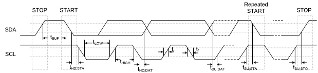 |
|---------------------------------|

Figure 6.12‑2
I2C Bus Timing

The device’s on-chip I2C provides the serial interface that
meets the I2C bus standard mode specification. The
I2C port handles byte transfers autonomously. To enable this
port, the bit I2CEN in I2C_CTL0 should be set to '1'. The I2C
hardware interfaces to the I2C bus via two pins: SDA and SCL.
When I/O pins are used as I2C ports, user must set the pins
function to I2C in advance.

There is two-level buffer to improve the performance of I2C
bus. In two-level BUFFER mode, the next transmitted or the last received
data can be active even if the current data is transmitted or the last
received isn’t read back yet.

There are under run or over run interrupt when the two-level buffer mode
is enabled and the interrupt event enable is set. When two-level buffer
under run, user will capture the last data be read. When two-level
buffer over run, user will capture the last data be written.

**Note:** Pull-up resistor is needed for I2C operation as the
SDA and SCL are open-drain pins.

#### I2C Protocol

Figure 6.12‑3 shows the typical I2C protocol. Normally, a
standard communication consists of four parts:

- START or Repeated START signal generation

- Slave address and R/W bit transfer

- Data transfer

- STOP signal generation

|  |
|---------------------------------|

Figure 6.12‑3
I2C Protocol

- START or Repeated START signal

> When the bus is free/idle, which means no master device is engaging
> the bus (both SCL and SDA lines are high), a master can initiate a
> transfer by sending a START signal. A START signal, usually referred
> to as the “S” bit, is defined as a HIGH to LOW transition on the SDA
> line while SCL is HIGH. The START signal denotes the beginning of a
> new data transmission.
>
> After having sent the address byte (address and read/write bit), the
> master may send any number of bytes followed by a stop condition.
> Instead of sending the stop condition it is also allowed to send
> another start condition again followed by an address (and of course
> including a read/write bit) and more data. The start condition is
> called as Repeat START (Sr). This is defined recursively allowing any
> number of start conditions to be sent. The purpose of this is to allow
> combined write/read operations to one or more devices without
> releasing the bus and thus with the guarantee that the operation is
> not interrupted. The controller uses this method to communicate with
> another slave or the same slave in a different transfer direction
> (e.g. from writing to a device to reading from a device) without
> releasing the bus.

- STOP signal

> The master can terminate the communication by generating a STOP
> signal. A STOP signal, usually referred to as the “P” bit, is defined
> as a LOW to HIGH transition on the SDA line while SCL is HIGH.
>
> Figure 6.12‑4 shows the waveform of START, Repeat START and STOP.

|  |
|---------------------------------|

Figure 6.12‑4 START and
STOP Conditions

- Slave Address Transfer

> After a (Repeated) START condition, the master sends a slave address
> to identify the target device of the communication. The start address
> can comprise one bytes. After an address byte, a slave sensitive to
> the transmitted address has to acknowledge the reception.
>
> Therefore, the slave’s address can be programmed in the device, where
> it is compared to the received address. In case of a match, the slave
> answers with an acknowledge (SDA = 0). Slaves that are not targeted
> answer with a non-acknowledge (SDA = 1). In addition to the match of
> the programmed address, another address byte value has to be answered
> with an acknowledge if the slave is capable to handle the
> corresponding requests.

- Data Transfer

> When a slave receives a correct address with an R/W bit, the data will
> follow R/W bit specified to transfer. Each transferred byte is
> followed by an acknowledge bit on the 9th SCL clock cycle. If the
> slave signals a Not Acknowledge (NACK), the master can generate a STOP
> signal to abort the data transfer or generate a Repeated START signal
> and start a new transfer cycle.
>
> If the master, as a receiving device, does Not Acknowledge (NACK) the
> slave, the slave releases the SDA line for the master to generate a
> STOP or Repeated START signal. The Figure 6.12‑5 and Figure 6.12‑6
> shows the waveform of bit transfer and acknowledge.

|  |
|---------------------------------|

Figure 6.12‑5 Bit
Transfer on the I2C Bus

|  |
|---------------------------------|

Figure 6.12‑6 Acknowledge
on the I2C Bus

- Data transfer on I2C bus

> Figure 6.12‑7 shows a master transmits data to slave by 7-bit. A
> master addresses a slave with a 7-bit address and 1-bit write index to
> denote that the master wants to transmit data to the slave. The master
> keeps transmitting data after the slave returns acknowledge to the
> master.

| 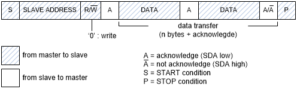 |
|---------------------------------|

Figure 6.12‑7 Master
Transmits Data to Slave by 7-bit

> Figure 6.12‑8 shows a master read data from slave by 7-bit. A master
> addresses a slave with a 7-bit address and 1-bit read index to denote
> that the master wants to read data from the slave. The slave will
> start transmitting data after the slave returns acknowledge to the
> master.

|  |
|---------------------------------|

Figure 6.12‑8 Master
Reads Data from Slave by 7-bit

#### Operation Modes

The on-chip I2C ports support three operation modes, Master,
Slave, and General Call Mode.

In a given application, I2C port may operate as a master or
as a slave. In Slave mode, the I2C port hardware looks for
its own slave address and the general call address. If one of these
addresses is detected, and if the slave is willing to receive or
transmit data from/to master(by setting the AA bit), acknowledge pulse
will be transmitted out on the 9th clock, hence an interrupt is
requested on both master and slave devices if interrupt is enabled. When
the microcontroller wishes to become the bus master, hardware waits
until the bus is free before entering Master mode so that a possible
slave action is not be interrupted. If bus arbitration is lost in Master
mode, I2C port switches to Slave mode immediately and can
detect its own slave address in the same serial transfer.

To control the I2C bus transfer in each mode, user needs to
set I2C_CTL0, I2C_DAT registers according to current status code of
I2C_STATUS0 register. In other words, for each I2C bus
action, user needs to check current status by I2C_STATUS0 register, and
then set I2C_CTL0, I2C_DAT registers to take bus action. Finally, check
the response status by I2C_STATUS0.

The bits, STA, STO and AA in I2C_CTL0 register are used to control the
next state of the I2C hardware after SI flag of I2C_CTL0
\[3\] register is cleared. Upon completion of the new action, a new
status code will be updated in I2C_STATUS0 register and the SI flag of
I2C_CTL0 register will be set. But the SI flag will not be set when
I2C STOP. If the I2C interrupt control bit INTEN
(I2C_CTL0 \[7\]) is set, appropriate action or software branch of the
new status code can be performed in the Interrupt service routine.

Figure 6.12‑9 shows the current I2C status code is 0x08, and
then set I2C_DATA=SLA+W and (STA,STO,SI,AA) = (0,0,1,x) to send the
address to I2C bus. If a slave on the bus matches the address
and response ACK, the I2C_STATUS0 will be updated by status code 0x18.

|  |
|---------------------------------|

Figure 6.12‑9 Control
I2C Bus according to the Current I2C Status

1.  Master Mode

In Figure 6.12‑10 and Figure 6.12‑11, all possible protocols for
I2C master are shown. User needs to follow proper path of the
flow to implement required I2C protocol.

In other words, user can send a START signal to bus and I2C
will be in Master Transmitter (MT) mode (Figure 6.12‑10) or Master
receiver (MR) mode (Figure 6.12‑11) after START signal has been sent
successfully and new status code would be 0x08. Followed by START
signal, user can send slave address, read/write bit, data and Repeat
START, STOP to perform I2C protocol.

|  |
|---------------------------------|

Figure 6.12‑10 Master
Transmitter Mode Control Flow

|  |
|---------------------------------|

Figure 6.12‑11 Master
Receiver Mode Control Flow

If the I2C is in Master mode and gets arbitration lost, the
status code will be 0x38. In status 0x38, user may set (STA, STO, SI,
AA) = (1, 0, 1, X) to send START to re-start Master operation when bus
become free. Otherwise, user may set (STA, STO, SI, AA) = (0, 0, 1, X)
to release I2C bus and enter not addressed Slave mode.

2.  Slave Mode

When reset default, I2C is not addressed and will not
recognize the address on I2C bus. User can set slave address
by I2C_ADDRn (n=0~3) and set (STA, STO, SI, AA) = (0, 0, 1, 1) to let
I2C recognize the address sent by master. Figure 6.12‑12
shows all the possible flow for I2C in Slave mode. Users need
to follow a proper flow (as shown in Figure 6.12‑12 to implement their
own I2C protocol.

If bus arbitration is lost in Master mode, I2C port switches
to Slave mode immediately and can detect its own slave address in the
same serial transfer. If the detected address is SLA+W (Master want to
write data to Slave) after arbitration lost, the status code is 0x68. If
the detected address is SLA+R (Master want to read data from Slave)
after arbitration lost, the status code is 0xB0.

**Note:** During I2C communication, the SCL clock will be
released when writing ‘1’ to clear SI flag in Slave mode.

| 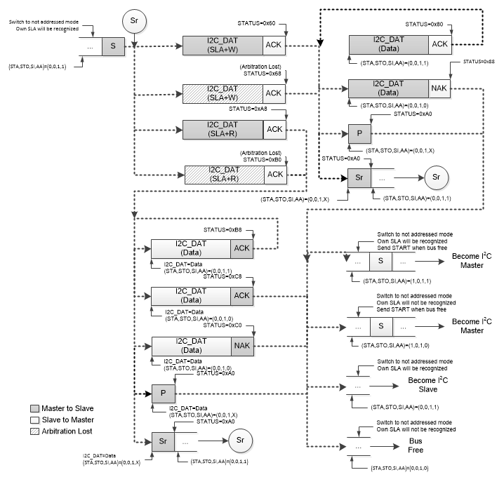 |
|---------------------------------|

Figure 6.12‑12 Slave Mode
Control Flow

If I2C is still receiving data in addressed Slave mode but
got a STOP or Repeat START, the status code will be 0xA0. User could
follow the action for status code 0x88 as shown in the above figure when
getting 0xA0 status.

If I2C is still transmitting data in addressed Slave mode but
got a STOP or Repeat START, the status code will be 0xA0. User could
follow the action for status code 0xC8 as shown in the above figure when
getting 0xA0 status.

**Note:** After slave gets status of 0x88, 0xC8, 0xC0 and 0xA0, slave
can switch to not address mode and own SLA will not be recognized. If
entering this status, slave will not receive any I2C signal
or address from master. At this status, I2C should enter idle
mode.

3.  General Call (GC) Mode

If the GC bit (I2C_ADDR0 \[0\]) is set, the I2C port hardware
will respond to General Call address (00H). User can clear GC bit to
disable general call function. When the GC bit is set and the
I2C in Slave mode, it can receive the general call address by
0x00 after master send general call address to I2C bus, then
it will follow status of GC mode.

The GC mode can wake up when address matched. Note that the default
address is 0x00, but user must set an address except for 0x00.

|  |
|---------------------------------|

Figure 6.12‑13 GC Mode

If I2C is still receiving data in GC mode but got a STOP or
Repeat START, the status code will be 0xA0. User could follow the action
for status code 0x98 in above figure when getting 0xA0 status.

**Note:** After slave gets status of 0x98 and 0xA0, slave can switch to
not address mode and own SLA will not be recognized. If entering this
status, slave will not receive any I2C signal or address from
master. At this time, the I2C controller should enter idle
mode.

4.  Multi-Master

In some applications, there are two or more masters on the same
I2C bus to access slaves, and the masters may transmit data
simultaneously. The I2C supports multi-master by including
collision detection and arbitration to prevent data corruption.

If for some reason two masters initiate command at the same time, the
arbitration procedure determines which master wins and can continue with
the command. Arbitration is performed on the SDA signal while the SCL
signal is high. Each master checks if the SDA signal on the bus
corresponds to the generated SDA signal. If the SDA signal on the bus is
low but it should be high, then this master has lost arbitration. The
device that has lost arbitration can generate SCL pulses until the byte
ends and must then release the bus and go into slave mode. The
arbitration procedure can continue until all the data is transferred.
This means that in multi-master system each master must monitor the bus
for collisions and act accordingly.

| 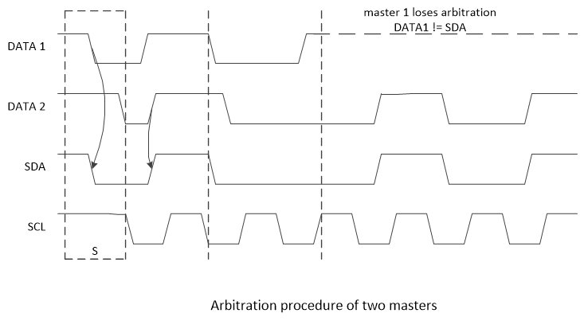 |
|---------------------------------|

Figure 6.12‑14
Arbitration Lost

- When I2C_STATUS0 = 0x38, an “Arbitration Lost” is received.
  Arbitration lost event maybe occur during the send START bit, data
  bits or STOP bit. User could set (STA, STO, SI, AA) = (1, 0, 1, X) to
  send START again when bus free, or set (STA, STO, SI, AA) = (0, 0,
  1, X) to not addressed Slave mode. User can detect bus free by ONBUSY
  (I2C_STATUS1 \[8\]).

- When I2C_STATUS0 = 0x00, a “Bus Error” is received. To recover
  I2C bus from a bus error, STO should be set and SI should
  be cleared, and then STO is cleared to release bus.

  - Set (STA, STO, SI, AA) = (0, 1, 1, X) to stop current transfer

  - Set (STA, STO, SI, AA) = (0, 0, 1, X) to release bus

#### Two-level BUFFER Mode on I2C bus

Set TWOBUFEN = 1 (I2C_CTL1\[5\]) to enable the two-level BUFFER for
I2C transmitted or received buffer. It only support 7-bit
slave mode and not support wakeup function. The function is used to
improve transfer/receive performance.

Two-level BUFFER Mode I2C will not stretch SCL, so user must
enable SRCINTEN (I2C_CTL0\[13\]), DPCINTEN (I2C_CTL0\[12\]) and set
DPBITSEL (I2C_CTL0\[9:8\]) for avoid data transfer errors.

SARCIF (I2C_CTL0\[15\]) will be set 1 by hardware when I2C
slave detect address read command and SRCINTEN is enable. SARCIF
(I2C_CTL0\[15\]) is used to send interrupt in advance to let software
has enough time to prepare data.

After software enable DPCINTEN(I2C_CTL0\[12\]) and set
DPBITSEL(I2C_CTL0\[9:8\]), DPCIF (I2C_CTL0\[14\]) will be set by
hardware when slave transfer/receive data bit counts equal to the set up
value. User can modify DPBITSEL(I2C_CTL0\[9:8\]) to adjust interrupt
timing (DPCIF). The method is to use early entry handler to avoid
missing interrupt events.

For example, one of circumstance is master send repeat start after write
data ack, the two event will send interrupt very closely. Software may
miss the write data ack status then slave will lose the last data
transferred by master.

In order to ensure transfer/receive data correctly in Two-level BUFFER
Mode (non-stretch mode), user must follow bellow control flow in two
buffer mode.

|  |
|---------------------------------|

Figure 6.12‑15 Two-level
BUFFER Mode Slave Read Control

|  |
|---------------------------------|

Figure 6.12‑16 Two-level
BUFFER Mode Slave Write Control

|  |
|---------------------------------|

Figure 6.12‑17 Two-level
BUFFER Mode Slave Read Limitation

#### Programmable setup and hold times

To guarantee a correct data setup and hold time, the timing must be
configured. By programming HTCTL (I2C_TMCTL\[24:16\]) to configure hold
time and STCTL (I2C_TMCTL\[8:0\]) to configure setup time.

The delay timing refer peripheral clock (PCLK). When device stretch
master clock, the setup and hold time configuration value will not
affected by stretched.

User should focus the limitation of setup and hold time configuration,
the timing setting must follow I2C protocol. Once setup time
configuration greater than design limitation, that means if setup time
setting make SCL output less than three PCLKs, the I2C
controller can’t work normally due to SCL must sample three times. And
once hold time configuration greater than I2C clock
limitation, I2C will occur bus error. It is suggested that
user calculate suitable timing with baud rate and protocol before
setting timing. Table 6.12‑3 shows the relationship between
I2C baud rate and PCLK, the number of table represent one
clock duty contain how many PCLKs. Setup and hold time configuration
even can program some extreme values in the design, but user should
follow I2C protocol standard.

<table>
<caption>
Table 6.12‑3 Relationship between I2C Baud Rate
and PCLK
</caption>
<colgroup>
<col style="width: 33%" />
<col style="width: 13%" />
<col style="width: 13%" />
<col style="width: 13%" />
<col style="width: 13%" />
<col style="width: 13%" />
</colgroup>
<thead>
<tr>
<th>
I2C Baud Rate

PCLK
</th>
<th>100k</th>
<th>200k</th>
<th>400k</th>
<th>800k</th>
<th>1200k</th>
</tr>
</thead>
<tbody>
<tr>
<td>12 MHz</td>
<td>120</td>
<td>60</td>
<td>30</td>
<td>15</td>
<td>10</td>
</tr>
<tr>
<td>24 MHz</td>
<td>240</td>
<td>120</td>
<td>60</td>
<td>30</td>
<td>20</td>
</tr>
</tbody>
</table>

Table 6.12‑3 Relationship between I2C Baud Rate and PCLK

For setup time wrong adjustment example, assuming one SCL cycle contains
5 PCLKs and set STCTL (I2C_TMCTL\[8:0\]) to 3 that stretch three PCLKs
for setup time setting. The setup time maximum setting value:
STlimit = (I2C_CLKDIV\[9:0\]+1) X 2 - 6.

|  |
|---------------------------------|

Figure 6.12‑18 Setup Time
Wrong Adjustment

For hold time wrong adjustment example, use I2C Baud Rate =
1200k and PCLK = 24 MHz, the SCL high/low duty = 20 PCLK. When HTCTL
(I2C_TMCTL\[24:16\]) is set to 21 and STCTL (I2C_TMCTL\[8:0\]) is set to
0, then SDA output delay will over SCL high duty and cause bus error.
The hold time maximum setting value: HTlimit =
(I2C_CLKDIV\[9:0\]+1) X 2 - 9.

| 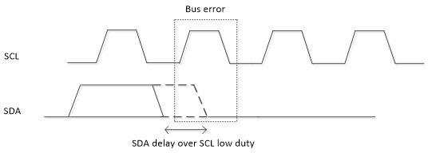 |
|---------------------------------|

Figure 6.12‑19 Hold Time
Wrong Adjustment

#### I2C Protocol Registers

To control I2C port through the following fifteen special
function registers: I2C_CTL0 (control register), I2C_STATUS0 (status
register), I2C_DAT (data register), I2C_ADDRn (address registers,
n=0~3), I2C_ADDRMSKn (address mask registers, n=0~3), I2C_CLKDIV (clock
rate register), I2C_TOCTL (Time-out control register), I2C_WKCTL(wake up
control register) and I2C_WKSTS(wake up status register).

1.  Address Registers (I2C_ADDR)

The I2C port is equipped with four slave address registers,
I2C_ADDRn (n=0~3). The contents of the register are irrelevant when
I2C is in Master mode. In Slave mode, the bit field
ADDR(I2C_ADDRn\[7:1\]) must be loaded with the chip’s own slave address.
The I2C hardware will react if the contents of I2C_ADDRn are
matched with the received slave address.

The I2C ports support the “General Call” function. If the GC
bit (I2C_ADDRn \[0\]) is set the I2C port hardware will
respond to General Call address (00H). Clear GC bit to disable general
call function.

When the GC bit is set and the I2C is in Slave mode, it can
receive the general call address by 00H after Master send general call
address to I2C bus, then it will follow status of GC mode.

2.  Slave Address Mask Registers (I2C_ADDRMSK)

The I2C bus controller supports multiple address recognition
with four address mask registers I2C_ADDRMSKn (n=0~3). When the bit in
the address mask register is set to 1, it means the received
corresponding address bit is "Don’t care". If the bit is set to 0, it
means the received corresponding register bit should be exactly the same
as address register.

3.  Data Register (I2C_DAT)

This register contains a byte of serial data to be transmitted or a byte
which just has been received. The CPU can be read from or written to the
8-bit (I2C_DAT \[7:0\]) directly while it is not in the process of
shifting a byte. When I2C is in a defined state and the
serial interrupt flag (SI) is set, data in I2C_DAT \[7:0\] remains
stable. While data is being shifted out, data on the bus is
simultaneously being shifted in; I2C_DAT \[7:0\] always contains the
last data byte presented on the bus.

The acknowledge bit is controlled by the I2C hardware and
cannot be accessed by the CPU. Serial data is shifted into I2C_DAT
\[7:0\] on the rising edges of serial clock pulses on the SCL line. When
a byte has been shifted into I2C_DAT \[7:0\], the serial data is
available in I2C_DAT \[7:0\], and the acknowledge bit (ACK or NACK) is
returned by the control logic during the ninth clock pulse. In order to
monitor bus status while sending data, the bus data will be shifted to
I2C_DAT\[7:0\] when sending I2C_DAT\[7:0\] to bus. In the case of
sending data, serial data bits are shifted out from I2C_DAT \[7:0\] on
the falling edge of SCL clocks, and is shifted to I2C_DAT \[7:0\] on the
rising edge of SCL clocks. Figure 6.12‑20 shows I2C Data
Shifting Direction.

|  |
|---------------------------------|

Figure 6.12‑20
I2C Data Shifting Direction

4.  Control Register (I2C_CTL0)

The CPU can be read from and written to I2C_CTL0 \[7:0\] directly. When
the I2C port is enabled by setting I2CEN (I2C_CTL0 \[6\]) to
high, the internal states will be controlled by I2C_CTL0 and
I2C logic hardware.

There are two bits are affected by hardware: the SI bit is set when the
I2C hardware requests a serial interrupt, and the STO bit is
cleared when a STOP condition is present on the bus. The STO bit is also
cleared when I2CEN = 0.

Once a new status code is generated and stored in I2C_STATUS0, the
I2C Interrupt Flag bit SI (I2C_CTL0 \[3\]) will be set
automatically. If the Enable Interrupt bit INTEN (I2C_CTL0 \[7\]) is set
at this time, the I2C interrupt will be generated. The bit
field I2C_STATUS0\[7:0\] stores the internal state code, the content
keeps stable until SI is cleared by software.

5.  Status Register (I2C_STATUS0)

I2C_STATUS0 \[7:0\] is an 8-bit read-only register. The bit field
I2C_STATUS0 \[7:0\] contains the status code and there are 26 possible
status codes. All states are listed in Table 6.12‑4. When I2C_STATUS0
\[7:0\] is F8H, no serial interrupt is requested. All other I2C_STATUS0
\[7:0\] values correspond to the defined I2C states. When
each of these states is entered, a status interrupt is requested (SI =
1). A valid status code is present in I2C_STATUS0\[7:0\] one cycle PCLK
after SI set by hardware and is still present one cycle PCLK after SI
reset by software.

In addition, the state 00H stands for a Bus Error, which occurs when a
START or STOP condition is present at an incorrect position in the
I2C format frame. A Bus Error may occur during the serial
transfer of an address byte, a data byte or an acknowledge bit. To
recover I2C from bus error, STO should be set and SI should
be cleared to enter Not Addressed Slave mode. Then STO is cleared to
release bus and to wait for a new communication. The I2C bus
cannot recognize stop condition during this action when a bus error
occurs.

<table>
<caption>
Table 6.12‑4 I2C Status Code
Description
</caption>
<colgroup>
<col style="width: 12%" />
<col style="width: 35%" />
<col style="width: 11%" />
<col style="width: 39%" />
</colgroup>
<thead>
<tr>
<th colspan="2" style="text-align: left;">Master Mode</th>
<th colspan="2" style="text-align: left;">Slave Mode</th>
</tr>
</thead>
<tbody>
<tr>
<td style="text-align: left;">STATUS</td>
<td style="text-align: left;">Description</td>
<td style="text-align: left;">STATUS</td>
<td style="text-align: left;">Description</td>
</tr>
<tr>
<td style="text-align: left;">0x08[1]</td>
<td style="text-align: left;">Start</td>
<td style="text-align: left;">0xA0</td>
<td style="text-align: left;">Slave Transmit Repeat Start or Stop</td>
</tr>
<tr>
<td style="text-align: left;">0x10[1]</td>
<td style="text-align: left;">Master Repeat Start</td>
<td style="text-align: left;">0xA8[1]</td>
<td style="text-align: left;">Slave Transmit Address ACK</td>
</tr>
<tr>
<td style="text-align: left;">0x18[1]</td>
<td style="text-align: left;">Master Transmit Address ACK</td>
<td style="text-align: left;">0xB8[1]</td>
<td style="text-align: left;">Slave Transmit Data ACK</td>
</tr>
<tr>
<td style="text-align: left;">0x20</td>
<td style="text-align: left;">Master Transmit Address NACK</td>
<td style="text-align: left;">0xC0</td>
<td style="text-align: left;">Slave Transmit Data NACK</td>
</tr>
<tr>
<td style="text-align: left;">0x28[1]</td>
<td style="text-align: left;">Master Transmit Data ACK</td>
<td style="text-align: left;">0xC8[1]</td>
<td style="text-align: left;">Slave Transmit Last Data ACK</td>
</tr>
<tr>
<td style="text-align: left;">0x30</td>
<td style="text-align: left;">Master Transmit Data NACK</td>
<td style="text-align: left;">0x60[1]</td>
<td style="text-align: left;">Slave Receive Address ACK</td>
</tr>
<tr>
<td style="text-align: left;">0x38</td>
<td style="text-align: left;">Master Arbitration Lost</td>
<td style="text-align: left;">0x68[1]</td>
<td style="text-align: left;">Slave Receive Arbitration Lost</td>
</tr>
<tr>
<td style="text-align: left;">0x40[1]</td>
<td style="text-align: left;">Master Receive Address ACK</td>
<td style="text-align: left;">0x80[1]</td>
<td style="text-align: left;">Slave Receive Data ACK</td>
</tr>
<tr>
<td style="text-align: left;">0x48</td>
<td style="text-align: left;">Master Receive Address NACK</td>
<td style="text-align: left;">0x88</td>
<td style="text-align: left;">Slave Receive Data NACK</td>
</tr>
<tr>
<td style="text-align: left;">0x50[1]</td>
<td style="text-align: left;">Master Receive Data ACK</td>
<td style="text-align: left;">0x70[1]</td>
<td style="text-align: left;">GC mode Address ACK</td>
</tr>
<tr>
<td style="text-align: left;">0x58</td>
<td style="text-align: left;">Master Receive Data NACK</td>
<td style="text-align: left;">0x78[1]</td>
<td style="text-align: left;">GC mode Arbitration Lost</td>
</tr>
<tr>
<td style="text-align: left;">0x00</td>
<td style="text-align: left;">Bus error</td>
<td style="text-align: left;">0x90[1]</td>
<td style="text-align: left;">GC mode Data ACK</td>
</tr>
<tr>
<td style="text-align: left;"></td>
<td style="text-align: left;"></td>
<td style="text-align: left;">0x98</td>
<td style="text-align: left;">GC mode Data NACK</td>
</tr>
<tr>
<td style="text-align: left;"></td>
<td style="text-align: left;"></td>
<td style="text-align: left;">0xB0[1]</td>
<td style="text-align: left;">Address Transmit Arbitration Lost</td>
</tr>
<tr>
<td style="text-align: left;">0xF8</td>
<td colspan="3" style="text-align: left;">
Bus Released

<strong>Note:</strong> Status “0xF8” exists in both master/slave
modes, and it won’t raise interrupt.
</td>
</tr>
</tbody>
</table>

Table 6.12‑4 I2C Status Code Description

6.  Clock Baud Rate Bits (I2C_CLKDIV)

The data baud rate of I2C is determines by DIVIDER(I2C_CLKDIV
\[9:0\]) register when I2C is in Master mode, and it is not
necessary in a Slave mode. In the Slave mode, I2C will
automatically synchronize it with any clock frequency from master
I2C device. In the slave mode, system clock frequency should
greater than I2C bus maximum clock 20 times.

The data baud rate of I2C setting is Data Baud Rate of
I2C = (system clock) / (4x (I2C_CLKDIV \[9:0\] +1)). If
system clock = 16 MHz, the I2C_CLKDIV \[9:0\] = 40 (28H), the data baud
rate of I2C = 16 MHz/ (4x (40 +1)) = 97.5 Kbits/sec.

7.  Time-out Control Register (I2C_TOCTL)

There is a 14-bit time-out counter which can be used to deal with the
I2C bus hang-up. If the time-out counter is enabled, the
counter starts up counting until it overflows (TOIF=1) and generates
I2C interrupt to CPU or stops counting by clearing TOCEN to
0. When time-out counter is enabled, writing 1 to the SI flag will reset
counter and re-start up counting after SI is cleared. If I2C
bus hangs up, it causes the I2C_STATUS0 and flag SI are not updated for
a period, the 14-bit time-out counter may overflow and acknowledge CPU
the I2C interrupt. Refer to Figure 6.12‑21 for the 14-bit
time-out counter. User may write 1 to clear TOIF to 0.

|  |
|---------------------------------|

Figure 6.12‑21
I2C Time-out Count Block Diagram

8.  Wake-up Control Register (I2C_WKCTL)

When chip enters Power-down mode and set WKEN (I2C_WKCTL \[0\]) to 1,
other I2C master can wake up the chip by addressing the
I2C device, user must configure the related setting before
entering sleep mode. The ACK bit cycle of address match frame is done in
power-down. The controller will stretch the SCL to low when the address
is matched the device’s address and the ACK cycle done, then the
I2C controller will go ahead. If NHDBUSEN (I2C_WKCTL \[7\])
is set, the controller will don’t stretch the SCL to low. Note that when
the controller don’t stretch the SCL to low, transmit or receive data
will perform immediately. If data transmitted or received when SI event
is not clear, user must reset the I2C controller and execute
the original operation again.

9.  Wake-up Status Register (I2C_WKSTS)

When system is woken up by other I2C master device, WKIF is
set to indicate this event. User needs write “1” to clear this bit.

When the chip is woken-up by address match with one of the device
address register (I2C_ADDRn), the user shall check the WKAKDONE
(I2C_WKSTS \[1\]) bit is set to 1 to confirm the address byte has done.
The WKAKDONE bit indicates that the ACK bit cycle of address byte is
done in power-down. The controller will stretch the SCL to low when the
address is matched the device’s slave address and the ACK cycle done.
The SCL is stretched until WKAKDONE is clear by user. If the frequency
of SCL is low speed and the system has wakeup from address match frame,
the user shall check WKAKDONE to confirm this frame has transaction done
and then to do the wakeup procedure. Note that user can’t release WKIF
through clearing the WKAKDONE bit to 0.

The WRSTSWK (I2C_WKSTS \[2\]) bit records the Read/Write command before
the I2C controller sends address. The user can read this
bit’s status to prepare the next transmitted data (WRSTSWK = 1) or to
wait the incoming data (WRSTSWK = 0) can be stored in time after the
system is wake-up by the address match frame. Note that the WRSTSWK
(I2C_WKSTS \[2\]) bit is cleared when writing one to the WKAKDONE
(I2C_WKSTS \[1\]) bit.

When system is woken up by other I2C master device, WKIF is
set to indicate this event. User needs to write “1” to clear this bit.

|  |
|---------------------------------|

Figure 6.12‑22
I2C Wake-Up Related Signals Waveform

10. I2C Status Register 1 (I2C_STATUS1)

The busy free information list in the this register.

11. I2C Timing Configure Control Register (I2C_TMCTL)

In order to configure setup/hold time, the HTCTL (I2C_TMCTL\[24:16\])
and STCTL (I2C_TMCTL\[8:0\]) are set based on actual demand.

### Register Map

**R:** read only, **W:** write only, **R/W:** both read and write

<table>
<colgroup>
<col style="width: 16%" />
<col style="width: 16%" />
<col style="width: 5%" />
<col style="width: 47%" />
<col style="width: 14%" />
</colgroup>
<tbody>
<tr>
<td><strong>Register</strong></td>
<td><strong>Offset</strong></td>
<td><strong>R/W</strong></td>
<td><strong>Description</strong></td>
<td><strong>Reset Value</strong></td>
</tr>
<tr>
<td colspan="5">
<strong>I2C Base Address:</strong>

<strong>I2Cn_BA = 0x4008_0000</strong>
</td>
</tr>
<tr>
<td><strong>I2C_CTL0</strong></td>
<td>I2Cn_BA+0x00</td>
<td>R/W</td>
<td>I2C Control Register 0</td>
<td>0x0000_0000</td>
</tr>
<tr>
<td><strong>I2C_ADDR0</strong></td>
<td>I2Cn_BA+0x04</td>
<td>R/W</td>
<td>I2C Slave Address Register0</td>
<td>0x0000_0000</td>
</tr>
<tr>
<td><strong>I2C_DAT</strong></td>
<td>I2Cn_BA+0x08</td>
<td>R/W</td>
<td>I2C Data Register</td>
<td>0x0000_0000</td>
</tr>
<tr>
<td><strong>I2C_STATUS0</strong></td>
<td>I2Cn_BA+0x0C</td>
<td>R</td>
<td>I2C Status Register 0</td>
<td>0x0000_00F8</td>
</tr>
<tr>
<td><strong>I2C_CLKDIV</strong></td>
<td>I2Cn_BA+0x10</td>
<td>R/W</td>
<td>I2C Clock Divided Register</td>
<td>0x0000_0000</td>
</tr>
<tr>
<td><strong>I2C_TOCTL</strong></td>
<td>I2Cn_BA+0x14</td>
<td>R/W</td>
<td>I2C Time-out Control Register</td>
<td>0x0000_0000</td>
</tr>
<tr>
<td><strong>I2C_ADDR1</strong></td>
<td>I2Cn_BA+0x18</td>
<td>R/W</td>
<td>I2C Slave Address Register1</td>
<td>0x0000_0000</td>
</tr>
<tr>
<td><strong>I2C_ADDR2</strong></td>
<td>I2Cn_BA+0x1C</td>
<td>R/W</td>
<td>I2C Slave Address Register2</td>
<td>0x0000_0000</td>
</tr>
<tr>
<td><strong>I2C_ADDR3</strong></td>
<td>I2Cn_BA+0x20</td>
<td>R/W</td>
<td>I2C Slave Address Register3</td>
<td>0x0000_0000</td>
</tr>
<tr>
<td><strong>I2C_ADDRMSK0</strong></td>
<td>I2Cn_BA+0x24</td>
<td>R/W</td>
<td>I2C Slave Address Mask Register0</td>
<td>0x0000_0000</td>
</tr>
<tr>
<td><strong>I2C_ADDRMSK1</strong></td>
<td>I2Cn_BA+0x28</td>
<td>R/W</td>
<td>I2C Slave Address Mask Register1</td>
<td>0x0000_0000</td>
</tr>
<tr>
<td><strong>I2C_ADDRMSK2</strong></td>
<td>I2Cn_BA+0x2C</td>
<td>R/W</td>
<td>I2C Slave Address Mask Register2</td>
<td>0x0000_0000</td>
</tr>
<tr>
<td><strong>I2C_ADDRMSK3</strong></td>
<td>I2Cn_BA+0x30</td>
<td>R/W</td>
<td>I2C Slave Address Mask Register3</td>
<td>0x0000_0000</td>
</tr>
<tr>
<td><strong>I2C_WKCTL</strong></td>
<td>I2Cn_BA+0x3C</td>
<td>R/W</td>
<td>I2C Wake-up Control Register</td>
<td>0x0000_0000</td>
</tr>
<tr>
<td><strong>I2C_WKSTS</strong></td>
<td>I2Cn_BA+0x40</td>
<td>R/W</td>
<td>I2C Wake-up Status Register</td>
<td>0x0000_0000</td>
</tr>
<tr>
<td><strong>I2C_CTL1</strong></td>
<td>I2Cn_BA+0x44</td>
<td>R/W</td>
<td>I2C Control Register 1</td>
<td>0x0000_0000</td>
</tr>
<tr>
<td><strong>I2C_STATUS1</strong></td>
<td>I2Cn_BA+0x48</td>
<td>R/W</td>
<td>I2C Status Register 1</td>
<td>0x0000_0000</td>
</tr>
<tr>
<td><strong>I2C_TMCTL</strong></td>
<td>I2Cn_BA+0x4C</td>
<td>R/W</td>
<td>I2C Timing Configure Control Register</td>
<td>0x0002_0000</td>
</tr>
</tbody>
</table>

### Register Description

##### I2C Control Register (I2C_CTL0) 

|  |  |  |  |  |
|----|----|----|----|----|
| **Register** | **Offset** | **R/W** | **Description** | **Reset Value** |
| **I2C_CTL0** | I2Cn_BA+0x00 | R/W | I2C Control Register 0 | 0x0000_0000 |

|  |  |  |  |  |  |  |  |
|:--:|:--:|:--:|:--:|:--:|:--:|:--:|:--:|
| **31** | **30** | **29** | **28** | **27** | **26** | **25** | **24** |
| **Reserved** |  |  |  |  |  |  |  |
| **23** | **22** | **21** | **20** | **19** | **18** | **17** | **16** |
| **Reserved** |  |  |  |  |  |  |  |
| **15** | **14** | **13** | **12** | **11** | **10** | **9** | **8** |
| **SARCIF** | **DPCIF** | **SRCINTEN** | **DPCINTEN** | **Reserved** |  | **DPBITSEL** |  |
| **7** | **6** | **5** | **4** | **3** | **2** | **1** | **0** |
| **INTEN** | **I2CEN** | **STA** | **STO** | **SI** | **AA** | **Reserved** |  |

<table>
<colgroup>
<col style="width: 12%" />
<col style="width: 16%" />
<col style="width: 71%" />
</colgroup>
<tbody>
<tr>
<td><strong>Bits</strong></td>
<td colspan="2"><strong>Description</strong></td>
</tr>
<tr>
<td>[31:16]</td>
<td><strong>Reserved</strong></td>
<td>Reserved.</td>
</tr>
<tr>
<td>[15]</td>
<td><strong>SARCIF</strong></td>
<td>
<strong>Slave Address Read Command Interrupt Flag</strong>

This bit is set by hardware when I2C receive address match
read command.

This bit is cleared by write 1 to it.
</td>
</tr>
<tr>
<td>[14]</td>
<td><strong>DPCIF</strong></td>
<td>
<strong>Data Phase Count Interrupt Flag</strong>

This bit is set by hardware when I2C transfer bit count
equal to DPBITSEL setting.

This bit is cleared by write 1 to it.
</td>
</tr>
<tr>
<td>[13]</td>
<td><strong>SRCINTEN</strong></td>
<td>
<strong>Slave Read Command Interrupt Enable Bit</strong>

0 = Slave Read Command Interrupt Disabled.

1 = Slave Read Command Interrupt Enabled.
</td>
</tr>
<tr>
<td>[12]</td>
<td><strong>DPCINTEN</strong></td>
<td>
<strong>Data Phase Count Interrupt Enable Bit</strong>

0 = Data Phase Count Interrupt Disabled.

1 = Data Phase Count Interrupt Enabled.
</td>
</tr>
<tr>
<td>[11:10]</td>
<td><strong>Reserved</strong></td>
<td>Reserved.</td>
</tr>
<tr>
<td>[9:8]</td>
<td><strong>DPBITSEL</strong></td>
<td>
<strong>Data Phase Bit Count Select</strong>

00 = DPCIF never set by hardware.

01 = When I2C is transfer data and bit count equal to 6,
DPCIF will be set by hardware.

10 = When I2C is transfer data and bit count equal to 7,
DPCIF will be set by hardware.

11 = When I2C is transfer data and bit count equal to 8,
DPCIF will be set by hardware.
</td>
</tr>
<tr>
<td>[7]</td>
<td><strong>INTEN</strong></td>
<td>
<strong>Enable Interrupt</strong>

0 = I2C interrupt Disabled.

1 = I2C interrupt Enabled.
</td>
</tr>
<tr>
<td>[6]</td>
<td><strong>I2CEN</strong></td>
<td>
<strong>I2C Controller Enable Bit</strong>

Set to enable I2C serial function controller. When I2CEN=1
the I2C serial function enable. The multi-function pin
function must set to SDA, and SCL of I2C function first.

0 = I2C controller Disabled.

1 = I2C controller Enabled.
</td>
</tr>
<tr>
<td>[5]</td>
<td><strong>STA</strong></td>
<td>
<strong>I2C START Control</strong>

Setting STA to logic 1 to enter Master mode, the I2C
hardware sends a START or repeat START condition to bus when the bus is
free.
</td>
</tr>
<tr>
<td>[4]</td>
<td><strong>STO</strong></td>
<td>
<strong>I2C STOP Control</strong>

In Master mode, setting STO to transmit a STOP condition to bus then
I2C controller will check the bus condition if a STOP
condition is detected. This bit will be cleared by hardware
automatically.
</td>
</tr>
<tr>
<td>[3]</td>
<td><strong>SI</strong></td>
<td>
<strong>I2C Interrupt Flag</strong>

When a new I2C state is present in the I2C_STATUS0
register, the SI flag is set by hardware. If bit INTEN (I2C_CTL0 [7]) is
set, the I2C interrupt is requested. SI must be cleared by
software. Clear SI by writing 1 to this bit.
</td>
</tr>
<tr>
<td>[2]</td>
<td><strong>AA</strong></td>
<td>
<strong>Assert Acknowledge Control</strong>

When AA =1 prior to address or data is received, an acknowledged (low
level to SDA) will be returned during the acknowledge clock pulse on the
SCL line when 1.) A slave is acknowledging the address sent from master,
2.) The receiver devices are acknowledging the data sent by transmitter.
When AA=0 prior to address or data received, a Not acknowledged (high
level to SDA) will be returned during the acknowledge clock pulse on the
SCL line.
</td>
</tr>
<tr>
<td>[1:0]</td>
<td><strong>Reserved</strong></td>
<td>Reserved.</td>
</tr>
</tbody>
</table>

##### I2C Data Register (I2C_DAT) 

|  |  |  |  |  |
|----|----|----|----|----|
| **Register** | **Offset** | **R/W** | **Description** | **Reset Value** |
| **I2C_DAT** | I2Cn_BA+0x08 | R/W | I2C Data Register | 0x0000_0000 |

|              |        |        |        |        |        |        |        |
|:------------:|:------:|:------:|:------:|:------:|:------:|:------:|:------:|
|    **31**    | **30** | **29** | **28** | **27** | **26** | **25** | **24** |
| **Reserved** |        |        |        |        |        |        |        |
|    **23**    | **22** | **21** | **20** | **19** | **18** | **17** | **16** |
| **Reserved** |        |        |        |        |        |        |        |
|    **15**    | **14** | **13** | **12** | **11** | **10** | **9**  | **8**  |
| **Reserved** |        |        |        |        |        |        |        |
|    **7**     | **6**  | **5**  | **4**  | **3**  | **2**  | **1**  | **0**  |
|   **DAT**    |        |        |        |        |        |        |        |

<table>
<colgroup>
<col style="width: 12%" />
<col style="width: 16%" />
<col style="width: 71%" />
</colgroup>
<tbody>
<tr>
<td><strong>Bits</strong></td>
<td colspan="2"><strong>Description</strong></td>
</tr>
<tr>
<td>[31:8]</td>
<td><strong>Reserved</strong></td>
<td>Reserved.</td>
</tr>
<tr>
<td>[7:0]</td>
<td><strong>DAT</strong></td>
<td>
<strong>I2C Data</strong>

Bit [7:0] is located with the 8-bit transferred/received data of
I2C serial port.
</td>
</tr>
</tbody>
</table>

##### I2C Status Register (I2C_STATUS0) 

|  |  |  |  |  |
|----|----|----|----|----|
| **Register** | **Offset** | **R/W** | **Description** | **Reset Value** |
| **I2C_STATUS0** | I2Cn_BA+0x0C | R | I2C Status Register 0 | 0x0000_00F8 |

|              |        |        |        |        |        |        |        |
|:------------:|:------:|:------:|:------:|:------:|:------:|:------:|:------:|
|    **31**    | **30** | **29** | **28** | **27** | **26** | **25** | **24** |
| **Reserved** |        |        |        |        |        |        |        |
|    **23**    | **22** | **21** | **20** | **19** | **18** | **17** | **16** |
| **Reserved** |        |        |        |        |        |        |        |
|    **15**    | **14** | **13** | **12** | **11** | **10** | **9**  | **8**  |
| **Reserved** |        |        |        |        |        |        |        |
|    **7**     | **6**  | **5**  | **4**  | **3**  | **2**  | **1**  | **0**  |
|  **STATUS**  |        |        |        |        |        |        |        |

## USCI - SPI Mode

### 

OverviewThe SPI protocol
of USCI controller applies to synchronous serial data communication and
allows full duplex transfer. It supports both master and Slave operation
mode with the 4-wire bi-direction interface. SPI mode of USCI controller
performs a serial-to-parallel conversion on data received from a
peripheral device, and a parallel-to-serial conversion on data
transmitted to a peripheral device. The SPI mode is selected by FUNMODE
(USPI_CTL\[2:0\]) = 0x1

This SPI protocol can operate as Master or Slave mode by setting the
SLAVE (USPI_PROTCTL\[0\]) to communicate with the off-chip SPI Slave or
master device. The application block diagrams in Master and Slave mode
are shown below.

|  |
|---------------------------------|

Figure 6.15‑1 SPI Master
Mode Application Block Diagram

|  |
|---------------------------------|

Figure 6.15‑2 SPI Slave
Mode Application Block Diagram

### 

- 
- 
- 
- 
- 
- 
- 
- 

### 

<table>
<caption>
Figure 6.15‑3
USCI SPI Mode Block Diagram
</caption>
<colgroup>
<col style="width: 100%" />
</colgroup>
<thead>
<tr>
<th style="text-align: center;">
FeaturesSupports Master or Slave mode operation
(the maximum frequency -- Master = <em>fPCLK</em> / 2, Slave
&lt; <em>fPCLK</em> / 5)Configurable bit length of a transfer
word from 4 to 16-bitSupports one transmit buffer and two receive
buffers for data payloadSupports MSB first or LSB first transfer
sequenceSupports Word Suspend functionSupports 3-wire, no slave select
signal, bi-direction interfaceSupports wake-up function by slave select
signal in Slave modeSupports one data channel half-duplex transferBlock Diagram

<strong>Note:</strong> x = 0
</th>
</tr>
</thead>
<tbody>
</tbody>
</table>

Figure 6.15‑3 USCI SPI
Mode Block Diagram

### 

#### 

- - Basic
    ConfigurationUSCI0 SPI Basic ConfigurationsClock Source
    ConfigurationEnable USCI0 peripheral clock in USCI0CKEN
    (CLK_APBCLK1\[8\]).

  - Enable USCI0_SPI functi on USPI_CTL\[2:0\] register,
    USPI_CTL\[2:0\]=3’b001

- - Reset ConfigurationReset USCI0 controller in USCI0RST
    (SYS_IPRST2\[8\]).

### 

#### 

Functional
DescriptionUSCI Common Function Description Please refer to section
**6.13.4** for detailed information.

#### 

Signal Description A device operating in Master mode controls the start
and end of a data transfer, as well as the generation of the SPI bus
clock and slave select signal. The slave select signal indicates the
start and the end of a data transfer, and the master device can use it
to enable the transmitting or receiving operations of Slave device.
Slave device receives the SPI bus clock and optionally a slave select
signal for data transaction. The signals for SPI communication are shown
below.

<table>
<colgroup>
<col style="width: 16%" />
<col style="width: 20%" />
<col style="width: 20%" />
<col style="width: 20%" />
<col style="width: 20%" />
</colgroup>
<thead>
<tr>
<th>SPI Mode</th>
<th>Receive Data</th>
<th>Transmit Data</th>
<th>Serial Bus Clock</th>
<th>Slave Select</th>
</tr>
</thead>
<tbody>
<tr>
<td>Full-duplex SPI Master</td>
<td>
SPI_MISO

(USCIx_DAT1)
</td>
<td>
SPI_MOSI

(USCIx_DAT0)
</td>
<td>
SPI_CLK

(USCIx_CLK)
</td>
<td>
SPI_SS

(USCIx_CTL0)
</td>
</tr>
<tr>
<td>Full-duplex SPI Slave</td>
<td>
SPI_MOSI

(USCIx_DAT0)
</td>
<td>
SPI_MISO

(USCIx_DAT1)
</td>
<td>
SPI_CLK

(USCIx_CLK)
</td>
<td>
SPI_SS

(USCIx_CTL0)
</td>
</tr>
<tr>
<td>
Half-duplex SPI

Master/Slave
</td>
<td>
SPI_MOSI

(USCIx_DAT0)
</td>
<td>
SPI_MOSI

(USCIx_DAT0)
</td>
<td>
SPI_CLK

(USCIx_CLK)
</td>
<td>
SPI_SS

(USCIx_CTL0)
</td>
</tr>
</tbody>
</table>

1.  

| SPI Communication Signals |
|----------------------------------------------------------|

Figure 6.15‑4 4-Wire
Full-Duplex SPI Communication Signals (Master Mode)

|  |
|---------------------------------|

Figure 6.15‑5 4-Wire
Full-Duplex SPI Communication Signals (Slave Mode)

#### 

Serial Bus Clock Configuration The USCI controller needs the peripheral
clock to drive the USCI logic unit to perform the data transfer. The
peripheral clock frequency is equal to PCLK frequency.

In Master mode, the frequency of the SPI bus clock is determined by
protocol-relative clock generator. In general, the SPI bus clock is
denoted as SPI clock. The frequency of SPI clock is half of
fSAMP_CLK, which can be selected by SPCLKSEL
(USPI_BRGEN\[3:2\]). Refer to **6.13.4** for details of
protocol-relative clock generator.

In Slave mode, the SPI bus clock is provided by an off-chip Master
device. The peripheral clock frequency, fPCLK, of SPI Slave
device must be 5-times faster than the serial bus clock rate of the SPI
Master device connected together (i.e. the clock rate of serial bus
clock \< 1/5 peripheral clock $f_{PCLK}$ in Slave mode).

In SPI protocol, SCLKMODE (USPI_PROTCTL\[7:6\]) defines not only the
idle state of serial bus clock but also the serial clock edge used for
transmit and receive data. Both Master and Slave devices on the same
communication bus should have the same SCLKMODE configuration. The four
kinds of serial bus clock configuration are shown below.

| SCLKMODE \[1:0\] | SPI Clock Idle State | Transmit Timing | Receive Timing |
|------------------|----------------------|-----------------|----------------|
| 0x0              | Low                  | Falling edge    | Rising edge    |
| 0x1              | Low                  | Rising edge     | Falling edge   |
| 0x2              | High                 | Rising edge     | Falling edge   |
| 0x3              | High                 | Falling edge    | Rising edge    |

Table 6.15‑1 Serial Bus
Clock Configuration

|  |
|---------------------------------|

Figure 6.15‑6 SPI
Communication with Different SPI Clock Configuration (SCLKMODE=0x0)

|  |
|---------------------------------|

Figure 6.15‑7 SPI
Communication with Different SPI Clock Configuration (SCLKMODE=0x1)

|  |
|---------------------------------|

Figure 6.15‑8 SPI
Communication with Different SPI Clock Configuration (SCLKMODE=0x2)

|  |
|---------------------------------|

Figure 6.15‑9 SPI
Communication with Different SPI Clock Configuration (SCLKMODE=0x3)

#### 

Table 10.1‑1 List of
Abbreviations

# REVISION HISTORY

<table>
<colgroup>
<col style="width: 14%" />
<col style="width: 14%" />
<col style="width: 71%" />
</colgroup>
<thead>
<tr>
<th style="text-align: left;">Date</th>
<th style="text-align: left;">Revision</th>
<th style="text-align: left;">Description</th>
</tr>
</thead>
<tbody>
<tr>
<td style="text-align: left;">2024.05.10</td>
<td style="text-align: left;">1.00</td>
<td style="text-align: left;">Initial version.</td>
</tr>
<tr>
<td style="text-align: left;">2024.08.01</td>
<td style="text-align: left;">1.01</td>
<td style="text-align: left;">
Chapter 6.8 Added Watchdog Timer (WDT)
chapter.

Chapter 6.10 Modified overview description fixed one set of
ECAP.
</td>
</tr>
</tbody>
</table>

**  
**

**Important Notice**

**Nuvoton Products are neither intended nor warranted for usage in
systems or equipment, any malfunction or failure of which may cause loss
of human life, bodily injury or severe property damage. Such
applications are deemed, “Insecure Usage”.**

**Insecure usage includes, but is not limited to: equipment for surgical
implementation, atomic energy control instruments, airplane or spaceship
instruments, the control or operation of dynamic, brake or safety
systems designed for vehicular use, traffic signal instruments, all
types of safety devices, and other applications intended to support or
sustain life.**

**All Insecure Usage shall be made at customer’s risk, and in the event
that third parties lay claims to Nuvoton as a result of customer’s
Insecure Usage, customer shall indemnify the damages and liabilities
thus incurred by Nuvoton.**

